# 人物与关系图：《光阴之外.txt》

## 关系图解读

- 主角候选：许青
- 识别方式：优先采用子 Agent 标注；缺失时按全书出场覆盖、关系网络中心度和关系词线索推断。
- 使用边界：没有子 Agent JSON 的书，敌对/同盟等语义来自正文关键词和共现段落推断，应作为精读索引，不应直接当最终定论。

## 人物功能分层

### 主角候选

- 许青：全书出现和覆盖最高，覆盖第 1-1344 章。 置信度：中。出场范围：第 1-1344 章。

### 主要对手/反派候选

- 暂无明确候选。

### 核心同伴/盟友候选

- 黄岩：许青：兄弟，覆盖第 69-1000 章，证据：同章共现(124)、队长(9)、兄弟(8)、朋友(5)、弟子(4)、救(2)、对手(1)、长老(1) 置信度：中。出场范围：第 57-983 章。

### 导师/上位者/下属候选

- 许青所：许青：队长，覆盖第 2-1344 章，证据：同章共现(281)、队长(9)、弟子(3)、镇压(3)、救(3)、长老(2)、妹妹(1)、利用(1) 置信度：中。出场范围：第 2-1343 章。
- 许青凝：许青：队长，覆盖第 33-1337 章，证据：同章共现(85)、队长(9)、镇压(1)、长老(1)、师尊(1)、保护(1)、弟子(1)、交换(1) 置信度：中。出场范围：第 33-1337 章。
- 许青知：许青：队长，覆盖第 6-1342 章，证据：同章共现(80)、队长(6)、弟子(4)、对手(2)、敌人(2)、师尊(2)、委托(1)、镇压(1) 置信度：中。出场范围：第 20-1342 章。
- 封海郡：许青：队长，覆盖第 348-1329 章，证据：同章共现(182)、队长(5)、救(3)、帮助(2)、师尊(2)、保护(2)、交易(1)、弟子(1) 置信度：中。出场范围：第 225-1340 章。
- 许青而：许青：宗主，覆盖第 2-1344 章，证据：同章共现(200)、朋友(1)、帮助(1)、宗主(1)、弟子(1)、长老(1)、镇压(1)、利用(1) 置信度：中。出场范围：第 16-1344 章。
- 明显：许青：队长，覆盖第 3-1257 章，证据：同章共现(245)、队长(19)、弟子(9)、镇压(9)、利用(2)、对手(2)、喜欢(2)、威胁(1) 置信度：中。出场范围：第 13-1302 章。
- 吴剑巫：许青：队长，覆盖第 147-1007 章，证据：同章共现(106)、队长(65)、喜欢(1)、朋友(1)、弟子(1)、追杀(1)、仇(1) 置信度：中。出场范围：第 147-1052 章。
- 许青有：许青：队长，覆盖第 4-1344 章，证据：同章共现(225)、队长(20)、镇压(5)、弟子(2)、交易(2)、利用(1)、师尊(1)、保护(1) 置信度：中。出场范围：第 4-1344 章。
- 宁炎：许青：队长，覆盖第 387-1327 章，证据：同章共现(215)、队长(75)、母亲(5)、救(1)、师尊(1)、喜欢(1) 置信度：中。出场范围：第 440-1298 章。
- 队长：许青：队长，覆盖第 15-1261 章，证据：队长(2768)、弟子(34)、师尊(18)、喜欢(16)、镇压(9)、仇(6)、追杀(6)、兄弟(5) 置信度：中。出场范围：第 65-922 章。
- 孔祥龙：许青：队长，覆盖第 394-919 章，证据：同章共现(175)、队长(17)、兄弟(1)、喜欢(1)、师尊(1) 置信度：中。出场范围：第 394-919 章。
- 柏大师：许青：队长，覆盖第 18-1344 章，证据：同章共现(128)、队长(2)、帮助(1)、敌人(1)、老师(1)、命令(1)、救(1) 置信度：中。出场范围：第 10-1344 章。

### 亲属/情感关系候选

- 暂无明确候选。

### 交易/利用关系候选

- 暂无明确候选。

### 重要配角候选

- 暂无明确候选。

## 主角关系网

- 许青 <-> 队长：队长（师徒/上下级，置信度：中）。覆盖第 15-1261 章；共现 2768 次；证据：队长(2768)、弟子(34)、师尊(18)、喜欢(16)、镇压(9)、仇(6)、追杀(6)、兄弟(5)
- 全部 <-> 许青：队长（师徒/上下级，置信度：中）。覆盖第 9-1335 章；共现 417 次；证据：同章共现(381)、队长(15)、镇压(9)、弟子(8)、仇(2)、长老(2)、宗主(1)、老师(1)
- 许青 <-> 金乌：队长（师徒/上下级，置信度：中）。覆盖第 110-1319 章；共现 330 次；证据：同章共现(309)、队长(9)、镇压(4)、弟子(3)、仇(2)、长老(1)、师尊(1)、帮助(1)
- 许青 <-> 许青所：队长（师徒/上下级，置信度：中）。覆盖第 2-1344 章；共现 304 次；证据：同章共现(281)、队长(9)、弟子(3)、镇压(3)、救(3)、长老(2)、妹妹(1)、利用(1)
- 宁炎 <-> 许青：队长（师徒/上下级，置信度：中）。覆盖第 387-1327 章；共现 298 次；证据：同章共现(215)、队长(75)、母亲(5)、救(1)、师尊(1)、喜欢(1)
- 曾经 <-> 许青：队长（师徒/上下级，置信度：中）。覆盖第 9-1331 章；共现 295 次；证据：同章共现(266)、队长(11)、师尊(3)、矛盾(3)、弟子(2)、镇压(2)、救(2)、同伴(1)
- 明显 <-> 许青：队长（师徒/上下级，置信度：中）。覆盖第 3-1257 章；共现 288 次；证据：同章共现(245)、队长(19)、弟子(9)、镇压(9)、利用(2)、对手(2)、喜欢(2)、威胁(1)
- 张三 <-> 许青：队长（师徒/上下级，置信度：中）。覆盖第 55-1327 章；共现 284 次；证据：同章共现(193)、队长(74)、弟子(14)、敌人(3)、喜欢(2)、救(2)、长老(2)、朋友(1)
- 许青 <-> 许青有：队长（师徒/上下级，置信度：中）。覆盖第 4-1344 章；共现 259 次；证据：同章共现(225)、队长(20)、镇压(5)、弟子(2)、交易(2)、利用(1)、师尊(1)、保护(1)
- 许青 <-> 许青觉：队长（师徒/上下级，置信度：中）。覆盖第 8-1281 章；共现 253 次；证据：同章共现(206)、队长(30)、镇压(4)、喜欢(3)、长老(3)、弟子(3)、威胁(2)、矛盾(2)
- 许青 <-> 雷队：队长（师徒/上下级，置信度：中）。覆盖第 4-1277 章；共现 251 次；证据：同章共现(235)、队长(6)、喜欢(3)、帮助(2)、围攻(2)、救(2)、对手(1)、敌人(1)
- 许青 <-> 许青想：队长（师徒/上下级，置信度：中）。覆盖第 6-1337 章；共现 248 次；证据：同章共现(210)、队长(22)、弟子(4)、镇压(4)、师尊(4)、亲人(1)、救(1)、长老(1)
- 许青 <-> 许青而：宗主（师徒/上下级，置信度：中）。覆盖第 2-1344 章；共现 211 次；证据：同章共现(200)、朋友(1)、帮助(1)、宗主(1)、弟子(1)、长老(1)、镇压(1)、利用(1)
- 宫主 <-> 许青：队长（师徒/上下级，置信度：中）。覆盖第 394-1136 章；共现 209 次；证据：同章共现(198)、队长(3)、弟子(2)、师尊(2)、喜欢(1)、盟友(1)、长老(1)、宗主(1)
- 封海郡 <-> 许青：队长（师徒/上下级，置信度：中）。覆盖第 348-1329 章；共现 199 次；证据：同章共现(182)、队长(5)、救(3)、帮助(2)、师尊(2)、保护(2)、交易(1)、弟子(1)
- 孔祥龙 <-> 许青：队长（师徒/上下级，置信度：中）。覆盖第 394-919 章；共现 195 次；证据：同章共现(175)、队长(17)、兄弟(1)、喜欢(1)、师尊(1)
- 吴剑巫 <-> 许青：队长（师徒/上下级，置信度：中）。覆盖第 147-1007 章；共现 175 次；证据：同章共现(106)、队长(65)、喜欢(1)、朋友(1)、弟子(1)、追杀(1)、仇(1)
- 许青 <-> 许青等：队长（师徒/上下级，置信度：中）。覆盖第 14-1322 章；共现 174 次；证据：同章共现(160)、队长(8)、镇压(2)、弟子(1)、命令(1)、矛盾(1)、交换(1)
- 许青 <-> 许青收：队长（师徒/上下级，置信度：中）。覆盖第 6-1343 章；共现 151 次；证据：同章共现(139)、队长(8)、长老(2)、镇压(1)、弟子(1)
- 许青 <-> 许青如：队长（师徒/上下级，置信度：中）。覆盖第 14-1344 章；共现 151 次；证据：同章共现(135)、队长(11)、长老(1)、喜欢(1)、矛盾(1)、弟子(1)、朋友(1)、兄弟(1)
- 许青 <-> 黄岩：兄弟（同盟/合作，置信度：中）。覆盖第 69-1000 章；共现 151 次；证据：同章共现(124)、队长(9)、兄弟(8)、朋友(5)、弟子(4)、救(2)、对手(1)、长老(1)
- 后他 <-> 许青：队长（师徒/上下级，置信度：中）。覆盖第 2-1337 章；共现 146 次；证据：同章共现(131)、队长(11)、利用(1)、喜欢(1)、救(1)、保护(1)、试探(1)
- 红色 <-> 许青：队长（师徒/上下级，置信度：中）。覆盖第 14-1334 章；共现 145 次；证据：同章共现(130)、队长(9)、交易(3)、镇压(2)、利用(1)
- 师尊 <-> 许青：师尊（师徒/上下级，置信度：中）。覆盖第 142-1327 章；共现 144 次；证据：师尊(144)、队长(18)、弟子(4)、救(2)、保护(2)、追杀(1)、老师(1)
- 丁雪 <-> 许青：弟子（师徒/上下级，置信度：中）。覆盖第 83-998 章；共现 140 次；证据：同章共现(119)、弟子(8)、队长(4)、保护(4)、长老(2)、镇压(2)、师尊(2)、姐妹(1)
- 柏大师 <-> 许青：队长（师徒/上下级，置信度：中）。覆盖第 18-1344 章；共现 134 次；证据：同章共现(128)、队长(2)、帮助(1)、敌人(1)、老师(1)、命令(1)、救(1)
- 许青 <-> 金丹：队长（师徒/上下级，置信度：中）。覆盖第 144-601 章；共现 133 次；证据：同章共现(102)、队长(16)、镇压(5)、长老(3)、追杀(3)、弟子(3)、威胁(2)、敌人(2)
- 丁一三 <-> 许青：队长（师徒/上下级，置信度：中）。覆盖第 400-1313 章；共现 131 次；证据：同章共现(126)、队长(3)、镇压(2)
- 许青 <-> 许青回：队长（师徒/上下级，置信度：中）。覆盖第 7-1322 章；共现 116 次；证据：同章共现(102)、队长(8)、弟子(2)、宗主(1)、喜欢(1)、长老(1)、师尊(1)
- 许青 <-> 许青呼：队长（师徒/上下级，置信度：中）。覆盖第 1-1266 章；共现 114 次；证据：同章共现(105)、队长(6)、长老(2)、镇压(1)、帮助(1)
- 许青 <-> 齐齐：弟子（师徒/上下级，置信度：中）。覆盖第 31-1335 章；共现 110 次；证据：同章共现(93)、弟子(8)、队长(4)、同伴(2)、镇压(2)、宗主(1)、长老(1)、利用(1)
- 白色 <-> 许青：队长（师徒/上下级，置信度：中）。覆盖第 9-1189 章；共现 105 次；证据：同章共现(102)、队长(2)、师尊(1)
- 许青 <-> 许青无：队长（师徒/上下级，置信度：中）。覆盖第 16-1343 章；共现 104 次；证据：同章共现(88)、队长(9)、镇压(2)、弟子(1)、对手(1)、围攻(1)、利用(1)、盟友(1)
- 许青 <-> 许青自：队长（师徒/上下级，置信度：中）。覆盖第 63-1344 章；共现 104 次；证据：同章共现(94)、队长(4)、镇压(3)、命令(1)、救(1)、弟子(1)
- 许青 <-> 许青立：队长（师徒/上下级，置信度：中）。覆盖第 19-1267 章；共现 101 次；证据：同章共现(88)、队长(5)、师尊(3)、喜欢(2)、弟子(1)、长老(1)、帮助(1)、导师(1)
- 许青 <-> 许青凝：队长（师徒/上下级，置信度：中）。覆盖第 33-1337 章；共现 99 次；证据：同章共现(85)、队长(9)、镇压(1)、长老(1)、师尊(1)、保护(1)、弟子(1)、交换(1)
- 许青 <-> 许青知：队长（师徒/上下级，置信度：中）。覆盖第 6-1342 章；共现 98 次；证据：同章共现(80)、队长(6)、弟子(4)、对手(2)、敌人(2)、师尊(2)、委托(1)、镇压(1)
- 满意 <-> 许青：队长（师徒/上下级，置信度：中）。覆盖第 25-1245 章；共现 90 次；证据：同章共现(69)、队长(15)、长老(3)、弟子(1)、交易(1)、帮助(1)
- 古灵皇 <-> 许青：队长（师徒/上下级，置信度：中）。覆盖第 460-1331 章；共现 90 次；证据：同章共现(81)、队长(4)、救(1)、威胁(1)、合作(1)、命令(1)、师尊(1)
- 安排 <-> 许青：队长（师徒/上下级，置信度：中）。覆盖第 6-1263 章；共现 89 次；证据：同章共现(51)、队长(18)、弟子(14)、镇压(4)、保护(2)、母亲(2)、姐妹(1)、矛盾(1)

## 主要矛盾和敌对关系

- 金乌 <-> 金乌炼：镇压（敌对/矛盾，置信度：中）。覆盖第 110-1082 章；共现 109 次；证据：同章共现(101)、镇压(4)、长老(1)、队长(1)、弟子(1)、帮助(1)
- 宫主 <-> 封海郡：围攻（敌对/矛盾，置信度：中）。覆盖第 392-1328 章；共现 52 次；证据：同章共现(44)、围攻(3)、镇压(2)、仇(1)、师尊(1)、救(1)

## 合作、同盟和支援关系

- 许青 <-> 黄岩：兄弟（同盟/合作，置信度：中）。覆盖第 69-1000 章；共现 151 次；证据：同章共现(124)、队长(9)、兄弟(8)、朋友(5)、弟子(4)、救(2)、对手(1)、长老(1)
- 周青鹏 <-> 许青：朋友（同盟/合作，置信度：中）。覆盖第 51-276 章；共现 53 次；证据：同章共现(46)、试探(2)、朋友(1)、交换(1)、兄弟(1)、弟子(1)、队长(1)、救(1)
- 全部 <-> 封海郡：救（同盟/合作，置信度：中）。覆盖第 370-1298 章；共现 20 次；证据：同章共现(15)、救(3)、交易(1)、队长(1)

## 师徒、上下级、亲属和交易关系

- 许青 <-> 队长：队长（师徒/上下级，置信度：中）。覆盖第 15-1261 章；共现 2768 次；证据：队长(2768)、弟子(34)、师尊(18)、喜欢(16)、镇压(9)、仇(6)、追杀(6)、兄弟(5)
- 全部 <-> 许青：队长（师徒/上下级，置信度：中）。覆盖第 9-1335 章；共现 417 次；证据：同章共现(381)、队长(15)、镇压(9)、弟子(8)、仇(2)、长老(2)、宗主(1)、老师(1)
- 许青 <-> 金乌：队长（师徒/上下级，置信度：中）。覆盖第 110-1319 章；共现 330 次；证据：同章共现(309)、队长(9)、镇压(4)、弟子(3)、仇(2)、长老(1)、师尊(1)、帮助(1)
- 许青 <-> 许青所：队长（师徒/上下级，置信度：中）。覆盖第 2-1344 章；共现 304 次；证据：同章共现(281)、队长(9)、弟子(3)、镇压(3)、救(3)、长老(2)、妹妹(1)、利用(1)
- 宁炎 <-> 许青：队长（师徒/上下级，置信度：中）。覆盖第 387-1327 章；共现 298 次；证据：同章共现(215)、队长(75)、母亲(5)、救(1)、师尊(1)、喜欢(1)
- 曾经 <-> 许青：队长（师徒/上下级，置信度：中）。覆盖第 9-1331 章；共现 295 次；证据：同章共现(266)、队长(11)、师尊(3)、矛盾(3)、弟子(2)、镇压(2)、救(2)、同伴(1)
- 明显 <-> 许青：队长（师徒/上下级，置信度：中）。覆盖第 3-1257 章；共现 288 次；证据：同章共现(245)、队长(19)、弟子(9)、镇压(9)、利用(2)、对手(2)、喜欢(2)、威胁(1)
- 张三 <-> 许青：队长（师徒/上下级，置信度：中）。覆盖第 55-1327 章；共现 284 次；证据：同章共现(193)、队长(74)、弟子(14)、敌人(3)、喜欢(2)、救(2)、长老(2)、朋友(1)
- 许青 <-> 许青有：队长（师徒/上下级，置信度：中）。覆盖第 4-1344 章；共现 259 次；证据：同章共现(225)、队长(20)、镇压(5)、弟子(2)、交易(2)、利用(1)、师尊(1)、保护(1)
- 许青 <-> 许青觉：队长（师徒/上下级，置信度：中）。覆盖第 8-1281 章；共现 253 次；证据：同章共现(206)、队长(30)、镇压(4)、喜欢(3)、长老(3)、弟子(3)、威胁(2)、矛盾(2)
- 许青 <-> 雷队：队长（师徒/上下级，置信度：中）。覆盖第 4-1277 章；共现 251 次；证据：同章共现(235)、队长(6)、喜欢(3)、帮助(2)、围攻(2)、救(2)、对手(1)、敌人(1)
- 许青 <-> 许青想：队长（师徒/上下级，置信度：中）。覆盖第 6-1337 章；共现 248 次；证据：同章共现(210)、队长(22)、弟子(4)、镇压(4)、师尊(4)、亲人(1)、救(1)、长老(1)
- 宁炎 <-> 队长：队长（师徒/上下级，置信度：中）。覆盖第 368-767 章；共现 221 次；证据：队长(221)、救(1)、父亲(1)、帮助(1)、女儿(1)
- 许青 <-> 许青而：宗主（师徒/上下级，置信度：中）。覆盖第 2-1344 章；共现 211 次；证据：同章共现(200)、朋友(1)、帮助(1)、宗主(1)、弟子(1)、长老(1)、镇压(1)、利用(1)
- 宫主 <-> 许青：队长（师徒/上下级，置信度：中）。覆盖第 394-1136 章；共现 209 次；证据：同章共现(198)、队长(3)、弟子(2)、师尊(2)、喜欢(1)、盟友(1)、长老(1)、宗主(1)
- 封海郡 <-> 许青：队长（师徒/上下级，置信度：中）。覆盖第 348-1329 章；共现 199 次；证据：同章共现(182)、队长(5)、救(3)、帮助(2)、师尊(2)、保护(2)、交易(1)、弟子(1)
- 孔祥龙 <-> 许青：队长（师徒/上下级，置信度：中）。覆盖第 394-919 章；共现 195 次；证据：同章共现(175)、队长(17)、兄弟(1)、喜欢(1)、师尊(1)
- 吴剑巫 <-> 宁炎：队长（师徒/上下级，置信度：中）。覆盖第 387-800 章；共现 190 次；证据：同章共现(117)、队长(70)、儿子(1)、弟子(1)、宗主(1)、帮助(1)、女儿(1)、同行(1)
- 吴剑巫 <-> 许青：队长（师徒/上下级，置信度：中）。覆盖第 147-1007 章；共现 175 次；证据：同章共现(106)、队长(65)、喜欢(1)、朋友(1)、弟子(1)、追杀(1)、仇(1)
- 许青 <-> 许青等：队长（师徒/上下级，置信度：中）。覆盖第 14-1322 章；共现 174 次；证据：同章共现(160)、队长(8)、镇压(2)、弟子(1)、命令(1)、矛盾(1)、交换(1)
- 吴剑巫 <-> 队长：队长（师徒/上下级，置信度：中）。覆盖第 195-800 章；共现 164 次；证据：队长(164)、仇(1)、帮助(1)、女儿(1)
- 许青 <-> 许青收：队长（师徒/上下级，置信度：中）。覆盖第 6-1343 章；共现 151 次；证据：同章共现(139)、队长(8)、长老(2)、镇压(1)、弟子(1)
- 许青 <-> 许青如：队长（师徒/上下级，置信度：中）。覆盖第 14-1344 章；共现 151 次；证据：同章共现(135)、队长(11)、长老(1)、喜欢(1)、矛盾(1)、弟子(1)、朋友(1)、兄弟(1)
- 后他 <-> 许青：队长（师徒/上下级，置信度：中）。覆盖第 2-1337 章；共现 146 次；证据：同章共现(131)、队长(11)、利用(1)、喜欢(1)、救(1)、保护(1)、试探(1)
- 红色 <-> 许青：队长（师徒/上下级，置信度：中）。覆盖第 14-1334 章；共现 145 次；证据：同章共现(130)、队长(9)、交易(3)、镇压(2)、利用(1)
- 师尊 <-> 许青：师尊（师徒/上下级，置信度：中）。覆盖第 142-1327 章；共现 144 次；证据：师尊(144)、队长(18)、弟子(4)、救(2)、保护(2)、追杀(1)、老师(1)
- 丁雪 <-> 许青：弟子（师徒/上下级，置信度：中）。覆盖第 83-998 章；共现 140 次；证据：同章共现(119)、弟子(8)、队长(4)、保护(4)、长老(2)、镇压(2)、师尊(2)、姐妹(1)
- 柏大师 <-> 许青：队长（师徒/上下级，置信度：中）。覆盖第 18-1344 章；共现 134 次；证据：同章共现(128)、队长(2)、帮助(1)、敌人(1)、老师(1)、命令(1)、救(1)
- 许青 <-> 金丹：队长（师徒/上下级，置信度：中）。覆盖第 144-601 章；共现 133 次；证据：同章共现(102)、队长(16)、镇压(5)、长老(3)、追杀(3)、弟子(3)、威胁(2)、敌人(2)
- 丁一三 <-> 许青：队长（师徒/上下级，置信度：中）。覆盖第 400-1313 章；共现 131 次；证据：同章共现(126)、队长(3)、镇压(2)
- 许青 <-> 许青回：队长（师徒/上下级，置信度：中）。覆盖第 7-1322 章；共现 116 次；证据：同章共现(102)、队长(8)、弟子(2)、宗主(1)、喜欢(1)、长老(1)、师尊(1)
- 许青 <-> 许青呼：队长（师徒/上下级，置信度：中）。覆盖第 1-1266 章；共现 114 次；证据：同章共现(105)、队长(6)、长老(2)、镇压(1)、帮助(1)
- 许青 <-> 齐齐：弟子（师徒/上下级，置信度：中）。覆盖第 31-1335 章；共现 110 次；证据：同章共现(93)、弟子(8)、队长(4)、同伴(2)、镇压(2)、宗主(1)、长老(1)、利用(1)
- 张三 <-> 队长：队长（师徒/上下级，置信度：中）。覆盖第 55-999 章；共现 108 次；证据：队长(108)、弟子(4)、敌人(2)、救(2)、喜欢(1)、朋友(1)、姐妹(1)
- 白色 <-> 许青：队长（师徒/上下级，置信度：中）。覆盖第 9-1189 章；共现 105 次；证据：同章共现(102)、队长(2)、师尊(1)
- 许青 <-> 许青无：队长（师徒/上下级，置信度：中）。覆盖第 16-1343 章；共现 104 次；证据：同章共现(88)、队长(9)、镇压(2)、弟子(1)、对手(1)、围攻(1)、利用(1)、盟友(1)
- 许青 <-> 许青自：队长（师徒/上下级，置信度：中）。覆盖第 63-1344 章；共现 104 次；证据：同章共现(94)、队长(4)、镇压(3)、命令(1)、救(1)、弟子(1)
- 许青 <-> 许青立：队长（师徒/上下级，置信度：中）。覆盖第 19-1267 章；共现 101 次；证据：同章共现(88)、队长(5)、师尊(3)、喜欢(2)、弟子(1)、长老(1)、帮助(1)、导师(1)
- 许青 <-> 许青凝：队长（师徒/上下级，置信度：中）。覆盖第 33-1337 章；共现 99 次；证据：同章共现(85)、队长(9)、镇压(1)、长老(1)、师尊(1)、保护(1)、弟子(1)、交换(1)
- 许青 <-> 许青知：队长（师徒/上下级，置信度：中）。覆盖第 6-1342 章；共现 98 次；证据：同章共现(80)、队长(6)、弟子(4)、对手(2)、敌人(2)、师尊(2)、委托(1)、镇压(1)

## 待精读确认的高频共现

- 周正立 <-> 许青：同行（同盟/合作，置信度：低）。覆盖第 1128-1334 章；共现 96 次；证据：同章共现(90)、镇压(1)、同行(1)、兄弟(1)、队长(1)、交易(1)、师尊(1)
- 许青 <-> 许青此：威胁（敌对/矛盾，置信度：低）。覆盖第 3-1317 章；共现 95 次；证据：同章共现(94)、威胁(1)
- 许青 <-> 许青出：救（同盟/合作，置信度：低）。覆盖第 18-1331 章；共现 77 次；证据：同章共现(72)、队长(2)、救(1)、矛盾(1)、同伴(1)
- 冷漠 <-> 许青：敌人（敌对/矛盾，置信度：低）。覆盖第 4-1333 章；共现 73 次；证据：同章共现(71)、弟子(1)、敌人(1)
- 李梦土 <-> 许青：救（同盟/合作，置信度：低）。覆盖第 1113-1315 章；共现 67 次；证据：同章共现(63)、争夺(1)、救(1)、弟子(1)、同行(1)
- 夏仙 <-> 许青：追杀（敌对/矛盾，置信度：低）。覆盖第 737-1323 章；共现 54 次；证据：同章共现(52)、师尊(1)、追杀(1)
- 许青 <-> 金乌炼：镇压（敌对/矛盾，置信度：低）。覆盖第 175-545 章；共现 51 次；证据：同章共现(48)、镇压(2)、队长(1)
- 曾经 <-> 许青曾：朋友（同盟/合作，置信度：低）。覆盖第 26-1323 章；共现 50 次；证据：同章共现(47)、利用(1)、队长(1)、朋友(1)
- 古老 <-> 许青：队长（师徒/上下级，置信度：低）。覆盖第 22-1337 章；共现 41 次；证据：同章共现(39)、队长(2)
- 李子梅 <-> 许青：师尊（师徒/上下级，置信度：低）。覆盖第 49-1003 章；共现 33 次；证据：同章共现(32)、师尊(1)
- 后转 <-> 许青：队长（师徒/上下级，置信度：低）。覆盖第 95-1343 章；共现 33 次；证据：同章共现(31)、队长(2)
- 许青 <-> 许青查：交易（交易/利用，置信度：低）。覆盖第 76-1139 章；共现 29 次；证据：同章共现(26)、交易(2)、镇压(1)
- 关押 <-> 许青：队长（师徒/上下级，置信度：低）。覆盖第 202-1227 章；共现 29 次；证据：同章共现(26)、队长(2)、交易(1)
- 利刃 <-> 许青：队长（师徒/上下级，置信度：低）。覆盖第 15-1265 章；共现 27 次；证据：同章共现(26)、队长(1)
- 姚侯 <-> 宫主：宗主（师徒/上下级，置信度：低）。覆盖第 421-725 章；共现 26 次；证据：同章共现(23)、宗主(1)、镇压(1)、队长(1)
- 孔祥龙 <-> 宫主：普通共现（普通共现，置信度：低）。覆盖第 406-1328 章；共现 25 次；证据：同章共现(25)
- 许青 <-> 许青斩：对手（敌对/矛盾，置信度：低）。覆盖第 41-1337 章；共现 24 次；证据：同章共现(23)、对手(1)
- 白萧卓 <-> 许青：对手（敌对/矛盾，置信度：低）。覆盖第 522-800 章；共现 24 次；证据：同章共现(22)、对手(1)、镇压(1)
- 周正立 <-> 李梦土：同行（同盟/合作，置信度：低）。覆盖第 1128-1315 章；共现 24 次；证据：同章共现(23)、同行(1)
- 许青 <-> 许青相：弟子（师徒/上下级，置信度：低）。覆盖第 9-1344 章；共现 23 次；证据：同章共现(19)、弟子(1)、父亲(1)、试探(1)、队长(1)
- 后转 <-> 后转头：队长（师徒/上下级，置信度：低）。覆盖第 67-1263 章；共现 22 次；证据：同章共现(21)、队长(1)
- 许青 <-> 许青加：师尊（师徒/上下级，置信度：低）。覆盖第 72-1336 章；共现 22 次；证据：同章共现(19)、师尊(1)、队长(1)、镇压(1)
- 许青 <-> 许青遥：普通共现（普通共现，置信度：低）。覆盖第 168-1020 章；共现 22 次；证据：同章共现(22)
- 李自化 <-> 许青：队长（师徒/上下级，置信度：低）。覆盖第 635-1004 章；共现 22 次；证据：同章共现(20)、队长(1)、师尊(1)
- 武器 <-> 许青：队长（师徒/上下级，置信度：低）。覆盖第 17-1160 章；共现 21 次；证据：同章共现(19)、队长(2)
- 许青 <-> 许青操：镇压（敌对/矛盾，置信度：低）。覆盖第 60-964 章；共现 18 次；证据：同章共现(14)、镇压(2)、长老(1)、队长(1)
- 后转头 <-> 许青：队长（师徒/上下级，置信度：低）。覆盖第 95-1263 章；共现 18 次；证据：同章共现(17)、队长(1)
- 封海郡 <-> 曾经：救（同盟/合作，置信度：低）。覆盖第 348-1298 章；共现 18 次；证据：同章共现(14)、救(2)、师尊(1)、宗主(1)
- 吕凌子 <-> 许青：普通共现（普通共现，置信度：低）。覆盖第 1014-1043 章；共现 18 次；证据：同章共现(18)
- 方所 <-> 方所说：队长（师徒/上下级，置信度：低）。覆盖第 51-1026 章；共现 17 次；证据：同章共现(16)、队长(1)
- 封海郡 <-> 白萧卓：仇（敌对/矛盾，置信度：低）。覆盖第 519-1340 章；共现 17 次；证据：同章共现(16)、仇(1)
- 曾经所 <-> 许青曾：普通共现（普通共现，置信度：低）。覆盖第 26-1123 章；共现 16 次；证据：同章共现(16)
- 明显 <-> 曾经：对手（敌对/矛盾，置信度：低）。覆盖第 19-959 章；共现 15 次；证据：同章共现(13)、利用(1)、对手(1)
- 全部 <-> 金乌：弟子（师徒/上下级，置信度：低）。覆盖第 174-972 章；共现 14 次；证据：同章共现(13)、弟子(1)
- 白色 <-> 红色：普通共现（普通共现，置信度：低）。覆盖第 104-893 章；共现 13 次；证据：同章共现(13)
- 周青鹏 <-> 李子梅：普通共现（普通共现，置信度：低）。覆盖第 49-68 章；共现 12 次；证据：同章共现(12)
- 全部 <-> 红色：普通共现（普通共现，置信度：低）。覆盖第 169-1303 章；共现 12 次；证据：同章共现(12)
- 金丹 <-> 金乌：队长（师徒/上下级，置信度：低）。覆盖第 292-415 章；共现 12 次；证据：同章共现(11)、队长(1)
- 古灵族 <-> 许青：普通共现（普通共现，置信度：低）。覆盖第 426-1004 章；共现 12 次；证据：同章共现(12)
- 孔祥龙 <-> 封海郡：救（同盟/合作，置信度：低）。覆盖第 452-1328 章；共现 12 次；证据：同章共现(11)、救(1)

## 人物表（证据索引）

### 1. 许青

- 出现次数：1341
- 覆盖章节数：783
- 首次出现：第 1 章
- 最后出现：第 1344 章
- 身份/行为线索：姓名候选(1284)、人物行为/发言(57)

### 2. 许青所

- 出现次数：89
- 覆盖章节数：83
- 首次出现：第 2 章
- 最后出现：第 1343 章
- 身份/行为线索：姓名候选(89)

### 3. 许青凝

- 出现次数：83
- 覆盖章节数：79
- 首次出现：第 33 章
- 最后出现：第 1337 章
- 身份/行为线索：姓名候选(83)

### 4. 许青知

- 出现次数：78
- 覆盖章节数：77
- 首次出现：第 20 章
- 最后出现：第 1342 章
- 身份/行为线索：姓名候选(78)

### 5. 封海郡

- 出现次数：126
- 覆盖章节数：73
- 首次出现：第 225 章
- 最后出现：第 1340 章
- 身份/行为线索：姓名候选(125)、人物行为/发言(1)

### 6. 许青而

- 出现次数：77
- 覆盖章节数：72
- 首次出现：第 16 章
- 最后出现：第 1344 章
- 身份/行为线索：姓名候选(77)

### 7. 明显

- 出现次数：70
- 覆盖章节数：66
- 首次出现：第 13 章
- 最后出现：第 1302 章
- 身份/行为线索：姓名候选(70)

### 8. 吴剑巫

- 出现次数：112
- 覆盖章节数：60
- 首次出现：第 147 章
- 最后出现：第 1052 章
- 身份/行为线索：姓名候选(110)、人物行为/发言(2)

### 9. 许青有

- 出现次数：63
- 覆盖章节数：57
- 首次出现：第 4 章
- 最后出现：第 1344 章
- 身份/行为线索：姓名候选(63)

### 10. 宁炎

- 出现次数：59
- 覆盖章节数：42
- 首次出现：第 440 章
- 最后出现：第 1298 章
- 身份/行为线索：姓名候选(59)

### 11. 队长

- 出现次数：50
- 覆盖章节数：42
- 首次出现：第 65 章
- 最后出现：第 922 章
- 身份/行为线索：人物行为/发言(50)

### 12. 孔祥龙

- 出现次数：92
- 覆盖章节数：38
- 首次出现：第 394 章
- 最后出现：第 919 章
- 身份/行为线索：姓名候选(90)、人物行为/发言(2)

### 13. 周正立

- 出现次数：64
- 覆盖章节数：37
- 首次出现：第 1092 章
- 最后出现：第 1331 章
- 身份/行为线索：姓名候选(63)、人物行为/发言(1)

### 14. 柏大师

- 出现次数：60
- 覆盖章节数：35
- 首次出现：第 10 章
- 最后出现：第 1344 章
- 身份/行为线索：姓名候选(60)

### 15. 许青想

- 出现次数：35
- 覆盖章节数：35
- 首次出现：第 14 章
- 最后出现：第 1239 章
- 身份/行为线索：姓名候选(35)

### 16. 李梦土

- 出现次数：59
- 覆盖章节数：33
- 首次出现：第 1092 章
- 最后出现：第 1315 章
- 身份/行为线索：姓名候选(59)

### 17. 明梅公

- 出现次数：41
- 覆盖章节数：33
- 首次出现：第 565 章
- 最后出现：第 696 章
- 身份/行为线索：姓名候选(41)

### 18. 许青第

- 出现次数：31
- 覆盖章节数：30
- 首次出现：第 199 章
- 最后出现：第 1335 章
- 身份/行为线索：姓名候选(31)

### 19. 相似

- 出现次数：30
- 覆盖章节数：30
- 首次出现：第 30 章
- 最后出现：第 1330 章
- 身份/行为线索：姓名候选(30)

### 20. 古灵皇

- 出现次数：48
- 覆盖章节数：29
- 首次出现：第 463 章
- 最后出现：第 1331 章
- 身份/行为线索：姓名候选(48)

### 21. 后许青

- 出现次数：29
- 覆盖章节数：28
- 首次出现：第 9 章
- 最后出现：第 1248 章
- 身份/行为线索：姓名候选(29)

### 22. 后他

- 出现次数：29
- 覆盖章节数：28
- 首次出现：第 32 章
- 最后出现：第 1337 章
- 身份/行为线索：姓名候选(29)

### 23. 陈二牛

- 出现次数：35
- 覆盖章节数：26
- 首次出现：第 197 章
- 最后出现：第 991 章
- 身份/行为线索：姓名候选(35)

### 24. 后取出

- 出现次数：27
- 覆盖章节数：25
- 首次出现：第 25 章
- 最后出现：第 1239 章
- 身份/行为线索：姓名候选(27)

### 25. 许青如

- 出现次数：26
- 覆盖章节数：25
- 首次出现：第 107 章
- 最后出现：第 1281 章
- 身份/行为线索：姓名候选(26)

### 26. 许青查

- 出现次数：27
- 覆盖章节数：24
- 首次出现：第 76 章
- 最后出现：第 1139 章
- 身份/行为线索：姓名候选(27)

### 27. 张三

- 出现次数：31
- 覆盖章节数：23
- 首次出现：第 55 章
- 最后出现：第 722 章
- 身份/行为线索：姓名候选(21)、人物行为/发言(10)

### 28. 丁一三

- 出现次数：31
- 覆盖章节数：23
- 首次出现：第 400 章
- 最后出现：第 857 章
- 身份/行为线索：姓名候选(30)、人物行为/发言(1)

### 29. 许青遥

- 出现次数：23
- 覆盖章节数：23
- 首次出现：第 168 章
- 最后出现：第 1020 章
- 身份/行为线索：姓名候选(23)

### 30. 雷队

- 出现次数：32
- 覆盖章节数：22
- 首次出现：第 5 章
- 最后出现：第 958 章
- 身份/行为线索：姓名候选(24)、人物行为/发言(8)

### 31. 许青等

- 出现次数：23
- 覆盖章节数：22
- 首次出现：第 18 章
- 最后出现：第 1227 章
- 身份/行为线索：姓名候选(23)

### 32. 许青斩

- 出现次数：22
- 覆盖章节数：21
- 首次出现：第 41 章
- 最后出现：第 1196 章
- 身份/行为线索：姓名候选(22)

### 33. 后抬头

- 出现次数：20
- 覆盖章节数：20
- 首次出现：第 20 章
- 最后出现：第 1327 章
- 身份/行为线索：姓名候选(20)

### 34. 张司运

- 出现次数：36
- 覆盖章节数：19
- 首次出现：第 360 章
- 最后出现：第 693 章
- 身份/行为线索：姓名候选(36)

### 35. 李自化

- 出现次数：31
- 覆盖章节数：19
- 首次出现：第 632 章
- 最后出现：第 1321 章
- 身份/行为线索：姓名候选(31)

### 36. 后转头

- 出现次数：20
- 覆盖章节数：19
- 首次出现：第 67 章
- 最后出现：第 1263 章
- 身份/行为线索：姓名候选(20)

### 37. 许青曾

- 出现次数：19
- 覆盖章节数：19
- 首次出现：第 25 章
- 最后出现：第 1291 章
- 身份/行为线索：姓名候选(19)

### 38. 后抬手

- 出现次数：19
- 覆盖章节数：19
- 首次出现：第 82 章
- 最后出现：第 1314 章
- 身份/行为线索：姓名候选(19)

### 39. 严重

- 出现次数：19
- 覆盖章节数：19
- 首次出现：第 183 章
- 最后出现：第 1319 章
- 身份/行为线索：姓名候选(19)

### 40. 全部

- 出现次数：19
- 覆盖章节数：19
- 首次出现：第 395 章
- 最后出现：第 1341 章
- 身份/行为线索：姓名候选(19)

### 41. 宫主

- 出现次数：23
- 覆盖章节数：18
- 首次出现：第 392 章
- 最后出现：第 1068 章
- 身份/行为线索：姓名候选(23)

### 42. 许青觉

- 出现次数：22
- 覆盖章节数：18
- 首次出现：第 24 章
- 最后出现：第 583 章
- 身份/行为线索：姓名候选(22)

### 43. 关押

- 出现次数：20
- 覆盖章节数：18
- 首次出现：第 202 章
- 最后出现：第 1226 章
- 身份/行为线索：姓名候选(20)

### 44. 黄岩

- 出现次数：23
- 覆盖章节数：17
- 首次出现：第 57 章
- 最后出现：第 983 章
- 身份/行为线索：姓名候选(17)、人物行为/发言(6)

### 45. 师尊

- 出现次数：22
- 覆盖章节数：17
- 首次出现：第 142 章
- 最后出现：第 1300 章
- 身份/行为线索：姓名候选(21)、人物行为/发言(1)

### 46. 古往今

- 出现次数：19
- 覆盖章节数：17
- 首次出现：第 29 章
- 最后出现：第 1344 章
- 身份/行为线索：姓名候选(19)

### 47. 后转

- 出现次数：17
- 覆盖章节数：17
- 首次出现：第 45 章
- 最后出现：第 1233 章
- 身份/行为线索：姓名候选(17)

### 48. 方所说

- 出现次数：17
- 覆盖章节数：17
- 首次出现：第 51 章
- 最后出现：第 1026 章
- 身份/行为线索：姓名候选(17)

### 49. 许青问

- 出现次数：17
- 覆盖章节数：17
- 首次出现：第 65 章
- 最后出现：第 1296 章
- 身份/行为线索：姓名候选(17)

### 50. 许青能

- 出现次数：17
- 覆盖章节数：17
- 首次出现：第 93 章
- 最后出现：第 1337 章
- 身份/行为线索：姓名候选(17)

### 51. 李有匪

- 出现次数：27
- 覆盖章节数：16
- 首次出现：第 569 章
- 最后出现：第 638 章
- 身份/行为线索：姓名候选(27)

### 52. 白色

- 出现次数：18
- 覆盖章节数：16
- 首次出现：第 30 章
- 最后出现：第 1131 章
- 身份/行为线索：姓名候选(18)

### 53. 满意

- 出现次数：18
- 覆盖章节数：16
- 首次出现：第 154 章
- 最后出现：第 1191 章
- 身份/行为线索：姓名候选(18)

### 54. 夏仙

- 出现次数：18
- 覆盖章节数：16
- 首次出现：第 765 章
- 最后出现：第 1334 章
- 身份/行为线索：姓名候选(18)

### 55. 许青开

- 出现次数：16
- 覆盖章节数：16
- 首次出现：第 11 章
- 最后出现：第 1252 章
- 身份/行为线索：姓名候选(16)

### 56. 许青无

- 出现次数：16
- 覆盖章节数：16
- 首次出现：第 16 章
- 最后出现：第 1211 章
- 身份/行为线索：姓名候选(16)

### 57. 许青自

- 出现次数：16
- 覆盖章节数：16
- 首次出现：第 63 章
- 最后出现：第 1306 章
- 身份/行为线索：姓名候选(16)

### 58. 红色

- 出现次数：17
- 覆盖章节数：15
- 首次出现：第 85 章
- 最后出现：第 1268 章
- 身份/行为线索：姓名候选(17)

### 59. 曾经

- 出现次数：15
- 覆盖章节数：15
- 首次出现：第 2 章
- 最后出现：第 1102 章
- 身份/行为线索：姓名候选(15)

### 60. 利刃

- 出现次数：15
- 覆盖章节数：15
- 首次出现：第 101 章
- 最后出现：第 1265 章
- 身份/行为线索：姓名候选(15)

### 61. 金丹

- 出现次数：15
- 覆盖章节数：15
- 首次出现：第 190 章
- 最后出现：第 601 章
- 身份/行为线索：姓名候选(15)

### 62. 许青记

- 出现次数：15
- 覆盖章节数：15
- 首次出现：第 226 章
- 最后出现：第 1334 章
- 身份/行为线索：姓名候选(15)

### 63. 山河子

- 出现次数：23
- 覆盖章节数：14
- 首次出现：第 393 章
- 最后出现：第 496 章
- 身份/行为线索：姓名候选(22)、人物行为/发言(1)

### 64. 方居然

- 出现次数：17
- 覆盖章节数：14
- 首次出现：第 64 章
- 最后出现：第 862 章
- 身份/行为线索：姓名候选(17)

### 65. 许青二

- 出现次数：17
- 覆盖章节数：14
- 首次出现：第 191 章
- 最后出现：第 1064 章
- 身份/行为线索：姓名候选(17)

### 66. 何意

- 出现次数：16
- 覆盖章节数：14
- 首次出现：第 71 章
- 最后出现：第 1157 章
- 身份/行为线索：姓名候选(16)

### 67. 许青出

- 出现次数：14
- 覆盖章节数：14
- 首次出现：第 18 章
- 最后出现：第 1310 章
- 身份/行为线索：姓名候选(14)

### 68. 安排

- 出现次数：14
- 覆盖章节数：14
- 首次出现：第 73 章
- 最后出现：第 1228 章
- 身份/行为线索：姓名候选(14)

### 69. 何如此

- 出现次数：14
- 覆盖章节数：14
- 首次出现：第 95 章
- 最后出现：第 1169 章
- 身份/行为线索：姓名候选(14)

### 70. 许青传

- 出现次数：14
- 覆盖章节数：14
- 首次出现：第 147 章
- 最后出现：第 973 章
- 身份/行为线索：姓名候选(14)

### 71. 融神流

- 出现次数：34
- 覆盖章节数：13
- 首次出现：第 759 章
- 最后出现：第 789 章
- 身份/行为线索：姓名候选(34)

### 72. 万物众

- 出现次数：17
- 覆盖章节数：13
- 首次出现：第 29 章
- 最后出现：第 1344 章
- 身份/行为线索：姓名候选(17)

### 73. 许青动

- 出现次数：16
- 覆盖章节数：13
- 首次出现：第 72 章
- 最后出现：第 1127 章
- 身份/行为线索：姓名候选(16)

### 74. 许青加

- 出现次数：14
- 覆盖章节数：13
- 首次出现：第 523 章
- 最后出现：第 1336 章
- 身份/行为线索：姓名候选(14)

### 75. 黄昏

- 出现次数：13
- 覆盖章节数：13
- 首次出现：第 19 章
- 最后出现：第 778 章
- 身份/行为线索：姓名候选(13)

### 76. 关键

- 出现次数：13
- 覆盖章节数：13
- 首次出现：第 68 章
- 最后出现：第 1096 章
- 身份/行为线索：姓名候选(13)

### 77. 金乌

- 出现次数：13
- 覆盖章节数：13
- 首次出现：第 172 章
- 最后出现：第 1312 章
- 身份/行为线索：姓名候选(13)

### 78. 古皇星

- 出现次数：16
- 覆盖章节数：12
- 首次出现：第 737 章
- 最后出现：第 947 章
- 身份/行为线索：姓名候选(15)、人物行为/发言(1)

### 79. 凌云老

- 出现次数：14
- 覆盖章节数：12
- 首次出现：第 230 章
- 最后出现：第 710 章
- 身份/行为线索：姓名候选(14)

### 80. 方话语

- 出现次数：13
- 覆盖章节数：12
- 首次出现：第 10 章
- 最后出现：第 1302 章
- 身份/行为线索：姓名候选(13)

### 81. 许魔头

- 出现次数：13
- 覆盖章节数：12
- 首次出现：第 154 章
- 最后出现：第 484 章
- 身份/行为线索：姓名候选(13)

### 82. 许青立

- 出现次数：13
- 覆盖章节数：12
- 首次出现：第 184 章
- 最后出现：第 1099 章
- 身份/行为线索：姓名候选(13)

### 83. 古老

- 出现次数：13
- 覆盖章节数：12
- 首次出现：第 517 章
- 最后出现：第 1330 章
- 身份/行为线索：姓名候选(13)

### 84. 许青更

- 出现次数：12
- 覆盖章节数：12
- 首次出现：第 18 章
- 最后出现：第 1312 章
- 身份/行为线索：姓名候选(12)

### 85. 冷漠

- 出现次数：12
- 覆盖章节数：12
- 首次出现：第 18 章
- 最后出现：第 1259 章
- 身份/行为线索：姓名候选(12)

### 86. 许青最

- 出现次数：12
- 覆盖章节数：12
- 首次出现：第 125 章
- 最后出现：第 1281 章
- 身份/行为线索：姓名候选(12)

### 87. 曾经所

- 出现次数：12
- 覆盖章节数：12
- 首次出现：第 140 章
- 最后出现：第 1319 章
- 身份/行为线索：姓名候选(12)

### 88. 许青相

- 出现次数：12
- 覆盖章节数：12
- 首次出现：第 313 章
- 最后出现：第 1327 章
- 身份/行为线索：姓名候选(12)

### 89. 张开口

- 出现次数：12
- 覆盖章节数：12
- 首次出现：第 339 章
- 最后出现：第 1304 章
- 身份/行为线索：姓名候选(12)

### 90. 周青鹏

- 出现次数：21
- 覆盖章节数：11
- 首次出现：第 49 章
- 最后出现：第 196 章
- 身份/行为线索：姓名候选(19)、人物行为/发言(2)

### 91. 黄一坤

- 出现次数：17
- 覆盖章节数：11
- 首次出现：第 231 章
- 最后出现：第 1329 章
- 身份/行为线索：姓名候选(17)

### 92. 凌云剑

- 出现次数：16
- 覆盖章节数：11
- 首次出现：第 226 章
- 最后出现：第 319 章
- 身份/行为线索：姓名候选(16)

### 93. 古灵族

- 出现次数：15
- 覆盖章节数：11
- 首次出现：第 448 章
- 最后出现：第 657 章
- 身份/行为线索：姓名候选(15)

### 94. 许青回

- 出现次数：13
- 覆盖章节数：11
- 首次出现：第 10 章
- 最后出现：第 1306 章
- 身份/行为线索：姓名候选(11)、人物行为/发言(2)

### 95. 许青交

- 出现次数：13
- 覆盖章节数：11
- 首次出现：第 43 章
- 最后出现：第 1258 章
- 身份/行为线索：姓名候选(13)

### 96. 金乌炼

- 出现次数：13
- 覆盖章节数：11
- 首次出现：第 176 章
- 最后出现：第 545 章
- 身份/行为线索：姓名候选(13)

### 97. 方所

- 出现次数：12
- 覆盖章节数：11
- 首次出现：第 1 章
- 最后出现：第 1280 章
- 身份/行为线索：姓名候选(12)

### 98. 后淡淡

- 出现次数：12
- 覆盖章节数：11
- 首次出现：第 36 章
- 最后出现：第 1246 章
- 身份/行为线索：姓名候选(12)

### 99. 许青他

- 出现次数：12
- 覆盖章节数：11
- 首次出现：第 386 章
- 最后出现：第 1233 章
- 身份/行为线索：姓名候选(12)

### 100. 何物

- 出现次数：11
- 覆盖章节数：11
- 首次出现：第 13 章
- 最后出现：第 1336 章
- 身份/行为线索：姓名候选(11)

## Mermaid 关系草图

```mermaid
graph TD
  n11829a["许青"] -->|队长| n12c340["队长"]
  na6c80["全部"] -->|队长| n11829a["许青"]
  n11829a["许青"] -->|队长| n11f69b["金乌"]
  n11829a["许青"] -->|队长| n21f32e6["许青所"]
  nb852d["宁炎"] -->|队长| n11829a["许青"]
  ncf791["曾经"] -->|队长| n11829a["许青"]
  ncc1f0["明显"] -->|队长| n11829a["许青"]
  nbd2e9["张三"] -->|队长| n11829a["许青"]
  n11829a["许青"] -->|队长| n21f37af["许青有"]
  n11829a["许青"] -->|队长| n21f5a6f["许青觉"]
  n11829a["许青"] -->|队长| n12de08["雷队"]
  n11829a["许青"] -->|队长| n21f3199["许青想"]
  n11829a["许青"] -->|宗主| n21f50b2["许青而"]
  nb67f0["宫主"] -->|队长| n11829a["许青"]
  n167320b["封海郡"] -->|队长| n11829a["许青"]
  n1662928["孔祥龙"] -->|队长| n11829a["许青"]
  n1466cee["吴剑巫"] -->|队长| n11829a["许青"]
  n11829a["许青"] -->|队长| n21f4bef["许青等"]
  n11829a["许青"] -->|队长| n21f35dc["许青收"]
  n11829a["许青"] -->|队长| n21f2a28["许青如"]
  n11829a["许青"] -->|兄弟| n139665["黄岩"]
  na7c88["后他"] -->|队长| n11829a["许青"]
  nfd810["红色"] -->|队长| n11829a["许青"]
  nbbf02["师尊"] -->|师尊| n11829a["许青"]
  na0909["丁雪"] -->|弟子| n11829a["许青"]
  n190d9d0["柏大师"] -->|队长| n11829a["许青"]
  n11829a["许青"] -->|队长| n11f688["金丹"]
  n12e91ca["丁一三"] -->|队长| n11829a["许青"]
  n11829a["许青"] -->|队长| n21f2784["许青回"]
  n11829a["许青"] -->|队长| n21f2522["许青呼"]
  n11829a["许青"] -->|弟子| n13ea00["齐齐"]
  nedb95["白色"] -->|队长| n11829a["许青"]
  n11829a["许青"] -->|队长| n21f3686["许青无"]
  n11829a["许青"] -->|队长| n21f5290["许青自"]
  n11829a["许青"] -->|队长| n21f4b71["许青立"]
```

