# 人物与关系图：《光阴之外.txt》

## 人物表

### 1. 许青

- 出现次数：4864
- 覆盖章节数：1219
- 首次出现：第 1 章
- 最后出现：第 1344 章
- 身份/行为线索：姓名候选(4807)、人物行为/发言(57)

### 2. 许青心

- 出现次数：1106
- 覆盖章节数：651
- 首次出现：第 2 章
- 最后出现：第 1342 章
- 身份/行为线索：姓名候选(1106)

### 3. 许青目

- 出现次数：1032
- 覆盖章节数：636
- 首次出现：第 2 章
- 最后出现：第 1343 章
- 身份/行为线索：姓名候选(1032)

### 4. 许青身

- 出现次数：1014
- 覆盖章节数：620
- 首次出现：第 3 章
- 最后出现：第 1344 章
- 身份/行为线索：姓名候选(1014)

### 5. 许青一

- 出现次数：985
- 覆盖章节数：607
- 首次出现：第 3 章
- 最后出现：第 1344 章
- 身份/行为线索：姓名候选(985)

### 6. 许青没

- 出现次数：826
- 覆盖章节数：548
- 首次出现：第 1 章
- 最后出现：第 1343 章
- 身份/行为线索：姓名候选(826)

### 7. 许青看

- 出现次数：665
- 覆盖章节数：460
- 首次出现：第 3 章
- 最后出现：第 1344 章
- 身份/行为线索：姓名候选(665)

### 8. 许青沉

- 出现次数：645
- 覆盖章节数：447
- 首次出现：第 2 章
- 最后出现：第 1344 章
- 身份/行为线索：姓名候选(645)

### 9. 程度

- 出现次数：522
- 覆盖章节数：401
- 首次出现：第 2 章
- 最后出现：第 1344 章
- 身份/行为线索：姓名候选(522)

### 10. 许青在

- 出现次数：505
- 覆盖章节数：398
- 首次出现：第 4 章
- 最后出现：第 1342 章
- 身份/行为线索：姓名候选(505)

### 11. 许青神

- 出现次数：480
- 覆盖章节数：380
- 首次出现：第 3 章
- 最后出现：第 1334 章
- 身份/行为线索：姓名候选(480)

### 12. 许青抬

- 出现次数：449
- 覆盖章节数：369
- 首次出现：第 2 章
- 最后出现：第 1342 章
- 身份/行为线索：姓名候选(449)

### 13. 许青面

- 出现次数：453
- 覆盖章节数：348
- 首次出现：第 4 章
- 最后出现：第 1343 章
- 身份/行为线索：姓名候选(453)

### 14. 许青眼

- 出现次数：494
- 覆盖章节数：339
- 首次出现：第 2 章
- 最后出现：第 1268 章
- 身份/行为线索：姓名候选(494)

### 15. 段时间

- 出现次数：460
- 覆盖章节数：326
- 首次出现：第 2 章
- 最后出现：第 1327 章
- 身份/行为线索：姓名候选(460)

### 16. 古大陆

- 出现次数：579
- 覆盖章节数：312
- 首次出现：第 5 章
- 最后出现：第 1342 章
- 身份/行为线索：姓名候选(579)

### 17. 时间流

- 出现次数：349
- 覆盖章节数：309
- 首次出现：第 4 章
- 最后出现：第 1330 章
- 身份/行为线索：姓名候选(349)

### 18. 时之间

- 出现次数：329
- 覆盖章节数：287
- 首次出现：第 15 章
- 最后出现：第 1332 章
- 身份/行为线索：姓名候选(329)

### 19. 许青点

- 出现次数：314
- 覆盖章节数：257
- 首次出现：第 7 章
- 最后出现：第 1344 章
- 身份/行为线索：姓名候选(314)

### 20. 后面精

- 出现次数：266
- 覆盖章节数：256
- 首次出现：第 369 章
- 最后出现：第 1344 章
- 身份/行为线索：姓名候选(266)

### 21. 封海郡

- 出现次数：996
- 覆盖章节数：243
- 首次出现：第 225 章
- 最后出现：第 1340 章
- 身份/行为线索：姓名候选(995)、人物行为/发言(1)

### 22. 危机

- 出现次数：325
- 覆盖章节数：241
- 首次出现：第 14 章
- 最后出现：第 1342 章
- 身份/行为线索：姓名候选(325)

### 23. 许青深

- 出现次数：278
- 覆盖章节数：240
- 首次出现：第 3 章
- 最后出现：第 1344 章
- 身份/行为线索：姓名候选(278)

### 24. 许久

- 出现次数：295
- 覆盖章节数：236
- 首次出现：第 1 章
- 最后出现：第 1344 章
- 身份/行为线索：姓名候选(295)

### 25. 许青闻

- 出现次数：275
- 覆盖章节数：231
- 首次出现：第 11 章
- 最后出现：第 1344 章
- 身份/行为线索：姓名候选(275)

### 26. 师兄

- 出现次数：394
- 覆盖章节数：227
- 首次出现：第 67 章
- 最后出现：第 1344 章
- 身份/行为线索：姓名候选(394)

### 27. 全身

- 出现次数：272
- 覆盖章节数：226
- 首次出现：第 1 章
- 最后出现：第 1339 章
- 身份/行为线索：姓名候选(272)

### 28. 任何一

- 出现次数：267
- 覆盖章节数：226
- 首次出现：第 9 章
- 最后出现：第 1344 章
- 身份/行为线索：姓名候选(267)

### 29. 许青想

- 出现次数：262
- 覆盖章节数：222
- 首次出现：第 6 章
- 最后出现：第 1337 章
- 身份/行为线索：姓名候选(262)

### 30. 金刚宗

- 出现次数：997
- 覆盖章节数：218
- 首次出现：第 26 章
- 最后出现：第 1329 章
- 身份/行为线索：姓名候选(997)

### 31. 许青之

- 出现次数：245
- 覆盖章节数：213
- 首次出现：第 5 章
- 最后出现：第 1312 章
- 身份/行为线索：姓名候选(245)

### 32. 许青所

- 出现次数：256
- 覆盖章节数：212
- 首次出现：第 2 章
- 最后出现：第 1343 章
- 身份/行为线索：姓名候选(256)

### 33. 方法

- 出现次数：263
- 覆盖章节数：211
- 首次出现：第 2 章
- 最后出现：第 1343 章
- 身份/行为线索：姓名候选(263)

### 34. 许青有

- 出现次数：273
- 覆盖章节数：210
- 首次出现：第 4 章
- 最后出现：第 1344 章
- 身份/行为线索：姓名候选(273)

### 35. 明显

- 出现次数：224
- 覆盖章节数：207
- 首次出现：第 6 章
- 最后出现：第 1326 章
- 身份/行为线索：姓名候选(224)

### 36. 毕竟

- 出现次数：229
- 覆盖章节数：201
- 首次出现：第 52 章
- 最后出现：第 1335 章
- 身份/行为线索：姓名候选(229)

### 37. 许青若

- 出现次数：217
- 覆盖章节数：200
- 首次出现：第 11 章
- 最后出现：第 1330 章
- 身份/行为线索：姓名候选(217)

### 38. 范围

- 出现次数：252
- 覆盖章节数：198
- 首次出现：第 5 章
- 最后出现：第 1328 章
- 身份/行为线索：姓名候选(252)

### 39. 方式

- 出现次数：234
- 覆盖章节数：194
- 首次出现：第 51 章
- 最后出现：第 1343 章
- 身份/行为线索：姓名候选(234)

### 40. 许青觉

- 出现次数：257
- 覆盖章节数：188
- 首次出现：第 8 章
- 最后出现：第 1281 章
- 身份/行为线索：姓名候选(257)

### 41. 许青望

- 出现次数：202
- 覆盖章节数：180
- 首次出现：第 12 章
- 最后出现：第 1342 章
- 身份/行为线索：姓名候选(202)

### 42. 成功

- 出现次数：246
- 覆盖章节数：179
- 首次出现：第 15 章
- 最后出现：第 1344 章
- 身份/行为线索：姓名候选(246)

### 43. 师弟

- 出现次数：318
- 覆盖章节数：178
- 首次出现：第 28 章
- 最后出现：第 1318 章
- 身份/行为线索：姓名候选(318)

### 44. 许青而

- 出现次数：203
- 覆盖章节数：177
- 首次出现：第 16 章
- 最后出现：第 1344 章
- 身份/行为线索：姓名候选(203)

### 45. 时辰后

- 出现次数：203
- 覆盖章节数：174
- 首次出现：第 12 章
- 最后出现：第 1322 章
- 身份/行为线索：姓名候选(203)

### 46. 危险

- 出现次数：222
- 覆盖章节数：172
- 首次出现：第 1 章
- 最后出现：第 1344 章
- 身份/行为线索：姓名候选(222)

### 47. 许青喃

- 出现次数：220
- 覆盖章节数：172
- 首次出现：第 2 章
- 最后出现：第 1343 章
- 身份/行为线索：姓名候选(220)

### 48. 封印

- 出现次数：281
- 覆盖章节数：171
- 首次出现：第 129 章
- 最后出现：第 1343 章
- 身份/行为线索：姓名候选(281)

### 49. 许青已

- 出现次数：186
- 覆盖章节数：166
- 首次出现：第 3 章
- 最后出现：第 1342 章
- 身份/行为线索：姓名候选(186)

### 50. 任何迟

- 出现次数：178
- 覆盖章节数：163
- 首次出现：第 53 章
- 最后出现：第 1342 章
- 身份/行为线索：姓名候选(178)

### 51. 许青眯

- 出现次数：185
- 覆盖章节数：162
- 首次出现：第 4 章
- 最后出现：第 1343 章
- 身份/行为线索：姓名候选(185)

### 52. 许青听

- 出现次数：173
- 覆盖章节数：156
- 首次出现：第 1 章
- 最后出现：第 1344 章
- 身份/行为线索：姓名候选(173)

### 53. 任务

- 出现次数：247
- 覆盖章节数：152
- 首次出现：第 11 章
- 最后出现：第 1311 章
- 身份/行为线索：姓名候选(247)

### 54. 许青平

- 出现次数：165
- 覆盖章节数：151
- 首次出现：第 4 章
- 最后出现：第 1344 章
- 身份/行为线索：姓名候选(165)

### 55. 全部

- 出现次数：174
- 覆盖章节数：148
- 首次出现：第 1 章
- 最后出现：第 1343 章
- 身份/行为线索：姓名候选(174)

### 56. 许青站

- 出现次数：170
- 覆盖章节数：148
- 首次出现：第 3 章
- 最后出现：第 1343 章
- 身份/行为线索：姓名候选(170)

### 57. 步一顿

- 出现次数：166
- 覆盖章节数：147
- 首次出现：第 4 章
- 最后出现：第 1321 章
- 身份/行为线索：姓名候选(166)

### 58. 许青体

- 出现次数：190
- 覆盖章节数：145
- 首次出现：第 8 章
- 最后出现：第 1336 章
- 身份/行为线索：姓名候选(190)

### 59. 许青低

- 出现次数：166
- 覆盖章节数：145
- 首次出现：第 2 章
- 最后出现：第 1321 章
- 身份/行为线索：姓名候选(166)

### 60. 关注

- 出现次数：170
- 覆盖章节数：144
- 首次出现：第 3 章
- 最后出现：第 1342 章
- 身份/行为线索：姓名候选(170)

### 61. 步走出

- 出现次数：158
- 覆盖章节数：144
- 首次出现：第 8 章
- 最后出现：第 1312 章
- 身份/行为线索：姓名候选(158)

### 62. 许青默

- 出现次数：164
- 覆盖章节数：142
- 首次出现：第 4 章
- 最后出现：第 1342 章
- 身份/行为线索：姓名候选(164)

### 63. 许青走

- 出现次数：172
- 覆盖章节数：141
- 首次出现：第 4 章
- 最后出现：第 1343 章
- 身份/行为线索：姓名候选(172)

### 64. 许青双

- 出现次数：161
- 覆盖章节数：139
- 首次出现：第 2 章
- 最后出现：第 1315 章
- 身份/行为线索：姓名候选(161)

### 65. 融合

- 出现次数：186
- 覆盖章节数：138
- 首次出现：第 34 章
- 最后出现：第 1344 章
- 身份/行为线索：姓名候选(186)

### 66. 苏醒

- 出现次数：171
- 覆盖章节数：137
- 首次出现：第 3 章
- 最后出现：第 1344 章
- 身份/行为线索：姓名候选(171)

### 67. 许青收

- 出现次数：152
- 覆盖章节数：137
- 首次出现：第 6 章
- 最后出现：第 1343 章
- 身份/行为线索：姓名候选(152)

### 68. 许青脑

- 出现次数：148
- 覆盖章节数：133
- 首次出现：第 7 章
- 最后出现：第 1337 章
- 身份/行为线索：姓名候选(148)

### 69. 许青如

- 出现次数：143
- 覆盖章节数：131
- 首次出现：第 14 章
- 最后出现：第 1344 章
- 身份/行为线索：姓名候选(143)

### 70. 后退

- 出现次数：159
- 覆盖章节数：129
- 首次出现：第 7 章
- 最后出现：第 1342 章
- 身份/行为线索：姓名候选(159)

### 71. 宗联盟

- 出现次数：435
- 覆盖章节数：128
- 首次出现：第 104 章
- 最后出现：第 1329 章
- 身份/行为线索：姓名候选(435)

### 72. 宗门

- 出现次数：166
- 覆盖章节数：124
- 首次出现：第 30 章
- 最后出现：第 1329 章
- 身份/行为线索：姓名候选(166)

### 73. 厉之音

- 出现次数：147
- 覆盖章节数：123
- 首次出现：第 1 章
- 最后出现：第 1342 章
- 身份/行为线索：姓名候选(147)

### 74. 关键时

- 出现次数：139
- 覆盖章节数：123
- 首次出现：第 5 章
- 最后出现：第 1336 章
- 身份/行为线索：姓名候选(139)

### 75. 吴剑巫

- 出现次数：621
- 覆盖章节数：122
- 首次出现：第 147 章
- 最后出现：第 1328 章
- 身份/行为线索：姓名候选(619)、人物行为/发言(2)

### 76. 相似

- 出现次数：137
- 覆盖章节数：121
- 首次出现：第 30 章
- 最后出现：第 1342 章
- 身份/行为线索：姓名候选(137)

### 77. 许青全

- 出现次数：140
- 覆盖章节数：120
- 首次出现：第 12 章
- 最后出现：第 1312 章
- 身份/行为线索：姓名候选(140)

### 78. 冷漠

- 出现次数：133
- 覆盖章节数：120
- 首次出现：第 1 章
- 最后出现：第 1342 章
- 身份/行为线索：姓名候选(133)

### 79. 许青来

- 出现次数：130
- 覆盖章节数：120
- 首次出现：第 1 章
- 最后出现：第 1336 章
- 身份/行为线索：姓名候选(130)

### 80. 师尊

- 出现次数：225
- 覆盖章节数：117
- 首次出现：第 98 章
- 最后出现：第 1327 章
- 身份/行为线索：姓名候选(224)、人物行为/发言(1)

### 81. 方位

- 出现次数：140
- 覆盖章节数：114
- 首次出现：第 1 章
- 最后出现：第 1287 章
- 身份/行为线索：姓名候选(140)

### 82. 边缘

- 出现次数：131
- 覆盖章节数：113
- 首次出现：第 5 章
- 最后出现：第 1315 章
- 身份/行为线索：姓名候选(131)

### 83. 步走去

- 出现次数：124
- 覆盖章节数：113
- 首次出现：第 11 章
- 最后出现：第 1343 章
- 身份/行为线索：姓名候选(124)

### 84. 许青摇

- 出现次数：128
- 覆盖章节数：111
- 首次出现：第 29 章
- 最后出现：第 1330 章
- 身份/行为线索：姓名候选(128)

### 85. 许青脚

- 出现次数：123
- 覆盖章节数：111
- 首次出现：第 2 章
- 最后出现：第 1319 章
- 身份/行为线索：姓名候选(123)

### 86. 许青右

- 出现次数：122
- 覆盖章节数：111
- 首次出现：第 32 章
- 最后出现：第 1343 章
- 身份/行为线索：姓名候选(122)

### 87. 许青将

- 出现次数：121
- 覆盖章节数：111
- 首次出现：第 3 章
- 最后出现：第 1337 章
- 身份/行为线索：姓名候选(121)

### 88. 越发强

- 出现次数：118
- 覆盖章节数：110
- 首次出现：第 4 章
- 最后出现：第 1323 章
- 身份/行为线索：姓名候选(118)

### 89. 云涌

- 出现次数：113
- 覆盖章节数：110
- 首次出现：第 253 章
- 最后出现：第 1326 章
- 身份/行为线索：姓名候选(113)

### 90. 时辰

- 出现次数：132
- 覆盖章节数：108
- 首次出现：第 3 章
- 最后出现：第 1341 章
- 身份/行为线索：姓名候选(132)

### 91. 许青回

- 出现次数：123
- 覆盖章节数：108
- 首次出现：第 7 章
- 最后出现：第 1322 章
- 身份/行为线索：姓名候选(121)、人物行为/发言(2)

### 92. 许青皱

- 出现次数：123
- 覆盖章节数：106
- 首次出现：第 34 章
- 最后出现：第 1262 章
- 身份/行为线索：姓名候选(123)

### 93. 游走

- 出现次数：113
- 覆盖章节数：106
- 首次出现：第 46 章
- 最后出现：第 1297 章
- 身份/行为线索：姓名候选(113)

### 94. 许青无

- 出现次数：109
- 覆盖章节数：106
- 首次出现：第 16 章
- 最后出现：第 1343 章
- 身份/行为线索：姓名候选(109)

### 95. 全力以

- 出现次数：109
- 覆盖章节数：105
- 首次出现：第 38 章
- 最后出现：第 1236 章
- 身份/行为线索：姓名候选(109)

### 96. 宁炎

- 出现次数：204
- 覆盖章节数：104
- 首次出现：第 368 章
- 最后出现：第 1327 章
- 身份/行为线索：姓名候选(204)

### 97. 万物

- 出现次数：121
- 覆盖章节数：103
- 首次出现：第 19 章
- 最后出现：第 1343 章
- 身份/行为线索：姓名候选(121)

### 98. 许青转

- 出现次数：109
- 覆盖章节数：103
- 首次出现：第 9 章
- 最后出现：第 1330 章
- 身份/行为线索：姓名候选(109)

### 99. 许青后

- 出现次数：113
- 覆盖章节数：102
- 首次出现：第 6 章
- 最后出现：第 1342 章
- 身份/行为线索：姓名候选(113)

### 100. 古怪

- 出现次数：112
- 覆盖章节数：102
- 首次出现：第 20 章
- 最后出现：第 1321 章
- 身份/行为线索：姓名候选(112)

## 关系边

- 许青 <-> 许青身：共现 1087 次，覆盖第 3-1344 章，关系线索：同章共现(998)、队长(75)、弟子(10)、朋友(2)、师尊(2)、同伴(1)
- 许青 <-> 许青心：共现 1047 次，覆盖第 2-1337 章，关系线索：同章共现(972)、队长(60)、弟子(5)、师尊(4)、交易(3)、保护(2)、朋友(1)、追杀(1)
- 许青 <-> 许青一：共现 1024 次，覆盖第 3-1344 章，关系线索：同章共现(888)、队长(115)、弟子(9)、师尊(6)、对手(2)、保护(2)、兄弟(1)、上司(1)
- 许青 <-> 许青目：共现 963 次，覆盖第 2-1343 章，关系线索：同章共现(910)、队长(43)、弟子(6)、师尊(2)、兄弟(1)、交易(1)、同伴(1)
- 许青 <-> 许青没：共现 818 次，覆盖第 1-1343 章，关系线索：同章共现(718)、队长(86)、弟子(5)、保护(4)、师尊(2)、对手(1)、追杀(1)、敌人(1)
- 许青 <-> 许青看：共现 642 次，覆盖第 3-1344 章，关系线索：同章共现(520)、队长(104)、弟子(12)、师尊(3)、同伴(2)、保护(2)、交易(2)、敌人(1)
- 全身 <-> 许青：共现 563 次，覆盖第 3-1336 章，关系线索：同章共现(530)、队长(27)、弟子(2)、对手(2)、合作(1)、追杀(1)
- 许青 <-> 许青沉：共现 532 次，覆盖第 2-1344 章，关系线索：同章共现(474)、队长(48)、师尊(7)、弟子(3)、敌人(1)
- 许青 <-> 许青在：共现 529 次，覆盖第 4-1342 章，关系线索：同章共现(483)、队长(24)、弟子(6)、兄弟(4)、保护(3)、姐妹(3)、师尊(3)、同伴(2)
- 许青 <-> 许青神：共现 472 次，覆盖第 3-1334 章，关系线索：同章共现(424)、队长(40)、弟子(3)、师尊(2)、交易(2)、保护(1)、母亲(1)、追杀(1)
- 许青 <-> 许青眼：共现 456 次，覆盖第 2-1268 章，关系线索：同章共现(412)、队长(36)、弟子(4)、师尊(3)、敌人(1)
- 许青 <-> 许青面：共现 450 次，覆盖第 4-1343 章，关系线索：同章共现(412)、队长(33)、弟子(3)、师尊(2)、同伴(1)、敌人(1)
- 许青 <-> 许青抬：共现 424 次，覆盖第 2-1342 章，关系线索：同章共现(399)、队长(20)、弟子(2)、师尊(1)、母亲(1)、追杀(1)
- 全部 <-> 许青：共现 417 次，覆盖第 9-1335 章，关系线索：同章共现(392)、队长(15)、弟子(8)、老师(1)、师尊(1)、命令(1)
- 许青 <-> 金刚宗：共现 415 次，覆盖第 40-1329 章，关系线索：同章共现(384)、弟子(13)、队长(8)、师尊(4)、追杀(3)、敌人(1)、同伴(1)、保护(1)
- 师兄 <-> 许青：共现 343 次，覆盖第 67-1344 章，关系线索：同章共现(278)、队长(47)、弟子(8)、师尊(7)、保护(3)、兄弟(2)、敌人(1)、对手(1)
- 许青 <-> 许青所：共现 304 次，覆盖第 2-1344 章，关系线索：同章共现(291)、队长(9)、弟子(3)、师尊(1)、兄弟(1)
- 宁炎 <-> 许青：共现 298 次，覆盖第 387-1327 章，关系线索：同章共现(217)、队长(75)、母亲(5)、师尊(1)
- 程度 <-> 许青：共现 291 次，覆盖第 10-1343 章，关系线索：同章共现(261)、队长(22)、弟子(3)、兄弟(3)、姐妹(3)、保护(2)、师尊(1)
- 明显 <-> 许青：共现 288 次，覆盖第 3-1257 章，关系线索：同章共现(258)、队长(19)、弟子(9)、对手(2)、保护(1)、敌人(1)
- 许青 <-> 许青深：共现 286 次，覆盖第 3-1344 章，关系线索：同章共现(264)、队长(18)、弟子(3)、师尊(1)
- 许青 <-> 许青之：共现 269 次，覆盖第 5-1312 章，关系线索：同章共现(247)、队长(18)、弟子(2)、对手(2)
- 许青 <-> 许青有：共现 259 次，覆盖第 4-1344 章，关系线索：同章共现(231)、队长(20)、弟子(2)、交易(2)、师尊(1)、保护(1)、对手(1)、命令(1)
- 许青 <-> 许青点：共现 255 次，覆盖第 7-1326 章，关系线索：同章共现(218)、队长(35)、交易(1)、师尊(1)
- 许青 <-> 许青觉：共现 253 次，覆盖第 8-1281 章，关系线索：同章共现(219)、队长(30)、弟子(3)、追杀(1)、师尊(1)
- 毕竟 <-> 许青：共现 251 次，覆盖第 48-1342 章，关系线索：同章共现(220)、队长(20)、弟子(8)、儿子(2)、对手(1)、交易(1)、姐妹(1)、师尊(1)
- 许青 <-> 许青想：共现 248 次，覆盖第 6-1337 章，关系线索：同章共现(217)、队长(22)、弟子(4)、师尊(4)、兄弟(1)、父亲(1)、交易(1)
- 范围 <-> 许青：共现 239 次，覆盖第 7-1332 章，关系线索：同章共现(224)、队长(9)、弟子(5)、敌人(1)
- 许青 <-> 许青体：共现 237 次，覆盖第 8-1336 章，关系线索：同章共现(229)、队长(5)、弟子(3)、追杀(1)
- 危机 <-> 许青：共现 230 次，覆盖第 4-1336 章，关系线索：同章共现(208)、队长(8)、弟子(5)、师尊(3)、保护(3)、追杀(1)、老师(1)、对手(1)
- 许青 <-> 许青闻：共现 220 次，覆盖第 11-1344 章，关系线索：同章共现(197)、队长(23)
- 许青 <-> 许青而：共现 211 次，覆盖第 2-1344 章，关系线索：同章共现(205)、朋友(1)、弟子(1)、追杀(1)、交易(1)、保护(1)、师尊(1)
- 关注 <-> 许青：共现 203 次，覆盖第 4-1332 章，关系线索：同章共现(182)、队长(15)、弟子(4)、师尊(2)、老师(1)
- 封海郡 <-> 许青：共现 199 次，覆盖第 348-1329 章，关系线索：同章共现(188)、队长(5)、师尊(2)、保护(2)、交易(1)、弟子(1)
- 时辰 <-> 时辰后：共现 198 次，覆盖第 12-1322 章，关系线索：同章共现(188)、队长(10)
- 许青 <-> 许青望：共现 196 次，覆盖第 12-1342 章，关系线索：同章共现(171)、队长(22)、弟子(1)、师尊(1)、朋友(1)
- 吴剑巫 <-> 宁炎：共现 190 次，覆盖第 387-800 章，关系线索：同章共现(118)、队长(70)、儿子(1)、弟子(1)、女儿(1)
- 许久 <-> 许青：共现 185 次，覆盖第 3-1342 章，关系线索：同章共现(180)、队长(3)、师尊(2)
- 许青 <-> 许青若：共现 184 次，覆盖第 11-1330 章，关系线索：同章共现(166)、队长(15)、弟子(2)、师尊(2)
- 许青 <-> 许青已：共现 183 次，覆盖第 3-1342 章，关系线索：同章共现(169)、队长(12)、敌人(1)、弟子(1)
- 许青 <-> 许青走：共现 182 次，覆盖第 4-1343 章，关系线索：同章共现(166)、队长(10)、弟子(5)、师尊(1)、女儿(1)
- 许青 <-> 许青喃：共现 177 次，覆盖第 2-1343 章，关系线索：同章共现(173)、队长(2)、老师(1)、父亲(1)
- 宗门 <-> 许青：共现 177 次，覆盖第 41-1299 章，关系线索：同章共现(134)、队长(22)、弟子(19)、师尊(3)、对手(1)、姐妹(1)、保护(1)、交易(1)
- 吴剑巫 <-> 许青：共现 175 次，覆盖第 147-1007 章，关系线索：同章共现(107)、队长(65)、朋友(1)、弟子(1)、追杀(1)
- 许青 <-> 许青听：共现 171 次，覆盖第 1-1344 章，关系线索：同章共现(142)、队长(24)、弟子(2)、师尊(2)、朋友(1)
- 许青 <-> 许青眯：共现 171 次，覆盖第 4-1343 章，关系线索：同章共现(161)、队长(9)、敌人(1)
- 许青 <-> 许青站：共现 168 次，覆盖第 3-1343 章，关系线索：同章共现(165)、队长(3)
- 任务 <-> 许青：共现 156 次，覆盖第 20-1279 章，关系线索：同章共现(138)、队长(9)、弟子(9)
- 封印 <-> 许青：共现 155 次，覆盖第 104-1343 章，关系线索：同章共现(139)、队长(12)、师尊(2)、兄弟(2)、姐妹(2)、弟子(1)、保护(1)
- 段时间 <-> 许青：共现 154 次，覆盖第 6-1281 章，关系线索：同章共现(122)、队长(15)、弟子(7)、朋友(3)、师尊(3)、保护(2)、敌人(1)、父亲(1)
- 时辰 <-> 许青：共现 153 次，覆盖第 2-1322 章，关系线索：同章共现(140)、队长(12)、弟子(2)、师尊(1)、老师(1)
- 许青 <-> 许青收：共现 151 次，覆盖第 6-1343 章，关系线索：同章共现(142)、队长(8)、弟子(1)
- 许青 <-> 许青如：共现 151 次，覆盖第 14-1344 章，关系线索：同章共现(137)、队长(11)、弟子(1)、朋友(1)、兄弟(1)
- 许青 <-> 许青低：共现 149 次，覆盖第 2-1321 章，关系线索：同章共现(140)、队长(7)、师尊(2)、敌人(1)、弟子(1)
- 许青 <-> 许青全：共现 149 次，覆盖第 12-1312 章，关系线索：同章共现(145)、队长(3)、命令(1)
- 许青 <-> 许青脑：共现 147 次，覆盖第 7-1337 章，关系线索：同章共现(142)、队长(4)、追杀(1)
- 危险 <-> 许青：共现 145 次，覆盖第 14-1343 章，关系线索：同章共现(128)、队长(11)、弟子(4)、朋友(1)、追杀(1)、老师(1)
- 师尊 <-> 许青：共现 144 次，覆盖第 142-1327 章，关系线索：师尊(144)、队长(18)、弟子(4)、保护(2)、追杀(1)、老师(1)
- 权柄 <-> 许青：共现 144 次，覆盖第 545-1336 章，关系线索：同章共现(142)、队长(2)
- 许青 <-> 许青默：共现 143 次，覆盖第 4-1296 章，关系线索：同章共现(130)、队长(9)、弟子(1)、朋友(1)、保护(1)、师尊(1)
- 许青 <-> 许青来：共现 140 次，覆盖第 1-1336 章，关系线索：同章共现(134)、队长(5)、弟子(1)
- 许青 <-> 许青双：共现 140 次，覆盖第 2-1315 章，关系线索：同章共现(135)、队长(5)
- 融合 <-> 许青：共现 136 次，覆盖第 60-1333 章，关系线索：同章共现(128)、队长(5)、师尊(2)、交易(1)
- 许青 <-> 许青将：共现 135 次，覆盖第 3-1337 章，关系线索：同章共现(124)、队长(10)、弟子(1)
- 全身 <-> 许青全：共现 127 次，覆盖第 12-1312 章，关系线索：同章共现(125)、队长(2)
- 成功 <-> 许青：共现 124 次，覆盖第 5-1336 章，关系线索：同章共现(111)、队长(10)、盟友(1)、对手(1)、兄弟(1)
- 方法 <-> 许青：共现 124 次，覆盖第 31-1317 章，关系线索：同章共现(106)、队长(14)、弟子(2)、追杀(1)、师尊(1)
- 许青 <-> 许青右：共现 124 次，覆盖第 32-1343 章，关系线索：同章共现(121)、队长(3)
- 许青 <-> 许青脚：共现 119 次，覆盖第 2-1319 章，关系线索：同章共现(112)、队长(5)、弟子(2)
- 步一顿 <-> 许青：共现 117 次，覆盖第 4-1319 章，关系线索：同章共现(103)、队长(9)、弟子(4)、母亲(1)
- 许青 <-> 许青平：共现 116 次，覆盖第 4-1343 章，关系线索：同章共现(108)、队长(4)、弟子(2)、保护(1)、对手(1)
- 许青 <-> 许青回：共现 116 次，覆盖第 7-1322 章，关系线索：同章共现(105)、队长(8)、弟子(2)、师尊(1)
- 许青 <-> 许青呼：共现 114 次，覆盖第 1-1266 章，关系线索：同章共现(108)、队长(6)
- 许青 <-> 许青说：共现 114 次，覆盖第 9-1342 章，关系线索：同章共现(99)、队长(10)、弟子(2)、保护(1)、老师(1)、师尊(1)、父亲(1)
- 许青 <-> 许青四：共现 112 次，覆盖第 51-1336 章，关系线索：同章共现(105)、队长(5)、保护(1)、弟子(1)
- 许青 <-> 许青后：共现 111 次，覆盖第 6-1342 章，关系线索：同章共现(96)、队长(7)、弟子(6)、命令(1)、追杀(1)
- 明悟 <-> 许青：共现 109 次，覆盖第 14-1326 章，关系线索：同章共现(101)、队长(7)、师尊(1)、对手(1)
- 后退 <-> 许青：共现 108 次，覆盖第 13-1316 章，关系线索：同章共现(102)、队长(5)、弟子(1)
- 任何迟 <-> 许青：共现 108 次，覆盖第 96-1285 章，关系线索：同章共现(97)、队长(8)、弟子(1)、师尊(1)、交易(1)
- 许青 <-> 许青转：共现 105 次，覆盖第 9-1330 章，关系线索：同章共现(89)、队长(11)、师尊(3)、弟子(2)
- 许青 <-> 许青皱：共现 105 次，覆盖第 34-1262 章，关系线索：同章共现(98)、队长(7)
- 许青 <-> 许青眉：共现 104 次，覆盖第 9-1334 章，关系线索：同章共现(97)、队长(4)、弟子(1)、师尊(1)、交易(1)
- 许青 <-> 许青无：共现 104 次，覆盖第 16-1343 章，关系线索：同章共现(92)、队长(9)、弟子(1)、对手(1)、盟友(1)
- 许青 <-> 许青自：共现 104 次，覆盖第 63-1344 章，关系线索：同章共现(98)、队长(4)、命令(1)、弟子(1)
- 许青 <-> 许青立：共现 101 次，覆盖第 19-1267 章，关系线索：同章共现(91)、队长(5)、师尊(3)、弟子(1)、导师(1)
- 山脉 <-> 许青：共现 100 次，覆盖第 93-1330 章，关系线索：同章共现(87)、队长(12)、朋友(1)
- 古怪 <-> 许青：共现 99 次，覆盖第 20-1321 章，关系线索：同章共现(72)、队长(25)、师尊(1)、女儿(1)、追杀(1)
- 许青 <-> 许青凝：共现 99 次，覆盖第 33-1337 章，关系线索：同章共现(88)、队长(9)、师尊(1)、保护(1)、弟子(1)
- 许青 <-> 许青知：共现 98 次，覆盖第 6-1342 章，关系线索：同章共现(83)、队长(6)、弟子(4)、对手(2)、敌人(2)、师尊(2)
- 许青 <-> 许青睁：共现 96 次，覆盖第 3-1326 章，关系线索：同章共现(93)、队长(3)
- 方位 <-> 许青：共现 96 次，覆盖第 9-1282 章，关系线索：同章共现(85)、队长(9)、追杀(1)、弟子(1)
- 许青 <-> 许青忽：共现 94 次，覆盖第 7-1344 章，关系线索：同章共现(82)、队长(10)、师尊(1)、兄弟(1)、姐妹(1)
- 时辰后 <-> 许青：共现 92 次，覆盖第 13-1322 章，关系线索：同章共现(86)、队长(6)
- 许青 <-> 边缘：共现 91 次，覆盖第 5-1343 章，关系线索：同章共现(86)、队长(5)
- 宗联盟 <-> 许青：共现 87 次，覆盖第 165-1329 章，关系线索：同章共现(63)、弟子(16)、队长(7)、师尊(2)、保护(1)、交易(1)
- 时间流 <-> 许青：共现 85 次，覆盖第 4-1322 章，关系线索：同章共现(79)、队长(5)、弟子(1)
- 方式 <-> 许青：共现 85 次，覆盖第 70-1343 章，关系线索：同章共现(79)、队长(4)、弟子(1)、师尊(1)
- 步走去 <-> 许青：共现 83 次，覆盖第 11-1343 章，关系线索：同章共现(78)、队长(4)、交易(1)
- 许青 <-> 许青摇：共现 75 次，覆盖第 43-1317 章，关系线索：同章共现(61)、队长(14)
- 冷漠 <-> 许青：共现 73 次，覆盖第 4-1333 章，关系线索：同章共现(71)、弟子(1)、敌人(1)
- 步走出 <-> 许青：共现 73 次，覆盖第 9-1285 章，关系线索：同章共现(68)、队长(4)、同伴(1)
- 苏醒 <-> 许青：共现 73 次，覆盖第 17-1342 章，关系线索：同章共现(69)、队长(4)
- 师弟 <-> 许青：共现 71 次，覆盖第 53-919 章，关系线索：同章共现(47)、队长(20)、弟子(2)、上司(1)、兄弟(1)
- 相似 <-> 许青：共现 70 次，覆盖第 30-1344 章，关系线索：同章共现(60)、队长(6)、弟子(2)、师尊(2)、保护(1)
- 步一顿 <-> 许青脚：共现 67 次，覆盖第 5-1319 章，关系线索：同章共现(63)、弟子(2)、队长(2)
- 师兄 <-> 师弟：共现 67 次，覆盖第 95-1153 章，关系线索：同章共现(56)、队长(5)、兄弟(3)、弟子(2)、上司(1)
- 万丈 <-> 许青：共现 62 次，覆盖第 23-1189 章，关系线索：同章共现(58)、队长(4)
- 时之间 <-> 许青：共现 58 次，覆盖第 18-1216 章，关系线索：同章共现(46)、队长(8)、弟子(3)、敌人(1)
- 古大陆 <-> 许青：共现 57 次，覆盖第 14-1335 章，关系线索：同章共现(51)、队长(5)、师尊(1)
- 游走 <-> 许青：共现 53 次，覆盖第 15-1297 章，关系线索：同章共现(50)、弟子(2)、队长(1)
- 融化 <-> 许青：共现 51 次，覆盖第 9-1332 章，关系线索：同章共现(49)、队长(1)、父亲(1)
- 任何一 <-> 许青：共现 47 次，覆盖第 48-1238 章，关系线索：同章共现(45)、队长(1)、敌人(1)
- 全力以 <-> 许青：共现 46 次，覆盖第 69-1202 章，关系线索：同章共现(43)、队长(3)
- 许青 <-> 越发强：共现 45 次，覆盖第 17-1289 章，关系线索：同章共现(39)、队长(4)、弟子(2)
- 关键时 <-> 许青：共现 42 次，覆盖第 48-1336 章，关系线索：同章共现(41)、师尊(1)
- 相关 <-> 许青：共现 41 次，覆盖第 11-1343 章，关系线索：同章共现(36)、队长(3)、交易(2)、师尊(1)
- 古怪 <-> 许青神：共现 40 次，覆盖第 20-1297 章，关系线索：同章共现(28)、队长(11)、追杀(1)
- 万物 <-> 许青：共现 39 次，覆盖第 22-1295 章，关系线索：同章共现(39)
- 全面爆 <-> 许青：共现 39 次，覆盖第 37-1231 章，关系线索：同章共现(35)、队长(4)
- 任何迟 <-> 许青没：共现 39 次，覆盖第 145-1285 章，关系线索：同章共现(37)、队长(2)
- 师兄 <-> 师尊：共现 39 次，覆盖第 163-1325 章，关系线索：师尊(39)、队长(1)、兄弟(1)、朋友(1)
- 时辰 <-> 时间流：共现 36 次，覆盖第 10-1322 章，关系线索：同章共现(32)、弟子(3)、队长(1)
- 时间一 <-> 许青：共现 35 次，覆盖第 33-1246 章，关系线索：同章共现(31)、队长(4)
- 全部 <-> 范围：共现 34 次，覆盖第 119-1332 章，关系线索：同章共现(32)、弟子(1)、追杀(1)
- 厉之音 <-> 许青：共现 33 次，覆盖第 13-1260 章，关系线索：同章共现(30)、队长(3)
- 全身 <-> 许青身：共现 32 次，覆盖第 13-1335 章，关系线索：同章共现(31)、队长(1)
- 山倒海 <-> 许青：共现 32 次，覆盖第 50-1326 章，关系线索：同章共现(30)、队长(2)
- 全身 <-> 全部：共现 30 次，覆盖第 115-1311 章，关系线索：同章共现(27)、弟子(2)、队长(1)
- 全身 <-> 危机：共现 29 次，覆盖第 33-1218 章，关系线索：同章共现(25)、队长(3)、追杀(1)
- 毕竟 <-> 程度：共现 29 次，覆盖第 74-1230 章，关系线索：同章共现(24)、弟子(3)、队长(2)
- 宗门 <-> 毕竟：共现 25 次，覆盖第 38-1093 章，关系线索：同章共现(16)、弟子(6)、对手(1)、姐妹(1)、队长(1)、女儿(1)、师尊(1)
- 危险 <-> 程度：共现 24 次，覆盖第 22-1283 章，关系线索：同章共现(22)、弟子(2)
- 明显 <-> 金刚宗：共现 24 次，覆盖第 41-797 章，关系线索：同章共现(24)
- 任务 <-> 宗门：共现 23 次，覆盖第 41-985 章，关系线索：同章共现(13)、弟子(9)、队长(1)
- 全部 <-> 许青没：共现 22 次，覆盖第 67-1135 章，关系线索：同章共现(21)、弟子(1)
- 宗联盟 <-> 宗门：共现 22 次，覆盖第 104-532 章，关系线索：同章共现(17)、弟子(4)、保护(1)、队长(1)
- 师尊 <-> 师弟：共现 22 次，覆盖第 501-1305 章，关系线索：师尊(22)、弟子(2)、对手(1)
- 关注 <-> 许青没：共现 21 次，覆盖第 9-1016 章，关系线索：同章共现(20)、队长(1)
- 全部 <-> 许青身：共现 21 次，覆盖第 16-1251 章，关系线索：同章共现(21)
- 山脉 <-> 范围：共现 21 次，覆盖第 47-1330 章，关系线索：同章共现(21)
- 云涌 <-> 许青：共现 20 次，覆盖第 279-1326 章，关系线索：同章共现(19)、队长(1)
- 全部 <-> 封海郡：共现 20 次，覆盖第 370-1298 章，关系线索：同章共现(18)、交易(1)、队长(1)
- 全身 <-> 融化：共现 19 次，覆盖第 9-968 章，关系线索：同章共现(19)
- 时辰后 <-> 时间流：共现 18 次，覆盖第 13-1322 章，关系线索：同章共现(18)
- 明显 <-> 程度：共现 18 次，覆盖第 22-1108 章，关系线索：同章共现(16)、弟子(1)、队长(1)
- 万物 <-> 全部：共现 17 次，覆盖第 2-1343 章，关系线索：同章共现(17)
- 全部 <-> 程度：共现 17 次，覆盖第 18-1215 章，关系线索：同章共现(17)
- 成功 <-> 方法：共现 17 次，覆盖第 30-1337 章，关系线索：同章共现(17)
- 全部 <-> 金刚宗：共现 17 次，覆盖第 42-1329 章，关系线索：同章共现(14)、弟子(3)
- 危机 <-> 金刚宗：共现 17 次，覆盖第 44-475 章，关系线索：同章共现(16)、弟子(1)
- 程度 <-> 范围：共现 17 次，覆盖第 102-1267 章，关系线索：同章共现(15)、弟子(1)、交易(1)
- 关注 <-> 毕竟：共现 17 次，覆盖第 159-1257 章，关系线索：同章共现(14)、弟子(1)、队长(1)、交易(1)
- 宗联盟 <-> 毕竟：共现 17 次，覆盖第 224-467 章，关系线索：同章共现(15)、弟子(1)、队长(1)
- 封海郡 <-> 毕竟：共现 17 次，覆盖第 371-1005 章，关系线索：同章共现(17)
- 封海郡 <-> 程度：共现 17 次，覆盖第 413-743 章，关系线索：同章共现(17)
- 许久 <-> 许青沉：共现 16 次，覆盖第 22-1244 章，关系线索：同章共现(16)
- 许青没 <-> 金刚宗：共现 16 次，覆盖第 40-860 章，关系线索：同章共现(16)
- 许青看 <-> 金刚宗：共现 16 次，覆盖第 44-544 章，关系线索：同章共现(16)
- 全部 <-> 宗门：共现 16 次，覆盖第 147-1128 章，关系线索：同章共现(14)、追杀(2)
- 师兄 <-> 许青看：共现 16 次，覆盖第 165-1325 章，关系线索：同章共现(9)、队长(6)、弟子(1)、保护(1)

## Mermaid 关系草图

```mermaid
graph TD
  n11829a["许青"] --> n21f5f51["许青身"]
  n11829a["许青"] --> n21f3069["许青心"]
  n11829a["许青"] --> n21f1ea6["许青一"]
  n11829a["许青"] --> n21f4794["许青目"]
  n11829a["许青"] --> n21f3d47["许青没"]
  n11829a["许青"] --> n21f47b1["许青看"]
  na6a43["全身"] --> n11829a["许青"]
  n11829a["许青"] --> n21f3d2f["许青沉"]
  n11829a["许青"] --> n21f27ce["许青在"]
  n11829a["许青"] --> n21f4a04["许青神"]
  n11829a["许青"] --> n21f47e2["许青眼"]
  n11829a["许青"] --> n21f6808["许青面"]
  n11829a["许青"] --> n21f3352["许青抬"]
  na6c80["全部"] --> n11829a["许青"]
  n11829a["许青"] --> n22dae4e["金刚宗"]
  nbb43c["师兄"] --> n11829a["许青"]
  n11829a["许青"] --> n21f32e6["许青所"]
  nb852d["宁炎"] --> n11829a["许青"]
  nf25fb["程度"] --> n11829a["许青"]
  ncc1f0["明显"] --> n11829a["许青"]
  n11829a["许青"] --> n21f3e97["许青深"]
  n11829a["许青"] --> n21f1ef1["许青之"]
  n11829a["许青"] --> n21f37af["许青有"]
  n11829a["许青"] --> n21f415f["许青点"]
  n11829a["许青"] --> n21f5a6f["许青觉"]
  nd89aa["毕竟"] --> n11829a["许青"]
  n11829a["许青"] --> n21f3199["许青想"]
  n103451["范围"] --> n11829a["许青"]
  n11829a["许青"] --> n21f1ff9["许青体"]
  na81e9["危机"] --> n11829a["许青"]
  n11829a["许青"] --> n21f66a1["许青闻"]
  n11829a["许青"] --> n21f50b2["许青而"]
  na49d5["关注"] --> n11829a["许青"]
  n167320b["封海郡"] --> n11829a["许青"]
  nce87a["时辰"] --> n1907ad4["时辰后"]
```

