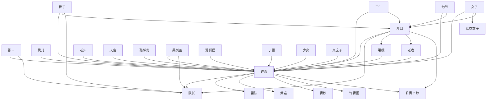

# 人物与关系图：《光阴之外》

## 人物表

### 1. 许青

- 出现次数：57
- 覆盖章节数：56
- 首次出现：第 1 章
- 最后出现：第 1317 章
- 身份/行为线索：人物行为/发言(57)

### 2. 队长

- 出现次数：50
- 覆盖章节数：42
- 首次出现：第 65 章
- 最后出现：第 922 章
- 身份/行为线索：人物行为/发言(50)

### 3. 张三

- 出现次数：10
- 覆盖章节数：8
- 首次出现：第 55 章
- 最后出现：第 716 章
- 身份/行为线索：人物行为/发言(10)

### 4. 七爷

- 出现次数：9
- 覆盖章节数：6
- 首次出现：第 261 章
- 最后出现：第 1323 章
- 身份/行为线索：人物行为/发言(9)

### 5. 雷队

- 出现次数：8
- 覆盖章节数：6
- 首次出现：第 7 章
- 最后出现：第 26 章
- 身份/行为线索：人物行为/发言(8)

### 6. 黄岩

- 出现次数：6
- 覆盖章节数：5
- 首次出现：第 71 章
- 最后出现：第 973 章
- 身份/行为线索：人物行为/发言(6)

### 7. 二牛

- 出现次数：5
- 覆盖章节数：5
- 首次出现：第 926 章
- 最后出现：第 1056 章
- 身份/行为线索：人物行为/发言(5)

### 8. 老者

- 出现次数：4
- 覆盖章节数：4
- 首次出现：第 403 章
- 最后出现：第 1229 章
- 身份/行为线索：人物行为/发言(4)

### 9. 泥狐狸

- 出现次数：4
- 覆盖章节数：4
- 首次出现：第 806 章
- 最后出现：第 1253 章
- 身份/行为线索：人物行为/发言(4)

### 10. 卢米安

- 出现次数：6
- 覆盖章节数：3
- 首次出现：第 536 章
- 最后出现：第 543 章
- 身份/行为线索：人物行为/发言(6)

### 11. 老头

- 出现次数：5
- 覆盖章节数：3
- 首次出现：第 539 章
- 最后出现：第 993 章
- 身份/行为线索：人物行为/发言(5)

### 12. 世子

- 出现次数：4
- 覆盖章节数：3
- 首次出现：第 588 章
- 最后出现：第 607 章
- 身份/行为线索：人物行为/发言(4)

### 13. 丁雪

- 出现次数：3
- 覆盖章节数：3
- 首次出现：第 165 章
- 最后出现：第 302 章
- 身份/行为线索：人物行为/发言(3)

### 14. 玄灵永意门

- 出现次数：3
- 覆盖章节数：3
- 首次出现：第 256 章
- 最后出现：第 295 章
- 身份/行为线索：人物行为/发言(3)

### 15. 玄幽宗

- 出现次数：3
- 覆盖章节数：3
- 首次出现：第 284 章
- 最后出现：第 388 章
- 身份/行为线索：人物行为/发言(3)

### 16. 队长正

- 出现次数：3
- 覆盖章节数：3
- 首次出现：第 344 章
- 最后出现：第 393 章
- 身份/行为线索：人物行为/发言(3)

### 17. 笑眯眯

- 出现次数：3
- 覆盖章节数：3
- 首次出现：第 536 章
- 最后出现：第 543 章
- 身份/行为线索：人物行为/发言(3)

### 18. 灿烂

- 出现次数：3
- 覆盖章节数：3
- 首次出现：第 536 章
- 最后出现：第 543 章
- 身份/行为线索：人物行为/发言(3)

### 19. 卢米安好奇

- 出现次数：3
- 覆盖章节数：3
- 首次出现：第 536 章
- 最后出现：第 543 章
- 身份/行为线索：人物行为/发言(3)

### 20. 莉雅敏锐

- 出现次数：3
- 覆盖章节数：3
- 首次出现：第 536 章
- 最后出现：第 543 章
- 身份/行为线索：人物行为/发言(3)

### 21. 笑嘻嘻

- 出现次数：3
- 覆盖章节数：3
- 首次出现：第 536 章
- 最后出现：第 543 章
- 身份/行为线索：人物行为/发言(3)

### 22. 卢米安的黑发年轻人用

- 出现次数：3
- 覆盖章节数：3
- 首次出现：第 536 章
- 最后出现：第 543 章
- 身份/行为线索：人物行为/发言(3)

### 23. 莉雅的女性展露出了挺

- 出现次数：3
- 覆盖章节数：3
- 首次出现：第 536 章
- 最后出现：第 543 章
- 身份/行为线索：人物行为/发言(3)

### 24. 弗兰克

- 出现次数：3
- 覆盖章节数：3
- 首次出现：第 536 章
- 最后出现：第 543 章
- 身份/行为线索：人物行为/发言(3)

### 25. 皮埃尔的中年男子得意

- 出现次数：3
- 覆盖章节数：3
- 首次出现：第 536 章
- 最后出现：第 543 章
- 身份/行为线索：人物行为/发言(3)

### 26. 兰瑶之女

- 出现次数：3
- 覆盖章节数：3
- 首次出现：第 899 章
- 最后出现：第 906 章
- 身份/行为线索：人物行为/发言(3)

### 27. 雷队的老者

- 出现次数：4
- 覆盖章节数：2
- 首次出现：第 4 章
- 最后出现：第 5 章
- 身份/行为线索：人物行为/发言(4)

### 28. 病鬼

- 出现次数：4
- 覆盖章节数：2
- 首次出现：第 395 章
- 最后出现：第 396 章
- 身份/行为线索：人物行为/发言(4)

### 29. 炎玄子

- 出现次数：3
- 覆盖章节数：2
- 首次出现：第 836 章
- 最后出现：第 997 章
- 身份/行为线索：人物行为/发言(3)

### 30. 海山诀

- 出现次数：2
- 覆盖章节数：2
- 首次出现：第 1 章
- 最后出现：第 3 章
- 身份/行为线索：人物行为/发言(2)

### 31. 许青回

- 出现次数：2
- 覆盖章节数：2
- 首次出现：第 11 章
- 最后出现：第 300 章
- 身份/行为线索：人物行为/发言(2)

### 32. 少女

- 出现次数：2
- 覆盖章节数：2
- 首次出现：第 24 章
- 最后出现：第 393 章
- 身份/行为线索：人物行为/发言(2)

### 33. 周青鹏

- 出现次数：2
- 覆盖章节数：2
- 首次出现：第 68 章
- 最后出现：第 93 章
- 身份/行为线索：人物行为/发言(2)

### 34. 无尽之海

- 出现次数：2
- 覆盖章节数：2
- 首次出现：第 82 章
- 最后出现：第 529 章
- 身份/行为线索：人物行为/发言(2)

### 35. 金乌炼万灵

- 出现次数：2
- 覆盖章节数：2
- 首次出现：第 110 章
- 最后出现：第 233 章
- 身份/行为线索：人物行为/发言(2)

### 36. 弥厄之甲

- 出现次数：2
- 覆盖章节数：2
- 首次出现：第 111 章
- 最后出现：第 114 章
- 身份/行为线索：人物行为/发言(2)

### 37. 紫青上国

- 出现次数：2
- 覆盖章节数：2
- 首次出现：第 206 章
- 最后出现：第 519 章
- 身份/行为线索：人物行为/发言(2)

### 38. 决阳灵尊

- 出现次数：2
- 覆盖章节数：2
- 首次出现：第 271 章
- 最后出现：第 272 章
- 身份/行为线索：人物行为/发言(2)

### 39. 迟若国

- 出现次数：2
- 覆盖章节数：2
- 首次出现：第 280 章
- 最后出现：第 351 章
- 身份/行为线索：人物行为/发言(2)

### 40. 小三灵

- 出现次数：2
- 覆盖章节数：2
- 首次出现：第 280 章
- 最后出现：第 351 章
- 身份/行为线索：人物行为/发言(2)

### 41. 诡幽夺道功

- 出现次数：2
- 覆盖章节数：2
- 首次出现：第 304 章
- 最后出现：第 305 章
- 身份/行为线索：人物行为/发言(2)

### 42. 女子

- 出现次数：2
- 覆盖章节数：2
- 首次出现：第 332 章
- 最后出现：第 576 章
- 身份/行为线索：人物行为/发言(2)

### 43. 许青平静

- 出现次数：2
- 覆盖章节数：2
- 首次出现：第 392 章
- 最后出现：第 1261 章
- 身份/行为线索：人物行为/发言(2)

### 44. 孔祥龙

- 出现次数：2
- 覆盖章节数：2
- 首次出现：第 408 章
- 最后出现：第 494 章
- 身份/行为线索：人物行为/发言(2)

### 45. 缓缓

- 出现次数：2
- 覆盖章节数：2
- 首次出现：第 413 章
- 最后出现：第 434 章
- 身份/行为线索：人物行为/发言(2)

### 46. 青秋

- 出现次数：2
- 覆盖章节数：2
- 首次出现：第 440 章
- 最后出现：第 1000 章
- 身份/行为线索：人物行为/发言(2)

### 47. 仙术殿

- 出现次数：2
- 覆盖章节数：2
- 首次出现：第 506 章
- 最后出现：第 1023 章
- 身份/行为线索：人物行为/发言(2)

### 48. 烛照

- 出现次数：2
- 覆盖章节数：2
- 首次出现：第 519 章
- 最后出现：第 789 章
- 身份/行为线索：人物行为/发言(2)

### 49. 灵渊

- 出现次数：2
- 覆盖章节数：2
- 首次出现：第 521 章
- 最后出现：第 683 章
- 身份/行为线索：人物行为/发言(2)

### 50. 特尺的小国

- 出现次数：2
- 覆盖章节数：2
- 首次出现：第 532 章
- 最后出现：第 533 章
- 身份/行为线索：人物行为/发言(2)

### 51. 灵儿

- 出现次数：2
- 覆盖章节数：2
- 首次出现：第 588 章
- 最后出现：第 663 章
- 身份/行为线索：人物行为/发言(2)

### 52. 青丝如血

- 出现次数：2
- 覆盖章节数：2
- 首次出现：第 613 章
- 最后出现：第 621 章
- 身份/行为线索：人物行为/发言(2)

### 53. 慈悲

- 出现次数：2
- 覆盖章节数：2
- 首次出现：第 692 章
- 最后出现：第 693 章
- 身份/行为线索：人物行为/发言(2)

### 54. 队苌

- 出现次数：2
- 覆盖章节数：2
- 首次出现：第 695 章
- 最后出现：第 701 章
- 身份/行为线索：人物行为/发言(2)

### 55. 煌天

- 出现次数：2
- 覆盖章节数：2
- 首次出现：第 696 章
- 最后出现：第 1320 章
- 身份/行为线索：人物行为/发言(2)

### 56. 许青的人

- 出现次数：2
- 覆盖章节数：2
- 首次出现：第 701 章
- 最后出现：第 713 章
- 身份/行为线索：人物行为/发言(2)

### 57. 玄雷子的弟子

- 出现次数：2
- 覆盖章节数：2
- 首次出现：第 769 章
- 最后出现：第 784 章
- 身份/行为线索：人物行为/发言(2)

### 58. 许青的人族

- 出现次数：2
- 覆盖章节数：2
- 首次出现：第 831 章
- 最后出现：第 977 章
- 身份/行为线索：人物行为/发言(2)

### 59. 开口

- 出现次数：2
- 覆盖章节数：2
- 首次出现：第 918 章
- 最后出现：第 957 章
- 身份/行为线索：人物行为/发言(2)

### 60. 仿佛在诉

- 出现次数：2
- 覆盖章节数：2
- 首次出现：第 927 章
- 最后出现：第 1136 章
- 身份/行为线索：人物行为/发言(2)

### 61. 二牛正

- 出现次数：2
- 覆盖章节数：2
- 首次出现：第 1064 章
- 最后出现：第 1282 章
- 身份/行为线索：人物行为/发言(2)

### 62. 天宫

- 出现次数：2
- 覆盖章节数：2
- 首次出现：第 1075 章
- 最后出现：第 1309 章
- 身份/行为线索：人物行为/发言(2)

### 63. 海山的青年

- 出现次数：3
- 覆盖章节数：1
- 首次出现：第 1089 章
- 最后出现：第 1089 章
- 身份/行为线索：人物行为/发言(3)

### 64. 吴剑巫

- 出现次数：2
- 覆盖章节数：1
- 首次出现：第 248 章
- 最后出现：第 248 章
- 身份/行为线索：人物行为/发言(2)

### 65. 红衣女子

- 出现次数：2
- 覆盖章节数：1
- 首次出现：第 553 章
- 最后出现：第 553 章
- 身份/行为线索：人物行为/发言(2)

### 66. 木道子

- 出现次数：2
- 覆盖章节数：1
- 首次出现：第 587 章
- 最后出现：第 587 章
- 身份/行为线索：人物行为/发言(2)

### 67. 第五人祖

- 出现次数：2
- 覆盖章节数：1
- 首次出现：第 1101 章
- 最后出现：第 1101 章
- 身份/行为线索：人物行为/发言(2)

## 关系边

- 许青 <-> 队长：共现 2768 次，覆盖第 15-1261 章，关系线索：队长(2768)、弟子(34)、师尊(18)、追杀(6)、兄弟(5)、儿子(5)、敌人(4)、姐妹(3)
- 开口 <-> 许青：共现 1884 次，覆盖第 4-1344 章，关系线索：同章共现(1614)、队长(225)、弟子(27)、师尊(14)、保护(3)、兄弟(2)、追杀(2)、对手(2)
- 二牛 <-> 许青：共现 684 次，覆盖第 191-1344 章，关系线索：同章共现(669)、队长(4)、弟子(4)、合作(2)、儿子(1)、朋友(1)、追杀(1)、师尊(1)
- 开口 <-> 队长：共现 480 次，覆盖第 15-983 章，关系线索：队长(480)、师尊(9)、弟子(8)、追杀(1)、交易(1)
- 世子 <-> 许青：共现 385 次，覆盖第 555-1314 章，关系线索：同章共现(339)、队长(38)、师尊(6)、保护(2)、兄弟(2)、姐妹(2)、儿子(1)、弟子(1)
- 七爷 <-> 许青：共现 356 次，覆盖第 10-1344 章，关系线索：同章共现(303)、队长(33)、弟子(13)、师尊(7)、保护(1)
- 张三 <-> 许青：共现 284 次，覆盖第 55-1327 章，关系线索：同章共现(198)、队长(74)、弟子(14)、敌人(3)、朋友(1)、姐妹(1)
- 灵儿 <-> 许青：共现 282 次，覆盖第 126-1329 章，关系线索：同章共现(257)、队长(19)、兄弟(3)、姐妹(3)、保护(2)、师尊(2)、弟子(1)
- 女子 <-> 许青：共现 275 次，覆盖第 47-1334 章，关系线索：同章共现(257)、队长(13)、追杀(2)、弟子(2)、母亲(1)
- 老者 <-> 许青：共现 273 次，覆盖第 4-1306 章，关系线索：同章共现(250)、队长(16)、弟子(5)、同伴(1)、命令(1)、师尊(1)
- 许青 <-> 雷队：共现 251 次，覆盖第 4-1277 章，关系线索：同章共现(243)、队长(6)、对手(1)、敌人(1)、老师(1)、弟子(1)
- 缓缓 <-> 许青：共现 232 次，覆盖第 3-1344 章，关系线索：同章共现(225)、队长(7)
- 老头 <-> 许青：共现 221 次，覆盖第 11-1074 章，关系线索：同章共现(200)、队长(14)、保护(2)、同伴(2)、追杀(2)、弟子(1)、兄弟(1)、姐妹(1)
- 天宫 <-> 许青：共现 203 次，覆盖第 237-891 章，关系线索：同章共现(193)、队长(5)、保护(3)、敌人(1)、弟子(1)、师尊(1)
- 孔祥龙 <-> 许青：共现 195 次，覆盖第 394-919 章，关系线索：同章共现(176)、队长(17)、兄弟(1)、师尊(1)
- 开口 <-> 缓缓：共现 183 次，覆盖第 5-1344 章，关系线索：同章共现(176)、队长(7)
- 吴剑巫 <-> 许青：共现 175 次，覆盖第 147-1007 章，关系线索：同章共现(107)、队长(65)、朋友(1)、弟子(1)、追杀(1)
- 吴剑巫 <-> 队长：共现 164 次，覆盖第 195-800 章，关系线索：队长(164)、女儿(1)
- 泥狐狸 <-> 许青：共现 160 次，覆盖第 575-1263 章，关系线索：同章共现(152)、队长(8)
- 许青 <-> 黄岩：共现 151 次，覆盖第 69-1000 章，关系线索：同章共现(126)、队长(9)、兄弟(8)、朋友(5)、弟子(4)、对手(1)、姐妹(1)、父亲(1)
- 丁雪 <-> 许青：共现 141 次，覆盖第 83-998 章，关系线索：同章共现(123)、弟子(9)、队长(5)、保护(4)、师尊(2)、姐妹(1)、朋友(1)、盟友(1)
- 许青 <-> 青秋：共现 135 次，覆盖第 355-1327 章，关系线索：同章共现(102)、队长(32)、弟子(2)
- 少女 <-> 许青：共现 124 次，覆盖第 19-1090 章，关系线索：同章共现(108)、队长(8)、弟子(4)、盟友(2)、朋友(1)、交易(1)
- 许青 <-> 许青回：共现 116 次，覆盖第 7-1322 章，关系线索：同章共现(105)、队长(8)、弟子(2)、师尊(1)
- 张三 <-> 队长：共现 108 次，覆盖第 55-999 章，关系线索：队长(108)、弟子(4)、敌人(2)、朋友(1)、姐妹(1)
- 许青 <-> 许青平静：共现 107 次，覆盖第 4-1343 章，关系线索：同章共现(99)、队长(4)、弟子(2)、保护(1)、对手(1)
- 女子 <-> 红衣女子：共现 106 次，覆盖第 334-554 章，关系线索：同章共现(100)、队长(5)、同伴(1)
- 世子 <-> 开口：共现 106 次，覆盖第 556-1078 章，关系线索：同章共现(92)、队长(13)、师尊(2)
- 二牛 <-> 开口：共现 103 次，覆盖第 193-1344 章，关系线索：同章共现(99)、队长(2)、兄弟(1)、姐妹(1)、师尊(1)
- 开口 <-> 老者：共现 100 次，覆盖第 4-1231 章，关系线索：同章共现(95)、弟子(2)、队长(2)、师尊(1)
- 世子 <-> 队长：共现 100 次，覆盖第 580-829 章，关系线索：队长(100)、兄弟(2)、姐妹(2)、师尊(1)、交易(1)
- 七爷 <-> 开口：共现 84 次，覆盖第 9-1326 章，关系线索：同章共现(78)、队长(4)、盟友(1)、弟子(1)
- 炎玄子 <-> 许青：共现 84 次，覆盖第 844-1100 章，关系线索：同章共现(71)、队长(12)、对手(1)
- 女子 <-> 开口：共现 75 次，覆盖第 11-1334 章，关系线索：同章共现(71)、下属(2)、队长(1)、弟子(1)
- 开口 <-> 许青平静：共现 69 次，覆盖第 31-1343 章，关系线索：同章共现(65)、队长(2)、弟子(1)、对手(1)
- 队长 <-> 青秋：共现 67 次，覆盖第 357-518 章，关系线索：队长(67)、弟子(1)
- 开口 <-> 老头：共现 63 次，覆盖第 11-992 章，关系线索：同章共现(58)、队长(4)、父亲(1)
- 许青 <-> 队苌：共现 59 次，覆盖第 651-702 章，关系线索：同章共现(55)、队长(4)
- 七爷 <-> 队长：共现 56 次，覆盖第 205-898 章，关系线索：队长(56)、师尊(2)、弟子(1)、兄弟(1)
- 海山诀 <-> 许青：共现 53 次，覆盖第 3-600 章，关系线索：同章共现(53)
- 周青鹏 <-> 许青：共现 53 次，覆盖第 51-276 章，关系线索：同章共现(50)、朋友(1)、兄弟(1)、弟子(1)、队长(1)
- 开口 <-> 雷队：共现 50 次，覆盖第 4-262 章，关系线索：同章共现(47)、队长(3)
- 许青 <-> 金乌炼万灵：共现 49 次，覆盖第 175-545 章，关系线索：同章共现(48)、队长(1)
- 开口 <-> 灵儿：共现 44 次，覆盖第 126-1001 章，关系线索：同章共现(38)、队长(6)
- 吴剑巫 <-> 开口：共现 42 次，覆盖第 195-1304 章，关系线索：同章共现(30)、队长(11)、兄弟(1)、姐妹(1)
- 红衣女子 <-> 许青：共现 40 次，覆盖第 334-554 章，关系线索：同章共现(35)、队长(5)
- 孔祥龙 <-> 开口：共现 39 次，覆盖第 394-919 章，关系线索：同章共现(37)、队长(2)
- 老头 <-> 队长：共现 37 次，覆盖第 61-992 章，关系线索：队长(37)、弟子(3)、女儿(1)、兄弟(1)、姐妹(1)
- 开口 <-> 张三：共现 35 次，覆盖第 56-1000 章，关系线索：同章共现(21)、队长(12)、弟子(2)
- 七爷 <-> 二牛：共现 35 次，覆盖第 507-1327 章，关系线索：同章共现(31)、弟子(3)、师尊(1)
- 煌天 <-> 许青：共现 34 次，覆盖第 695-1344 章，关系线索：同章共现(33)、师尊(1)
- 老者 <-> 队长：共现 33 次，覆盖第 11-641 章，关系线索：队长(33)、弟子(2)
- 灵儿 <-> 老头：共现 33 次，覆盖第 197-707 章，关系线索：同章共现(29)、队长(3)、保护(1)、女儿(1)、兄弟(1)、姐妹(1)
- 孔祥龙 <-> 队长：共现 33 次，覆盖第 395-743 章，关系线索：队长(33)、师尊(2)
- 世子 <-> 灵儿：共现 32 次，覆盖第 584-1328 章，关系线索：同章共现(29)、队长(3)、兄弟(1)、姐妹(1)
- 玄幽宗 <-> 许青：共现 30 次，覆盖第 231-388 章，关系线索：同章共现(20)、队长(9)、弟子(1)
- 少女 <-> 开口：共现 29 次，覆盖第 21-1090 章，关系线索：同章共现(27)、弟子(1)、盟友(1)
- 开口 <-> 黄岩：共现 28 次，覆盖第 70-1299 章，关系线索：同章共现(25)、兄弟(2)、队长(1)
- 开口 <-> 泥狐狸：共现 28 次，覆盖第 576-1253 章，关系线索：同章共现(25)、队长(3)
- 灵儿 <-> 队长：共现 27 次，覆盖第 126-712 章，关系线索：队长(27)、师尊(1)、女儿(1)、兄弟(1)、姐妹(1)
- 炎玄子 <-> 队长：共现 25 次，覆盖第 860-894 章，关系线索：队长(25)
- 丁雪 <-> 开口：共现 23 次，覆盖第 107-528 章，关系线索：同章共现(19)、弟子(1)、朋友(1)、盟友(1)、师尊(1)
- 二牛 <-> 队长：共现 23 次，覆盖第 191-906 章，关系线索：队长(23)
- 丁雪 <-> 七爷：共现 23 次，覆盖第 273-377 章，关系线索：同章共现(23)
- 仙术殿 <-> 许青：共现 22 次，覆盖第 507-1061 章，关系线索：同章共现(19)、队长(1)、弟子(1)、师尊(1)
- 世子 <-> 吴剑巫：共现 21 次，覆盖第 582-705 章，关系线索：同章共现(17)、队长(4)
- 队长 <-> 雷队：共现 20 次，覆盖第 12-122 章，关系线索：队长(20)、敌人(1)
- 灵渊 <-> 许青：共现 20 次，覆盖第 460-1316 章，关系线索：同章共现(20)
- 二牛 <-> 黄岩：共现 20 次，覆盖第 974-1290 章，关系线索：同章共现(20)
- 紫青上国 <-> 许青：共现 19 次，覆盖第 209-1342 章，关系线索：同章共现(19)
- 开口 <-> 青秋：共现 19 次，覆盖第 369-1001 章，关系线索：同章共现(13)、队长(6)
- 老者 <-> 雷队：共现 18 次，覆盖第 4-38 章，关系线索：同章共现(18)
- 女子 <-> 队长：共现 17 次，覆盖第 16-897 章，关系线索：队长(17)、儿子(1)
- 玄幽宗 <-> 队长：共现 17 次，覆盖第 235-388 章，关系线索：队长(17)
- 缓缓 <-> 队长：共现 16 次，覆盖第 12-922 章，关系线索：队长(16)
- 队长 <-> 队长正：共现 16 次，覆盖第 77-900 章，关系线索：队长(16)
- 队长 <-> 黄岩：共现 16 次，覆盖第 96-1000 章，关系线索：队长(16)、朋友(1)、弟子(1)、姐妹(1)、师尊(1)
- 七爷 <-> 缓缓：共现 15 次，覆盖第 98-1330 章，关系线索：同章共现(15)
- 二牛 <-> 吴剑巫：共现 15 次，覆盖第 287-1007 章，关系线索：同章共现(13)、兄弟(1)、姐妹(1)、队长(1)
- 世子 <-> 二牛：共现 15 次，覆盖第 582-677 章，关系线索：同章共现(14)、儿子(1)
- 吴剑巫 <-> 灵儿：共现 14 次，覆盖第 195-706 章，关系线索：同章共现(12)、队长(2)、女儿(1)
- 烛照 <-> 许青：共现 14 次，覆盖第 217-958 章，关系线索：同章共现(9)、队长(3)、父亲(1)、师尊(1)
- 孔祥龙 <-> 青秋：共现 14 次，覆盖第 394-518 章，关系线索：同章共现(7)、队长(6)、师尊(1)
- 二牛 <-> 煌天：共现 14 次，覆盖第 620-1344 章，关系线索：同章共现(14)
- 张三 <-> 黄岩：共现 13 次，覆盖第 71-999 章，关系线索：队长(6)、同章共现(6)、弟子(2)、朋友(1)、姐妹(1)
- 七爷 <-> 煌天：共现 13 次，覆盖第 957-1328 章，关系线索：同章共现(13)
- 缓缓 <-> 老者：共现 12 次，覆盖第 5-1196 章，关系线索：同章共现(11)、队长(1)
- 笑眯眯 <-> 队长：共现 12 次，覆盖第 63-240 章，关系线索：队长(12)、弟子(1)
- 许青 <-> 诡幽夺道功：共现 12 次，覆盖第 304-461 章，关系线索：同章共现(11)、敌人(1)
- 泥狐狸 <-> 队长：共现 12 次，覆盖第 652-812 章，关系线索：队长(12)
- 二牛 <-> 炎玄子：共现 12 次，覆盖第 854-886 章，关系线索：同章共现(11)、队长(1)
- 缓缓 <-> 雷队：共现 11 次，覆盖第 5-23 章，关系线索：同章共现(10)、队长(1)
- 开口 <-> 笑眯眯：共现 11 次，覆盖第 51-1302 章，关系线索：同章共现(6)、队长(3)、弟子(2)、朋友(1)
- 少女 <-> 队长：共现 11 次，覆盖第 126-393 章，关系线索：队长(11)
- 开口 <-> 红衣女子：共现 11 次，覆盖第 336-554 章，关系线索：同章共现(11)
- 周青鹏 <-> 开口：共现 10 次，覆盖第 51-194 章，关系线索：同章共现(10)
- 许青 <-> 队长正：共现 10 次，覆盖第 118-900 章，关系线索：队长(10)
- 二牛 <-> 老头：共现 10 次，覆盖第 195-1305 章，关系线索：同章共现(8)、队长(1)、师尊(1)
- 天宫 <-> 队长：共现 10 次，覆盖第 327-513 章，关系线索：队长(10)、师尊(1)
- 世子 <-> 老头：共现 10 次，覆盖第 586-712 章，关系线索：同章共现(9)、兄弟(1)、姐妹(1)、队长(1)
- 二牛 <-> 二牛正：共现 10 次，覆盖第 692-1282 章，关系线索：同章共现(10)
- 笑眯眯 <-> 许青：共现 9 次，覆盖第 65-1319 章，关系线索：同章共现(6)、队长(3)
- 女子 <-> 老者：共现 9 次，覆盖第 77-1065 章，关系线索：同章共现(9)
- 天宫 <-> 开口：共现 9 次，覆盖第 409-716 章，关系线索：同章共现(5)、保护(3)、师尊(1)、队长(1)
- 灵儿 <-> 灵渊：共现 9 次，覆盖第 460-538 章，关系线索：同章共现(9)
- 吴剑巫 <-> 孔祥龙：共现 9 次，覆盖第 733-1298 章，关系线索：同章共现(8)、队长(1)
- 许青回 <-> 队长：共现 8 次，覆盖第 220-868 章，关系线索：队长(8)
- 开口 <-> 病鬼：共现 8 次，覆盖第 395-396 章，关系线索：同章共现(6)、队长(2)
- 病鬼 <-> 队长：共现 8 次，覆盖第 395-396 章，关系线索：队长(8)
- 病鬼 <-> 许青：共现 8 次，覆盖第 395-957 章，关系线索：同章共现(8)
- 开口 <-> 炎玄子：共现 8 次，覆盖第 860-1100 章，关系线索：同章共现(6)、队长(2)
- 二牛 <-> 张三：共现 8 次，覆盖第 999-1327 章，关系线索：同章共现(8)
- 七爷 <-> 老者：共现 7 次，覆盖第 27-1067 章，关系线索：同章共现(7)
- 丁雪 <-> 队长：共现 7 次，覆盖第 118-341 章，关系线索：队长(7)、弟子(2)、姐妹(1)
- 丁雪 <-> 张三：共现 7 次，覆盖第 118-1304 章，关系线索：同章共现(4)、队长(3)、弟子(1)、姐妹(1)
- 天宫 <-> 老者：共现 7 次，覆盖第 230-303 章，关系线索：同章共现(7)
- 小三灵 <-> 许青：共现 7 次，覆盖第 280-351 章，关系线索：队长(6)、弟子(4)、同章共现(1)
- 许青 <-> 许青的人：共现 7 次，覆盖第 368-1290 章，关系线索：同章共现(6)、队长(1)
- 开口 <-> 木道子：共现 7 次，覆盖第 586-588 章，关系线索：同章共现(5)、师尊(1)、弟子(1)
- 木道子 <-> 许青：共现 7 次，覆盖第 587-588 章，关系线索：同章共现(6)、弟子(1)
- 世子 <-> 队苌：共现 7 次，覆盖第 660-701 章，关系线索：同章共现(6)、队长(1)
- 开口 <-> 队苌：共现 7 次，覆盖第 676-701 章，关系线索：同章共现(7)
- 少女 <-> 灵儿：共现 6 次，覆盖第 126-999 章，关系线索：同章共现(5)、队长(1)
- 女子 <-> 少女：共现 6 次，覆盖第 165-922 章，关系线索：同章共现(6)
- 二牛 <-> 缓缓：共现 6 次，覆盖第 193-1323 章，关系线索：同章共现(5)、师尊(1)
- 吴剑巫 <-> 老头：共现 6 次，覆盖第 195-706 章，关系线索：同章共现(4)、队长(2)、女儿(1)
- 小三灵 <-> 队长：共现 6 次，覆盖第 280-351 章，关系线索：队长(6)、弟子(4)
- 玄灵永意门 <-> 许青：共现 6 次，覆盖第 292-376 章，关系线索：同章共现(6)
- 少女 <-> 老头：共现 6 次，覆盖第 339-460 章，关系线索：同章共现(6)
- 天宫 <-> 孔祥龙：共现 6 次，覆盖第 408-408 章，关系线索：同章共现(5)、兄弟(1)
- 慈悲 <-> 许青：共现 6 次，覆盖第 507-1061 章，关系线索：同章共现(3)、朋友(2)、队长(1)
- 仙术殿 <-> 开口：共现 6 次，覆盖第 1037-1052 章，关系线索：同章共现(6)
- 丁雪 <-> 女子：共现 5 次，覆盖第 165-528 章，关系线索：同章共现(5)
- 少女 <-> 黄岩：共现 5 次，覆盖第 199-275 章，关系线索：同章共现(4)、队长(1)
- 七爷 <-> 天宫：共现 5 次，覆盖第 274-505 章，关系线索：同章共现(5)
- 红衣女子 <-> 队长：共现 5 次，覆盖第 334-336 章，关系线索：队长(5)
- 灵渊 <-> 老头：共现 5 次，覆盖第 460-521 章，关系线索：同章共现(5)
- 木道子 <-> 老者：共现 5 次，覆盖第 586-587 章，关系线索：同章共现(3)、师尊(2)
- 泥狐狸 <-> 队苌：共现 5 次，覆盖第 651-674 章，关系线索：同章共现(4)、队长(1)
- 队苌 <-> 队长：共现 5 次，覆盖第 651-702 章，关系线索：队长(5)
- 二牛 <-> 仙术殿：共现 5 次，覆盖第 693-1052 章，关系线索：同章共现(4)、弟子(1)
- 雷队 <-> 雷队的老者：共现 4 次，覆盖第 4-5 章，关系线索：同章共现(4)
- 老者 <-> 雷队的老者：共现 4 次，覆盖第 4-5 章，关系线索：同章共现(4)
- 女子 <-> 缓缓：共现 4 次，覆盖第 42-553 章，关系线索：同章共现(4)
- 少女 <-> 张三：共现 4 次，覆盖第 95-126 章，关系线索：同章共现(2)、队长(2)
- 许青平静 <-> 队长：共现 4 次，覆盖第 117-903 章，关系线索：队长(4)
- 烛照 <-> 队长：共现 4 次，覆盖第 217-515 章，关系线索：队长(4)、师尊(1)
- 玄幽宗 <-> 老者：共现 4 次，覆盖第 284-285 章，关系线索：队长(2)、同章共现(2)
- 天宫 <-> 诡幽夺道功：共现 4 次，覆盖第 304-412 章，关系线索：敌人(2)、同章共现(2)
- 七爷 <-> 老头：共现 4 次，覆盖第 306-926 章，关系线索：同章共现(3)、师尊(1)
- 决阳灵尊 <-> 许青：共现 4 次，覆盖第 490-491 章，关系线索：同章共现(3)、交易(1)
- 吴剑巫 <-> 女子：共现 4 次，覆盖第 560-561 章，关系线索：同章共现(3)、队长(1)
- 灵儿 <-> 许青回：共现 4 次，覆盖第 567-707 章，关系线索：同章共现(4)
- 世子 <-> 缓缓：共现 4 次，覆盖第 589-635 章，关系线索：同章共现(4)
- 世子 <-> 泥狐狸：共现 4 次，覆盖第 655-701 章，关系线索：同章共现(3)、队长(1)
- 泥狐狸 <-> 灵儿：共现 4 次，覆盖第 656-1328 章，关系线索：同章共现(3)、队长(1)
- 二牛正 <-> 许青：共现 4 次，覆盖第 692-1282 章，关系线索：同章共现(4)
- 女子 <-> 雷队：共现 3 次，覆盖第 16-379 章，关系线索：同章共现(3)
- 少女 <-> 缓缓：共现 3 次，覆盖第 21-126 章，关系线索：同章共现(3)
- 周青鹏 <-> 少女：共现 3 次，覆盖第 51-51 章，关系线索：同章共现(3)

## Mermaid 关系草图

