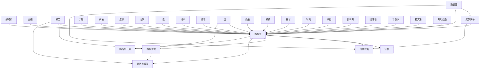

# 人物与关系图：《奥术神座》

## 人物表

### 1. 路西恩

- 出现次数：222
- 覆盖章节数：183
- 首次出现：第 10 章
- 最后出现：第 826 章
- 身份/行为线索：人物行为/发言(222)

### 2. 路西恩点了

- 出现次数：62
- 覆盖章节数：57
- 首次出现：第 7 章
- 最后出现：第 826 章
- 身份/行为线索：人物行为/发言(62)

### 3. 路西恩摇了

- 出现次数：54
- 覆盖章节数：51
- 首次出现：第 16 章
- 最后出现：第 806 章
- 身份/行为线索：人物行为/发言(54)

### 4. 路西恩微

- 出现次数：50
- 覆盖章节数：49
- 首次出现：第 37 章
- 最后出现：第 825 章
- 身份/行为线索：人物行为/发言(50)

### 5. 微微

- 出现次数：51
- 覆盖章节数：40
- 首次出现：第 20 章
- 最后出现：第 914 章
- 身份/行为线索：人物行为/发言(51)

### 6. 呵呵

- 出现次数：45
- 覆盖章节数：40
- 首次出现：第 14 章
- 最后出现：第 873 章
- 身份/行为线索：人物行为/发言(45)

### 7. 摇了

- 出现次数：37
- 覆盖章节数：36
- 首次出现：第 18 章
- 最后出现：第 904 章
- 身份/行为线索：人物行为/发言(37)

### 8. 娜塔莎

- 出现次数：40
- 覆盖章节数：35
- 首次出现：第 65 章
- 最后出现：第 816 章
- 身份/行为线索：人物行为/发言(40)

### 9. 路西恩微微

- 出现次数：36
- 覆盖章节数：34
- 首次出现：第 109 章
- 最后出现：第 698 章
- 身份/行为线索：人物行为/发言(36)

### 10. 路西恩轻轻

- 出现次数：29
- 覆盖章节数：28
- 首次出现：第 137 章
- 最后出现：第 765 章
- 身份/行为线索：人物行为/发言(29)

### 11. 路西恩呵呵

- 出现次数：28
- 覆盖章节数：28
- 首次出现：第 174 章
- 最后出现：第 812 章
- 身份/行为线索：人物行为/发言(28)

### 12. 路西恩笑着摇了

- 出现次数：26
- 覆盖章节数：26
- 首次出现：第 45 章
- 最后出现：第 786 章
- 身份/行为线索：人物行为/发言(26)

### 13. 一边

- 出现次数：26
- 覆盖章节数：25
- 首次出现：第 61 章
- 最后出现：第 909 章
- 身份/行为线索：人物行为/发言(26)

### 14. 轻轻

- 出现次数：26
- 覆盖章节数：25
- 首次出现：第 112 章
- 最后出现：第 886 章
- 身份/行为线索：人物行为/发言(26)

### 15. 继续

- 出现次数：25
- 覆盖章节数：25
- 首次出现：第 4 章
- 最后出现：第 885 章
- 身份/行为线索：人物行为/发言(25)

### 16. 道格拉斯

- 出现次数：30
- 覆盖章节数：24
- 首次出现：第 419 章
- 最后出现：第 917 章
- 身份/行为线索：人物行为/发言(30)

### 17. 于是

- 出现次数：24
- 覆盖章节数：24
- 首次出现：第 41 章
- 最后出现：第 914 章
- 身份/行为线索：人物行为/发言(24)

### 18. 费尔南多

- 出现次数：26
- 覆盖章节数：23
- 首次出现：第 339 章
- 最后出现：第 897 章
- 身份/行为线索：人物行为/发言(26)

### 19. 路西恩疑惑地

- 出现次数：23
- 覆盖章节数：23
- 首次出现：第 101 章
- 最后出现：第 784 章
- 身份/行为线索：人物行为/发言(23)

### 20. 嘿嘿

- 出现次数：23
- 覆盖章节数：23
- 首次出现：第 108 章
- 最后出现：第 908 章
- 身份/行为线索：人物行为/发言(23)

### 21. 路西恩微笑

- 出现次数：20
- 覆盖章节数：20
- 首次出现：第 109 章
- 最后出现：第 825 章
- 身份/行为线索：人物行为/发言(20)

### 22. 微笑

- 出现次数：18
- 覆盖章节数：18
- 首次出现：第 106 章
- 最后出现：第 882 章
- 身份/行为线索：人物行为/发言(18)

### 23. 娜塔莎点了

- 出现次数：14
- 覆盖章节数：14
- 首次出现：第 82 章
- 最后出现：第 764 章
- 身份/行为线索：人物行为/发言(14)

### 24. 说着

- 出现次数：13
- 覆盖章节数：13
- 首次出现：第 8 章
- 最后出现：第 846 章
- 身份/行为线索：人物行为/发言(13)

### 25. 路西恩好笑地

- 出现次数：13
- 覆盖章节数：13
- 首次出现：第 9 章
- 最后出现：第 806 章
- 身份/行为线索：人物行为/发言(13)

### 26. 道格拉斯呵呵

- 出现次数：13
- 覆盖章节数：13
- 首次出现：第 432 章
- 最后出现：第 873 章
- 身份/行为线索：人物行为/发言(13)

### 27. 眼睁睁

- 出现次数：13
- 覆盖章节数：12
- 首次出现：第 55 章
- 最后出现：第 899 章
- 身份/行为线索：人物行为/发言(13)

### 28. 娜塔莎嘿嘿

- 出现次数：13
- 覆盖章节数：12
- 首次出现：第 99 章
- 最后出现：第 719 章
- 身份/行为线索：人物行为/发言(13)

### 29. 疑惑地

- 出现次数：12
- 覆盖章节数：12
- 首次出现：第 11 章
- 最后出现：第 728 章
- 身份/行为线索：人物行为/发言(12)

### 30. 而是

- 出现次数：12
- 覆盖章节数：11
- 首次出现：第 17 章
- 最后出现：第 777 章
- 身份/行为线索：人物行为/发言(12)

### 31. 接着

- 出现次数：12
- 覆盖章节数：11
- 首次出现：第 116 章
- 最后出现：第 819 章
- 身份/行为线索：人物行为/发言(12)

### 32. 路西恩继续

- 出现次数：11
- 覆盖章节数：11
- 首次出现：第 180 章
- 最后出现：第 800 章
- 身份/行为线索：人物行为/发言(11)

### 33. 道格拉斯轻轻

- 出现次数：11
- 覆盖章节数：11
- 首次出现：第 220 章
- 最后出现：第 868 章
- 身份/行为线索：人物行为/发言(11)

### 34. 轻轻点了

- 出现次数：11
- 覆盖章节数：11
- 首次出现：第 290 章
- 最后出现：第 899 章
- 身份/行为线索：人物行为/发言(11)

### 35. 莱茵

- 出现次数：12
- 覆盖章节数：10
- 首次出现：第 92 章
- 最后出现：第 784 章
- 身份/行为线索：人物行为/发言(12)

### 36. 奥利弗

- 出现次数：10
- 覆盖章节数：10
- 首次出现：第 460 章
- 最后出现：第 904 章
- 身份/行为线索：人物行为/发言(10)

### 37. 好奇地

- 出现次数：10
- 覆盖章节数：9
- 首次出现：第 70 章
- 最后出现：第 880 章
- 身份/行为线索：人物行为/发言(10)

### 38. 静静地

- 出现次数：9
- 覆盖章节数：9
- 首次出现：第 22 章
- 最后出现：第 802 章
- 身份/行为线索：人物行为/发言(9)

### 39. 于是微

- 出现次数：9
- 覆盖章节数：9
- 首次出现：第 194 章
- 最后出现：第 754 章
- 身份/行为线索：人物行为/发言(9)

### 40. 路西恩轻轻点了

- 出现次数：9
- 覆盖章节数：9
- 首次出现：第 316 章
- 最后出现：第 770 章
- 身份/行为线索：人物行为/发言(9)

### 41. 道格拉斯点了

- 出现次数：9
- 覆盖章节数：9
- 首次出现：第 600 章
- 最后出现：第 902 章
- 身份/行为线索：人物行为/发言(9)

### 42. 费尔南多点了

- 出现次数：9
- 覆盖章节数：8
- 首次出现：第 554 章
- 最后出现：第 915 章
- 身份/行为线索：人物行为/发言(9)

### 43. 路西恩一边

- 出现次数：8
- 覆盖章节数：8
- 首次出现：第 5 章
- 最后出现：第 773 章
- 身份/行为线索：人物行为/发言(8)

### 44. 直接

- 出现次数：8
- 覆盖章节数：8
- 首次出现：第 16 章
- 最后出现：第 879 章
- 身份/行为线索：人物行为/发言(8)

### 45. 于是点了

- 出现次数：8
- 覆盖章节数：8
- 首次出现：第 22 章
- 最后出现：第 916 章
- 身份/行为线索：人物行为/发言(8)

### 46. 满意地点了

- 出现次数：8
- 覆盖章节数：8
- 首次出现：第 60 章
- 最后出现：第 778 章
- 身份/行为线索：人物行为/发言(8)

### 47. 娜塔莎疑惑地

- 出现次数：8
- 覆盖章节数：8
- 首次出现：第 64 章
- 最后出现：第 816 章
- 身份/行为线索：人物行为/发言(8)

### 48. 再次

- 出现次数：8
- 覆盖章节数：8
- 首次出现：第 92 章
- 最后出现：第 884 章
- 身份/行为线索：人物行为/发言(8)

### 49. 大声

- 出现次数：8
- 覆盖章节数：8
- 首次出现：第 125 章
- 最后出现：第 728 章
- 身份/行为线索：人物行为/发言(8)

### 50. 他微

- 出现次数：8
- 覆盖章节数：8
- 首次出现：第 170 章
- 最后出现：第 889 章
- 身份/行为线索：人物行为/发言(8)

### 51. 娜塔莎摇了

- 出现次数：8
- 覆盖章节数：8
- 首次出现：第 303 章
- 最后出现：第 758 章
- 身份/行为线索：人物行为/发言(8)

### 52. 赶紧

- 出现次数：8
- 覆盖章节数：8
- 首次出现：第 353 章
- 最后出现：第 775 章
- 身份/行为线索：人物行为/发言(8)

### 53. 道格拉斯摇了

- 出现次数：8
- 覆盖章节数：8
- 首次出现：第 548 章
- 最后出现：第 901 章
- 身份/行为线索：人物行为/发言(8)

### 54. 道格拉斯微微

- 出现次数：8
- 覆盖章节数：7
- 首次出现：第 566 章
- 最后出现：第 915 章
- 身份/行为线索：人物行为/发言(8)

### 55. 自嘲地

- 出现次数：7
- 覆盖章节数：7
- 首次出现：第 15 章
- 最后出现：第 864 章
- 身份/行为线索：人物行为/发言(7)

### 56. 他摇了

- 出现次数：7
- 覆盖章节数：7
- 首次出现：第 50 章
- 最后出现：第 910 章
- 身份/行为线索：人物行为/发言(7)

### 57. 含笑

- 出现次数：7
- 覆盖章节数：7
- 首次出现：第 83 章
- 最后出现：第 871 章
- 身份/行为线索：人物行为/发言(7)

### 58. 娜塔莎干

- 出现次数：7
- 覆盖章节数：7
- 首次出现：第 116 章
- 最后出现：第 756 章
- 身份/行为线索：人物行为/发言(7)

### 59. 路西恩嘿嘿

- 出现次数：7
- 覆盖章节数：7
- 首次出现：第 158 章
- 最后出现：第 826 章
- 身份/行为线索：人物行为/发言(7)

### 60. 路西恩笑着点了

- 出现次数：7
- 覆盖章节数：7
- 首次出现：第 161 章
- 最后出现：第 673 章
- 身份/行为线索：人物行为/发言(7)

### 61. 随口

- 出现次数：7
- 覆盖章节数：7
- 首次出现：第 182 章
- 最后出现：第 846 章
- 身份/行为线索：人物行为/发言(7)

### 62. 温和

- 出现次数：7
- 覆盖章节数：7
- 首次出现：第 240 章
- 最后出现：第 471 章
- 身份/行为线索：人物行为/发言(7)

### 63. 费尔南多摇了

- 出现次数：7
- 覆盖章节数：7
- 首次出现：第 425 章
- 最后出现：第 624 章
- 身份/行为线索：人物行为/发言(7)

### 64. 克托尼亚

- 出现次数：7
- 覆盖章节数：7
- 首次出现：第 515 章
- 最后出现：第 873 章
- 身份/行为线索：人物行为/发言(7)

### 65. 海瑟薇

- 出现次数：8
- 覆盖章节数：6
- 首次出现：第 498 章
- 最后出现：第 900 章
- 身份/行为线索：人物行为/发言(8)

### 66. 拉文第

- 出现次数：7
- 覆盖章节数：6
- 首次出现：第 211 章
- 最后出现：第 602 章
- 身份/行为线索：人物行为/发言(7)

### 67. 费尔南多微微

- 出现次数：7
- 覆盖章节数：6
- 首次出现：第 330 章
- 最后出现：第 913 章
- 身份/行为线索：人物行为/发言(7)

### 68. 他呵呵

- 出现次数：7
- 覆盖章节数：6
- 首次出现：第 472 章
- 最后出现：第 798 章
- 身份/行为线索：人物行为/发言(7)

### 69. 低声

- 出现次数：6
- 覆盖章节数：6
- 首次出现：第 18 章
- 最后出现：第 804 章
- 身份/行为线索：人物行为/发言(6)

### 70. 路西恩满意地点了

- 出现次数：6
- 覆盖章节数：6
- 首次出现：第 45 章
- 最后出现：第 757 章
- 身份/行为线索：人物行为/发言(6)

### 71. 忽然

- 出现次数：6
- 覆盖章节数：6
- 首次出现：第 47 章
- 最后出现：第 875 章
- 身份/行为线索：人物行为/发言(6)

### 72. 奇怪地

- 出现次数：6
- 覆盖章节数：6
- 首次出现：第 53 章
- 最后出现：第 771 章
- 身份/行为线索：人物行为/发言(6)

### 73. 娜塔莎忽然

- 出现次数：6
- 覆盖章节数：6
- 首次出现：第 77 章
- 最后出现：第 507 章
- 身份/行为线索：人物行为/发言(6)

### 74. 莱茵摇了

- 出现次数：6
- 覆盖章节数：6
- 首次出现：第 90 章
- 最后出现：第 640 章
- 身份/行为线索：人物行为/发言(6)

### 75. 娜塔莎微微

- 出现次数：6
- 覆盖章节数：6
- 首次出现：第 101 章
- 最后出现：第 759 章
- 身份/行为线索：人物行为/发言(6)

### 76. 路西恩认真地

- 出现次数：6
- 覆盖章节数：6
- 首次出现：第 106 章
- 最后出现：第 584 章
- 身份/行为线索：人物行为/发言(6)

### 77. 短暂的

- 出现次数：6
- 覆盖章节数：6
- 首次出现：第 117 章
- 最后出现：第 863 章
- 身份/行为线索：人物行为/发言(6)

### 78. 于是轻轻

- 出现次数：6
- 覆盖章节数：6
- 首次出现：第 129 章
- 最后出现：第 879 章
- 身份/行为线索：人物行为/发言(6)

### 79. 只能眼睁睁

- 出现次数：6
- 覆盖章节数：6
- 首次出现：第 259 章
- 最后出现：第 908 章
- 身份/行为线索：人物行为/发言(6)

### 80. 费尔南多嘿嘿

- 出现次数：6
- 覆盖章节数：6
- 首次出现：第 334 章
- 最后出现：第 891 章
- 身份/行为线索：人物行为/发言(6)

### 81. 仔细

- 出现次数：6
- 覆盖章节数：6
- 首次出现：第 340 章
- 最后出现：第 649 章
- 身份/行为线索：人物行为/发言(6)

### 82. 卡特里娜

- 出现次数：6
- 覆盖章节数：6
- 首次出现：第 343 章
- 最后出现：第 753 章
- 身份/行为线索：人物行为/发言(6)

### 83. 道格拉斯微

- 出现次数：6
- 覆盖章节数：6
- 首次出现：第 353 章
- 最后出现：第 901 章
- 身份/行为线索：人物行为/发言(6)

### 84. 专注地

- 出现次数：6
- 覆盖章节数：6
- 首次出现：第 358 章
- 最后出现：第 885 章
- 身份/行为线索：人物行为/发言(6)

### 85. 路西恩低声

- 出现次数：6
- 覆盖章节数：6
- 首次出现：第 490 章
- 最后出现：第 822 章
- 身份/行为线索：人物行为/发言(6)

### 86. 本笃三世

- 出现次数：6
- 覆盖章节数：6
- 首次出现：第 569 章
- 最后出现：第 736 章
- 身份/行为线索：人物行为/发言(6)

### 87. 埃里克

- 出现次数：7
- 覆盖章节数：5
- 首次出现：第 214 章
- 最后出现：第 424 章
- 身份/行为线索：人物行为/发言(7)

### 88. 雷克斯

- 出现次数：6
- 覆盖章节数：5
- 首次出现：第 368 章
- 最后出现：第 542 章
- 身份/行为线索：人物行为/发言(6)

### 89. 一直

- 出现次数：5
- 覆盖章节数：5
- 首次出现：第 5 章
- 最后出现：第 649 章
- 身份/行为线索：人物行为/发言(5)

### 90. 严肃地

- 出现次数：5
- 覆盖章节数：5
- 首次出现：第 16 章
- 最后出现：第 830 章
- 身份/行为线索：人物行为/发言(5)

### 91. 认真地

- 出现次数：5
- 覆盖章节数：5
- 首次出现：第 23 章
- 最后出现：第 874 章
- 身份/行为线索：人物行为/发言(5)

### 92. 路西恩感

- 出现次数：5
- 覆盖章节数：5
- 首次出现：第 34 章
- 最后出现：第 645 章
- 身份/行为线索：人物行为/发言(5)

### 93. 又摇了

- 出现次数：5
- 覆盖章节数：5
- 首次出现：第 37 章
- 最后出现：第 842 章
- 身份/行为线索：人物行为/发言(5)

### 94. 路西恩礼貌地

- 出现次数：5
- 覆盖章节数：5
- 首次出现：第 46 章
- 最后出现：第 484 章
- 身份/行为线索：人物行为/发言(5)

### 95. 郑重地

- 出现次数：5
- 覆盖章节数：5
- 首次出现：第 50 章
- 最后出现：第 694 章
- 身份/行为线索：人物行为/发言(5)

### 96. 路西恩郑重地点了

- 出现次数：5
- 覆盖章节数：5
- 首次出现：第 78 章
- 最后出现：第 765 章
- 身份/行为线索：人物行为/发言(5)

### 97. 静静

- 出现次数：5
- 覆盖章节数：5
- 首次出现：第 81 章
- 最后出现：第 898 章
- 身份/行为线索：人物行为/发言(5)

### 98. 路西恩奇怪地

- 出现次数：5
- 覆盖章节数：5
- 首次出现：第 91 章
- 最后出现：第 804 章
- 身份/行为线索：人物行为/发言(5)

### 99. 路西恩摇头

- 出现次数：5
- 覆盖章节数：5
- 首次出现：第 94 章
- 最后出现：第 647 章
- 身份/行为线索：人物行为/发言(5)

### 100. 路西恩好笑地摇了

- 出现次数：5
- 覆盖章节数：5
- 首次出现：第 107 章
- 最后出现：第 779 章
- 身份/行为线索：人物行为/发言(5)

## 关系边

- 娜塔莎 <-> 路西恩：共现 1436 次，覆盖第 28-843 章，关系线索：同章共现(1297)、朋友(35)、老师(24)、保护(18)、父亲(16)、敌人(12)、学生(8)、追杀(8)
- 直接 <-> 路西恩：共现 597 次，覆盖第 2-825 章，关系线索：同章共现(532)、老师(29)、朋友(9)、学生(5)、追杀(4)、敌人(4)、保护(4)、合作(2)
- 微笑 <-> 路西恩：共现 537 次，覆盖第 9-856 章，关系线索：同章共现(472)、老师(29)、学生(12)、朋友(9)、保护(4)、敌人(4)、追杀(2)、合作(2)
- 费尔南多 <-> 路西恩：共现 500 次，覆盖第 200-826 章，关系线索：同章共现(391)、老师(83)、学生(24)、弟子(3)、朋友(2)、保护(2)、合作(2)、妻子(1)
- 于是 <-> 路西恩：共现 482 次，覆盖第 2-826 章，关系线索：同章共现(444)、老师(17)、朋友(6)、学生(6)、合作(2)、命令(2)、丈夫(2)、母亲(1)
- 莱茵 <-> 路西恩：共现 447 次，覆盖第 9-810 章，关系线索：同章共现(420)、老师(8)、朋友(5)、敌人(5)、学生(4)、母亲(2)、合作(2)、追杀(2)
- 费尔南多 <-> 道格拉斯：共现 423 次，覆盖第 220-917 章，关系线索：同章共现(377)、老师(15)、合作(11)、学生(8)、朋友(5)、敌人(2)、队长(2)、命令(2)
- 忽然 <-> 路西恩：共现 369 次，覆盖第 7-856 章，关系线索：同章共现(344)、老师(10)、朋友(8)、学生(4)、父亲(2)、同伴(1)、命令(1)、保护(1)
- 再次 <-> 路西恩：共现 363 次，覆盖第 2-856 章，关系线索：同章共现(343)、学生(5)、老师(4)、朋友(4)、保护(3)、背叛(2)、敌人(1)、弟子(1)
- 一直 <-> 路西恩：共现 355 次，覆盖第 1-843 章，关系线索：同章共现(311)、老师(19)、学生(9)、父亲(5)、保护(4)、敌人(3)、朋友(3)、弟子(2)
- 继续 <-> 路西恩：共现 354 次，覆盖第 2-825 章，关系线索：同章共现(328)、老师(6)、学生(5)、朋友(5)、敌人(3)、父亲(1)、女儿(1)、队长(1)
- 路西恩 <-> 道格拉斯：共现 346 次，覆盖第 24-855 章，关系线索：同章共现(308)、老师(18)、学生(10)、合作(4)、朋友(3)、对手(2)、敌人(1)、下属(1)
- 接着 <-> 路西恩：共现 338 次，覆盖第 8-822 章，关系线索：同章共现(310)、老师(10)、朋友(4)、保护(4)、学生(4)、追杀(2)、同伴(1)、父亲(1)
- 一边 <-> 路西恩：共现 333 次，覆盖第 2-825 章，关系线索：同章共现(313)、保护(5)、老师(5)、朋友(4)、学生(2)、同伴(1)、母亲(1)、兄弟(1)
- 路西恩 <-> 轻轻：共现 330 次，覆盖第 4-826 章，关系线索：同章共现(306)、老师(8)、朋友(6)、学生(3)、弟子(2)、父亲(2)、保护(2)、合作(1)
- 而是 <-> 路西恩：共现 328 次，覆盖第 5-856 章，关系线索：同章共现(293)、老师(10)、学生(6)、保护(5)、朋友(4)、敌人(3)、命令(3)、追杀(2)
- 微微 <-> 路西恩：共现 304 次，覆盖第 4-825 章，关系线索：同章共现(286)、老师(7)、朋友(2)、敌人(2)、合作(2)、同伴(1)、妻子(1)、弟子(1)
- 路西恩 <-> 路西恩微：共现 245 次，覆盖第 4-825 章，关系线索：同章共现(223)、老师(10)、学生(5)、朋友(4)、保护(1)、同伴(1)、妻子(1)、背叛(1)
- 摇了 <-> 路西恩：共现 205 次，覆盖第 12-826 章，关系线索：同章共现(183)、老师(6)、朋友(4)、父亲(3)、学生(2)、保护(2)、敌人(2)、同伴(1)
- 呵呵 <-> 路西恩：共现 203 次，覆盖第 10-856 章，关系线索：同章共现(173)、老师(8)、朋友(5)、学生(5)、敌人(3)、保护(2)、合作(2)、女儿(1)
- 仔细 <-> 路西恩：共现 194 次，覆盖第 2-810 章，关系线索：同章共现(179)、老师(7)、朋友(3)、父亲(1)、弟子(1)、同伴(1)、学生(1)、对手(1)
- 海瑟薇 <-> 费尔南多：共现 179 次，覆盖第 220-916 章，关系线索：同章共现(164)、学生(5)、老师(5)、合作(3)、弟子(1)、妻子(1)、父亲(1)、女儿(1)
- 海瑟薇 <-> 路西恩：共现 176 次，覆盖第 171-818 章，关系线索：同章共现(137)、老师(22)、学生(5)、弟子(2)、母亲(2)、父亲(2)、敌人(2)、保护(2)
- 微笑 <-> 路西恩微：共现 166 次，覆盖第 9-825 章，关系线索：同章共现(149)、老师(8)、朋友(4)、学生(4)、保护(1)、背叛(1)、敌人(1)
- 奥利弗 <-> 路西恩：共现 155 次，覆盖第 43-824 章，关系线索：同章共现(136)、老师(10)、合作(3)、妻子(2)、学生(2)、丈夫(1)、敌人(1)、背叛(1)
- 路西恩 <-> 路西恩微笑：共现 152 次，覆盖第 9-825 章，关系线索：同章共现(137)、老师(6)、朋友(4)、学生(4)、保护(1)、背叛(1)、敌人(1)
- 路西恩微 <-> 路西恩微笑：共现 152 次，覆盖第 9-825 章，关系线索：同章共现(137)、老师(6)、朋友(4)、学生(4)、保护(1)、背叛(1)、敌人(1)
- 微笑 <-> 路西恩微笑：共现 151 次，覆盖第 9-825 章，关系线索：同章共现(136)、老师(6)、朋友(4)、学生(4)、保护(1)、背叛(1)、敌人(1)
- 疑惑地 <-> 路西恩：共现 145 次，覆盖第 2-789 章，关系线索：同章共现(132)、老师(5)、朋友(2)、合作(2)、学生(1)、保护(1)、下属(1)、交易(1)
- 下意识 <-> 路西恩：共现 136 次，覆盖第 3-830 章，关系线索：同章共现(130)、老师(3)、保护(1)、师父(1)、朋友(1)
- 海瑟薇 <-> 道格拉斯：共现 131 次，覆盖第 220-916 章，关系线索：同章共现(124)、老师(2)、合作(2)、对手(1)、妻子(1)、追杀(1)
- 拉文第 <-> 路西恩：共现 121 次，覆盖第 210-786 章，关系线索：同章共现(109)、老师(7)、学生(3)、丈夫(2)、朋友(1)、保护(1)、弟子(1)
- 路西恩 <-> 路西恩一边：共现 116 次，覆盖第 2-809 章，关系线索：同章共现(112)、老师(2)、保护(1)、朋友(1)
- 一边 <-> 路西恩一边：共现 116 次，覆盖第 2-809 章，关系线索：同章共现(112)、老师(2)、保护(1)、朋友(1)
- 弗朗西斯 <-> 路西恩：共现 111 次，覆盖第 411-720 章，关系线索：同章共现(103)、追杀(3)、同伴(1)、兄弟(1)、姐妹(1)、敌人(1)、命令(1)、背叛(1)
- 埃里克 <-> 路西恩：共现 110 次，覆盖第 136-442 章，关系线索：同章共现(109)、老师(1)、朋友(1)
- 娜塔莎 <-> 直接：共现 105 次，覆盖第 77-765 章，关系线索：同章共现(94)、朋友(3)、老师(3)、父亲(2)、背叛(1)、保护(1)、对手(1)、母亲(1)
- 路西恩 <-> 静静：共现 104 次，覆盖第 15-810 章，关系线索：同章共现(98)、保护(2)、合作(2)、朋友(1)、学生(1)
- 赶紧 <-> 路西恩：共现 104 次，覆盖第 23-826 章，关系线索：同章共现(90)、老师(11)、朋友(2)、队长(1)、学生(1)
- 路西恩 <-> 路西恩忽然：共现 103 次，覆盖第 7-818 章，关系线索：同章共现(94)、老师(4)、学生(3)、朋友(3)、命令(1)、背叛(1)、敌人(1)
- 忽然 <-> 路西恩忽然：共现 103 次，覆盖第 7-818 章，关系线索：同章共现(94)、老师(4)、学生(3)、朋友(3)、命令(1)、背叛(1)、敌人(1)
- 温和 <-> 路西恩：共现 102 次，覆盖第 12-826 章，关系线索：同章共现(91)、朋友(6)、学生(2)、老师(2)、母亲(1)、敌人(1)、保护(1)
- 布鲁克 <-> 路西恩：共现 102 次，覆盖第 169-818 章，关系线索：同章共现(85)、老师(10)、学生(4)、朋友(2)、敌人(2)、对手(1)、合作(1)
- 路西恩 <-> 路西恩轻轻：共现 101 次，覆盖第 9-810 章，关系线索：同章共现(97)、父亲(2)、朋友(1)、老师(1)
- 路西恩轻轻 <-> 轻轻：共现 101 次，覆盖第 9-810 章，关系线索：同章共现(97)、父亲(2)、朋友(1)、老师(1)
- 低声 <-> 路西恩：共现 100 次，覆盖第 4-822 章，关系线索：同章共现(92)、朋友(4)、老师(2)、学生(1)、父亲(1)、弟子(1)
- 布鲁克 <-> 道格拉斯：共现 100 次，覆盖第 220-815 章，关系线索：同章共现(88)、学生(6)、老师(3)、背叛(1)、敌人(1)、对手(1)、妻子(1)、合作(1)
- 认真地 <-> 路西恩：共现 94 次，覆盖第 2-806 章，关系线索：同章共现(87)、敌人(2)、老师(2)、学生(1)、朋友(1)、保护(1)
- 路西恩 <-> 路西恩微微：共现 88 次，覆盖第 4-754 章，关系线索：同章共现(81)、老师(4)、同伴(1)、妻子(1)、学生(1)
- 微微 <-> 路西恩微：共现 88 次，覆盖第 4-754 章，关系线索：同章共现(81)、老师(4)、同伴(1)、妻子(1)、学生(1)
- 路西恩微 <-> 路西恩微微：共现 88 次，覆盖第 4-754 章，关系线索：同章共现(81)、老师(4)、同伴(1)、妻子(1)、学生(1)
- 微微 <-> 路西恩微微：共现 88 次，覆盖第 4-754 章，关系线索：同章共现(81)、老师(4)、同伴(1)、妻子(1)、学生(1)
- 娜塔莎 <-> 接着：共现 82 次，覆盖第 82-804 章，关系线索：同章共现(75)、朋友(3)、保护(2)、父亲(1)、学生(1)、追杀(1)、老师(1)
- 好奇地 <-> 路西恩：共现 81 次，覆盖第 2-806 章，关系线索：同章共现(66)、老师(11)、学生(2)、丈夫(1)、合作(1)、朋友(1)
- 说着 <-> 路西恩：共现 81 次，覆盖第 4-826 章，关系线索：同章共现(74)、老师(5)、学生(1)、敌人(1)
- 静静 <-> 静静地：共现 77 次，覆盖第 1-912 章，关系线索：同章共现(74)、合作(2)、同伴(1)
- 直接 <-> 费尔南多：共现 76 次，覆盖第 201-911 章，关系线索：同章共现(62)、老师(9)、追杀(2)、敌人(1)、学生(1)、交易(1)、朋友(1)
- 直接 <-> 而是：共现 73 次，覆盖第 38-911 章，关系线索：同章共现(64)、老师(2)、敌人(1)、父亲(1)、学生(1)、儿子(1)、朋友(1)、导师(1)
- 路西恩 <-> 路西恩感：共现 69 次，覆盖第 7-785 章，关系线索：同章共现(64)、老师(4)、保护(2)
- 再次 <-> 娜塔莎：共现 68 次，覆盖第 96-821 章，关系线索：同章共现(63)、保护(2)、朋友(1)、老师(1)、命令(1)、父亲(1)
- 娜塔莎 <-> 海瑟薇：共现 67 次，覆盖第 171-765 章，关系线索：同章共现(53)、老师(5)、保护(4)、父亲(3)、弟子(1)、母亲(1)、敌人(1)
- 奥利弗 <-> 道格拉斯：共现 67 次，覆盖第 220-915 章，关系线索：同章共现(61)、老师(1)、丈夫(1)、妻子(1)、学生(1)、敌人(1)、合作(1)
- 路西恩 <-> 路西恩点了：共现 66 次，覆盖第 7-826 章，关系线索：同章共现(60)、老师(3)、学生(1)、保护(1)、下属(1)
- 于是 <-> 娜塔莎：共现 66 次，覆盖第 18-826 章，关系线索：同章共现(59)、老师(3)、朋友(1)、队长(1)、盟友(1)、命令(1)
- 娜塔莎 <-> 微笑：共现 66 次，覆盖第 58-785 章，关系线索：同章共现(58)、朋友(2)、女儿(2)、老师(2)、父亲(1)、妻子(1)
- 回头 <-> 路西恩：共现 65 次，覆盖第 11-805 章，关系线索：同章共现(62)、学生(1)、儿子(1)、老师(1)
- 路西恩 <-> 随口：共现 63 次，覆盖第 12-787 章，关系线索：同章共现(57)、老师(4)、学生(1)、父亲(1)
- 布鲁克 <-> 费尔南多：共现 63 次，覆盖第 220-818 章，关系线索：同章共现(59)、老师(1)、妻子(1)、学生(1)、合作(1)
- 奥利弗 <-> 费尔南多：共现 62 次，覆盖第 220-915 章，关系线索：同章共现(54)、老师(3)、学生(2)、合作(2)、妻子(1)
- 布鲁克 <-> 海瑟薇：共现 62 次，覆盖第 220-818 章，关系线索：同章共现(58)、老师(2)、对手(1)、妻子(1)
- 摇了 <-> 笑着摇了：共现 61 次，覆盖第 28-875 章，关系线索：同章共现(55)、学生(1)、父亲(1)、合作(1)、敌人(1)、朋友(1)、老师(1)
- 娜塔莎 <-> 忽然：共现 61 次，覆盖第 64-821 章，关系线索：同章共现(59)、父亲(1)、朋友(1)
- 嘿嘿 <-> 娜塔莎：共现 61 次，覆盖第 65-821 章，关系线索：同章共现(55)、老师(2)、学生(1)、朋友(1)、父亲(1)、敌人(1)、丈夫(1)
- 含笑 <-> 路西恩：共现 60 次，覆盖第 47-826 章，关系线索：同章共现(53)、老师(4)、合作(1)、朋友(1)、保护(1)
- 嘿嘿 <-> 路西恩：共现 60 次，覆盖第 52-826 章，关系线索：同章共现(51)、老师(4)、朋友(3)、学生(1)、同伴(1)、背叛(1)、敌人(1)
- 严肃地 <-> 路西恩：共现 59 次，覆盖第 4-814 章，关系线索：同章共现(48)、老师(6)、朋友(2)、学生(1)、父亲(1)、同伴(1)、命令(1)
- 路西恩 <-> 路西恩摇了：共现 59 次，覆盖第 16-806 章，关系线索：同章共现(52)、保护(2)、朋友(1)、对手(1)、敌人(1)、老师(1)、学生(1)
- 摇了 <-> 路西恩摇了：共现 59 次，覆盖第 16-806 章，关系线索：同章共现(52)、保护(2)、朋友(1)、对手(1)、敌人(1)、老师(1)、学生(1)
- 娜塔莎 <-> 微微：共现 59 次，覆盖第 64-816 章，关系线索：同章共现(54)、敌人(1)、朋友(1)、女儿(1)、保护(1)、父亲(1)
- 一直 <-> 娜塔莎：共现 58 次，覆盖第 65-843 章，关系线索：同章共现(47)、父亲(4)、保护(3)、母亲(2)、敌人(1)、朋友(1)、背叛(1)、老师(1)
- 路西恩 <-> 路西恩疑惑地：共现 57 次，覆盖第 12-789 章，关系线索：同章共现(54)、下属(1)、老师(1)、母亲(1)、合作(1)
- 疑惑地 <-> 路西恩疑惑地：共现 57 次，覆盖第 12-789 章，关系线索：同章共现(54)、下属(1)、老师(1)、母亲(1)、合作(1)
- 娜塔莎 <-> 继续：共现 57 次，覆盖第 57-804 章，关系线索：同章共现(52)、朋友(2)、父亲(1)、队长(1)、背叛(1)、老师(1)
- 奥利弗 <-> 布鲁克：共现 57 次，覆盖第 220-821 章，关系线索：同章共现(53)、老师(2)、妻子(1)、保护(1)
- 费尔南多 <-> 轻轻：共现 57 次，覆盖第 330-917 章，关系线索：同章共现(48)、学生(5)、老师(4)、弟子(1)
- 娜塔莎 <-> 轻轻：共现 56 次，覆盖第 65-764 章，关系线索：同章共现(50)、朋友(3)、老师(1)、合作(1)、保护(1)
- 微微 <-> 微笑：共现 55 次，覆盖第 46-838 章，关系线索：同章共现(45)、老师(5)、儿子(1)、合作(1)、朋友(1)、父亲(1)、女儿(1)、学生(1)
- 卡特里娜 <-> 路西恩：共现 54 次，覆盖第 171-749 章，关系线索：同章共现(37)、老师(10)、学生(6)、同伴(2)、朋友(1)、弟子(1)
- 安诺德 <-> 道格拉斯：共现 53 次，覆盖第 873-898 章，关系线索：同章共现(46)、合作(5)、学生(1)、朋友(1)、命令(1)
- 娜塔莎 <-> 而是：共现 52 次，覆盖第 65-816 章，关系线索：同章共现(45)、保护(3)、朋友(1)、母亲(1)、老师(1)、命令(1)、对手(1)、父亲(1)
- 直接 <-> 道格拉斯：共现 51 次，覆盖第 351-916 章，关系线索：同章共现(45)、老师(2)、敌人(2)、朋友(1)、同伴(1)
- 微笑 <-> 道格拉斯：共现 49 次，覆盖第 170-901 章，关系线索：同章共现(43)、老师(4)、学生(1)、敌人(1)
- 路西恩 <-> 路西恩继续：共现 48 次，覆盖第 7-823 章，关系线索：同章共现(44)、朋友(1)、敌人(1)、命令(1)、老师(1)
- 继续 <-> 路西恩继续：共现 48 次，覆盖第 7-823 章，关系线索：同章共现(44)、朋友(1)、敌人(1)、命令(1)、老师(1)
- 一直 <-> 费尔南多：共现 48 次，覆盖第 220-893 章，关系线索：同章共现(38)、老师(4)、学生(3)、合作(3)、敌人(1)、保护(1)、父亲(1)、朋友(1)
- 克托尼亚 <-> 娜塔莎：共现 47 次，覆盖第 510-615 章，关系线索：同章共现(44)、朋友(1)、敌人(1)、学生(1)、追杀(1)
- 安诺德 <-> 费尔南多：共现 46 次，覆盖第 873-899 章，关系线索：同章共现(38)、合作(5)、学生(1)、朋友(1)、命令(1)、老师(1)
- 笑着摇了 <-> 路西恩：共现 44 次，覆盖第 28-786 章，关系线索：同章共现(38)、学生(1)、父亲(1)、合作(1)、敌人(1)、朋友(1)、老师(1)
- 奥利弗 <-> 海瑟薇：共现 44 次，覆盖第 220-915 章，关系线索：同章共现(39)、老师(2)、学生(1)、妻子(1)、合作(1)
- 一直 <-> 道格拉斯：共现 44 次，覆盖第 220-901 章，关系线索：同章共现(39)、弟子(1)、敌人(1)、朋友(1)、背叛(1)、老师(1)、合作(1)
- 轻轻 <-> 道格拉斯：共现 44 次，覆盖第 220-917 章，关系线索：同章共现(39)、老师(1)、学生(1)、合作(1)、追杀(1)、敌人(1)
- 继续 <-> 费尔南多：共现 44 次，覆盖第 330-893 章，关系线索：同章共现(39)、学生(4)、老师(1)
- 微微 <-> 道格拉斯：共现 44 次，覆盖第 342-915 章，关系线索：同章共现(42)、同伴(1)、老师(1)
- 平静地 <-> 路西恩：共现 43 次，覆盖第 12-673 章，关系线索：同章共现(39)、朋友(1)、追杀(1)、儿子(1)、命令(1)
- 奇怪地 <-> 路西恩：共现 43 次，覆盖第 12-804 章，关系线索：同章共现(39)、老师(3)、父亲(1)
- 接着 <-> 费尔南多：共现 43 次，覆盖第 311-899 章，关系线索：同章共现(36)、老师(5)、敌人(1)、队长(1)
- 于是 <-> 直接：共现 42 次，覆盖第 5-893 章，关系线索：同章共现(37)、老师(2)、兄弟(1)、姐妹(1)、丈夫(1)、朋友(1)
- 轻轻 <-> 轻轻点了：共现 42 次，覆盖第 42-899 章，关系线索：同章共现(38)、学生(2)、保护(1)、老师(1)
- 而是 <-> 费尔南多：共现 42 次，覆盖第 327-911 章，关系线索：同章共现(38)、学生(2)、老师(2)
- 呵呵 <-> 道格拉斯：共现 40 次，覆盖第 117-901 章，关系线索：同章共现(35)、学生(2)、弟子(1)、丈夫(1)、合作(1)
- 于是 <-> 费尔南多：共现 40 次，覆盖第 328-914 章，关系线索：同章共现(35)、学生(3)、老师(2)、朋友(1)
- 克托尼亚 <-> 路西恩：共现 40 次，覆盖第 515-615 章，关系线索：同章共现(35)、敌人(2)、保护(1)、学生(1)、追杀(1)
- 路西恩 <-> 静静地：共现 39 次，覆盖第 15-810 章，关系线索：同章共现(37)、合作(2)
- 一边 <-> 娜塔莎：共现 39 次，覆盖第 57-760 章，关系线索：同章共现(35)、女儿(1)、朋友(1)、敌人(1)、老师(1)
- 于是 <-> 忽然：共现 38 次，覆盖第 15-735 章，关系线索：同章共现(34)、老师(2)、朋友(1)、命令(1)
- 微笑 <-> 莱茵：共现 37 次，覆盖第 9-797 章，关系线索：同章共现(35)、学生(1)、老师(1)
- 短暂的 <-> 路西恩：共现 37 次，覆盖第 25-806 章，关系线索：同章共现(36)、朋友(1)
- 娜塔莎 <-> 摇了：共现 37 次，覆盖第 28-758 章，关系线索：同章共现(33)、父亲(2)、学生(1)、对手(1)、母亲(1)
- 微微 <-> 费尔南多：共现 36 次，覆盖第 330-913 章，关系线索：同章共现(33)、弟子(1)、合作(1)、老师(1)
- 再次 <-> 费尔南多：共现 36 次，覆盖第 336-914 章，关系线索：同章共现(34)、老师(1)、合作(1)
- 而是 <-> 道格拉斯：共现 35 次，覆盖第 323-911 章，关系线索：同章共现(33)、朋友(1)、合作(1)
- 路西恩 <-> 路西恩好笑地：共现 34 次，覆盖第 9-806 章，关系线索：同章共现(32)、学生(1)、追杀(1)
- 呵呵 <-> 娜塔莎：共现 34 次，覆盖第 78-797 章，关系线索：同章共现(27)、老师(2)、保护(2)、敌人(1)、朋友(1)、母亲(1)
- 微笑 <-> 直接：共现 34 次，覆盖第 108-879 章，关系线索：同章共现(28)、老师(2)、敌人(1)、朋友(1)、丈夫(1)、交易(1)
- 忽然 <-> 道格拉斯：共现 34 次，覆盖第 199-879 章，关系线索：同章共现(31)、对手(1)、学生(1)、老师(1)
- 忽然 <-> 费尔南多：共现 33 次，覆盖第 334-911 章，关系线索：同章共现(30)、学生(1)、合作(1)、追杀(1)
- 路西恩 <-> 郑重地：共现 32 次，覆盖第 12-765 章，关系线索：同章共现(30)、命令(1)、老师(1)、合作(1)
- 于是 <-> 再次：共现 32 次，覆盖第 30-847 章，关系线索：同章共现(30)、老师(1)、学生(1)、背叛(1)
- 娜塔莎 <-> 疑惑地：共现 32 次，覆盖第 64-816 章，关系线索：同章共现(28)、朋友(2)、母亲(1)、合作(1)、老师(1)
- 道格拉斯 <-> 道格拉斯微：共现 32 次，覆盖第 342-915 章，关系线索：同章共现(31)、老师(1)
- 直接 <-> 莱茵：共现 31 次，覆盖第 9-784 章，关系线索：同章共现(30)、朋友(1)
- 再次 <-> 接着：共现 30 次，覆盖第 101-871 章，关系线索：同章共现(29)、保护(1)
- 一边 <-> 费尔南多：共现 30 次，覆盖第 246-893 章，关系线索：同章共现(27)、老师(2)、保护(1)、合作(1)
- 接着 <-> 道格拉斯：共现 30 次，覆盖第 336-899 章，关系线索：同章共现(26)、敌人(1)、保护(1)、老师(1)、队长(1)
- 摇了 <-> 费尔南多：共现 30 次，覆盖第 338-894 章，关系线索：同章共现(26)、学生(2)、合作(1)、老师(1)
- 呵呵 <-> 莱茵：共现 29 次，覆盖第 21-783 章，关系线索：同章共现(24)、保护(1)、追杀(1)、敌人(1)、朋友(1)、命令(1)
- 继续 <-> 而是：共现 29 次，覆盖第 22-870 章，关系线索：同章共现(26)、朋友(1)、学生(1)、导师(1)
- 路西恩 <-> 路西恩笑着摇了：共现 29 次，覆盖第 45-786 章，关系线索：同章共现(26)、父亲(1)、朋友(1)、老师(1)
- 摇了 <-> 路西恩笑着摇了：共现 29 次，覆盖第 45-786 章，关系线索：同章共现(26)、父亲(1)、朋友(1)、老师(1)
- 笑着摇了 <-> 路西恩笑着摇了：共现 29 次，覆盖第 45-786 章，关系线索：同章共现(26)、父亲(1)、朋友(1)、老师(1)
- 继续 <-> 道格拉斯：共现 29 次，覆盖第 153-916 章，关系线索：同章共现(25)、敌人(1)、下属(1)、同伴(1)、学生(1)
- 路西恩 <-> 路西恩呵呵：共现 29 次，覆盖第 174-812 章，关系线索：同章共现(27)、追杀(1)、学生(1)
- 呵呵 <-> 路西恩呵呵：共现 29 次，覆盖第 174-812 章，关系线索：同章共现(27)、追杀(1)、学生(1)
- 接着 <-> 直接：共现 28 次，覆盖第 19-849 章，关系线索：同章共现(26)、保护(1)、老师(1)
- 于是 <-> 道格拉斯：共现 28 次，覆盖第 197-916 章，关系线索：同章共现(25)、老师(2)、学生(1)
- 仔细 <-> 费尔南多：共现 28 次，覆盖第 334-911 章，关系线索：同章共现(24)、老师(2)、朋友(1)、合作(1)
- 微微 <-> 接着：共现 27 次，覆盖第 65-871 章，关系线索：同章共现(27)
- 海瑟薇 <-> 直接：共现 27 次，覆盖第 231-916 章，关系线索：同章共现(24)、老师(2)、敌人(1)
- 一直 <-> 呵呵：共现 26 次，覆盖第 14-855 章，关系线索：同章共现(19)、朋友(3)、弟子(1)、学生(1)、敌人(1)、父亲(1)、合作(1)
- 专注地 <-> 路西恩：共现 26 次，覆盖第 85-725 章，关系线索：同章共现(23)、背叛(1)、老师(1)、学生(1)
- 于是 <-> 微笑：共现 26 次，覆盖第 97-813 章，关系线索：同章共现(22)、老师(2)、合作(1)、丈夫(1)
- 再次 <-> 忽然：共现 26 次，覆盖第 104-845 章，关系线索：同章共现(26)
- 娜塔莎 <-> 费尔南多：共现 26 次，覆盖第 311-827 章，关系线索：同章共现(22)、老师(2)、父亲(1)、学生(1)、敌人(1)
- 低声 <-> 费尔南多：共现 26 次，覆盖第 329-890 章，关系线索：同章共现(24)、背叛(1)、学生(1)
- 再次 <-> 道格拉斯：共现 26 次，覆盖第 432-902 章，关系线索：同章共现(22)、合作(2)、命令(1)、保护(1)
- 大声 <-> 路西恩：共现 25 次，覆盖第 3-823 章，关系线索：同章共现(23)、学生(1)、合作(1)
- 忽然 <-> 接着：共现 25 次，覆盖第 19-817 章，关系线索：同章共现(25)
- 一直 <-> 莱茵：共现 25 次，覆盖第 49-784 章，关系线索：同章共现(23)、老师(1)、敌人(1)
- 拉文第 <-> 直接：共现 25 次，覆盖第 211-605 章，关系线索：同章共现(24)、丈夫(1)
- 一边 <-> 继续：共现 24 次，覆盖第 7-893 章，关系线索：同章共现(23)、朋友(1)

## Mermaid 关系草图

