# 人物与关系图：《奥术神座.txt》

## 子 Agent 精读校正

> 本节由当前 Codex 子 Agent 直接查阅原文关键段落与现有拆书产物后生成；用于校正下方自动抽取结果。当前中间数据子 Agent 覆盖为 0，现有人物图大量来自自动共现，需按原文关系重置。

### 主角确认

- 路西恩·伊文斯（夏风）：主角；第1-2章明确夏风穿越为路西恩·伊文斯，并带有灵魂图书馆；后续叙事围绕其从阿尔托音乐学生、魔法师到奥术体系核心人物展开。

### 核心同伴/盟友

- 路西恩 — 娜塔莎：音乐顾问/朋友，后发展为恋人、夫妻与政治盟友；娜塔莎在《命运交响曲》后邀请路西恩做顾问，后得知其魔法身份仍选择信任，并在终局后已被称为路西恩的妻子；证据在第64-68章、第77章后、第134-135章、终局第825章附近。
- 路西恩 — 乔尔一家（乔尔、艾丽萨、艾文、约翰）：拟亲属与早期庇护关系；乔尔一家在贫民区照顾路西恩，约翰是一起长大的朋友并多次保护、帮助他；证据在第2章、第10-16章，后续银白之角以乔尔一家威胁路西恩。
- 路西恩 — 维克托：音乐老师与早期引路人；维克托因路西恩的音乐才能和帮助收其为学生，使他进入阿尔托音乐圈；证据在第20-26章、第57-68章。
- 路西恩 — 莱茵：神秘盟友/引导者；莱茵早期以吟游诗人身份出现，后指明魔法议会路线，并在死灵界、银月相关线索中请求路西恩帮忙；证据在第10章、第117章、第278-279章、第371章。
- 路西恩 — 拉扎尔：魔法议会接引人与同事朋友；拉扎尔在霍尔姆接应路西恩与学徒，介绍议会和阿林厄体系；证据在第182-184章。

### 主要对手/反派

- 路西恩 — 真理神教/裁判所/守夜人：制度性敌人；教会从开篇火刑架、魔法师追捕到后期对奥术革命的压制，始终构成主线外部压力；证据在第1章、第56章、第64-65章、第327章后。
- 路西恩/娜塔莎 — 威尔第/银白之角/西尔维娅：阿尔托篇政治阴谋敌对链；他们利用路西恩身边人、刺杀娜塔莎并制造背叛与假死危机；证据在第72-88章、第126-134章。
- 路西恩 — 费利佩：竞争性对手，不是老师；费利佩在死灵与生命起源领域与路西恩互相压制、讥讽、竞争，偶尔因议会大局产生交易；证据在第152-160章、第184章、第370-373章。
- 路西恩/娜塔莎 — 康格斯：中后期直接追杀型反派；半神巫妖因死灵界与银月碎片相关利益追杀两人，路西恩和娜塔莎通过计谋与险境反杀其身体并夺取戒指；证据在第489章后至第500章前后的康格斯追杀线。
- 路西恩 — 维肯/教皇本笃三世：终局核心反派；维肯借天堂山、远古地狱和观察者理论冲击真神，路西恩以高维灵魂与奥术模型击破其道路；证据在第813-825章。

### 师徒/上下级

- 费尔南多 — 路西恩：正式老师/学生；费尔南多在第327章明确收路西恩为学生，之后持续指导论文、黑体辐射、新炼金术等研究；证据在第327-342章。
- 道格拉斯 — 路西恩：议长/上级与理念合作者，不是直接老师；道格拉斯是魔法议会议长与大奥术师，认可路西恩并授予委员会职责，二人在奥术理论上协作；证据在第117章、第352-353章。
- 海瑟薇 — 路西恩：元素领域前辈/庇护者，不是直接老师；她支持路西恩的元素与新粒子研究，并与娜塔莎家族有血缘政治关联；证据在第216章、第327章、第352章。
- 路西恩 — 安尼克/海蒂/蕾依丽雅/卡特里娜/斯普林特：老师/学生；第171章起安尼克、海蒂、蕾依丽雅主动接受路西恩指导，后卡特里娜、斯普林特等也进入原子研究所体系并称其为老师；证据在第170-172章、第220章后、第787-803章。
- 康格斯 — 费利佩：死灵系老师/学生；费利佩成为高阶后受康格斯指导并成为其学生；证据在第372章。

### 亲属/情感或特殊羁绊

- 娜塔莎 — 瓦欧里特大公：父女；娜塔莎是瓦欧里特大公唯一重要继承血脉，政治身份与亲情压力并存；证据在第64章。
- 娜塔莎 — 梅瑞狄斯·霍芬伯格：母女；娜塔莎把母亲留下的霍尔姆皇冠戒指交给路西恩，作为信任和告别信物；证据在第134章。
- 娜塔莎 — 西尔维娅：旧情感羁绊与背叛；早期二人关系亲密，后西尔维娅牵入银白之角/威尔第阴谋，成为娜塔莎情感与政治线的伤口；证据在第46章、第64章、第126章后。
- 路西恩 — 爱特娜/银月：寄托与临时同盟；莱茵引导路西恩启动银月相关布置，后爱特娜力量寄托在路西恩身上，成为对抗康格斯和死灵界危机的关键；证据在第371章、第489章后。
- 莱茵 — 卡伦尔迪亚子爵：血族祖孙/后裔关系；卡伦尔迪亚子爵被揭示为莱茵血族后裔，校正自动图时应归入血族谱系；证据在第160章附近。

### 关键矛盾链

- 生存与身份链：路西恩穿越后以音乐身份求生，同时隐藏魔法师身份；维克托、娜塔莎推动音乐线，教会和守夜人压迫魔法线；证据覆盖第1-68章。
- 阿尔托阴谋链：威尔第、银白之角、西尔维娅利用路西恩与乔尔一家，刺杀娜塔莎并制造政治动荡，直接导致路西恩离开阿尔托；证据覆盖第72-135章。
- 奥术革命链：路西恩进入议会后，以元素周期表、电子、新炼金术等不断冲击旧理论；费尔南多、道格拉斯是支持与协作者，费利佩是竞争者，教会是外部压制者；证据覆盖第182章后至中后期。
- 死灵界/银月链：莱茵被困与死灵界秘密牵出银月爱特娜，康格斯因相关利益追杀路西恩和娜塔莎；证据覆盖第278-279章、第371章、第489章后。
- 终局成神链：维肯试图融合天堂山与远古地狱、借观察者理论冲击真神；路西恩以奥术模型和高维灵魂理论破局；证据覆盖第813-825章。

### 当前自动图明显误判

- “伊文斯”不应作为独立人物；它是“路西恩·伊文斯”的姓氏，不存在“伊文斯是路西恩老师”的关系。
- “费尔南/费尔南多”“利弗/奥利弗”等应合并为同一人物或校正简称，不能拆成多个人物关系。
- “霍尔姆”是王国/地区/奖项语境，不是人物；“娜塔莎 — 霍尔姆：母亲”等关系应删除，娜塔莎母亲是梅瑞狄斯·霍芬伯格。
- “牧师”“高阶奥”“黄金骑”“史诗骑”“乐曲”“乐师”“管家”“水晶球”等是职业、物品或普通名词，不应进入人物节点。
- “费利佩 — 路西恩：老师”错误；应改为奥术/死灵领域竞争对手，兼阶段性交易关系。
- “道格拉斯 — 路西恩：老师”过度泛化；应改为议长/上级/理念合作者，直接老师是费尔南多。
- “安尼克 — 路西恩：老师”方向错误；应为路西恩指导安尼克等学徒。
- “鲁道夫 — 路西恩：父亲”缺乏原文依据，应删除；路西恩原家庭父母是背景信息，不构成鲁道夫父子关系。

## 关系图解读

- 主角候选：路西恩
- 识别方式：优先采用子 Agent 标注；缺失时按全书出场覆盖、关系网络中心度和关系词线索推断。
- 使用边界：没有子 Agent JSON 的书，敌对/同盟等语义来自正文关键词和共现段落推断，应作为精读索引，不应直接当最终定论。

## 人物功能分层

### 主角候选

- 路西恩：综合主角得分最高，覆盖第 1-855 章。 置信度：中。出场范围：第 1-855 章。

### 主要对手/反派候选

- 康格斯：路西恩：追杀，覆盖第 415-793 章，证据：同章共现(69)、追杀(5)、朋友(2)、威胁(1)、争夺(1)、敌人(1)、帮助(1)、老师(1) 置信度：中。出场范围：第 490-913 章。
- 伊万诺：路西恩：追杀，覆盖第 268-699 章，证据：同章共现(55)、追杀(7)、同伴(2)、帮助(1)、喜欢(1)、下属(1)、保护(1)、仇(1) 置信度：中。出场范围：第 268-699 章。
- 牧师：路西恩：敌人，覆盖第 2-747 章，证据：同章共现(41)、敌人(2)、学生(1)、老师(1)、合作(1)、对手(1)、帮助(1) 置信度：中。出场范围：第 7-448 章。
- 全无法：路西恩：敌人，覆盖第 16-590 章，证据：同章共现(16)、敌人(3)、朋友(1)、仇(1)、交换(1) 置信度：中。出场范围：第 248-655 章。
- 东流亡：路西恩：对手，覆盖第 257-282 章，证据：同章共现(16)、对手(1)、朋友(1)、争夺(1)、兄弟(1)、父亲(1)、儿子(1)、追杀(1) 置信度：中。出场范围：第 257-269 章。

### 核心同伴/盟友候选

- 霍尔姆：路西恩：朋友，覆盖第 12-821 章，证据：同章共现(233)、朋友(7)、老师(6)、喜欢(5)、利用(5)、帮助(5)、学生(3)、母亲(2) 置信度：中。出场范围：第 12-909 章。
- 娜塔莎：路西恩：朋友，覆盖第 28-843 章，证据：同章共现(1196)、喜欢(42)、朋友(35)、老师(24)、帮助(19)、保护(18)、父亲(16)、试探(12) 置信度：中。出场范围：第 64-816 章。
- 艾丽萨：路西恩：朋友，覆盖第 2-816 章，证据：同章共现(111)、朋友(8)、学生(4)、老师(3)、救(3)、亲人(3)、帮助(2)、喜欢(2) 置信度：中。出场范围：第 12-591 章。
- 沙赫兰：路西恩：帮助，覆盖第 257-775 章，证据：同章共现(26)、帮助(2)、雇佣(2)、救(2)、追杀(1)、朋友(1)、冲突(1)、利用(1) 置信度：中。出场范围：第 100-916 章。
- 索菲娅：路西恩：帮助，覆盖第 394-490 章，证据：同章共现(82)、父亲(3)、暧昧(2)、帮助(2)、保护(1)、朋友(1)、同行(1)、威胁(1) 置信度：中。出场范围：第 394-485 章。
- 史诗骑：路西恩：帮助，覆盖第 278-804 章，证据：同章共现(30)、对手(1)、老师(1)、帮助(1)、同伴(1)、保护(1) 置信度：中。出场范围：第 34-799 章。
- 雷欧：路西恩：朋友，覆盖第 258-772 章，证据：同章共现(99)、雇佣(6)、朋友(3)、仇(3)、救(2)、老师(2)、帮助(1)、父亲(1) 置信度：中。出场范围：第 258-595 章。
- 马斯基：路西恩：朋友，覆盖第 123-690 章，证据：同章共现(83)、朋友(2)、合作(2)、背叛(1)、敌人(1)、帮助(1)、救(1)、利用(1) 置信度：中。出场范围：第 148-648 章。
- 艾琳娜：路西恩：朋友，覆盖第 10-720 章，证据：同章共现(87)、朋友(9)、学生(7)、同伴(4)、喜欢(3)、老师(3)、利用(1)、委托(1) 置信度：中。出场范围：第 27-286 章。
- 莱茵：路西恩：帮助，覆盖第 9-810 章，证据：同章共现(399)、老师(8)、帮助(8)、朋友(5)、敌人(5)、喜欢(4)、学生(4)、救(4) 置信度：中。出场范围：第 50-784 章。
- 乔尔：路西恩：救，覆盖第 2-816 章，证据：同章共现(128)、救(12)、朋友(9)、学生(7)、合作(6)、帮助(5)、老师(5)、亲人(5) 置信度：中。出场范围：第 8-789 章。
- 安诺德：道格拉斯：合作，覆盖第 873-898 章，证据：同章共现(44)、合作(5)、学生(1)、朋友(1)、委托(1)、命令(1)、救(1) 置信度：中。出场范围：第 873-898 章。

### 导师/上位者/下属候选

- 伊文斯：路西恩：老师，覆盖第 1-855 章，证据：同章共现(881)、老师(40)、学生(27)、喜欢(24)、朋友(21)、帮助(16)、合作(10)、保护(10) 置信度：中。出场范围：第 67-836 章。
- 费尔南：路西恩：老师，覆盖第 200-826 章，证据：同章共现(375)、老师(83)、学生(24)、帮助(6)、矛盾(5)、弟子(3)、救(3)、朋友(2) 置信度：中。出场范围：第 328-914 章。
- 费利佩：路西恩：老师，覆盖第 147-678 章，证据：同章共现(204)、老师(6)、敌人(4)、合作(3)、喜欢(3)、学生(3)、仇(3)、帮助(3) 置信度：中。出场范围：第 152-851 章。
- 道格拉斯：路西恩：老师，覆盖第 24-855 章，证据：同章共现(280)、老师(18)、学生(10)、矛盾(6)、帮助(6)、喜欢(4)、合作(4)、利用(4) 置信度：中。出场范围：第 353-916 章。
- 安尼克：路西恩：老师，覆盖第 171-824 章，证据：同章共现(91)、老师(15)、学生(15)、朋友(2)、帮助(1)、下属(1)、敌人(1) 置信度：中。出场范围：第 171-803 章。
- 费尔南多：路西恩：老师，覆盖第 200-826 章，证据：同章共现(375)、老师(83)、学生(24)、帮助(6)、矛盾(5)、弟子(3)、救(3)、朋友(2) 置信度：中。出场范围：第 327-891 章。
- 高阶奥：路西恩：老师，覆盖第 203-786 章，证据：同章共现(40)、老师(3) 置信度：中。出场范围：第 192-800 章。
- 奥利弗：路西恩：老师，覆盖第 43-824 章，证据：同章共现(129)、老师(10)、喜欢(5)、合作(3)、矛盾(2)、冲突(2)、妻子(2)、学生(2) 置信度：中。出场范围：第 437-821 章。
- 贝格纳：路西恩：老师，覆盖第 432-824 章，证据：同章共现(18)、老师(4)、帮助(1)、喜欢(1) 置信度：中。出场范围：第 424-822 章。
- 伊莎贝：路西恩：老师，覆盖第 330-830 章，证据：同章共现(18)、老师(3)、喜欢(1)、学生(1) 置信度：中。出场范围：第 333-344 章。
- 安提弗：道格拉斯：老师，覆盖第 433-882 章，证据：同章共现(15)、老师(3)、同伴(1)、合作(1) 置信度：中。出场范围：第 4-891 章。
- 利弗：路西恩：老师，覆盖第 43-824 章，证据：同章共现(127)、老师(10)、喜欢(5)、合作(3)、矛盾(2)、冲突(2)、妻子(2)、学生(2) 置信度：中。出场范围：第 517-799 章。

### 亲属/情感关系候选

- 霍芬伯：霍尔姆：母亲，覆盖第 134-897 章，证据：同章共现(12)、母亲(2)、父亲(1)、兄长(1)、利用(1) 置信度：中。出场范围：第 218-917 章。
- 鲁道夫：路西恩：父亲，覆盖第 410-801 章，证据：同章共现(28)、父亲(3)、威胁(1)、女儿(1)、争夺(1) 置信度：中。出场范围：第 396-898 章。

### 交易/利用关系候选

- 明明：路西恩：利用，覆盖第 3-775 章，证据：同章共现(22)、利用(2)、朋友(1)、帮助(1)、雇佣(1)、喜欢(1)、追杀(1)、背叛(1) 置信度：中。出场范围：第 1-679 章。

### 重要配角候选

- 暂无明确候选。

## 主角关系网

- 娜塔莎 <-> 路西恩：朋友（同盟/合作，置信度：中）。覆盖第 28-843 章；共现 1436 次；证据：同章共现(1196)、喜欢(42)、朋友(35)、老师(24)、帮助(19)、保护(18)、父亲(16)、试探(12)
- 伊文斯 <-> 路西恩：老师（师徒/上下级，置信度：中）。覆盖第 1-855 章；共现 1072 次；证据：同章共现(881)、老师(40)、学生(27)、喜欢(24)、朋友(21)、帮助(16)、合作(10)、保护(10)
- 费尔南 <-> 路西恩：老师（师徒/上下级，置信度：中）。覆盖第 200-826 章；共现 500 次；证据：同章共现(375)、老师(83)、学生(24)、帮助(6)、矛盾(5)、弟子(3)、救(3)、朋友(2)
- 费尔南多 <-> 路西恩：老师（师徒/上下级，置信度：中）。覆盖第 200-826 章；共现 500 次；证据：同章共现(375)、老师(83)、学生(24)、帮助(6)、矛盾(5)、弟子(3)、救(3)、朋友(2)
- 莱茵 <-> 路西恩：帮助（同盟/合作，置信度：中）。覆盖第 9-810 章；共现 447 次；证据：同章共现(399)、老师(8)、帮助(8)、朋友(5)、敌人(5)、喜欢(4)、学生(4)、救(4)
- 路西恩 <-> 道格拉斯：老师（师徒/上下级，置信度：中）。覆盖第 24-855 章；共现 346 次；证据：同章共现(280)、老师(18)、学生(10)、矛盾(6)、帮助(6)、喜欢(4)、合作(4)、利用(4)
- 路西恩 <-> 霍尔姆：朋友（同盟/合作，置信度：中）。覆盖第 12-821 章；共现 279 次；证据：同章共现(233)、朋友(7)、老师(6)、喜欢(5)、利用(5)、帮助(5)、学生(3)、母亲(2)
- 拉扎尔 <-> 路西恩：朋友（同盟/合作，置信度：中）。覆盖第 182-786 章；共现 256 次；证据：同章共现(216)、朋友(19)、老师(11)、喜欢(4)、交换(3)、学生(3)、同伴(2)、帮助(2)
- 约翰 <-> 路西恩：朋友（同盟/合作，置信度：中）。覆盖第 12-856 章；共现 247 次；证据：同章共现(196)、朋友(23)、帮助(6)、保护(5)、喜欢(4)、父亲(4)、亲人(4)、学生(3)
- 费利佩 <-> 路西恩：老师（师徒/上下级，置信度：中）。覆盖第 147-678 章；共现 233 次；证据：同章共现(204)、老师(6)、敌人(4)、合作(3)、喜欢(3)、学生(3)、仇(3)、帮助(3)
- 乔尔 <-> 路西恩：救（同盟/合作，置信度：中）。覆盖第 2-816 章；共现 180 次；证据：同章共现(128)、救(12)、朋友(9)、学生(7)、合作(6)、帮助(5)、老师(5)、亲人(5)
- 乐曲 <-> 路西恩：学生（师徒/上下级，置信度：中）。覆盖第 26-547 章；共现 173 次；证据：同章共现(142)、学生(13)、喜欢(6)、帮助(5)、老师(4)、弟子(3)、朋友(3)、妹妹(1)
- 奥利弗 <-> 路西恩：老师（师徒/上下级，置信度：中）。覆盖第 43-824 章；共现 156 次；证据：同章共现(129)、老师(10)、喜欢(5)、合作(3)、矛盾(2)、冲突(2)、妻子(2)、学生(2)
- 利弗 <-> 路西恩：老师（师徒/上下级，置信度：中）。覆盖第 43-824 章；共现 154 次；证据：同章共现(127)、老师(10)、喜欢(5)、合作(3)、矛盾(2)、冲突(2)、妻子(2)、学生(2)
- 艾丽萨 <-> 路西恩：朋友（同盟/合作，置信度：中）。覆盖第 2-816 章；共现 133 次；证据：同章共现(111)、朋友(8)、学生(4)、老师(3)、救(3)、亲人(3)、帮助(2)、喜欢(2)
- 安尼克 <-> 路西恩：老师（师徒/上下级，置信度：中）。覆盖第 171-824 章；共现 122 次；证据：同章共现(91)、老师(15)、学生(15)、朋友(2)、帮助(1)、下属(1)、敌人(1)
- 路西恩 <-> 雷欧：朋友（同盟/合作，置信度：中）。覆盖第 258-772 章；共现 118 次；证据：同章共现(99)、雇佣(6)、朋友(3)、仇(3)、救(2)、老师(2)、帮助(1)、父亲(1)
- 艾琳娜 <-> 路西恩：朋友（同盟/合作，置信度：中）。覆盖第 10-720 章；共现 112 次；证据：同章共现(87)、朋友(9)、学生(7)、同伴(4)、喜欢(3)、老师(3)、利用(1)、委托(1)
- 弗朗西斯 <-> 路西恩：救（同盟/合作，置信度：中）。覆盖第 411-720 章；共现 112 次；证据：同章共现(92)、救(8)、帮助(4)、追杀(3)、争夺(2)、同伴(1)、仇(1)、兄弟(1)
- 安全 <-> 路西恩：救（同盟/合作，置信度：中）。覆盖第 7-816 章；共现 96 次；证据：同章共现(71)、老师(5)、救(4)、帮助(3)、合作(3)、保护(3)、朋友(3)、追杀(2)
- 索菲娅 <-> 路西恩：帮助（同盟/合作，置信度：中）。覆盖第 394-490 章；共现 95 次；证据：同章共现(82)、父亲(3)、暧昧(2)、帮助(2)、保护(1)、朋友(1)、同行(1)、威胁(1)
- 路西恩 <-> 马斯基：朋友（同盟/合作，置信度：中）。覆盖第 123-690 章；共现 92 次；证据：同章共现(83)、朋友(2)、合作(2)、背叛(1)、敌人(1)、帮助(1)、救(1)、利用(1)
- 罗克 <-> 路西恩：老师（师徒/上下级，置信度：中）。覆盖第 195-749 章；共现 82 次；证据：同章共现(56)、老师(10)、朋友(8)、帮助(3)、喜欢(3)、交换(2)、学生(2)、冲突(1)
- 康格斯 <-> 路西恩：追杀（敌对/矛盾，置信度：中）。覆盖第 415-793 章；共现 81 次；证据：同章共现(69)、追杀(5)、朋友(2)、威胁(1)、争夺(1)、敌人(1)、帮助(1)、老师(1)
- 加斯东 <-> 路西恩：老师（师徒/上下级，置信度：中）。覆盖第 204-606 章；共现 76 次；证据：同章共现(69)、老师(2)、试探(1)、追杀(1)、委托(1)、弟子(1)、学生(1)、丈夫(1)
- 莫里斯 <-> 路西恩：学生（师徒/上下级，置信度：中）。覆盖第 215-786 章；共现 76 次；证据：同章共现(66)、学生(5)、老师(2)、合作(2)、喜欢(1)、父亲(1)、支援(1)
- 乔尔叔 <-> 路西恩：救（同盟/合作，置信度：中）。覆盖第 2-816 章；共现 72 次；证据：同章共现(51)、救(6)、合作(5)、老师(4)、学生(4)、帮助(2)、朋友(2)、父亲(2)
- 汤谱 <-> 路西恩：老师（师徒/上下级，置信度：中）。覆盖第 255-721 章；共现 72 次；证据：同章共现(55)、老师(11)、学生(5)、朋友(1)、帮助(1)、试探(1)、仇(1)
- 伊万诺 <-> 路西恩：追杀（敌对/矛盾，置信度：中）。覆盖第 268-699 章；共现 69 次；证据：同章共现(55)、追杀(7)、同伴(2)、帮助(1)、喜欢(1)、下属(1)、保护(1)、仇(1)
- 夏洛特 <-> 路西恩：姐妹（同盟/合作，置信度：中）。覆盖第 247-256 章；共现 61 次；证据：同章共现(56)、老师(1)、姐妹(1)、保护(1)、矛盾(1)、朋友(1)
- 管家 <-> 路西恩：老师（师徒/上下级，置信度：中）。覆盖第 12-772 章；共现 60 次；证据：同章共现(54)、老师(3)、帮助(1)、朋友(1)、父亲(1)、母亲(1)、追杀(1)
- 罗兰 <-> 路西恩：老师（师徒/上下级，置信度：中）。覆盖第 28-587 章；共现 57 次；证据：同章共现(48)、老师(5)、父亲(2)、敌人(1)、合作(1)、背叛(1)、学生(1)、朋友(1)
- 解除 <-> 路西恩：帮助（同盟/合作，置信度：中）。覆盖第 40-811 章；共现 57 次；证据：同章共现(49)、帮助(3)、雇佣(1)、试探(1)、冲突(1)、救(1)、围攻(1)
- 汤姆 <-> 路西恩：帮助（同盟/合作，置信度：中）。覆盖第 3-546 章；共现 56 次；证据：同章共现(46)、帮助(3)、同伴(2)、喜欢(2)、背叛(1)、老师(1)、学生(1)
- 桑德拉 <-> 路西恩：姐妹（同盟/合作，置信度：中）。覆盖第 247-256 章；共现 56 次；证据：同章共现(52)、姐妹(1)、救(1)、朋友(1)、合作(1)
- 权威 <-> 路西恩：老师（师徒/上下级，置信度：中）。覆盖第 50-780 章；共现 54 次；证据：同章共现(45)、老师(5)、学生(3)、喜欢(1)、敌人(1)
- 乐师 <-> 路西恩：学生（师徒/上下级，置信度：中）。覆盖第 23-720 章；共现 50 次；证据：同章共现(41)、学生(5)、喜欢(3)、朋友(2)、合作(2)、仇(1)
- 牧师 <-> 路西恩：敌人（敌对/矛盾，置信度：中）。覆盖第 2-747 章；共现 46 次；证据：同章共现(41)、敌人(2)、学生(1)、老师(1)、合作(1)、对手(1)、帮助(1)
- 艾勒丝 <-> 路西恩：合作（同盟/合作，置信度：中）。覆盖第 221-698 章；共现 45 次；证据：同章共现(37)、长老(4)、合作(2)、保护(2)、朋友(1)、帮助(1)、同伴(1)、妻子(1)
- 怀斯 <-> 路西恩：朋友（同盟/合作，置信度：中）。覆盖第 137-150 章；共现 44 次；证据：同章共现(35)、喜欢(4)、朋友(3)、保护(2)

## 主要矛盾和敌对关系

- 康格斯 <-> 路西恩：追杀（敌对/矛盾，置信度：中）。覆盖第 415-793 章；共现 81 次；证据：同章共现(69)、追杀(5)、朋友(2)、威胁(1)、争夺(1)、敌人(1)、帮助(1)、老师(1)
- 伊万诺 <-> 路西恩：追杀（敌对/矛盾，置信度：中）。覆盖第 268-699 章；共现 69 次；证据：同章共现(55)、追杀(7)、同伴(2)、帮助(1)、喜欢(1)、下属(1)、保护(1)、仇(1)
- 奥利弗 <-> 道格拉斯：冲突（敌对/矛盾，置信度：中）。覆盖第 220-915 章；共现 68 次；证据：同章共现(60)、老师(1)、冲突(1)、丈夫(1)、矛盾(1)、妻子(1)、学生(1)、敌人(1)
- 利弗 <-> 道格拉斯：冲突（敌对/矛盾，置信度：中）。覆盖第 220-915 章；共现 66 次；证据：同章共现(58)、老师(1)、冲突(1)、丈夫(1)、矛盾(1)、妻子(1)、学生(1)、敌人(1)
- 牧师 <-> 路西恩：敌人（敌对/矛盾，置信度：中）。覆盖第 2-747 章；共现 46 次；证据：同章共现(41)、敌人(2)、学生(1)、老师(1)、合作(1)、对手(1)、帮助(1)
- 娜塔莎 <-> 费尔南：敌人（敌对/矛盾，置信度：中）。覆盖第 311-827 章；共现 26 次；证据：同章共现(19)、老师(2)、父亲(1)、学生(1)、敌人(1)、矛盾(1)、喜欢(1)、围攻(1)
- 娜塔莎 <-> 费尔南多：敌人（敌对/矛盾，置信度：中）。覆盖第 311-827 章；共现 26 次；证据：同章共现(19)、老师(2)、父亲(1)、学生(1)、敌人(1)、矛盾(1)、喜欢(1)、围攻(1)
- 伊万诺 <-> 雷欧：追杀（敌对/矛盾，置信度：中）。覆盖第 269-337 章；共现 23 次；证据：同章共现(17)、保护(2)、追杀(2)、喜欢(1)、对手(1)、仇(1)
- 全无法 <-> 路西恩：敌人（敌对/矛盾，置信度：中）。覆盖第 16-590 章；共现 22 次；证据：同章共现(16)、敌人(3)、朋友(1)、仇(1)、交换(1)
- 东流亡 <-> 路西恩：对手（敌对/矛盾，置信度：中）。覆盖第 257-282 章；共现 22 次；证据：同章共现(16)、对手(1)、朋友(1)、争夺(1)、兄弟(1)、父亲(1)、儿子(1)、追杀(1)
- 安休斯 <-> 弗朗西斯：背叛（敌对/矛盾，置信度：中）。覆盖第 471-481 章；共现 22 次；证据：同章共现(17)、背叛(2)、敌人(1)、合作(1)、利用(1)、帮助(1)、救(1)
- 娜塔莎 <-> 道格拉斯：敌人（敌对/矛盾，置信度：中）。覆盖第 206-827 章；共现 14 次；证据：同章共现(7)、朋友(1)、老师(1)、敌人(1)、交换(1)、矛盾(1)、喜欢(1)、围攻(1)
- 娜塔莎 <-> 牧师：敌人（敌对/矛盾，置信度：中）。覆盖第 107-704 章；共现 12 次；证据：同章共现(8)、老师(1)、敌人(1)、合作(1)、对手(1)、仇(1)、救(1)
- 东流亡 <-> 雷欧：争夺（敌对/矛盾，置信度：中）。覆盖第 258-282 章；共现 12 次；证据：同章共现(8)、争夺(2)、朋友(1)、雇佣(1)、仇(1)、冲突(1)、追杀(1)

## 合作、同盟和支援关系

- 娜塔莎 <-> 路西恩：朋友（同盟/合作，置信度：中）。覆盖第 28-843 章；共现 1436 次；证据：同章共现(1196)、喜欢(42)、朋友(35)、老师(24)、帮助(19)、保护(18)、父亲(16)、试探(12)
- 莱茵 <-> 路西恩：帮助（同盟/合作，置信度：中）。覆盖第 9-810 章；共现 447 次；证据：同章共现(399)、老师(8)、帮助(8)、朋友(5)、敌人(5)、喜欢(4)、学生(4)、救(4)
- 路西恩 <-> 霍尔姆：朋友（同盟/合作，置信度：中）。覆盖第 12-821 章；共现 279 次；证据：同章共现(233)、朋友(7)、老师(6)、喜欢(5)、利用(5)、帮助(5)、学生(3)、母亲(2)
- 拉扎尔 <-> 路西恩：朋友（同盟/合作，置信度：中）。覆盖第 182-786 章；共现 256 次；证据：同章共现(216)、朋友(19)、老师(11)、喜欢(4)、交换(3)、学生(3)、同伴(2)、帮助(2)
- 约翰 <-> 路西恩：朋友（同盟/合作，置信度：中）。覆盖第 12-856 章；共现 247 次；证据：同章共现(196)、朋友(23)、帮助(6)、保护(5)、喜欢(4)、父亲(4)、亲人(4)、学生(3)
- 乔尔 <-> 路西恩：救（同盟/合作，置信度：中）。覆盖第 2-816 章；共现 180 次；证据：同章共现(128)、救(12)、朋友(9)、学生(7)、合作(6)、帮助(5)、老师(5)、亲人(5)
- 艾丽萨 <-> 路西恩：朋友（同盟/合作，置信度：中）。覆盖第 2-816 章；共现 133 次；证据：同章共现(111)、朋友(8)、学生(4)、老师(3)、救(3)、亲人(3)、帮助(2)、喜欢(2)
- 乔尔 <-> 艾丽萨：朋友（同盟/合作，置信度：中）。覆盖第 2-816 章；共现 119 次；证据：同章共现(91)、朋友(8)、帮助(4)、老师(4)、亲人(4)、学生(3)、救(3)、合作(2)
- 路西恩 <-> 雷欧：朋友（同盟/合作，置信度：中）。覆盖第 258-772 章；共现 118 次；证据：同章共现(99)、雇佣(6)、朋友(3)、仇(3)、救(2)、老师(2)、帮助(1)、父亲(1)
- 艾琳娜 <-> 路西恩：朋友（同盟/合作，置信度：中）。覆盖第 10-720 章；共现 112 次；证据：同章共现(87)、朋友(9)、学生(7)、同伴(4)、喜欢(3)、老师(3)、利用(1)、委托(1)
- 弗朗西斯 <-> 路西恩：救（同盟/合作，置信度：中）。覆盖第 411-720 章；共现 112 次；证据：同章共现(92)、救(8)、帮助(4)、追杀(3)、争夺(2)、同伴(1)、仇(1)、兄弟(1)
- 安全 <-> 路西恩：救（同盟/合作，置信度：中）。覆盖第 7-816 章；共现 96 次；证据：同章共现(71)、老师(5)、救(4)、帮助(3)、合作(3)、保护(3)、朋友(3)、追杀(2)
- 索菲娅 <-> 路西恩：帮助（同盟/合作，置信度：中）。覆盖第 394-490 章；共现 95 次；证据：同章共现(82)、父亲(3)、暧昧(2)、帮助(2)、保护(1)、朋友(1)、同行(1)、威胁(1)
- 路西恩 <-> 马斯基：朋友（同盟/合作，置信度：中）。覆盖第 123-690 章；共现 92 次；证据：同章共现(83)、朋友(2)、合作(2)、背叛(1)、敌人(1)、帮助(1)、救(1)、利用(1)
- 乔尔 <-> 乔尔叔：救（同盟/合作，置信度：中）。覆盖第 2-816 章；共现 90 次；证据：同章共现(64)、救(6)、老师(5)、合作(5)、学生(4)、帮助(3)、朋友(3)、父亲(3)
- 乔尔叔 <-> 路西恩：救（同盟/合作，置信度：中）。覆盖第 2-816 章；共现 72 次；证据：同章共现(51)、救(6)、合作(5)、老师(4)、学生(4)、帮助(2)、朋友(2)、父亲(2)
- 伊文斯 <-> 拉扎尔：朋友（同盟/合作，置信度：中）。覆盖第 182-750 章；共现 63 次；证据：同章共现(50)、喜欢(4)、朋友(4)、老师(3)、争夺(1)、同伴(1)、学生(1)
- 夏洛特 <-> 路西恩：姐妹（同盟/合作，置信度：中）。覆盖第 247-256 章；共现 61 次；证据：同章共现(56)、老师(1)、姐妹(1)、保护(1)、矛盾(1)、朋友(1)
- 伊文斯 <-> 娜塔莎：合作（同盟/合作，置信度：中）。覆盖第 65-843 章；共现 59 次；证据：同章共现(46)、试探(2)、喜欢(2)、队长(2)、学生(1)、合作(1)、帮助(1)、保护(1)
- 解除 <-> 路西恩：帮助（同盟/合作，置信度：中）。覆盖第 40-811 章；共现 57 次；证据：同章共现(49)、帮助(3)、雇佣(1)、试探(1)、冲突(1)、救(1)、围攻(1)
- 汤姆 <-> 路西恩：帮助（同盟/合作，置信度：中）。覆盖第 3-546 章；共现 56 次；证据：同章共现(46)、帮助(3)、同伴(2)、喜欢(2)、背叛(1)、老师(1)、学生(1)
- 桑德拉 <-> 路西恩：姐妹（同盟/合作，置信度：中）。覆盖第 247-256 章；共现 56 次；证据：同章共现(52)、姐妹(1)、救(1)、朋友(1)、合作(1)
- 安诺德 <-> 道格拉斯：合作（同盟/合作，置信度：中）。覆盖第 873-898 章；共现 53 次；证据：同章共现(44)、合作(5)、学生(1)、朋友(1)、委托(1)、命令(1)、救(1)
- 安诺德 <-> 费尔南：合作（同盟/合作，置信度：中）。覆盖第 873-899 章；共现 46 次；证据：同章共现(36)、合作(5)、学生(1)、朋友(1)、矛盾(1)、仇(1)、命令(1)、老师(1)
- 安诺德 <-> 费尔南多：合作（同盟/合作，置信度：中）。覆盖第 873-899 章；共现 46 次；证据：同章共现(36)、合作(5)、学生(1)、朋友(1)、矛盾(1)、仇(1)、命令(1)、老师(1)
- 艾勒丝 <-> 路西恩：合作（同盟/合作，置信度：中）。覆盖第 221-698 章；共现 45 次；证据：同章共现(37)、长老(4)、合作(2)、保护(2)、朋友(1)、帮助(1)、同伴(1)、妻子(1)
- 怀斯 <-> 路西恩：朋友（同盟/合作，置信度：中）。覆盖第 137-150 章；共现 44 次；证据：同章共现(35)、喜欢(4)、朋友(3)、保护(2)
- 关键时 <-> 路西恩：帮助（同盟/合作，置信度：中）。覆盖第 7-798 章；共现 42 次；证据：同章共现(36)、敌人(2)、老师(1)、帮助(1)、保护(1)、合作(1)、利用(1)
- 沙赫兰 <-> 路西恩：帮助（同盟/合作，置信度：中）。覆盖第 257-775 章；共现 40 次；证据：同章共现(26)、帮助(2)、雇佣(2)、救(2)、追杀(1)、朋友(1)、冲突(1)、利用(1)
- 乔尔 <-> 伊文斯：朋友（同盟/合作，置信度：中）。覆盖第 2-743 章；共现 39 次；证据：同章共现(29)、朋友(3)、合作(2)、师父(1)、女儿(1)、老师(1)、帮助(1)、父亲(1)
- 娜塔莎 <-> 约翰：朋友（同盟/合作，置信度：中）。覆盖第 47-856 章；共现 39 次；证据：同章共现(24)、朋友(4)、保护(2)、父亲(2)、亲人(2)、试探(1)、帮助(1)、利用(1)
- 伊文斯 <-> 艾丽萨：朋友（同盟/合作，置信度：中）。覆盖第 2-592 章；共现 37 次；证据：同章共现(31)、朋友(2)、喜欢(1)、帮助(1)、对手(1)、亲人(1)、妻子(1)、合作(1)
- 史诗骑 <-> 路西恩：帮助（同盟/合作，置信度：中）。覆盖第 278-804 章；共现 35 次；证据：同章共现(30)、对手(1)、老师(1)、帮助(1)、同伴(1)、保护(1)
- 乔尔叔 <-> 艾丽萨：帮助（同盟/合作，置信度：中）。覆盖第 14-816 章；共现 33 次；证据：同章共现(21)、老师(3)、学生(2)、帮助(2)、朋友(2)、救(2)、母亲(2)、父亲(2)
- 伊文斯 <-> 艾勒丝：保护（同盟/合作，置信度：中）。覆盖第 221-691 章；共现 30 次；证据：同章共现(22)、保护(3)、长老(3)、朋友(3)、合作(2)、同伴(1)
- 伊文斯 <-> 费尔南：帮助（同盟/合作，置信度：中）。覆盖第 237-832 章；共现 29 次；证据：同章共现(21)、老师(2)、学生(2)、帮助(2)、朋友(1)、救(1)、围攻(1)
- 伊文斯 <-> 费尔南多：帮助（同盟/合作，置信度：中）。覆盖第 237-832 章；共现 29 次；证据：同章共现(21)、老师(2)、学生(2)、帮助(2)、朋友(1)、救(1)、围攻(1)
- 安休斯 <-> 路西恩：帮助（同盟/合作，置信度：中）。覆盖第 467-484 章；共现 27 次；证据：同章共现(20)、帮助(2)、救(2)、敌人(1)、围攻(1)、合作(1)、利用(1)
- 乔安娜 <-> 路西恩：帮助（同盟/合作，置信度：中）。覆盖第 140-151 章；共现 26 次；证据：同章共现(19)、帮助(3)、妹妹(1)、儿子(1)、雇佣(1)、朋友(1)
- 王子殿 <-> 路西恩：合作（同盟/合作，置信度：中）。覆盖第 107-541 章；共现 25 次；证据：同章共现(21)、喜欢(1)、合作(1)、朋友(1)、帮助(1)、敌人(1)

## 师徒、上下级、亲属和交易关系

- 费尔南 <-> 费尔南多：老师（师徒/上下级，置信度：中）。覆盖第 173-917 章；共现 2039 次；证据：同章共现(1720)、老师(113)、学生(64)、合作(26)、喜欢(18)、帮助(18)、矛盾(16)、救(14)
- 伊文斯 <-> 路西恩：老师（师徒/上下级，置信度：中）。覆盖第 1-855 章；共现 1072 次；证据：同章共现(881)、老师(40)、学生(27)、喜欢(24)、朋友(21)、帮助(16)、合作(10)、保护(10)
- 利弗 <-> 奥利弗：老师（师徒/上下级，置信度：中）。覆盖第 43-915 章；共现 527 次；证据：同章共现(456)、老师(13)、喜欢(7)、合作(7)、丈夫(5)、矛盾(5)、帮助(5)、学生(4)
- 费尔南 <-> 路西恩：老师（师徒/上下级，置信度：中）。覆盖第 200-826 章；共现 500 次；证据：同章共现(375)、老师(83)、学生(24)、帮助(6)、矛盾(5)、弟子(3)、救(3)、朋友(2)
- 费尔南多 <-> 路西恩：老师（师徒/上下级，置信度：中）。覆盖第 200-826 章；共现 500 次；证据：同章共现(375)、老师(83)、学生(24)、帮助(6)、矛盾(5)、弟子(3)、救(3)、朋友(2)
- 费尔南 <-> 道格拉斯：老师（师徒/上下级，置信度：中）。覆盖第 220-917 章；共现 423 次；证据：同章共现(358)、老师(15)、合作(11)、学生(8)、交换(5)、朋友(5)、喜欢(4)、矛盾(3)
- 费尔南多 <-> 道格拉斯：老师（师徒/上下级，置信度：中）。覆盖第 220-917 章；共现 423 次；证据：同章共现(358)、老师(15)、合作(11)、学生(8)、交换(5)、朋友(5)、喜欢(4)、矛盾(3)
- 路西恩 <-> 道格拉斯：老师（师徒/上下级，置信度：中）。覆盖第 24-855 章；共现 346 次；证据：同章共现(280)、老师(18)、学生(10)、矛盾(6)、帮助(6)、喜欢(4)、合作(4)、利用(4)
- 费利佩 <-> 路西恩：老师（师徒/上下级，置信度：中）。覆盖第 147-678 章；共现 233 次；证据：同章共现(204)、老师(6)、敌人(4)、合作(3)、喜欢(3)、学生(3)、仇(3)、帮助(3)
- 乐曲 <-> 路西恩：学生（师徒/上下级，置信度：中）。覆盖第 26-547 章；共现 173 次；证据：同章共现(142)、学生(13)、喜欢(6)、帮助(5)、老师(4)、弟子(3)、朋友(3)、妹妹(1)
- 奥利弗 <-> 路西恩：老师（师徒/上下级，置信度：中）。覆盖第 43-824 章；共现 156 次；证据：同章共现(129)、老师(10)、喜欢(5)、合作(3)、矛盾(2)、冲突(2)、妻子(2)、学生(2)
- 利弗 <-> 路西恩：老师（师徒/上下级，置信度：中）。覆盖第 43-824 章；共现 154 次；证据：同章共现(127)、老师(10)、喜欢(5)、合作(3)、矛盾(2)、冲突(2)、妻子(2)、学生(2)
- 安尼克 <-> 路西恩：老师（师徒/上下级，置信度：中）。覆盖第 171-824 章；共现 122 次；证据：同章共现(91)、老师(15)、学生(15)、朋友(2)、帮助(1)、下属(1)、敌人(1)
- 娜塔莎 <-> 霍尔姆：母亲（亲属/情感，置信度：中）。覆盖第 103-836 章；共现 109 次；证据：同章共现(74)、母亲(8)、父亲(7)、朋友(6)、喜欢(3)、试探(2)、亲人(2)、学生(2)
- 伊文斯 <-> 霍尔姆：老师（师徒/上下级，置信度：中）。覆盖第 135-844 章；共现 97 次；证据：同章共现(81)、老师(8)、喜欢(2)、试探(1)、利用(1)、命令(1)、保护(1)、弟子(1)
- 乔尔 <-> 约翰：亲人（亲属/情感，置信度：中）。覆盖第 2-816 章；共现 87 次；证据：同章共现(64)、亲人(5)、朋友(5)、帮助(4)、父亲(3)、喜欢(3)、学生(2)、雇佣(2)
- 约翰 <-> 艾丽萨：亲人（亲属/情感，置信度：中）。覆盖第 2-816 章；共现 82 次；证据：同章共现(66)、朋友(5)、亲人(4)、儿子(3)、喜欢(3)、母亲(3)、帮助(2)、老师(2)
- 罗克 <-> 路西恩：老师（师徒/上下级，置信度：中）。覆盖第 195-749 章；共现 82 次；证据：同章共现(56)、老师(10)、朋友(8)、帮助(3)、喜欢(3)、交换(2)、学生(2)、冲突(1)
- 加斯东 <-> 路西恩：老师（师徒/上下级，置信度：中）。覆盖第 204-606 章；共现 76 次；证据：同章共现(69)、老师(2)、试探(1)、追杀(1)、委托(1)、弟子(1)、学生(1)、丈夫(1)
- 莫里斯 <-> 路西恩：学生（师徒/上下级，置信度：中）。覆盖第 215-786 章；共现 76 次；证据：同章共现(66)、学生(5)、老师(2)、合作(2)、喜欢(1)、父亲(1)、支援(1)
- 罗兰 <-> 费尔南：学生（师徒/上下级，置信度：中）。覆盖第 311-873 章；共现 76 次；证据：同章共现(65)、学生(3)、老师(3)、喜欢(3)、仇(1)、帮助(1)、追杀(1)、妹妹(1)
- 罗兰 <-> 费尔南多：学生（师徒/上下级，置信度：中）。覆盖第 311-873 章；共现 75 次；证据：同章共现(64)、学生(3)、老师(3)、喜欢(3)、仇(1)、帮助(1)、追杀(1)、妹妹(1)
- 汤谱 <-> 路西恩：老师（师徒/上下级，置信度：中）。覆盖第 255-721 章；共现 72 次；证据：同章共现(55)、老师(11)、学生(5)、朋友(1)、帮助(1)、试探(1)、仇(1)
- 伊文斯 <-> 安尼克：老师（师徒/上下级，置信度：中）。覆盖第 171-824 章；共现 65 次；证据：同章共现(49)、老师(13)、学生(3)、弟子(1)、合作(1)
- 奥利弗 <-> 费尔南：老师（师徒/上下级，置信度：中）。覆盖第 220-915 章；共现 65 次；证据：同章共现(53)、老师(3)、学生(2)、矛盾(2)、合作(2)、妻子(1)、支援(1)、帮助(1)
- 利弗 <-> 费尔南：老师（师徒/上下级，置信度：中）。覆盖第 220-915 章；共现 63 次；证据：同章共现(51)、老师(3)、学生(2)、矛盾(2)、合作(2)、妻子(1)、支援(1)、帮助(1)
- 奥利弗 <-> 费尔南多：老师（师徒/上下级，置信度：中）。覆盖第 220-915 章；共现 63 次；证据：同章共现(52)、老师(3)、学生(2)、矛盾(2)、合作(2)、妻子(1)、支援(1)
- 利弗 <-> 费尔南多：老师（师徒/上下级，置信度：中）。覆盖第 220-915 章；共现 61 次；证据：同章共现(50)、老师(3)、学生(2)、矛盾(2)、合作(2)、妻子(1)、支援(1)
- 管家 <-> 路西恩：老师（师徒/上下级，置信度：中）。覆盖第 12-772 章；共现 60 次；证据：同章共现(54)、老师(3)、帮助(1)、朋友(1)、父亲(1)、母亲(1)、追杀(1)
- 罗兰 <-> 路西恩：老师（师徒/上下级，置信度：中）。覆盖第 28-587 章；共现 57 次；证据：同章共现(48)、老师(5)、父亲(2)、敌人(1)、合作(1)、背叛(1)、学生(1)、朋友(1)
- 安泰克 <-> 费尔南：学生（师徒/上下级，置信度：中）。覆盖第 888-897 章；共现 56 次；证据：同章共现(41)、学生(5)、老师(4)、朋友(3)、矛盾(2)、喜欢(2)、冲突(1)、救(1)
- 安泰克 <-> 费尔南多：学生（师徒/上下级，置信度：中）。覆盖第 888-897 章；共现 56 次；证据：同章共现(41)、学生(5)、老师(4)、朋友(3)、矛盾(2)、喜欢(2)、冲突(1)、救(1)
- 权威 <-> 路西恩：老师（师徒/上下级，置信度：中）。覆盖第 50-780 章；共现 54 次；证据：同章共现(45)、老师(5)、学生(3)、喜欢(1)、敌人(1)
- 拉扎尔 <-> 罗克：老师（师徒/上下级，置信度：中）。覆盖第 194-767 章；共现 52 次；证据：同章共现(34)、朋友(6)、老师(5)、学生(3)、交换(2)、喜欢(1)、亲人(1)、帮助(1)
- 乐师 <-> 路西恩：学生（师徒/上下级，置信度：中）。覆盖第 23-720 章；共现 50 次；证据：同章共现(41)、学生(5)、喜欢(3)、朋友(2)、合作(2)、仇(1)
- 娜塔莎 <-> 罗兰：父亲（亲属/情感，置信度：中）。覆盖第 28-587 章；共现 48 次；证据：同章共现(40)、父亲(4)、母亲(2)、老师(2)、保护(2)、敌人(1)、合作(1)、亲人(1)
- 罗兰 <-> 道格拉斯：学生（师徒/上下级，置信度：中）。覆盖第 329-876 章；共现 45 次；证据：同章共现(37)、学生(2)、喜欢(2)、矛盾(1)、背叛(1)、老师(1)、朋友(1)、合作(1)
- 路西恩 <-> 高阶奥：老师（师徒/上下级，置信度：中）。覆盖第 203-786 章；共现 43 次；证据：同章共现(40)、老师(3)
- 莫里斯 <-> 霍尔姆：学生（师徒/上下级，置信度：中）。覆盖第 214-817 章；共现 39 次；证据：同章共现(30)、学生(3)、喜欢(2)、弟子(1)、命令(1)、妻子(1)、合作(1)、帮助(1)
- 乔尔 <-> 娜塔莎：父亲（亲属/情感，置信度：中）。覆盖第 72-816 章；共现 36 次；证据：同章共现(24)、父亲(4)、朋友(3)、亲人(2)、保护(2)、背叛(1)、老师(1)、母亲(1)

## 待精读确认的高频共现

- 水晶球 <-> 路西恩：仇（敌对/矛盾，置信度：低）。覆盖第 25-807 章；共现 80 次；证据：同章共现(74)、仇(1)、帮助(1)、保护(1)、交换(1)、背叛(1)、老师(1)
- 夏洛特 <-> 桑德拉：姐妹（同盟/合作，置信度：低）。覆盖第 246-256 章；共现 65 次；证据：同章共现(62)、姐妹(1)、敌人(1)、朋友(1)
- 伊文斯 <-> 道格拉斯：冲突（敌对/矛盾，置信度：低）。覆盖第 192-813 章；共现 45 次；证据：同章共现(37)、老师(2)、帮助(2)、冲突(1)、围攻(1)、利用(1)、交换(1)
- 贝拉克 <-> 路西恩：学生（师徒/上下级，置信度：低）。覆盖第 360-370 章；共现 38 次；证据：同章共现(36)、学生(1)、命令(1)
- 娜塔莎 <-> 康格斯：追杀（敌对/矛盾，置信度：低）。覆盖第 489-536 章；共现 35 次；证据：同章共现(31)、追杀(2)、利用(1)、朋友(1)
- 习牧师 <-> 牧师：同伴（同盟/合作，置信度：低）。覆盖第 3-912 章；共现 33 次；证据：同章共现(30)、学生(1)、同伴(1)、帮助(1)、师尊(1)
- 伊文斯 <-> 莫里斯：保护（同盟/合作，置信度：低）。覆盖第 215-832 章；共现 32 次；证据：同章共现(29)、喜欢(1)、保护(1)、命令(1)
- 路西恩 <-> 马尔迪：盟友（同盟/合作，置信度：低）。覆盖第 505-826 章；共现 32 次；证据：同章共现(26)、威胁(1)、队长(1)、利用(1)、盟友(1)、帮助(1)、试探(1)
- 史诗骑 <-> 娜塔莎：对手（敌对/矛盾，置信度：低）。覆盖第 414-816 章；共现 28 次；证据：同章共现(23)、对手(1)、仇(1)、保护(1)、老师(1)、帮助(1)
- 应该能 <-> 路西恩：仇（敌对/矛盾，置信度：低）。覆盖第 14-786 章；共现 26 次；证据：同章共现(21)、帮助(2)、学生(1)、仇(1)、敌人(1)、老师(1)
- 乐曲 <-> 莱茵：帮助（同盟/合作，置信度：低）。覆盖第 21-114 章；共现 26 次；证据：同章共现(24)、学生(1)、帮助(1)
- 安尼克 <-> 拉扎尔：朋友（同盟/合作，置信度：低）。覆盖第 185-786 章；共现 26 次；证据：同章共现(23)、学生(2)、朋友(2)
- 贝格纳 <-> 费尔南：老师（师徒/上下级，置信度：低）。覆盖第 432-754 章；共现 26 次；证据：同章共现(24)、老师(2)、帮助(1)
- 贝格纳 <-> 费尔南多：老师（师徒/上下级，置信度：低）。覆盖第 432-754 章；共现 26 次；证据：同章共现(24)、老师(2)、帮助(1)
- 伊文斯 <-> 奥利弗：合作（同盟/合作，置信度：低）。覆盖第 242-824 章；共现 25 次；证据：同章共现(23)、丈夫(1)、合作(1)
- 伊文斯 <-> 利弗：合作（同盟/合作，置信度：低）。覆盖第 242-824 章；共现 25 次；证据：同章共现(23)、丈夫(1)、合作(1)
- 莱茵 <-> 马斯基：矛盾（敌对/矛盾，置信度：低）。覆盖第 278-645 章；共现 25 次；证据：同章共现(24)、矛盾(1)
- 幸运 <-> 路西恩：利用（交易/利用，置信度：低）。覆盖第 8-824 章；共现 24 次；证据：同章共现(23)、利用(1)
- 加斯东 <-> 莫里斯：学生（师徒/上下级，置信度：低）。覆盖第 215-660 章；共现 24 次；证据：同章共现(21)、学生(2)、喜欢(1)
- 伊文斯 <-> 路易丝：老师（师徒/上下级，置信度：低）。覆盖第 286-802 章；共现 24 次；证据：同章共现(20)、老师(2)、帮助(1)、喜欢(1)
- 白天 <-> 路西恩：帮助（同盟/合作，置信度：低）。覆盖第 3-705 章；共现 23 次；证据：同章共现(20)、帮助(1)、朋友(1)、利用(1)
- 安德烈 <-> 路西恩：追杀（敌对/矛盾，置信度：低）。覆盖第 10-715 章；共现 23 次；证据：同章共现(22)、追杀(1)
- 娜塔莎 <-> 雷克斯：母亲（亲属/情感，置信度：低）。覆盖第 509-567 章；共现 23 次；证据：同章共现(20)、母亲(1)、喜欢(1)、冲突(1)
- 乔安娜 <-> 伊文斯：帮助（同盟/合作，置信度：低）。覆盖第 137-297 章；共现 22 次；证据：同章共现(18)、妹妹(2)、帮助(1)、朋友(1)
- 伊文斯 <-> 汤姆：弟子（师徒/上下级，置信度：低）。覆盖第 169-196 章；共现 22 次；证据：同章共现(19)、弟子(1)、背叛(1)、学生(1)
- 费利佩 <-> 霍尔姆：普通共现（普通共现，置信度：低）。覆盖第 152-449 章；共现 21 次；证据：同章共现(21)
- 尤里斯安 <-> 费利佩：仇（敌对/矛盾，置信度：低）。覆盖第 245-689 章；共现 21 次；证据：同章共现(18)、母亲(1)、长老(1)、仇(1)
- 道格拉斯 <-> 马尔迪：利用（交易/利用，置信度：低）。覆盖第 647-911 章；共现 21 次；证据：同章共现(20)、利用(1)
- 路易丝 <-> 路西恩：朋友（同盟/合作，置信度：低）。覆盖第 286-802 章；共现 20 次；证据：同章共现(18)、老师(1)、朋友(1)
- 伊文斯 <-> 唐尼：学生（师徒/上下级，置信度：低）。覆盖第 828-855 章；共现 20 次；证据：同章共现(18)、喜欢(1)、学生(1)
- 路西恩 <-> 高阶骑：队长（师徒/上下级，置信度：低）。覆盖第 5-387 章；共现 19 次；证据：同章共现(16)、队长(2)、委托(1)、帮助(1)
- 伊文斯 <-> 权威：学生（师徒/上下级，置信度：低）。覆盖第 61-685 章；共现 19 次；证据：同章共现(17)、学生(1)、老师(1)
- 康格斯 <-> 费尔南：追杀（敌对/矛盾，置信度：低）。覆盖第 446-916 章；共现 19 次；证据：同章共现(15)、追杀(1)、合作(1)、敌人(1)、交换(1)
- 康格斯 <-> 费尔南多：追杀（敌对/矛盾，置信度：低）。覆盖第 446-916 章；共现 19 次；证据：同章共现(15)、追杀(1)、合作(1)、敌人(1)、交换(1)
- 伊文斯 <-> 罗兰：背叛（敌对/矛盾，置信度：低）。覆盖第 148-455 章；共现 18 次；证据：同章共现(15)、合作(1)、背叛(1)、学生(1)
- 管家 <-> 雷欧：老师（师徒/上下级，置信度：低）。覆盖第 261-772 章；共现 18 次；证据：同章共现(16)、老师(2)
- 艾丽卡 <-> 道格拉斯：合作（同盟/合作，置信度：低）。覆盖第 567-916 章；共现 18 次；证据：同章共现(15)、合作(2)、敌人(1)
- 时空类 <-> 路西恩：敌人（敌对/矛盾，置信度：低）。覆盖第 578-810 章；共现 17 次；证据：同章共现(14)、利用(1)、合作(1)、敌人(1)
- 拉扎尔 <-> 霍尔姆：朋友（同盟/合作，置信度：低）。覆盖第 182-450 章；共现 16 次；证据：同章共现(14)、朋友(1)、学生(1)
- 伊文斯 <-> 夏洛特：合作（同盟/合作，置信度：低）。覆盖第 246-256 章；共现 16 次；证据：同章共现(15)、合作(1)、喜欢(1)

## 人物表（证据索引）

### 1. 路西恩

- 出现次数：2986
- 覆盖章节数：721
- 首次出现：第 1 章
- 最后出现：第 855 章
- 身份/行为线索：姓名候选(2756)、人物行为/发言(230)

### 2. 伊文斯

- 出现次数：156
- 覆盖章节数：116
- 首次出现：第 67 章
- 最后出现：第 836 章
- 身份/行为线索：姓名候选(156)

### 3. 费尔南

- 出现次数：123
- 覆盖章节数：86
- 首次出现：第 328 章
- 最后出现：第 914 章
- 身份/行为线索：姓名候选(123)

### 4. 霍尔姆

- 出现次数：102
- 覆盖章节数：70
- 首次出现：第 12 章
- 最后出现：第 909 章
- 身份/行为线索：姓名候选(102)

### 5. 费利佩

- 出现次数：87
- 覆盖章节数：48
- 首次出现：第 152 章
- 最后出现：第 851 章
- 身份/行为线索：姓名候选(86)、人物行为/发言(1)

### 6. 道格拉斯

- 出现次数：42
- 覆盖章节数：37
- 首次出现：第 353 章
- 最后出现：第 916 章
- 身份/行为线索：人物行为/发言(42)

### 7. 安尼克

- 出现次数：49
- 覆盖章节数：33
- 首次出现：第 171 章
- 最后出现：第 803 章
- 身份/行为线索：姓名候选(49)

### 8. 娜塔莎

- 出现次数：38
- 覆盖章节数：33
- 首次出现：第 64 章
- 最后出现：第 816 章
- 身份/行为线索：人物行为/发言(38)

### 9. 艾丽萨

- 出现次数：34
- 覆盖章节数：22
- 首次出现：第 12 章
- 最后出现：第 591 章
- 身份/行为线索：姓名候选(33)、人物行为/发言(1)

### 10. 费尔南多

- 出现次数：20
- 覆盖章节数：19
- 首次出现：第 327 章
- 最后出现：第 891 章
- 身份/行为线索：人物行为/发言(20)

### 11. 沙赫兰

- 出现次数：22
- 覆盖章节数：18
- 首次出现：第 100 章
- 最后出现：第 916 章
- 身份/行为线索：姓名候选(22)

### 12. 习牧师

- 出现次数：33
- 覆盖章节数：17
- 首次出现：第 3 章
- 最后出现：第 912 章
- 身份/行为线索：姓名候选(33)

### 13. 索菲娅

- 出现次数：30
- 覆盖章节数：16
- 首次出现：第 394 章
- 最后出现：第 485 章
- 身份/行为线索：姓名候选(29)、人物行为/发言(1)

### 14. 高阶奥

- 出现次数：18
- 覆盖章节数：16
- 首次出现：第 192 章
- 最后出现：第 800 章
- 身份/行为线索：姓名候选(18)

### 15. 唐尼

- 出现次数：26
- 覆盖章节数：15
- 首次出现：第 828 章
- 最后出现：第 854 章
- 身份/行为线索：姓名候选(22)、人物行为/发言(4)

### 16. 史诗骑

- 出现次数：20
- 覆盖章节数：15
- 首次出现：第 34 章
- 最后出现：第 799 章
- 身份/行为线索：姓名候选(20)

### 17. 雷欧

- 出现次数：16
- 覆盖章节数：15
- 首次出现：第 258 章
- 最后出现：第 595 章
- 身份/行为线索：姓名候选(14)、人物行为/发言(2)

### 18. 马斯基

- 出现次数：20
- 覆盖章节数：14
- 首次出现：第 148 章
- 最后出现：第 648 章
- 身份/行为线索：姓名候选(20)

### 19. 艾琳娜

- 出现次数：23
- 覆盖章节数：13
- 首次出现：第 27 章
- 最后出现：第 286 章
- 身份/行为线索：姓名候选(23)

### 20. 莱茵

- 出现次数：19
- 覆盖章节数：13
- 首次出现：第 50 章
- 最后出现：第 784 章
- 身份/行为线索：人物行为/发言(19)

### 21. 康格斯

- 出现次数：18
- 覆盖章节数：13
- 首次出现：第 490 章
- 最后出现：第 913 章
- 身份/行为线索：姓名候选(17)、人物行为/发言(1)

### 22. 霍芬伯

- 出现次数：16
- 覆盖章节数：13
- 首次出现：第 218 章
- 最后出现：第 917 章
- 身份/行为线索：姓名候选(16)

### 23. 乔尔

- 出现次数：16
- 覆盖章节数：12
- 首次出现：第 8 章
- 最后出现：第 789 章
- 身份/行为线索：姓名候选(14)、人物行为/发言(2)

### 24. 奥利弗

- 出现次数：15
- 覆盖章节数：12
- 首次出现：第 437 章
- 最后出现：第 821 章
- 身份/行为线索：人物行为/发言(15)

### 25. 安诺德

- 出现次数：33
- 覆盖章节数：11
- 首次出现：第 873 章
- 最后出现：第 898 章
- 身份/行为线索：姓名候选(29)、人物行为/发言(4)

### 26. 伊万诺

- 出现次数：23
- 覆盖章节数：11
- 首次出现：第 268 章
- 最后出现：第 699 章
- 身份/行为线索：姓名候选(23)

### 27. 艾丽卡

- 出现次数：14
- 覆盖章节数：11
- 首次出现：第 555 章
- 最后出现：第 910 章
- 身份/行为线索：姓名候选(13)、人物行为/发言(1)

### 28. 贝格纳

- 出现次数：13
- 覆盖章节数：11
- 首次出现：第 424 章
- 最后出现：第 822 章
- 身份/行为线索：姓名候选(11)、人物行为/发言(2)

### 29. 雷克斯

- 出现次数：24
- 覆盖章节数：10
- 首次出现：第 367 章
- 最后出现：第 567 章
- 身份/行为线索：姓名候选(24)

### 30. 夏洛特

- 出现次数：20
- 覆盖章节数：9
- 首次出现：第 247 章
- 最后出现：第 255 章
- 身份/行为线索：姓名候选(20)

### 31. 路易丝

- 出现次数：12
- 覆盖章节数：9
- 首次出现：第 283 章
- 最后出现：第 788 章
- 身份/行为线索：姓名候选(10)、人物行为/发言(2)

### 32. 马尔迪

- 出现次数：11
- 覆盖章节数：9
- 首次出现：第 505 章
- 最后出现：第 915 章
- 身份/行为线索：姓名候选(11)

### 33. 牧师

- 出现次数：9
- 覆盖章节数：9
- 首次出现：第 7 章
- 最后出现：第 448 章
- 身份/行为线索：姓名候选(9)

### 34. 伊莎贝

- 出现次数：14
- 覆盖章节数：8
- 首次出现：第 333 章
- 最后出现：第 344 章
- 身份/行为线索：姓名候选(14)

### 35. 金雀花

- 出现次数：14
- 覆盖章节数：8
- 首次出现：第 392 章
- 最后出现：第 411 章
- 身份/行为线索：姓名候选(14)

### 36. 安提弗

- 出现次数：10
- 覆盖章节数：8
- 首次出现：第 4 章
- 最后出现：第 891 章
- 身份/行为线索：姓名候选(10)

### 37. 马特维

- 出现次数：9
- 覆盖章节数：8
- 首次出现：第 270 章
- 最后出现：第 682 章
- 身份/行为线索：姓名候选(9)

### 38. 利弗

- 出现次数：9
- 覆盖章节数：8
- 首次出现：第 517 章
- 最后出现：第 799 章
- 身份/行为线索：姓名候选(9)

### 39. 贝拉克

- 出现次数：13
- 覆盖章节数：7
- 首次出现：第 360 章
- 最后出现：第 372 章
- 身份/行为线索：姓名候选(13)

### 40. 高阶骑

- 出现次数：12
- 覆盖章节数：7
- 首次出现：第 6 章
- 最后出现：第 676 章
- 身份/行为线索：姓名候选(12)

### 41. 费拉冈

- 出现次数：12
- 覆盖章节数：7
- 首次出现：第 672 章
- 最后出现：第 687 章
- 身份/行为线索：姓名候选(12)

### 42. 安德烈

- 出现次数：9
- 覆盖章节数：7
- 首次出现：第 10 章
- 最后出现：第 715 章
- 身份/行为线索：姓名候选(9)

### 43. 乔安娜

- 出现次数：9
- 覆盖章节数：7
- 首次出现：第 137 章
- 最后出现：第 297 章
- 身份/行为线索：姓名候选(9)

### 44. 王子殿

- 出现次数：9
- 覆盖章节数：7
- 首次出现：第 218 章
- 最后出现：第 567 章
- 身份/行为线索：姓名候选(9)

### 45. 乐师

- 出现次数：8
- 覆盖章节数：7
- 首次出现：第 18 章
- 最后出现：第 720 章
- 身份/行为线索：姓名候选(8)

### 46. 黄金骑

- 出现次数：7
- 覆盖章节数：7
- 首次出现：第 34 章
- 最后出现：第 872 章
- 身份/行为线索：姓名候选(7)

### 47. 拉扎尔

- 出现次数：7
- 覆盖章节数：7
- 首次出现：第 184 章
- 最后出现：第 579 章
- 身份/行为线索：人物行为/发言(7)

### 48. 全无法

- 出现次数：7
- 覆盖章节数：7
- 首次出现：第 248 章
- 最后出现：第 655 章
- 身份/行为线索：姓名候选(7)

### 49. 汤谱

- 出现次数：7
- 覆盖章节数：7
- 首次出现：第 255 章
- 最后出现：第 665 章
- 身份/行为线索：姓名候选(4)、人物行为/发言(3)

### 50. 安泰克

- 出现次数：19
- 覆盖章节数：6
- 首次出现：第 889 章
- 最后出现：第 897 章
- 身份/行为线索：姓名候选(16)、人物行为/发言(3)

### 51. 东流亡

- 出现次数：11
- 覆盖章节数：6
- 首次出现：第 257 章
- 最后出现：第 269 章
- 身份/行为线索：姓名候选(11)

### 52. 沃尔夫

- 出现次数：9
- 覆盖章节数：6
- 首次出现：第 22 章
- 最后出现：第 332 章
- 身份/行为线索：姓名候选(9)

### 53. 罗克

- 出现次数：9
- 覆盖章节数：6
- 首次出现：第 195 章
- 最后出现：第 545 章
- 身份/行为线索：姓名候选(8)、人物行为/发言(1)

### 54. 梅尔莫

- 出现次数：9
- 覆盖章节数：6
- 首次出现：第 563 章
- 最后出现：第 817 章
- 身份/行为线索：姓名候选(9)

### 55. 鲁道夫

- 出现次数：8
- 覆盖章节数：6
- 首次出现：第 396 章
- 最后出现：第 898 章
- 身份/行为线索：姓名候选(8)

### 56. 罗兰

- 出现次数：8
- 覆盖章节数：6
- 首次出现：第 861 章
- 最后出现：第 868 章
- 身份/行为线索：姓名候选(5)、人物行为/发言(3)

### 57. 明明

- 出现次数：6
- 覆盖章节数：6
- 首次出现：第 1 章
- 最后出现：第 679 章
- 身份/行为线索：姓名候选(6)

### 58. 相视

- 出现次数：6
- 覆盖章节数：6
- 首次出现：第 65 章
- 最后出现：第 691 章
- 身份/行为线索：姓名候选(6)

### 59. 管家

- 出现次数：6
- 覆盖章节数：6
- 首次出现：第 141 章
- 最后出现：第 853 章
- 身份/行为线索：姓名候选(6)

### 60. 毛笔写

- 出现次数：6
- 覆盖章节数：6
- 首次出现：第 343 章
- 最后出现：第 602 章
- 身份/行为线索：姓名候选(6)

### 61. 时空类

- 出现次数：6
- 覆盖章节数：6
- 首次出现：第 610 章
- 最后出现：第 892 章
- 身份/行为线索：姓名候选(6)

### 62. 马尔斯

- 出现次数：9
- 覆盖章节数：5
- 首次出现：第 141 章
- 最后出现：第 150 章
- 身份/行为线索：姓名候选(9)

### 63. 温斯顿

- 出现次数：8
- 覆盖章节数：5
- 首次出现：第 542 章
- 最后出现：第 612 章
- 身份/行为线索：姓名候选(8)

### 64. 怀斯

- 出现次数：7
- 覆盖章节数：5
- 首次出现：第 137 章
- 最后出现：第 150 章
- 身份/行为线索：姓名候选(5)、人物行为/发言(2)

### 65. 鲁克冥

- 出现次数：7
- 覆盖章节数：5
- 首次出现：第 172 章
- 最后出现：第 217 章
- 身份/行为线索：姓名候选(7)

### 66. 巫妖追

- 出现次数：7
- 覆盖章节数：5
- 首次出现：第 491 章
- 最后出现：第 607 章
- 身份/行为线索：姓名候选(7)

### 67. 艾勒丝

- 出现次数：6
- 覆盖章节数：5
- 首次出现：第 243 章
- 最后出现：第 675 章
- 身份/行为线索：姓名候选(6)

### 68. 贝尔特

- 出现次数：6
- 覆盖章节数：5
- 首次出现：第 246 章
- 最后出现：第 254 章
- 身份/行为线索：姓名候选(6)

### 69. 桑德拉

- 出现次数：6
- 覆盖章节数：5
- 首次出现：第 246 章
- 最后出现：第 254 章
- 身份/行为线索：姓名候选(6)

### 70. 乔瑟琳

- 出现次数：6
- 覆盖章节数：5
- 首次出现：第 395 章
- 最后出现：第 405 章
- 身份/行为线索：姓名候选(6)

### 71. 雷尔夫

- 出现次数：6
- 覆盖章节数：5
- 首次出现：第 395 章
- 最后出现：第 409 章
- 身份/行为线索：姓名候选(6)

### 72. 乔尔叔

- 出现次数：5
- 覆盖章节数：5
- 首次出现：第 10 章
- 最后出现：第 591 章
- 身份/行为线索：姓名候选(5)

### 73. 幸运

- 出现次数：5
- 覆盖章节数：5
- 首次出现：第 12 章
- 最后出现：第 762 章
- 身份/行为线索：姓名候选(5)

### 74. 后总结

- 出现次数：5
- 覆盖章节数：5
- 首次出现：第 26 章
- 最后出现：第 799 章
- 身份/行为线索：姓名候选(5)

### 75. 边走边

- 出现次数：5
- 覆盖章节数：5
- 首次出现：第 35 章
- 最后出现：第 909 章
- 身份/行为线索：姓名候选(5)

### 76. 安全

- 出现次数：5
- 覆盖章节数：5
- 首次出现：第 86 章
- 最后出现：第 747 章
- 身份/行为线索：姓名候选(5)

### 77. 熊熊燃

- 出现次数：5
- 覆盖章节数：5
- 首次出现：第 87 章
- 最后出现：第 533 章
- 身份/行为线索：姓名候选(5)

### 78. 马车夫

- 出现次数：5
- 覆盖章节数：5
- 首次出现：第 93 章
- 最后出现：第 790 章
- 身份/行为线索：姓名候选(5)

### 79. 尤利塞

- 出现次数：5
- 覆盖章节数：5
- 首次出现：第 152 章
- 最后出现：第 216 章
- 身份/行为线索：姓名候选(5)

### 80. 施法者

- 出现次数：5
- 覆盖章节数：5
- 首次出现：第 177 章
- 最后出现：第 912 章
- 身份/行为线索：姓名候选(5)

### 81. 贝亚特

- 出现次数：5
- 覆盖章节数：5
- 首次出现：第 200 章
- 最后出现：第 437 章
- 身份/行为线索：姓名候选(4)、人物行为/发言(1)

### 82. 后来者

- 出现次数：5
- 覆盖章节数：5
- 首次出现：第 204 章
- 最后出现：第 654 章
- 身份/行为线索：姓名候选(5)

### 83. 加斯东

- 出现次数：5
- 覆盖章节数：5
- 首次出现：第 209 章
- 最后出现：第 531 章
- 身份/行为线索：人物行为/发言(5)

### 84. 张地说

- 出现次数：5
- 覆盖章节数：5
- 首次出现：第 266 章
- 最后出现：第 904 章
- 身份/行为线索：姓名候选(5)

### 85. 厉声喝

- 出现次数：5
- 覆盖章节数：5
- 首次出现：第 319 章
- 最后出现：第 907 章
- 身份/行为线索：姓名候选(5)

### 86. 白天

- 出现次数：5
- 覆盖章节数：5
- 首次出现：第 379 章
- 最后出现：第 886 章
- 身份/行为线索：姓名候选(5)

### 87. 时会

- 出现次数：5
- 覆盖章节数：5
- 首次出现：第 388 章
- 最后出现：第 805 章
- 身份/行为线索：姓名候选(5)

### 88. 巴努斯

- 出现次数：5
- 覆盖章节数：5
- 首次出现：第 723 章
- 最后出现：第 728 章
- 身份/行为线索：姓名候选(5)

### 89. 汤姆

- 出现次数：9
- 覆盖章节数：4
- 首次出现：第 169 章
- 最后出现：第 181 章
- 身份/行为线索：姓名候选(7)、人物行为/发言(2)

### 90. 安休斯

- 出现次数：7
- 覆盖章节数：4
- 首次出现：第 472 章
- 最后出现：第 479 章
- 身份/行为线索：姓名候选(7)

### 91. 巴雷克

- 出现次数：6
- 覆盖章节数：4
- 首次出现：第 420 章
- 最后出现：第 453 章
- 身份/行为线索：姓名候选(5)、人物行为/发言(1)

### 92. 安纳坦

- 出现次数：6
- 覆盖章节数：4
- 首次出现：第 469 章
- 最后出现：第 489 章
- 身份/行为线索：姓名候选(6)

### 93. 尤里斯安

- 出现次数：6
- 覆盖章节数：4
- 首次出现：第 552 章
- 最后出现：第 752 章
- 身份/行为线索：人物行为/发言(6)

### 94. 伊薇特

- 出现次数：5
- 覆盖章节数：4
- 首次出现：第 73 章
- 最后出现：第 100 章
- 身份/行为线索：姓名候选(5)

### 95. 温文

- 出现次数：5
- 覆盖章节数：4
- 首次出现：第 173 章
- 最后出现：第 856 章
- 身份/行为线索：姓名候选(4)、人物行为/发言(1)

### 96. 权威

- 出现次数：5
- 覆盖章节数：4
- 首次出现：第 174 章
- 最后出现：第 648 章
- 身份/行为线索：姓名候选(5)

### 97. 弗朗西斯

- 出现次数：5
- 覆盖章节数：4
- 首次出现：第 469 章
- 最后出现：第 480 章
- 身份/行为线索：人物行为/发言(5)

### 98. 解除

- 出现次数：5
- 覆盖章节数：4
- 首次出现：第 506 章
- 最后出现：第 635 章
- 身份/行为线索：姓名候选(5)

### 99. 戴维

- 出现次数：5
- 覆盖章节数：4
- 首次出现：第 509 章
- 最后出现：第 779 章
- 身份/行为线索：姓名候选(5)

### 100. 习骑士

- 出现次数：4
- 覆盖章节数：4
- 首次出现：第 1 章
- 最后出现：第 118 章
- 身份/行为线索：姓名候选(4)

## Mermaid 关系草图

```mermaid
graph TD
  n15d78d6["娜塔莎"] -->|朋友| n225d4f9["路西恩"]
  n1356592["伊文斯"] -->|老师| n225d4f9["路西恩"]
  n21d9cbc["费尔南"] -->|老师| n225d4f9["路西恩"]
  n419653de["费尔南多"] -->|老师| n225d4f9["路西恩"]
  n1075a4["莱茵"] -->|帮助| n225d4f9["路西恩"]
  n225d4f9["路西恩"] -->|老师| n432ed00f["道格拉斯"]
  n225d4f9["路西恩"] -->|朋友| n24287ff["霍尔姆"]
  n17f180f["拉扎尔"] -->|朋友| n225d4f9["路西恩"]
  nfd60a["约翰"] -->|朋友| n225d4f9["路西恩"]
  n21c6559["费利佩"] -->|老师| n225d4f9["路西恩"]
  n9d840["乔尔"] -->|救| n225d4f9["路西恩"]
  n9e2a2["乐曲"] -->|学生| n225d4f9["路西恩"]
  n159e633["奥利弗"] -->|老师| n225d4f9["路西恩"]
  na520e["利弗"] -->|老师| n225d4f9["路西恩"]
  n1f3d889["艾丽萨"] -->|朋友| n225d4f9["路西恩"]
  n16319d8["安尼克"] -->|老师| n225d4f9["路西恩"]
  n225d4f9["路西恩"] -->|朋友| n12b310["雷欧"]
  n1f84747["艾琳娜"] -->|朋友| n225d4f9["路西恩"]
  n2ccdbef0["弗朗西斯"] -->|救| n225d4f9["路西恩"]
  nb66ff["安全"] -->|救| n225d4f9["路西恩"]
  n1e610f5["索菲娅"] -->|帮助| n225d4f9["路西恩"]
  n225d4f9["路西恩"] -->|朋友| n2505797["马斯基"]
  nfbcd4["罗克"] -->|老师| n225d4f9["路西恩"]
  n17091ea["康格斯"] -->|追杀| n225d4f9["路西恩"]
  n142c8ed["加斯东"] -->|老师| n225d4f9["路西恩"]
  n200524e["莫里斯"] -->|学生| n225d4f9["路西恩"]
  n1318394["乔尔叔"] -->|救| n225d4f9["路西恩"]
  ndac4d["汤谱"] -->|老师| n225d4f9["路西恩"]
  n132b35d["伊万诺"] -->|追杀| n225d4f9["路西恩"]
  n15bfa0d["夏洛特"] -->|姐妹| n225d4f9["路西恩"]
  nf5435["管家"] -->|老师| n225d4f9["路西恩"]
  nfbcf9["罗兰"] -->|老师| n225d4f9["路西恩"]
  n1148e1["解除"] -->|帮助| n225d4f9["路西恩"]
  nd79e2["汤姆"] -->|帮助| n225d4f9["路西恩"]
  n1939203["桑德拉"] -->|姐妹| n225d4f9["路西恩"]
```

