# 人物与关系图：《奥术神座》

## 人物表

### 1. 路西恩

- 出现次数：202
- 覆盖章节数：166
- 首次出现：第 5 章
- 最后出现：第 826 章
- 身份/行为线索：人物行为/发言(202)

### 2. 道格拉斯

- 出现次数：38
- 覆盖章节数：35
- 首次出现：第 353 章
- 最后出现：第 916 章
- 身份/行为线索：人物行为/发言(38)

### 3. 娜塔莎

- 出现次数：32
- 覆盖章节数：28
- 首次出现：第 64 章
- 最后出现：第 816 章
- 身份/行为线索：人物行为/发言(32)

### 4. 费尔南多

- 出现次数：16
- 覆盖章节数：16
- 首次出现：第 327 章
- 最后出现：第 891 章
- 身份/行为线索：人物行为/发言(16)

### 5. 莱茵

- 出现次数：16
- 覆盖章节数：12
- 首次出现：第 50 章
- 最后出现：第 784 章
- 身份/行为线索：人物行为/发言(16)

### 6. 奥利弗

- 出现次数：15
- 覆盖章节数：12
- 首次出现：第 437 章
- 最后出现：第 821 章
- 身份/行为线索：人物行为/发言(15)

### 7. 拉扎尔

- 出现次数：7
- 覆盖章节数：7
- 首次出现：第 184 章
- 最后出现：第 579 章
- 身份/行为线索：人物行为/发言(7)

### 8. 尤里斯安

- 出现次数：5
- 覆盖章节数：4
- 首次出现：第 552 章
- 最后出现：第 752 章
- 身份/行为线索：人物行为/发言(5)

### 9. 约翰

- 出现次数：4
- 覆盖章节数：4
- 首次出现：第 17 章
- 最后出现：第 856 章
- 身份/行为线索：人物行为/发言(4)

### 10. 讪讪

- 出现次数：4
- 覆盖章节数：4
- 首次出现：第 200 章
- 最后出现：第 880 章
- 身份/行为线索：人物行为/发言(4)

### 11. 加斯东

- 出现次数：4
- 覆盖章节数：4
- 首次出现：第 209 章
- 最后出现：第 531 章
- 身份/行为线索：人物行为/发言(4)

### 12. 莫里斯

- 出现次数：4
- 覆盖章节数：4
- 首次出现：第 231 章
- 最后出现：第 602 章
- 身份/行为线索：人物行为/发言(4)

### 13. 弗朗西斯

- 出现次数：4
- 覆盖章节数：4
- 首次出现：第 469 章
- 最后出现：第 480 章
- 身份/行为线索：人物行为/发言(4)

### 14. 海蒂

- 出现次数：4
- 覆盖章节数：4
- 首次出现：第 596 章
- 最后出现：第 665 章
- 身份/行为线索：人物行为/发言(4)

### 15. 路西恩失

- 出现次数：4
- 覆盖章节数：4
- 首次出现：第 773 章
- 最后出现：第 826 章
- 身份/行为线索：人物行为/发言(4)

### 16. 萨尔德

- 出现次数：6
- 覆盖章节数：3
- 首次出现：第 135 章
- 最后出现：第 556 章
- 身份/行为线索：人物行为/发言(6)

### 17. 阿斯塔尔

- 出现次数：5
- 覆盖章节数：3
- 首次出现：第 169 章
- 最后出现：第 173 章
- 身份/行为线索：人物行为/发言(5)

### 18. 安诺德

- 出现次数：4
- 覆盖章节数：3
- 首次出现：第 873 章
- 最后出现：第 882 章
- 身份/行为线索：人物行为/发言(4)

### 19. 开玩

- 出现次数：3
- 覆盖章节数：3
- 首次出现：第 15 章
- 最后出现：第 586 章
- 身份/行为线索：人物行为/发言(3)

### 20. 路西恩摇头

- 出现次数：3
- 覆盖章节数：3
- 首次出现：第 94 章
- 最后出现：第 451 章
- 身份/行为线索：人物行为/发言(3)

### 21. 路西恩下意识

- 出现次数：3
- 覆盖章节数：3
- 首次出现：第 325 章
- 最后出现：第 639 章
- 身份/行为线索：人物行为/发言(3)

### 22. 汤谱

- 出现次数：3
- 覆盖章节数：3
- 首次出现：第 328 章
- 最后出现：第 614 章
- 身份/行为线索：人物行为/发言(3)

### 23. 费尔南多忽然

- 出现次数：3
- 覆盖章节数：3
- 首次出现：第 359 章
- 最后出现：第 666 章
- 身份/行为线索：人物行为/发言(3)

### 24. 忽然

- 出现次数：3
- 覆盖章节数：3
- 首次出现：第 507 章
- 最后出现：第 875 章
- 身份/行为线索：人物行为/发言(3)

### 25. 阿里

- 出现次数：3
- 覆盖章节数：3
- 首次出现：第 723 章
- 最后出现：第 735 章
- 身份/行为线索：人物行为/发言(3)

### 26. 卡尔

- 出现次数：3
- 覆盖章节数：3
- 首次出现：第 835 章
- 最后出现：第 854 章
- 身份/行为线索：人物行为/发言(3)

### 27. 罗兰

- 出现次数：3
- 覆盖章节数：3
- 首次出现：第 862 章
- 最后出现：第 865 章
- 身份/行为线索：人物行为/发言(3)

### 28. 安泰克

- 出现次数：3
- 覆盖章节数：3
- 首次出现：第 889 章
- 最后出现：第 896 章
- 身份/行为线索：人物行为/发言(3)

### 29. 乔尔

- 出现次数：2
- 覆盖章节数：2
- 首次出现：第 17 章
- 最后出现：第 592 章
- 身份/行为线索：人物行为/发言(2)

### 30. 音乐家

- 出现次数：2
- 覆盖章节数：2
- 首次出现：第 20 章
- 最后出现：第 69 章
- 身份/行为线索：人物行为/发言(2)

### 31. 路西恩感

- 出现次数：2
- 覆盖章节数：2
- 首次出现：第 34 章
- 最后出现：第 335 章
- 身份/行为线索：人物行为/发言(2)

### 32. 贤者

- 出现次数：2
- 覆盖章节数：2
- 首次出现：第 53 章
- 最后出现：第 300 章
- 身份/行为线索：人物行为/发言(2)

### 33. 摇头

- 出现次数：2
- 覆盖章节数：2
- 首次出现：第 69 章
- 最后出现：第 102 章
- 身份/行为线索：人物行为/发言(2)

### 34. 因此

- 出现次数：2
- 覆盖章节数：2
- 首次出现：第 70 章
- 最后出现：第 151 章
- 身份/行为线索：人物行为/发言(2)

### 35. 反而

- 出现次数：2
- 覆盖章节数：2
- 首次出现：第 103 章
- 最后出现：第 132 章
- 身份/行为线索：人物行为/发言(2)

### 36. 怀斯

- 出现次数：2
- 覆盖章节数：2
- 首次出现：第 137 章
- 最后出现：第 150 章
- 身份/行为线索：人物行为/发言(2)

### 37. 路西恩礼貌

- 出现次数：2
- 覆盖章节数：2
- 首次出现：第 147 章
- 最后出现：第 394 章
- 身份/行为线索：人物行为/发言(2)

### 38. 路西恩轻

- 出现次数：2
- 覆盖章节数：2
- 首次出现：第 153 章
- 最后出现：第 188 章
- 身份/行为线索：人物行为/发言(2)

### 39. 引力

- 出现次数：2
- 覆盖章节数：2
- 首次出现：第 170 章
- 最后出现：第 494 章
- 身份/行为线索：人物行为/发言(2)

### 40. 蕾依丽雅

- 出现次数：2
- 覆盖章节数：2
- 首次出现：第 171 章
- 最后出现：第 753 章
- 身份/行为线索：人物行为/发言(2)

### 41. 高塔几何

- 出现次数：2
- 覆盖章节数：2
- 首次出现：第 172 章
- 最后出现：第 422 章
- 身份/行为线索：人物行为/发言(2)

### 42. 阿林厄

- 出现次数：2
- 覆盖章节数：2
- 首次出现：第 185 章
- 最后出现：第 300 章
- 身份/行为线索：人物行为/发言(2)

### 43. 路西恩平和

- 出现次数：2
- 覆盖章节数：2
- 首次出现：第 190 章
- 最后出现：第 427 章
- 身份/行为线索：人物行为/发言(2)

### 44. 内心冷

- 出现次数：2
- 覆盖章节数：2
- 首次出现：第 218 章
- 最后出现：第 608 章
- 身份/行为线索：人物行为/发言(2)

### 45. 路西恩忽然

- 出现次数：2
- 覆盖章节数：2
- 首次出现：第 222 章
- 最后出现：第 654 章
- 身份/行为线索：人物行为/发言(2)

### 46. 雷欧

- 出现次数：2
- 覆盖章节数：2
- 首次出现：第 269 章
- 最后出现：第 281 章
- 身份/行为线索：人物行为/发言(2)

### 47. 亚当

- 出现次数：2
- 覆盖章节数：2
- 首次出现：第 315 章
- 最后出现：第 316 章
- 身份/行为线索：人物行为/发言(2)

### 48. 纷纷起身

- 出现次数：2
- 覆盖章节数：2
- 首次出现：第 344 章
- 最后出现：第 525 章
- 身份/行为线索：人物行为/发言(2)

### 49. 经典

- 出现次数：2
- 覆盖章节数：2
- 首次出现：第 356 章
- 最后出现：第 726 章
- 身份/行为线索：人物行为/发言(2)

### 50. 阿特兰特

- 出现次数：2
- 覆盖章节数：2
- 首次出现：第 360 章
- 最后出现：第 677 章
- 身份/行为线索：人物行为/发言(2)

### 51. 内心苦

- 出现次数：2
- 覆盖章节数：2
- 首次出现：第 385 章
- 最后出现：第 842 章
- 身份/行为线索：人物行为/发言(2)

### 52. 拜尔

- 出现次数：2
- 覆盖章节数：2
- 首次出现：第 397 章
- 最后出现：第 401 章
- 身份/行为线索：人物行为/发言(2)

### 53. 詹姆斯

- 出现次数：2
- 覆盖章节数：2
- 首次出现：第 420 章
- 最后出现：第 556 章
- 身份/行为线索：人物行为/发言(2)

### 54. 弗洛伦莎娇

- 出现次数：2
- 覆盖章节数：2
- 首次出现：第 438 章
- 最后出现：第 532 章
- 身份/行为线索：人物行为/发言(2)

### 55. 路西恩也

- 出现次数：2
- 覆盖章节数：2
- 首次出现：第 461 章
- 最后出现：第 474 章
- 身份/行为线索：人物行为/发言(2)

### 56. 娜塔莎哈哈

- 出现次数：2
- 覆盖章节数：2
- 首次出现：第 461 章
- 最后出现：第 650 章
- 身份/行为线索：人物行为/发言(2)

### 57. 埃尔

- 出现次数：2
- 覆盖章节数：2
- 首次出现：第 473 章
- 最后出现：第 503 章
- 身份/行为线索：人物行为/发言(2)

### 58. 魔法师

- 出现次数：2
- 覆盖章节数：2
- 首次出现：第 494 章
- 最后出现：第 502 章
- 身份/行为线索：人物行为/发言(2)

### 59. 在心灵连线里

- 出现次数：2
- 覆盖章节数：2
- 首次出现：第 501 章
- 最后出现：第 757 章
- 身份/行为线索：人物行为/发言(2)

### 60. 奥菲莉亚

- 出现次数：2
- 覆盖章节数：2
- 首次出现：第 534 章
- 最后出现：第 577 章
- 身份/行为线索：人物行为/发言(2)

### 61. 奥菲莉亚浅

- 出现次数：2
- 覆盖章节数：2
- 首次出现：第 545 章
- 最后出现：第 546 章
- 身份/行为线索：人物行为/发言(2)

### 62. 本笃三世

- 出现次数：2
- 覆盖章节数：2
- 首次出现：第 571 章
- 最后出现：第 742 章
- 身份/行为线索：人物行为/发言(2)

### 63. 贝格纳

- 出现次数：2
- 覆盖章节数：2
- 首次出现：第 583 章
- 最后出现：第 651 章
- 身份/行为线索：人物行为/发言(2)

### 64. 下意识

- 出现次数：2
- 覆盖章节数：2
- 首次出现：第 600 章
- 最后出现：第 843 章
- 身份/行为线索：人物行为/发言(2)

### 65. 维肯

- 出现次数：2
- 覆盖章节数：2
- 首次出现：第 648 章
- 最后出现：第 823 章
- 身份/行为线索：人物行为/发言(2)

### 66. 阿格莱亚

- 出现次数：2
- 覆盖章节数：2
- 首次出现：第 686 章
- 最后出现：第 690 章
- 身份/行为线索：人物行为/发言(2)

### 67. 蕾切尔

- 出现次数：2
- 覆盖章节数：2
- 首次出现：第 696 章
- 最后出现：第 768 章
- 身份/行为线索：人物行为/发言(2)

### 68. 安娜

- 出现次数：2
- 覆盖章节数：2
- 首次出现：第 709 章
- 最后出现：第 712 章
- 身份/行为线索：人物行为/发言(2)

### 69. 路易丝

- 出现次数：2
- 覆盖章节数：2
- 首次出现：第 724 章
- 最后出现：第 788 章
- 身份/行为线索：人物行为/发言(2)

### 70. 路西恩对道格拉斯

- 出现次数：2
- 覆盖章节数：2
- 首次出现：第 746 章
- 最后出现：第 747 章
- 身份/行为线索：人物行为/发言(2)

### 71. 故意

- 出现次数：2
- 覆盖章节数：2
- 首次出现：第 752 章
- 最后出现：第 891 章
- 身份/行为线索：人物行为/发言(2)

### 72. 布雷恩

- 出现次数：2
- 覆盖章节数：2
- 首次出现：第 752 章
- 最后出现：第 755 章
- 身份/行为线索：人物行为/发言(2)

### 73. 奥菲利亚

- 出现次数：3
- 覆盖章节数：1
- 首次出现：第 534 章
- 最后出现：第 534 章
- 身份/行为线索：人物行为/发言(3)

### 74. 弗兰克斯

- 出现次数：3
- 覆盖章节数：1
- 首次出现：第 570 章
- 最后出现：第 570 章
- 身份/行为线索：人物行为/发言(3)

### 75. 伍兹

- 出现次数：2
- 覆盖章节数：1
- 首次出现：第 228 章
- 最后出现：第 228 章
- 身份/行为线索：人物行为/发言(2)

### 76. 金坷垃

- 出现次数：2
- 覆盖章节数：1
- 首次出现：第 240 章
- 最后出现：第 240 章
- 身份/行为线索：人物行为/发言(2)

### 77. 克里斯多夫

- 出现次数：2
- 覆盖章节数：1
- 首次出现：第 287 章
- 最后出现：第 287 章
- 身份/行为线索：人物行为/发言(2)

### 78. 侍女

- 出现次数：2
- 覆盖章节数：1
- 首次出现：第 514 章
- 最后出现：第 514 章
- 身份/行为线索：人物行为/发言(2)

### 79. 邮差

- 出现次数：2
- 覆盖章节数：1
- 首次出现：第 649 章
- 最后出现：第 649 章
- 身份/行为线索：人物行为/发言(2)

### 80. 决定论

- 出现次数：2
- 覆盖章节数：1
- 首次出现：第 655 章
- 最后出现：第 655 章
- 身份/行为线索：人物行为/发言(2)

### 81. 玛法里奥

- 出现次数：2
- 覆盖章节数：1
- 首次出现：第 677 章
- 最后出现：第 677 章
- 身份/行为线索：人物行为/发言(2)

### 82. 艾勒丝汀

- 出现次数：2
- 覆盖章节数：1
- 首次出现：第 691 章
- 最后出现：第 691 章
- 身份/行为线索：人物行为/发言(2)

### 83. 老者

- 出现次数：2
- 覆盖章节数：1
- 首次出现：第 806 章
- 最后出现：第 806 章
- 身份/行为线索：人物行为/发言(2)

### 84. 唐尼下意识

- 出现次数：2
- 覆盖章节数：1
- 首次出现：第 851 章
- 最后出现：第 851 章
- 身份/行为线索：人物行为/发言(2)

### 85. 安德鲁

- 出现次数：2
- 覆盖章节数：1
- 首次出现：第 905 章
- 最后出现：第 905 章
- 身份/行为线索：人物行为/发言(2)

## 关系边

- 娜塔莎 <-> 路西恩：共现 1436 次，覆盖第 28-843 章，关系线索：同章共现(1297)、朋友(35)、老师(24)、保护(18)、父亲(16)、敌人(12)、学生(8)、追杀(8)
- 路西恩 <-> 魔法师：共现 1073 次，覆盖第 6-825 章，关系线索：同章共现(965)、老师(38)、朋友(18)、学生(17)、敌人(11)、合作(7)、弟子(7)、同伴(6)
- 费尔南多 <-> 路西恩：共现 500 次，覆盖第 200-826 章，关系线索：同章共现(391)、老师(83)、学生(24)、弟子(3)、朋友(2)、保护(2)、合作(2)、妻子(1)
- 因此 <-> 路西恩：共现 485 次，覆盖第 2-826 章，关系线索：同章共现(436)、老师(11)、朋友(9)、敌人(8)、追杀(5)、学生(4)、保护(4)、父亲(3)
- 莱茵 <-> 路西恩：共现 447 次，覆盖第 9-810 章，关系线索：同章共现(420)、老师(8)、朋友(5)、敌人(5)、学生(4)、母亲(2)、合作(2)、追杀(2)
- 费尔南多 <-> 道格拉斯：共现 423 次，覆盖第 220-917 章，关系线索：同章共现(377)、老师(15)、合作(11)、学生(8)、朋友(5)、敌人(2)、队长(2)、命令(2)
- 忽然 <-> 路西恩：共现 369 次，覆盖第 7-856 章，关系线索：同章共现(344)、老师(10)、朋友(8)、学生(4)、父亲(2)、同伴(1)、命令(1)、保护(1)
- 路西恩 <-> 道格拉斯：共现 346 次，覆盖第 24-855 章，关系线索：同章共现(308)、老师(18)、学生(10)、合作(4)、朋友(3)、对手(2)、敌人(1)、下属(1)
- 路西恩 <-> 音乐家：共现 325 次，覆盖第 2-779 章，关系线索：同章共现(268)、学生(19)、朋友(15)、老师(14)、同伴(3)、弟子(3)、父亲(3)、保护(3)
- 拉扎尔 <-> 路西恩：共现 256 次，覆盖第 182-786 章，关系线索：同章共现(225)、朋友(19)、老师(11)、学生(3)、同伴(2)
- 摇头 <-> 路西恩：共现 250 次，覆盖第 6-826 章，关系线索：同章共现(217)、老师(13)、学生(5)、朋友(5)、父亲(2)、保护(2)、敌人(2)、同伴(1)
- 约翰 <-> 路西恩：共现 249 次，覆盖第 12-856 章，关系线索：同章共现(210)、朋友(23)、保护(5)、父亲(4)、学生(3)、老师(3)、同伴(2)、儿子(1)
- 路西恩 <-> 阿林厄：共现 213 次，覆盖第 117-822 章，关系线索：同章共现(179)、老师(21)、学生(5)、朋友(3)、保护(3)、母亲(1)、父亲(1)、合作(1)
- 费尔南多 <-> 魔法师：共现 211 次，覆盖第 220-917 章，关系线索：同章共现(175)、老师(12)、学生(8)、合作(5)、朋友(5)、弟子(3)、同伴(2)、敌人(2)
- 路西恩 <-> 路西恩也：共现 196 次，覆盖第 2-856 章，关系线索：同章共现(177)、老师(11)、朋友(2)、合作(2)、女儿(1)、追杀(1)、敌人(1)、背叛(1)
- 道格拉斯 <-> 魔法师：共现 196 次，覆盖第 24-917 章，关系线索：同章共现(169)、老师(8)、学生(5)、敌人(5)、队长(3)、朋友(2)、弟子(1)、对手(1)
- 乔尔 <-> 路西恩：共现 180 次，覆盖第 2-816 章，关系线索：同章共现(145)、朋友(9)、学生(7)、合作(6)、老师(5)、父亲(4)、保护(4)、敌人(3)
- 因此 <-> 魔法师：共现 160 次，覆盖第 7-911 章，关系线索：同章共现(136)、敌人(9)、老师(6)、合作(4)、学生(3)、同伴(1)、背叛(1)、追杀(1)
- 奥利弗 <-> 路西恩：共现 156 次，覆盖第 43-824 章，关系线索：同章共现(137)、老师(10)、合作(3)、妻子(2)、学生(2)、丈夫(1)、敌人(1)、背叛(1)
- 埃尔 <-> 路西恩：共现 152 次，覆盖第 103-613 章，关系线索：同章共现(143)、背叛(3)、命令(3)、敌人(2)、追杀(1)、保护(1)、老师(1)、合作(1)
- 维肯 <-> 路西恩：共现 148 次，覆盖第 255-827 章，关系线索：同章共现(138)、合作(3)、朋友(1)、背叛(1)、对手(1)、交易(1)、敌人(1)、盟友(1)
- 下意识 <-> 路西恩：共现 138 次，覆盖第 3-830 章，关系线索：同章共现(131)、老师(4)、保护(1)、师父(1)、朋友(1)
- 阿林厄 <-> 魔法师：共现 126 次，覆盖第 154-917 章，关系线索：同章共现(110)、老师(7)、保护(3)、学生(2)、命令(2)、父亲(1)、同伴(1)、合作(1)
- 海蒂 <-> 蕾依丽雅：共现 122 次，覆盖第 170-771 章，关系线索：同章共现(88)、老师(24)、学生(7)、朋友(4)、母亲(1)、同伴(1)、合作(1)
- 路西恩 <-> 路西恩轻：共现 120 次，覆盖第 9-810 章，关系线索：同章共现(113)、父亲(2)、老师(2)、保护(1)、朋友(1)、学生(1)、同伴(1)
- 路西恩 <-> 雷欧：共现 118 次，覆盖第 258-772 章，关系线索：同章共现(110)、朋友(3)、老师(2)、父亲(1)、保护(1)、追杀(1)
- 弗朗西斯 <-> 路西恩：共现 112 次，覆盖第 411-720 章，关系线索：同章共现(104)、追杀(3)、同伴(1)、兄弟(1)、姐妹(1)、敌人(1)、命令(1)、背叛(1)
- 萨尔德 <-> 路西恩：共现 110 次，覆盖第 64-747 章，关系线索：同章共现(88)、老师(7)、合作(6)、朋友(4)、敌人(2)、保护(2)、学生(1)、对手(1)
- 反而 <-> 路西恩：共现 109 次，覆盖第 7-826 章，关系线索：同章共现(97)、朋友(3)、学生(3)、老师(3)、母亲(2)、交易(1)、合作(1)、儿子(1)
- 海蒂 <-> 路西恩：共现 109 次，覆盖第 171-824 章，关系线索：同章共现(75)、老师(24)、学生(10)、母亲(1)、盟友(1)、朋友(1)
- 故意 <-> 路西恩：共现 103 次，覆盖第 2-826 章，关系线索：同章共现(95)、学生(3)、老师(3)、同伴(1)、朋友(1)、上司(1)
- 路西恩 <-> 路西恩忽然：共现 103 次，覆盖第 7-818 章，关系线索：同章共现(94)、老师(4)、学生(3)、朋友(3)、命令(1)、背叛(1)、敌人(1)
- 忽然 <-> 路西恩忽然：共现 103 次，覆盖第 7-818 章，关系线索：同章共现(94)、老师(4)、学生(3)、朋友(3)、命令(1)、背叛(1)、敌人(1)
- 娜塔莎 <-> 魔法师：共现 100 次，覆盖第 64-811 章，关系线索：同章共现(78)、母亲(6)、朋友(4)、保护(2)、背叛(2)、弟子(2)、老师(2)、命令(1)
- 引力 <-> 路西恩：共现 97 次，覆盖第 24-807 章，关系线索：同章共现(93)、老师(4)
- 乔尔 <-> 约翰：共现 89 次，覆盖第 2-816 章，关系线索：同章共现(72)、朋友(5)、父亲(3)、老师(3)、学生(2)、母亲(2)、儿子(2)、保护(1)
- 拉扎尔 <-> 魔法师：共现 89 次，覆盖第 182-785 章，关系线索：同章共现(77)、朋友(6)、老师(3)、学生(3)、弟子(1)
- 埃尔 <-> 弗朗西斯：共现 87 次，覆盖第 468-547 章，关系线索：同章共现(82)、背叛(2)、合作(2)、敌人(1)、追杀(1)、同伴(1)
- 加斯东 <-> 路西恩：共现 76 次，覆盖第 204-606 章，关系线索：同章共现(71)、老师(2)、追杀(1)、弟子(1)、学生(1)、丈夫(1)
- 莫里斯 <-> 路西恩：共现 76 次，覆盖第 215-786 章，关系线索：同章共现(67)、学生(5)、老师(2)、合作(2)、父亲(1)
- 罗兰 <-> 费尔南多：共现 75 次，覆盖第 311-873 章，关系线索：同章共现(68)、学生(3)、老师(3)、追杀(1)、朋友(1)
- 汤谱 <-> 路西恩：共现 72 次，覆盖第 255-721 章，关系线索：同章共现(58)、老师(11)、学生(5)、朋友(1)
- 路西恩 <-> 路西恩感：共现 69 次，覆盖第 7-785 章，关系线索：同章共现(64)、老师(4)、保护(2)
- 开玩 <-> 路西恩：共现 69 次，覆盖第 15-787 章，关系线索：同章共现(56)、老师(7)、朋友(2)、学生(1)、背叛(1)、丈夫(1)、对手(1)
- 奥利弗 <-> 道格拉斯：共现 68 次，覆盖第 220-915 章，关系线索：同章共现(62)、老师(1)、丈夫(1)、妻子(1)、学生(1)、敌人(1)、合作(1)
- 因此 <-> 娜塔莎：共现 67 次，覆盖第 64-826 章，关系线索：同章共现(59)、母亲(2)、父亲(2)、敌人(1)、背叛(1)、追杀(1)、保护(1)、对手(1)
- 海蒂 <-> 魔法师：共现 67 次，覆盖第 170-824 章，关系线索：同章共现(46)、老师(13)、学生(6)、朋友(2)、保护(1)、敌人(1)
- 亚当 <-> 路西恩：共现 67 次，覆盖第 315-324 章，关系线索：同章共现(64)、命令(2)、背叛(1)
- 娜塔莎 <-> 萨尔德：共现 66 次，覆盖第 64-567 章，关系线索：同章共现(57)、老师(6)、合作(2)、敌人(1)、对手(1)、朋友(1)
- 娜塔莎 <-> 音乐家：共现 64 次，覆盖第 18-757 章，关系线索：同章共现(56)、朋友(4)、父亲(2)、学生(1)、保护(1)
- 克里斯多夫 <-> 路西恩：共现 63 次，覆盖第 70-720 章，关系线索：同章共现(53)、老师(6)、学生(3)、朋友(2)、儿子(1)
- 奥利弗 <-> 费尔南多：共现 63 次，覆盖第 220-915 章，关系线索：同章共现(55)、老师(3)、学生(2)、合作(2)、妻子(1)
- 娜塔莎 <-> 忽然：共现 61 次，覆盖第 64-821 章，关系线索：同章共现(59)、父亲(1)、朋友(1)
- 罗兰 <-> 路西恩：共现 57 次，覆盖第 28-587 章，关系线索：同章共现(48)、老师(5)、父亲(2)、敌人(1)、合作(1)、背叛(1)、学生(1)、朋友(1)
- 维肯 <-> 魔法师：共现 56 次，覆盖第 255-909 章，关系线索：同章共现(51)、背叛(1)、命令(1)、老师(1)、合作(1)、弟子(1)
- 安泰克 <-> 费尔南多：共现 56 次，覆盖第 888-897 章，关系线索：同章共现(45)、学生(5)、老师(4)、朋友(3)
- 贤者 <-> 路西恩：共现 55 次，覆盖第 42-614 章，关系线索：同章共现(49)、老师(2)、导师(1)、追杀(1)、背叛(1)、保护(1)
- 伍兹 <-> 路西恩：共现 55 次，覆盖第 188-337 章，关系线索：同章共现(52)、朋友(2)、学生(1)
- 道格拉斯 <-> 阿林厄：共现 55 次，覆盖第 191-910 章，关系线索：同章共现(52)、朋友(1)、老师(1)、保护(1)
- 安诺德 <-> 道格拉斯：共现 53 次，覆盖第 873-898 章，关系线索：同章共现(46)、合作(5)、学生(1)、朋友(1)、命令(1)
- 詹姆斯 <-> 路西恩：共现 51 次，覆盖第 332-729 章，关系线索：同章共现(45)、敌人(2)、朋友(1)、学生(1)、保护(1)、老师(1)
- 维肯 <-> 道格拉斯：共现 51 次，覆盖第 616-826 章，关系线索：同章共现(49)、合作(1)、敌人(1)
- 娜塔莎 <-> 罗兰：共现 48 次，覆盖第 28-587 章，关系线索：同章共现(40)、父亲(4)、母亲(2)、老师(2)、保护(2)、敌人(1)、合作(1)、朋友(1)
- 安诺德 <-> 费尔南多：共现 46 次，覆盖第 873-899 章，关系线索：同章共现(38)、合作(5)、学生(1)、朋友(1)、命令(1)、老师(1)
- 娜塔莎 <-> 摇头：共现 45 次，覆盖第 28-758 章，关系线索：同章共现(38)、老师(2)、母亲(2)、父亲(2)、学生(1)、对手(1)
- 艾勒丝汀 <-> 路西恩：共现 45 次，覆盖第 221-698 章，关系线索：同章共现(39)、合作(2)、保护(2)、朋友(1)、同伴(1)、妻子(1)
- 罗兰 <-> 道格拉斯：共现 45 次，覆盖第 329-876 章，关系线索：同章共现(40)、学生(2)、背叛(1)、老师(1)、朋友(1)、合作(1)
- 费尔南多 <-> 阿林厄：共现 45 次，覆盖第 359-910 章，关系线索：同章共现(36)、老师(8)、学生(1)、保护(1)
- 经典 <-> 路西恩：共现 44 次，覆盖第 37-800 章，关系线索：同章共现(44)
- 怀斯 <-> 路西恩：共现 44 次，覆盖第 137-150 章，关系线索：同章共现(39)、朋友(3)、保护(2)
- 蕾依丽雅 <-> 路西恩：共现 44 次，覆盖第 170-750 章，关系线索：同章共现(37)、老师(4)、学生(2)、母亲(1)、朋友(1)
- 摇头 <-> 魔法师：共现 43 次，覆盖第 6-875 章，关系线索：同章共现(40)、敌人(2)、母亲(1)
- 忽然 <-> 魔法师：共现 42 次，覆盖第 41-911 章，关系线索：同章共现(30)、老师(4)、朋友(2)、合作(2)、对手(2)、同伴(1)、命令(1)、交易(1)
- 老者 <-> 路西恩：共现 42 次，覆盖第 48-807 章，关系线索：同章共现(40)、朋友(1)、学生(1)
- 因此 <-> 道格拉斯：共现 42 次，覆盖第 117-913 章，关系线索：同章共现(40)、学生(1)、朋友(1)
- 安娜 <-> 路西恩：共现 42 次，覆盖第 140-558 章，关系线索：同章共现(34)、队长(5)、儿子(1)、朋友(1)、保护(1)、老师(1)
- 玛法里奥 <-> 路西恩：共现 42 次，覆盖第 217-689 章，关系线索：同章共现(42)
- 娜塔莎 <-> 约翰：共现 41 次，覆盖第 47-856 章，关系线索：同章共现(30)、朋友(4)、保护(2)、老师(2)、父亲(2)、母亲(1)、兄弟(1)、学生(1)
- 引力 <-> 道格拉斯：共现 40 次，覆盖第 24-902 章，关系线索：同章共现(38)、学生(1)、老师(1)
- 音乐家 <-> 魔法师：共现 40 次，覆盖第 26-757 章，关系线索：同章共现(35)、父亲(2)、交易(1)、保护(1)、老师(1)、母亲(1)
- 路西恩 <-> 阿特兰特：共现 39 次，覆盖第 351-821 章，关系线索：同章共现(37)、老师(2)
- 克里斯多夫 <-> 音乐家：共现 37 次，覆盖第 70-720 章，关系线索：同章共现(33)、老师(2)、学生(2)、儿子(1)
- 乔尔 <-> 娜塔莎：共现 36 次，覆盖第 72-816 章，关系线索：同章共现(25)、父亲(4)、朋友(3)、保护(2)、背叛(1)、老师(1)、母亲(1)、兄弟(1)
- 摇头 <-> 费尔南多：共现 36 次，覆盖第 338-894 章，关系线索：同章共现(30)、学生(4)、合作(1)、老师(1)
- 反而 <-> 魔法师：共现 35 次，覆盖第 7-898 章，关系线索：同章共现(30)、朋友(1)、同伴(1)、合作(1)、老师(1)、追杀(1)
- 娜塔莎 <-> 阿林厄：共现 35 次，覆盖第 117-743 章，关系线索：同章共现(27)、朋友(2)、父亲(2)、老师(2)、母亲(1)、敌人(1)、保护(1)
- 莱茵 <-> 魔法师：共现 34 次，覆盖第 99-806 章，关系线索：同章共现(33)、老师(1)
- 埃尔 <-> 娜塔莎：共现 34 次，覆盖第 125-503 章，关系线索：同章共现(31)、敌人(1)、背叛(1)、追杀(1)、同伴(1)、合作(1)、命令(1)
- 忽然 <-> 道格拉斯：共现 34 次，覆盖第 199-879 章，关系线索：同章共现(31)、对手(1)、学生(1)、老师(1)
- 路西恩 <-> 路西恩下意识：共现 33 次，覆盖第 3-790 章，关系线索：同章共现(32)、师父(1)
- 下意识 <-> 路西恩下意识：共现 33 次，覆盖第 3-790 章，关系线索：同章共现(32)、师父(1)
- 忽然 <-> 费尔南多：共现 33 次，覆盖第 334-911 章，关系线索：同章共现(30)、学生(1)、合作(1)、追杀(1)
- 因此 <-> 音乐家：共现 32 次，覆盖第 10-854 章，关系线索：同章共现(26)、学生(2)、朋友(1)、弟子(1)、儿子(1)、女儿(1)、同伴(1)、保护(1)
- 奥利弗 <-> 魔法师：共现 32 次，覆盖第 338-914 章，关系线索：同章共现(28)、合作(1)、保护(1)、追杀(1)、朋友(1)
- 娜塔莎 <-> 詹姆斯：共现 32 次，覆盖第 510-583 章，关系线索：同章共现(26)、老师(2)、保护(2)、敌人(1)、合作(1)
- 莱茵 <-> 萨尔德：共现 31 次，覆盖第 64-690 章，关系线索：同章共现(27)、老师(2)、敌人(1)、合作(1)、保护(1)、朋友(1)
- 因此 <-> 费尔南多：共现 31 次，覆盖第 327-898 章，关系线索：同章共现(28)、老师(1)、追杀(1)、命令(1)
- 路西恩 <-> 阿斯塔尔：共现 30 次，覆盖第 169-184 章，关系线索：同章共现(28)、导师(1)、同伴(1)
- 加斯东 <-> 魔法师：共现 29 次，覆盖第 184-606 章，关系线索：同章共现(27)、学生(1)、老师(1)
- 拉扎尔 <-> 海蒂：共现 28 次，覆盖第 184-786 章，关系线索：同章共现(22)、老师(4)、朋友(1)、学生(1)
- 老者 <-> 魔法师：共现 27 次，覆盖第 65-873 章，关系线索：同章共现(25)、老师(1)、学生(1)
- 反而 <-> 娜塔莎：共现 27 次，覆盖第 77-797 章，关系线索：同章共现(26)、朋友(1)
- 阿斯塔尔 <-> 魔法师：共现 27 次，覆盖第 169-183 章，关系线索：同章共现(25)、老师(2)
- 汤谱 <-> 魔法师：共现 27 次，覆盖第 200-614 章，关系线索：同章共现(23)、学生(2)、老师(2)、合作(1)
- 罗兰 <-> 魔法师：共现 27 次，覆盖第 326-873 章，关系线索：同章共现(21)、合作(2)、追杀(1)、老师(1)、保护(1)、背叛(1)、学生(1)、朋友(1)
- 汤谱 <-> 费尔南多：共现 27 次，覆盖第 327-593 章，关系线索：同章共现(15)、学生(9)、老师(4)、朋友(1)
- 安诺德 <-> 魔法师：共现 27 次，覆盖第 869-898 章，关系线索：同章共现(21)、合作(4)、学生(1)、朋友(1)、敌人(1)、命令(1)
- 故意 <-> 魔法师：共现 26 次，覆盖第 84-901 章，关系线索：同章共现(22)、队长(1)、敌人(1)、同伴(1)、合作(1)
- 娜塔莎 <-> 费尔南多：共现 26 次，覆盖第 311-827 章，关系线索：同章共现(22)、老师(2)、父亲(1)、学生(1)、敌人(1)
- 摇头 <-> 道格拉斯：共现 26 次，覆盖第 432-901 章，关系线索：同章共现(21)、学生(2)、老师(1)、合作(1)、同伴(1)
- 贝格纳 <-> 费尔南多：共现 26 次，覆盖第 432-754 章，关系线索：同章共现(24)、老师(2)
- 路西恩 <-> 路西恩礼貌：共现 25 次，覆盖第 35-484 章，关系线索：同章共现(22)、老师(2)、朋友(1)
- 贤者 <-> 魔法师：共现 25 次，覆盖第 43-494 章，关系线索：同章共现(18)、老师(4)、导师(2)、敌人(1)、追杀(1)
- 怀斯 <-> 音乐家：共现 25 次，覆盖第 137-151 章，关系线索：同章共现(22)、朋友(3)
- 乔尔 <-> 音乐家：共现 24 次，覆盖第 2-743 章，关系线索：同章共现(18)、朋友(3)、老师(1)、父亲(1)、学生(1)、妻子(1)
- 娜塔莎 <-> 故意：共现 24 次，覆盖第 94-797 章，关系线索：同章共现(23)、学生(1)
- 加斯东 <-> 莫里斯：共现 24 次，覆盖第 215-660 章，关系线索：同章共现(22)、学生(2)
- 萨尔德 <-> 费尔南多：共现 24 次，覆盖第 350-613 章，关系线索：同章共现(16)、合作(4)、学生(3)、命令(1)
- 下意识 <-> 魔法师：共现 23 次，覆盖第 7-860 章，关系线索：同章共现(20)、合作(2)、父亲(1)
- 萨尔德 <-> 魔法师：共现 23 次，覆盖第 64-643 章，关系线索：同章共现(18)、合作(3)、老师(1)、学生(1)、背叛(1)
- 娜塔莎 <-> 莱茵：共现 22 次，覆盖第 108-827 章，关系线索：同章共现(18)、老师(2)、母亲(1)、敌人(1)、合作(1)、保护(1)
- 蕾切尔 <-> 路西恩：共现 22 次，覆盖第 243-696 章，关系线索：同章共现(15)、老师(5)、学生(1)、对手(1)
- 贝格纳 <-> 路西恩：共现 22 次，覆盖第 432-824 章，关系线索：同章共现(18)、老师(4)
- 本笃三世 <-> 道格拉斯：共现 22 次，覆盖第 570-808 章，关系线索：同章共现(22)
- 约翰 <-> 魔法师：共现 21 次，覆盖第 24-743 章，关系线索：同章共现(17)、朋友(1)、学生(1)、合作(1)、母亲(1)
- 莫里斯 <-> 魔法师：共现 21 次，覆盖第 214-660 章，关系线索：同章共现(16)、弟子(1)、保护(1)、老师(1)、妻子(1)、父亲(1)、合作(1)
- 艾勒丝汀 <-> 魔法师：共现 21 次，覆盖第 221-698 章，关系线索：同章共现(19)、合作(1)、保护(1)、同伴(1)
- 引力 <-> 费尔南多：共现 21 次，覆盖第 329-911 章，关系线索：同章共现(18)、老师(2)、学生(1)
- 因此 <-> 莱茵：共现 20 次，覆盖第 9-645 章，关系线索：同章共现(20)
- 莱茵 <-> 音乐家：共现 20 次，覆盖第 11-627 章，关系线索：同章共现(20)
- 路易丝 <-> 路西恩：共现 20 次，覆盖第 286-802 章，关系线索：同章共现(18)、老师(1)、朋友(1)
- 道格拉斯 <-> 阿特兰特：共现 20 次，覆盖第 354-916 章，关系线索：同章共现(18)、老师(1)、敌人(1)
- 因此 <-> 阿林厄：共现 19 次，覆盖第 170-745 章，关系线索：同章共现(18)、合作(1)
- 尤里斯安 <-> 魔法师：共现 19 次，覆盖第 245-817 章，关系线索：同章共现(18)、保护(1)
- 阿特兰特 <-> 魔法师：共现 19 次，覆盖第 351-916 章，关系线索：同章共现(18)、保护(1)
- 娜塔莎 <-> 路西恩也：共现 18 次，覆盖第 101-611 章，关系线索：同章共现(16)、朋友(1)、老师(1)
- 蕾依丽雅 <-> 魔法师：共现 18 次，覆盖第 170-750 章，关系线索：同章共现(10)、老师(4)、学生(3)、母亲(1)
- 海蒂 <-> 阿林厄：共现 18 次，覆盖第 171-844 章，关系线索：同章共现(13)、老师(4)、朋友(1)
- 本笃三世 <-> 路西恩：共现 18 次，覆盖第 571-813 章，关系线索：同章共现(16)、保护(1)、合作(1)、命令(1)
- 维肯 <-> 费尔南多：共现 18 次，覆盖第 614-883 章，关系线索：同章共现(15)、合作(2)、老师(1)
- 娜塔莎 <-> 玛法里奥：共现 18 次，覆盖第 672-689 章，关系线索：同章共现(18)
- 因此 <-> 约翰：共现 17 次，覆盖第 12-592 章，关系线索：同章共现(14)、朋友(3)、父亲(1)
- 下意识 <-> 娜塔莎：共现 17 次，覆盖第 91-770 章，关系线索：同章共现(16)、老师(1)
- 娜塔莎 <-> 开玩：共现 17 次，覆盖第 102-757 章，关系线索：同章共现(15)、对手(1)、老师(1)
- 忽然 <-> 阿林厄：共现 17 次，覆盖第 191-899 章，关系线索：同章共现(16)、老师(1)
- 反而 <-> 费尔南多：共现 17 次，覆盖第 335-897 章，关系线索：同章共现(16)、老师(1)
- 奥菲莉亚 <-> 海蒂：共现 17 次，覆盖第 548-786 章，关系线索：同章共现(12)、老师(5)
- 娜塔莎 <-> 阿特兰特：共现 17 次，覆盖第 671-821 章，关系线索：同章共现(17)
- 路西恩 <-> 阿格莱亚：共现 17 次，覆盖第 673-765 章，关系线索：同章共现(15)、盟友(2)
- 因此 <-> 摇头：共现 16 次，覆盖第 18-790 章，关系线索：同章共现(13)、对手(1)、敌人(1)、父亲(1)、母亲(1)
- 摇头 <-> 莱茵：共现 16 次，覆盖第 23-773 章，关系线索：同章共现(15)、学生(1)
- 路西恩也 <-> 魔法师：共现 16 次，覆盖第 99-762 章，关系线索：同章共现(13)、老师(2)、合作(1)
- 因此 <-> 埃尔：共现 16 次，覆盖第 126-496 章，关系线索：同章共现(14)、敌人(2)、背叛(1)、追杀(1)
- 开玩 <-> 魔法师：共现 16 次，覆盖第 174-861 章，关系线索：同章共现(16)
- 在心灵连线里 <-> 路西恩：共现 16 次，覆盖第 492-763 章，关系线索：同章共现(16)
- 尤里斯安 <-> 海蒂：共现 16 次，覆盖第 672-689 章，关系线索：同章共现(15)、保护(1)
- 安泰克 <-> 魔法师：共现 16 次，覆盖第 888-897 章，关系线索：同章共现(9)、朋友(3)、学生(3)、老师(2)
- 引力 <-> 魔法师：共现 15 次，覆盖第 44-911 章，关系线索：同章共现(15)
- 克里斯多夫 <-> 娜塔莎：共现 15 次，覆盖第 103-720 章，关系线索：同章共现(13)、老师(1)、学生(1)
- 安娜 <-> 魔法师：共现 15 次，覆盖第 148-716 章，关系线索：同章共现(15)

## Mermaid 关系草图

```mermaid
graph TD
  n15d78d6["娜塔莎"] --> n225d4f9["路西恩"]
  n225d4f9["路西恩"] --> n254a227["魔法师"]
  n419653de["费尔南多"] --> n225d4f9["路西恩"]
  naf084["因此"] --> n225d4f9["路西恩"]
  n1075a4["莱茵"] --> n225d4f9["路西恩"]
  n419653de["费尔南多"] --> n432ed00f["道格拉斯"]
  nc10d9["忽然"] --> n225d4f9["路西恩"]
  n225d4f9["路西恩"] --> n432ed00f["道格拉斯"]
  n225d4f9["路西恩"] --> n2443e99["音乐家"]
  n17f180f["拉扎尔"] --> n225d4f9["路西恩"]
  nc7dcd["摇头"] --> n225d4f9["路西恩"]
  nfd60a["约翰"] --> n225d4f9["路西恩"]
  n225d4f9["路西恩"] --> n240e14c["阿林厄"]
  n419653de["费尔南多"] --> n254a227["魔法师"]
  n225d4f9["路西恩"] --> n42951886["路西恩也"]
  n432ed00f["道格拉斯"] --> n254a227["魔法师"]
  n9d840["乔尔"] --> n225d4f9["路西恩"]
  naf084["因此"] --> n254a227["魔法师"]
  n159e633["奥利弗"] --> n225d4f9["路西恩"]
  nafcb1["埃尔"] --> n225d4f9["路西恩"]
  nfe03b["维肯"] --> n225d4f9["路西恩"]
  n13143e2["下意识"] --> n225d4f9["路西恩"]
  n240e14c["阿林厄"] --> n254a227["魔法师"]
  ndc5eb["海蒂"] --> n3de38e47["蕾依丽雅"]
  n225d4f9["路西恩"] --> n429559a2["路西恩轻"]
  n225d4f9["路西恩"] --> n12b310["雷欧"]
  n2ccdbef0["弗朗西斯"] --> n225d4f9["路西恩"]
  n1fba04b["萨尔德"] --> n225d4f9["路西恩"]
  naa5df["反而"] --> n225d4f9["路西恩"]
  ndc5eb["海蒂"] --> n225d4f9["路西恩"]
  nca46a["故意"] --> n225d4f9["路西恩"]
  n225d4f9["路西恩"] --> n10108b92["路西恩忽然"]
  nc10d9["忽然"] --> n10108b92["路西恩忽然"]
  n15d78d6["娜塔莎"] --> n254a227["魔法师"]
  nbd626["引力"] --> n225d4f9["路西恩"]
```

