# 人物与关系图：《奥术神座.txt》

## 关系图解读

- 主角候选：路西恩
- 识别方式：优先采用子 Agent 标注；缺失时按全书出场覆盖、关系网络中心度和关系词线索推断。
- 使用边界：没有子 Agent JSON 的书，敌对/同盟等语义来自正文关键词和共现段落推断，应作为精读索引，不应直接当最终定论。

## 人物功能分层

### 主角候选

- 路西恩：全书出现和覆盖最高，覆盖第 1-855 章。 置信度：中。出场范围：第 1-855 章。

### 主要对手/反派候选

- 费利佩：路西恩：敌人，覆盖第 147-678 章，证据：同章共现(211)、老师(6)、敌人(4)、合作(3)、学生(3)、追杀(2)、对手(2)、保护(1) 置信度：中。出场范围：第 152-851 章。
- 道格拉斯：路西恩：敌人，覆盖第 24-855 章，证据：同章共现(308)、老师(18)、学生(10)、合作(4)、朋友(3)、对手(2)、敌人(1)、下属(1) 置信度：中。出场范围：第 353-916 章。
- 安尼克：路西恩：敌人，覆盖第 171-824 章，证据：同章共现(92)、老师(15)、学生(15)、朋友(2)、下属(1)、敌人(1) 置信度：中。出场范围：第 171-803 章。
- 娜塔莎：路西恩：敌人，覆盖第 28-843 章，证据：同章共现(1297)、朋友(35)、老师(24)、保护(18)、父亲(16)、敌人(12)、学生(8)、追杀(8) 置信度：中。出场范围：第 64-816 章。
- 沙赫兰：路西恩：对手，覆盖第 257-775 章，证据：同章共现(35)、追杀(1)、朋友(1)、儿子(1)、学生(1)、对手(1) 置信度：中。出场范围：第 100-916 章。
- 史诗骑：路西恩：对手，覆盖第 278-804 章，证据：同章共现(31)、对手(1)、老师(1)、同伴(1)、保护(1) 置信度：中。出场范围：第 34-799 章。
- 马斯基：路西恩：敌人，覆盖第 123-690 章，证据：同章共现(86)、朋友(2)、合作(2)、背叛(1)、敌人(1) 置信度：中。出场范围：第 148-648 章。
- 雷欧：路西恩：追杀，覆盖第 258-772 章，证据：同章共现(110)、朋友(3)、老师(2)、父亲(1)、保护(1)、追杀(1) 置信度：中。出场范围：第 258-595 章。
- 莱茵：路西恩：敌人，覆盖第 9-810 章，证据：同章共现(420)、老师(8)、朋友(5)、敌人(5)、学生(4)、母亲(2)、合作(2)、追杀(2) 置信度：中。出场范围：第 50-784 章。
- 康格斯：路西恩：敌人，覆盖第 415-793 章，证据：同章共现(73)、追杀(5)、朋友(2)、敌人(1)、老师(1) 置信度：中。出场范围：第 490-913 章。
- 乔尔：路西恩：敌人，覆盖第 2-816 章，证据：同章共现(145)、朋友(9)、学生(7)、合作(6)、老师(5)、父亲(4)、保护(4)、敌人(3) 置信度：中。出场范围：第 8-789 章。
- 奥利弗：路西恩：敌人，覆盖第 43-824 章，证据：同章共现(137)、老师(10)、合作(3)、妻子(2)、学生(2)、丈夫(1)、敌人(1)、背叛(1) 置信度：中。出场范围：第 437-821 章。

### 核心同伴/盟友候选

- 伊文斯：路西恩：同伴，覆盖第 1-855 章，证据：同章共现(941)、老师(40)、学生(27)、朋友(21)、合作(10)、保护(10)、同伴(7)、队长(6) 置信度：中。出场范围：第 67-836 章。
- 费尔南：路西恩：朋友，覆盖第 200-826 章，证据：同章共现(391)、老师(83)、学生(24)、弟子(3)、朋友(2)、保护(2)、合作(2)、妻子(1) 置信度：中。出场范围：第 328-914 章。
- 霍尔姆：路西恩：朋友，覆盖第 12-821 章，证据：同章共现(252)、朋友(7)、老师(6)、学生(3)、母亲(2)、保护(2)、父亲(2)、合作(2) 置信度：中。出场范围：第 12-909 章。
- 艾丽萨：路西恩：朋友，覆盖第 2-816 章，证据：同章共现(118)、朋友(8)、学生(4)、老师(3)、保护(2)、儿子(1)、合作(1)、父亲(1) 置信度：中。出场范围：第 12-591 章。
- 费尔南多：路西恩：朋友，覆盖第 200-826 章，证据：同章共现(391)、老师(83)、学生(24)、弟子(3)、朋友(2)、保护(2)、合作(2)、妻子(1) 置信度：中。出场范围：第 327-891 章。
- 习牧师：牧师：同伴，覆盖第 3-912 章，证据：同章共现(30)、学生(1)、同伴(1)、师尊(1) 置信度：中。出场范围：第 3-912 章。
- 索菲娅：路西恩：朋友，覆盖第 394-490 章，证据：同章共现(89)、父亲(3)、保护(1)、朋友(1)、女儿(1) 置信度：中。出场范围：第 394-485 章。
- 艾琳娜：路西恩：同伴，覆盖第 10-720 章，证据：同章共现(92)、朋友(9)、学生(7)、同伴(4)、老师(3)、保护(1) 置信度：中。出场范围：第 27-286 章。
- 安诺德：道格拉斯：朋友，覆盖第 873-898 章，证据：同章共现(46)、合作(5)、学生(1)、朋友(1)、命令(1) 置信度：中。出场范围：第 873-898 章。
- 艾丽卡：路西恩：合作，覆盖第 554-830 章，证据：同章共现(15)、合作(1) 置信度：中。出场范围：第 555-910 章。
- 夏洛特：路西恩：朋友，覆盖第 247-256 章，证据：同章共现(57)、老师(1)、姐妹(1)、保护(1)、朋友(1) 置信度：中。出场范围：第 247-255 章。
- 路易丝：路西恩：朋友，覆盖第 286-802 章，证据：同章共现(18)、老师(1)、朋友(1) 置信度：中。出场范围：第 283-788 章。

### 导师/上位者/下属候选

- 高阶奥：路西恩：老师，覆盖第 203-786 章，证据：同章共现(40)、老师(3) 置信度：中。出场范围：第 192-800 章。
- 唐尼：路西恩：学生，覆盖第 12-855 章，证据：同章共现(10)、学生(1) 置信度：中。出场范围：第 828-854 章。
- 贝格纳：路西恩：老师，覆盖第 432-824 章，证据：同章共现(18)、老师(4) 置信度：中。出场范围：第 424-822 章。
- 伊莎贝：路西恩：老师，覆盖第 330-830 章，证据：同章共现(19)、老师(3)、学生(1) 置信度：中。出场范围：第 333-344 章。
- 相对论：路西恩：老师，覆盖第 360-830 章，证据：同章共现(82)、老师(6)、学生(3) 置信度：中。出场范围：第 513-807 章。
- 贝拉克：路西恩：学生，覆盖第 360-370 章，证据：同章共现(36)、学生(1)、命令(1) 置信度：中。出场范围：第 360-372 章。
- 高阶骑：路西恩：队长，覆盖第 5-387 章，证据：同章共现(17)、队长(2) 置信度：中。出场范围：第 6-676 章。
- 广义相：路西恩：老师，覆盖第 376-830 章，证据：同章共现(42)、老师(2)、学生(1) 置信度：中。出场范围：第 590-770 章。

### 亲属/情感关系候选

- 霍芬伯：霍尔姆：父亲，覆盖第 134-897 章，证据：同章共现(13)、母亲(2)、父亲(1) 置信度：中。出场范围：第 218-917 章。
- 雷克斯：娜塔莎：母亲，覆盖第 509-567 章，证据：同章共现(22)、母亲(1) 置信度：中。出场范围：第 367-567 章。
- 习惯性：路西恩：母亲，覆盖第 15-823 章，证据：同章共现(22)、母亲(1) 置信度：中。出场范围：第 19-913 章。
- 鲁道夫：路西恩：父亲，覆盖第 410-801 章，证据：同章共现(29)、父亲(3)、女儿(1) 置信度：中。出场范围：第 396-898 章。

### 交易/利用关系候选

- 暂无明确候选。

### 重要配角候选

- 周一求：高频出场人物，覆盖第 13-818 章，需子 Agent 精读确认人物功能。 置信度：低。出场范围：第 13-818 章。
- 时可能：高频出场人物，覆盖第 41-776 章，需子 Agent 精读确认人物功能。 置信度：低。出场范围：第 41-776 章。
- 时准备：高频出场人物，覆盖第 82-860 章，需子 Agent 精读确认人物功能。 置信度：低。出场范围：第 82-860 章。
- 古代传：路西恩：普通共现，覆盖第 44-809 章，证据：同章共现(23) 置信度：低。出场范围：第 23-877 章。
- 解地问：高频出场人物，覆盖第 117-864 章，需子 Agent 精读确认人物功能。 置信度：低。出场范围：第 117-864 章。
- 齐声回：高频出场人物，覆盖第 146-837 章，需子 Agent 精读确认人物功能。 置信度：低。出场范围：第 146-837 章。
- 全大陆：高频出场人物，覆盖第 98-901 章，需子 Agent 精读确认人物功能。 置信度：低。出场范围：第 98-901 章。
- 马特维：路西恩：普通共现，覆盖第 270-275 章，证据：同章共现(11) 置信度：低。出场范围：第 270-682 章。
- 封印：路西恩：普通共现，覆盖第 34-809 章，证据：同章共现(41) 置信度：低。出场范围：第 99-854 章。
- 费拉冈：路西恩：普通共现，覆盖第 672-689 章，证据：同章共现(11) 置信度：低。出场范围：第 672-687 章。
- 丰收公：高频出场人物，覆盖第 240-535 章，需子 Agent 精读确认人物功能。 置信度：低。出场范围：第 240-535 章。
- 应该知：高频出场人物，覆盖第 195-886 章，需子 Agent 精读确认人物功能。 置信度：低。出场范围：第 195-886 章。
- 东张西：高频出场人物，覆盖第 263-672 章，需子 Agent 精读确认人物功能。 置信度：低。出场范围：第 263-672 章。
- 范围型：高频出场人物，覆盖第 277-815 章，需子 Agent 精读确认人物功能。 置信度：低。出场范围：第 277-815 章。
- 梅尔莫：费尔南：普通共现，覆盖第 561-568 章，证据：同章共现(10) 置信度：低。出场范围：第 563-817 章。
- 白蜜糖：路西恩：普通共现，覆盖第 42-300 章，证据：同章共现(21) 置信度：低。出场范围：第 42-299 章。
- 高塔几：路西恩：普通共现，覆盖第 172-697 章，证据：同章共现(13) 置信度：低。出场范围：第 422-429 章。
- 左看右：高频出场人物，覆盖第 104-907 章，需子 Agent 精读确认人物功能。 置信度：低。出场范围：第 104-907 章。
- 高阶以：路西恩：普通共现，覆盖第 170-773 章，证据：同章共现(10) 置信度：低。出场范围：第 155-773 章。
- 明明知：高频出场人物，覆盖第 1-679 章，需子 Agent 精读确认人物功能。 置信度：低。出场范围：第 1-679 章。

## 主角关系网

- 娜塔莎 <-> 路西恩：敌人（敌对/矛盾，置信度：中）。覆盖第 28-843 章；共现 1436 次；证据：同章共现(1297)、朋友(35)、老师(24)、保护(18)、父亲(16)、敌人(12)、学生(8)、追杀(8)
- 伊文斯 <-> 路西恩：同伴（同盟/合作，置信度：中）。覆盖第 1-855 章；共现 1072 次；证据：同章共现(941)、老师(40)、学生(27)、朋友(21)、合作(10)、保护(10)、同伴(7)、队长(6)
- 费尔南 <-> 路西恩：朋友（同盟/合作，置信度：中）。覆盖第 200-826 章；共现 500 次；证据：同章共现(391)、老师(83)、学生(24)、弟子(3)、朋友(2)、保护(2)、合作(2)、妻子(1)
- 费尔南多 <-> 路西恩：朋友（同盟/合作，置信度：中）。覆盖第 200-826 章；共现 500 次；证据：同章共现(391)、老师(83)、学生(24)、弟子(3)、朋友(2)、保护(2)、合作(2)、妻子(1)
- 莱茵 <-> 路西恩：敌人（敌对/矛盾，置信度：中）。覆盖第 9-810 章；共现 447 次；证据：同章共现(420)、老师(8)、朋友(5)、敌人(5)、学生(4)、母亲(2)、合作(2)、追杀(2)
- 路西恩 <-> 道格拉斯：敌人（敌对/矛盾，置信度：中）。覆盖第 24-855 章；共现 346 次；证据：同章共现(308)、老师(18)、学生(10)、合作(4)、朋友(3)、对手(2)、敌人(1)、下属(1)
- 路西恩 <-> 霍尔姆：朋友（同盟/合作，置信度：中）。覆盖第 12-821 章；共现 279 次；证据：同章共现(252)、朋友(7)、老师(6)、学生(3)、母亲(2)、保护(2)、父亲(2)、合作(2)
- 拉扎尔 <-> 路西恩：同伴（同盟/合作，置信度：中）。覆盖第 182-786 章；共现 256 次；证据：同章共现(225)、朋友(19)、老师(11)、学生(3)、同伴(2)
- 费利佩 <-> 路西恩：敌人（敌对/矛盾，置信度：中）。覆盖第 147-678 章；共现 233 次；证据：同章共现(211)、老师(6)、敌人(4)、合作(3)、学生(3)、追杀(2)、对手(2)、保护(1)
- 乔尔 <-> 路西恩：敌人（敌对/矛盾，置信度：中）。覆盖第 2-816 章；共现 180 次；证据：同章共现(145)、朋友(9)、学生(7)、合作(6)、老师(5)、父亲(4)、保护(4)、敌人(3)
- 奥利弗 <-> 路西恩：敌人（敌对/矛盾，置信度：中）。覆盖第 43-824 章；共现 156 次；证据：同章共现(137)、老师(10)、合作(3)、妻子(2)、学生(2)、丈夫(1)、敌人(1)、背叛(1)
- 利弗 <-> 路西恩：敌人（敌对/矛盾，置信度：中）。覆盖第 43-824 章；共现 154 次；证据：同章共现(135)、老师(10)、合作(3)、妻子(2)、学生(2)、丈夫(1)、敌人(1)、背叛(1)
- 艾丽萨 <-> 路西恩：朋友（同盟/合作，置信度：中）。覆盖第 2-816 章；共现 133 次；证据：同章共现(118)、朋友(8)、学生(4)、老师(3)、保护(2)、儿子(1)、合作(1)、父亲(1)
- 安尼克 <-> 路西恩：敌人（敌对/矛盾，置信度：中）。覆盖第 171-824 章；共现 122 次；证据：同章共现(92)、老师(15)、学生(15)、朋友(2)、下属(1)、敌人(1)
- 路西恩 <-> 雷欧：追杀（敌对/矛盾，置信度：中）。覆盖第 258-772 章；共现 118 次；证据：同章共现(110)、朋友(3)、老师(2)、父亲(1)、保护(1)、追杀(1)
- 艾琳娜 <-> 路西恩：同伴（同盟/合作，置信度：中）。覆盖第 10-720 章；共现 112 次；证据：同章共现(92)、朋友(9)、学生(7)、同伴(4)、老师(3)、保护(1)
- 弗朗西斯 <-> 路西恩：敌人（敌对/矛盾，置信度：中）。覆盖第 411-720 章；共现 112 次；证据：同章共现(104)、追杀(3)、同伴(1)、兄弟(1)、姐妹(1)、敌人(1)、命令(1)、背叛(1)
- 安全 <-> 路西恩：敌人（敌对/矛盾，置信度：中）。覆盖第 7-816 章；共现 96 次；证据：同章共现(78)、老师(5)、合作(3)、保护(3)、朋友(3)、追杀(2)、背叛(1)、敌人(1)
- 索菲娅 <-> 路西恩：朋友（同盟/合作，置信度：中）。覆盖第 394-490 章；共现 95 次；证据：同章共现(89)、父亲(3)、保护(1)、朋友(1)、女儿(1)
- 路西恩 <-> 马斯基：敌人（敌对/矛盾，置信度：中）。覆盖第 123-690 章；共现 92 次；证据：同章共现(86)、朋友(2)、合作(2)、背叛(1)、敌人(1)
- 相对论 <-> 路西恩：老师（师徒/上下级，置信度：中）。覆盖第 360-830 章；共现 90 次；证据：同章共现(82)、老师(6)、学生(3)
- 罗克 <-> 路西恩：朋友（同盟/合作，置信度：中）。覆盖第 195-749 章；共现 82 次；证据：同章共现(63)、老师(10)、朋友(8)、学生(2)
- 康格斯 <-> 路西恩：敌人（敌对/矛盾，置信度：中）。覆盖第 415-793 章；共现 81 次；证据：同章共现(73)、追杀(5)、朋友(2)、敌人(1)、老师(1)
- 加斯东 <-> 路西恩：追杀（敌对/矛盾，置信度：中）。覆盖第 204-606 章；共现 76 次；证据：同章共现(71)、老师(2)、追杀(1)、弟子(1)、学生(1)、丈夫(1)
- 乔尔叔 <-> 路西恩：朋友（同盟/合作，置信度：中）。覆盖第 2-816 章；共现 72 次；证据：同章共现(54)、合作(5)、老师(4)、学生(4)、朋友(2)、父亲(2)、保护(2)、交易(1)
- 汤谱 <-> 路西恩：朋友（同盟/合作，置信度：中）。覆盖第 255-721 章；共现 72 次；证据：同章共现(58)、老师(11)、学生(5)、朋友(1)
- 伊万诺 <-> 路西恩：对手（敌对/矛盾，置信度：中）。覆盖第 268-699 章；共现 69 次；证据：同章共现(58)、追杀(7)、同伴(2)、下属(1)、保护(1)、对手(1)
- 习魔法 <-> 路西恩：背叛（敌对/矛盾，置信度：中）。覆盖第 7-592 章；共现 63 次；证据：同章共现(59)、学生(2)、师父(1)、背叛(1)、老师(1)
- 夏洛特 <-> 路西恩：朋友（同盟/合作，置信度：中）。覆盖第 247-256 章；共现 61 次；证据：同章共现(57)、老师(1)、姐妹(1)、保护(1)、朋友(1)
- 管家 <-> 路西恩：追杀（敌对/矛盾，置信度：中）。覆盖第 12-772 章；共现 60 次；证据：同章共现(55)、老师(3)、朋友(1)、父亲(1)、母亲(1)、追杀(1)
- 罗兰 <-> 路西恩：敌人（敌对/矛盾，置信度：中）。覆盖第 28-587 章；共现 57 次；证据：同章共现(48)、老师(5)、父亲(2)、敌人(1)、合作(1)、背叛(1)、学生(1)、朋友(1)
- 解除 <-> 路西恩：普通共现（普通共现，置信度：低）。覆盖第 40-811 章；共现 57 次；证据：同章共现(57)
- 汤姆 <-> 路西恩：背叛（敌对/矛盾，置信度：中）。覆盖第 3-546 章；共现 56 次；证据：同章共现(51)、同伴(2)、背叛(1)、老师(1)、学生(1)
- 桑德拉 <-> 路西恩：朋友（同盟/合作，置信度：中）。覆盖第 247-256 章；共现 56 次；证据：同章共现(53)、姐妹(1)、朋友(1)、合作(1)
- 权威 <-> 路西恩：敌人（敌对/矛盾，置信度：中）。覆盖第 50-780 章；共现 54 次；证据：同章共现(46)、老师(5)、学生(3)、敌人(1)
- 乐师 <-> 路西恩：朋友（同盟/合作，置信度：中）。覆盖第 23-720 章；共现 50 次；证据：同章共现(43)、学生(5)、朋友(2)、合作(2)
- 牧师 <-> 路西恩：敌人（敌对/矛盾，置信度：中）。覆盖第 2-747 章；共现 46 次；证据：同章共现(42)、敌人(2)、学生(1)、老师(1)、合作(1)、对手(1)
- 艾勒丝 <-> 路西恩：同伴（同盟/合作，置信度：中）。覆盖第 221-698 章；共现 45 次；证据：同章共现(39)、合作(2)、保护(2)、朋友(1)、同伴(1)、妻子(1)
- 怀斯 <-> 路西恩：朋友（同盟/合作，置信度：中）。覆盖第 137-150 章；共现 44 次；证据：同章共现(39)、朋友(3)、保护(2)
- 广义相 <-> 路西恩：老师（师徒/上下级，置信度：中）。覆盖第 376-830 章；共现 44 次；证据：同章共现(42)、老师(2)、学生(1)

## 主要矛盾和敌对关系

- 费尔南 <-> 费尔南多：敌人（敌对/矛盾，置信度：中）。覆盖第 173-917 章；共现 2039 次；证据：同章共现(1800)、老师(113)、学生(64)、合作(26)、朋友(13)、敌人(9)、追杀(4)、保护(4)
- 娜塔莎 <-> 路西恩：敌人（敌对/矛盾，置信度：中）。覆盖第 28-843 章；共现 1436 次；证据：同章共现(1297)、朋友(35)、老师(24)、保护(18)、父亲(16)、敌人(12)、学生(8)、追杀(8)
- 莱茵 <-> 路西恩：敌人（敌对/矛盾，置信度：中）。覆盖第 9-810 章；共现 447 次；证据：同章共现(420)、老师(8)、朋友(5)、敌人(5)、学生(4)、母亲(2)、合作(2)、追杀(2)
- 费尔南 <-> 道格拉斯：敌人（敌对/矛盾，置信度：中）。覆盖第 220-917 章；共现 423 次；证据：同章共现(377)、老师(15)、合作(11)、学生(8)、朋友(5)、敌人(2)、队长(2)、命令(2)
- 费尔南多 <-> 道格拉斯：敌人（敌对/矛盾，置信度：中）。覆盖第 220-917 章；共现 423 次；证据：同章共现(377)、老师(15)、合作(11)、学生(8)、朋友(5)、敌人(2)、队长(2)、命令(2)
- 路西恩 <-> 道格拉斯：敌人（敌对/矛盾，置信度：中）。覆盖第 24-855 章；共现 346 次；证据：同章共现(308)、老师(18)、学生(10)、合作(4)、朋友(3)、对手(2)、敌人(1)、下属(1)
- 费利佩 <-> 路西恩：敌人（敌对/矛盾，置信度：中）。覆盖第 147-678 章；共现 233 次；证据：同章共现(211)、老师(6)、敌人(4)、合作(3)、学生(3)、追杀(2)、对手(2)、保护(1)
- 乔尔 <-> 路西恩：敌人（敌对/矛盾，置信度：中）。覆盖第 2-816 章；共现 180 次；证据：同章共现(145)、朋友(9)、学生(7)、合作(6)、老师(5)、父亲(4)、保护(4)、敌人(3)
- 奥利弗 <-> 路西恩：敌人（敌对/矛盾，置信度：中）。覆盖第 43-824 章；共现 156 次；证据：同章共现(137)、老师(10)、合作(3)、妻子(2)、学生(2)、丈夫(1)、敌人(1)、背叛(1)
- 利弗 <-> 路西恩：敌人（敌对/矛盾，置信度：中）。覆盖第 43-824 章；共现 154 次；证据：同章共现(135)、老师(10)、合作(3)、妻子(2)、学生(2)、丈夫(1)、敌人(1)、背叛(1)
- 安尼克 <-> 路西恩：敌人（敌对/矛盾，置信度：中）。覆盖第 171-824 章；共现 122 次；证据：同章共现(92)、老师(15)、学生(15)、朋友(2)、下属(1)、敌人(1)
- 路西恩 <-> 雷欧：追杀（敌对/矛盾，置信度：中）。覆盖第 258-772 章；共现 118 次；证据：同章共现(110)、朋友(3)、老师(2)、父亲(1)、保护(1)、追杀(1)
- 弗朗西斯 <-> 路西恩：敌人（敌对/矛盾，置信度：中）。覆盖第 411-720 章；共现 112 次；证据：同章共现(104)、追杀(3)、同伴(1)、兄弟(1)、姐妹(1)、敌人(1)、命令(1)、背叛(1)
- 安全 <-> 路西恩：敌人（敌对/矛盾，置信度：中）。覆盖第 7-816 章；共现 96 次；证据：同章共现(78)、老师(5)、合作(3)、保护(3)、朋友(3)、追杀(2)、背叛(1)、敌人(1)
- 路西恩 <-> 马斯基：敌人（敌对/矛盾，置信度：中）。覆盖第 123-690 章；共现 92 次；证据：同章共现(86)、朋友(2)、合作(2)、背叛(1)、敌人(1)
- 康格斯 <-> 路西恩：敌人（敌对/矛盾，置信度：中）。覆盖第 415-793 章；共现 81 次；证据：同章共现(73)、追杀(5)、朋友(2)、敌人(1)、老师(1)
- 加斯东 <-> 路西恩：追杀（敌对/矛盾，置信度：中）。覆盖第 204-606 章；共现 76 次；证据：同章共现(71)、老师(2)、追杀(1)、弟子(1)、学生(1)、丈夫(1)
- 罗兰 <-> 费尔南：追杀（敌对/矛盾，置信度：中）。覆盖第 311-873 章；共现 76 次；证据：同章共现(69)、学生(3)、老师(3)、追杀(1)、朋友(1)
- 罗兰 <-> 费尔南多：追杀（敌对/矛盾，置信度：中）。覆盖第 311-873 章；共现 75 次；证据：同章共现(68)、学生(3)、老师(3)、追杀(1)、朋友(1)
- 伊万诺 <-> 路西恩：对手（敌对/矛盾，置信度：中）。覆盖第 268-699 章；共现 69 次；证据：同章共现(58)、追杀(7)、同伴(2)、下属(1)、保护(1)、对手(1)
- 奥利弗 <-> 道格拉斯：敌人（敌对/矛盾，置信度：中）。覆盖第 220-915 章；共现 68 次；证据：同章共现(62)、老师(1)、丈夫(1)、妻子(1)、学生(1)、敌人(1)、合作(1)
- 利弗 <-> 道格拉斯：敌人（敌对/矛盾，置信度：中）。覆盖第 220-915 章；共现 66 次；证据：同章共现(60)、老师(1)、丈夫(1)、妻子(1)、学生(1)、敌人(1)、合作(1)
- 夏洛特 <-> 桑德拉：敌人（敌对/矛盾，置信度：中）。覆盖第 246-256 章；共现 65 次；证据：同章共现(62)、姐妹(1)、敌人(1)、朋友(1)
- 习魔法 <-> 路西恩：背叛（敌对/矛盾，置信度：中）。覆盖第 7-592 章；共现 63 次；证据：同章共现(59)、学生(2)、师父(1)、背叛(1)、老师(1)
- 管家 <-> 路西恩：追杀（敌对/矛盾，置信度：中）。覆盖第 12-772 章；共现 60 次；证据：同章共现(55)、老师(3)、朋友(1)、父亲(1)、母亲(1)、追杀(1)
- 罗兰 <-> 路西恩：敌人（敌对/矛盾，置信度：中）。覆盖第 28-587 章；共现 57 次；证据：同章共现(48)、老师(5)、父亲(2)、敌人(1)、合作(1)、背叛(1)、学生(1)、朋友(1)
- 汤姆 <-> 路西恩：背叛（敌对/矛盾，置信度：中）。覆盖第 3-546 章；共现 56 次；证据：同章共现(51)、同伴(2)、背叛(1)、老师(1)、学生(1)
- 权威 <-> 路西恩：敌人（敌对/矛盾，置信度：中）。覆盖第 50-780 章；共现 54 次；证据：同章共现(46)、老师(5)、学生(3)、敌人(1)
- 娜塔莎 <-> 罗兰：敌人（敌对/矛盾，置信度：中）。覆盖第 28-587 章；共现 48 次；证据：同章共现(40)、父亲(4)、母亲(2)、老师(2)、保护(2)、敌人(1)、合作(1)、朋友(1)
- 牧师 <-> 路西恩：敌人（敌对/矛盾，置信度：中）。覆盖第 2-747 章；共现 46 次；证据：同章共现(42)、敌人(2)、学生(1)、老师(1)、合作(1)、对手(1)
- 罗兰 <-> 道格拉斯：背叛（敌对/矛盾，置信度：中）。覆盖第 329-876 章；共现 45 次；证据：同章共现(40)、学生(2)、背叛(1)、老师(1)、朋友(1)、合作(1)
- 沙赫兰 <-> 路西恩：对手（敌对/矛盾，置信度：中）。覆盖第 257-775 章；共现 40 次；证据：同章共现(35)、追杀(1)、朋友(1)、儿子(1)、学生(1)、对手(1)
- 伊文斯 <-> 艾丽萨：对手（敌对/矛盾，置信度：中）。覆盖第 2-592 章；共现 37 次；证据：同章共现(32)、朋友(2)、对手(1)、妻子(1)、合作(1)
- 乔尔 <-> 娜塔莎：背叛（敌对/矛盾，置信度：中）。覆盖第 72-816 章；共现 36 次；证据：同章共现(25)、父亲(4)、朋友(3)、保护(2)、背叛(1)、老师(1)、母亲(1)、兄弟(1)
- 史诗骑 <-> 路西恩：对手（敌对/矛盾，置信度：中）。覆盖第 278-804 章；共现 35 次；证据：同章共现(31)、对手(1)、老师(1)、同伴(1)、保护(1)
- 娜塔莎 <-> 康格斯：追杀（敌对/矛盾，置信度：中）。覆盖第 489-536 章；共现 35 次；证据：同章共现(32)、追杀(2)、朋友(1)
- 伊文斯 <-> 费利佩：对手（敌对/矛盾，置信度：中）。覆盖第 152-830 章；共现 29 次；证据：同章共现(23)、学生(1)、老师(1)、合作(1)、弟子(1)、同伴(1)、对手(1)
- 史诗骑 <-> 娜塔莎：对手（敌对/矛盾，置信度：中）。覆盖第 414-816 章；共现 28 次；证据：同章共现(25)、对手(1)、保护(1)、老师(1)
- 安休斯 <-> 路西恩：敌人（敌对/矛盾，置信度：中）。覆盖第 467-484 章；共现 27 次；证据：同章共现(25)、敌人(1)、合作(1)
- 娜塔莎 <-> 费尔南：敌人（敌对/矛盾，置信度：中）。覆盖第 311-827 章；共现 26 次；证据：同章共现(22)、老师(2)、父亲(1)、学生(1)、敌人(1)

## 合作、同盟和支援关系

- 伊文斯 <-> 路西恩：同伴（同盟/合作，置信度：中）。覆盖第 1-855 章；共现 1072 次；证据：同章共现(941)、老师(40)、学生(27)、朋友(21)、合作(10)、保护(10)、同伴(7)、队长(6)
- 利弗 <-> 奥利弗：同伴（同盟/合作，置信度：中）。覆盖第 43-915 章；共现 527 次；证据：同章共现(481)、老师(13)、合作(7)、丈夫(5)、学生(4)、队长(4)、妻子(3)、同伴(3)
- 费尔南 <-> 路西恩：朋友（同盟/合作，置信度：中）。覆盖第 200-826 章；共现 500 次；证据：同章共现(391)、老师(83)、学生(24)、弟子(3)、朋友(2)、保护(2)、合作(2)、妻子(1)
- 费尔南多 <-> 路西恩：朋友（同盟/合作，置信度：中）。覆盖第 200-826 章；共现 500 次；证据：同章共现(391)、老师(83)、学生(24)、弟子(3)、朋友(2)、保护(2)、合作(2)、妻子(1)
- 路西恩 <-> 霍尔姆：朋友（同盟/合作，置信度：中）。覆盖第 12-821 章；共现 279 次；证据：同章共现(252)、朋友(7)、老师(6)、学生(3)、母亲(2)、保护(2)、父亲(2)、合作(2)
- 拉扎尔 <-> 路西恩：同伴（同盟/合作，置信度：中）。覆盖第 182-786 章；共现 256 次；证据：同章共现(225)、朋友(19)、老师(11)、学生(3)、同伴(2)
- 艾丽萨 <-> 路西恩：朋友（同盟/合作，置信度：中）。覆盖第 2-816 章；共现 133 次；证据：同章共现(118)、朋友(8)、学生(4)、老师(3)、保护(2)、儿子(1)、合作(1)、父亲(1)
- 乔尔 <-> 艾丽萨：朋友（同盟/合作，置信度：中）。覆盖第 2-816 章；共现 119 次；证据：同章共现(98)、朋友(8)、老师(4)、学生(3)、合作(2)、母亲(2)、儿子(2)、保护(2)
- 艾琳娜 <-> 路西恩：同伴（同盟/合作，置信度：中）。覆盖第 10-720 章；共现 112 次；证据：同章共现(92)、朋友(9)、学生(7)、同伴(4)、老师(3)、保护(1)
- 娜塔莎 <-> 霍尔姆：朋友（同盟/合作，置信度：中）。覆盖第 103-836 章；共现 109 次；证据：同章共现(81)、母亲(8)、父亲(7)、朋友(6)、学生(2)、保护(2)、合作(2)、弟子(1)
- 伊文斯 <-> 霍尔姆：保护（同盟/合作，置信度：中）。覆盖第 135-844 章；共现 97 次；证据：同章共现(84)、老师(8)、命令(1)、保护(1)、弟子(1)、学生(1)、妻子(1)
- 索菲娅 <-> 路西恩：朋友（同盟/合作，置信度：中）。覆盖第 394-490 章；共现 95 次；证据：同章共现(89)、父亲(3)、保护(1)、朋友(1)、女儿(1)
- 乔尔 <-> 乔尔叔：朋友（同盟/合作，置信度：中）。覆盖第 2-816 章；共现 90 次；证据：同章共现(67)、老师(5)、合作(5)、学生(4)、朋友(3)、父亲(3)、儿子(2)、母亲(2)
- 广义相 <-> 相对论：朋友（同盟/合作，置信度：中）。覆盖第 169-830 章；共现 84 次；证据：同章共现(78)、老师(4)、学生(2)、朋友(1)
- 罗克 <-> 路西恩：朋友（同盟/合作，置信度：中）。覆盖第 195-749 章；共现 82 次；证据：同章共现(63)、老师(10)、朋友(8)、学生(2)
- 乔尔叔 <-> 路西恩：朋友（同盟/合作，置信度：中）。覆盖第 2-816 章；共现 72 次；证据：同章共现(54)、合作(5)、老师(4)、学生(4)、朋友(2)、父亲(2)、保护(2)、交易(1)
- 汤谱 <-> 路西恩：朋友（同盟/合作，置信度：中）。覆盖第 255-721 章；共现 72 次；证据：同章共现(58)、老师(11)、学生(5)、朋友(1)
- 伊文斯 <-> 安尼克：合作（同盟/合作，置信度：中）。覆盖第 171-824 章；共现 65 次；证据：同章共现(49)、老师(13)、学生(3)、弟子(1)、合作(1)
- 奥利弗 <-> 费尔南：合作（同盟/合作，置信度：中）。覆盖第 220-915 章；共现 65 次；证据：同章共现(57)、老师(3)、学生(2)、合作(2)、妻子(1)
- 伊文斯 <-> 拉扎尔：同伴（同盟/合作，置信度：中）。覆盖第 182-750 章；共现 63 次；证据：同章共现(55)、朋友(4)、老师(3)、同伴(1)、学生(1)
- 利弗 <-> 费尔南：合作（同盟/合作，置信度：中）。覆盖第 220-915 章；共现 63 次；证据：同章共现(55)、老师(3)、学生(2)、合作(2)、妻子(1)
- 奥利弗 <-> 费尔南多：合作（同盟/合作，置信度：中）。覆盖第 220-915 章；共现 63 次；证据：同章共现(55)、老师(3)、学生(2)、合作(2)、妻子(1)
- 利弗 <-> 费尔南多：合作（同盟/合作，置信度：中）。覆盖第 220-915 章；共现 61 次；证据：同章共现(53)、老师(3)、学生(2)、合作(2)、妻子(1)
- 夏洛特 <-> 路西恩：朋友（同盟/合作，置信度：中）。覆盖第 247-256 章；共现 61 次；证据：同章共现(57)、老师(1)、姐妹(1)、保护(1)、朋友(1)
- 伊文斯 <-> 娜塔莎：朋友（同盟/合作，置信度：中）。覆盖第 65-843 章；共现 59 次；证据：同章共现(53)、队长(2)、学生(1)、合作(1)、保护(1)、朋友(1)
- 桑德拉 <-> 路西恩：朋友（同盟/合作，置信度：中）。覆盖第 247-256 章；共现 56 次；证据：同章共现(53)、姐妹(1)、朋友(1)、合作(1)
- 安泰克 <-> 费尔南：朋友（同盟/合作，置信度：中）。覆盖第 888-897 章；共现 56 次；证据：同章共现(45)、学生(5)、老师(4)、朋友(3)
- 安泰克 <-> 费尔南多：朋友（同盟/合作，置信度：中）。覆盖第 888-897 章；共现 56 次；证据：同章共现(45)、学生(5)、老师(4)、朋友(3)
- 安诺德 <-> 道格拉斯：朋友（同盟/合作，置信度：中）。覆盖第 873-898 章；共现 53 次；证据：同章共现(46)、合作(5)、学生(1)、朋友(1)、命令(1)
- 拉扎尔 <-> 罗克：朋友（同盟/合作，置信度：中）。覆盖第 194-767 章；共现 52 次；证据：同章共现(38)、朋友(6)、老师(5)、学生(3)、妻子(1)
- 乐师 <-> 路西恩：朋友（同盟/合作，置信度：中）。覆盖第 23-720 章；共现 50 次；证据：同章共现(43)、学生(5)、朋友(2)、合作(2)
- 安诺德 <-> 费尔南：朋友（同盟/合作，置信度：中）。覆盖第 873-899 章；共现 46 次；证据：同章共现(38)、合作(5)、学生(1)、朋友(1)、命令(1)、老师(1)
- 安诺德 <-> 费尔南多：朋友（同盟/合作，置信度：中）。覆盖第 873-899 章；共现 46 次；证据：同章共现(38)、合作(5)、学生(1)、朋友(1)、命令(1)、老师(1)
- 艾勒丝 <-> 路西恩：同伴（同盟/合作，置信度：中）。覆盖第 221-698 章；共现 45 次；证据：同章共现(39)、合作(2)、保护(2)、朋友(1)、同伴(1)、妻子(1)
- 怀斯 <-> 路西恩：朋友（同盟/合作，置信度：中）。覆盖第 137-150 章；共现 44 次；证据：同章共现(39)、朋友(3)、保护(2)
- 乔尔 <-> 伊文斯：朋友（同盟/合作，置信度：中）。覆盖第 2-743 章；共现 39 次；证据：同章共现(30)、朋友(3)、合作(2)、师父(1)、女儿(1)、老师(1)、父亲(1)、交易(1)
- 习牧师 <-> 牧师：同伴（同盟/合作，置信度：中）。覆盖第 3-912 章；共现 33 次；证据：同章共现(30)、学生(1)、同伴(1)、师尊(1)
- 乔尔叔 <-> 艾丽萨：朋友（同盟/合作，置信度：中）。覆盖第 14-816 章；共现 33 次；证据：同章共现(23)、老师(3)、学生(2)、朋友(2)、母亲(2)、父亲(2)、合作(1)、儿子(1)
- 路西恩 <-> 马尔迪：盟友（同盟/合作，置信度：中）。覆盖第 505-826 章；共现 32 次；证据：同章共现(30)、队长(1)、盟友(1)
- 伊文斯 <-> 艾勒丝：同伴（同盟/合作，置信度：中）。覆盖第 221-691 章；共现 30 次；证据：同章共现(23)、保护(3)、朋友(3)、合作(2)、同伴(1)

## 师徒、上下级、亲属和交易关系

- 相对论 <-> 路西恩：老师（师徒/上下级，置信度：中）。覆盖第 360-830 章；共现 90 次；证据：同章共现(82)、老师(6)、学生(3)
- 伊文斯 <-> 道格拉斯：老师（师徒/上下级，置信度：中）。覆盖第 192-813 章；共现 45 次；证据：同章共现(43)、老师(2)
- 广义相 <-> 路西恩：老师（师徒/上下级，置信度：中）。覆盖第 376-830 章；共现 44 次；证据：同章共现(42)、老师(2)、学生(1)
- 施法材 <-> 路西恩：老师（师徒/上下级，置信度：中）。覆盖第 25-708 章；共现 43 次；证据：同章共现(40)、老师(2)、学生(1)
- 路西恩 <-> 高阶奥：老师（师徒/上下级，置信度：中）。覆盖第 203-786 章；共现 43 次；证据：同章共现(40)、老师(3)
- 贝拉克 <-> 路西恩：学生（师徒/上下级，置信度：中）。覆盖第 360-370 章；共现 38 次；证据：同章共现(36)、学生(1)、命令(1)
- 路西恩 <-> 鲁道夫：父亲（亲属/情感，置信度：中）。覆盖第 410-801 章；共现 33 次；证据：同章共现(29)、父亲(3)、女儿(1)
- 伊文斯 <-> 加斯东：老师（师徒/上下级，置信度：中）。覆盖第 209-606 章；共现 32 次；证据：同章共现(29)、老师(2)、弟子(1)
- 冷汗 <-> 路西恩：老师（师徒/上下级，置信度：中）。覆盖第 3-720 章；共现 30 次；证据：同章共现(29)、老师(1)
- 贝格纳 <-> 费尔南：老师（师徒/上下级，置信度：中）。覆盖第 432-754 章；共现 26 次；证据：同章共现(24)、老师(2)
- 贝格纳 <-> 费尔南多：老师（师徒/上下级，置信度：中）。覆盖第 432-754 章；共现 26 次；证据：同章共现(24)、老师(2)
- 伊文斯 <-> 路易丝：老师（师徒/上下级，置信度：中）。覆盖第 286-802 章；共现 24 次；证据：同章共现(22)、老师(2)
- 相对论 <-> 道格拉斯：老师（师徒/上下级，置信度：中）。覆盖第 439-827 章；共现 24 次；证据：同章共现(21)、老师(2)、学生(1)
- 习惯性 <-> 路西恩：母亲（亲属/情感，置信度：中）。覆盖第 15-823 章；共现 23 次；证据：同章共现(22)、母亲(1)
- 伊莎贝 <-> 路西恩：老师（师徒/上下级，置信度：中）。覆盖第 330-830 章；共现 23 次；证据：同章共现(19)、老师(3)、学生(1)
- 娜塔莎 <-> 雷克斯：母亲（亲属/情感，置信度：中）。覆盖第 509-567 章；共现 23 次；证据：同章共现(22)、母亲(1)
- 贝格纳 <-> 路西恩：老师（师徒/上下级，置信度：中）。覆盖第 432-824 章；共现 22 次；证据：同章共现(18)、老师(4)
- 尤里斯安 <-> 费利佩：母亲（亲属/情感，置信度：中）。覆盖第 245-689 章；共现 21 次；证据：同章共现(20)、母亲(1)
- 伊文斯 <-> 唐尼：学生（师徒/上下级，置信度：中）。覆盖第 828-855 章；共现 20 次；证据：同章共现(19)、学生(1)
- 路西恩 <-> 高阶骑：队长（师徒/上下级，置信度：中）。覆盖第 5-387 章；共现 19 次；证据：同章共现(17)、队长(2)
- 伊文斯 <-> 权威：老师（师徒/上下级，置信度：中）。覆盖第 61-685 章；共现 19 次；证据：同章共现(17)、学生(1)、老师(1)
- 管家 <-> 雷欧：老师（师徒/上下级，置信度：中）。覆盖第 261-772 章；共现 18 次；证据：同章共现(16)、老师(2)
- 广义相 <-> 道格拉斯：老师（师徒/上下级，置信度：中）。覆盖第 439-827 章；共现 16 次；证据：同章共现(14)、老师(1)、学生(1)
- 霍尔姆 <-> 霍芬伯：父亲（亲属/情感，置信度：中）。覆盖第 134-897 章；共现 15 次；证据：同章共现(13)、母亲(2)、父亲(1)
- 安全 <-> 费尔南：老师（师徒/上下级，置信度：中）。覆盖第 345-897 章；共现 15 次；证据：同章共现(14)、老师(1)
- 安全 <-> 费尔南多：老师（师徒/上下级，置信度：中）。覆盖第 345-897 章；共现 15 次；证据：同章共现(14)、老师(1)
- 索菲娅 <-> 鲁道夫：父亲（亲属/情感，置信度：中）。覆盖第 396-489 章；共现 15 次；证据：同章共现(9)、女儿(3)、父亲(3)、儿子(1)
- 伊文斯 <-> 伊莎贝：老师（师徒/上下级，置信度：中）。覆盖第 330-830 章；共现 14 次；证据：同章共现(10)、老师(4)
- 伊文斯 <-> 贝拉克：命令（师徒/上下级，置信度：中）。覆盖第 360-365 章；共现 14 次；证据：同章共现(13)、命令(1)
- 相对论 <-> 费尔南：老师（师徒/上下级，置信度：中）。覆盖第 524-751 章；共现 14 次；证据：同章共现(13)、老师(1)
- 相对论 <-> 费尔南多：老师（师徒/上下级，置信度：中）。覆盖第 524-751 章；共现 14 次；证据：同章共现(13)、老师(1)
- 贝亚特 <-> 路西恩：老师（师徒/上下级，置信度：中）。覆盖第 200-220 章；共现 12 次；证据：同章共现(11)、老师(1)
- 唐尼 <-> 费利佩：导师（师徒/上下级，置信度：中）。覆盖第 844-848 章；共现 12 次；证据：同章共现(10)、导师(2)
- 唐尼 <-> 路西恩：学生（师徒/上下级，置信度：中）。覆盖第 12-855 章；共现 11 次；证据：同章共现(10)、学生(1)
- 艾勒丝 <-> 费利佩：母亲（亲属/情感，置信度：中）。覆盖第 221-682 章；共现 11 次；证据：同章共现(10)、母亲(1)
- 尤里斯安 <-> 艾勒丝：母亲（亲属/情感，置信度：中）。覆盖第 674-682 章；共现 11 次；证据：同章共现(10)、母亲(1)
- 戴维 <-> 路西恩：学生（师徒/上下级，置信度：中）。覆盖第 21-779 章；共现 10 次；证据：同章共现(7)、学生(2)、父亲(1)
- 奥利弗 <-> 相对论：老师（师徒/上下级，置信度：中）。覆盖第 524-660 章；共现 10 次；证据：同章共现(9)、老师(1)
- 利弗 <-> 相对论：老师（师徒/上下级，置信度：中）。覆盖第 524-660 章；共现 10 次；证据：同章共现(9)、老师(1)
- 广义相 <-> 费尔南：老师（师徒/上下级，置信度：中）。覆盖第 574-751 章；共现 10 次；证据：同章共现(9)、老师(1)

## 待精读确认的高频共现

- 解除 <-> 路西恩：普通共现（普通共现，置信度：低）。覆盖第 40-811 章；共现 57 次；证据：同章共现(57)
- 封印 <-> 路西恩：普通共现（普通共现，置信度：低）。覆盖第 34-809 章；共现 41 次；证据：同章共现(41)
- 莱茵 <-> 马斯基：普通共现（普通共现，置信度：低）。覆盖第 278-645 章；共现 25 次；证据：同章共现(25)
- 古代传 <-> 路西恩：普通共现（普通共现，置信度：低）。覆盖第 44-809 章；共现 23 次；证据：同章共现(23)
- 白蜜糖 <-> 路西恩：普通共现（普通共现，置信度：低）。覆盖第 42-300 章；共现 21 次；证据：同章共现(21)
- 费利佩 <-> 霍尔姆：普通共现（普通共现，置信度：低）。覆盖第 152-449 章；共现 21 次；证据：同章共现(21)
- 道格拉斯 <-> 马尔迪：普通共现（普通共现，置信度：低）。覆盖第 647-911 章；共现 21 次；证据：同章共现(21)
- 伊文斯 <-> 广义相：普通共现（普通共现，置信度：低）。覆盖第 497-830 章；共现 15 次；证据：同章共现(15)
- 史诗骑 <-> 霍尔姆：普通共现（普通共现，置信度：低）。覆盖第 278-886 章；共现 14 次；证据：同章共现(14)
- 索菲娅 <-> 雷尔夫：普通共现（普通共现，置信度：低）。覆盖第 397-411 章；共现 14 次；证据：同章共现(14)
- 安纳坦 <-> 路西恩：普通共现（普通共现，置信度：低）。覆盖第 468-489 章；共现 14 次；证据：同章共现(14)
- 路西恩 <-> 高塔几：普通共现（普通共现，置信度：低）。覆盖第 172-697 章；共现 13 次；证据：同章共现(13)
- 牧师 <-> 霍尔姆：普通共现（普通共现，置信度：低）。覆盖第 202-872 章；共现 13 次；证据：同章共现(13)
- 娜塔莎 <-> 戴维：普通共现（普通共现，置信度：低）。覆盖第 509-542 章；共现 13 次；证据：同章共现(13)
- 路西恩 <-> 马特维：普通共现（普通共现，置信度：低）。覆盖第 270-275 章；共现 11 次；证据：同章共现(11)
- 雷克斯 <-> 霍尔姆：普通共现（普通共现，置信度：低）。覆盖第 368-525 章；共现 11 次；证据：同章共现(11)
- 费拉冈 <-> 路西恩：普通共现（普通共现，置信度：低）。覆盖第 672-689 章；共现 11 次；证据：同章共现(11)
- 路西恩 <-> 高阶以：普通共现（普通共现，置信度：低）。覆盖第 170-773 章；共现 10 次；证据：同章共现(10)
- 拉扎尔 <-> 费利佩：普通共现（普通共现，置信度：低）。覆盖第 184-193 章；共现 10 次；证据：同章共现(10)
- 封印 <-> 解除：普通共现（普通共现，置信度：低）。覆盖第 315-838 章；共现 10 次；证据：同章共现(10)
- 梅尔莫 <-> 费尔南：普通共现（普通共现，置信度：低）。覆盖第 561-568 章；共现 10 次；证据：同章共现(10)
- 梅尔莫 <-> 费尔南多：普通共现（普通共现，置信度：低）。覆盖第 561-568 章；共现 10 次；证据：同章共现(10)
- 路西恩 <-> 马车夫：普通共现（普通共现，置信度：低）。覆盖第 93-332 章；共现 9 次；证据：同章共现(9)

## 人物表（证据索引）

### 1. 路西恩

- 出现次数：2984
- 覆盖章节数：721
- 首次出现：第 1 章
- 最后出现：第 855 章
- 身份/行为线索：姓名候选(2756)、人物行为/发言(228)

### 2. 伊文斯

- 出现次数：156
- 覆盖章节数：116
- 首次出现：第 67 章
- 最后出现：第 836 章
- 身份/行为线索：姓名候选(156)

### 3. 费尔南

- 出现次数：123
- 覆盖章节数：86
- 首次出现：第 328 章
- 最后出现：第 914 章
- 身份/行为线索：姓名候选(123)

### 4. 霍尔姆

- 出现次数：102
- 覆盖章节数：70
- 首次出现：第 12 章
- 最后出现：第 909 章
- 身份/行为线索：姓名候选(102)

### 5. 费利佩

- 出现次数：87
- 覆盖章节数：48
- 首次出现：第 152 章
- 最后出现：第 851 章
- 身份/行为线索：姓名候选(86)、人物行为/发言(1)

### 6. 道格拉斯

- 出现次数：42
- 覆盖章节数：37
- 首次出现：第 353 章
- 最后出现：第 916 章
- 身份/行为线索：人物行为/发言(42)

### 7. 安尼克

- 出现次数：49
- 覆盖章节数：33
- 首次出现：第 171 章
- 最后出现：第 803 章
- 身份/行为线索：姓名候选(49)

### 8. 娜塔莎

- 出现次数：38
- 覆盖章节数：33
- 首次出现：第 64 章
- 最后出现：第 816 章
- 身份/行为线索：人物行为/发言(38)

### 9. 周一求

- 出现次数：40
- 覆盖章节数：32
- 首次出现：第 13 章
- 最后出现：第 818 章
- 身份/行为线索：姓名候选(40)

### 10. 艾丽萨

- 出现次数：34
- 覆盖章节数：22
- 首次出现：第 12 章
- 最后出现：第 591 章
- 身份/行为线索：姓名候选(33)、人物行为/发言(1)

### 11. 费尔南多

- 出现次数：20
- 覆盖章节数：19
- 首次出现：第 327 章
- 最后出现：第 891 章
- 身份/行为线索：人物行为/发言(20)

### 12. 沙赫兰

- 出现次数：22
- 覆盖章节数：18
- 首次出现：第 100 章
- 最后出现：第 916 章
- 身份/行为线索：姓名候选(22)

### 13. 习牧师

- 出现次数：33
- 覆盖章节数：17
- 首次出现：第 3 章
- 最后出现：第 912 章
- 身份/行为线索：姓名候选(33)

### 14. 索菲娅

- 出现次数：30
- 覆盖章节数：16
- 首次出现：第 394 章
- 最后出现：第 485 章
- 身份/行为线索：姓名候选(29)、人物行为/发言(1)

### 15. 高阶奥

- 出现次数：18
- 覆盖章节数：16
- 首次出现：第 192 章
- 最后出现：第 800 章
- 身份/行为线索：姓名候选(18)

### 16. 唐尼

- 出现次数：25
- 覆盖章节数：15
- 首次出现：第 828 章
- 最后出现：第 854 章
- 身份/行为线索：姓名候选(21)、人物行为/发言(4)

### 17. 史诗骑

- 出现次数：20
- 覆盖章节数：15
- 首次出现：第 34 章
- 最后出现：第 799 章
- 身份/行为线索：姓名候选(20)

### 18. 马斯基

- 出现次数：20
- 覆盖章节数：14
- 首次出现：第 148 章
- 最后出现：第 648 章
- 身份/行为线索：姓名候选(20)

### 19. 雷欧

- 出现次数：15
- 覆盖章节数：14
- 首次出现：第 258 章
- 最后出现：第 595 章
- 身份/行为线索：姓名候选(13)、人物行为/发言(2)

### 20. 艾琳娜

- 出现次数：23
- 覆盖章节数：13
- 首次出现：第 27 章
- 最后出现：第 286 章
- 身份/行为线索：姓名候选(23)

### 21. 莱茵

- 出现次数：18
- 覆盖章节数：13
- 首次出现：第 50 章
- 最后出现：第 784 章
- 身份/行为线索：人物行为/发言(18)

### 22. 康格斯

- 出现次数：18
- 覆盖章节数：13
- 首次出现：第 490 章
- 最后出现：第 913 章
- 身份/行为线索：姓名候选(17)、人物行为/发言(1)

### 23. 霍芬伯

- 出现次数：16
- 覆盖章节数：13
- 首次出现：第 218 章
- 最后出现：第 917 章
- 身份/行为线索：姓名候选(16)

### 24. 时可能

- 出现次数：14
- 覆盖章节数：13
- 首次出现：第 41 章
- 最后出现：第 776 章
- 身份/行为线索：姓名候选(14)

### 25. 乔尔

- 出现次数：15
- 覆盖章节数：12
- 首次出现：第 8 章
- 最后出现：第 789 章
- 身份/行为线索：姓名候选(13)、人物行为/发言(2)

### 26. 奥利弗

- 出现次数：15
- 覆盖章节数：12
- 首次出现：第 437 章
- 最后出现：第 821 章
- 身份/行为线索：人物行为/发言(15)

### 27. 安诺德

- 出现次数：33
- 覆盖章节数：11
- 首次出现：第 873 章
- 最后出现：第 898 章
- 身份/行为线索：姓名候选(29)、人物行为/发言(4)

### 28. 伊万诺

- 出现次数：23
- 覆盖章节数：11
- 首次出现：第 268 章
- 最后出现：第 699 章
- 身份/行为线索：姓名候选(23)

### 29. 艾丽卡

- 出现次数：14
- 覆盖章节数：11
- 首次出现：第 555 章
- 最后出现：第 910 章
- 身份/行为线索：姓名候选(13)、人物行为/发言(1)

### 30. 贝格纳

- 出现次数：13
- 覆盖章节数：11
- 首次出现：第 424 章
- 最后出现：第 822 章
- 身份/行为线索：姓名候选(11)、人物行为/发言(2)

### 31. 雷克斯

- 出现次数：24
- 覆盖章节数：10
- 首次出现：第 367 章
- 最后出现：第 567 章
- 身份/行为线索：姓名候选(24)

### 32. 时准备

- 出现次数：11
- 覆盖章节数：10
- 首次出现：第 82 章
- 最后出现：第 860 章
- 身份/行为线索：姓名候选(11)

### 33. 古代传

- 出现次数：10
- 覆盖章节数：10
- 首次出现：第 23 章
- 最后出现：第 877 章
- 身份/行为线索：姓名候选(10)

### 34. 解地问

- 出现次数：10
- 覆盖章节数：10
- 首次出现：第 117 章
- 最后出现：第 864 章
- 身份/行为线索：姓名候选(10)

### 35. 夏洛特

- 出现次数：20
- 覆盖章节数：9
- 首次出现：第 247 章
- 最后出现：第 255 章
- 身份/行为线索：姓名候选(20)

### 36. 路易丝

- 出现次数：12
- 覆盖章节数：9
- 首次出现：第 283 章
- 最后出现：第 788 章
- 身份/行为线索：姓名候选(10)、人物行为/发言(2)

### 37. 马尔迪

- 出现次数：11
- 覆盖章节数：9
- 首次出现：第 505 章
- 最后出现：第 915 章
- 身份/行为线索：姓名候选(11)

### 38. 牧师

- 出现次数：9
- 覆盖章节数：9
- 首次出现：第 7 章
- 最后出现：第 448 章
- 身份/行为线索：姓名候选(9)

### 39. 齐声回

- 出现次数：9
- 覆盖章节数：9
- 首次出现：第 146 章
- 最后出现：第 837 章
- 身份/行为线索：姓名候选(9)

### 40. 伊莎贝

- 出现次数：14
- 覆盖章节数：8
- 首次出现：第 333 章
- 最后出现：第 344 章
- 身份/行为线索：姓名候选(14)

### 41. 金雀花

- 出现次数：14
- 覆盖章节数：8
- 首次出现：第 392 章
- 最后出现：第 411 章
- 身份/行为线索：姓名候选(14)

### 42. 习魔法

- 出现次数：12
- 覆盖章节数：8
- 首次出现：第 24 章
- 最后出现：第 171 章
- 身份/行为线索：姓名候选(12)

### 43. 安提弗

- 出现次数：10
- 覆盖章节数：8
- 首次出现：第 4 章
- 最后出现：第 891 章
- 身份/行为线索：姓名候选(10)

### 44. 全大陆

- 出现次数：9
- 覆盖章节数：8
- 首次出现：第 98 章
- 最后出现：第 901 章
- 身份/行为线索：姓名候选(9)

### 45. 马特维

- 出现次数：9
- 覆盖章节数：8
- 首次出现：第 270 章
- 最后出现：第 682 章
- 身份/行为线索：姓名候选(9)

### 46. 相对论

- 出现次数：8
- 覆盖章节数：8
- 首次出现：第 513 章
- 最后出现：第 807 章
- 身份/行为线索：姓名候选(8)

### 47. 利弗

- 出现次数：8
- 覆盖章节数：8
- 首次出现：第 517 章
- 最后出现：第 799 章
- 身份/行为线索：姓名候选(8)

### 48. 封印

- 出现次数：18
- 覆盖章节数：7
- 首次出现：第 99 章
- 最后出现：第 854 章
- 身份/行为线索：姓名候选(18)

### 49. 贝拉克

- 出现次数：13
- 覆盖章节数：7
- 首次出现：第 360 章
- 最后出现：第 372 章
- 身份/行为线索：姓名候选(13)

### 50. 高阶骑

- 出现次数：12
- 覆盖章节数：7
- 首次出现：第 6 章
- 最后出现：第 676 章
- 身份/行为线索：姓名候选(12)

### 51. 费拉冈

- 出现次数：12
- 覆盖章节数：7
- 首次出现：第 672 章
- 最后出现：第 687 章
- 身份/行为线索：姓名候选(12)

### 52. 丰收公

- 出现次数：10
- 覆盖章节数：7
- 首次出现：第 240 章
- 最后出现：第 535 章
- 身份/行为线索：姓名候选(10)

### 53. 安德烈

- 出现次数：9
- 覆盖章节数：7
- 首次出现：第 10 章
- 最后出现：第 715 章
- 身份/行为线索：姓名候选(9)

### 54. 乔安娜

- 出现次数：9
- 覆盖章节数：7
- 首次出现：第 137 章
- 最后出现：第 297 章
- 身份/行为线索：姓名候选(9)

### 55. 王子殿

- 出现次数：9
- 覆盖章节数：7
- 首次出现：第 218 章
- 最后出现：第 567 章
- 身份/行为线索：姓名候选(9)

### 56. 广义相

- 出现次数：9
- 覆盖章节数：7
- 首次出现：第 590 章
- 最后出现：第 770 章
- 身份/行为线索：姓名候选(9)

### 57. 乐师

- 出现次数：8
- 覆盖章节数：7
- 首次出现：第 18 章
- 最后出现：第 720 章
- 身份/行为线索：姓名候选(8)

### 58. 习惯性

- 出现次数：7
- 覆盖章节数：7
- 首次出现：第 19 章
- 最后出现：第 913 章
- 身份/行为线索：姓名候选(7)

### 59. 黄金骑

- 出现次数：7
- 覆盖章节数：7
- 首次出现：第 34 章
- 最后出现：第 872 章
- 身份/行为线索：姓名候选(7)

### 60. 拉扎尔

- 出现次数：7
- 覆盖章节数：7
- 首次出现：第 184 章
- 最后出现：第 579 章
- 身份/行为线索：人物行为/发言(7)

### 61. 应该知

- 出现次数：7
- 覆盖章节数：7
- 首次出现：第 195 章
- 最后出现：第 886 章
- 身份/行为线索：姓名候选(7)

### 62. 全无法

- 出现次数：7
- 覆盖章节数：7
- 首次出现：第 248 章
- 最后出现：第 655 章
- 身份/行为线索：姓名候选(7)

### 63. 东张西

- 出现次数：7
- 覆盖章节数：7
- 首次出现：第 263 章
- 最后出现：第 672 章
- 身份/行为线索：姓名候选(7)

### 64. 范围型

- 出现次数：7
- 覆盖章节数：7
- 首次出现：第 277 章
- 最后出现：第 815 章
- 身份/行为线索：姓名候选(7)

### 65. 安泰克

- 出现次数：19
- 覆盖章节数：6
- 首次出现：第 889 章
- 最后出现：第 897 章
- 身份/行为线索：姓名候选(16)、人物行为/发言(3)

### 66. 东流亡

- 出现次数：11
- 覆盖章节数：6
- 首次出现：第 257 章
- 最后出现：第 269 章
- 身份/行为线索：姓名候选(11)

### 67. 沃尔夫

- 出现次数：9
- 覆盖章节数：6
- 首次出现：第 22 章
- 最后出现：第 332 章
- 身份/行为线索：姓名候选(9)

### 68. 梅尔莫

- 出现次数：9
- 覆盖章节数：6
- 首次出现：第 563 章
- 最后出现：第 817 章
- 身份/行为线索：姓名候选(9)

### 69. 白蜜糖

- 出现次数：8
- 覆盖章节数：6
- 首次出现：第 42 章
- 最后出现：第 299 章
- 身份/行为线索：姓名候选(8)

### 70. 罗克

- 出现次数：8
- 覆盖章节数：6
- 首次出现：第 195 章
- 最后出现：第 545 章
- 身份/行为线索：姓名候选(7)、人物行为/发言(1)

### 71. 鲁道夫

- 出现次数：8
- 覆盖章节数：6
- 首次出现：第 396 章
- 最后出现：第 898 章
- 身份/行为线索：姓名候选(8)

### 72. 高塔几

- 出现次数：8
- 覆盖章节数：6
- 首次出现：第 422 章
- 最后出现：第 429 章
- 身份/行为线索：姓名候选(8)

### 73. 左看右

- 出现次数：7
- 覆盖章节数：6
- 首次出现：第 104 章
- 最后出现：第 907 章
- 身份/行为线索：姓名候选(7)

### 74. 高阶以

- 出现次数：7
- 覆盖章节数：6
- 首次出现：第 155 章
- 最后出现：第 773 章
- 身份/行为线索：姓名候选(7)

### 75. 罗兰

- 出现次数：7
- 覆盖章节数：6
- 首次出现：第 861 章
- 最后出现：第 868 章
- 身份/行为线索：姓名候选(4)、人物行为/发言(3)

### 76. 明明知

- 出现次数：6
- 覆盖章节数：6
- 首次出现：第 1 章
- 最后出现：第 679 章
- 身份/行为线索：姓名候选(6)

### 77. 管家

- 出现次数：6
- 覆盖章节数：6
- 首次出现：第 141 章
- 最后出现：第 853 章
- 身份/行为线索：姓名候选(6)

### 78. 汤谱

- 出现次数：6
- 覆盖章节数：6
- 首次出现：第 255 章
- 最后出现：第 614 章
- 身份/行为线索：姓名候选(3)、人物行为/发言(3)

### 79. 毛笔写

- 出现次数：6
- 覆盖章节数：6
- 首次出现：第 343 章
- 最后出现：第 602 章
- 身份/行为线索：姓名候选(6)

### 80. 时空类

- 出现次数：6
- 覆盖章节数：6
- 首次出现：第 610 章
- 最后出现：第 892 章
- 身份/行为线索：姓名候选(6)

### 81. 马尔斯

- 出现次数：9
- 覆盖章节数：5
- 首次出现：第 141 章
- 最后出现：第 150 章
- 身份/行为线索：姓名候选(9)

### 82. 温斯顿

- 出现次数：8
- 覆盖章节数：5
- 首次出现：第 542 章
- 最后出现：第 612 章
- 身份/行为线索：姓名候选(8)

### 83. 怀斯

- 出现次数：7
- 覆盖章节数：5
- 首次出现：第 137 章
- 最后出现：第 150 章
- 身份/行为线索：姓名候选(5)、人物行为/发言(2)

### 84. 鲁克冥

- 出现次数：7
- 覆盖章节数：5
- 首次出现：第 172 章
- 最后出现：第 217 章
- 身份/行为线索：姓名候选(7)

### 85. 巫妖追

- 出现次数：7
- 覆盖章节数：5
- 首次出现：第 491 章
- 最后出现：第 607 章
- 身份/行为线索：姓名候选(7)

### 86. 艾勒丝

- 出现次数：6
- 覆盖章节数：5
- 首次出现：第 243 章
- 最后出现：第 675 章
- 身份/行为线索：姓名候选(6)

### 87. 贝尔特

- 出现次数：6
- 覆盖章节数：5
- 首次出现：第 246 章
- 最后出现：第 254 章
- 身份/行为线索：姓名候选(6)

### 88. 桑德拉

- 出现次数：6
- 覆盖章节数：5
- 首次出现：第 246 章
- 最后出现：第 254 章
- 身份/行为线索：姓名候选(6)

### 89. 乔瑟琳

- 出现次数：6
- 覆盖章节数：5
- 首次出现：第 395 章
- 最后出现：第 405 章
- 身份/行为线索：姓名候选(6)

### 90. 雷尔夫

- 出现次数：6
- 覆盖章节数：5
- 首次出现：第 395 章
- 最后出现：第 409 章
- 身份/行为线索：姓名候选(6)

### 91. 乔尔叔

- 出现次数：5
- 覆盖章节数：5
- 首次出现：第 10 章
- 最后出现：第 591 章
- 身份/行为线索：姓名候选(5)

### 92. 后总结

- 出现次数：5
- 覆盖章节数：5
- 首次出现：第 26 章
- 最后出现：第 799 章
- 身份/行为线索：姓名候选(5)

### 93. 边走边

- 出现次数：5
- 覆盖章节数：5
- 首次出现：第 35 章
- 最后出现：第 909 章
- 身份/行为线索：姓名候选(5)

### 94. 相视

- 出现次数：5
- 覆盖章节数：5
- 首次出现：第 65 章
- 最后出现：第 691 章
- 身份/行为线索：姓名候选(5)

### 95. 安全

- 出现次数：5
- 覆盖章节数：5
- 首次出现：第 86 章
- 最后出现：第 747 章
- 身份/行为线索：姓名候选(5)

### 96. 熊熊燃

- 出现次数：5
- 覆盖章节数：5
- 首次出现：第 87 章
- 最后出现：第 533 章
- 身份/行为线索：姓名候选(5)

### 97. 马车夫

- 出现次数：5
- 覆盖章节数：5
- 首次出现：第 93 章
- 最后出现：第 790 章
- 身份/行为线索：姓名候选(5)

### 98. 尤利塞

- 出现次数：5
- 覆盖章节数：5
- 首次出现：第 152 章
- 最后出现：第 216 章
- 身份/行为线索：姓名候选(5)

### 99. 施法者

- 出现次数：5
- 覆盖章节数：5
- 首次出现：第 177 章
- 最后出现：第 912 章
- 身份/行为线索：姓名候选(5)

### 100. 贝亚特

- 出现次数：5
- 覆盖章节数：5
- 首次出现：第 200 章
- 最后出现：第 437 章
- 身份/行为线索：姓名候选(4)、人物行为/发言(1)

## Mermaid 关系草图

```mermaid
graph TD
  n15d78d6["娜塔莎"] -->|敌人| n225d4f9["路西恩"]
  n1356592["伊文斯"] -->|同伴| n225d4f9["路西恩"]
  n21d9cbc["费尔南"] -->|朋友| n225d4f9["路西恩"]
  n419653de["费尔南多"] -->|朋友| n225d4f9["路西恩"]
  n1075a4["莱茵"] -->|敌人| n225d4f9["路西恩"]
  n225d4f9["路西恩"] -->|敌人| n432ed00f["道格拉斯"]
  n225d4f9["路西恩"] -->|朋友| n24287ff["霍尔姆"]
  n17f180f["拉扎尔"] -->|同伴| n225d4f9["路西恩"]
  n21c6559["费利佩"] -->|敌人| n225d4f9["路西恩"]
  n9d840["乔尔"] -->|敌人| n225d4f9["路西恩"]
  n159e633["奥利弗"] -->|敌人| n225d4f9["路西恩"]
  na520e["利弗"] -->|敌人| n225d4f9["路西恩"]
  n1f3d889["艾丽萨"] -->|朋友| n225d4f9["路西恩"]
  n16319d8["安尼克"] -->|敌人| n225d4f9["路西恩"]
  n225d4f9["路西恩"] -->|追杀| n12b310["雷欧"]
  n1f84747["艾琳娜"] -->|同伴| n225d4f9["路西恩"]
  n2ccdbef0["弗朗西斯"] -->|敌人| n225d4f9["路西恩"]
  nb66ff["安全"] -->|敌人| n225d4f9["路西恩"]
  n1e610f5["索菲娅"] -->|朋友| n225d4f9["路西恩"]
  n225d4f9["路西恩"] -->|敌人| n2505797["马斯基"]
  n1ca47d9["相对论"] -->|老师| n225d4f9["路西恩"]
  nfbcd4["罗克"] -->|朋友| n225d4f9["路西恩"]
  n17091ea["康格斯"] -->|敌人| n225d4f9["路西恩"]
  n142c8ed["加斯东"] -->|追杀| n225d4f9["路西恩"]
  n1318394["乔尔叔"] -->|朋友| n225d4f9["路西恩"]
  ndac4d["汤谱"] -->|朋友| n225d4f9["路西恩"]
  n132b35d["伊万诺"] -->|对手| n225d4f9["路西恩"]
  n1397261["习魔法"] -->|背叛| n225d4f9["路西恩"]
  n15bfa0d["夏洛特"] -->|朋友| n225d4f9["路西恩"]
  nf5435["管家"] -->|追杀| n225d4f9["路西恩"]
  nfbcf9["罗兰"] -->|敌人| n225d4f9["路西恩"]
  nd79e2["汤姆"] -->|背叛| n225d4f9["路西恩"]
  n1939203["桑德拉"] -->|朋友| n225d4f9["路西恩"]
  ncdb1e["权威"] -->|敌人| n225d4f9["路西恩"]
  n9d9b8["乐师"] -->|朋友| n225d4f9["路西恩"]
```

