# 人物与关系图：《奥术神座.txt》

## 人物表

### 1. 路西恩

- 出现次数：18453
- 覆盖章节数：804
- 首次出现：第 1 章
- 最后出现：第 856 章
- 身份/行为线索：姓名候选(18225)、人物行为/发言(228)

### 2. 伊文斯

- 出现次数：2251
- 覆盖章节数：461
- 首次出现：第 1 章
- 最后出现：第 857 章
- 身份/行为线索：姓名候选(2251)

### 3. 段时间

- 出现次数：407
- 覆盖章节数：297
- 首次出现：第 10 章
- 最后出现：第 915 章
- 身份/行为线索：姓名候选(407)

### 4. 霍尔姆

- 出现次数：803
- 覆盖章节数：294
- 首次出现：第 12 章
- 最后出现：第 917 章
- 身份/行为线索：姓名候选(803)

### 5. 费尔南

- 出现次数：1907
- 覆盖章节数：275
- 首次出现：第 173 章
- 最后出现：第 917 章
- 身份/行为线索：姓名候选(1907)

### 6. 危险

- 出现次数：320
- 覆盖章节数：236
- 首次出现：第 1 章
- 最后出现：第 916 章
- 身份/行为线索：姓名候选(320)

### 7. 高阶魔

- 出现次数：365
- 覆盖章节数：211
- 首次出现：第 24 章
- 最后出现：第 911 章
- 身份/行为线索：姓名候选(365)

### 8. 程度

- 出现次数：202
- 覆盖章节数：172
- 首次出现：第 7 章
- 最后出现：第 911 章
- 身份/行为线索：姓名候选(202)

### 9. 林厄

- 出现次数：220
- 覆盖章节数：155
- 首次出现：第 117 章
- 最后出现：第 917 章
- 身份/行为线索：姓名候选(220)

### 10. 古代魔

- 出现次数：222
- 覆盖章节数：150
- 首次出现：第 23 章
- 最后出现：第 906 章
- 身份/行为线索：姓名候选(222)

### 11. 时间内

- 出现次数：156
- 覆盖章节数：135
- 首次出现：第 14 章
- 最后出现：第 913 章
- 身份/行为线索：姓名候选(156)

### 12. 相信

- 出现次数：149
- 覆盖章节数：130
- 首次出现：第 12 章
- 最后出现：第 907 章
- 身份/行为线索：姓名候选(149)

### 13. 水准

- 出现次数：151
- 覆盖章节数：127
- 首次出现：第 12 章
- 最后出现：第 891 章
- 身份/行为线索：姓名候选(151)

### 14. 怀疑

- 出现次数：149
- 覆盖章节数：126
- 首次出现：第 7 章
- 最后出现：第 905 章
- 身份/行为线索：姓名候选(149)

### 15. 成果

- 出现次数：194
- 覆盖章节数：125
- 首次出现：第 38 章
- 最后出现：第 913 章
- 身份/行为线索：姓名候选(194)

### 16. 安静

- 出现次数：141
- 覆盖章节数：120
- 首次出现：第 4 章
- 最后出现：第 905 章
- 身份/行为线索：姓名候选(141)

### 17. 乐家

- 出现次数：214
- 覆盖章节数：117
- 首次出现：第 2 章
- 最后出现：第 856 章
- 身份/行为线索：姓名候选(214)

### 18. 成功

- 出现次数：163
- 覆盖章节数：117
- 首次出现：第 17 章
- 最后出现：第 916 章
- 身份/行为线索：姓名候选(163)

### 19. 安尼克

- 出现次数：398
- 覆盖章节数：115
- 首次出现：第 170 章
- 最后出现：第 825 章
- 身份/行为线索：姓名候选(398)

### 20. 红衣主

- 出现次数：259
- 覆盖章节数：107
- 首次出现：第 7 章
- 最后出现：第 917 章
- 身份/行为线索：姓名候选(259)

### 21. 高评议

- 出现次数：221
- 覆盖章节数：107
- 首次出现：第 131 章
- 最后出现：第 856 章
- 身份/行为线索：姓名候选(221)

### 22. 费利佩

- 出现次数：717
- 覆盖章节数：102
- 首次出现：第 147 章
- 最后出现：第 852 章
- 身份/行为线索：姓名候选(716)、人物行为/发言(1)

### 23. 任何一

- 出现次数：112
- 覆盖章节数：102
- 首次出现：第 3 章
- 最后出现：第 888 章
- 身份/行为线索：姓名候选(112)

### 24. 方教会

- 出现次数：211
- 覆盖章节数：100
- 首次出现：第 7 章
- 最后出现：第 917 章
- 身份/行为线索：姓名候选(211)

### 25. 古怪

- 出现次数：119
- 覆盖章节数：99
- 首次出现：第 5 章
- 最后出现：第 902 章
- 身份/行为线索：姓名候选(118)、人物行为/发言(1)

### 26. 成员

- 出现次数：122
- 覆盖章节数：95
- 首次出现：第 18 章
- 最后出现：第 888 章
- 身份/行为线索：姓名候选(122)

### 27. 方法

- 出现次数：124
- 覆盖章节数：91
- 首次出现：第 9 章
- 最后出现：第 907 章
- 身份/行为线索：姓名候选(124)

### 28. 方面

- 出现次数：113
- 覆盖章节数：91
- 首次出现：第 3 章
- 最后出现：第 913 章
- 身份/行为线索：姓名候选(113)

### 29. 史诗骑

- 出现次数：161
- 覆盖章节数：90
- 首次出现：第 34 章
- 最后出现：第 916 章
- 身份/行为线索：姓名候选(161)

### 30. 冷静

- 出现次数：105
- 覆盖章节数：86
- 首次出现：第 2 章
- 最后出现：第 904 章
- 身份/行为线索：姓名候选(105)

### 31. 周围

- 出现次数：94
- 覆盖章节数：86
- 首次出现：第 4 章
- 最后出现：第 912 章
- 身份/行为线索：姓名候选(94)

### 32. 任务

- 出现次数：139
- 覆盖章节数：82
- 首次出现：第 11 章
- 最后出现：第 917 章
- 身份/行为线索：姓名候选(139)

### 33. 房间内

- 出现次数：102
- 覆盖章节数：81
- 首次出现：第 40 章
- 最后出现：第 917 章
- 身份/行为线索：姓名候选(102)

### 34. 施展

- 出现次数：100
- 覆盖章节数：81
- 首次出现：第 23 章
- 最后出现：第 916 章
- 身份/行为线索：姓名候选(100)

### 35. 满意

- 出现次数：89
- 覆盖章节数：81
- 首次出现：第 12 章
- 最后出现：第 913 章
- 身份/行为线索：姓名候选(89)

### 36. 林厄魔

- 出现次数：105
- 覆盖章节数：79
- 首次出现：第 193 章
- 最后出现：第 859 章
- 身份/行为线索：姓名候选(105)

### 37. 师们

- 出现次数：91
- 覆盖章节数：76
- 首次出现：第 24 章
- 最后出现：第 917 章
- 身份/行为线索：姓名候选(91)

### 38. 关键时

- 出现次数：82
- 覆盖章节数：76
- 首次出现：第 7 章
- 最后出现：第 910 章
- 身份/行为线索：姓名候选(82)

### 39. 王国

- 出现次数：114
- 覆盖章节数：75
- 首次出现：第 64 章
- 最后出现：第 917 章
- 身份/行为线索：姓名候选(114)

### 40. 景象

- 出现次数：85
- 覆盖章节数：75
- 首次出现：第 52 章
- 最后出现：第 897 章
- 身份/行为线索：姓名候选(85)

### 41. 严肃

- 出现次数：79
- 覆盖章节数：75
- 首次出现：第 9 章
- 最后出现：第 891 章
- 身份/行为线索：姓名候选(78)、人物行为/发言(1)

### 42. 花纹

- 出现次数：85
- 覆盖章节数：74
- 首次出现：第 33 章
- 最后出现：第 904 章
- 身份/行为线索：姓名候选(85)

### 43. 方式

- 出现次数：83
- 覆盖章节数：72
- 首次出现：第 11 章
- 最后出现：第 902 章
- 身份/行为线索：姓名候选(83)

### 44. 范围内

- 出现次数：83
- 覆盖章节数：72
- 首次出现：第 16 章
- 最后出现：第 895 章
- 身份/行为线索：姓名候选(83)

### 45. 安全

- 出现次数：85
- 覆盖章节数：71
- 首次出现：第 8 章
- 最后出现：第 909 章
- 身份/行为线索：姓名候选(85)

### 46. 施展魔

- 出现次数：79
- 覆盖章节数：71
- 首次出现：第 32 章
- 最后出现：第 817 章
- 身份/行为线索：姓名候选(79)

### 47. 马斯基

- 出现次数：179
- 覆盖章节数：70
- 首次出现：第 122 章
- 最后出现：第 889 章
- 身份/行为线索：姓名候选(179)

### 48. 白之手

- 出现次数：157
- 覆盖章节数：70
- 首次出现：第 148 章
- 最后出现：第 847 章
- 身份/行为线索：姓名候选(157)

### 49. 牧师

- 出现次数：104
- 覆盖章节数：70
- 首次出现：第 3 章
- 最后出现：第 916 章
- 身份/行为线索：姓名候选(104)

### 50. 管如何

- 出现次数：74
- 覆盖章节数：70
- 首次出现：第 5 章
- 最后出现：第 914 章
- 身份/行为线索：姓名候选(74)

### 51. 边说

- 出现次数：73
- 覆盖章节数：70
- 首次出现：第 1 章
- 最后出现：第 902 章
- 身份/行为线索：姓名候选(73)

### 52. 艾丽萨

- 出现次数：239
- 覆盖章节数：69
- 首次出现：第 2 章
- 最后出现：第 816 章
- 身份/行为线索：姓名候选(238)、人物行为/发言(1)

### 53. 房门

- 出现次数：85
- 覆盖章节数：69
- 首次出现：第 3 章
- 最后出现：第 914 章
- 身份/行为线索：姓名候选(85)

### 54. 金物品

- 出现次数：112
- 覆盖章节数：68
- 首次出现：第 32 章
- 最后出现：第 856 章
- 身份/行为线索：姓名候选(112)

### 55. 范围

- 出现次数：78
- 覆盖章节数：68
- 首次出现：第 25 章
- 最后出现：第 887 章
- 身份/行为线索：姓名候选(78)

### 56. 高阶奥

- 出现次数：107
- 覆盖章节数：66
- 首次出现：第 190 章
- 最后出现：第 800 章
- 身份/行为线索：姓名候选(107)

### 57. 毛笔

- 出现次数：82
- 覆盖章节数：64
- 首次出现：第 11 章
- 最后出现：第 902 章
- 身份/行为线索：姓名候选(82)

### 58. 乐家协

- 出现次数：132
- 覆盖章节数：63
- 首次出现：第 9 章
- 最后出现：第 856 章
- 身份/行为线索：姓名候选(132)

### 59. 乐会

- 出现次数：135
- 覆盖章节数：62
- 首次出现：第 10 章
- 最后出现：第 856 章
- 身份/行为线索：姓名候选(135)

### 60. 乐曲

- 出现次数：160
- 覆盖章节数：61
- 首次出现：第 21 章
- 最后出现：第 743 章
- 身份/行为线索：姓名候选(160)

### 61. 相对论

- 出现次数：131
- 覆盖章节数：61
- 首次出现：第 360 章
- 最后出现：第 830 章
- 身份/行为线索：姓名候选(131)

### 62. 谢谢你

- 出现次数：77
- 覆盖章节数：61
- 首次出现：第 12 章
- 最后出现：第 854 章
- 身份/行为线索：姓名候选(77)

### 63. 权威

- 出现次数：73
- 覆盖章节数：61
- 首次出现：第 61 章
- 最后出现：第 830 章
- 身份/行为线索：姓名候选(73)

### 64. 钟后

- 出现次数：68
- 覆盖章节数：61
- 首次出现：第 3 章
- 最后出现：第 912 章
- 身份/行为线索：姓名候选(68)

### 65. 习魔法

- 出现次数：99
- 覆盖章节数：60
- 首次出现：第 7 章
- 最后出现：第 902 章
- 身份/行为线索：姓名候选(99)

### 66. 应该有

- 出现次数：60
- 覆盖章节数：60
- 首次出现：第 23 章
- 最后出现：第 910 章
- 身份/行为线索：姓名候选(60)

### 67. 高阶

- 出现次数：68
- 覆盖章节数：59
- 首次出现：第 74 章
- 最后出现：第 894 章
- 身份/行为线索：姓名候选(68)

### 68. 利弗

- 出现次数：106
- 覆盖章节数：58
- 首次出现：第 43 章
- 最后出现：第 910 章
- 身份/行为线索：姓名候选(106)

### 69. 文字

- 出现次数：86
- 覆盖章节数：58
- 首次出现：第 8 章
- 最后出现：第 906 章
- 身份/行为线索：姓名候选(86)

### 70. 水晶球

- 出现次数：145
- 覆盖章节数：57
- 首次出现：第 25 章
- 最后出现：第 916 章
- 身份/行为线索：姓名候选(145)

### 71. 融合

- 出现次数：84
- 覆盖章节数：57
- 首次出现：第 51 章
- 最后出现：第 875 章
- 身份/行为线索：姓名候选(84)

### 72. 庄园

- 出现次数：70
- 覆盖章节数：56
- 首次出现：第 1 章
- 最后出现：第 912 章
- 身份/行为线索：姓名候选(70)

### 73. 时代

- 出现次数：73
- 覆盖章节数：55
- 首次出现：第 1 章
- 最后出现：第 898 章
- 身份/行为线索：姓名候选(73)

### 74. 金塔勒

- 出现次数：120
- 覆盖章节数：54
- 首次出现：第 10 章
- 最后出现：第 905 章
- 身份/行为线索：姓名候选(120)

### 75. 解决

- 出现次数：63
- 覆盖章节数：54
- 首次出现：第 39 章
- 最后出现：第 877 章
- 身份/行为线索：姓名候选(63)

### 76. 宫殿

- 出现次数：74
- 覆盖章节数：53
- 首次出现：第 77 章
- 最后出现：第 913 章
- 身份/行为线索：姓名候选(74)

### 77. 康格斯

- 出现次数：217
- 覆盖章节数：52
- 首次出现：第 155 章
- 最后出现：第 916 章
- 身份/行为线索：姓名候选(216)、人物行为/发言(1)

### 78. 黄金骑

- 出现次数：80
- 覆盖章节数：52
- 首次出现：第 34 章
- 最后出现：第 899 章
- 身份/行为线索：姓名候选(80)

### 79. 权杖

- 出现次数：78
- 覆盖章节数：52
- 首次出现：第 131 章
- 最后出现：第 825 章
- 身份/行为线索：姓名候选(78)

### 80. 明正大

- 出现次数：61
- 覆盖章节数：52
- 首次出现：第 17 章
- 最后出现：第 917 章
- 身份/行为线索：姓名候选(61)

### 81. 荣耀

- 出现次数：60
- 覆盖章节数：52
- 首次出现：第 8 章
- 最后出现：第 876 章
- 身份/行为线索：姓名候选(60)

### 82. 严重

- 出现次数：57
- 覆盖章节数：52
- 首次出现：第 6 章
- 最后出现：第 914 章
- 身份/行为线索：姓名候选(57)

### 83. 房内

- 出现次数：57
- 覆盖章节数：52
- 首次出现：第 81 章
- 最后出现：第 915 章
- 身份/行为线索：姓名候选(57)

### 84. 明白自

- 出现次数：56
- 覆盖章节数：52
- 首次出现：第 24 章
- 最后出现：第 917 章
- 身份/行为线索：姓名候选(56)

### 85. 习惯性

- 出现次数：52
- 覆盖章节数：52
- 首次出现：第 1 章
- 最后出现：第 913 章
- 身份/行为线索：姓名候选(52)

### 86. 游诗人

- 出现次数：87
- 覆盖章节数：51
- 首次出现：第 2 章
- 最后出现：第 909 章
- 身份/行为线索：姓名候选(87)

### 87. 颜色

- 出现次数：54
- 覆盖章节数：51
- 首次出现：第 15 章
- 最后出现：第 875 章
- 身份/行为线索：姓名候选(54)

### 88. 安排

- 出现次数：55
- 覆盖章节数：50
- 首次出现：第 8 章
- 最后出现：第 905 章
- 身份/行为线索：姓名候选(55)

### 89. 古魔鬼

- 出现次数：166
- 覆盖章节数：49
- 首次出现：第 392 章
- 最后出现：第 854 章
- 身份/行为线索：姓名候选(166)

### 90. 鲁克

- 出现次数：77
- 覆盖章节数：49
- 首次出现：第 220 章
- 最后出现：第 821 章
- 身份/行为线索：姓名候选(77)

### 91. 林特

- 出现次数：71
- 覆盖章节数：49
- 首次出现：第 170 章
- 最后出现：第 800 章
- 身份/行为线索：姓名候选(71)

### 92. 包裹

- 出现次数：53
- 覆盖章节数：49
- 首次出现：第 51 章
- 最后出现：第 915 章
- 身份/行为线索：姓名候选(53)

### 93. 沙赫兰

- 出现次数：117
- 覆盖章节数：48
- 首次出现：第 100 章
- 最后出现：第 916 章
- 身份/行为线索：姓名候选(117)

### 94. 边缘

- 出现次数：52
- 覆盖章节数：48
- 首次出现：第 6 章
- 最后出现：第 908 章
- 身份/行为线索：姓名候选(52)

### 95. 应该能

- 出现次数：49
- 覆盖章节数：48
- 首次出现：第 17 章
- 最后出现：第 901 章
- 身份/行为线索：姓名候选(49)

### 96. 符号

- 出现次数：65
- 覆盖章节数：47
- 首次出现：第 8 章
- 最后出现：第 900 章
- 身份/行为线索：姓名候选(65)

### 97. 金术

- 出现次数：92
- 覆盖章节数：46
- 首次出现：第 350 章
- 最后出现：第 810 章
- 身份/行为线索：姓名候选(92)

### 98. 师管理

- 出现次数：73
- 覆盖章节数：46
- 首次出现：第 185 章
- 最后出现：第 718 章
- 身份/行为线索：姓名候选(73)

### 99. 左手

- 出现次数：65
- 覆盖章节数：46
- 首次出现：第 55 章
- 最后出现：第 912 章
- 身份/行为线索：姓名候选(65)

### 100. 古代传

- 出现次数：54
- 覆盖章节数：46
- 首次出现：第 23 章
- 最后出现：第 877 章
- 身份/行为线索：姓名候选(54)

## 关系边

- 伊文斯 <-> 路西恩：共现 1072 次，覆盖第 1-855 章，关系线索：同章共现(941)、老师(40)、学生(27)、朋友(21)、合作(10)、保护(10)、同伴(7)、队长(6)
- 费尔南 <-> 路西恩：共现 500 次，覆盖第 200-826 章，关系线索：同章共现(391)、老师(83)、学生(24)、弟子(3)、朋友(2)、保护(2)、合作(2)、妻子(1)
- 高阶 <-> 高阶魔：共现 407 次，覆盖第 24-911 章，关系线索：同章共现(354)、学生(15)、老师(9)、敌人(7)、朋友(6)、合作(4)、同伴(3)、弟子(3)
- 路西恩 <-> 高阶：共现 341 次，覆盖第 4-807 章，关系线索：同章共现(316)、老师(13)、学生(4)、朋友(3)、队长(3)、父亲(2)、追杀(2)、同伴(1)
- 危险 <-> 路西恩：共现 334 次，覆盖第 3-810 章，关系线索：同章共现(290)、老师(15)、学生(7)、敌人(6)、朋友(4)、追杀(4)、保护(3)、同伴(2)
- 乐家 <-> 路西恩：共现 325 次，覆盖第 2-779 章，关系线索：同章共现(268)、学生(19)、朋友(15)、老师(14)、同伴(3)、弟子(3)、父亲(3)、保护(3)
- 方面 <-> 路西恩：共现 320 次，覆盖第 3-824 章，关系线索：同章共现(285)、老师(17)、学生(10)、同伴(4)、朋友(4)、敌人(3)、保护(1)、弟子(1)
- 施展 <-> 路西恩：共现 283 次，覆盖第 4-825 章，关系线索：同章共现(277)、敌人(3)、保护(2)、背叛(1)
- 路西恩 <-> 霍尔姆：共现 279 次，覆盖第 12-821 章，关系线索：同章共现(252)、朋友(7)、老师(6)、学生(3)、母亲(2)、保护(2)、父亲(2)、合作(2)
- 相信 <-> 路西恩：共现 274 次，覆盖第 1-824 章，关系线索：同章共现(234)、老师(10)、朋友(6)、学生(6)、保护(4)、合作(3)、同伴(3)、敌人(2)
- 周围 <-> 路西恩：共现 273 次，覆盖第 4-825 章，关系线索：同章共现(263)、老师(4)、保护(2)、追杀(1)、敌人(1)、合作(1)、弟子(1)、学生(1)
- 左手 <-> 路西恩：共现 249 次，覆盖第 4-763 章，关系线索：同章共现(239)、保护(2)、敌人(1)、朋友(1)、合作(1)、追杀(1)、背叛(1)、妻子(1)
- 王国 <-> 霍尔姆：共现 249 次，覆盖第 12-917 章，关系线索：同章共现(227)、母亲(6)、父亲(5)、女儿(3)、老师(2)、朋友(2)、保护(2)、合作(2)
- 费利佩 <-> 路西恩：共现 232 次，覆盖第 147-678 章，关系线索：同章共现(210)、老师(6)、敌人(4)、合作(3)、学生(3)、追杀(2)、对手(2)、保护(1)
- 林厄 <-> 路西恩：共现 213 次，覆盖第 117-822 章，关系线索：同章共现(179)、老师(21)、学生(5)、朋友(3)、保护(3)、母亲(1)、父亲(1)、合作(1)
- 怀疑 <-> 路西恩：共现 208 次，覆盖第 3-828 章，关系线索：同章共现(190)、老师(8)、朋友(3)、追杀(2)、合作(1)、弟子(1)、对手(1)、敌人(1)
- 安静 <-> 路西恩：共现 206 次，覆盖第 2-823 章，关系线索：同章共现(197)、老师(3)、朋友(2)、敌人(2)、队长(1)、对手(1)、学生(1)
- 冷静 <-> 路西恩：共现 202 次，覆盖第 2-809 章，关系线索：同章共现(189)、敌人(4)、学生(3)、同伴(3)、交易(1)、合作(1)、保护(1)、背叛(1)
- 乐会 <-> 路西恩：共现 191 次，覆盖第 10-856 章，关系线索：同章共现(161)、朋友(10)、老师(8)、学生(7)、父亲(3)、同伴(2)、弟子(2)、保护(2)
- 程度 <-> 路西恩：共现 187 次，覆盖第 7-782 章，关系线索：同章共现(165)、老师(8)、敌人(4)、合作(3)、交易(2)、弟子(2)、学生(2)、背叛(1)
- 师们 <-> 路西恩：共现 179 次，覆盖第 36-825 章，关系线索：同章共现(170)、老师(5)、弟子(2)、朋友(1)、保护(1)
- 时空 <-> 路西恩：共现 179 次，覆盖第 174-825 章，关系线索：同章共现(171)、合作(2)、追杀(1)、上司(1)、盟友(1)、对手(1)、敌人(1)、保护(1)
- 成功 <-> 路西恩：共现 173 次，覆盖第 7-824 章，关系线索：同章共现(147)、老师(7)、朋友(6)、弟子(3)、学生(3)、合作(2)、背叛(2)、保护(2)
- 乐曲 <-> 路西恩：共现 173 次，覆盖第 26-547 章，关系线索：同章共现(151)、学生(13)、老师(4)、弟子(3)、朋友(3)、敌人(1)、女儿(1)
- 段时间 <-> 路西恩：共现 170 次，覆盖第 10-827 章，关系线索：同章共现(149)、老师(9)、学生(4)、朋友(3)、敌人(2)、保护(1)、合作(1)、父亲(1)
- 严肃 <-> 路西恩：共现 163 次，覆盖第 4-819 章，关系线索：同章共现(137)、老师(14)、学生(8)、朋友(5)、弟子(1)、父亲(1)、兄弟(1)、同伴(1)
- 解决 <-> 路西恩：共现 161 次，覆盖第 10-789 章，关系线索：同章共现(146)、老师(9)、敌人(3)、保护(1)、背叛(1)、追杀(1)、学生(1)、合作(1)
- 水准 <-> 路西恩：共现 156 次，覆盖第 22-825 章，关系线索：同章共现(138)、老师(10)、学生(4)、敌人(2)、背叛(1)、女儿(1)、保护(1)
- 利弗 <-> 路西恩：共现 156 次，覆盖第 43-824 章，关系线索：同章共现(137)、老师(10)、合作(3)、妻子(2)、学生(2)、丈夫(1)、敌人(1)、背叛(1)
- 古怪 <-> 路西恩：共现 148 次，覆盖第 3-827 章，关系线索：同章共现(139)、老师(5)、学生(2)、父亲(1)、敌人(1)
- 成果 <-> 路西恩：共现 144 次，覆盖第 34-830 章，关系线索：同章共现(126)、老师(10)、学生(2)、母亲(2)、合作(1)、弟子(1)、同伴(1)、朋友(1)
- 方法 <-> 路西恩：共现 136 次，覆盖第 9-830 章，关系线索：同章共现(124)、老师(6)、学生(2)、师父(1)、弟子(1)、交易(1)、敌人(1)、合作(1)
- 方式 <-> 路西恩：共现 135 次，覆盖第 8-826 章，关系线索：同章共现(125)、老师(5)、同伴(1)、父亲(1)、母亲(1)、对手(1)、学生(1)、敌人(1)
- 明显 <-> 路西恩：共现 134 次，覆盖第 11-821 章，关系线索：同章共现(120)、父亲(4)、保护(3)、老师(2)、学生(1)、敌人(1)、丈夫(1)、朋友(1)
- 艾丽萨 <-> 路西恩：共现 133 次，覆盖第 2-816 章，关系线索：同章共现(118)、朋友(8)、学生(4)、老师(3)、保护(2)、儿子(1)、合作(1)、父亲(1)
- 路西恩 <-> 高阶魔：共现 128 次，覆盖第 24-807 章，关系线索：同章共现(123)、老师(3)、同伴(1)、丈夫(1)、学生(1)
- 满意 <-> 路西恩：共现 127 次，覆盖第 12-810 章，关系线索：同章共现(110)、学生(6)、老师(5)、朋友(2)、合作(2)、父亲(1)、敌人(1)、队长(1)
- 乐家 <-> 乐家协：共现 126 次，覆盖第 9-856 章，关系线索：同章共现(112)、朋友(6)、老师(3)、父亲(2)、学生(1)、同伴(1)、命令(1)
- 范围 <-> 路西恩：共现 125 次，覆盖第 16-825 章，关系线索：同章共现(118)、老师(3)、敌人(2)、合作(1)、保护(1)
- 安尼克 <-> 路西恩：共现 122 次，覆盖第 171-824 章，关系线索：同章共现(92)、老师(15)、学生(15)、朋友(2)、下属(1)、敌人(1)
- 高阶 <-> 高阶奥：共现 122 次，覆盖第 190-800 章，关系线索：同章共现(107)、老师(6)、学生(4)、朋友(2)、命令(1)、下属(1)、弟子(1)、丈夫(1)
- 王国 <-> 路西恩：共现 120 次，覆盖第 9-821 章，关系线索：同章共现(112)、老师(4)、母亲(2)、弟子(1)、朋友(1)、父亲(1)
- 乐家 <-> 伊文斯：共现 117 次，覆盖第 2-854 章，关系线索：同章共现(97)、学生(7)、朋友(4)、老师(3)、父亲(2)、同伴(2)、合作(2)、儿子(1)
- 安尼克 <-> 林特：共现 111 次，覆盖第 171-825 章，关系线索：同章共现(81)、老师(18)、学生(10)、朋友(3)、保护(1)
- 成员 <-> 路西恩：共现 110 次，覆盖第 18-813 章，关系线索：同章共现(90)、老师(7)、学生(5)、合作(4)、父亲(1)、母亲(1)、盟友(1)、下属(1)
- 成员 <-> 高评议：共现 109 次，覆盖第 187-816 章，关系线索：同章共现(96)、老师(5)、学生(3)、盟友(2)、命令(1)、朋友(1)、合作(1)
- 林厄 <-> 林厄魔：共现 108 次，覆盖第 193-859 章，关系线索：同章共现(97)、老师(6)、学生(2)、敌人(1)、保护(1)、同伴(1)、命令(1)
- 路西恩 <-> 金术：共现 107 次，覆盖第 25-744 章，关系线索：同章共现(98)、老师(5)、学生(3)、对手(1)、保护(1)
- 路西恩 <-> 鲁克：共现 104 次，覆盖第 169-818 章，关系线索：同章共现(87)、老师(10)、学生(4)、朋友(2)、敌人(2)、对手(1)、合作(1)
- 路西恩 <-> 马车：共现 103 次，覆盖第 10-719 章，关系线索：同章共现(97)、老师(2)、父亲(1)、母亲(1)、同伴(1)、队长(1)、儿子(1)、保护(1)
- 任务 <-> 路西恩：共现 102 次，覆盖第 10-700 章，关系线索：同章共现(89)、老师(7)、合作(1)、命令(1)、朋友(1)、弟子(1)、保护(1)、学生(1)
- 范围 <-> 范围内：共现 98 次，覆盖第 16-910 章，关系线索：同章共现(95)、敌人(2)、命令(1)、保护(1)
- 伊文斯 <-> 霍尔姆：共现 97 次，覆盖第 135-844 章，关系线索：同章共现(84)、老师(8)、命令(1)、保护(1)、弟子(1)、学生(1)、妻子(1)
- 安全 <-> 路西恩：共现 96 次，覆盖第 7-816 章，关系线索：同章共现(78)、老师(5)、合作(3)、保护(3)、朋友(3)、追杀(2)、背叛(1)、敌人(1)
- 文字 <-> 路西恩：共现 92 次，覆盖第 8-760 章，关系线索：同章共现(88)、学生(2)、父亲(1)、老师(1)
- 路西恩 <-> 马斯基：共现 92 次，覆盖第 123-690 章，关系线索：同章共现(86)、朋友(2)、合作(2)、背叛(1)、敌人(1)
- 权杖 <-> 路西恩：共现 92 次，覆盖第 217-825 章，关系线索：同章共现(87)、敌人(1)、老师(1)、保护(1)、盟友(1)、合作(1)、命令(1)
- 相对论 <-> 路西恩：共现 90 次，覆盖第 360-830 章，关系线索：同章共现(82)、老师(6)、学生(3)
- 安排 <-> 路西恩：共现 89 次，覆盖第 8-739 章，关系线索：同章共现(73)、老师(8)、保护(2)、追杀(2)、队长(1)、同伴(1)、弟子(1)、合作(1)
- 严重 <-> 路西恩：共现 86 次，覆盖第 6-830 章，关系线索：同章共现(74)、老师(6)、保护(2)、朋友(1)、敌人(1)、同伴(1)、追杀(1)、父亲(1)
- 毛笔 <-> 路西恩：共现 86 次，覆盖第 11-669 章，关系线索：同章共现(81)、老师(2)、学生(2)、同伴(1)
- 施展 <-> 施展魔：共现 86 次，覆盖第 32-817 章，关系线索：同章共现(81)、保护(2)、老师(2)、对手(1)、敌人(1)
- 路西恩 <-> 高评议：共现 84 次，覆盖第 186-807 章，关系线索：同章共现(68)、老师(8)、学生(4)、合作(2)、敌人(1)、盟友(1)
- 花纹 <-> 路西恩：共现 82 次，覆盖第 8-806 章，关系线索：同章共现(80)、老师(2)
- 关注 <-> 路西恩：共现 81 次，覆盖第 3-803 章，关系线索：同章共现(76)、学生(2)、保护(1)、弟子(1)、追杀(1)、下属(1)、老师(1)
- 古代魔 <-> 路西恩：共现 81 次，覆盖第 43-806 章，关系线索：同章共现(74)、老师(3)、弟子(2)、导师(1)、朋友(1)、敌人(1)、学生(1)
- 水晶球 <-> 路西恩：共现 80 次，覆盖第 25-807 章，关系线索：同章共现(77)、保护(1)、背叛(1)、老师(1)
- 庄园 <-> 路西恩：共现 79 次，覆盖第 12-743 章，关系线索：同章共现(73)、老师(3)、保护(3)
- 乐会 <-> 乐家：共现 79 次，覆盖第 18-743 章，关系线索：同章共现(63)、朋友(6)、学生(5)、老师(3)、同伴(3)、弟子(2)
- 康格斯 <-> 路西恩：共现 79 次，覆盖第 415-793 章，关系线索：同章共现(71)、追杀(5)、朋友(2)、敌人(1)、老师(1)
- 山脉 <-> 路西恩：共现 75 次，覆盖第 8-806 章，关系线索：同章共现(65)、老师(3)、朋友(2)、儿子(1)、保护(1)、弟子(1)、队长(1)、盟友(1)
- 乔尔叔 <-> 路西恩：共现 71 次，覆盖第 2-816 章，关系线索：同章共现(53)、合作(5)、老师(4)、学生(4)、朋友(2)、父亲(2)、保护(2)、交易(1)
- 宫殿 <-> 路西恩：共现 71 次，覆盖第 77-816 章，关系线索：同章共现(66)、朋友(3)、保护(2)
- 融合 <-> 路西恩：共现 69 次，覆盖第 28-826 章，关系线索：同章共现(64)、老师(2)、父亲(1)、学生(1)、交易(1)、敌人(1)
- 乐家协 <-> 路西恩：共现 67 次，覆盖第 9-720 章，关系线索：同章共现(58)、朋友(4)、老师(2)、学生(1)、同伴(1)、命令(1)
- 房门 <-> 路西恩：共现 65 次，覆盖第 3-633 章，关系线索：同章共现(59)、老师(2)、朋友(1)、敌人(1)、学生(1)、合作(1)
- 时间内 <-> 路西恩：共现 65 次，覆盖第 19-825 章，关系线索：同章共现(54)、学生(4)、老师(4)、敌人(2)、朋友(1)、父亲(1)、追杀(1)
- 伊文斯 <-> 安尼克：共现 65 次，覆盖第 171-824 章，关系线索：同章共现(49)、老师(13)、学生(3)、弟子(1)、合作(1)
- 利弗 <-> 费尔南：共现 65 次，覆盖第 220-915 章，关系线索：同章共现(57)、老师(3)、学生(2)、合作(2)、妻子(1)
- 费尔南 <-> 鲁克：共现 65 次，覆盖第 220-818 章，关系线索：同章共现(61)、老师(1)、妻子(1)、学生(1)、合作(1)
- 伊文斯 <-> 高阶：共现 63 次，覆盖第 139-832 章，关系线索：同章共现(53)、老师(4)、学生(3)、朋友(2)、保护(1)、同伴(1)
- 习魔法 <-> 路西恩：共现 62 次，覆盖第 7-592 章，关系线索：同章共现(58)、学生(2)、师父(1)、背叛(1)、老师(1)
- 路西恩 <-> 颜色：共现 61 次，覆盖第 19-821 章，关系线索：同章共现(61)
- 时代 <-> 路西恩：共现 60 次，覆盖第 1-784 章，关系线索：同章共现(55)、学生(2)、老师(2)、合作(1)
- 路西恩 <-> 金塔勒：共现 58 次，覆盖第 10-719 章，关系线索：同章共现(54)、朋友(1)、父亲(1)、保护(1)、敌人(1)、交易(1)
- 利弗 <-> 鲁克：共现 58 次，覆盖第 220-821 章，关系线索：同章共现(54)、老师(2)、妻子(1)、保护(1)
- 伊文斯 <-> 相信：共现 56 次，覆盖第 1-771 章，关系线索：同章共现(50)、父亲(1)、母亲(1)、队长(1)、兄弟(1)、合作(1)、老师(1)、同伴(1)
- 林特 <-> 路西恩：共现 56 次，覆盖第 170-824 章，关系线索：同章共现(37)、老师(11)、学生(8)、同伴(2)、朋友(1)、弟子(1)
- 相同 <-> 路西恩：共现 54 次，覆盖第 20-826 章，关系线索：同章共现(52)、老师(2)
- 权威 <-> 路西恩：共现 54 次，覆盖第 50-780 章，关系线索：同章共现(46)、老师(5)、学生(3)、敌人(1)
- 师们 <-> 高阶：共现 54 次，覆盖第 64-898 章，关系线索：同章共现(48)、老师(2)、合作(1)、命令(1)、学生(1)、朋友(1)、下属(1)
- 谢谢你 <-> 路西恩：共现 53 次，覆盖第 12-727 章，关系线索：同章共现(51)、朋友(1)、保护(1)、同伴(1)、背叛(1)
- 白之手 <-> 路西恩：共现 53 次，覆盖第 153-581 章，关系线索：同章共现(46)、合作(2)、保护(2)、老师(1)、追杀(1)、敌人(1)
- 伊文斯 <-> 成果：共现 53 次，覆盖第 183-832 章，关系线索：同章共现(44)、老师(4)、学生(2)、朋友(2)、弟子(1)、同伴(1)、姐妹(1)
- 相信 <-> 相信自：共现 51 次，覆盖第 12-917 章，关系线索：同章共现(45)、同伴(2)、儿子(1)、老师(1)、学生(1)、父亲(1)
- 相信 <-> 相信你：共现 51 次，覆盖第 28-911 章，关系线索：同章共现(44)、朋友(2)、队长(2)、母亲(1)、弟子(1)、同伴(1)
- 时空 <-> 权杖：共现 50 次，覆盖第 574-825 章，关系线索：同章共现(46)、保护(3)、父亲(1)
- 乐会 <-> 伊文斯：共现 49 次，覆盖第 26-854 章，关系线索：同章共现(39)、学生(3)、同伴(2)、保护(1)、导师(1)、队长(1)、朋友(1)、老师(1)
- 严肃 <-> 费尔南：共现 49 次，覆盖第 327-914 章，关系线索：同章共现(42)、学生(3)、老师(3)、合作(2)
- 路西恩 <-> 边说：共现 48 次，覆盖第 1-708 章，关系线索：同章共现(45)、朋友(1)、老师(1)、学生(1)
- 符号 <-> 路西恩：共现 48 次，覆盖第 8-816 章，关系线索：同章共现(48)
- 古魔鬼 <-> 路西恩：共现 48 次，覆盖第 477-822 章，关系线索：同章共现(46)、父亲(2)、保护(1)
- 乐家 <-> 乐曲：共现 47 次，覆盖第 21-743 章，关系线索：同章共现(43)、老师(2)、学生(2)、弟子(1)
- 乐会 <-> 成功：共现 47 次，覆盖第 22-308 章，关系线索：同章共现(42)、朋友(2)、弟子(1)、父亲(1)、同伴(1)、学生(1)
- 牧师 <-> 路西恩：共现 46 次，覆盖第 2-747 章，关系线索：同章共现(42)、敌人(2)、学生(1)、老师(1)、合作(1)、对手(1)
- 乐会 <-> 乐曲：共现 46 次，覆盖第 10-743 章，关系线索：同章共现(39)、学生(3)、弟子(2)、朋友(2)、老师(1)
- 包裹 <-> 路西恩：共现 46 次，覆盖第 51-819 章，关系线索：同章共现(46)
- 费尔南 <-> 高阶：共现 46 次，覆盖第 242-911 章，关系线索：同章共现(36)、老师(6)、学生(3)、朋友(2)、敌人(1)
- 方教会 <-> 路西恩：共现 46 次，覆盖第 255-798 章，关系线索：同章共现(38)、合作(4)、追杀(2)、母亲(1)、父亲(1)、老师(1)、朋友(1)、敌人(1)
- 林厄 <-> 费尔南：共现 46 次，覆盖第 359-910 章，关系线索：同章共现(37)、老师(8)、学生(1)、保护(1)
- 任何一 <-> 路西恩：共现 45 次，覆盖第 6-811 章，关系线索：同章共现(38)、同伴(2)、学生(2)、朋友(1)、追杀(1)、敌人(1)、命令(1)、老师(1)
- 施展魔 <-> 路西恩：共现 45 次，覆盖第 32-810 章，关系线索：同章共现(45)
- 伊文斯 <-> 方面：共现 45 次，覆盖第 102-836 章，关系线索：同章共现(39)、学生(3)、老师(2)、弟子(1)
- 周围 <-> 时空：共现 45 次，覆盖第 127-826 章，关系线索：同章共现(45)
- 费利佩 <-> 高阶：共现 45 次，覆盖第 152-841 章，关系线索：同章共现(37)、学生(4)、朋友(1)、敌人(1)、对手(1)、保护(1)、交易(1)
- 方面 <-> 费尔南：共现 45 次，覆盖第 328-911 章，关系线索：同章共现(38)、老师(5)、学生(4)、同伴(1)
- 师费尔 <-> 费尔南：共现 44 次，覆盖第 194-793 章，关系线索：老师(41)、同章共现(3)、敌人(1)
- 范围内 <-> 路西恩：共现 43 次，覆盖第 16-811 章，关系线索：同章共现(41)、敌人(1)、保护(1)
- 施法材 <-> 路西恩：共现 43 次，覆盖第 25-708 章，关系线索：同章共现(40)、老师(2)、学生(1)
- 景象 <-> 路西恩：共现 43 次，覆盖第 52-823 章，关系线索：同章共现(41)、老师(2)、保护(1)
- 关键时 <-> 路西恩：共现 42 次，覆盖第 7-798 章，关系线索：同章共现(37)、敌人(2)、老师(1)、保护(1)、合作(1)
- 红衣主 <-> 路西恩：共现 42 次，覆盖第 10-804 章，关系线索：同章共现(37)、队长(1)、朋友(1)、兄弟(1)、弟子(1)、保护(1)
- 伊文斯 <-> 师们：共现 42 次，覆盖第 151-823 章，关系线索：同章共现(37)、弟子(1)、老师(1)、朋友(1)、学生(1)、合作(1)
- 路西恩 <-> 高阶奥：共现 42 次，覆盖第 203-786 章，关系线索：同章共现(40)、老师(2)
- 房内 <-> 路西恩：共现 41 次，覆盖第 22-738 章，关系线索：同章共现(39)、老师(2)、保护(1)
- 路西恩 <-> 边缘：共现 40 次，覆盖第 6-825 章，关系线索：同章共现(37)、老师(2)、学生(1)、下属(1)
- 白之手 <-> 费利佩：共现 40 次，覆盖第 153-847 章，关系线索：同章共现(31)、老师(2)、合作(2)、敌人(2)、保护(1)、朋友(1)、追杀(1)、交易(1)
- 沙赫兰 <-> 路西恩：共现 40 次，覆盖第 257-775 章，关系线索：同章共现(35)、追杀(1)、朋友(1)、儿子(1)、学生(1)、对手(1)
- 危险 <-> 高阶：共现 39 次，覆盖第 4-878 章，关系线索：同章共现(32)、老师(3)、朋友(1)、保护(1)、弟子(1)、学生(1)
- 路西恩 <-> 钟后：共现 39 次，覆盖第 11-822 章，关系线索：同章共现(38)、同伴(1)
- 霍尔姆 <-> 高阶：共现 39 次，覆盖第 182-892 章，关系线索：同章共现(33)、老师(3)、弟子(2)、学生(1)
- 林厄 <-> 霍尔姆：共现 38 次，覆盖第 117-794 章，关系线索：同章共现(34)、保护(2)、母亲(1)、朋友(1)、父亲(1)、合作(1)
- 伊文斯 <-> 林厄：共现 38 次，覆盖第 169-800 章，关系线索：同章共现(32)、老师(3)、父亲(1)、合作(1)、保护(1)
- 伊文斯 <-> 艾丽萨：共现 37 次，覆盖第 2-592 章，关系线索：同章共现(32)、朋友(2)、对手(1)、妻子(1)、合作(1)
- 程度 <-> 高阶：共现 37 次，覆盖第 24-752 章，关系线索：同章共现(34)、老师(2)、命令(1)
- 师管理 <-> 路西恩：共现 37 次，覆盖第 185-718 章，关系线索：同章共现(35)、学生(1)、老师(1)
- 古代魔 <-> 师们：共现 36 次，覆盖第 26-877 章，关系线索：同章共现(33)、学生(1)、弟子(1)、合作(1)
- 师费尔 <-> 路西恩：共现 36 次，覆盖第 334-793 章，关系线索：老师(35)、同章共现(1)、敌人(1)
- 荣耀 <-> 路西恩：共现 35 次，覆盖第 7-697 章，关系线索：同章共现(33)、朋友(2)、敌人(1)
- 师们 <-> 方面：共现 35 次，覆盖第 44-877 章，关系线索：同章共现(33)、盟友(1)、老师(1)
- 周期表 <-> 路西恩：共现 35 次，覆盖第 201-570 章，关系线索：同章共现(34)、朋友(1)
- 相信 <-> 费尔南：共现 35 次，覆盖第 220-911 章，关系线索：同章共现(28)、老师(2)、学生(2)、朋友(1)、合作(1)、敌人(1)
- 史诗骑 <-> 路西恩：共现 35 次，覆盖第 278-804 章，关系线索：同章共现(31)、对手(1)、老师(1)、同伴(1)、保护(1)
- 解决 <-> 金术：共现 35 次，覆盖第 515-658 章，关系线索：同章共现(34)、老师(1)
- 路西恩 <-> 金物品：共现 34 次，覆盖第 158-856 章，关系线索：同章共现(32)、老师(1)、保护(1)
- 师们 <-> 费尔南：共现 34 次，覆盖第 237-917 章，关系线索：同章共现(31)、弟子(1)、学生(1)、朋友(1)
- 伊文斯 <-> 金术：共现 34 次，覆盖第 240-691 章，关系线索：同章共现(32)、合作(1)、老师(1)、朋友(1)
- 费时间 <-> 路西恩：共现 33 次，覆盖第 14-789 章，关系线索：同章共现(30)、敌人(1)、追杀(1)、学生(1)
- 成果 <-> 方面：共现 33 次，覆盖第 156-913 章，关系线索：同章共现(32)、老师(1)
- 危险 <-> 费尔南：共现 33 次，覆盖第 311-896 章，关系线索：同章共现(27)、学生(2)、老师(2)、朋友(2)、追杀(1)
- 乔尔叔 <-> 艾丽萨：共现 32 次，覆盖第 14-816 章，关系线索：同章共现(22)、老师(3)、学生(2)、朋友(2)、母亲(2)、父亲(2)、合作(1)、儿子(1)
- 乐曲 <-> 伊文斯：共现 32 次，覆盖第 61-309 章，关系线索：同章共现(26)、学生(4)、合作(2)、交易(1)
- 伊文斯 <-> 怀疑：共现 32 次，覆盖第 119-828 章，关系线索：同章共现(30)、老师(1)、合作(1)、弟子(1)
- 伊文斯 <-> 高阶魔：共现 32 次，覆盖第 174-832 章，关系线索：同章共现(27)、学生(2)、老师(2)、同伴(1)
- 怀疑 <-> 费尔南：共现 32 次，覆盖第 330-915 章，关系线索：同章共现(27)、老师(3)、追杀(1)、学生(1)
- 路西恩 <-> 马尔迪：共现 32 次，覆盖第 505-826 章，关系线索：同章共现(30)、队长(1)、盟友(1)
- 严肃 <-> 伊文斯：共现 31 次，覆盖第 61-807 章，关系线索：同章共现(25)、学生(2)、同伴(1)、兄弟(1)、命令(1)、朋友(1)
- 林厄魔 <-> 路西恩：共现 31 次，覆盖第 203-822 章，关系线索：同章共现(24)、老师(6)、保护(1)、学生(1)
- 林厄 <-> 鲁克：共现 31 次，覆盖第 433-821 章，关系线索：同章共现(28)、老师(2)、保护(1)
- 房间内 <-> 路西恩：共现 30 次，覆盖第 75-816 章，关系线索：同章共现(28)、学生(1)、老师(1)

## Mermaid 关系草图

```mermaid
graph TD
  n1356592["伊文斯"] --> n225d4f9["路西恩"]
  n21d9cbc["费尔南"] --> n225d4f9["路西恩"]
  n13565e["高阶"] --> n25810b6["高阶魔"]
  n225d4f9["路西恩"] --> n13565e["高阶"]
  nab118["危险"] --> n225d4f9["路西恩"]
  n9d766["乐家"] --> n225d4f9["路西恩"]
  nce8c9["方面"] --> n225d4f9["路西恩"]
  ncae38["施展"] --> n225d4f9["路西恩"]
  n225d4f9["路西恩"] --> n24287ff["霍尔姆"]
  neb7e9["相信"] --> n225d4f9["路西恩"]
  na8f8c["周围"] --> n225d4f9["路西恩"]
  nbc125["左手"] --> n225d4f9["路西恩"]
  ne54d2["王国"] --> n24287ff["霍尔姆"]
  n21c6559["费利佩"] --> n225d4f9["路西恩"]
  ncdecd["林厄"] --> n225d4f9["路西恩"]
  nc1591["怀疑"] --> n225d4f9["路西恩"]
  nbacf0["安静"] --> n225d4f9["路西恩"]
  na7c82["冷静"] --> n225d4f9["路西恩"]
  n9caca["乐会"] --> n225d4f9["路西恩"]
  nf25fb["程度"] --> n225d4f9["路西恩"]
  nbb1e4["师们"] --> n225d4f9["路西恩"]
  ncd344["时空"] --> n225d4f9["路西恩"]
  nc328f["成功"] --> n225d4f9["路西恩"]
  n9e2a2["乐曲"] --> n225d4f9["路西恩"]
  n1a14133["段时间"] --> n225d4f9["路西恩"]
  n9f6fe["严肃"] --> n225d4f9["路西恩"]
  n110430["解决"] --> n225d4f9["路西恩"]
  nd6c12["水准"] --> n225d4f9["路西恩"]
  na520e["利弗"] --> n225d4f9["路西恩"]
  na88c6["古怪"] --> n225d4f9["路西恩"]
  nc478c["成果"] --> n225d4f9["路西恩"]
  ncbe3c["方法"] --> n225d4f9["路西恩"]
  ncb076["方式"] --> n225d4f9["路西恩"]
  ncc1f0["明显"] --> n225d4f9["路西恩"]
  n1f3d889["艾丽萨"] --> n225d4f9["路西恩"]
```

