# 人物与关系图：《奥术神座》

## 人物表

### 1. 路西恩

- 出现次数：280
- 覆盖章节数：228
- 首次出现：第 5 章
- 最后出现：第 826 章
- 身份/行为线索：人物行为/发言(280)

### 2. 娜塔莎

- 出现次数：62
- 覆盖章节数：50
- 首次出现：第 64 章
- 最后出现：第 816 章
- 身份/行为线索：人物行为/发言(62)

### 3. 路西恩微

- 出现次数：49
- 覆盖章节数：48
- 首次出现：第 139 章
- 最后出现：第 825 章
- 身份/行为线索：人物行为/发言(49)

### 4. 道格拉斯

- 出现次数：53
- 覆盖章节数：41
- 首次出现：第 419 章
- 最后出现：第 917 章
- 身份/行为线索：人物行为/发言(53)

### 5. 费尔南多

- 出现次数：37
- 覆盖章节数：33
- 首次出现：第 327 章
- 最后出现：第 897 章
- 身份/行为线索：人物行为/发言(37)

### 6. 奥利弗

- 出现次数：19
- 覆盖章节数：15
- 首次出现：第 437 章
- 最后出现：第 904 章
- 身份/行为线索：人物行为/发言(19)

### 7. 而是

- 出现次数：15
- 覆盖章节数：15
- 首次出现：第 17 章
- 最后出现：第 777 章
- 身份/行为线索：人物行为/发言(15)

### 8. 莱茵

- 出现次数：18
- 覆盖章节数：13
- 首次出现：第 50 章
- 最后出现：第 784 章
- 身份/行为线索：人物行为/发言(18)

### 9. 接着

- 出现次数：16
- 覆盖章节数：13
- 首次出现：第 116 章
- 最后出现：第 770 章
- 身份/行为线索：人物行为/发言(16)

### 10. 眼睁睁

- 出现次数：13
- 覆盖章节数：12
- 首次出现：第 55 章
- 最后出现：第 899 章
- 身份/行为线索：人物行为/发言(13)

### 11. 好奇地

- 出现次数：10
- 覆盖章节数：9
- 首次出现：第 70 章
- 最后出现：第 880 章
- 身份/行为线索：人物行为/发言(10)

### 12. 静静地

- 出现次数：9
- 覆盖章节数：9
- 首次出现：第 22 章
- 最后出现：第 802 章
- 身份/行为线索：人物行为/发言(9)

### 13. 拉扎尔

- 出现次数：9
- 覆盖章节数：8
- 首次出现：第 184 章
- 最后出现：第 579 章
- 身份/行为线索：人物行为/发言(9)

### 14. 直接

- 出现次数：8
- 覆盖章节数：8
- 首次出现：第 16 章
- 最后出现：第 879 章
- 身份/行为线索：人物行为/发言(8)

### 15. 再次

- 出现次数：8
- 覆盖章节数：8
- 首次出现：第 92 章
- 最后出现：第 884 章
- 身份/行为线索：人物行为/发言(8)

### 16. 大声

- 出现次数：8
- 覆盖章节数：8
- 首次出现：第 125 章
- 最后出现：第 728 章
- 身份/行为线索：人物行为/发言(8)

### 17. 他微

- 出现次数：8
- 覆盖章节数：8
- 首次出现：第 170 章
- 最后出现：第 889 章
- 身份/行为线索：人物行为/发言(8)

### 18. 海蒂

- 出现次数：9
- 覆盖章节数：7
- 首次出现：第 519 章
- 最后出现：第 694 章
- 身份/行为线索：人物行为/发言(9)

### 19. 克托尼亚

- 出现次数：8
- 覆盖章节数：7
- 首次出现：第 515 章
- 最后出现：第 873 章
- 身份/行为线索：人物行为/发言(8)

### 20. 随口

- 出现次数：7
- 覆盖章节数：7
- 首次出现：第 182 章
- 最后出现：第 846 章
- 身份/行为线索：人物行为/发言(7)

### 21. 拉文第

- 出现次数：7
- 覆盖章节数：7
- 首次出现：第 211 章
- 最后出现：第 602 章
- 身份/行为线索：人物行为/发言(7)

### 22. 埃里克

- 出现次数：8
- 覆盖章节数：6
- 首次出现：第 192 章
- 最后出现：第 424 章
- 身份/行为线索：人物行为/发言(8)

### 23. 低声

- 出现次数：6
- 覆盖章节数：6
- 首次出现：第 18 章
- 最后出现：第 804 章
- 身份/行为线索：人物行为/发言(6)

### 24. 奇怪地

- 出现次数：6
- 覆盖章节数：6
- 首次出现：第 53 章
- 最后出现：第 771 章
- 身份/行为线索：人物行为/发言(6)

### 25. 含笑

- 出现次数：6
- 覆盖章节数：6
- 首次出现：第 83 章
- 最后出现：第 871 章
- 身份/行为线索：人物行为/发言(6)

### 26. 短暂的

- 出现次数：6
- 覆盖章节数：6
- 首次出现：第 117 章
- 最后出现：第 863 章
- 身份/行为线索：人物行为/发言(6)

### 27. 温和

- 出现次数：6
- 覆盖章节数：6
- 首次出现：第 240 章
- 最后出现：第 471 章
- 身份/行为线索：人物行为/发言(6)

### 28. 只能眼睁睁

- 出现次数：6
- 覆盖章节数：6
- 首次出现：第 259 章
- 最后出现：第 908 章
- 身份/行为线索：人物行为/发言(6)

### 29. 汤谱

- 出现次数：6
- 覆盖章节数：6
- 首次出现：第 327 章
- 最后出现：第 614 章
- 身份/行为线索：人物行为/发言(6)

### 30. 仔细

- 出现次数：6
- 覆盖章节数：6
- 首次出现：第 340 章
- 最后出现：第 649 章
- 身份/行为线索：人物行为/发言(6)

### 31. 目光

- 出现次数：6
- 覆盖章节数：6
- 首次出现：第 344 章
- 最后出现：第 839 章
- 身份/行为线索：人物行为/发言(6)

### 32. 道格拉斯微

- 出现次数：6
- 覆盖章节数：6
- 首次出现：第 353 章
- 最后出现：第 901 章
- 身份/行为线索：人物行为/发言(6)

### 33. 赶紧

- 出现次数：6
- 覆盖章节数：6
- 首次出现：第 353 章
- 最后出现：第 775 章
- 身份/行为线索：人物行为/发言(6)

### 34. 专注地

- 出现次数：6
- 覆盖章节数：6
- 首次出现：第 358 章
- 最后出现：第 885 章
- 身份/行为线索：人物行为/发言(6)

### 35. 海瑟薇

- 出现次数：7
- 覆盖章节数：5
- 首次出现：第 498 章
- 最后出现：第 870 章
- 身份/行为线索：人物行为/发言(7)

### 36. 尤里斯安

- 出现次数：7
- 覆盖章节数：5
- 首次出现：第 552 章
- 最后出现：第 752 章
- 身份/行为线索：人物行为/发言(7)

### 37. 雷克斯

- 出现次数：6
- 覆盖章节数：5
- 首次出现：第 368 章
- 最后出现：第 542 章
- 身份/行为线索：人物行为/发言(6)

### 38. 一直

- 出现次数：5
- 覆盖章节数：5
- 首次出现：第 5 章
- 最后出现：第 649 章
- 身份/行为线索：人物行为/发言(5)

### 39. 严肃地

- 出现次数：5
- 覆盖章节数：5
- 首次出现：第 16 章
- 最后出现：第 830 章
- 身份/行为线索：人物行为/发言(5)

### 40. 路西恩礼貌地

- 出现次数：5
- 覆盖章节数：5
- 首次出现：第 46 章
- 最后出现：第 484 章
- 身份/行为线索：人物行为/发言(5)

### 41. 静静

- 出现次数：5
- 覆盖章节数：5
- 首次出现：第 81 章
- 最后出现：第 898 章
- 身份/行为线索：人物行为/发言(5)

### 42. 路西恩奇怪地

- 出现次数：5
- 覆盖章节数：5
- 首次出现：第 91 章
- 最后出现：第 804 章
- 身份/行为线索：人物行为/发言(5)

### 43. 路西恩好奇地

- 出现次数：5
- 覆盖章节数：5
- 首次出现：第 161 章
- 最后出现：第 544 章
- 身份/行为线索：人物行为/发言(5)

### 44. 回头

- 出现次数：5
- 覆盖章节数：5
- 首次出现：第 189 章
- 最后出现：第 622 章
- 身份/行为线索：人物行为/发言(5)

### 45. 下意识

- 出现次数：5
- 覆盖章节数：5
- 首次出现：第 234 章
- 最后出现：第 912 章
- 身份/行为线索：人物行为/发言(5)

### 46. 涅西卡

- 出现次数：5
- 覆盖章节数：5
- 首次出现：第 424 章
- 最后出现：第 651 章
- 身份/行为线索：人物行为/发言(5)

### 47. 路西恩低声

- 出现次数：5
- 覆盖章节数：5
- 首次出现：第 490 章
- 最后出现：第 822 章
- 身份/行为线索：人物行为/发言(5)

### 48. 维肯

- 出现次数：5
- 覆盖章节数：5
- 首次出现：第 648 章
- 最后出现：第 823 章
- 身份/行为线索：人物行为/发言(5)

### 49. 阿里

- 出现次数：5
- 覆盖章节数：5
- 首次出现：第 723 章
- 最后出现：第 802 章
- 身份/行为线索：人物行为/发言(5)

### 50. 约翰

- 出现次数：5
- 覆盖章节数：4
- 首次出现：第 15 章
- 最后出现：第 856 章
- 身份/行为线索：人物行为/发言(5)

### 51. 路西恩含笑

- 出现次数：5
- 覆盖章节数：4
- 首次出现：第 50 章
- 最后出现：第 213 章
- 身份/行为线索：人物行为/发言(5)

### 52. 弗洛伦莎

- 出现次数：5
- 覆盖章节数：4
- 首次出现：第 217 章
- 最后出现：第 602 章
- 身份/行为线索：人物行为/发言(5)

### 53. 路西恩伸

- 出现次数：4
- 覆盖章节数：4
- 首次出现：第 38 章
- 最后出现：第 810 章
- 身份/行为线索：人物行为/发言(4)

### 54. 路西恩关心地

- 出现次数：4
- 覆盖章节数：4
- 首次出现：第 47 章
- 最后出现：第 342 章
- 身份/行为线索：人物行为/发言(4)

### 55. 安静地

- 出现次数：4
- 覆盖章节数：4
- 首次出现：第 78 章
- 最后出现：第 806 章
- 身份/行为线索：人物行为/发言(4)

### 56. 路西恩诚恳地

- 出现次数：4
- 覆盖章节数：4
- 首次出现：第 90 章
- 最后出现：第 719 章
- 身份/行为线索：人物行为/发言(4)

### 57. 似笑非笑地

- 出现次数：4
- 覆盖章节数：4
- 首次出现：第 94 章
- 最后出现：第 477 章
- 身份/行为线索：人物行为/发言(4)

### 58. 路西恩温和

- 出现次数：4
- 覆盖章节数：4
- 首次出现：第 106 章
- 最后出现：第 311 章
- 身份/行为线索：人物行为/发言(4)

### 59. 路西恩静静

- 出现次数：4
- 覆盖章节数：4
- 首次出现：第 146 章
- 最后出现：第 282 章
- 身份/行为线索：人物行为/发言(4)

### 60. 凝重地

- 出现次数：4
- 覆盖章节数：4
- 首次出现：第 147 章
- 最后出现：第 853 章
- 身份/行为线索：人物行为/发言(4)

### 61. 目不转睛地

- 出现次数：4
- 覆盖章节数：4
- 首次出现：第 152 章
- 最后出现：第 847 章
- 身份/行为线索：人物行为/发言(4)

### 62. 费利佩

- 出现次数：4
- 覆盖章节数：4
- 首次出现：第 155 章
- 最后出现：第 543 章
- 身份/行为线索：人物行为/发言(4)

### 63. 死死

- 出现次数：4
- 覆盖章节数：4
- 首次出现：第 180 章
- 最后出现：第 367 章
- 身份/行为线索：人物行为/发言(4)

### 64. 路西恩皱了

- 出现次数：4
- 覆盖章节数：4
- 首次出现：第 185 章
- 最后出现：第 543 章
- 身份/行为线索：人物行为/发言(4)

### 65. 就像在

- 出现次数：4
- 覆盖章节数：4
- 首次出现：第 186 章
- 最后出现：第 793 章
- 身份/行为线索：人物行为/发言(4)

### 66. 讪讪

- 出现次数：4
- 覆盖章节数：4
- 首次出现：第 200 章
- 最后出现：第 880 章
- 身份/行为线索：人物行为/发言(4)

### 67. 加斯东

- 出现次数：4
- 覆盖章节数：4
- 首次出现：第 209 章
- 最后出现：第 531 章
- 身份/行为线索：人物行为/发言(4)

### 68. 他才

- 出现次数：4
- 覆盖章节数：4
- 首次出现：第 263 章
- 最后出现：第 801 章
- 身份/行为线索：人物行为/发言(4)

### 69. 自嘲地

- 出现次数：4
- 覆盖章节数：4
- 首次出现：第 284 章
- 最后出现：第 864 章
- 身份/行为线索：人物行为/发言(4)

### 70. 面无表情地

- 出现次数：4
- 覆盖章节数：4
- 首次出现：第 298 章
- 最后出现：第 849 章
- 身份/行为线索：人物行为/发言(4)

### 71. 怔怔地

- 出现次数：4
- 覆盖章节数：4
- 首次出现：第 369 章
- 最后出现：第 840 章
- 身份/行为线索：人物行为/发言(4)

### 72. 猛地

- 出现次数：4
- 覆盖章节数：4
- 首次出现：第 398 章
- 最后出现：第 834 章
- 身份/行为线索：人物行为/发言(4)

### 73. 布鲁克

- 出现次数：4
- 覆盖章节数：4
- 首次出现：第 453 章
- 最后出现：第 739 章
- 身份/行为线索：人物行为/发言(4)

### 74. 费尔南多凝重地

- 出现次数：4
- 覆盖章节数：4
- 首次出现：第 539 章
- 最后出现：第 895 章
- 身份/行为线索：人物行为/发言(4)

### 75. 本笃三世

- 出现次数：4
- 覆盖章节数：4
- 首次出现：第 569 章
- 最后出现：第 735 章
- 身份/行为线索：人物行为/发言(4)

### 76. 自顾自地

- 出现次数：4
- 覆盖章节数：4
- 首次出现：第 582 章
- 最后出现：第 892 章
- 身份/行为线索：人物行为/发言(4)

### 77. 路西恩失

- 出现次数：4
- 覆盖章节数：4
- 首次出现：第 773 章
- 最后出现：第 826 章
- 身份/行为线索：人物行为/发言(4)

### 78. 唐尼

- 出现次数：4
- 覆盖章节数：4
- 首次出现：第 830 章
- 最后出现：第 843 章
- 身份/行为线索：人物行为/发言(4)

### 79. 卡尔

- 出现次数：4
- 覆盖章节数：4
- 首次出现：第 835 章
- 最后出现：第 854 章
- 身份/行为线索：人物行为/发言(4)

### 80. 萨尔德

- 出现次数：6
- 覆盖章节数：3
- 首次出现：第 135 章
- 最后出现：第 556 章
- 身份/行为线索：人物行为/发言(6)

### 81. 阿斯塔尔

- 出现次数：5
- 覆盖章节数：3
- 首次出现：第 169 章
- 最后出现：第 173 章
- 身份/行为线索：人物行为/发言(5)

### 82. 老者

- 出现次数：5
- 覆盖章节数：3
- 首次出现：第 391 章
- 最后出现：第 807 章
- 身份/行为线索：人物行为/发言(5)

### 83. 路西恩幽默地

- 出现次数：4
- 覆盖章节数：3
- 首次出现：第 242 章
- 最后出现：第 767 章
- 身份/行为线索：人物行为/发言(4)

### 84. 埃尔

- 出现次数：4
- 覆盖章节数：3
- 首次出现：第 468 章
- 最后出现：第 503 章
- 身份/行为线索：人物行为/发言(4)

### 85. 安诺德

- 出现次数：4
- 覆盖章节数：3
- 首次出现：第 873 章
- 最后出现：第 882 章
- 身份/行为线索：人物行为/发言(4)

### 86. 开玩

- 出现次数：3
- 覆盖章节数：3
- 首次出现：第 15 章
- 最后出现：第 586 章
- 身份/行为线索：人物行为/发言(3)

### 87. 小声

- 出现次数：3
- 覆盖章节数：3
- 首次出现：第 20 章
- 最后出现：第 157 章
- 身份/行为线索：人物行为/发言(3)

### 88. 诚恳地

- 出现次数：3
- 覆盖章节数：3
- 首次出现：第 22 章
- 最后出现：第 173 章
- 身份/行为线索：人物行为/发言(3)

### 89. 他就

- 出现次数：3
- 覆盖章节数：3
- 首次出现：第 50 章
- 最后出现：第 596 章
- 身份/行为线索：人物行为/发言(3)

### 90. 目光炯炯地

- 出现次数：3
- 覆盖章节数：3
- 首次出现：第 71 章
- 最后出现：第 846 章
- 身份/行为线索：人物行为/发言(3)

### 91. 娜塔莎忽然

- 出现次数：3
- 覆盖章节数：3
- 首次出现：第 77 章
- 最后出现：第 133 章
- 身份/行为线索：人物行为/发言(3)

### 92. 路西恩摇头

- 出现次数：3
- 覆盖章节数：3
- 首次出现：第 94 章
- 最后出现：第 451 章
- 身份/行为线索：人物行为/发言(3)

### 93. 路西恩转头

- 出现次数：3
- 覆盖章节数：3
- 首次出现：第 103 章
- 最后出现：第 235 章
- 身份/行为线索：人物行为/发言(3)

### 94. 平和地

- 出现次数：3
- 覆盖章节数：3
- 首次出现：第 146 章
- 最后出现：第 899 章
- 身份/行为线索：人物行为/发言(3)

### 95. 安尼克

- 出现次数：3
- 覆盖章节数：3
- 首次出现：第 179 章
- 最后出现：第 667 章
- 身份/行为线索：人物行为/发言(3)

### 96. 远远

- 出现次数：3
- 覆盖章节数：3
- 首次出现：第 185 章
- 最后出现：第 711 章
- 身份/行为线索：人物行为/发言(3)

### 97. 路西恩正

- 出现次数：3
- 覆盖章节数：3
- 首次出现：第 224 章
- 最后出现：第 782 章
- 身份/行为线索：人物行为/发言(3)

### 98. 路西恩下意识

- 出现次数：3
- 覆盖章节数：3
- 首次出现：第 325 章
- 最后出现：第 639 章
- 身份/行为线索：人物行为/发言(3)

### 99. 卡特里娜

- 出现次数：3
- 覆盖章节数：3
- 首次出现：第 343 章
- 最后出现：第 730 章
- 身份/行为线索：人物行为/发言(3)

### 100. 费尔南多忽然

- 出现次数：3
- 覆盖章节数：3
- 首次出现：第 359 章
- 最后出现：第 666 章
- 身份/行为线索：人物行为/发言(3)

## 关系边

- 娜塔莎 <-> 路西恩：共现 1436 次，覆盖第 28-843 章，关系线索：同章共现(1297)、朋友(35)、老师(24)、保护(18)、父亲(16)、敌人(12)、学生(8)、追杀(8)
- 直接 <-> 路西恩：共现 598 次，覆盖第 2-825 章，关系线索：同章共现(533)、老师(29)、朋友(9)、学生(5)、追杀(4)、敌人(4)、保护(4)、合作(2)
- 费尔南多 <-> 路西恩：共现 500 次，覆盖第 200-826 章，关系线索：同章共现(391)、老师(83)、学生(24)、弟子(3)、朋友(2)、保护(2)、合作(2)、妻子(1)
- 莱茵 <-> 路西恩：共现 447 次，覆盖第 9-810 章，关系线索：同章共现(420)、老师(8)、朋友(5)、敌人(5)、学生(4)、母亲(2)、合作(2)、追杀(2)
- 费尔南多 <-> 道格拉斯：共现 423 次，覆盖第 220-917 章，关系线索：同章共现(377)、老师(15)、合作(11)、学生(8)、朋友(5)、敌人(2)、队长(2)、命令(2)
- 忽然 <-> 路西恩：共现 368 次，覆盖第 7-856 章，关系线索：同章共现(344)、老师(10)、朋友(8)、学生(4)、父亲(2)、同伴(1)、命令(1)、保护(1)
- 再次 <-> 路西恩：共现 364 次，覆盖第 2-856 章，关系线索：同章共现(344)、学生(5)、老师(4)、朋友(4)、保护(3)、背叛(2)、敌人(1)、弟子(1)
- 一直 <-> 路西恩：共现 355 次，覆盖第 1-843 章，关系线索：同章共现(311)、老师(19)、学生(9)、父亲(5)、保护(4)、敌人(3)、朋友(3)、弟子(2)
- 目光 <-> 路西恩：共现 355 次，覆盖第 2-841 章，关系线索：同章共现(330)、老师(9)、学生(3)、朋友(3)、追杀(2)、命令(2)、父亲(1)、同伴(1)
- 路西恩 <-> 道格拉斯：共现 346 次，覆盖第 24-855 章，关系线索：同章共现(308)、老师(18)、学生(10)、合作(4)、朋友(3)、对手(2)、敌人(1)、下属(1)
- 接着 <-> 路西恩：共现 338 次，覆盖第 8-822 章，关系线索：同章共现(310)、老师(10)、朋友(4)、保护(4)、学生(4)、追杀(2)、同伴(1)、父亲(1)
- 而是 <-> 路西恩：共现 328 次，覆盖第 5-856 章，关系线索：同章共现(293)、老师(10)、学生(6)、保护(5)、朋友(4)、敌人(3)、命令(3)、追杀(2)
- 眼睛 <-> 路西恩：共现 279 次，覆盖第 1-830 章，关系线索：同章共现(256)、老师(8)、学生(5)、朋友(3)、保护(2)、敌人(1)、母亲(1)、同伴(1)
- 拉扎尔 <-> 路西恩：共现 256 次，覆盖第 182-786 章，关系线索：同章共现(225)、朋友(19)、老师(11)、学生(3)、同伴(2)
- 约翰 <-> 路西恩：共现 249 次，覆盖第 12-856 章，关系线索：同章共现(210)、朋友(23)、保护(5)、父亲(4)、学生(3)、老师(3)、同伴(2)、儿子(1)
- 路西恩 <-> 路西恩微：共现 245 次，覆盖第 4-825 章，关系线索：同章共现(223)、老师(10)、学生(5)、朋友(4)、保护(1)、同伴(1)、妻子(1)、背叛(1)
- 费利佩 <-> 路西恩：共现 233 次，覆盖第 147-678 章，关系线索：同章共现(211)、老师(6)、敌人(4)、合作(3)、学生(3)、追杀(2)、对手(2)、保护(1)
- 仔细 <-> 路西恩：共现 194 次，覆盖第 2-810 章，关系线索：同章共现(179)、老师(7)、朋友(3)、父亲(1)、弟子(1)、同伴(1)、学生(1)、对手(1)
- 海瑟薇 <-> 费尔南多：共现 181 次，覆盖第 220-916 章，关系线索：同章共现(166)、学生(5)、老师(5)、合作(3)、弟子(1)、妻子(1)、父亲(1)、女儿(1)
- 海瑟薇 <-> 路西恩：共现 177 次，覆盖第 171-825 章，关系线索：同章共现(138)、老师(22)、学生(5)、弟子(2)、母亲(2)、父亲(2)、敌人(2)、保护(2)
- 猛地 <-> 路西恩：共现 158 次，覆盖第 3-830 章，关系线索：同章共现(154)、老师(2)、追杀(1)、敌人(1)
- 奥利弗 <-> 路西恩：共现 156 次，覆盖第 43-824 章，关系线索：同章共现(137)、老师(10)、合作(3)、妻子(2)、学生(2)、丈夫(1)、敌人(1)、背叛(1)
- 埃尔 <-> 路西恩：共现 152 次，覆盖第 103-613 章，关系线索：同章共现(143)、背叛(3)、命令(3)、敌人(2)、追杀(1)、保护(1)、老师(1)、合作(1)
- 维肯 <-> 路西恩：共现 148 次，覆盖第 255-827 章，关系线索：同章共现(138)、合作(3)、朋友(1)、背叛(1)、对手(1)、交易(1)、敌人(1)、盟友(1)
- 下意识 <-> 路西恩：共现 137 次，覆盖第 3-830 章，关系线索：同章共现(130)、老师(4)、保护(1)、师父(1)、朋友(1)
- 海瑟薇 <-> 道格拉斯：共现 133 次，覆盖第 220-916 章，关系线索：同章共现(126)、老师(2)、合作(2)、对手(1)、妻子(1)、追杀(1)
- 安尼克 <-> 海蒂：共现 130 次，覆盖第 170-824 章，关系线索：同章共现(93)、老师(22)、学生(9)、朋友(5)、弟子(1)、保护(1)、对手(1)
- 卡尔 <-> 唐尼：共现 130 次，覆盖第 834-854 章，关系线索：同章共现(114)、导师(6)、朋友(3)、老师(2)、保护(2)、学生(2)、母亲(1)、父亲(1)
- 安尼克 <-> 路西恩：共现 122 次，覆盖第 171-824 章，关系线索：同章共现(92)、老师(15)、学生(15)、朋友(2)、下属(1)、敌人(1)
- 拉文第 <-> 路西恩：共现 121 次，覆盖第 210-786 章，关系线索：同章共现(109)、老师(7)、学生(3)、丈夫(2)、朋友(1)、保护(1)、弟子(1)
- 弗朗西斯 <-> 路西恩：共现 112 次，覆盖第 411-720 章，关系线索：同章共现(104)、追杀(3)、同伴(1)、兄弟(1)、姐妹(1)、敌人(1)、命令(1)、背叛(1)
- 萨尔德 <-> 路西恩：共现 110 次，覆盖第 64-747 章，关系线索：同章共现(88)、老师(7)、合作(6)、朋友(4)、敌人(2)、保护(2)、学生(1)、对手(1)
- 埃里克 <-> 路西恩：共现 110 次，覆盖第 136-442 章，关系线索：同章共现(109)、老师(1)、朋友(1)
- 海蒂 <-> 路西恩：共现 109 次，覆盖第 171-824 章，关系线索：同章共现(75)、老师(24)、学生(10)、母亲(1)、盟友(1)、朋友(1)
- 娜塔莎 <-> 直接：共现 105 次，覆盖第 77-765 章，关系线索：同章共现(94)、朋友(3)、老师(3)、父亲(2)、背叛(1)、保护(1)、对手(1)、母亲(1)
- 路西恩 <-> 静静：共现 104 次，覆盖第 15-810 章，关系线索：同章共现(98)、保护(2)、合作(2)、朋友(1)、学生(1)
- 赶紧 <-> 路西恩：共现 104 次，覆盖第 23-826 章，关系线索：同章共现(90)、老师(11)、朋友(2)、队长(1)、学生(1)
- 布鲁克 <-> 路西恩：共现 104 次，覆盖第 169-818 章，关系线索：同章共现(87)、老师(10)、学生(4)、朋友(2)、敌人(2)、对手(1)、合作(1)
- 温和 <-> 路西恩：共现 102 次，覆盖第 12-826 章，关系线索：同章共现(91)、朋友(6)、学生(2)、老师(2)、母亲(1)、敌人(1)、保护(1)
- 布鲁克 <-> 道格拉斯：共现 102 次，覆盖第 220-815 章，关系线索：同章共现(90)、学生(6)、老师(3)、背叛(1)、敌人(1)、对手(1)、妻子(1)、合作(1)
- 路西恩 <-> 远远：共现 101 次，覆盖第 3-761 章，关系线索：同章共现(94)、朋友(2)、老师(2)、敌人(1)、弟子(1)、保护(1)、队长(1)、妻子(1)
- 低声 <-> 路西恩：共现 100 次，覆盖第 4-822 章，关系线索：同章共现(92)、朋友(4)、老师(2)、学生(1)、父亲(1)、弟子(1)
- 埃尔 <-> 弗朗西斯：共现 87 次，覆盖第 468-547 章，关系线索：同章共现(82)、背叛(2)、合作(2)、敌人(1)、追杀(1)、同伴(1)
- 弗洛伦莎 <-> 路西恩：共现 86 次，覆盖第 217-602 章，关系线索：同章共现(72)、老师(5)、妻子(4)、丈夫(3)、学生(2)、弟子(1)、合作(1)、背叛(1)
- 娜塔莎 <-> 接着：共现 82 次，覆盖第 82-804 章，关系线索：同章共现(75)、朋友(3)、保护(2)、父亲(1)、学生(1)、追杀(1)、老师(1)
- 好奇地 <-> 路西恩：共现 81 次，覆盖第 2-806 章，关系线索：同章共现(66)、老师(11)、学生(2)、丈夫(1)、合作(1)、朋友(1)
- 他就 <-> 路西恩：共现 78 次，覆盖第 4-809 章，关系线索：同章共现(72)、老师(2)、下属(1)、队长(1)、学生(1)、敌人(1)
- 静静 <-> 静静地：共现 77 次，覆盖第 1-912 章，关系线索：同章共现(74)、合作(2)、同伴(1)
- 直接 <-> 费尔南多：共现 77 次，覆盖第 201-911 章，关系线索：同章共现(63)、老师(9)、追杀(2)、敌人(1)、学生(1)、交易(1)、朋友(1)
- 卡特里娜 <-> 海蒂：共现 76 次，覆盖第 170-822 章，关系线索：同章共现(46)、老师(17)、学生(6)、朋友(5)、同伴(2)、弟子(1)、保护(1)、合作(1)
- 加斯东 <-> 路西恩：共现 76 次，覆盖第 204-606 章，关系线索：同章共现(71)、老师(2)、追杀(1)、弟子(1)、学生(1)、丈夫(1)
- 莫里斯 <-> 路西恩：共现 75 次，覆盖第 215-786 章，关系线索：同章共现(66)、学生(5)、老师(2)、合作(2)、父亲(1)
- 直接 <-> 而是：共现 74 次，覆盖第 38-911 章，关系线索：同章共现(65)、老师(2)、敌人(1)、父亲(1)、学生(1)、儿子(1)、朋友(1)、导师(1)
- 汤谱 <-> 路西恩：共现 72 次，覆盖第 255-721 章，关系线索：同章共现(58)、老师(11)、学生(5)、朋友(1)
- 开玩 <-> 路西恩：共现 68 次，覆盖第 15-787 章，关系线索：同章共现(56)、老师(6)、朋友(2)、学生(1)、背叛(1)、丈夫(1)、对手(1)
- 再次 <-> 娜塔莎：共现 68 次，覆盖第 96-821 章，关系线索：同章共现(63)、保护(2)、朋友(1)、老师(1)、命令(1)、父亲(1)
- 奥利弗 <-> 道格拉斯：共现 68 次，覆盖第 220-915 章，关系线索：同章共现(62)、老师(1)、丈夫(1)、妻子(1)、学生(1)、敌人(1)、合作(1)
- 娜塔莎 <-> 海瑟薇：共现 67 次，覆盖第 171-765 章，关系线索：同章共现(53)、老师(5)、保护(4)、父亲(3)、弟子(1)、母亲(1)、敌人(1)
- 娜塔莎 <-> 萨尔德：共现 66 次，覆盖第 64-567 章，关系线索：同章共现(57)、老师(6)、合作(2)、敌人(1)、对手(1)、朋友(1)
- 眼睛 <-> 费尔南多：共现 66 次，覆盖第 338-900 章，关系线索：同章共现(63)、学生(2)、合作(1)
- 回头 <-> 路西恩：共现 65 次，覆盖第 11-805 章，关系线索：同章共现(62)、学生(1)、儿子(1)、老师(1)
- 布鲁克 <-> 费尔南多：共现 65 次，覆盖第 220-818 章，关系线索：同章共现(61)、老师(1)、妻子(1)、学生(1)、合作(1)
- 布鲁克 <-> 海瑟薇：共现 64 次，覆盖第 220-818 章，关系线索：同章共现(60)、老师(2)、对手(1)、妻子(1)
- 路西恩 <-> 随口：共现 63 次，覆盖第 12-787 章，关系线索：同章共现(57)、老师(4)、学生(1)、父亲(1)
- 奥利弗 <-> 费尔南多：共现 63 次，覆盖第 220-915 章，关系线索：同章共现(55)、老师(3)、学生(2)、合作(2)、妻子(1)
- 娜塔莎 <-> 眼睛：共现 62 次，覆盖第 65-804 章，关系线索：同章共现(58)、追杀(1)、朋友(1)、保护(1)、女儿(1)
- 含笑 <-> 路西恩：共现 61 次，覆盖第 47-826 章，关系线索：同章共现(54)、老师(4)、合作(1)、朋友(1)、保护(1)
- 娜塔莎 <-> 忽然：共现 61 次，覆盖第 64-821 章，关系线索：同章共现(59)、父亲(1)、朋友(1)
- 娜塔莎 <-> 目光：共现 60 次，覆盖第 96-767 章，关系线索：同章共现(54)、保护(2)、母亲(1)、命令(1)、妻子(1)、敌人(1)
- 严肃地 <-> 路西恩：共现 59 次，覆盖第 4-814 章，关系线索：同章共现(48)、老师(6)、朋友(2)、学生(1)、父亲(1)、同伴(1)、命令(1)
- 一直 <-> 娜塔莎：共现 58 次，覆盖第 65-843 章，关系线索：同章共现(47)、父亲(4)、保护(3)、母亲(2)、敌人(1)、朋友(1)、背叛(1)、老师(1)
- 奥利弗 <-> 布鲁克：共现 58 次，覆盖第 220-821 章，关系线索：同章共现(54)、老师(2)、妻子(1)、保护(1)
- 卡特里娜 <-> 路西恩：共现 54 次，覆盖第 171-749 章，关系线索：同章共现(37)、老师(10)、学生(6)、同伴(2)、朋友(1)、弟子(1)
- 加斯东 <-> 拉文第：共现 54 次，覆盖第 187-660 章，关系线索：同章共现(49)、学生(2)、合作(1)、朋友(1)、丈夫(1)
- 安诺德 <-> 道格拉斯：共现 53 次，覆盖第 873-898 章，关系线索：同章共现(46)、合作(5)、学生(1)、朋友(1)、命令(1)
- 娜塔莎 <-> 而是：共现 52 次，覆盖第 65-816 章，关系线索：同章共现(45)、保护(3)、朋友(1)、母亲(1)、老师(1)、命令(1)、对手(1)、父亲(1)
- 卡特里娜 <-> 安尼克：共现 52 次，覆盖第 171-800 章，关系线索：同章共现(34)、老师(9)、学生(6)、朋友(3)、弟子(1)、合作(1)、保护(1)
- 直接 <-> 道格拉斯：共现 52 次，覆盖第 351-916 章，关系线索：同章共现(46)、老师(2)、敌人(2)、朋友(1)、同伴(1)
- 维肯 <-> 道格拉斯：共现 51 次，覆盖第 616-826 章，关系线索：同章共现(49)、合作(1)、敌人(1)
- 一直 <-> 费尔南多：共现 48 次，覆盖第 220-893 章，关系线索：同章共现(38)、老师(4)、学生(3)、合作(3)、敌人(1)、保护(1)、父亲(1)、朋友(1)
- 克托尼亚 <-> 娜塔莎：共现 47 次，覆盖第 510-615 章，关系线索：同章共现(44)、朋友(1)、敌人(1)、学生(1)、追杀(1)
- 拉文第 <-> 莫里斯：共现 46 次，覆盖第 214-832 章，关系线索：同章共现(40)、老师(3)、学生(2)、盟友(1)
- 安诺德 <-> 费尔南多：共现 46 次，覆盖第 873-899 章，关系线索：同章共现(38)、合作(5)、学生(1)、朋友(1)、命令(1)、老师(1)
- 维森特 <-> 费尔南多：共现 44 次，覆盖第 220-916 章，关系线索：同章共现(40)、妻子(1)、敌人(1)、学生(1)、合作(1)
- 奥利弗 <-> 海瑟薇：共现 44 次，覆盖第 220-915 章，关系线索：同章共现(39)、老师(2)、学生(1)、妻子(1)、合作(1)
- 一直 <-> 道格拉斯：共现 44 次，覆盖第 220-901 章，关系线索：同章共现(39)、弟子(1)、敌人(1)、朋友(1)、背叛(1)、老师(1)、合作(1)
- 奇怪地 <-> 路西恩：共现 43 次，覆盖第 12-804 章，关系线索：同章共现(39)、老师(3)、父亲(1)
- 接着 <-> 费尔南多：共现 43 次，覆盖第 311-899 章，关系线索：同章共现(36)、老师(5)、敌人(1)、队长(1)
- 老者 <-> 路西恩：共现 42 次，覆盖第 48-807 章，关系线索：同章共现(40)、朋友(1)、学生(1)
- 而是 <-> 费尔南多：共现 42 次，覆盖第 327-911 章，关系线索：同章共现(38)、学生(2)、老师(2)
- 路西恩 <-> 路西恩正：共现 41 次，覆盖第 6-810 章，关系线索：同章共现(35)、老师(2)、学生(2)、合作(1)、朋友(1)
- 娜塔莎 <-> 约翰：共现 41 次，覆盖第 47-856 章，关系线索：同章共现(30)、朋友(4)、保护(2)、老师(2)、父亲(2)、母亲(1)、兄弟(1)、学生(1)
- 克托尼亚 <-> 路西恩：共现 40 次，覆盖第 515-615 章，关系线索：同章共现(35)、敌人(2)、保护(1)、学生(1)、追杀(1)
- 路西恩 <-> 静静地：共现 39 次，覆盖第 15-810 章，关系线索：同章共现(37)、合作(2)
- 安静地 <-> 路西恩：共现 37 次，覆盖第 9-809 章，关系线索：同章共现(37)
- 忽然 <-> 目光：共现 37 次，覆盖第 20-900 章，关系线索：同章共现(35)、老师(1)、朋友(1)
- 短暂的 <-> 路西恩：共现 37 次，覆盖第 25-806 章，关系线索：同章共现(36)、朋友(1)
- 詹姆斯公爵 <-> 路西恩：共现 36 次，覆盖第 332-729 章，关系线索：同章共现(34)、朋友(1)、老师(1)
- 再次 <-> 费尔南多：共现 36 次，覆盖第 336-914 章，关系线索：同章共现(34)、老师(1)、合作(1)
- 萨曼莎 <-> 路西恩：共现 36 次，覆盖第 428-802 章，关系线索：同章共现(30)、老师(4)、对手(1)、敌人(1)
- 凝重地 <-> 路西恩：共现 35 次，覆盖第 35-766 章，关系线索：同章共现(30)、朋友(2)、保护(1)、背叛(1)、敌人(1)、学生(1)
- 目光 <-> 道格拉斯：共现 35 次，覆盖第 148-917 章，关系线索：同章共现(31)、敌人(2)、老师(1)、学生(1)、合作(1)
- 而是 <-> 道格拉斯：共现 35 次，覆盖第 323-911 章，关系线索：同章共现(33)、朋友(1)、合作(1)
- 埃尔 <-> 娜塔莎：共现 34 次，覆盖第 125-503 章，关系线索：同章共现(31)、敌人(1)、背叛(1)、追杀(1)、同伴(1)、合作(1)、命令(1)
- 道格拉斯 <-> 道格拉斯微：共现 34 次，覆盖第 342-915 章，关系线索：同章共现(33)、老师(1)
- 路西恩 <-> 路西恩下意识：共现 33 次，覆盖第 3-790 章，关系线索：同章共现(32)、师父(1)
- 下意识 <-> 路西恩下意识：共现 33 次，覆盖第 3-790 章，关系线索：同章共现(32)、师父(1)
- 娜塔莎 <-> 猛地：共现 33 次，覆盖第 90-764 章，关系线索：同章共现(33)
- 忽然 <-> 道格拉斯：共现 33 次，覆盖第 199-879 章，关系线索：同章共现(31)、学生(1)、老师(1)
- 忽然 <-> 费尔南多：共现 33 次，覆盖第 334-911 章，关系线索：同章共现(30)、学生(1)、合作(1)、追杀(1)
- 教皇本笃三世 <-> 本笃三世：共现 33 次，覆盖第 570-813 章，关系线索：同章共现(31)、老师(1)、敌人(1)、命令(1)
- 忽然 <-> 眼睛：共现 32 次，覆盖第 58-907 章，关系线索：同章共现(30)、朋友(1)、保护(1)
- 直接 <-> 莱茵：共现 31 次，覆盖第 9-784 章，关系线索：同章共现(30)、朋友(1)
- 接着 <-> 猛地：共现 31 次，覆盖第 32-837 章，关系线索：同章共现(30)、追杀(1)
- 莱茵 <-> 萨尔德：共现 31 次，覆盖第 64-690 章，关系线索：同章共现(27)、老师(2)、敌人(1)、合作(1)、保护(1)、朋友(1)
- 再次 <-> 接着：共现 31 次，覆盖第 101-871 章，关系线索：同章共现(30)、保护(1)
- 诚恳地 <-> 路西恩：共现 30 次，覆盖第 22-799 章，关系线索：同章共现(27)、老师(2)、学生(1)、朋友(1)
- 直接 <-> 费利佩：共现 30 次，覆盖第 153-849 章，关系线索：同章共现(26)、老师(1)、敌人(1)、追杀(1)、导师(1)
- 路西恩 <-> 阿斯塔尔：共现 30 次，覆盖第 169-184 章，关系线索：同章共现(28)、导师(1)、同伴(1)
- 奥利弗 <-> 弗洛伦莎：共现 30 次，覆盖第 220-543 章，关系线索：同章共现(18)、丈夫(5)、学生(2)、合作(2)、妻子(2)、老师(1)、背叛(1)
- 接着 <-> 道格拉斯：共现 30 次，覆盖第 336-899 章，关系线索：同章共现(26)、敌人(1)、保护(1)、老师(1)、队长(1)
- 接着 <-> 直接：共现 29 次，覆盖第 19-899 章，关系线索：同章共现(27)、保护(1)、老师(1)
- 埃里克 <-> 拉扎尔：共现 29 次，覆盖第 186-357 章，关系线索：同章共现(28)、同伴(1)
- 眼睛 <-> 道格拉斯：共现 29 次，覆盖第 203-878 章，关系线索：同章共现(29)
- 涅西卡 <-> 路西恩：共现 29 次，覆盖第 424-666 章，关系线索：同章共现(25)、老师(4)
- 猛地 <-> 眼睛：共现 28 次，覆盖第 31-881 章，关系线索：同章共现(28)
- 目光 <-> 费利佩：共现 28 次，覆盖第 154-848 章，关系线索：同章共现(25)、追杀(1)、合作(1)、导师(1)
- 拉扎尔 <-> 海蒂：共现 28 次，覆盖第 184-786 章，关系线索：同章共现(22)、老师(4)、朋友(1)、学生(1)
- 海瑟薇 <-> 直接：共现 28 次，覆盖第 231-916 章，关系线索：同章共现(25)、老师(2)、敌人(1)
- 目光 <-> 费尔南多：共现 28 次，覆盖第 246-900 章，关系线索：同章共现(26)、老师(2)
- 仔细 <-> 费尔南多：共现 28 次，覆盖第 334-911 章，关系线索：同章共现(24)、老师(2)、朋友(1)、合作(1)
- 小声 <-> 路西恩：共现 27 次，覆盖第 18-778 章，关系线索：同章共现(24)、同伴(1)、朋友(1)、老师(1)
- 维森特 <-> 道格拉斯：共现 27 次，覆盖第 220-916 章，关系线索：同章共现(23)、妻子(1)、敌人(1)、学生(1)、合作(1)
- 汤谱 <-> 费尔南多：共现 27 次，覆盖第 327-593 章，关系线索：同章共现(15)、学生(9)、老师(4)、朋友(1)
- 死死 <-> 路西恩：共现 26 次，覆盖第 6-823 章，关系线索：同章共现(25)、学生(1)
- 专注地 <-> 路西恩：共现 26 次，覆盖第 85-725 章，关系线索：同章共现(23)、背叛(1)、老师(1)、学生(1)
- 再次 <-> 忽然：共现 26 次，覆盖第 104-845 章，关系线索：同章共现(26)
- 安尼克 <-> 拉扎尔：共现 26 次，覆盖第 185-786 章，关系线索：同章共现(23)、学生(2)、朋友(2)
- 维森特 <-> 路西恩：共现 26 次，覆盖第 220-806 章，关系线索：同章共现(26)
- 娜塔莎 <-> 费尔南多：共现 26 次，覆盖第 311-827 章，关系线索：同章共现(22)、老师(2)、父亲(1)、学生(1)、敌人(1)
- 低声 <-> 费尔南多：共现 26 次，覆盖第 329-890 章，关系线索：同章共现(24)、背叛(1)、学生(1)
- 再次 <-> 道格拉斯：共现 26 次，覆盖第 432-902 章，关系线索：同章共现(22)、合作(2)、命令(1)、保护(1)
- 娜塔莎 <-> 詹姆斯公爵：共现 26 次，覆盖第 510-564 章，关系线索：同章共现(21)、老师(2)、保护(1)、敌人(1)、合作(1)
- 大声 <-> 路西恩：共现 25 次，覆盖第 3-823 章，关系线索：同章共现(23)、学生(1)、合作(1)
- 忽然 <-> 接着：共现 25 次，覆盖第 19-817 章，关系线索：同章共现(25)
- 一直 <-> 莱茵：共现 25 次，覆盖第 49-784 章，关系线索：同章共现(23)、老师(1)、敌人(1)
- 接着 <-> 眼睛：共现 25 次，覆盖第 53-871 章，关系线索：同章共现(24)、对手(1)
- 拉文第 <-> 直接：共现 25 次，覆盖第 211-605 章，关系线索：同章共现(24)、丈夫(1)
- 他才 <-> 路西恩：共现 24 次，覆盖第 13-783 章，关系线索：同章共现(23)、朋友(1)
- 似笑非笑地 <-> 路西恩：共现 24 次，覆盖第 22-786 章，关系线索：同章共现(24)
- 萨曼莎 <-> 蕾切尔：共现 24 次，覆盖第 245-768 章，关系线索：同章共现(20)、老师(2)、对手(1)、朋友(1)
- 萨尔德 <-> 费尔南多：共现 24 次，覆盖第 350-613 章，关系线索：同章共现(16)、合作(4)、学生(3)、命令(1)
- 路西恩 <-> 路西恩静静：共现 23 次，覆盖第 30-810 章，关系线索：同章共现(21)、保护(1)、合作(1)
- 路西恩静静 <-> 静静：共现 23 次，覆盖第 30-810 章，关系线索：同章共现(21)、保护(1)、合作(1)
- 再次 <-> 直接：共现 23 次，覆盖第 55-845 章，关系线索：同章共现(22)、朋友(1)
- 直接 <-> 眼睛：共现 23 次，覆盖第 81-893 章，关系线索：同章共现(22)、保护(1)
- 加斯东 <-> 莫里斯：共现 23 次，覆盖第 215-660 章，关系线索：同章共现(21)、学生(2)
- 娜塔莎 <-> 雷克斯：共现 23 次，覆盖第 509-567 章，关系线索：同章共现(22)、母亲(1)
- 直接 <-> 维肯：共现 23 次，覆盖第 643-825 章，关系线索：同章共现(19)、交易(1)、敌人(1)、保护(1)、老师(1)
- 忽然 <-> 直接：共现 22 次，覆盖第 19-912 章，关系线索：同章共现(19)、父亲(1)、老师(1)、交易(1)

## Mermaid 关系草图

```mermaid
graph TD
  n15d78d6["娜塔莎"] --> n225d4f9["路西恩"]
  necb31["直接"] --> n225d4f9["路西恩"]
  n419653de["费尔南多"] --> n225d4f9["路西恩"]
  n1075a4["莱茵"] --> n225d4f9["路西恩"]
  n419653de["费尔南多"] --> n432ed00f["道格拉斯"]
  nc10d9["忽然"] --> n225d4f9["路西恩"]
  na4b34["再次"] --> n225d4f9["路西恩"]
  n9e8f4["一直"] --> n225d4f9["路西恩"]
  neb81b["目光"] --> n225d4f9["路西恩"]
  n225d4f9["路西恩"] --> n432ed00f["道格拉斯"]
  nc883b["接着"] --> n225d4f9["路西恩"]
  nfe7a3["而是"] --> n225d4f9["路西恩"]
  nee79f["眼睛"] --> n225d4f9["路西恩"]
  n17f180f["拉扎尔"] --> n225d4f9["路西恩"]
  nfd60a["约翰"] --> n225d4f9["路西恩"]
  n225d4f9["路西恩"] --> n429529d5["路西恩微"]
  n21c6559["费利佩"] --> n225d4f9["路西恩"]
  na0a72["仔细"] --> n225d4f9["路西恩"]
  n1a988bf["海瑟薇"] --> n419653de["费尔南多"]
  n1a988bf["海瑟薇"] --> n225d4f9["路西恩"]
  ne4775["猛地"] --> n225d4f9["路西恩"]
  n159e633["奥利弗"] --> n225d4f9["路西恩"]
  nafcb1["埃尔"] --> n225d4f9["路西恩"]
  nfe03b["维肯"] --> n225d4f9["路西恩"]
  n13143e2["下意识"] --> n225d4f9["路西恩"]
  n1a988bf["海瑟薇"] --> n432ed00f["道格拉斯"]
  n16319d8["安尼克"] --> ndc5eb["海蒂"]
  na74d3["卡尔"] --> naa92c["唐尼"]
  n16319d8["安尼克"] --> n225d4f9["路西恩"]
  n17f9b0e["拉文第"] --> n225d4f9["路西恩"]
  n2ccdbef0["弗朗西斯"] --> n225d4f9["路西恩"]
  n1fba04b["萨尔德"] --> n225d4f9["路西恩"]
  n15b6c02["埃里克"] --> n225d4f9["路西恩"]
  ndc5eb["海蒂"] --> n225d4f9["路西恩"]
  n15d78d6["娜塔莎"] --> necb31["直接"]
```

