# 人物与关系图：《我有一个修仙世界.txt》

## 关系图解读

- 主角候选：陈莫白
- 识别方式：优先采用子 Agent 标注；缺失时按全书出场覆盖、关系网络中心度和关系词线索推断。
- 使用边界：没有子 Agent JSON 的书，敌对/同盟等语义来自正文关键词和共现段落推断，应作为精读索引，不应直接当最终定论。

## 人物功能分层

### 主角候选

- 陈莫白：综合主角得分最高，覆盖第 1-1490 章。 置信度：中。出场范围：第 1-1490 章。

### 主要对手/反派候选

- 闻人雪薇：陈莫白：对手，覆盖第 351-1461 章，证据：同章共现(465)、朋友(5)、对手(4)、镇压(4)、利用(3)、女儿(3)、试探(2)、合作(2) 置信度：中。出场范围：第 351-1453 章。
- 蓝海天：陈莫白：镇压，覆盖第 52-1461 章，证据：同章共现(355)、老师(5)、救(3)、镇压(3)、朋友(2)、威胁(2)、对手(2)、学生(2) 置信度：中。出场范围：第 52-1461 章。
- 闻人雪：陈莫白：对手，覆盖第 351-1461 章，证据：同章共现(465)、朋友(5)、对手(4)、镇压(4)、利用(3)、女儿(3)、试探(2)、合作(2) 置信度：中。出场范围：第 351-1453 章。
- 东洲正：陈莫白：仇，覆盖第 960-1390 章，证据：同章共现(16)、朋友(1)、仇(1)、镇压(1)、对手(1)、交换(1)、救(1) 置信度：中。出场范围：第 779-1466 章。
- 东洲第：陈莫白：镇压，覆盖第 963-1398 章，证据：同章共现(28)、镇压(1)、弟子(1)、对手(1)、追杀(1)、喜欢(1) 置信度：中。出场范围：第 773-1433 章。
- 袁青雀：陈莫白：镇压，覆盖第 718-1490 章，证据：同章共现(96)、救(2)、镇压(1)、围攻(1)、长老(1)、仇(1)、喜欢(1)、弟子(1) 置信度：中。出场范围：第 718-1486 章。
- 东土皇：陈莫白：镇压，覆盖第 894-1434 章，证据：同章共现(22)、镇压(3)、仇(1) 置信度：中。出场范围：第 516-1435 章。
- 苏紫箩：陈莫白：对手，覆盖第 782-1310 章，证据：同章共现(123)、对手(2)、长老(2)、利用(1)、保护(1)、争夺(1)、弟子(1) 置信度：中。出场范围：第 782-1310 章。
- 林道鸣：陈莫白：仇，覆盖第 741-1461 章，证据：同章共现(49)、仇(2)、争夺(1) 置信度：中。出场范围：第 739-1151 章。

### 核心同伴/盟友候选

- 孟凰儿：陈莫白：帮助，覆盖第 35-1490 章，证据：同章共现(607)、帮助(18)、学生(5)、朋友(5)、交易(4)、老师(2)、对手(2)、利用(2) 置信度：中。出场范围：第 35-1460 章。
- 齐玉珩：陈莫白：救，覆盖第 752-1478 章，证据：同章共现(324)、利用(4)、救(3)、喜欢(2)、帮助(2)、朋友(2)、对手(2)、女儿(1) 置信度：中。出场范围：第 751-1478 章。
- 叶清：陈莫白：朋友，覆盖第 706-1490 章，证据：同章共现(383)、朋友(5)、掌门(4)、弟子(4)、兄弟(4)、对手(3)、帮助(3)、师尊(2) 置信度：中。出场范围：第 707-1416 章。
- 张盘空：陈莫白：朋友，覆盖第 869-1346 章，证据：同章共现(118)、朋友(2)、委托(1)、帮助(1)、弟子(1) 置信度：中。出场范围：第 870-1390 章。
- 明熠华：陈莫白：兄弟，覆盖第 178-1461 章，证据：同章共现(129)、兄弟(5)、利用(3)、学生(2)、朋友(2)、帮助(1)、导师(1) 置信度：中。出场范围：第 188-1461 章。
- 孔飞尘：陈莫白：救，覆盖第 107-1413 章，证据：同章共现(127)、救(3)、对手(2)、妹妹(1)、姐妹(1)、试探(1)、保护(1)、亲人(1) 置信度：中。出场范围：第 107-1374 章。
- 金液玉：陈莫白：兄弟，覆盖第 242-1063 章，证据：同章共现(114)、弟子(4)、兄弟(3)、帮助(2)、合作(2)、掌门(1)、对手(1)、母亲(1) 置信度：中。出场范围：第 298-1306 章。
- 云阳冰：陈莫白：兄弟，覆盖第 178-1460 章，证据：同章共现(85)、兄弟(10)、学生(3)、老师(2)、保护(2)、导师(1)、朋友(1)、利用(1) 置信度：中。出场范围：第 177-1369 章。

### 导师/上位者/下属候选

- 周圣清：陈莫白：弟子，覆盖第 259-1350 章，证据：同章共现(545)、弟子(15)、掌门(8)、兄弟(4)、师尊(3)、长老(2)、仇(2)、对手(2) 置信度：中。出场范围：第 259-1350 章。
- 骆宜萱：陈莫白：弟子，覆盖第 179-1490 章，证据：同章共现(498)、弟子(36)、师尊(24)、帮助(3)、命令(3)、利用(3)、掌门(2)、姐妹(2) 置信度：中。出场范围：第 162-1490 章。
- 师尊：陈莫白：师尊，覆盖第 321-1490 章，证据：师尊(113)、弟子(10)、帮助(1)、掌门(1)、喜欢(1) 置信度：中。出场范围：第 213-1490 章。
- 莫斗光：陈莫白：掌门，覆盖第 394-1468 章，证据：同章共现(275)、对手(5)、掌门(4)、弟子(4)、喜欢(2)、兄弟(2)、帮助(2)、冲突(1) 置信度：中。出场范围：第 324-1413 章。
- 刘文柏：陈莫白：弟子，覆盖第 154-1490 章，证据：同章共现(260)、弟子(27)、师尊(7)、老师(4)、利用(3)、掌门(3)、帮助(2)、支援(2) 置信度：中。出场范围：第 162-1490 章。
- 卓茗：陈莫白：弟子，覆盖第 59-1490 章，证据：同章共现(980)、弟子(55)、师尊(18)、帮助(13)、利用(11)、老师(6)、掌门(4)、支援(4) 置信度：中。出场范围：第 59-1396 章。
- 傅宗绝：陈莫白：弟子，覆盖第 316-1312 章，证据：同章共现(308)、弟子(7)、掌门(6)、帮助(2)、追杀(1)、冲突(1)、交换(1)、喜欢(1) 置信度：中。出场范围：第 316-1167 章。
- 车玉成：陈莫白：老师，覆盖第 175-1383 章，证据：同章共现(328)、老师(21)、弟子(8)、学生(7)、利用(2)、朋友(2)、导师(1)、兄弟(1) 置信度：中。出场范围：第 175-1042 章。
- 尹青梅：陈莫白：弟子，覆盖第 391-1490 章，证据：同章共现(301)、弟子(13)、掌门(8)、帮助(3)、保护(2)、命令(2)、利用(2)、对手(1) 置信度：中。出场范围：第 290-1490 章。
- 钟离天宇：陈莫白：学生，覆盖第 201-1460 章，证据：同章共现(252)、学生(19)、镇压(3)、朋友(3)、兄弟(1)、喜欢(1)、帮助(1)、老师(1) 置信度：中。出场范围：第 174-1372 章。
- 后他：陈莫白：学生，覆盖第 40-1386 章，证据：同章共现(81)、学生(2)、老师(1)、仇(1)、帮助(1)、利用(1)、弟子(1) 置信度：中。出场范围：第 59-1294 章。
- 江宗衡：陈莫白：弟子，覆盖第 474-1490 章，证据：同章共现(188)、弟子(26)、师尊(10)、掌门(2)、对手(1)、帮助(1)、老师(1)、喜欢(1) 置信度：中。出场范围：第 574-1490 章。

### 亲属/情感关系候选

- 严冰璇：陈莫白：女儿，覆盖第 1-1490 章，证据：同章共现(455)、女儿(14)、老师(7)、朋友(7)、学生(3)、喜欢(2)、对手(2)、矛盾(2) 置信度：中。出场范围：第 1-1490 章。
- 师婉愉：陈莫白：女儿，覆盖第 166-1453 章，证据：同章共现(317)、女儿(34)、妻子(9)、朋友(4)、母亲(4)、父亲(3)、帮助(2)、学生(1) 置信度：中。出场范围：第 166-1454 章。
- 白光老：陈莫白：女儿，覆盖第 359-1453 章，证据：同章共现(103)、女儿(5)、妻子(3)、冲突(1)、帮助(1)、喜欢(1) 置信度：中。出场范围：第 337-1460 章。
- 裴青霜：陈莫白：女儿，覆盖第 348-1461 章，证据：同章共现(254)、朋友(4)、女儿(4)、对手(2)、喜欢(2)、试探(1)、镇压(1)、老师(1) 置信度：中。出场范围：第 349-1461 章。
- 陈小黑：陈莫白：女儿，覆盖第 738-1490 章，证据：同章共现(154)、女儿(32)、父亲(4)、镇压(2)、保护(2)、利用(1)、喜欢(1)、母亲(1) 置信度：中。出场范围：第 738-1490 章。
- 白光：陈莫白：女儿，覆盖第 159-1490 章，证据：同章共现(481)、女儿(28)、妻子(9)、丈夫(7)、帮助(5)、镇压(5)、弟子(4)、仇(4) 置信度：中。出场范围：第 925-1487 章。
- 叶云娥：陈莫白：女儿，覆盖第 497-1460 章，证据：同章共现(63)、女儿(2)、妻子(2)、喜欢(1)、丈夫(1)、利用(1)、父亲(1)、帮助(1) 置信度：中。出场范围：第 497-1460 章。
- 燕新霁：陈莫白：父亲，覆盖第 741-1383 章，证据：同章共现(63)、威胁(1)、父亲(1)、追杀(1)、女儿(1)、妻子(1) 置信度：中。出场范围：第 741-1383 章。

### 交易/利用关系候选

- 颜绍隐：陈莫白：交易，覆盖第 333-1060 章，证据：同章共现(158)、掌门(2)、交易(2)、试探(1)、合作(1)、交换(1) 置信度：中。出场范围：第 333-1468 章。
- 应广华：陈莫白：交换，覆盖第 741-1171 章，证据：同章共现(120)、朋友(1)、交换(1)、试探(1)、利用(1)、仇(1)、命令(1)、对手(1) 置信度：中。出场范围：第 741-1151 章。
- 相人偶：陈莫白：利用，覆盖第 176-1244 章，证据：同章共现(229)、利用(5)、试探(3)、学生(2)、镇压(2)、帮助(2)、弟子(1)、母亲(1) 置信度：中。出场范围：第 176-910 章。
- 方寸书：陈莫白：利用，覆盖第 353-1433 章，证据：同章共现(134)、对手(5)、利用(5)、试探(1)、弟子(1)、帮助(1) 置信度：中。出场范围：第 353-1431 章。

### 重要配角候选

- 暂无明确候选。

## 主角关系网

- 陈莫白 <-> 青女：朋友（同盟/合作，置信度：中）。覆盖第 18-1490 章；共现 1887 次；证据：同章共现(1735)、弟子(22)、朋友(21)、妹妹(11)、帮助(9)、老师(8)、喜欢(8)、利用(7)
- 卓茗 <-> 陈莫白：弟子（师徒/上下级，置信度：中）。覆盖第 59-1490 章；共现 1108 次；证据：同章共现(980)、弟子(55)、师尊(18)、帮助(13)、利用(11)、老师(6)、掌门(4)、支援(4)
- 东荒 <-> 陈莫白：弟子（师徒/上下级，置信度：中）。覆盖第 11-1434 章；共现 833 次；证据：同章共现(729)、弟子(31)、掌门(21)、帮助(8)、利用(6)、对手(6)、喜欢(5)、交易(5)
- 孟凰儿 <-> 陈莫白：帮助（同盟/合作，置信度：中）。覆盖第 35-1490 章；共现 652 次；证据：同章共现(607)、帮助(18)、学生(5)、朋友(5)、交易(4)、老师(2)、对手(2)、利用(2)
- 周圣清 <-> 陈莫白：弟子（师徒/上下级，置信度：中）。覆盖第 259-1350 章；共现 590 次；证据：同章共现(545)、弟子(15)、掌门(8)、兄弟(4)、师尊(3)、长老(2)、仇(2)、对手(2)
- 陈莫白 <-> 骆宜萱：弟子（师徒/上下级，置信度：中）。覆盖第 179-1490 章；共现 577 次；证据：同章共现(498)、弟子(36)、师尊(24)、帮助(3)、命令(3)、利用(3)、掌门(2)、姐妹(2)
- 白光 <-> 陈莫白：女儿（亲属/情感，置信度：中）。覆盖第 159-1490 章；共现 553 次；证据：同章共现(481)、女儿(28)、妻子(9)、丈夫(7)、帮助(5)、镇压(5)、弟子(4)、仇(4)
- 对着陈莫白 <-> 陈莫白：掌门（师徒/上下级，置信度：中）。覆盖第 9-1490 章；共现 532 次；证据：同章共现(499)、掌门(7)、弟子(4)、师尊(4)、学生(2)、喜欢(2)、女儿(2)、帮助(2)
- 闻人雪薇 <-> 陈莫白：对手（敌对/矛盾，置信度：中）。覆盖第 351-1461 章；共现 497 次；证据：同章共现(465)、朋友(5)、对手(4)、镇压(4)、利用(3)、女儿(3)、试探(2)、合作(2)
- 闻人雪 <-> 陈莫白：对手（敌对/矛盾，置信度：中）。覆盖第 351-1461 章；共现 497 次；证据：同章共现(465)、朋友(5)、对手(4)、镇压(4)、利用(3)、女儿(3)、试探(2)、合作(2)
- 严冰璇 <-> 陈莫白：女儿（亲属/情感，置信度：中）。覆盖第 1-1490 章；共现 496 次；证据：同章共现(455)、女儿(14)、老师(7)、朋友(7)、学生(3)、喜欢(2)、对手(2)、矛盾(2)
- 叶清 <-> 陈莫白：朋友（同盟/合作，置信度：中）。覆盖第 706-1490 章；共现 421 次；证据：同章共现(383)、朋友(5)、掌门(4)、弟子(4)、兄弟(4)、对手(3)、帮助(3)、师尊(2)
- 蓝海天 <-> 陈莫白：镇压（敌对/矛盾，置信度：中）。覆盖第 52-1461 章；共现 379 次；证据：同章共现(355)、老师(5)、救(3)、镇压(3)、朋友(2)、威胁(2)、对手(2)、学生(2)
- 师婉愉 <-> 陈莫白：女儿（亲属/情感，置信度：中）。覆盖第 166-1453 章；共现 374 次；证据：同章共现(317)、女儿(34)、妻子(9)、朋友(4)、母亲(4)、父亲(3)、帮助(2)、学生(1)
- 车玉成 <-> 陈莫白：老师（师徒/上下级，置信度：中）。覆盖第 175-1383 章；共现 369 次；证据：同章共现(328)、老师(21)、弟子(8)、学生(7)、利用(2)、朋友(2)、导师(1)、兄弟(1)
- 东洲 <-> 陈莫白：镇压（敌对/矛盾，置信度：中）。覆盖第 738-1483 章；共现 356 次；证据：同章共现(313)、弟子(9)、镇压(6)、对手(4)、喜欢(3)、追杀(3)、合作(2)、敌人(2)
- 陈莫白 <-> 齐玉珩：救（同盟/合作，置信度：中）。覆盖第 752-1478 章；共现 341 次；证据：同章共现(324)、利用(4)、救(3)、喜欢(2)、帮助(2)、朋友(2)、对手(2)、女儿(1)
- 尹青梅 <-> 陈莫白：弟子（师徒/上下级，置信度：中）。覆盖第 391-1490 章；共现 336 次；证据：同章共现(301)、弟子(13)、掌门(8)、帮助(3)、保护(2)、命令(2)、利用(2)、对手(1)
- 傅宗绝 <-> 陈莫白：弟子（师徒/上下级，置信度：中）。覆盖第 316-1312 章；共现 328 次；证据：同章共现(308)、弟子(7)、掌门(6)、帮助(2)、追杀(1)、冲突(1)、交换(1)、喜欢(1)
- 刘文柏 <-> 陈莫白：弟子（师徒/上下级，置信度：中）。覆盖第 154-1490 章；共现 307 次；证据：同章共现(260)、弟子(27)、师尊(7)、老师(4)、利用(3)、掌门(3)、帮助(2)、支援(2)
- 周晔 <-> 陈莫白：掌门（师徒/上下级，置信度：中）。覆盖第 531-1345 章；共现 300 次；证据：同章共现(275)、掌门(9)、弟子(6)、试探(3)、对手(2)、敌人(1)、仇(1)、兄弟(1)
- 莫斗光 <-> 陈莫白：掌门（师徒/上下级，置信度：中）。覆盖第 394-1468 章；共现 298 次；证据：同章共现(275)、对手(5)、掌门(4)、弟子(4)、喜欢(2)、兄弟(2)、帮助(2)、冲突(1)
- 钟离天宇 <-> 陈莫白：学生（师徒/上下级，置信度：中）。覆盖第 201-1460 章；共现 282 次；证据：同章共现(252)、学生(19)、镇压(3)、朋友(3)、兄弟(1)、喜欢(1)、帮助(1)、老师(1)
- 钟离天 <-> 陈莫白：学生（师徒/上下级，置信度：中）。覆盖第 201-1460 章；共现 282 次；证据：同章共现(252)、学生(19)、镇压(3)、朋友(3)、兄弟(1)、喜欢(1)、帮助(1)、老师(1)
- 裴青霜 <-> 陈莫白：女儿（亲属/情感，置信度：中）。覆盖第 348-1461 章；共现 272 次；证据：同章共现(254)、朋友(4)、女儿(4)、对手(2)、喜欢(2)、试探(1)、镇压(1)、老师(1)
- 满意 <-> 陈莫白：弟子（师徒/上下级，置信度：中）。覆盖第 11-1490 章；共现 248 次；证据：同章共现(229)、弟子(6)、老师(5)、学生(3)、帮助(2)、对手(2)、合作(1)、交易(1)
- 相人偶 <-> 陈莫白：利用（交易/利用，置信度：中）。覆盖第 176-1244 章；共现 245 次；证据：同章共现(229)、利用(5)、试探(3)、学生(2)、镇压(2)、帮助(2)、弟子(1)、母亲(1)
- 陈莫白 <-> 高兴：弟子（师徒/上下级，置信度：中）。覆盖第 48-1490 章；共现 240 次；证据：同章共现(219)、弟子(4)、掌门(3)、女儿(3)、学生(2)、朋友(2)、师尊(2)、老师(2)
- 江宗衡 <-> 陈莫白：弟子（师徒/上下级，置信度：中）。覆盖第 474-1490 章；共现 229 次；证据：同章共现(188)、弟子(26)、师尊(10)、掌门(2)、对手(1)、帮助(1)、老师(1)、喜欢(1)
- 关键 <-> 陈莫白：学生（师徒/上下级，置信度：中）。覆盖第 29-1489 章；共现 227 次；证据：同章共现(212)、对手(3)、学生(2)、弟子(2)、掌门(2)、母亲(1)、朋友(1)、保护(1)
- 庄嘉兰 <-> 陈莫白：学生（师徒/上下级，置信度：中）。覆盖第 183-1460 章；共现 225 次；证据：同章共现(200)、学生(11)、老师(4)、帮助(2)、对手(2)、利用(1)、朋友(1)、弟子(1)
- 袁甄 <-> 陈莫白：救（同盟/合作，置信度：中）。覆盖第 711-1419 章；共现 223 次；证据：同章共现(217)、掌门(2)、救(2)、弟子(1)、朋友(1)
- 华子静 <-> 陈莫白：学生（师徒/上下级，置信度：中）。覆盖第 267-1459 章；共现 220 次；证据：同章共现(184)、学生(27)、下属(3)、朋友(2)、威胁(1)、老师(1)、喜欢(1)、盟友(1)
- 陈小黑 <-> 陈莫白：女儿（亲属/情感，置信度：中）。覆盖第 738-1490 章；共现 196 次；证据：同章共现(154)、女儿(32)、父亲(4)、镇压(2)、保护(2)、利用(1)、喜欢(1)、母亲(1)
- 周王 <-> 陈莫白：弟子（师徒/上下级，置信度：中）。覆盖第 212-1354 章；共现 183 次；证据：同章共现(153)、弟子(10)、掌门(9)、对手(3)、长老(2)、命令(2)、镇压(1)、交易(1)
- 陈灵明 <-> 陈莫白：掌门（师徒/上下级，置信度：中）。覆盖第 913-1483 章；共现 167 次；证据：同章共现(157)、掌门(2)、弟子(2)、救(1)、支援(1)、长老(1)、利用(1)、命令(1)
- 陈莫白 <-> 颜绍隐：交易（交易/利用，置信度：中）。覆盖第 333-1060 章；共现 164 次；证据：同章共现(158)、掌门(2)、交易(2)、试探(1)、合作(1)、交换(1)
- 方寸书 <-> 陈莫白：利用（交易/利用，置信度：中）。覆盖第 353-1433 章；共现 147 次；证据：同章共现(134)、对手(5)、利用(5)、试探(1)、弟子(1)、帮助(1)
- 明熠华 <-> 陈莫白：兄弟（同盟/合作，置信度：中）。覆盖第 178-1461 章；共现 141 次；证据：同章共现(129)、兄弟(5)、利用(3)、学生(2)、朋友(2)、帮助(1)、导师(1)
- 孔飞尘 <-> 陈莫白：救（同盟/合作，置信度：中）。覆盖第 107-1413 章；共现 138 次；证据：同章共现(127)、救(3)、对手(2)、妹妹(1)、姐妹(1)、试探(1)、保护(1)、亲人(1)

## 主要矛盾和敌对关系

- 闻人雪 <-> 闻人雪薇：对手（敌对/矛盾，置信度：中）。覆盖第 343-1490 章；共现 1081 次；证据：同章共现(1011)、对手(13)、朋友(12)、利用(9)、镇压(8)、女儿(5)、老师(4)、合作(3)
- 闻人雪薇 <-> 陈莫白：对手（敌对/矛盾，置信度：中）。覆盖第 351-1461 章；共现 497 次；证据：同章共现(465)、朋友(5)、对手(4)、镇压(4)、利用(3)、女儿(3)、试探(2)、合作(2)
- 闻人雪 <-> 陈莫白：对手（敌对/矛盾，置信度：中）。覆盖第 351-1461 章；共现 497 次；证据：同章共现(465)、朋友(5)、对手(4)、镇压(4)、利用(3)、女儿(3)、试探(2)、合作(2)
- 蓝海天 <-> 陈莫白：镇压（敌对/矛盾，置信度：中）。覆盖第 52-1461 章；共现 379 次；证据：同章共现(355)、老师(5)、救(3)、镇压(3)、朋友(2)、威胁(2)、对手(2)、学生(2)
- 东洲 <-> 陈莫白：镇压（敌对/矛盾，置信度：中）。覆盖第 738-1483 章；共现 356 次；证据：同章共现(313)、弟子(9)、镇压(6)、对手(4)、喜欢(3)、追杀(3)、合作(2)、敌人(2)
- 苏紫箩 <-> 陈莫白：对手（敌对/矛盾，置信度：中）。覆盖第 782-1310 章；共现 131 次；证据：同章共现(123)、对手(2)、长老(2)、利用(1)、保护(1)、争夺(1)、弟子(1)
- 东洲 <-> 东洲正：仇（敌对/矛盾，置信度：中）。覆盖第 779-1466 章；共现 110 次；证据：同章共现(91)、掌门(4)、仇(4)、利用(2)、威胁(2)、追杀(1)、朋友(1)、镇压(1)
- 东洲 <-> 东洲第：镇压（敌对/矛盾，置信度：中）。覆盖第 725-1433 章；共现 106 次；证据：同章共现(97)、镇压(2)、弟子(2)、喜欢(2)、对手(1)、追杀(1)、交易(1)
- 袁青雀 <-> 陈莫白：镇压（敌对/矛盾，置信度：中）。覆盖第 718-1490 章；共现 103 次；证据：同章共现(96)、救(2)、镇压(1)、围攻(1)、长老(1)、仇(1)、喜欢(1)、弟子(1)
- 杜梦云 <-> 陈莫白：仇（敌对/矛盾，置信度：中）。覆盖第 971-1488 章；共现 74 次；证据：同章共现(68)、仇(2)、追杀(2)、长老(1)、威胁(1)
- 金风老 <-> 陈莫白：对手（敌对/矛盾，置信度：中）。覆盖第 575-961 章；共现 52 次；证据：同章共现(49)、弟子(1)、对手(1)、仇(1)、追杀(1)
- 林道鸣 <-> 陈莫白：仇（敌对/矛盾，置信度：中）。覆盖第 741-1461 章；共现 52 次；证据：同章共现(49)、仇(2)、争夺(1)
- 东土皇 <-> 东洲：镇压（敌对/矛盾，置信度：中）。覆盖第 720-1434 章；共现 51 次；证据：同章共现(45)、镇压(3)、老师(1)、弟子(1)、儿子(1)、威胁(1)
- 花开院 <-> 陈莫白：对手（敌对/矛盾，置信度：中）。覆盖第 538-1003 章；共现 43 次；证据：同章共现(40)、对手(2)、威胁(1)
- 东荒 <-> 金风老：仇（敌对/矛盾，置信度：中）。覆盖第 510-827 章；共现 37 次；证据：同章共现(31)、仇(4)、长老(1)、弟子(1)
- 东洲第 <-> 陈莫白：镇压（敌对/矛盾，置信度：中）。覆盖第 963-1398 章；共现 33 次；证据：同章共现(28)、镇压(1)、弟子(1)、对手(1)、追杀(1)、喜欢(1)
- 东洲 <-> 叶清：对手（敌对/矛盾，置信度：中）。覆盖第 801-1433 章；共现 30 次；证据：同章共现(23)、朋友(3)、长老(1)、对手(1)、仇(1)、追杀(1)
- 周圣清 <-> 姬振世：对手（敌对/矛盾，置信度：中）。覆盖第 304-452 章；共现 28 次；证据：同章共现(24)、对手(2)、弟子(1)、仇(1)
- 林道鸣 <-> 青女：仇（敌对/矛盾，置信度：中）。覆盖第 741-1147 章；共现 27 次；证据：同章共现(23)、仇(2)、威胁(1)、合作(1)、妹妹(1)
- 东土皇 <-> 陈莫白：镇压（敌对/矛盾，置信度：中）。覆盖第 894-1434 章；共现 26 次；证据：同章共现(22)、镇压(3)、仇(1)
- 东洲正 <-> 陈莫白：仇（敌对/矛盾，置信度：中）。覆盖第 960-1390 章；共现 22 次；证据：同章共现(16)、朋友(1)、仇(1)、镇压(1)、对手(1)、交换(1)、救(1)

## 合作、同盟和支援关系

- 陈莫白 <-> 青女：朋友（同盟/合作，置信度：中）。覆盖第 18-1490 章；共现 1887 次；证据：同章共现(1735)、弟子(22)、朋友(21)、妹妹(11)、帮助(9)、老师(8)、喜欢(8)、利用(7)
- 孟凰儿 <-> 陈莫白：帮助（同盟/合作，置信度：中）。覆盖第 35-1490 章；共现 652 次；证据：同章共现(607)、帮助(18)、学生(5)、朋友(5)、交易(4)、老师(2)、对手(2)、利用(2)
- 叶清 <-> 陈莫白：朋友（同盟/合作，置信度：中）。覆盖第 706-1490 章；共现 421 次；证据：同章共现(383)、朋友(5)、掌门(4)、弟子(4)、兄弟(4)、对手(3)、帮助(3)、师尊(2)
- 陈莫白 <-> 齐玉珩：救（同盟/合作，置信度：中）。覆盖第 752-1478 章；共现 341 次；证据：同章共现(324)、利用(4)、救(3)、喜欢(2)、帮助(2)、朋友(2)、对手(2)、女儿(1)
- 袁甄 <-> 陈莫白：救（同盟/合作，置信度：中）。覆盖第 711-1419 章；共现 223 次；证据：同章共现(217)、掌门(2)、救(2)、弟子(1)、朋友(1)
- 明熠华 <-> 陈莫白：兄弟（同盟/合作，置信度：中）。覆盖第 178-1461 章；共现 141 次；证据：同章共现(129)、兄弟(5)、利用(3)、学生(2)、朋友(2)、帮助(1)、导师(1)
- 孔飞尘 <-> 陈莫白：救（同盟/合作，置信度：中）。覆盖第 107-1413 章；共现 138 次；证据：同章共现(127)、救(3)、对手(2)、妹妹(1)、姐妹(1)、试探(1)、保护(1)、亲人(1)
- 金液玉 <-> 陈莫白：兄弟（同盟/合作，置信度：中）。覆盖第 242-1063 章；共现 131 次；证据：同章共现(114)、弟子(4)、兄弟(3)、帮助(2)、合作(2)、掌门(1)、对手(1)、母亲(1)
- 张盘空 <-> 陈莫白：朋友（同盟/合作，置信度：中）。覆盖第 869-1346 章；共现 123 次；证据：同章共现(118)、朋友(2)、委托(1)、帮助(1)、弟子(1)
- 周圣清 <-> 莫斗光：兄弟（同盟/合作，置信度：中）。覆盖第 317-1350 章；共现 111 次；证据：同章共现(99)、兄弟(4)、弟子(3)、对手(2)、帮助(2)、师尊(1)、掌门(1)
- 云阳冰 <-> 陈莫白：兄弟（同盟/合作，置信度：中）。覆盖第 178-1460 章；共现 103 次；证据：同章共现(85)、兄弟(10)、学生(3)、老师(2)、保护(2)、导师(1)、朋友(1)、利用(1)
- 孔飞尘 <-> 青女：保护（同盟/合作，置信度：中）。覆盖第 122-1413 章；共现 84 次；证据：同章共现(74)、保护(2)、亲人(2)、镇压(2)、对手(1)、合作(1)、妹妹(1)、姐妹(1)
- 王星宇 <-> 陈莫白：兄弟（同盟/合作，置信度：中）。覆盖第 198-1107 章；共现 63 次；证据：同章共现(50)、兄弟(7)、朋友(3)、妻子(2)、交换(1)、利用(1)
- 林道鸣 <-> 燕新霁：合作（同盟/合作，置信度：中）。覆盖第 741-1372 章；共现 52 次；证据：同章共现(46)、合作(4)、对手(1)、利用(1)、仇(1)、妹妹(1)
- 祁见素 <-> 青女：朋友（同盟/合作，置信度：中）。覆盖第 954-1390 章；共现 46 次；证据：同章共现(40)、朋友(2)、弟子(1)、帮助(1)、师尊(1)、委托(1)
- 云阳冰 <-> 明熠华：兄弟（同盟/合作，置信度：中）。覆盖第 177-1460 章；共现 43 次；证据：同章共现(38)、兄弟(3)、师尊(1)、朋友(1)
- 周圣清 <-> 颜绍隐：帮助（同盟/合作，置信度：中）。覆盖第 448-802 章；共现 29 次；证据：同章共现(26)、帮助(2)、合作(1)
- 金液玉 <-> 颜绍隐：合作（同盟/合作，置信度：中）。覆盖第 448-778 章；共现 29 次；证据：同章共现(24)、合作(2)、弟子(2)、帮助(1)
- 东荒 <-> 金液玉：合作（同盟/合作，置信度：中）。覆盖第 411-998 章；共现 21 次；证据：同章共现(17)、合作(2)、帮助(1)、妹妹(1)

## 师徒、上下级、亲属和交易关系

- 卓茗 <-> 陈莫白：弟子（师徒/上下级，置信度：中）。覆盖第 59-1490 章；共现 1108 次；证据：同章共现(980)、弟子(55)、师尊(18)、帮助(13)、利用(11)、老师(6)、掌门(4)、支援(4)
- 东荒 <-> 陈莫白：弟子（师徒/上下级，置信度：中）。覆盖第 11-1434 章；共现 833 次；证据：同章共现(729)、弟子(31)、掌门(21)、帮助(8)、利用(6)、对手(6)、喜欢(5)、交易(5)
- 钟离天 <-> 钟离天宇：学生（师徒/上下级，置信度：中）。覆盖第 174-1461 章；共现 627 次；证据：同章共现(569)、学生(31)、利用(4)、朋友(4)、导师(3)、镇压(3)、对手(2)、保护(2)
- 周圣清 <-> 陈莫白：弟子（师徒/上下级，置信度：中）。覆盖第 259-1350 章；共现 590 次；证据：同章共现(545)、弟子(15)、掌门(8)、兄弟(4)、师尊(3)、长老(2)、仇(2)、对手(2)
- 陈莫白 <-> 骆宜萱：弟子（师徒/上下级，置信度：中）。覆盖第 179-1490 章；共现 577 次；证据：同章共现(498)、弟子(36)、师尊(24)、帮助(3)、命令(3)、利用(3)、掌门(2)、姐妹(2)
- 白光 <-> 陈莫白：女儿（亲属/情感，置信度：中）。覆盖第 159-1490 章；共现 553 次；证据：同章共现(481)、女儿(28)、妻子(9)、丈夫(7)、帮助(5)、镇压(5)、弟子(4)、仇(4)
- 对着陈莫白 <-> 陈莫白：掌门（师徒/上下级，置信度：中）。覆盖第 9-1490 章；共现 532 次；证据：同章共现(499)、掌门(7)、弟子(4)、师尊(4)、学生(2)、喜欢(2)、女儿(2)、帮助(2)
- 严冰璇 <-> 陈莫白：女儿（亲属/情感，置信度：中）。覆盖第 1-1490 章；共现 496 次；证据：同章共现(455)、女儿(14)、老师(7)、朋友(7)、学生(3)、喜欢(2)、对手(2)、矛盾(2)
- 白光 <-> 白光老：女儿（亲属/情感，置信度：中）。覆盖第 335-1460 章；共现 402 次；证据：同章共现(357)、女儿(12)、弟子(8)、妻子(4)、老师(3)、冲突(3)、喜欢(3)、命令(2)
- 师婉愉 <-> 陈莫白：女儿（亲属/情感，置信度：中）。覆盖第 166-1453 章；共现 374 次；证据：同章共现(317)、女儿(34)、妻子(9)、朋友(4)、母亲(4)、父亲(3)、帮助(2)、学生(1)
- 车玉成 <-> 陈莫白：老师（师徒/上下级，置信度：中）。覆盖第 175-1383 章；共现 369 次；证据：同章共现(328)、老师(21)、弟子(8)、学生(7)、利用(2)、朋友(2)、导师(1)、兄弟(1)
- 尹青梅 <-> 陈莫白：弟子（师徒/上下级，置信度：中）。覆盖第 391-1490 章；共现 336 次；证据：同章共现(301)、弟子(13)、掌门(8)、帮助(3)、保护(2)、命令(2)、利用(2)、对手(1)
- 傅宗绝 <-> 陈莫白：弟子（师徒/上下级，置信度：中）。覆盖第 316-1312 章；共现 328 次；证据：同章共现(308)、弟子(7)、掌门(6)、帮助(2)、追杀(1)、冲突(1)、交换(1)、喜欢(1)
- 刘文柏 <-> 陈莫白：弟子（师徒/上下级，置信度：中）。覆盖第 154-1490 章；共现 307 次；证据：同章共现(260)、弟子(27)、师尊(7)、老师(4)、利用(3)、掌门(3)、帮助(2)、支援(2)
- 周晔 <-> 陈莫白：掌门（师徒/上下级，置信度：中）。覆盖第 531-1345 章；共现 300 次；证据：同章共现(275)、掌门(9)、弟子(6)、试探(3)、对手(2)、敌人(1)、仇(1)、兄弟(1)
- 莫斗光 <-> 陈莫白：掌门（师徒/上下级，置信度：中）。覆盖第 394-1468 章；共现 298 次；证据：同章共现(275)、对手(5)、掌门(4)、弟子(4)、喜欢(2)、兄弟(2)、帮助(2)、冲突(1)
- 钟离天宇 <-> 陈莫白：学生（师徒/上下级，置信度：中）。覆盖第 201-1460 章；共现 282 次；证据：同章共现(252)、学生(19)、镇压(3)、朋友(3)、兄弟(1)、喜欢(1)、帮助(1)、老师(1)
- 钟离天 <-> 陈莫白：学生（师徒/上下级，置信度：中）。覆盖第 201-1460 章；共现 282 次；证据：同章共现(252)、学生(19)、镇压(3)、朋友(3)、兄弟(1)、喜欢(1)、帮助(1)、老师(1)
- 俞白光 <-> 白光：妻子（亲属/情感，置信度：中）。覆盖第 739-1452 章；共现 279 次；证据：同章共现(251)、妻子(10)、女儿(8)、丈夫(5)、弟子(3)、父亲(2)、母亲(2)、师尊(1)
- 裴青霜 <-> 陈莫白：女儿（亲属/情感，置信度：中）。覆盖第 348-1461 章；共现 272 次；证据：同章共现(254)、朋友(4)、女儿(4)、对手(2)、喜欢(2)、试探(1)、镇压(1)、老师(1)
- 满意 <-> 陈莫白：弟子（师徒/上下级，置信度：中）。覆盖第 11-1490 章；共现 248 次；证据：同章共现(229)、弟子(6)、老师(5)、学生(3)、帮助(2)、对手(2)、合作(1)、交易(1)
- 相人偶 <-> 陈莫白：利用（交易/利用，置信度：中）。覆盖第 176-1244 章；共现 245 次；证据：同章共现(229)、利用(5)、试探(3)、学生(2)、镇压(2)、帮助(2)、弟子(1)、母亲(1)
- 陈莫白 <-> 高兴：弟子（师徒/上下级，置信度：中）。覆盖第 48-1490 章；共现 240 次；证据：同章共现(219)、弟子(4)、掌门(3)、女儿(3)、学生(2)、朋友(2)、师尊(2)、老师(2)
- 江宗衡 <-> 陈莫白：弟子（师徒/上下级，置信度：中）。覆盖第 474-1490 章；共现 229 次；证据：同章共现(188)、弟子(26)、师尊(10)、掌门(2)、对手(1)、帮助(1)、老师(1)、喜欢(1)
- 关键 <-> 陈莫白：学生（师徒/上下级，置信度：中）。覆盖第 29-1489 章；共现 227 次；证据：同章共现(212)、对手(3)、学生(2)、弟子(2)、掌门(2)、母亲(1)、朋友(1)、保护(1)
- 庄嘉兰 <-> 陈莫白：学生（师徒/上下级，置信度：中）。覆盖第 183-1460 章；共现 225 次；证据：同章共现(200)、学生(11)、老师(4)、帮助(2)、对手(2)、利用(1)、朋友(1)、弟子(1)
- 华子静 <-> 陈莫白：学生（师徒/上下级，置信度：中）。覆盖第 267-1459 章；共现 220 次；证据：同章共现(184)、学生(27)、下属(3)、朋友(2)、威胁(1)、老师(1)、喜欢(1)、盟友(1)
- 东荒 <-> 东荒青：弟子（师徒/上下级，置信度：中）。覆盖第 1116-1432 章；共现 207 次；证据：同章共现(177)、弟子(9)、对手(6)、师尊(5)、背叛(2)、仇(2)、镇压(2)、矛盾(1)
- 陈小黑 <-> 陈莫白：女儿（亲属/情感，置信度：中）。覆盖第 738-1490 章；共现 196 次；证据：同章共现(154)、女儿(32)、父亲(4)、镇压(2)、保护(2)、利用(1)、喜欢(1)、母亲(1)
- 周王 <-> 陈莫白：弟子（师徒/上下级，置信度：中）。覆盖第 212-1354 章；共现 183 次；证据：同章共现(153)、弟子(10)、掌门(9)、对手(3)、长老(2)、命令(2)、镇压(1)、交易(1)
- 卓茗 <-> 骆宜萱：弟子（师徒/上下级，置信度：中）。覆盖第 264-1468 章；共现 183 次；证据：同章共现(159)、弟子(11)、姐妹(4)、师尊(3)、利用(3)、雇佣(1)、交易(1)、敌人(1)
- 陈灵明 <-> 陈莫白：掌门（师徒/上下级，置信度：中）。覆盖第 913-1483 章；共现 167 次；证据：同章共现(157)、掌门(2)、弟子(2)、救(1)、支援(1)、长老(1)、利用(1)、命令(1)
- 陈莫白 <-> 颜绍隐：交易（交易/利用，置信度：中）。覆盖第 333-1060 章；共现 164 次；证据：同章共现(158)、掌门(2)、交易(2)、试探(1)、合作(1)、交换(1)
- 东荒 <-> 东荒第：掌门（师徒/上下级，置信度：中）。覆盖第 60-1268 章；共现 159 次；证据：同章共现(124)、掌门(21)、弟子(7)、长老(3)、盟友(2)、镇压(2)、对手(2)、师尊(2)
- 傅宗绝 <-> 周圣清：掌门（师徒/上下级，置信度：中）。覆盖第 325-1350 章；共现 156 次；证据：同章共现(147)、掌门(5)、弟子(3)、帮助(1)
- 方寸书 <-> 陈莫白：利用（交易/利用，置信度：中）。覆盖第 353-1433 章；共现 147 次；证据：同章共现(134)、对手(5)、利用(5)、试探(1)、弟子(1)、帮助(1)
- 叶清 <-> 袁甄：掌门（师徒/上下级，置信度：中）。覆盖第 711-1467 章；共现 137 次；证据：同章共现(122)、掌门(4)、长老(4)、弟子(2)、帮助(1)、利用(1)、试探(1)、合作(1)
- 应广华 <-> 陈莫白：交换（交易/利用，置信度：中）。覆盖第 741-1171 章；共现 130 次；证据：同章共现(120)、朋友(1)、交换(1)、试探(1)、利用(1)、仇(1)、命令(1)、对手(1)
- 祖师 <-> 陈莫白：弟子（师徒/上下级，置信度：中）。覆盖第 414-1490 章；共现 128 次；证据：同章共现(111)、弟子(4)、救(2)、帮助(2)、掌门(1)、敌人(1)、妻子(1)、对手(1)
- 孟弘 <-> 陈莫白：掌门（师徒/上下级，置信度：中）。覆盖第 213-892 章；共现 120 次；证据：同章共现(100)、掌门(14)、弟子(2)、长老(1)、喜欢(1)、上司(1)、仇(1)、利用(1)

## 待精读确认的高频共现

- 南宫玄玉 <-> 陈莫白：冲突（敌对/矛盾，置信度：低）。覆盖第 491-1038 章；共现 113 次；证据：同章共现(110)、冲突(1)、仇(1)、同行(1)
- 严琼枝 <-> 陈莫白：女儿（亲属/情感，置信度：低）。覆盖第 361-1214 章；共现 92 次；证据：同章共现(91)、女儿(1)
- 凤清漱 <-> 陈莫白：敌人（敌对/矛盾，置信度：低）。覆盖第 1233-1475 章；共现 91 次；证据：同章共现(87)、交易(1)、敌人(1)、合作(1)、镇压(1)
- 明婆婆 <-> 陈莫白：对手（敌对/矛盾，置信度：低）。覆盖第 561-1433 章；共现 90 次；证据：同章共现(88)、对手(1)、威胁(1)
- 王叔夜 <-> 陈莫白：老师（师徒/上下级，置信度：低）。覆盖第 497-1035 章；共现 84 次；证据：同章共现(82)、喜欢(1)、老师(1)
- 东荒 <-> 青女：帮助（同盟/合作，置信度：低）。覆盖第 47-1413 章；共现 82 次；证据：同章共现(76)、帮助(2)、弟子(2)、妹妹(1)、交易(1)
- 东洲 <-> 东荒：救（同盟/合作，置信度：低）。覆盖第 749-1411 章；共现 82 次；证据：同章共现(76)、弟子(2)、交易(1)、救(1)、喜欢(1)、帮助(1)
- 金丹真 <-> 陈莫白：朋友（同盟/合作，置信度：低）。覆盖第 31-921 章；共现 77 次；证据：同章共现(71)、朋友(1)、对手(1)、命令(1)、学生(1)、利用(1)、兄弟(1)
- 沈山青 <-> 陈莫白：帮助（同盟/合作，置信度：低）。覆盖第 706-1125 章；共现 75 次；证据：同章共现(73)、帮助(1)、兄弟(1)
- 符墨 <-> 陈莫白：母亲（亲属/情感，置信度：低）。覆盖第 152-1212 章；共现 68 次；证据：同章共现(67)、母亲(1)、妹妹(1)
- 卓茗 <-> 青女：弟子（师徒/上下级，置信度：低）。覆盖第 787-1467 章；共现 67 次；证据：同章共现(65)、弟子(2)
- 裴青霜 <-> 闻人雪薇：对手（敌对/矛盾，置信度：低）。覆盖第 349-1461 章；共现 65 次；证据：同章共现(60)、对手(2)、试探(1)、朋友(1)、姐妹(1)
- 裴青霜 <-> 闻人雪：对手（敌对/矛盾，置信度：低）。覆盖第 349-1461 章；共现 65 次；证据：同章共现(60)、对手(2)、试探(1)、朋友(1)、姐妹(1)
- 东洲 <-> 东洲圣：掌门（师徒/上下级，置信度：低）。覆盖第 782-1432 章；共现 61 次；证据：同章共现(56)、对手(1)、掌门(1)、长老(1)、帮助(1)、交易(1)
- 白乌老 <-> 陈莫白：仇（敌对/矛盾，置信度：低）。覆盖第 573-1167 章；共现 55 次；证据：同章共现(53)、弟子(1)、试探(1)、仇(1)
- 金光崖 <-> 陈莫白：对手（敌对/矛盾，置信度：低）。覆盖第 157-1350 章；共现 53 次；证据：同章共现(46)、弟子(2)、兄弟(2)、对手(1)、利用(1)、冲突(1)、喜欢(1)
- 傅宗绝 <-> 莫斗光：冲突（敌对/矛盾，置信度：低）。覆盖第 315-1350 章；共现 52 次；证据：同章共现(48)、救(1)、兄弟(1)、冲突(1)、仇(1)
- 东洲 <-> 青女：长老（师徒/上下级，置信度：低）。覆盖第 786-1483 章；共现 51 次；证据：同章共现(46)、交易(1)、长老(1)、合作(1)、师尊(1)、喜欢(1)
- 山海学 <-> 陈莫白：老师（师徒/上下级，置信度：低）。覆盖第 146-1461 章；共现 48 次；证据：同章共现(44)、对手(1)、试探(1)、帮助(1)、老师(1)、学生(1)
- 倪元重 <-> 陈莫白：镇压（敌对/矛盾，置信度：低）。覆盖第 1010-1415 章；共现 48 次；证据：同章共现(45)、掌门(1)、救(1)、镇压(1)
- 严冰璇 <-> 严琼枝：弟子（师徒/上下级，置信度：低）。覆盖第 107-1460 章；共现 47 次；证据：同章共现(42)、弟子(2)、帮助(1)、女儿(1)、喜欢(1)
- 蓝海天 <-> 青女：朋友（同盟/合作，置信度：低）。覆盖第 52-1004 章；共现 46 次；证据：同章共现(42)、朋友(1)、保护(1)、老师(1)、利用(1)
- 唐盼翠 <-> 陈兴蓝：兄弟（同盟/合作，置信度：低）。覆盖第 32-773 章；共现 44 次；证据：同章共现(42)、兄弟(1)、朋友(1)
- 祁见素 <-> 陈莫白：试探（交易/利用，置信度：低）。覆盖第 954-1391 章；共现 40 次；证据：同章共现(38)、试探(1)、委托(1)
- 青女 <-> 高兴：普通共现（普通共现，置信度：低）。覆盖第 83-1483 章；共现 36 次；证据：同章共现(36)
- 莫斗光 <-> 金光崖：弟子（师徒/上下级，置信度：低）。覆盖第 228-1104 章；共现 36 次；证据：同章共现(30)、弟子(2)、救(1)、冲突(1)、交换(1)、喜欢(1)
- 屈指可 <-> 陈莫白：敌人（敌对/矛盾，置信度：低）。覆盖第 20-1456 章；共现 35 次；证据：同章共现(33)、弟子(1)、敌人(1)
- 明婆婆 <-> 骆宜萱：对手（敌对/矛盾，置信度：低）。覆盖第 562-1433 章；共现 35 次；证据：同章共现(34)、师尊(1)、对手(1)
- 冷哼 <-> 陈莫白：对手（敌对/矛盾，置信度：低）。覆盖第 316-1483 章；共现 34 次；证据：同章共现(30)、对手(1)、威胁(1)、弟子(1)、老师(1)
- 金液玉 <-> 青女：导师（师徒/上下级，置信度：低）。覆盖第 319-1306 章；共现 34 次；证据：同章共现(29)、导师(1)、妹妹(1)、丈夫(1)、合作(1)、弟子(1)
- 后立刻 <-> 陈莫白：长老（师徒/上下级，置信度：低）。覆盖第 87-1488 章；共现 33 次；证据：同章共现(32)、长老(1)
- 东荒 <-> 骆宜萱：弟子（师徒/上下级，置信度：低）。覆盖第 372-1258 章；共现 33 次；证据：同章共现(30)、弟子(2)、镇压(1)、帮助(1)
- 东洲 <-> 袁青雀：追杀（敌对/矛盾，置信度：低）。覆盖第 725-1486 章；共现 33 次；证据：同章共现(30)、追杀(1)、仇(1)、弟子(1)
- 水属性 <-> 陈莫白：弟子（师徒/上下级，置信度：低）。覆盖第 8-1396 章；共现 31 次；证据：同章共现(29)、利用(1)、弟子(1)
- 严冰璇 <-> 孟凰儿：女儿（亲属/情感，置信度：低）。覆盖第 496-1448 章；共现 30 次；证据：同章共现(28)、女儿(2)
- 应广华 <-> 蓝海天：命令（师徒/上下级，置信度：低）。覆盖第 741-1151 章；共现 30 次；证据：同章共现(27)、利用(1)、命令(1)、老师(1)
- 南宫玄玉 <-> 应广华：冲突（敌对/矛盾，置信度：低）。覆盖第 770-1038 章；共现 30 次；证据：同章共现(27)、冲突(1)、利用(1)、仇(1)
- 后拿出 <-> 陈莫白：弟子（师徒/上下级，置信度：低）。覆盖第 86-1210 章；共现 29 次；证据：同章共现(27)、弟子(1)、女儿(1)
- 公冶执虚 <-> 陈莫白：镇压（敌对/矛盾，置信度：低）。覆盖第 273-1369 章；共现 29 次；证据：同章共现(27)、镇压(1)、女儿(1)
- 东荒 <-> 周晔：掌门（师徒/上下级，置信度：低）。覆盖第 527-1123 章；共现 29 次；证据：同章共现(27)、儿子(1)、掌门(1)

## 人物表（证据索引）

### 1. 陈莫白

- 出现次数：7645
- 覆盖章节数：1413
- 首次出现：第 1 章
- 最后出现：第 1490 章
- 身份/行为线索：姓名候选(7418)、人物行为/发言(227)

### 2. 周圣清

- 出现次数：321
- 覆盖章节数：157
- 首次出现：第 259 章
- 最后出现：第 1350 章
- 身份/行为线索：姓名候选(309)、人物行为/发言(12)

### 3. 骆宜萱

- 出现次数：231
- 覆盖章节数：127
- 首次出现：第 162 章
- 最后出现：第 1490 章
- 身份/行为线索：姓名候选(230)、人物行为/发言(1)

### 4. 闻人雪薇

- 出现次数：275
- 覆盖章节数：118
- 首次出现：第 351 章
- 最后出现：第 1453 章
- 身份/行为线索：姓名候选(269)、人物行为/发言(6)

### 5. 严冰璇

- 出现次数：183
- 覆盖章节数：90
- 首次出现：第 1 章
- 最后出现：第 1490 章
- 身份/行为线索：姓名候选(182)、人物行为/发言(1)

### 6. 蓝海天

- 出现次数：211
- 覆盖章节数：86
- 首次出现：第 52 章
- 最后出现：第 1461 章
- 身份/行为线索：姓名候选(208)、人物行为/发言(3)

### 7. 师尊

- 出现次数：96
- 覆盖章节数：86
- 首次出现：第 213 章
- 最后出现：第 1490 章
- 身份/行为线索：姓名候选(96)

### 8. 莫斗光

- 出现次数：148
- 覆盖章节数：82
- 首次出现：第 324 章
- 最后出现：第 1413 章
- 身份/行为线索：姓名候选(144)、人物行为/发言(4)

### 9. 刘文柏

- 出现次数：113
- 覆盖章节数：82
- 首次出现：第 162 章
- 最后出现：第 1490 章
- 身份/行为线索：姓名候选(111)、人物行为/发言(2)

### 10. 卓茗

- 出现次数：96
- 覆盖章节数：81
- 首次出现：第 59 章
- 最后出现：第 1396 章
- 身份/行为线索：姓名候选(91)、人物行为/发言(5)

### 11. 傅宗绝

- 出现次数：135
- 覆盖章节数：79
- 首次出现：第 316 章
- 最后出现：第 1167 章
- 身份/行为线索：姓名候选(135)

### 12. 孟凰儿

- 出现次数：199
- 覆盖章节数：78
- 首次出现：第 35 章
- 最后出现：第 1460 章
- 身份/行为线索：姓名候选(197)、人物行为/发言(2)

### 13. 车玉成

- 出现次数：146
- 覆盖章节数：77
- 首次出现：第 175 章
- 最后出现：第 1042 章
- 身份/行为线索：姓名候选(141)、人物行为/发言(5)

### 14. 齐玉珩

- 出现次数：175
- 覆盖章节数：76
- 首次出现：第 751 章
- 最后出现：第 1478 章
- 身份/行为线索：姓名候选(168)、人物行为/发言(7)

### 15. 尹青梅

- 出现次数：130
- 覆盖章节数：74
- 首次出现：第 290 章
- 最后出现：第 1490 章
- 身份/行为线索：姓名候选(130)

### 16. 闻人雪

- 出现次数：106
- 覆盖章节数：70
- 首次出现：第 351 章
- 最后出现：第 1453 章
- 身份/行为线索：姓名候选(106)

### 17. 钟离天宇

- 出现次数：161
- 覆盖章节数：64
- 首次出现：第 174 章
- 最后出现：第 1372 章
- 身份/行为线索：姓名候选(159)、人物行为/发言(2)

### 18. 屈指可

- 出现次数：66
- 覆盖章节数：64
- 首次出现：第 43 章
- 最后出现：第 1454 章
- 身份/行为线索：姓名候选(66)

### 19. 后他

- 出现次数：65
- 覆盖章节数：61
- 首次出现：第 59 章
- 最后出现：第 1294 章
- 身份/行为线索：姓名候选(65)

### 20. 江宗衡

- 出现次数：117
- 覆盖章节数：60
- 首次出现：第 574 章
- 最后出现：第 1490 章
- 身份/行为线索：姓名候选(117)

### 21. 师婉愉

- 出现次数：144
- 覆盖章节数：59
- 首次出现：第 166 章
- 最后出现：第 1454 章
- 身份/行为线索：姓名候选(143)、人物行为/发言(1)

### 22. 东洲正

- 出现次数：95
- 覆盖章节数：59
- 首次出现：第 779 章
- 最后出现：第 1466 章
- 身份/行为线索：姓名候选(95)

### 23. 白光老

- 出现次数：92
- 覆盖章节数：56
- 首次出现：第 337 章
- 最后出现：第 1460 章
- 身份/行为线索：姓名候选(92)

### 24. 东荒第

- 出现次数：64
- 覆盖章节数：56
- 首次出现：第 60 章
- 最后出现：第 1268 章
- 身份/行为线索：姓名候选(64)

### 25. 裴青霜

- 出现次数：116
- 覆盖章节数：55
- 首次出现：第 349 章
- 最后出现：第 1461 章
- 身份/行为线索：姓名候选(113)、人物行为/发言(3)

### 26. 庄嘉兰

- 出现次数：77
- 覆盖章节数：55
- 首次出现：第 183 章
- 最后出现：第 1452 章
- 身份/行为线索：姓名候选(75)、人物行为/发言(2)

### 27. 颜绍隐

- 出现次数：92
- 覆盖章节数：54
- 首次出现：第 333 章
- 最后出现：第 1468 章
- 身份/行为线索：姓名候选(90)、人物行为/发言(2)

### 28. 华子静

- 出现次数：85
- 覆盖章节数：53
- 首次出现：第 267 章
- 最后出现：第 1459 章
- 身份/行为线索：姓名候选(82)、人物行为/发言(3)

### 29. 周王

- 出现次数：93
- 覆盖章节数：51
- 首次出现：第 212 章
- 最后出现：第 1354 章
- 身份/行为线索：姓名候选(93)

### 30. 后陈莫

- 出现次数：53
- 覆盖章节数：51
- 首次出现：第 49 章
- 最后出现：第 1397 章
- 身份/行为线索：姓名候选(53)

### 31. 钟离天

- 出现次数：77
- 覆盖章节数：49
- 首次出现：第 174 章
- 最后出现：第 1372 章
- 身份/行为线索：姓名候选(77)

### 32. 东洲第

- 出现次数：54
- 覆盖章节数：48
- 首次出现：第 773 章
- 最后出现：第 1433 章
- 身份/行为线索：姓名候选(54)

### 33. 高兴

- 出现次数：49
- 覆盖章节数：48
- 首次出现：第 49 章
- 最后出现：第 1449 章
- 身份/行为线索：姓名候选(49)

### 34. 袁青雀

- 出现次数：115
- 覆盖章节数：46
- 首次出现：第 718 章
- 最后出现：第 1486 章
- 身份/行为线索：姓名候选(114)、人物行为/发言(1)

### 35. 应广华

- 出现次数：67
- 覆盖章节数：45
- 首次出现：第 741 章
- 最后出现：第 1151 章
- 身份/行为线索：姓名候选(66)、人物行为/发言(1)

### 36. 金丹真

- 出现次数：53
- 覆盖章节数：44
- 首次出现：第 24 章
- 最后出现：第 889 章
- 身份/行为线索：姓名候选(53)

### 37. 陈小黑

- 出现次数：69
- 覆盖章节数：43
- 首次出现：第 738 章
- 最后出现：第 1490 章
- 身份/行为线索：姓名候选(67)、人物行为/发言(2)

### 38. 云梦泽

- 出现次数：61
- 覆盖章节数：43
- 首次出现：第 71 章
- 最后出现：第 1306 章
- 身份/行为线索：姓名候选(59)、人物行为/发言(2)

### 39. 叶清

- 出现次数：54
- 覆盖章节数：41
- 首次出现：第 707 章
- 最后出现：第 1416 章
- 身份/行为线索：姓名候选(49)、人物行为/发言(5)

### 40. 相人偶

- 出现次数：53
- 覆盖章节数：40
- 首次出现：第 176 章
- 最后出现：第 910 章
- 身份/行为线索：姓名候选(53)

### 41. 张盘空

- 出现次数：65
- 覆盖章节数：36
- 首次出现：第 870 章
- 最后出现：第 1390 章
- 身份/行为线索：姓名候选(63)、人物行为/发言(2)

### 42. 东土皇

- 出现次数：47
- 覆盖章节数：35
- 首次出现：第 516 章
- 最后出现：第 1435 章
- 身份/行为线索：姓名候选(47)

### 43. 东荒

- 出现次数：36
- 覆盖章节数：35
- 首次出现：第 13 章
- 最后出现：第 1391 章
- 身份/行为线索：姓名候选(36)

### 44. 后一股

- 出现次数：35
- 覆盖章节数：35
- 首次出现：第 23 章
- 最后出现：第 1421 章
- 身份/行为线索：姓名候选(35)

### 45. 明熠华

- 出现次数：54
- 覆盖章节数：34
- 首次出现：第 188 章
- 最后出现：第 1461 章
- 身份/行为线索：姓名候选(54)

### 46. 白光

- 出现次数：40
- 覆盖章节数：34
- 首次出现：第 925 章
- 最后出现：第 1487 章
- 身份/行为线索：姓名候选(39)、人物行为/发言(1)

### 47. 东荒青

- 出现次数：40
- 覆盖章节数：34
- 首次出现：第 1163 章
- 最后出现：第 1398 章
- 身份/行为线索：姓名候选(40)

### 48. 后天大

- 出现次数：52
- 覆盖章节数：32
- 首次出现：第 1049 章
- 最后出现：第 1490 章
- 身份/行为线索：姓名候选(52)

### 49. 南宫玄玉

- 出现次数：79
- 覆盖章节数：30
- 首次出现：第 275 章
- 最后出现：第 1049 章
- 身份/行为线索：姓名候选(79)

### 50. 明婆婆

- 出现次数：46
- 覆盖章节数：30
- 首次出现：第 562 章
- 最后出现：第 1395 章
- 身份/行为线索：姓名候选(46)

### 51. 孔飞尘

- 出现次数：44
- 覆盖章节数：30
- 首次出现：第 107 章
- 最后出现：第 1374 章
- 身份/行为线索：姓名候选(43)、人物行为/发言(1)

### 52. 苏紫箩

- 出现次数：78
- 覆盖章节数：29
- 首次出现：第 782 章
- 最后出现：第 1310 章
- 身份/行为线索：姓名候选(71)、人物行为/发言(7)

### 53. 严琼枝

- 出现次数：61
- 覆盖章节数：29
- 首次出现：第 348 章
- 最后出现：第 1214 章
- 身份/行为线索：姓名候选(61)

### 54. 金光崖

- 出现次数：44
- 覆盖章节数：29
- 首次出现：第 94 章
- 最后出现：第 951 章
- 身份/行为线索：姓名候选(44)

### 55. 后化作

- 出现次数：29
- 覆盖章节数：29
- 首次出现：第 244 章
- 最后出现：第 1370 章
- 身份/行为线索：姓名候选(29)

### 56. 陈灵明

- 出现次数：79
- 覆盖章节数：28
- 首次出现：第 913 章
- 最后出现：第 1483 章
- 身份/行为线索：姓名候选(77)、人物行为/发言(2)

### 57. 林道鸣

- 出现次数：58
- 覆盖章节数：28
- 首次出现：第 739 章
- 最后出现：第 1151 章
- 身份/行为线索：姓名候选(57)、人物行为/发言(1)

### 58. 罗雪儿

- 出现次数：49
- 覆盖章节数：28
- 首次出现：第 327 章
- 最后出现：第 891 章
- 身份/行为线索：姓名候选(48)、人物行为/发言(1)

### 59. 叶云娥

- 出现次数：47
- 覆盖章节数：28
- 首次出现：第 497 章
- 最后出现：第 1460 章
- 身份/行为线索：姓名候选(47)

### 60. 水行大

- 出现次数：59
- 覆盖章节数：27
- 首次出现：第 824 章
- 最后出现：第 1367 章
- 身份/行为线索：姓名候选(59)

### 61. 陈老祖

- 出现次数：39
- 覆盖章节数：27
- 首次出现：第 508 章
- 最后出现：第 1415 章
- 身份/行为线索：姓名候选(39)

### 62. 周晔

- 出现次数：36
- 覆盖章节数：27
- 首次出现：第 530 章
- 最后出现：第 1310 章
- 身份/行为线索：姓名候选(33)、人物行为/发言(3)

### 63. 金液玉

- 出现次数：29
- 覆盖章节数：27
- 首次出现：第 298 章
- 最后出现：第 1306 章
- 身份/行为线索：姓名候选(29)

### 64. 对着陈莫白

- 出现次数：27
- 覆盖章节数：27
- 首次出现：第 417 章
- 最后出现：第 1437 章
- 身份/行为线索：人物行为/发言(27)

### 65. 韩芝灵

- 出现次数：54
- 覆盖章节数：26
- 首次出现：第 596 章
- 最后出现：第 1490 章
- 身份/行为线索：姓名候选(53)、人物行为/发言(1)

### 66. 白乌老

- 出现次数：44
- 覆盖章节数：26
- 首次出现：第 530 章
- 最后出现：第 1167 章
- 身份/行为线索：姓名候选(44)

### 67. 云阳冰

- 出现次数：38
- 覆盖章节数：26
- 首次出现：第 177 章
- 最后出现：第 1369 章
- 身份/行为线索：姓名候选(36)、人物行为/发言(2)

### 68. 后立刻

- 出现次数：27
- 覆盖章节数：26
- 首次出现：第 87 章
- 最后出现：第 1473 章
- 身份/行为线索：姓名候选(27)

### 69. 公冶执虚

- 出现次数：41
- 覆盖章节数：25
- 首次出现：第 273 章
- 最后出现：第 1219 章
- 身份/行为线索：姓名候选(39)、人物行为/发言(2)

### 70. 水属性

- 出现次数：29
- 覆盖章节数：25
- 首次出现：第 237 章
- 最后出现：第 1345 章
- 身份/行为线索：姓名候选(29)

### 71. 盛照熙

- 出现次数：31
- 覆盖章节数：24
- 首次出现：第 560 章
- 最后出现：第 1228 章
- 身份/行为线索：姓名候选(31)

### 72. 方寸书

- 出现次数：29
- 覆盖章节数：24
- 首次出现：第 353 章
- 最后出现：第 1431 章
- 身份/行为线索：姓名候选(29)

### 73. 东洲圣

- 出现次数：25
- 覆盖章节数：24
- 首次出现：第 940 章
- 最后出现：第 1432 章
- 身份/行为线索：姓名候选(25)

### 74. 燕新霁

- 出现次数：57
- 覆盖章节数：23
- 首次出现：第 741 章
- 最后出现：第 1383 章
- 身份/行为线索：姓名候选(57)

### 75. 倪元重

- 出现次数：43
- 覆盖章节数：23
- 首次出现：第 985 章
- 最后出现：第 1415 章
- 身份/行为线索：姓名候选(40)、人物行为/发言(3)

### 76. 王叔夜

- 出现次数：37
- 覆盖章节数：23
- 首次出现：第 497 章
- 最后出现：第 946 章
- 身份/行为线索：姓名候选(36)、人物行为/发言(1)

### 77. 曾卧游

- 出现次数：33
- 覆盖章节数：23
- 首次出现：第 235 章
- 最后出现：第 1032 章
- 身份/行为线索：姓名候选(33)

### 78. 傅老祖

- 出现次数：26
- 覆盖章节数：23
- 首次出现：第 98 章
- 最后出现：第 749 章
- 身份/行为线索：姓名候选(26)

### 79. 关键

- 出现次数：24
- 覆盖章节数：23
- 首次出现：第 147 章
- 最后出现：第 1267 章
- 身份/行为线索：姓名候选(24)

### 80. 宗门弟

- 出现次数：23
- 覆盖章节数：23
- 首次出现：第 229 章
- 最后出现：第 1308 章
- 身份/行为线索：姓名候选(23)

### 81. 俞惠平

- 出现次数：39
- 覆盖章节数：22
- 首次出现：第 479 章
- 最后出现：第 1112 章
- 身份/行为线索：姓名候选(38)、人物行为/发言(1)

### 82. 青女

- 出现次数：25
- 覆盖章节数：22
- 首次出现：第 47 章
- 最后出现：第 1352 章
- 身份/行为线索：人物行为/发言(25)

### 83. 后拿出

- 出现次数：22
- 覆盖章节数：22
- 首次出现：第 12 章
- 最后出现：第 1273 章
- 身份/行为线索：姓名候选(22)

### 84. 袁甄

- 出现次数：41
- 覆盖章节数：21
- 首次出现：第 711 章
- 最后出现：第 1415 章
- 身份/行为线索：姓名候选(39)、人物行为/发言(2)

### 85. 云牙老

- 出现次数：25
- 覆盖章节数：21
- 首次出现：第 251 章
- 最后出现：第 1372 章
- 身份/行为线索：姓名候选(25)

### 86. 符墨

- 出现次数：23
- 覆盖章节数：21
- 首次出现：第 103 章
- 最后出现：第 1213 章
- 身份/行为线索：姓名候选(23)

### 87. 越高

- 出现次数：22
- 覆盖章节数：21
- 首次出现：第 24 章
- 最后出现：第 1313 章
- 身份/行为线索：姓名候选(22)

### 88. 东洲

- 出现次数：21
- 覆盖章节数：21
- 首次出现：第 956 章
- 最后出现：第 1468 章
- 身份/行为线索：姓名候选(21)

### 89. 萧玉璃

- 出现次数：39
- 覆盖章节数：20
- 首次出现：第 913 章
- 最后出现：第 1311 章
- 身份/行为线索：姓名候选(37)、人物行为/发言(2)

### 90. 陈兴蓝

- 出现次数：38
- 覆盖章节数：20
- 首次出现：第 32 章
- 最后出现：第 922 章
- 身份/行为线索：姓名候选(36)、人物行为/发言(2)

### 91. 孔灵玲

- 出现次数：38
- 覆盖章节数：20
- 首次出现：第 427 章
- 最后出现：第 837 章
- 身份/行为线索：姓名候选(37)、人物行为/发言(1)

### 92. 金风老

- 出现次数：33
- 覆盖章节数：20
- 首次出现：第 509 章
- 最后出现：第 1204 章
- 身份/行为线索：姓名候选(33)

### 93. 万灵教

- 出现次数：28
- 覆盖章节数：20
- 首次出现：第 908 章
- 最后出现：第 1412 章
- 身份/行为线索：姓名候选(28)

### 94. 东荒大

- 出现次数：21
- 覆盖章节数：20
- 首次出现：第 25 章
- 最后出现：第 999 章
- 身份/行为线索：姓名候选(21)

### 95. 俞白光

- 出现次数：57
- 覆盖章节数：19
- 首次出现：第 739 章
- 最后出现：第 1452 章
- 身份/行为线索：姓名候选(56)、人物行为/发言(1)

### 96. 宋黄大

- 出现次数：37
- 覆盖章节数：19
- 首次出现：第 596 章
- 最后出现：第 1253 章
- 身份/行为线索：姓名候选(36)、人物行为/发言(1)

### 97. 山海学

- 出现次数：30
- 覆盖章节数：19
- 首次出现：第 347 章
- 最后出现：第 1385 章
- 身份/行为线索：姓名候选(30)

### 98. 杜梦云

- 出现次数：55
- 覆盖章节数：18
- 首次出现：第 962 章
- 最后出现：第 1413 章
- 身份/行为线索：姓名候选(54)、人物行为/发言(1)

### 99. 谢云天

- 出现次数：46
- 覆盖章节数：18
- 首次出现：第 321 章
- 最后出现：第 749 章
- 身份/行为线索：姓名候选(46)

### 100. 祁见素

- 出现次数：31
- 覆盖章节数：18
- 首次出现：第 863 章
- 最后出现：第 1396 章
- 身份/行为线索：姓名候选(31)

## Mermaid 关系草图

```mermaid
graph TD
  n2448c7a["陈莫白"] -->|朋友| n12ac61["青女"]
  na9a24["卓茗"] -->|弟子| n2448c7a["陈莫白"]
  n9f8b6["东荒"] -->|弟子| n2448c7a["陈莫白"]
  n1613cee["孟凰儿"] -->|帮助| n2448c7a["陈莫白"]
  n147d5aa["周圣清"] -->|弟子| n2448c7a["陈莫白"]
  n2448c7a["陈莫白"] -->|弟子| n24fad1b["骆宜萱"]
  neaa6c["白光"] -->|女儿| n2448c7a["陈莫白"]
  n488984b3["对着陈莫白"] -->|掌门| n2448c7a["陈莫白"]
  n4567b83c["闻人雪薇"] -->|对手| n2448c7a["陈莫白"]
  n23d22ab["闻人雪"] -->|对手| n2448c7a["陈莫白"]
  n12fb1bc["严冰璇"] -->|女儿| n2448c7a["陈莫白"]
  na98cf["叶清"] -->|朋友| n2448c7a["陈莫白"]
  n2005c2f["蓝海天"] -->|镇压| n2448c7a["陈莫白"]
  n16c4be8["师婉愉"] -->|女儿| n2448c7a["陈莫白"]
  n228ad8d["车玉成"] -->|老师| n2448c7a["陈莫白"]
  n9e296["东洲"] -->|镇压| n2448c7a["陈莫白"]
  n2448c7a["陈莫白"] -->|救| n2647cd0["齐玉珩"]
  n16ced6c["尹青梅"] -->|弟子| n2448c7a["陈莫白"]
  n139d96b["傅宗绝"] -->|弟子| n2448c7a["陈莫白"]
  n140df40["刘文柏"] -->|弟子| n2448c7a["陈莫白"]
  na9eec["周晔"] -->|掌门| n2448c7a["陈莫白"]
  n1fae37d["莫斗光"] -->|掌门| n2448c7a["陈莫白"]
  n4563517a["钟离天宇"] -->|学生| n2448c7a["陈莫白"]
  n23cffad["钟离天"] -->|学生| n2448c7a["陈莫白"]
  n21505fe["裴青霜"] -->|女儿| n2448c7a["陈莫白"]
  ndce4e["满意"] -->|弟子| n2448c7a["陈莫白"]
  n1c871f4["相人偶"] -->|利用| n2448c7a["陈莫白"]
  n2448c7a["陈莫白"] -->|弟子| n13119c["高兴"]
  n1a27049["江宗衡"] -->|弟子| n2448c7a["陈莫白"]
  na721b["关键"] -->|学生| n2448c7a["陈莫白"]
  n16d8a0b["庄嘉兰"] -->|学生| n2448c7a["陈莫白"]
  n10fca3["袁甄"] -->|救| n2448c7a["陈莫白"]
  n1445dd7["华子静"] -->|学生| n2448c7a["陈莫白"]
  n23fe8ea["陈小黑"] -->|女儿| n2448c7a["陈莫白"]
  naac23["周王"] -->|弟子| n2448c7a["陈莫白"]
```

