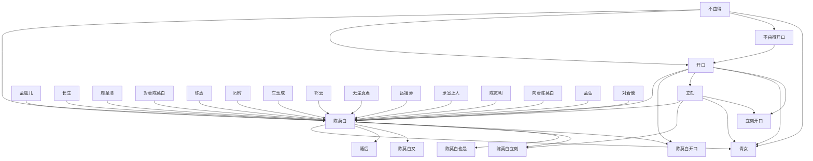

# 人物与关系图：《我有一个修仙世界》

## 人物表

### 1. 开口

- 出现次数：173
- 覆盖章节数：151
- 首次出现：第 34 章
- 最后出现：第 1490 章
- 身份/行为线索：人物行为/发言(173)

### 2. 陈莫白开口

- 出现次数：120
- 覆盖章节数：111
- 首次出现：第 244 章
- 最后出现：第 1490 章
- 身份/行为线索：人物行为/发言(120)

### 3. 陈莫白

- 出现次数：75
- 覆盖章节数：71
- 首次出现：第 33 章
- 最后出现：第 1472 章
- 身份/行为线索：人物行为/发言(75)

### 4. 不由得开口

- 出现次数：66
- 覆盖章节数：60
- 首次出现：第 278 章
- 最后出现：第 1450 章
- 身份/行为线索：人物行为/发言(66)

### 5. 对着陈莫白

- 出现次数：24
- 覆盖章节数：24
- 首次出现：第 417 章
- 最后出现：第 1437 章
- 身份/行为线索：人物行为/发言(24)

### 6. 不由得

- 出现次数：16
- 覆盖章节数：15
- 首次出现：第 35 章
- 最后出现：第 1423 章
- 身份/行为线索：人物行为/发言(16)

### 7. 陈莫白又

- 出现次数：15
- 覆盖章节数：15
- 首次出现：第 37 章
- 最后出现：第 1485 章
- 身份/行为线索：人物行为/发言(15)

### 8. 不由得好奇

- 出现次数：14
- 覆盖章节数：14
- 首次出现：第 369 章
- 最后出现：第 1436 章
- 身份/行为线索：人物行为/发言(14)

### 9. 忍不住开口

- 出现次数：13
- 覆盖章节数：13
- 首次出现：第 212 章
- 最后出现：第 1490 章
- 身份/行为线索：人物行为/发言(13)

### 10. 陈莫白又开口

- 出现次数：12
- 覆盖章节数：12
- 首次出现：第 62 章
- 最后出现：第 1170 章
- 身份/行为线索：人物行为/发言(12)

### 11. 青女

- 出现次数：11
- 覆盖章节数：9
- 首次出现：第 47 章
- 最后出现：第 1345 章
- 身份/行为线索：人物行为/发言(11)

### 12. 青女开口

- 出现次数：10
- 覆盖章节数：9
- 首次出现：第 866 章
- 最后出现：第 1352 章
- 身份/行为线索：人物行为/发言(10)

### 13. 陈莫白立刻

- 出现次数：9
- 覆盖章节数：9
- 首次出现：第 251 章
- 最后出现：第 1489 章
- 身份/行为线索：人物行为/发言(9)

### 14. 立刻开口

- 出现次数：8
- 覆盖章节数：8
- 首次出现：第 182 章
- 最后出现：第 1486 章
- 身份/行为线索：人物行为/发言(8)

### 15. 周圣清开口

- 出现次数：8
- 覆盖章节数：7
- 首次出现：第 628 章
- 最后出现：第 1074 章
- 身份/行为线索：人物行为/发言(8)

### 16. 不由得奇怪

- 出现次数：7
- 覆盖章节数：7
- 首次出现：第 178 章
- 最后出现：第 922 章
- 身份/行为线索：人物行为/发言(7)

### 17. 立刻

- 出现次数：7
- 覆盖章节数：7
- 首次出现：第 425 章
- 最后出现：第 1367 章
- 身份/行为线索：人物行为/发言(7)

### 18. 陈莫白对着青女

- 出现次数：7
- 覆盖章节数：7
- 首次出现：第 772 章
- 最后出现：第 1468 章
- 身份/行为线索：人物行为/发言(7)

### 19. 承宣上人开口

- 出现次数：6
- 覆盖章节数：6
- 首次出现：第 656 章
- 最后出现：第 937 章
- 身份/行为线索：人物行为/发言(6)

### 20. 皱着眉头

- 出现次数：5
- 覆盖章节数：5
- 首次出现：第 9 章
- 最后出现：第 1468 章
- 身份/行为线索：人物行为/发言(5)

### 21. 陈莫白立刻开口

- 出现次数：5
- 覆盖章节数：5
- 首次出现：第 419 章
- 最后出现：第 1446 章
- 身份/行为线索：人物行为/发言(5)

### 22. 叹息着

- 出现次数：5
- 覆盖章节数：5
- 首次出现：第 463 章
- 最后出现：第 1297 章
- 身份/行为线索：人物行为/发言(5)

### 23. 对着青女

- 出现次数：5
- 覆盖章节数：5
- 首次出现：第 497 章
- 最后出现：第 1348 章
- 身份/行为线索：人物行为/发言(5)

### 24. 齐玉珩开口

- 出现次数：5
- 覆盖章节数：5
- 首次出现：第 945 章
- 最后出现：第 1226 章
- 身份/行为线索：人物行为/发言(5)

### 25. 苏紫箩开口

- 出现次数：6
- 覆盖章节数：4
- 首次出现：第 960 章
- 最后出现：第 988 章
- 身份/行为线索：人物行为/发言(6)

### 26. 闻人雪薇开口

- 出现次数：5
- 覆盖章节数：4
- 首次出现：第 758 章
- 最后出现：第 946 章
- 身份/行为线索：人物行为/发言(5)

### 27. 向着陈莫白

- 出现次数：4
- 覆盖章节数：4
- 首次出现：第 173 章
- 最后出现：第 1469 章
- 身份/行为线索：人物行为/发言(4)

### 28. 不由得感慨

- 出现次数：4
- 覆盖章节数：4
- 首次出现：第 405 章
- 最后出现：第 1191 章
- 身份/行为线索：人物行为/发言(4)

### 29. 对着身边的青女

- 出现次数：4
- 覆盖章节数：4
- 首次出现：第 746 章
- 最后出现：第 1313 章
- 身份/行为线索：人物行为/发言(4)

### 30. 陈莫白笑着开口

- 出现次数：4
- 覆盖章节数：4
- 首次出现：第 794 章
- 最后出现：第 1099 章
- 身份/行为线索：人物行为/发言(4)

### 31. 莫斗光开口

- 出现次数：4
- 覆盖章节数：4
- 首次出现：第 951 章
- 最后出现：第 977 章
- 身份/行为线索：人物行为/发言(4)

### 32. 叶清开口

- 出现次数：4
- 覆盖章节数：4
- 首次出现：第 957 章
- 最后出现：第 1345 章
- 身份/行为线索：人物行为/发言(4)

### 33. 大空真君开口

- 出现次数：4
- 覆盖章节数：4
- 首次出现：第 1068 章
- 最后出现：第 1317 章
- 身份/行为线索：人物行为/发言(4)

### 34. 卓茗开口

- 出现次数：4
- 覆盖章节数：3
- 首次出现：第 680 章
- 最后出现：第 917 章
- 身份/行为线索：人物行为/发言(4)

### 35. 车玉成

- 出现次数：3
- 覆盖章节数：3
- 首次出现：第 175 章
- 最后出现：第 249 章
- 身份/行为线索：人物行为/发言(3)

### 36. 鄂云

- 出现次数：3
- 覆盖章节数：3
- 首次出现：第 232 章
- 最后出现：第 570 章
- 身份/行为线索：人物行为/发言(3)

### 37. 卞静纯开口

- 出现次数：3
- 覆盖章节数：3
- 首次出现：第 353 章
- 最后出现：第 480 章
- 身份/行为线索：人物行为/发言(3)

### 38. 不由得关心

- 出现次数：3
- 覆盖章节数：3
- 首次出现：第 377 章
- 最后出现：第 1281 章
- 身份/行为线索：人物行为/发言(3)

### 39. 对着卓茗

- 出现次数：3
- 覆盖章节数：3
- 首次出现：第 430 章
- 最后出现：第 1090 章
- 身份/行为线索：人物行为/发言(3)

### 40. 随后

- 出现次数：3
- 覆盖章节数：3
- 首次出现：第 644 章
- 最后出现：第 1484 章
- 身份/行为线索：人物行为/发言(3)

### 41. 承宣上人

- 出现次数：3
- 覆盖章节数：3
- 首次出现：第 658 章
- 最后出现：第 936 章
- 身份/行为线索：人物行为/发言(3)

### 42. 陈莫白不由得开口

- 出现次数：3
- 覆盖章节数：3
- 首次出现：第 659 章
- 最后出现：第 862 章
- 身份/行为线索：人物行为/发言(3)

### 43. 当先开口

- 出现次数：3
- 覆盖章节数：3
- 首次出现：第 762 章
- 最后出现：第 1320 章
- 身份/行为线索：人物行为/发言(3)

### 44. 对着陈莫白开口

- 出现次数：3
- 覆盖章节数：3
- 首次出现：第 782 章
- 最后出现：第 1426 章
- 身份/行为线索：人物行为/发言(3)

### 45. 陈莫白对着卓茗

- 出现次数：3
- 覆盖章节数：3
- 首次出现：第 788 章
- 最后出现：第 1018 章
- 身份/行为线索：人物行为/发言(3)

### 46. 陈莫白叹息着

- 出现次数：3
- 覆盖章节数：3
- 首次出现：第 852 章
- 最后出现：第 1350 章
- 身份/行为线索：人物行为/发言(3)

### 47. 随后开口

- 出现次数：3
- 覆盖章节数：3
- 首次出现：第 1078 章
- 最后出现：第 1297 章
- 身份/行为线索：人物行为/发言(3)

### 48. 对着灵尊

- 出现次数：3
- 覆盖章节数：3
- 首次出现：第 1248 章
- 最后出现：第 1342 章
- 身份/行为线索：人物行为/发言(3)

### 49. 神溪开口

- 出现次数：3
- 覆盖章节数：2
- 首次出现：第 1058 章
- 最后出现：第 1131 章
- 身份/行为线索：人物行为/发言(3)

### 50. 孟凰儿

- 出现次数：2
- 覆盖章节数：2
- 首次出现：第 170 章
- 最后出现：第 1047 章
- 身份/行为线索：人物行为/发言(2)

### 51. 孟弘

- 出现次数：2
- 覆盖章节数：2
- 首次出现：第 213 章
- 最后出现：第 397 章
- 身份/行为线索：人物行为/发言(2)

### 52. 岳祖涛

- 出现次数：2
- 覆盖章节数：2
- 首次出现：第 232 章
- 最后出现：第 462 章
- 身份/行为线索：人物行为/发言(2)

### 53. 闫金叶

- 出现次数：2
- 覆盖章节数：2
- 首次出现：第 233 章
- 最后出现：第 259 章
- 身份/行为线索：人物行为/发言(2)

### 54. 长生

- 出现次数：2
- 覆盖章节数：2
- 首次出现：第 254 章
- 最后出现：第 579 章
- 身份/行为线索：人物行为/发言(2)

### 55. 对着他

- 出现次数：2
- 覆盖章节数：2
- 首次出现：第 345 章
- 最后出现：第 1203 章
- 身份/行为线索：人物行为/发言(2)

### 56. 丁淳之开口

- 出现次数：2
- 覆盖章节数：2
- 首次出现：第 347 章
- 最后出现：第 467 章
- 身份/行为线索：人物行为/发言(2)

### 57. 曲秀仙

- 出现次数：2
- 覆盖章节数：2
- 首次出现：第 385 章
- 最后出现：第 577 章
- 身份/行为线索：人物行为/发言(2)

### 58. 周圣清

- 出现次数：2
- 覆盖章节数：2
- 首次出现：第 389 章
- 最后出现：第 825 章
- 身份/行为线索：人物行为/发言(2)

### 59. 对着她

- 出现次数：2
- 覆盖章节数：2
- 首次出现：第 414 章
- 最后出现：第 806 章
- 身份/行为线索：人物行为/发言(2)

### 60. 陈莫白也是

- 出现次数：2
- 覆盖章节数：2
- 首次出现：第 419 章
- 最后出现：第 1407 章
- 身份/行为线索：人物行为/发言(2)

### 61. 卓茗立刻开口

- 出现次数：2
- 覆盖章节数：2
- 首次出现：第 465 章
- 最后出现：第 1433 章
- 身份/行为线索：人物行为/发言(2)

### 62. 笑着开口

- 出现次数：2
- 覆盖章节数：2
- 首次出现：第 477 章
- 最后出现：第 1203 章
- 身份/行为线索：人物行为/发言(2)

### 63. 群仙

- 出现次数：2
- 覆盖章节数：2
- 首次出现：第 478 章
- 最后出现：第 1048 章
- 身份/行为线索：人物行为/发言(2)

### 64. 小黑的女孩

- 出现次数：2
- 覆盖章节数：2
- 首次出现：第 543 章
- 最后出现：第 736 章
- 身份/行为线索：人物行为/发言(2)

### 65. 卓茗却是

- 出现次数：2
- 覆盖章节数：2
- 首次出现：第 583 章
- 最后出现：第 1195 章
- 身份/行为线索：人物行为/发言(2)

### 66. 陈莫白笑着对卓茗

- 出现次数：2
- 覆盖章节数：2
- 首次出现：第 595 章
- 最后出现：第 1396 章
- 身份/行为线索：人物行为/发言(2)

### 67. 光复会的组织

- 出现次数：2
- 覆盖章节数：2
- 首次出现：第 626 章
- 最后出现：第 638 章
- 身份/行为线索：人物行为/发言(2)

### 68. 周圣清笑着开口

- 出现次数：2
- 覆盖章节数：2
- 首次出现：第 670 章
- 最后出现：第 802 章
- 身份/行为线索：人物行为/发言(2)

### 69. 同时

- 出现次数：2
- 覆盖章节数：2
- 首次出现：第 678 章
- 最后出现：第 793 章
- 身份/行为线索：人物行为/发言(2)

### 70. 主动开口

- 出现次数：2
- 覆盖章节数：2
- 首次出现：第 710 章
- 最后出现：第 803 章
- 身份/行为线索：人物行为/发言(2)

### 71. 青女又

- 出现次数：2
- 覆盖章节数：2
- 首次出现：第 755 章
- 最后出现：第 1113 章
- 身份/行为线索：人物行为/发言(2)

### 72. 洪孟奎开口

- 出现次数：2
- 覆盖章节数：2
- 首次出现：第 763 章
- 最后出现：第 1025 章
- 身份/行为线索：人物行为/发言(2)

### 73. 练虚

- 出现次数：2
- 覆盖章节数：2
- 首次出现：第 775 章
- 最后出现：第 1359 章
- 身份/行为线索：人物行为/发言(2)

### 74. 陈小黑开口

- 出现次数：2
- 覆盖章节数：2
- 首次出现：第 898 章
- 最后出现：第 927 章
- 身份/行为线索：人物行为/发言(2)

### 75. 温步月

- 出现次数：2
- 覆盖章节数：2
- 首次出现：第 904 章
- 最后出现：第 959 章
- 身份/行为线索：人物行为/发言(2)

### 76. 陈灵明

- 出现次数：2
- 覆盖章节数：2
- 首次出现：第 913 章
- 最后出现：第 1000 章
- 身份/行为线索：人物行为/发言(2)

### 77. 陈莫白对着莫斗光

- 出现次数：2
- 覆盖章节数：2
- 首次出现：第 919 章
- 最后出现：第 979 章
- 身份/行为线索：人物行为/发言(2)

### 78. 开口向着陈莫白

- 出现次数：2
- 覆盖章节数：2
- 首次出现：第 936 章
- 最后出现：第 1296 章
- 身份/行为线索：人物行为/发言(2)

### 79. 灵尊开口

- 出现次数：2
- 覆盖章节数：2
- 首次出现：第 946 章
- 最后出现：第 1442 章
- 身份/行为线索：人物行为/发言(2)

### 80. 海魂玛瑙

- 出现次数：2
- 覆盖章节数：2
- 首次出现：第 967 章
- 最后出现：第 983 章
- 身份/行为线索：人物行为/发言(2)

### 81. 冷冷的开口

- 出现次数：2
- 覆盖章节数：2
- 首次出现：第 986 章
- 最后出现：第 1238 章
- 身份/行为线索：人物行为/发言(2)

### 82. 陈莫白对着陈小黑

- 出现次数：2
- 覆盖章节数：2
- 首次出现：第 993 章
- 最后出现：第 1386 章
- 身份/行为线索：人物行为/发言(2)

### 83. 元虚开口

- 出现次数：2
- 覆盖章节数：2
- 首次出现：第 1003 章
- 最后出现：第 1048 章
- 身份/行为线索：人物行为/发言(2)

### 84. 梅龙征

- 出现次数：2
- 覆盖章节数：2
- 首次出现：第 1004 章
- 最后出现：第 1054 章
- 身份/行为线索：人物行为/发言(2)

### 85. 倪元重开口

- 出现次数：2
- 覆盖章节数：2
- 首次出现：第 1011 章
- 最后出现：第 1012 章
- 身份/行为线索：人物行为/发言(2)

### 86. 穆有义开口

- 出现次数：2
- 覆盖章节数：2
- 首次出现：第 1011 章
- 最后出现：第 1062 章
- 身份/行为线索：人物行为/发言(2)

### 87. 华子静开口

- 出现次数：2
- 覆盖章节数：2
- 首次出现：第 1021 章
- 最后出现：第 1023 章
- 身份/行为线索：人物行为/发言(2)

### 88. 开口对着牵星

- 出现次数：2
- 覆盖章节数：2
- 首次出现：第 1040 章
- 最后出现：第 1389 章
- 身份/行为线索：人物行为/发言(2)

### 89. 袁甄叹息着

- 出现次数：2
- 覆盖章节数：2
- 首次出现：第 1060 章
- 最后出现：第 1072 章
- 身份/行为线索：人物行为/发言(2)

### 90. 陈莫白忍不住开口

- 出现次数：2
- 覆盖章节数：2
- 首次出现：第 1076 章
- 最后出现：第 1402 章
- 身份/行为线索：人物行为/发言(2)

### 91. 无尘真君

- 出现次数：2
- 覆盖章节数：2
- 首次出现：第 1117 章
- 最后出现：第 1233 章
- 身份/行为线索：人物行为/发言(2)

### 92. 感慨的开口

- 出现次数：2
- 覆盖章节数：2
- 首次出现：第 1169 章
- 最后出现：第 1353 章
- 身份/行为线索：人物行为/发言(2)

### 93. 承宣开口

- 出现次数：2
- 覆盖章节数：2
- 首次出现：第 1170 章
- 最后出现：第 1183 章
- 身份/行为线索：人物行为/发言(2)

### 94. 是紫霄宫弟子

- 出现次数：2
- 覆盖章节数：2
- 首次出现：第 1209 章
- 最后出现：第 1378 章
- 身份/行为线索：人物行为/发言(2)

### 95. 开口对着青女

- 出现次数：2
- 覆盖章节数：2
- 首次出现：第 1241 章
- 最后出现：第 1350 章
- 身份/行为线索：人物行为/发言(2)

### 96. 无尘真君开口

- 出现次数：2
- 覆盖章节数：2
- 首次出现：第 1251 章
- 最后出现：第 1276 章
- 身份/行为线索：人物行为/发言(2)

### 97. 天海剑经

- 出现次数：2
- 覆盖章节数：2
- 首次出现：第 1289 章
- 最后出现：第 1384 章
- 身份/行为线索：人物行为/发言(2)

### 98. 无为仙君开口

- 出现次数：2
- 覆盖章节数：2
- 首次出现：第 1402 章
- 最后出现：第 1410 章
- 身份/行为线索：人物行为/发言(2)

### 99. 纪雨寒开口

- 出现次数：2
- 覆盖章节数：2
- 首次出现：第 1409 章
- 最后出现：第 1441 章
- 身份/行为线索：人物行为/发言(2)

### 100. 连忙开口

- 出现次数：2
- 覆盖章节数：2
- 首次出现：第 1431 章
- 最后出现：第 1457 章
- 身份/行为线索：人物行为/发言(2)

## 关系边

- 陈莫白 <-> 青女：共现 1889 次，覆盖第 18-1490 章，关系线索：同章共现(1789)、弟子(22)、朋友(21)、老师(8)、妻子(7)、合作(6)、师尊(6)、女儿(5)
- 立刻 <-> 陈莫白：共现 1872 次，覆盖第 9-1490 章，关系线索：同章共现(1780)、弟子(22)、老师(11)、对手(10)、学生(9)、女儿(8)、师尊(6)、命令(6)
- 不由得 <-> 陈莫白：共现 1789 次，覆盖第 3-1490 章，关系线索：同章共现(1740)、弟子(13)、学生(8)、对手(8)、女儿(8)、老师(7)、朋友(2)、交易(1)
- 开口 <-> 陈莫白：共现 1721 次，覆盖第 17-1490 章，关系线索：同章共现(1651)、师尊(13)、女儿(12)、朋友(8)、弟子(8)、老师(5)、对手(4)、学生(3)
- 陈莫白 <-> 随后：共现 998 次，覆盖第 1-1490 章，关系线索：同章共现(958)、弟子(11)、学生(7)、对手(7)、老师(6)、女儿(4)、师尊(3)、保护(2)
- 陈莫白 <-> 陈莫白又：共现 765 次，覆盖第 3-1490 章，关系线索：同章共现(730)、弟子(11)、老师(5)、朋友(4)、学生(3)、师尊(3)、女儿(3)、对手(2)
- 孟凰儿 <-> 陈莫白：共现 652 次，覆盖第 35-1490 章，关系线索：同章共现(630)、学生(5)、朋友(5)、交易(4)、老师(2)、对手(2)、妻子(2)、女儿(2)
- 长生 <-> 陈莫白：共现 634 次，覆盖第 96-1490 章，关系线索：同章共现(609)、弟子(13)、老师(4)、对手(3)、学生(2)、交易(2)、朋友(1)、师尊(1)
- 周圣清 <-> 陈莫白：共现 590 次，覆盖第 259-1350 章，关系线索：同章共现(561)、弟子(15)、兄弟(4)、师尊(3)、对手(2)、老师(1)、命令(1)、保护(1)
- 对着陈莫白 <-> 陈莫白：共现 532 次，覆盖第 9-1490 章，关系线索：同章共现(515)、弟子(4)、师尊(4)、学生(2)、女儿(2)、父亲(1)、姐妹(1)、命令(1)
- 陈莫白 <-> 陈莫白立刻：共现 520 次，覆盖第 13-1490 章，关系线索：同章共现(495)、老师(4)、对手(4)、命令(4)、女儿(3)、朋友(2)、弟子(2)、同伴(1)
- 立刻 <-> 陈莫白立刻：共现 520 次，覆盖第 13-1490 章，关系线索：同章共现(495)、老师(4)、对手(4)、命令(4)、女儿(3)、朋友(2)、弟子(2)、同伴(1)
- 陈莫白 <-> 陈莫白也是：共现 426 次，覆盖第 1-1490 章，关系线索：同章共现(406)、女儿(7)、对手(5)、弟子(2)、朋友(1)、兄弟(1)、保护(1)、妻子(1)
- 练虚 <-> 陈莫白：共现 400 次，覆盖第 483-1490 章，关系线索：同章共现(377)、弟子(11)、师尊(5)、对手(4)、女儿(3)、父亲(1)、母亲(1)、兄弟(1)
- 同时 <-> 陈莫白：共现 381 次，覆盖第 7-1487 章，关系线索：同章共现(357)、对手(8)、弟子(6)、学生(2)、师尊(2)、女儿(2)、同伴(1)、母亲(1)
- 车玉成 <-> 陈莫白：共现 369 次，覆盖第 175-1383 章，关系线索：同章共现(332)、老师(21)、弟子(8)、学生(7)、朋友(2)、导师(1)、兄弟(1)
- 鄂云 <-> 陈莫白：共现 363 次，覆盖第 186-1414 章，关系线索：同章共现(342)、弟子(11)、朋友(4)、对手(2)、追杀(1)、学生(1)、命令(1)、交易(1)
- 开口 <-> 陈莫白开口：共现 286 次，覆盖第 74-1490 章，关系线索：同章共现(272)、女儿(5)、师尊(3)、弟子(2)、敌人(2)、朋友(2)、学生(1)
- 陈莫白 <-> 陈莫白开口：共现 286 次，覆盖第 74-1490 章，关系线索：同章共现(272)、女儿(5)、师尊(3)、弟子(2)、敌人(2)、朋友(2)、学生(1)
- 开口 <-> 立刻：共现 242 次，覆盖第 52-1490 章，关系线索：同章共现(235)、师尊(2)、弟子(2)、朋友(1)、命令(1)、姐妹(1)
- 无尘真君 <-> 陈莫白：共现 241 次，覆盖第 956-1390 章，关系线索：同章共现(235)、弟子(4)、师尊(1)、追杀(1)
- 岳祖涛 <-> 陈莫白：共现 236 次，覆盖第 232-1021 章，关系线索：同章共现(226)、弟子(5)、追杀(1)、敌人(1)、朋友(1)、对手(1)、交易(1)
- 承宣上人 <-> 陈莫白：共现 222 次，覆盖第 401-1049 章，关系线索：同章共现(214)、老师(2)、学生(1)、导师(1)、朋友(1)、兄弟(1)、盟友(1)、对手(1)
- 不由得 <-> 开口：共现 207 次，覆盖第 49-1490 章，关系线索：同章共现(200)、女儿(2)、儿子(1)、父亲(1)、弟子(1)、合作(1)、老师(1)
- 陈灵明 <-> 陈莫白：共现 167 次，覆盖第 913-1483 章，关系线索：同章共现(163)、弟子(2)、命令(1)、对手(1)
- 开口 <-> 青女：共现 143 次，覆盖第 38-1486 章，关系线索：同章共现(135)、朋友(2)、师尊(2)、老师(1)、合作(1)、弟子(1)、丈夫(1)
- 立刻 <-> 青女：共现 136 次，覆盖第 44-1490 章，关系线索：同章共现(127)、弟子(2)、合作(1)、朋友(1)、导师(1)、命令(1)、儿子(1)、老师(1)
- 不由得开口 <-> 开口：共现 133 次，覆盖第 200-1490 章，关系线索：同章共现(129)、女儿(1)、弟子(1)、合作(1)、老师(1)
- 不由得 <-> 不由得开口：共现 133 次，覆盖第 200-1490 章，关系线索：同章共现(129)、女儿(1)、弟子(1)、合作(1)、老师(1)
- 开口 <-> 立刻开口：共现 127 次，覆盖第 74-1490 章，关系线索：同章共现(124)、朋友(1)、师尊(1)、姐妹(1)
- 立刻 <-> 立刻开口：共现 127 次，覆盖第 74-1490 章，关系线索：同章共现(124)、朋友(1)、师尊(1)、姐妹(1)
- 向着陈莫白 <-> 陈莫白：共现 121 次，覆盖第 9-1478 章，关系线索：同章共现(115)、老师(2)、学生(2)、弟子(1)、命令(1)、妻子(1)
- 孟弘 <-> 陈莫白：共现 121 次，覆盖第 213-892 章，关系线索：同章共现(118)、弟子(2)、上司(1)
- 对着他 <-> 陈莫白：共现 113 次，覆盖第 48-1490 章，关系线索：同章共现(109)、弟子(2)、老师(1)、女儿(1)
- 不由得 <-> 青女：共现 96 次，覆盖第 30-1490 章，关系线索：同章共现(95)、弟子(1)
- 开口 <-> 随后：共现 96 次，覆盖第 57-1490 章，关系线索：同章共现(92)、老师(2)、师尊(1)、保护(1)
- 立刻 <-> 随后：共现 95 次，覆盖第 18-1490 章，关系线索：同章共现(92)、弟子(2)、同伴(1)
- 周圣清 <-> 开口：共现 94 次，覆盖第 315-1328 章，关系线索：同章共现(90)、对手(2)、师尊(2)
- 周圣清 <-> 长生：共现 92 次，覆盖第 315-1052 章，关系线索：同章共现(90)、弟子(1)、对手(1)
- 开口 <-> 忍不住开口：共现 89 次，覆盖第 54-1490 章，关系线索：同章共现(85)、学生(1)、姐妹(1)、父亲(1)、师尊(1)
- 不由得开口 <-> 陈莫白：共现 88 次，覆盖第 278-1490 章，关系线索：同章共现(86)、合作(1)、老师(1)
- 周圣清 <-> 立刻：共现 80 次，覆盖第 260-1124 章，关系线索：同章共现(72)、弟子(5)、师尊(1)、追杀(1)、对手(1)
- 闫金叶 <-> 陈莫白：共现 77 次，覆盖第 233-1189 章，关系线索：同章共现(71)、弟子(3)、朋友(2)、交易(1)
- 立刻 <-> 鄂云：共现 73 次，覆盖第 186-1414 章，关系线索：同章共现(71)、朋友(1)、弟子(1)
- 对着青女 <-> 青女：共现 72 次，覆盖第 131-1490 章，关系线索：同章共现(67)、师尊(2)、朋友(1)、命令(1)、对手(1)
- 主动开口 <-> 开口：共现 71 次，覆盖第 43-1490 章，关系线索：同章共现(67)、师尊(2)、弟子(2)
- 开口 <-> 笑着开口：共现 69 次，覆盖第 36-1409 章，关系线索：同章共现(67)、弟子(1)、命令(1)
- 立刻开口 <-> 陈莫白：共现 69 次，覆盖第 74-1490 章，关系线索：同章共现(68)、朋友(1)
- 不由得 <-> 不由得感慨：共现 65 次，覆盖第 35-1467 章，关系线索：同章共现(63)、父亲(1)、女儿(1)、弟子(1)
- 不由得 <-> 立刻：共现 55 次，覆盖第 87-1490 章，关系线索：同章共现(51)、老师(1)、学生(1)、上司(1)、弟子(1)
- 不由得 <-> 随后：共现 54 次，覆盖第 42-1446 章，关系线索：同章共现(54)
- 对着青女 <-> 陈莫白：共现 54 次，覆盖第 131-1488 章，关系线索：同章共现(51)、朋友(1)、命令(1)、对手(1)
- 对着陈莫白 <-> 立刻：共现 54 次，覆盖第 269-1490 章，关系线索：同章共现(52)、老师(1)、师尊(1)
- 随后 <-> 青女：共现 51 次，覆盖第 73-1420 章，关系线索：同章共现(49)、师尊(1)、合作(1)
- 不由得 <-> 周圣清：共现 51 次，覆盖第 396-1125 章，关系线索：同章共现(51)
- 不由得感慨 <-> 陈莫白：共现 50 次，覆盖第 35-1467 章，关系线索：同章共现(49)、父亲(1)、女儿(1)
- 开口 <-> 当先开口：共现 49 次，覆盖第 178-1410 章，关系线索：同章共现(48)、上司(1)
- 开口 <-> 无尘真君：共现 49 次，覆盖第 963-1349 章，关系线索：同章共现(47)、师尊(1)、弟子(1)
- 长生 <-> 青女：共现 46 次，覆盖第 328-1390 章，关系线索：同章共现(44)、老师(1)、朋友(1)
- 主动开口 <-> 陈莫白：共现 40 次，覆盖第 43-1410 章，关系线索：同章共现(39)、师尊(1)
- 立刻 <-> 车玉成：共现 38 次，覆盖第 177-1042 章，关系线索：同章共现(33)、老师(4)、学生(1)
- 同时 <-> 立刻：共现 37 次，覆盖第 59-1478 章，关系线索：同章共现(35)、弟子(2)
- 皱着眉头 <-> 陈莫白：共现 37 次，覆盖第 70-1471 章，关系线索：同章共现(34)、弟子(2)、妻子(1)、师尊(1)
- 对着她 <-> 陈莫白：共现 37 次，覆盖第 101-1399 章，关系线索：同章共现(37)
- 立刻 <-> 长生：共现 37 次，覆盖第 173-1280 章，关系线索：同章共现(34)、老师(2)、对手(1)
- 同时 <-> 开口：共现 37 次，覆盖第 230-1409 章，关系线索：同章共现(35)、上司(1)、对手(1)
- 周圣清 <-> 随后：共现 37 次，覆盖第 389-1032 章，关系线索：同章共现(35)、师尊(1)、追杀(1)
- 开口 <-> 陈莫白又：共现 36 次，覆盖第 62-1476 章，关系线索：同章共现(35)、师尊(1)
- 忍不住开口 <-> 陈莫白：共现 36 次，覆盖第 109-1490 章，关系线索：同章共现(35)、师尊(1)
- 长生 <-> 随后：共现 36 次，覆盖第 184-1310 章，关系线索：同章共现(34)、学生(1)、弟子(1)
- 开口 <-> 承宣上人：共现 36 次，覆盖第 455-1048 章，关系线索：同章共现(35)、朋友(1)
- 笑着开口 <-> 陈莫白：共现 35 次，覆盖第 36-1350 章，关系线索：同章共现(33)、弟子(1)、命令(1)
- 开口 <-> 陈莫白立刻：共现 33 次，覆盖第 74-1469 章，关系线索：同章共现(32)、朋友(1)
- 孟凰儿 <-> 立刻：共现 33 次，覆盖第 170-1490 章，关系线索：同章共现(32)、朋友(1)
- 周圣清 <-> 青女：共现 33 次，覆盖第 754-1124 章，关系线索：同章共现(29)、师尊(2)、弟子(2)
- 练虚 <-> 青女：共现 31 次，覆盖第 1097-1486 章，关系线索：同章共现(28)、弟子(2)、师尊(1)
- 对着陈莫白 <-> 开口：共现 30 次，覆盖第 112-1465 章，关系线索：同章共现(30)
- 岳祖涛 <-> 长生：共现 30 次，覆盖第 232-754 章，关系线索：同章共现(28)、弟子(2)
- 不由得 <-> 孟凰儿：共现 30 次，覆盖第 279-1369 章，关系线索：同章共现(30)
- 孟凰儿 <-> 开口：共现 30 次，覆盖第 403-1385 章，关系线索：同章共现(28)、导师(1)、命令(1)
- 开口 <-> 鄂云：共现 29 次，覆盖第 228-1398 章，关系线索：同章共现(29)
- 同时 <-> 青女：共现 28 次，覆盖第 122-1487 章，关系线索：同章共现(28)
- 不由得 <-> 长生：共现 26 次，覆盖第 220-1426 章，关系线索：同章共现(25)、老师(1)
- 周圣清 <-> 孟弘：共现 26 次，覆盖第 260-948 章，关系线索：同章共现(23)、弟子(3)
- 青女 <-> 青女又：共现 25 次，覆盖第 47-1468 章，关系线索：同章共现(22)、弟子(3)
- 对着他 <-> 立刻：共现 25 次，覆盖第 73-1490 章，关系线索：同章共现(25)
- 开口 <-> 陈灵明：共现 25 次，覆盖第 913-1483 章，关系线索：同章共现(23)、对手(1)、弟子(1)
- 陈莫白又 <-> 青女：共现 24 次，覆盖第 44-1427 章，关系线索：同章共现(22)、弟子(1)、师尊(1)
- 陈莫白 <-> 陈莫白对着青女：共现 24 次，覆盖第 239-1488 章，关系线索：同章共现(24)
- 陈莫白对着青女 <-> 青女：共现 24 次，覆盖第 239-1488 章，关系线索：同章共现(24)
- 对着青女 <-> 陈莫白对着青女：共现 24 次，覆盖第 239-1488 章，关系线索：同章共现(24)
- 承宣上人 <-> 车玉成：共现 24 次，覆盖第 401-1021 章，关系线索：同章共现(20)、老师(3)、对手(1)
- 开口 <-> 车玉成：共现 23 次，覆盖第 175-937 章，关系线索：同章共现(22)、导师(1)
- 陈莫白又 <-> 随后：共现 23 次，覆盖第 415-1423 章，关系线索：同章共现(23)
- 承宣上人 <-> 立刻：共现 23 次，覆盖第 456-1026 章，关系线索：同章共现(22)、兄弟(1)
- 开口 <-> 陈莫白又开口：共现 22 次，覆盖第 62-1476 章，关系线索：同章共现(21)、师尊(1)
- 陈莫白 <-> 陈莫白又开口：共现 22 次，覆盖第 62-1476 章，关系线索：同章共现(21)、师尊(1)
- 陈莫白又 <-> 陈莫白又开口：共现 22 次，覆盖第 62-1476 章，关系线索：同章共现(21)、师尊(1)
- 不由得 <-> 无尘真君：共现 22 次，覆盖第 1014-1348 章，关系线索：同章共现(21)、弟子(1)
- 开口 <-> 练虚：共现 22 次，覆盖第 1026-1461 章，关系线索：同章共现(21)、弟子(1)
- 孟凰儿 <-> 随后：共现 21 次，覆盖第 169-1490 章，关系线索：同章共现(21)
- 岳祖涛 <-> 鄂云：共现 21 次，覆盖第 233-1021 章，关系线索：同章共现(19)、弟子(1)、朋友(1)
- 叹息着 <-> 陈莫白：共现 21 次，覆盖第 235-1297 章，关系线索：同章共现(21)
- 对着陈莫白 <-> 随后：共现 21 次，覆盖第 316-1472 章，关系线索：同章共现(18)、师尊(2)、弟子(1)
- 开口 <-> 青女开口：共现 21 次，覆盖第 365-1399 章，关系线索：同章共现(21)
- 青女 <-> 青女开口：共现 21 次，覆盖第 365-1399 章，关系线索：同章共现(21)
- 同时 <-> 随后：共现 20 次，覆盖第 67-1152 章，关系线索：同章共现(20)
- 鄂云 <-> 长生：共现 20 次，覆盖第 211-1355 章，关系线索：同章共现(15)、弟子(2)、学生(2)、朋友(1)
- 岳祖涛 <-> 立刻：共现 20 次，覆盖第 304-1012 章，关系线索：同章共现(20)
- 不由得 <-> 不由得好奇：共现 20 次，覆盖第 318-1436 章，关系线索：同章共现(19)、朋友(1)
- 开口 <-> 长生：共现 20 次，覆盖第 441-1310 章，关系线索：同章共现(16)、弟子(2)、师尊(1)、对手(1)
- 立刻 <-> 陈灵明：共现 20 次，覆盖第 916-1329 章，关系线索：同章共现(20)
- 对着陈莫白 <-> 青女：共现 19 次，覆盖第 55-1488 章，关系线索：同章共现(17)、姐妹(1)、师尊(1)
- 陈莫白立刻 <-> 青女：共现 19 次，覆盖第 74-1336 章，关系线索：同章共现(18)、朋友(1)
- 不由得 <-> 岳祖涛：共现 19 次，覆盖第 232-679 章，关系线索：同章共现(19)
- 不由得好奇 <-> 陈莫白：共现 18 次，覆盖第 318-1436 章，关系线索：同章共现(17)、朋友(1)
- 对着卓茗 <-> 陈莫白：共现 18 次，覆盖第 430-1398 章，关系线索：同章共现(17)、弟子(1)
- 闫金叶 <-> 青女：共现 18 次，覆盖第 765-1189 章，关系线索：同章共现(16)、师尊(1)、弟子(1)
- 海魂玛瑙 <-> 陈莫白：共现 18 次，覆盖第 967-1395 章，关系线索：同章共现(16)、盟友(1)、师尊(1)
- 孟弘 <-> 长生：共现 17 次，覆盖第 290-749 章，关系线索：同章共现(17)
- 无尘真君 <-> 立刻：共现 17 次，覆盖第 984-1274 章，关系线索：同章共现(16)、交易(1)
- 不由得 <-> 车玉成：共现 16 次，覆盖第 175-937 章，关系线索：同章共现(16)
- 不由得 <-> 鄂云：共现 16 次，覆盖第 229-1306 章，关系线索：同章共现(16)
- 当先开口 <-> 陈莫白：共现 16 次，覆盖第 367-1410 章，关系线索：同章共现(15)、上司(1)
- 陈莫白也是 <-> 青女：共现 16 次，覆盖第 543-1413 章，关系线索：同章共现(16)
- 练虚 <-> 长生：共现 16 次，覆盖第 963-1490 章，关系线索：同章共现(15)、弟子(1)
- 孟弘 <-> 立刻：共现 15 次，覆盖第 233-749 章，关系线索：同章共现(15)
- 孟凰儿 <-> 长生：共现 15 次，覆盖第 481-1207 章，关系线索：同章共现(14)、对手(1)
- 陈莫白开口 <-> 青女：共现 15 次，覆盖第 747-1382 章，关系线索：同章共现(15)
- 不由得 <-> 陈灵明：共现 15 次，覆盖第 913-1291 章，关系线索：同章共现(15)
- 无尘真君 <-> 青女：共现 15 次，覆盖第 956-1390 章，关系线索：同章共现(13)、弟子(1)、师尊(1)
- 不由得 <-> 陈莫白又：共现 14 次，覆盖第 20-1344 章，关系线索：同章共现(14)
- 立刻开口 <-> 陈莫白立刻：共现 14 次，覆盖第 74-1469 章，关系线索：同章共现(13)、朋友(1)
- 车玉成 <-> 陈莫白立刻：共现 14 次，覆盖第 180-843 章，关系线索：同章共现(11)、老师(3)
- 同时 <-> 长生：共现 14 次，覆盖第 185-1294 章，关系线索：同章共现(13)、师尊(1)
- 孟弘 <-> 鄂云：共现 14 次，覆盖第 228-948 章，关系线索：同章共现(11)、弟子(3)
- 车玉成 <-> 陈莫白又：共现 14 次，覆盖第 276-800 章，关系线索：同章共现(10)、老师(3)、学生(1)
- 周圣清 <-> 对着陈莫白：共现 14 次，覆盖第 326-1074 章，关系线索：同章共现(13)、合作(1)
- 曲秀仙 <-> 陈莫白：共现 14 次，覆盖第 559-968 章，关系线索：同章共现(12)、交易(2)
- 立刻 <-> 陈莫白开口：共现 14 次，覆盖第 599-1468 章，关系线索：同章共现(13)、弟子(1)
- 鄂云 <-> 青女：共现 14 次，覆盖第 871-1414 章，关系线索：同章共现(14)
- 陈莫白立刻 <-> 随后：共现 13 次，覆盖第 88-1471 章，关系线索：同章共现(13)
- 对着陈莫白开口 <-> 开口：共现 13 次，覆盖第 112-1465 章，关系线索：同章共现(13)
- 对着陈莫白 <-> 陈莫白开口：共现 13 次，覆盖第 112-1465 章，关系线索：同章共现(13)
- 对着陈莫白开口 <-> 陈莫白开口：共现 13 次，覆盖第 112-1465 章，关系线索：同章共现(13)
- 对着陈莫白开口 <-> 陈莫白：共现 13 次，覆盖第 112-1465 章，关系线索：同章共现(13)
- 对着陈莫白 <-> 对着陈莫白开口：共现 13 次，覆盖第 112-1465 章，关系线索：同章共现(13)
- 不由得 <-> 承宣上人：共现 13 次，覆盖第 401-1048 章，关系线索：同章共现(13)
- 开口 <-> 陈莫白立刻开口：共现 13 次，覆盖第 419-1469 章，关系线索：同章共现(13)
- 陈莫白 <-> 陈莫白立刻开口：共现 13 次，覆盖第 419-1469 章，关系线索：同章共现(13)
- 陈莫白立刻 <-> 陈莫白立刻开口：共现 13 次，覆盖第 419-1469 章，关系线索：同章共现(13)
- 立刻开口 <-> 陈莫白立刻开口：共现 13 次，覆盖第 419-1469 章，关系线索：同章共现(13)
- 立刻 <-> 陈莫白立刻开口：共现 13 次，覆盖第 419-1469 章，关系线索：同章共现(13)
- 叶清开口 <-> 开口：共现 13 次，覆盖第 782-1345 章，关系线索：同章共现(13)
- 立刻 <-> 练虚：共现 13 次，覆盖第 1026-1490 章，关系线索：同章共现(12)、师尊(1)、弟子(1)
- 陈莫白 <-> 青女又：共现 12 次，覆盖第 47-1310 章，关系线索：同章共现(11)、弟子(1)
- 对着他 <-> 随后：共现 12 次，覆盖第 125-1237 章，关系线索：同章共现(12)
- 车玉成 <-> 随后：共现 12 次，覆盖第 175-1372 章，关系线索：同章共现(10)、弟子(1)、朋友(1)、合作(1)
- 鄂云 <-> 陈莫白又：共现 12 次，覆盖第 217-1350 章，关系线索：同章共现(11)、朋友(1)
- 长生 <-> 闫金叶：共现 12 次，覆盖第 233-464 章，关系线索：同章共现(12)

## Mermaid 关系草图

