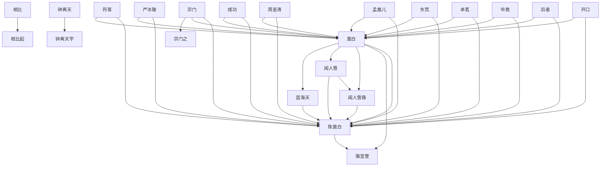

# 人物与关系图：《我有一个修仙世界.txt》

## 人物表

### 1. 陈莫白

- 出现次数：45923
- 覆盖章节数：1477
- 首次出现：第 1 章
- 最后出现：第 1490 章
- 身份/行为线索：姓名候选(45832)、人物行为/发言(91)

### 2. 成功

- 出现次数：994
- 覆盖章节数：541
- 首次出现：第 6 章
- 最后出现：第 1490 章
- 身份/行为线索：姓名候选(994)

### 3. 段时间

- 出现次数：769
- 覆盖章节数：537
- 首次出现：第 15 章
- 最后出现：第 1490 章
- 身份/行为线索：姓名候选(769)

### 4. 相比起

- 出现次数：719
- 覆盖章节数：506
- 首次出现：第 5 章
- 最后出现：第 1490 章
- 身份/行为线索：姓名候选(719)

### 5. 方法

- 出现次数：447
- 覆盖章节数：340
- 首次出现：第 5 章
- 最后出现：第 1490 章
- 身份/行为线索：姓名候选(447)

### 6. 师尊

- 出现次数：745
- 覆盖章节数：319
- 首次出现：第 213 章
- 最后出现：第 1490 章
- 身份/行为线索：姓名候选(745)

### 7. 东荒

- 出现次数：474
- 覆盖章节数：308
- 首次出现：第 9 章
- 最后出现：第 1490 章
- 身份/行为线索：姓名候选(474)

### 8. 时间之

- 出现次数：334
- 覆盖章节数：275
- 首次出现：第 4 章
- 最后出现：第 1490 章
- 身份/行为线索：姓名候选(334)

### 9. 周圣清

- 出现次数：1538
- 覆盖章节数：266
- 首次出现：第 259 章
- 最后出现：第 1396 章
- 身份/行为线索：姓名候选(1536)、人物行为/发言(2)

### 10. 后面精

- 出现次数：311
- 覆盖章节数：262
- 首次出现：第 16 章
- 最后出现：第 1490 章
- 身份/行为线索：姓名候选(311)

### 11. 后者

- 出现次数：294
- 覆盖章节数：260
- 首次出现：第 7 章
- 最后出现：第 1490 章
- 身份/行为线索：姓名候选(294)

### 12. 骆宜萱

- 出现次数：1163
- 覆盖章节数：256
- 首次出现：第 162 章
- 最后出现：第 1490 章
- 身份/行为线索：姓名候选(1163)

### 13. 师兄

- 出现次数：386
- 覆盖章节数：249
- 首次出现：第 103 章
- 最后出现：第 1490 章
- 身份/行为线索：姓名候选(386)

### 14. 符箓

- 出现次数：435
- 覆盖章节数：232
- 首次出现：第 3 章
- 最后出现：第 1490 章
- 身份/行为线索：姓名候选(435)

### 15. 毕竟

- 出现次数：251
- 覆盖章节数：227
- 首次出现：第 4 章
- 最后出现：第 1482 章
- 身份/行为线索：姓名候选(251)

### 16. 宗门之

- 出现次数：344
- 覆盖章节数：225
- 首次出现：第 25 章
- 最后出现：第 1368 章
- 身份/行为线索：姓名候选(344)

### 17. 云梦泽

- 出现次数：646
- 覆盖章节数：215
- 首次出现：第 59 章
- 最后出现：第 1413 章
- 身份/行为线索：姓名候选(646)

### 18. 东荒之

- 出现次数：295
- 覆盖章节数：207
- 首次出现：第 13 章
- 最后出现：第 1466 章
- 身份/行为线索：姓名候选(295)

### 19. 金液玉

- 出现次数：543
- 覆盖章节数：204
- 首次出现：第 7 章
- 最后出现：第 1306 章
- 身份/行为线索：姓名候选(543)

### 20. 师弟

- 出现次数：358
- 覆盖章节数：203
- 首次出现：第 78 章
- 最后出现：第 1490 章
- 身份/行为线索：姓名候选(358)

### 21. 闻人雪薇

- 出现次数：1095
- 覆盖章节数：196
- 首次出现：第 343 章
- 最后出现：第 1490 章
- 身份/行为线索：姓名候选(1094)、人物行为/发言(1)

### 22. 成之后

- 出现次数：235
- 覆盖章节数：193
- 首次出现：第 26 章
- 最后出现：第 1472 章
- 身份/行为线索：姓名候选(235)

### 23. 卓茗

- 出现次数：358
- 覆盖章节数：192
- 首次出现：第 59 章
- 最后出现：第 1490 章
- 身份/行为线索：姓名候选(357)、人物行为/发言(1)

### 24. 屈指可

- 出现次数：205
- 覆盖章节数：186
- 首次出现：第 20 章
- 最后出现：第 1486 章
- 身份/行为线索：姓名候选(205)

### 25. 关键

- 出现次数：204
- 覆盖章节数：185
- 首次出现：第 37 章
- 最后出现：第 1489 章
- 身份/行为线索：姓名候选(204)

### 26. 闻人雪

- 出现次数：983
- 覆盖章节数：183
- 首次出现：第 343 章
- 最后出现：第 1490 章
- 身份/行为线索：姓名候选(983)

### 27. 莫斗光

- 出现次数：712
- 覆盖章节数：183
- 首次出现：第 228 章
- 最后出现：第 1468 章
- 身份/行为线索：姓名候选(712)

### 28. 刘文柏

- 出现次数：678
- 覆盖章节数：179
- 首次出现：第 154 章
- 最后出现：第 1490 章
- 身份/行为线索：姓名候选(677)、人物行为/发言(1)

### 29. 任务

- 出现次数：270
- 覆盖章节数：179
- 首次出现：第 24 章
- 最后出现：第 1471 章
- 身份/行为线索：姓名候选(270)

### 30. 相人偶

- 出现次数：576
- 覆盖章节数：178
- 首次出现：第 175 章
- 最后出现：第 1251 章
- 身份/行为线索：姓名候选(576)

### 31. 宗门

- 出现次数：231
- 覆盖章节数：177
- 首次出现：第 13 章
- 最后出现：第 1430 章
- 身份/行为线索：姓名候选(231)

### 32. 白来说

- 出现次数：198
- 覆盖章节数：175
- 首次出现：第 1 章
- 最后出现：第 1490 章
- 身份/行为线索：姓名候选(198)

### 33. 严冰璇

- 出现次数：876
- 覆盖章节数：171
- 首次出现：第 1 章
- 最后出现：第 1490 章
- 身份/行为线索：姓名候选(876)

### 34. 蓝海天

- 出现次数：927
- 覆盖章节数：168
- 首次出现：第 47 章
- 最后出现：第 1461 章
- 身份/行为线索：姓名候选(926)、人物行为/发言(1)

### 35. 傅宗绝

- 出现次数：724
- 覆盖章节数：167
- 首次出现：第 315 章
- 最后出现：第 1416 章
- 身份/行为线索：姓名候选(724)

### 36. 尹青梅

- 出现次数：715
- 覆盖章节数：165
- 首次出现：第 290 章
- 最后出现：第 1490 章
- 身份/行为线索：姓名候选(715)

### 37. 费时间

- 出现次数：180
- 覆盖章节数：163
- 首次出现：第 2 章
- 最后出现：第 1477 章
- 身份/行为线索：姓名候选(180)

### 38. 莫白

- 出现次数：178
- 覆盖章节数：159
- 首次出现：第 11 章
- 最后出现：第 1490 章
- 身份/行为线索：姓名候选(178)

### 39. 田气海

- 出现次数：227
- 覆盖章节数：155
- 首次出现：第 21 章
- 最后出现：第 1229 章
- 身份/行为线索：姓名候选(227)

### 40. 陈掌门

- 出现次数：591
- 覆盖章节数：153
- 首次出现：第 520 章
- 最后出现：第 1073 章
- 身份/行为线索：姓名候选(591)

### 41. 方面

- 出现次数：176
- 覆盖章节数：152
- 首次出现：第 13 章
- 最后出现：第 1459 章
- 身份/行为线索：姓名候选(176)

### 42. 开口

- 出现次数：174
- 覆盖章节数：152
- 首次出现：第 34 章
- 最后出现：第 1490 章
- 身份/行为线索：人物行为/发言(174)

### 43. 金丹真

- 出现次数：319
- 覆盖章节数：151
- 首次出现：第 7 章
- 最后出现：第 1229 章
- 身份/行为线索：姓名候选(319)

### 44. 孟凰儿

- 出现次数：1174
- 覆盖章节数：150
- 首次出现：第 35 章
- 最后出现：第 1490 章
- 身份/行为线索：姓名候选(1172)、人物行为/发言(2)

### 45. 方寸书

- 出现次数：317
- 覆盖章节数：143
- 首次出现：第 345 章
- 最后出现：第 1461 章
- 身份/行为线索：姓名候选(317)

### 46. 齐玉珩

- 出现次数：811
- 覆盖章节数：142
- 首次出现：第 497 章
- 最后出现：第 1478 章
- 身份/行为线索：姓名候选(810)、人物行为/发言(1)

### 47. 成功率

- 出现次数：195
- 覆盖章节数：141
- 首次出现：第 6 章
- 最后出现：第 1431 章
- 身份/行为线索：姓名候选(195)

### 48. 王屋洞

- 出现次数：306
- 覆盖章节数：140
- 首次出现：第 18 章
- 最后出现：第 1460 章
- 身份/行为线索：姓名候选(306)

### 49. 周王神

- 出现次数：537
- 覆盖章节数：139
- 首次出现：第 203 章
- 最后出现：第 1354 章
- 身份/行为线索：姓名候选(537)

### 50. 陈师弟

- 出现次数：326
- 覆盖章节数：137
- 首次出现：第 86 章
- 最后出现：第 1478 章
- 身份/行为线索：姓名候选(326)

### 51. 宗弟子

- 出现次数：191
- 覆盖章节数：136
- 首次出现：第 25 章
- 最后出现：第 1418 章
- 身份/行为线索：姓名候选(191)

### 52. 后期

- 出现次数：170
- 覆盖章节数：136
- 首次出现：第 4 章
- 最后出现：第 1469 章
- 身份/行为线索：姓名候选(170)

### 53. 安排

- 出现次数：156
- 覆盖章节数：135
- 首次出现：第 12 章
- 最后出现：第 1477 章
- 身份/行为线索：姓名候选(156)

### 54. 谷之音

- 出现次数：209
- 覆盖章节数：134
- 首次出现：第 644 章
- 最后出现：第 1339 章
- 身份/行为线索：姓名候选(209)

### 55. 后者立

- 出现次数：151
- 覆盖章节数：133
- 首次出现：第 49 章
- 最后出现：第 1490 章
- 身份/行为线索：姓名候选(151)

### 56. 白光老

- 出现次数：371
- 覆盖章节数：130
- 首次出现：第 335 章
- 最后出现：第 1460 章
- 身份/行为线索：姓名候选(371)

### 57. 金丹

- 出现次数：211
- 覆盖章节数：130
- 首次出现：第 267 章
- 最后出现：第 1373 章
- 身份/行为线索：姓名候选(211)

### 58. 任何一

- 出现次数：139
- 覆盖章节数：129
- 首次出现：第 80 章
- 最后出现：第 1490 章
- 身份/行为线索：姓名候选(139)

### 59. 融合

- 出现次数：153
- 覆盖章节数：128
- 首次出现：第 225 章
- 最后出现：第 1490 章
- 身份/行为线索：姓名候选(153)

### 60. 许多

- 出现次数：137
- 覆盖章节数：128
- 首次出现：第 28 章
- 最后出现：第 1456 章
- 身份/行为线索：姓名候选(137)

### 61. 寿元

- 出现次数：176
- 覆盖章节数：127
- 首次出现：第 96 章
- 最后出现：第 1400 章
- 身份/行为线索：姓名候选(176)

### 62. 高兴

- 出现次数：143
- 覆盖章节数：126
- 首次出现：第 3 章
- 最后出现：第 1490 章
- 身份/行为线索：姓名候选(143)

### 63. 钟离天宇

- 出现次数：639
- 覆盖章节数：124
- 首次出现：第 174 章
- 最后出现：第 1461 章
- 身份/行为线索：姓名候选(638)、人物行为/发言(1)

### 64. 江宗衡

- 出现次数：613
- 覆盖章节数：124
- 首次出现：第 436 章
- 最后出现：第 1490 章
- 身份/行为线索：姓名候选(613)

### 65. 水平

- 出现次数：153
- 覆盖章节数：124
- 首次出现：第 12 章
- 最后出现：第 1398 章
- 身份/行为线索：姓名候选(153)

### 66. 方式

- 出现次数：131
- 覆盖章节数：123
- 首次出现：第 9 章
- 最后出现：第 1446 章
- 身份/行为线索：姓名候选(131)

### 67. 师徒两

- 出现次数：164
- 覆盖章节数：122
- 首次出现：第 29 章
- 最后出现：第 1423 章
- 身份/行为线索：姓名候选(164)

### 68. 东洲之

- 出现次数：161
- 覆盖章节数：122
- 首次出现：第 720 章
- 最后出现：第 1490 章
- 身份/行为线索：姓名候选(161)

### 69. 车玉成

- 出现次数：613
- 覆盖章节数：120
- 首次出现：第 175 章
- 最后出现：第 1383 章
- 身份/行为线索：姓名候选(610)、人物行为/发言(3)

### 70. 毕之后

- 出现次数：131
- 覆盖章节数：120
- 首次出现：第 2 章
- 最后出现：第 1487 章
- 身份/行为线索：姓名候选(131)

### 71. 黄龙洞

- 出现次数：265
- 覆盖章节数：119
- 首次出现：第 605 章
- 最后出现：第 1483 章
- 身份/行为线索：姓名候选(265)

### 72. 钟离天

- 出现次数：566
- 覆盖章节数：118
- 首次出现：第 174 章
- 最后出现：第 1461 章
- 身份/行为线索：姓名候选(566)

### 73. 庄嘉兰

- 出现次数：359
- 覆盖章节数：115
- 首次出现：第 183 章
- 最后出现：第 1460 章
- 身份/行为线索：姓名候选(358)、人物行为/发言(1)

### 74. 任何人

- 出现次数：117
- 覆盖章节数：113
- 首次出现：第 15 章
- 最后出现：第 1490 章
- 身份/行为线索：姓名候选(117)

### 75. 相助

- 出现次数：119
- 覆盖章节数：112
- 首次出现：第 75 章
- 最后出现：第 1479 章
- 身份/行为线索：姓名候选(119)

### 76. 常高兴

- 出现次数：119
- 覆盖章节数：112
- 首次出现：第 138 章
- 最后出现：第 1490 章
- 身份/行为线索：姓名候选(119)

### 77. 华子静

- 出现次数：427
- 覆盖章节数：111
- 首次出现：第 267 章
- 最后出现：第 1459 章
- 身份/行为线索：姓名候选(426)、人物行为/发言(1)

### 78. 东荒第

- 出现次数：154
- 覆盖章节数：111
- 首次出现：第 60 章
- 最后出现：第 1268 章
- 身份/行为线索：姓名候选(154)

### 79. 陈莫白开口

- 出现次数：120
- 覆盖章节数：111
- 首次出现：第 244 章
- 最后出现：第 1490 章
- 身份/行为线索：人物行为/发言(120)

### 80. 万万没

- 出现次数：116
- 覆盖章节数：111
- 首次出现：第 80 章
- 最后出现：第 1480 章
- 身份/行为线索：姓名候选(116)

### 81. 东洲

- 出现次数：144
- 覆盖章节数：110
- 首次出现：第 714 章
- 最后出现：第 1490 章
- 身份/行为线索：姓名候选(144)

### 82. 裴青霜

- 出现次数：600
- 覆盖章节数：109
- 首次出现：第 343 章
- 最后出现：第 1461 章
- 身份/行为线索：姓名候选(598)、人物行为/发言(2)

### 83. 凤朝阳

- 出现次数：180
- 覆盖章节数：108
- 首次出现：第 543 章
- 最后出现：第 1406 章
- 身份/行为线索：姓名候选(180)

### 84. 危险

- 出现次数：124
- 覆盖章节数：107
- 首次出现：第 69 章
- 最后出现：第 1490 章
- 身份/行为线索：姓名候选(124)

### 85. 山顶

- 出现次数：145
- 覆盖章节数：105
- 首次出现：第 60 章
- 最后出现：第 1415 章
- 身份/行为线索：姓名候选(145)

### 86. 连连点

- 出现次数：114
- 覆盖章节数：105
- 首次出现：第 128 章
- 最后出现：第 1490 章
- 身份/行为线索：姓名候选(114)

### 87. 万灵石

- 出现次数：192
- 覆盖章节数：104
- 首次出现：第 86 章
- 最后出现：第 1292 章
- 身份/行为线索：姓名候选(192)

### 88. 云烟罗

- 出现次数：190
- 覆盖章节数：104
- 首次出现：第 251 章
- 最后出现：第 787 章
- 身份/行为线索：姓名候选(190)

### 89. 成长

- 出现次数：124
- 覆盖章节数：104
- 首次出现：第 2 章
- 最后出现：第 1490 章
- 身份/行为线索：姓名候选(124)

### 90. 万宝窟

- 出现次数：272
- 覆盖章节数：103
- 首次出现：第 223 章
- 最后出现：第 1215 章
- 身份/行为线索：姓名候选(272)

### 91. 师婉愉

- 出现次数：705
- 覆盖章节数：102
- 首次出现：第 166 章
- 最后出现：第 1454 章
- 身份/行为线索：姓名候选(704)、人物行为/发言(1)

### 92. 毕竟她

- 出现次数：112
- 覆盖章节数：102
- 首次出现：第 56 章
- 最后出现：第 1490 章
- 身份/行为线索：姓名候选(112)

### 93. 颜绍隐

- 出现次数：479
- 覆盖章节数：101
- 首次出现：第 333 章
- 最后出现：第 1468 章
- 身份/行为线索：姓名候选(478)、人物行为/发言(1)

### 94. 安排好

- 出现次数：119
- 覆盖章节数：100
- 首次出现：第 237 章
- 最后出现：第 1490 章
- 身份/行为线索：姓名候选(119)

### 95. 高境界

- 出现次数：116
- 覆盖章节数：100
- 首次出现：第 19 章
- 最后出现：第 1480 章
- 身份/行为线索：姓名候选(116)

### 96. 任何犹

- 出现次数：110
- 覆盖章节数：99
- 首次出现：第 204 章
- 最后出现：第 1490 章
- 身份/行为线索：姓名候选(110)

### 97. 后陈莫

- 出现次数：104
- 覆盖章节数：99
- 首次出现：第 12 章
- 最后出现：第 1452 章
- 身份/行为线索：姓名候选(104)

### 98. 解决

- 出现次数：104
- 覆盖章节数：98
- 首次出现：第 44 章
- 最后出现：第 1488 章
- 身份/行为线索：姓名候选(104)

### 99. 关键时

- 出现次数：104
- 覆盖章节数：97
- 首次出现：第 93 章
- 最后出现：第 1472 章
- 身份/行为线索：姓名候选(104)

### 100. 全身

- 出现次数：106
- 覆盖章节数：96
- 首次出现：第 3 章
- 最后出现：第 1453 章
- 身份/行为线索：姓名候选(106)

## 关系边

- 莫白 <-> 陈莫白：共现 46985 次，覆盖第 1-1490 章，关系线索：同章共现(44587)、弟子(641)、对手(313)、学生(284)、女儿(223)、老师(211)、朋友(165)、师尊(113)
- 开口 <-> 陈莫白：共现 1719 次，覆盖第 17-1490 章，关系线索：同章共现(1649)、师尊(13)、女儿(12)、朋友(8)、弟子(8)、老师(5)、对手(4)、学生(3)
- 开口 <-> 莫白：共现 1719 次，覆盖第 17-1490 章，关系线索：同章共现(1649)、师尊(13)、女儿(12)、朋友(8)、弟子(8)、老师(5)、对手(4)、学生(3)
- 后者 <-> 陈莫白：共现 1383 次，覆盖第 5-1490 章，关系线索：同章共现(1307)、弟子(15)、老师(12)、学生(11)、师尊(11)、朋友(5)、女儿(5)、对手(4)
- 后者 <-> 莫白：共现 1382 次，覆盖第 5-1490 章，关系线索：同章共现(1306)、弟子(15)、老师(12)、学生(11)、师尊(11)、朋友(5)、女儿(5)、对手(4)
- 毕竟 <-> 陈莫白：共现 1193 次，覆盖第 6-1490 章，关系线索：同章共现(1068)、弟子(37)、女儿(13)、学生(12)、朋友(11)、对手(10)、老师(9)、交易(5)
- 毕竟 <-> 莫白：共现 1192 次，覆盖第 6-1490 章，关系线索：同章共现(1068)、弟子(36)、女儿(13)、学生(12)、朋友(11)、对手(10)、老师(9)、交易(5)
- 卓茗 <-> 陈莫白：共现 1108 次，覆盖第 59-1490 章，关系线索：同章共现(1017)、弟子(55)、师尊(18)、老师(6)、对手(3)、姐妹(3)、保护(3)、命令(2)
- 卓茗 <-> 莫白：共现 1108 次，覆盖第 59-1490 章，关系线索：同章共现(1017)、弟子(55)、师尊(18)、老师(6)、对手(3)、姐妹(3)、保护(3)、命令(2)
- 闻人雪 <-> 闻人雪薇：共现 1081 次，覆盖第 343-1490 章，关系线索：同章共现(1036)、对手(13)、朋友(12)、女儿(5)、老师(4)、合作(3)、学生(3)、盟友(2)
- 东荒 <-> 陈莫白：共现 833 次，覆盖第 11-1434 章，关系线索：同章共现(776)、弟子(31)、对手(6)、交易(5)、师尊(4)、命令(4)、敌人(3)、兄弟(2)
- 东荒 <-> 莫白：共现 833 次，覆盖第 11-1434 章，关系线索：同章共现(776)、弟子(31)、对手(6)、交易(5)、师尊(4)、命令(4)、敌人(3)、兄弟(2)
- 相比 <-> 相比起：共现 744 次，覆盖第 5-1490 章，关系线索：同章共现(707)、弟子(17)、学生(8)、对手(3)、朋友(2)、师尊(2)、女儿(2)、合作(1)
- 孟凰儿 <-> 陈莫白：共现 652 次，覆盖第 35-1490 章，关系线索：同章共现(630)、学生(5)、朋友(5)、交易(4)、老师(2)、对手(2)、妻子(2)、女儿(2)
- 孟凰儿 <-> 莫白：共现 652 次，覆盖第 35-1490 章，关系线索：同章共现(630)、学生(5)、朋友(5)、交易(4)、老师(2)、对手(2)、妻子(2)、女儿(2)
- 钟离天 <-> 钟离天宇：共现 625 次，覆盖第 174-1461 章，关系线索：同章共现(580)、学生(31)、朋友(4)、导师(3)、对手(2)、保护(2)、兄弟(1)、老师(1)
- 周圣清 <-> 陈莫白：共现 590 次，覆盖第 259-1350 章，关系线索：同章共现(561)、弟子(15)、兄弟(4)、师尊(3)、对手(2)、老师(1)、命令(1)、保护(1)
- 周圣清 <-> 莫白：共现 589 次，覆盖第 259-1350 章，关系线索：同章共现(560)、弟子(15)、兄弟(4)、师尊(3)、对手(2)、老师(1)、命令(1)、保护(1)
- 陈莫白 <-> 骆宜萱：共现 577 次，覆盖第 179-1490 章，关系线索：同章共现(511)、弟子(36)、师尊(24)、命令(3)、姐妹(2)、老师(1)、交易(1)、母亲(1)
- 莫白 <-> 骆宜萱：共现 577 次，覆盖第 179-1490 章，关系线索：同章共现(511)、弟子(36)、师尊(24)、命令(3)、姐妹(2)、老师(1)、交易(1)、母亲(1)
- 宗门 <-> 陈莫白：共现 525 次，覆盖第 13-1430 章，关系线索：同章共现(456)、弟子(54)、交易(4)、朋友(3)、对手(2)、背叛(2)、兄弟(2)、师尊(2)
- 宗门 <-> 莫白：共现 523 次，覆盖第 13-1430 章，关系线索：同章共现(455)、弟子(53)、交易(4)、朋友(3)、对手(2)、背叛(2)、兄弟(2)、师尊(2)
- 成功 <-> 陈莫白：共现 519 次，覆盖第 15-1490 章，关系线索：同章共现(488)、弟子(10)、学生(7)、老师(3)、女儿(3)、朋友(2)、师尊(2)、兄弟(1)
- 成功 <-> 莫白：共现 518 次，覆盖第 15-1490 章，关系线索：同章共现(488)、弟子(9)、学生(7)、老师(3)、女儿(3)、朋友(2)、师尊(2)、兄弟(1)
- 闻人雪薇 <-> 陈莫白：共现 497 次，覆盖第 351-1461 章，关系线索：同章共现(477)、朋友(5)、对手(4)、女儿(3)、合作(2)、盟友(2)、学生(2)、敌人(1)
- 闻人雪 <-> 陈莫白：共现 497 次，覆盖第 351-1461 章，关系线索：同章共现(477)、朋友(5)、对手(4)、女儿(3)、合作(2)、盟友(2)、学生(2)、敌人(1)
- 严冰璇 <-> 陈莫白：共现 496 次，覆盖第 1-1490 章，关系线索：同章共现(463)、女儿(14)、老师(7)、朋友(7)、学生(3)、对手(2)、合作(1)、妻子(1)
- 莫白 <-> 闻人雪薇：共现 496 次，覆盖第 351-1461 章，关系线索：同章共现(476)、朋友(5)、对手(4)、女儿(3)、合作(2)、盟友(2)、学生(2)、敌人(1)
- 莫白 <-> 闻人雪：共现 496 次，覆盖第 351-1461 章，关系线索：同章共现(476)、朋友(5)、对手(4)、女儿(3)、合作(2)、盟友(2)、学生(2)、敌人(1)
- 严冰璇 <-> 莫白：共现 495 次，覆盖第 1-1490 章，关系线索：同章共现(462)、女儿(14)、老师(7)、朋友(7)、学生(3)、对手(2)、合作(1)、妻子(1)
- 符箓 <-> 陈莫白：共现 409 次，覆盖第 3-1490 章，关系线索：同章共现(383)、老师(9)、对手(5)、学生(3)、朋友(3)、弟子(2)、交易(1)、兄弟(1)
- 符箓 <-> 莫白：共现 409 次，覆盖第 3-1490 章，关系线索：同章共现(383)、老师(9)、对手(5)、学生(3)、朋友(3)、弟子(2)、交易(1)、兄弟(1)
- 宗门 <-> 宗门之：共现 379 次，覆盖第 25-1368 章，关系线索：同章共现(322)、弟子(36)、师尊(9)、对手(4)、朋友(3)、保护(2)、父亲(1)、母亲(1)
- 蓝海天 <-> 陈莫白：共现 379 次，覆盖第 52-1461 章，关系线索：同章共现(367)、老师(5)、朋友(2)、对手(2)、学生(2)、合作(1)、女儿(1)
- 莫白 <-> 蓝海天：共现 379 次，覆盖第 52-1461 章，关系线索：同章共现(367)、老师(5)、朋友(2)、对手(2)、学生(2)、合作(1)、女儿(1)
- 师婉愉 <-> 陈莫白：共现 374 次，覆盖第 166-1453 章，关系线索：同章共现(321)、女儿(34)、妻子(9)、朋友(4)、母亲(4)、父亲(3)、学生(1)、老师(1)
- 师婉愉 <-> 莫白：共现 374 次，覆盖第 166-1453 章，关系线索：同章共现(321)、女儿(34)、妻子(9)、朋友(4)、母亲(4)、父亲(3)、学生(1)、老师(1)
- 车玉成 <-> 陈莫白：共现 369 次，覆盖第 175-1383 章，关系线索：同章共现(332)、老师(21)、弟子(8)、学生(7)、朋友(2)、导师(1)、兄弟(1)
- 莫白 <-> 车玉成：共现 369 次，覆盖第 175-1383 章，关系线索：同章共现(332)、老师(21)、弟子(8)、学生(7)、朋友(2)、导师(1)、兄弟(1)
- 东洲 <-> 陈莫白：共现 354 次，覆盖第 738-1483 章，关系线索：同章共现(329)、弟子(9)、对手(4)、追杀(3)、合作(2)、敌人(2)、交易(2)、朋友(2)
- 东洲 <-> 莫白：共现 354 次，覆盖第 738-1483 章，关系线索：同章共现(329)、弟子(9)、对手(4)、追杀(3)、合作(2)、敌人(2)、交易(2)、朋友(2)
- 莫白 <-> 金丹：共现 347 次，覆盖第 19-1350 章，关系线索：同章共现(335)、对手(2)、女儿(2)、朋友(1)、老师(1)、父亲(1)、命令(1)、导师(1)
- 金丹 <-> 陈莫白：共现 346 次，覆盖第 19-1350 章，关系线索：同章共现(334)、对手(2)、女儿(2)、朋友(1)、老师(1)、父亲(1)、命令(1)、导师(1)
- 陈莫白 <-> 齐玉珩：共现 341 次，覆盖第 752-1478 章，关系线索：同章共现(335)、朋友(2)、对手(2)、女儿(1)、妻子(1)、弟子(1)
- 莫白 <-> 齐玉珩：共现 341 次，覆盖第 752-1478 章，关系线索：同章共现(335)、朋友(2)、对手(2)、女儿(1)、妻子(1)、弟子(1)
- 金丹 <-> 金丹真：共现 340 次，覆盖第 7-1229 章，关系线索：同章共现(321)、老师(6)、学生(3)、儿子(3)、对手(3)、保护(2)、朋友(1)、命令(1)
- 尹青梅 <-> 陈莫白：共现 336 次，覆盖第 391-1490 章，关系线索：同章共现(315)、弟子(13)、保护(2)、命令(2)、对手(1)、敌人(1)、女儿(1)、师尊(1)
- 尹青梅 <-> 莫白：共现 336 次，覆盖第 391-1490 章，关系线索：同章共现(315)、弟子(13)、保护(2)、命令(2)、对手(1)、敌人(1)、女儿(1)、师尊(1)
- 山顶 <-> 陈莫白：共现 335 次，覆盖第 171-1398 章，关系线索：同章共现(321)、弟子(5)、追杀(3)、对手(2)、背叛(1)、姐妹(1)、敌人(1)、女儿(1)
- 山顶 <-> 莫白：共现 335 次，覆盖第 171-1398 章，关系线索：同章共现(321)、弟子(5)、追杀(3)、对手(2)、背叛(1)、姐妹(1)、敌人(1)、女儿(1)
- 傅宗绝 <-> 陈莫白：共现 328 次，覆盖第 316-1312 章，关系线索：同章共现(319)、弟子(7)、追杀(1)、盟友(1)
- 傅宗绝 <-> 莫白：共现 328 次，覆盖第 316-1312 章，关系线索：同章共现(319)、弟子(7)、追杀(1)、盟友(1)
- 安排 <-> 陈莫白：共现 327 次，覆盖第 17-1490 章，关系线索：同章共现(295)、弟子(12)、学生(5)、女儿(3)、老师(2)、朋友(2)、师尊(2)、导师(1)
- 安排 <-> 莫白：共现 327 次，覆盖第 17-1490 章，关系线索：同章共现(295)、弟子(12)、学生(5)、女儿(3)、老师(2)、朋友(2)、师尊(2)、导师(1)
- 师弟 <-> 陈师弟：共现 321 次，覆盖第 86-1478 章，关系线索：同章共现(291)、弟子(10)、师尊(9)、对手(3)、兄弟(2)、命令(1)、追杀(1)、交易(1)
- 东荒 <-> 东荒之：共现 314 次，覆盖第 13-1466 章，关系线索：同章共现(291)、弟子(12)、对手(3)、师尊(2)、敌人(2)、交易(1)、保护(1)、学生(1)
- 刘文柏 <-> 陈莫白：共现 307 次，覆盖第 154-1490 章，关系线索：同章共现(269)、弟子(27)、师尊(7)、老师(4)、命令(1)
- 刘文柏 <-> 莫白：共现 307 次，覆盖第 154-1490 章，关系线索：同章共现(269)、弟子(27)、师尊(7)、老师(4)、命令(1)
- 莫斗光 <-> 陈莫白：共现 298 次，覆盖第 394-1468 章，关系线索：同章共现(285)、对手(5)、弟子(4)、兄弟(2)、师尊(1)、交易(1)
- 莫斗光 <-> 莫白：共现 297 次，覆盖第 394-1468 章，关系线索：同章共现(284)、对手(5)、弟子(4)、兄弟(2)、师尊(1)、交易(1)
- 钟离天宇 <-> 陈莫白：共现 282 次，覆盖第 201-1460 章，关系线索：同章共现(257)、学生(19)、朋友(3)、兄弟(1)、老师(1)、保护(1)
- 莫白 <-> 钟离天宇：共现 282 次，覆盖第 201-1460 章，关系线索：同章共现(257)、学生(19)、朋友(3)、兄弟(1)、老师(1)、保护(1)
- 陈莫白 <-> 陈莫白开口：共现 280 次，覆盖第 74-1490 章，关系线索：同章共现(267)、女儿(5)、弟子(2)、敌人(2)、师尊(2)、朋友(2)、学生(1)
- 莫白 <-> 陈莫白开口：共现 280 次，覆盖第 74-1490 章，关系线索：同章共现(267)、女儿(5)、弟子(2)、敌人(2)、师尊(2)、朋友(2)、学生(1)
- 开口 <-> 陈莫白开口：共现 280 次，覆盖第 74-1490 章，关系线索：同章共现(267)、女儿(5)、弟子(2)、敌人(2)、师尊(2)、朋友(2)、学生(1)
- 钟离天 <-> 陈莫白：共现 280 次，覆盖第 201-1460 章，关系线索：同章共现(255)、学生(19)、朋友(3)、兄弟(1)、老师(1)、保护(1)
- 莫白 <-> 钟离天：共现 280 次，覆盖第 201-1460 章，关系线索：同章共现(255)、学生(19)、朋友(3)、兄弟(1)、老师(1)、保护(1)
- 裴青霜 <-> 陈莫白：共现 272 次，覆盖第 348-1461 章，关系线索：同章共现(259)、朋友(4)、女儿(4)、对手(2)、老师(1)、合作(1)、母亲(1)、姐妹(1)
- 莫白 <-> 裴青霜：共现 272 次，覆盖第 348-1461 章，关系线索：同章共现(259)、朋友(4)、女儿(4)、对手(2)、老师(1)、合作(1)、母亲(1)、姐妹(1)
- 方面 <-> 陈莫白：共现 251 次，覆盖第 22-1460 章，关系线索：同章共现(231)、弟子(5)、学生(3)、交易(2)、对手(2)、父亲(2)、老师(1)、师尊(1)
- 方面 <-> 莫白：共现 251 次，覆盖第 22-1460 章，关系线索：同章共现(231)、弟子(5)、学生(3)、交易(2)、对手(2)、父亲(2)、老师(1)、师尊(1)
- 相人偶 <-> 陈莫白：共现 245 次，覆盖第 176-1244 章，关系线索：同章共现(241)、学生(2)、弟子(1)、母亲(1)
- 相人偶 <-> 莫白：共现 245 次，覆盖第 176-1244 章，关系线索：同章共现(241)、学生(2)、弟子(1)、母亲(1)
- 许多 <-> 陈莫白：共现 243 次，覆盖第 3-1468 章，关系线索：同章共现(225)、学生(6)、老师(5)、弟子(3)、交易(2)、朋友(2)、兄弟(1)、对手(1)
- 莫白 <-> 许多：共现 243 次，覆盖第 3-1468 章，关系线索：同章共现(225)、学生(6)、老师(5)、弟子(3)、交易(2)、朋友(2)、兄弟(1)、对手(1)
- 陈莫白 <-> 高兴：共现 239 次，覆盖第 48-1490 章，关系线索：同章共现(225)、弟子(4)、女儿(3)、学生(2)、朋友(2)、师尊(2)、老师(2)、妻子(1)
- 莫白 <-> 高兴：共现 239 次，覆盖第 48-1490 章，关系线索：同章共现(225)、弟子(4)、女儿(3)、学生(2)、朋友(2)、师尊(2)、老师(2)、妻子(1)
- 江宗衡 <-> 陈莫白：共现 228 次，覆盖第 474-1490 章，关系线索：同章共现(191)、弟子(26)、师尊(10)、对手(1)、老师(1)
- 江宗衡 <-> 莫白：共现 228 次，覆盖第 474-1490 章，关系线索：同章共现(191)、弟子(26)、师尊(10)、对手(1)、老师(1)
- 关键 <-> 陈莫白：共现 227 次，覆盖第 29-1489 章，关系线索：同章共现(216)、对手(3)、学生(2)、弟子(2)、母亲(1)、朋友(1)、保护(1)、老师(1)
- 关键 <-> 莫白：共现 226 次，覆盖第 29-1489 章，关系线索：同章共现(216)、对手(3)、学生(2)、母亲(1)、朋友(1)、保护(1)、老师(1)、弟子(1)
- 白来说 <-> 陈莫白：共现 225 次，覆盖第 1-1490 章，关系线索：同章共现(218)、女儿(2)、弟子(2)、学生(1)、朋友(1)、师尊(1)、丈夫(1)、妻子(1)
- 白来说 <-> 莫白：共现 225 次，覆盖第 1-1490 章，关系线索：同章共现(218)、女儿(2)、弟子(2)、学生(1)、朋友(1)、师尊(1)、丈夫(1)、妻子(1)
- 方法 <-> 陈莫白：共现 225 次，覆盖第 8-1490 章，关系线索：同章共现(213)、弟子(3)、老师(2)、女儿(2)、朋友(1)、对手(1)、丈夫(1)、合作(1)
- 方法 <-> 莫白：共现 225 次，覆盖第 8-1490 章，关系线索：同章共现(213)、弟子(3)、老师(2)、女儿(2)、朋友(1)、对手(1)、丈夫(1)、合作(1)
- 庄嘉兰 <-> 陈莫白：共现 223 次，覆盖第 183-1460 章，关系线索：同章共现(201)、学生(11)、老师(4)、对手(2)、朋友(1)、弟子(1)、兄弟(1)、命令(1)
- 庄嘉兰 <-> 莫白：共现 223 次，覆盖第 183-1460 章，关系线索：同章共现(201)、学生(11)、老师(4)、对手(2)、朋友(1)、弟子(1)、兄弟(1)、命令(1)
- 段时间 <-> 陈莫白：共现 222 次，覆盖第 19-1490 章，关系线索：同章共现(202)、弟子(5)、对手(3)、老师(3)、学生(3)、女儿(3)、母亲(1)、兄弟(1)
- 段时间 <-> 莫白：共现 221 次，覆盖第 19-1490 章，关系线索：同章共现(201)、弟子(5)、对手(3)、老师(3)、学生(3)、女儿(3)、母亲(1)、兄弟(1)
- 华子静 <-> 陈莫白：共现 218 次，覆盖第 267-1459 章，关系线索：同章共现(183)、学生(27)、下属(3)、朋友(2)、老师(1)、盟友(1)、保护(1)、母亲(1)
- 华子静 <-> 莫白：共现 218 次，覆盖第 267-1459 章，关系线索：同章共现(183)、学生(27)、下属(3)、朋友(2)、老师(1)、盟友(1)、保护(1)、母亲(1)
- 成功 <-> 成功率：共现 204 次，覆盖第 6-1431 章，关系线索：同章共现(189)、学生(9)、老师(3)、弟子(2)、合作(1)
- 陈小黑 <-> 陈莫白：共现 195 次，覆盖第 738-1490 章，关系线索：同章共现(157)、女儿(31)、父亲(4)、保护(2)、母亲(1)、命令(1)、下属(1)
- 莫白 <-> 陈小黑：共现 195 次，覆盖第 738-1490 章，关系线索：同章共现(157)、女儿(31)、父亲(4)、保护(2)、母亲(1)、命令(1)、下属(1)
- 相比 <-> 陈莫白：共现 190 次，覆盖第 5-1490 章，关系线索：同章共现(180)、弟子(4)、对手(3)、学生(2)、合作(1)、朋友(1)
- 相比 <-> 莫白：共现 190 次，覆盖第 5-1490 章，关系线索：同章共现(180)、弟子(4)、对手(3)、学生(2)、合作(1)、朋友(1)
- 东荒 <-> 毕竟：共现 183 次，覆盖第 70-1433 章，关系线索：同章共现(170)、弟子(9)、兄弟(1)、盟友(1)、背叛(1)、敌人(1)、师尊(1)、老师(1)
- 周王神 <-> 陈莫白：共现 183 次，覆盖第 212-1354 章，关系线索：同章共现(167)、弟子(10)、对手(3)、命令(2)、交易(1)、追杀(1)、朋友(1)、背叛(1)
- 周王神 <-> 莫白：共现 183 次，覆盖第 212-1354 章，关系线索：同章共现(167)、弟子(10)、对手(3)、命令(2)、交易(1)、追杀(1)、朋友(1)、背叛(1)
- 卓茗 <-> 骆宜萱：共现 183 次，覆盖第 264-1468 章，关系线索：同章共现(163)、弟子(11)、姐妹(4)、师尊(3)、交易(1)、敌人(1)、保护(1)
- 宗门 <-> 宗门大：共现 179 次，覆盖第 86-1414 章，关系线索：同章共现(156)、弟子(17)、对手(2)、师尊(2)、保护(1)、老师(1)
- 师兄 <-> 陈莫白：共现 176 次，覆盖第 97-1490 章，关系线索：同章共现(143)、兄弟(17)、弟子(9)、老师(4)、女儿(2)、导师(1)、妻子(1)、对手(1)
- 师兄 <-> 莫白：共现 176 次，覆盖第 97-1490 章，关系线索：同章共现(143)、兄弟(17)、弟子(9)、老师(4)、女儿(2)、导师(1)、妻子(1)、对手(1)
- 相比起 <-> 陈莫白：共现 168 次，覆盖第 5-1490 章，关系线索：同章共现(158)、弟子(5)、学生(2)、对手(2)、合作(1)、朋友(1)
- 相比起 <-> 莫白：共现 168 次，覆盖第 5-1490 章，关系线索：同章共现(158)、弟子(5)、学生(2)、对手(2)、合作(1)、朋友(1)
- 东洲 <-> 东洲之：共现 168 次，覆盖第 720-1490 章，关系线索：同章共现(163)、弟子(3)、母亲(1)、师尊(1)
- 解决 <-> 陈莫白：共现 164 次，覆盖第 89-1488 章，关系线索：同章共现(153)、对手(4)、弟子(3)、朋友(1)、父亲(1)、盟友(1)、敌人(1)
- 莫白 <-> 解决：共现 164 次，覆盖第 89-1488 章，关系线索：同章共现(153)、对手(4)、弟子(3)、朋友(1)、父亲(1)、盟友(1)、敌人(1)
- 陈莫白 <-> 颜绍隐：共现 163 次，覆盖第 333-1060 章，关系线索：同章共现(160)、交易(2)、合作(1)
- 莫白 <-> 颜绍隐：共现 163 次，覆盖第 333-1060 章，关系线索：同章共现(160)、交易(2)、合作(1)
- 东荒 <-> 东荒第：共现 157 次，覆盖第 60-1268 章，关系线索：同章共现(143)、弟子(7)、盟友(2)、对手(2)、师尊(2)、兄弟(1)、保护(1)、交易(1)
- 傅宗绝 <-> 周圣清：共现 156 次，覆盖第 325-1350 章，关系线索：同章共现(153)、弟子(3)
- 东荒 <-> 宗门：共现 154 次，覆盖第 60-1359 章，关系线索：同章共现(133)、弟子(15)、师尊(2)、交易(2)、背叛(1)、学生(1)、命令(1)
- 谷之音 <-> 陈莫白：共现 154 次，覆盖第 644-1339 章，关系线索：同章共现(149)、弟子(2)、对手(2)、父亲(1)、女儿(1)
- 莫白 <-> 谷之音：共现 154 次，覆盖第 644-1339 章，关系线索：同章共现(149)、弟子(2)、对手(2)、父亲(1)、女儿(1)
- 后者 <-> 后者立：共现 151 次，覆盖第 49-1490 章，关系线索：同章共现(142)、弟子(5)、师尊(2)、命令(2)、老师(1)、朋友(1)
- 许久 <-> 陈莫白：共现 148 次，覆盖第 2-1484 章，关系线索：同章共现(139)、对手(2)、妻子(2)、交易(1)、弟子(1)、学生(1)、命令(1)、敌人(1)
- 莫白 <-> 许久：共现 148 次，覆盖第 2-1484 章，关系线索：同章共现(139)、对手(2)、妻子(2)、交易(1)、弟子(1)、学生(1)、命令(1)、敌人(1)
- 方寸书 <-> 陈莫白：共现 147 次，覆盖第 353-1433 章，关系线索：同章共现(141)、对手(5)、弟子(1)
- 方寸书 <-> 莫白：共现 147 次，覆盖第 353-1433 章，关系线索：同章共现(141)、对手(5)、弟子(1)
- 明熠华 <-> 陈莫白：共现 141 次，覆盖第 178-1461 章，关系线索：同章共现(132)、兄弟(5)、学生(2)、朋友(2)、导师(1)
- 明熠华 <-> 莫白：共现 141 次，覆盖第 178-1461 章，关系线索：同章共现(132)、兄弟(5)、学生(2)、朋友(2)、导师(1)
- 安排 <-> 安排好：共现 132 次，覆盖第 237-1490 章，关系线索：同章共现(116)、弟子(8)、朋友(2)、师尊(2)、女儿(2)、对手(1)、老师(1)、父亲(1)
- 金液玉 <-> 陈莫白：共现 131 次，覆盖第 242-1063 章，关系线索：同章共现(119)、弟子(4)、兄弟(3)、合作(2)、对手(1)、母亲(1)、丈夫(1)、师尊(1)
- 莫白 <-> 金液玉：共现 131 次，覆盖第 242-1063 章，关系线索：同章共现(119)、弟子(4)、兄弟(3)、合作(2)、对手(1)、母亲(1)、丈夫(1)、师尊(1)
- 水平 <-> 陈莫白：共现 130 次，覆盖第 12-1384 章，关系线索：同章共现(124)、老师(2)、对手(1)、女儿(1)、学生(1)、父亲(1)
- 水平 <-> 莫白：共现 130 次，覆盖第 12-1384 章，关系线索：同章共现(124)、老师(2)、对手(1)、女儿(1)、学生(1)、父亲(1)
- 范围 <-> 范围之：共现 127 次，覆盖第 20-1471 章，关系线索：同章共现(118)、弟子(4)、对手(1)、合作(1)、敌人(1)、学生(1)、儿子(1)
- 祖师 <-> 陈莫白：共现 126 次，覆盖第 414-1490 章，关系线索：同章共现(115)、弟子(4)、敌人(1)、妻子(1)、对手(1)、盟友(1)、母亲(1)、同伴(1)
- 祖师 <-> 莫白：共现 126 次，覆盖第 414-1490 章，关系线索：同章共现(115)、弟子(4)、敌人(1)、妻子(1)、对手(1)、盟友(1)、母亲(1)、同伴(1)
- 任务 <-> 陈莫白：共现 118 次，覆盖第 30-1458 章，关系线索：同章共现(111)、弟子(3)、老师(2)、导师(1)、学生(1)、姐妹(1)
- 任务 <-> 莫白：共现 118 次，覆盖第 30-1458 章，关系线索：同章共现(111)、弟子(3)、老师(2)、导师(1)、学生(1)、姐妹(1)
- 常高兴 <-> 高兴：共现 118 次，覆盖第 138-1490 章，关系线索：同章共现(111)、女儿(3)、师尊(2)、学生(1)、老师(1)、弟子(1)、妻子(1)、父亲(1)
- 王屋洞 <-> 陈莫白：共现 117 次，覆盖第 451-1459 章，关系线索：同章共现(104)、女儿(9)、朋友(3)、兄弟(1)
- 王屋洞 <-> 莫白：共现 117 次，覆盖第 451-1459 章，关系线索：同章共现(104)、女儿(9)、朋友(3)、兄弟(1)
- 刘文柏 <-> 卓茗：共现 116 次，覆盖第 162-1475 章，关系线索：同章共现(102)、弟子(6)、师尊(5)、老师(2)、交易(1)
- 容易 <-> 陈莫白：共现 115 次，覆盖第 12-1445 章，关系线索：同章共现(110)、朋友(2)、弟子(2)、女儿(1)
- 容易 <-> 莫白：共现 115 次，覆盖第 12-1445 章，关系线索：同章共现(110)、朋友(2)、弟子(2)、女儿(1)
- 宗门 <-> 宗门弟：共现 115 次，覆盖第 87-1472 章，关系线索：弟子(115)、师尊(2)、敌人(2)、队长(1)、命令(1)、朋友(1)
- 全身 <-> 陈莫白：共现 113 次，覆盖第 3-1484 章，关系线索：同章共现(109)、对手(1)、师尊(1)、朋友(1)、妻子(1)
- 全身 <-> 莫白：共现 113 次，覆盖第 3-1484 章，关系线索：同章共现(109)、对手(1)、师尊(1)、朋友(1)、妻子(1)
- 成功 <-> 毕竟：共现 113 次，覆盖第 33-1435 章，关系线索：同章共现(102)、弟子(8)、师尊(2)、学生(1)
- 师尊 <-> 陈莫白：共现 113 次，覆盖第 321-1490 章，关系线索：师尊(113)、弟子(10)
- 师尊 <-> 莫白：共现 113 次，覆盖第 321-1490 章，关系线索：师尊(113)、弟子(10)
- 后者 <-> 开口：共现 112 次，覆盖第 49-1461 章，关系线索：同章共现(108)、学生(1)、丈夫(1)、弟子(1)、师尊(1)
- 白光老 <-> 陈莫白：共现 112 次，覆盖第 359-1453 章，关系线索：同章共现(105)、女儿(5)、妻子(3)
- 白光老 <-> 莫白：共现 112 次，覆盖第 359-1453 章，关系线索：同章共现(105)、女儿(5)、妻子(3)
- 周圣清 <-> 莫斗光：共现 111 次，覆盖第 317-1350 章，关系线索：同章共现(101)、兄弟(4)、弟子(3)、对手(2)、师尊(1)
- 毕竟 <-> 毕竟她：共现 110 次，覆盖第 56-1490 章，关系线索：同章共现(97)、弟子(4)、师尊(3)、老师(2)、学生(1)、母亲(1)、保护(1)、女儿(1)
- 关键 <-> 关键时：共现 109 次，覆盖第 93-1472 章，关系线索：同章共现(101)、弟子(4)、师尊(2)、学生(1)、对手(1)
- 融合 <-> 陈莫白：共现 109 次，覆盖第 264-1490 章，关系线索：同章共现(104)、对手(2)、命令(1)、女儿(1)、弟子(1)
- 莫白 <-> 融合：共现 109 次，覆盖第 264-1490 章，关系线索：同章共现(104)、对手(2)、命令(1)、女儿(1)、弟子(1)
- 东洲 <-> 毕竟：共现 109 次，覆盖第 723-1485 章，关系线索：同章共现(104)、弟子(4)、交易(1)
- 后者立 <-> 陈莫白：共现 107 次，覆盖第 49-1490 章，关系线索：同章共现(103)、弟子(2)、命令(1)、朋友(1)
- 后者立 <-> 莫白：共现 107 次，覆盖第 49-1490 章，关系线索：同章共现(103)、弟子(2)、命令(1)、朋友(1)
- 云烟罗 <-> 陈莫白：共现 107 次，覆盖第 251-787 章，关系线索：同章共现(103)、学生(1)、对手(1)、弟子(1)、命令(1)、朋友(1)
- 云烟罗 <-> 莫白：共现 107 次，覆盖第 251-787 章，关系线索：同章共现(103)、学生(1)、对手(1)、弟子(1)、命令(1)、朋友(1)
- 陈莫白 <-> 黄龙洞：共现 105 次，覆盖第 865-1475 章，关系线索：同章共现(101)、弟子(2)、学生(1)、兄弟(1)
- 莫白 <-> 黄龙洞：共现 105 次，覆盖第 865-1475 章，关系线索：同章共现(101)、弟子(2)、学生(1)、兄弟(1)
- 宗门 <-> 毕竟：共现 104 次，覆盖第 70-1368 章，关系线索：同章共现(82)、弟子(17)、师尊(3)、对手(1)、交易(1)、背叛(1)、保护(1)、朋友(1)

## Mermaid 关系草图

