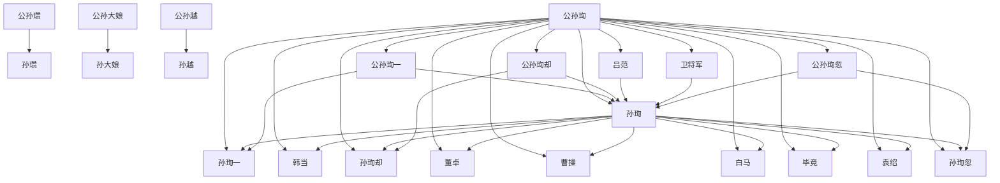

# 人物与关系图：《覆汉.txt》

## 人物表

### 1. 公孙珣

- 出现次数：1711
- 覆盖章节数：443
- 首次出现：第 2 章
- 最后出现：第 541 章
- 身份/行为线索：姓名候选(1610)、人物行为/发言(101)

### 2. 孙珣

- 出现次数：1567
- 覆盖章节数：437
- 首次出现：第 2 章
- 最后出现：第 541 章
- 身份/行为线索：姓名候选(1567)

### 3. 公孙珣一

- 出现次数：454
- 覆盖章节数：261
- 首次出现：第 3 章
- 最后出现：第 540 章
- 身份/行为线索：姓名候选(454)

### 4. 孙珣一

- 出现次数：449
- 覆盖章节数：257
- 首次出现：第 3 章
- 最后出现：第 540 章
- 身份/行为线索：姓名候选(449)

### 5. 毕竟

- 出现次数：362
- 覆盖章节数：241
- 首次出现：第 6 章
- 最后出现：第 541 章
- 身份/行为线索：姓名候选(362)

### 6. 燕书

- 出现次数：253
- 覆盖章节数：231
- 首次出现：第 3 章
- 最后出现：第 541 章
- 身份/行为线索：姓名候选(253)

### 7. 公孙珣却

- 出现次数：318
- 覆盖章节数：213
- 首次出现：第 3 章
- 最后出现：第 541 章
- 身份/行为线索：姓名候选(318)

### 8. 孙珣却

- 出现次数：311
- 覆盖章节数：208
- 首次出现：第 3 章
- 最后出现：第 541 章
- 身份/行为线索：姓名候选(311)

### 9. 卫将军

- 出现次数：1549
- 覆盖章节数：198
- 首次出现：第 271 章
- 最后出现：第 541 章
- 身份/行为线索：姓名候选(1549)

### 10. 公孙珣忽

- 出现次数：260
- 覆盖章节数：165
- 首次出现：第 3 章
- 最后出现：第 541 章
- 身份/行为线索：姓名候选(260)

### 11. 孙珣忽

- 出现次数：258
- 覆盖章节数：164
- 首次出现：第 3 章
- 最后出现：第 541 章
- 身份/行为线索：姓名候选(258)

### 12. 公孙珣当

- 出现次数：232
- 覆盖章节数：159
- 首次出现：第 6 章
- 最后出现：第 541 章
- 身份/行为线索：姓名候选(232)

### 13. 孙珣当

- 出现次数：230
- 覆盖章节数：158
- 首次出现：第 6 章
- 最后出现：第 541 章
- 身份/行为线索：姓名候选(230)

### 14. 公孙大娘

- 出现次数：541
- 覆盖章节数：150
- 首次出现：第 1 章
- 最后出现：第 541 章
- 身份/行为线索：姓名候选(538)、人物行为/发言(3)

### 15. 韩当

- 出现次数：240
- 覆盖章节数：145
- 首次出现：第 2 章
- 最后出现：第 541 章
- 身份/行为线索：姓名候选(236)、人物行为/发言(4)

### 16. 公孙珣在

- 出现次数：178
- 覆盖章节数：144
- 首次出现：第 3 章
- 最后出现：第 536 章
- 身份/行为线索：姓名候选(178)

### 17. 孙大娘

- 出现次数：518
- 覆盖章节数：143
- 首次出现：第 1 章
- 最后出现：第 541 章
- 身份/行为线索：姓名候选(518)

### 18. 孙珣在

- 出现次数：175
- 覆盖章节数：141
- 首次出现：第 3 章
- 最后出现：第 536 章
- 身份/行为线索：姓名候选(175)

### 19. 管如何

- 出现次数：174
- 覆盖章节数：140
- 首次出现：第 9 章
- 最后出现：第 539 章
- 身份/行为线索：姓名候选(174)

### 20. 何呢

- 出现次数：181
- 覆盖章节数：139
- 首次出现：第 4 章
- 最后出现：第 541 章
- 身份/行为线索：姓名候选(181)

### 21. 曹孟德

- 出现次数：484
- 覆盖章节数：130
- 首次出现：第 25 章
- 最后出现：第 541 章
- 身份/行为线索：姓名候选(484)

### 22. 安利号

- 出现次数：329
- 覆盖章节数：125
- 首次出现：第 2 章
- 最后出现：第 541 章
- 身份/行为线索：姓名候选(329)

### 23. 许久

- 出现次数：147
- 覆盖章节数：120
- 首次出现：第 47 章
- 最后出现：第 532 章
- 身份/行为线索：姓名候选(147)

### 24. 万大军

- 出现次数：225
- 覆盖章节数：117
- 首次出现：第 62 章
- 最后出现：第 533 章
- 身份/行为线索：姓名候选(225)

### 25. 公孙珣心

- 出现次数：160
- 覆盖章节数：114
- 首次出现：第 10 章
- 最后出现：第 521 章
- 身份/行为线索：姓名候选(160)

### 26. 孙珣心

- 出现次数：160
- 覆盖章节数：114
- 首次出现：第 10 章
- 最后出现：第 521 章
- 身份/行为线索：姓名候选(160)

### 27. 公孙珣闻

- 出现次数：155
- 覆盖章节数：114
- 首次出现：第 4 章
- 最后出现：第 533 章
- 身份/行为线索：姓名候选(155)

### 28. 冷笑

- 出现次数：137
- 覆盖章节数：114
- 首次出现：第 13 章
- 最后出现：第 539 章
- 身份/行为线索：姓名候选(137)

### 29. 孙珣闻

- 出现次数：153
- 覆盖章节数：113
- 首次出现：第 4 章
- 最后出现：第 533 章
- 身份/行为线索：姓名候选(153)

### 30. 袁本初

- 出现次数：411
- 覆盖章节数：112
- 首次出现：第 48 章
- 最后出现：第 541 章
- 身份/行为线索：姓名候选(411)

### 31. 相觑

- 出现次数：123
- 覆盖章节数：111
- 首次出现：第 26 章
- 最后出现：第 541 章
- 身份/行为线索：姓名候选(123)

### 32. 公孙珣自

- 出现次数：134
- 覆盖章节数：110
- 首次出现：第 2 章
- 最后出现：第 541 章
- 身份/行为线索：姓名候选(134)

### 33. 曹操

- 出现次数：248
- 覆盖章节数：109
- 首次出现：第 25 章
- 最后出现：第 541 章
- 身份/行为线索：姓名候选(247)、人物行为/发言(1)

### 34. 袁绍

- 出现次数：247
- 覆盖章节数：107
- 首次出现：第 25 章
- 最后出现：第 541 章
- 身份/行为线索：姓名候选(245)、人物行为/发言(2)

### 35. 文琪

- 出现次数：241
- 覆盖章节数：107
- 首次出现：第 52 章
- 最后出现：第 541 章
- 身份/行为线索：姓名候选(241)

### 36. 吕范

- 出现次数：211
- 覆盖章节数：105
- 首次出现：第 35 章
- 最后出现：第 541 章
- 身份/行为线索：姓名候选(199)、人物行为/发言(12)

### 37. 孙珣自

- 出现次数：128
- 覆盖章节数：105
- 首次出现：第 2 章
- 最后出现：第 541 章
- 身份/行为线索：姓名候选(128)

### 38. 公孙珣继

- 出现次数：130
- 覆盖章节数：104
- 首次出现：第 23 章
- 最后出现：第 540 章
- 身份/行为线索：姓名候选(130)

### 39. 孙珣继

- 出现次数：130
- 覆盖章节数：104
- 首次出现：第 23 章
- 最后出现：第 540 章
- 身份/行为线索：姓名候选(130)

### 40. 公孙珣依

- 出现次数：132
- 覆盖章节数：100
- 首次出现：第 15 章
- 最后出现：第 540 章
- 身份/行为线索：姓名候选(132)

### 41. 孙珣依

- 出现次数：132
- 覆盖章节数：100
- 首次出现：第 15 章
- 最后出现：第 540 章
- 身份/行为线索：姓名候选(132)

### 42. 公孙珣看

- 出现次数：112
- 覆盖章节数：100
- 首次出现：第 4 章
- 最后出现：第 540 章
- 身份/行为线索：姓名候选(112)

### 43. 孙珣看

- 出现次数：112
- 覆盖章节数：100
- 首次出现：第 4 章
- 最后出现：第 540 章
- 身份/行为线索：姓名候选(112)

### 44. 公孙文琪

- 出现次数：228
- 覆盖章节数：99
- 首次出现：第 53 章
- 最后出现：第 533 章
- 身份/行为线索：姓名候选(228)

### 45. 孙文琪

- 出现次数：217
- 覆盖章节数：98
- 首次出现：第 53 章
- 最后出现：第 533 章
- 身份/行为线索：姓名候选(217)

### 46. 公孙珣面

- 出现次数：125
- 覆盖章节数：97
- 首次出现：第 6 章
- 最后出现：第 519 章
- 身份/行为线索：姓名候选(125)

### 47. 后居然

- 出现次数：110
- 覆盖章节数：97
- 首次出现：第 9 章
- 最后出现：第 536 章
- 身份/行为线索：姓名候选(110)

### 48. 公孙珣见

- 出现次数：117
- 覆盖章节数：96
- 首次出现：第 43 章
- 最后出现：第 534 章
- 身份/行为线索：姓名候选(117)

### 49. 孙珣见

- 出现次数：117
- 覆盖章节数：96
- 首次出现：第 43 章
- 最后出现：第 534 章
- 身份/行为线索：姓名候选(117)

### 50. 孙珣面

- 出现次数：123
- 覆盖章节数：95
- 首次出现：第 6 章
- 最后出现：第 519 章
- 身份/行为线索：姓名候选(123)

### 51. 公孙珣正

- 出现次数：110
- 覆盖章节数：95
- 首次出现：第 25 章
- 最后出现：第 534 章
- 身份/行为线索：姓名候选(110)

### 52. 何意

- 出现次数：107
- 覆盖章节数：95
- 首次出现：第 4 章
- 最后出现：第 538 章
- 身份/行为线索：姓名候选(107)

### 53. 尚书台

- 出现次数：273
- 覆盖章节数：94
- 首次出现：第 73 章
- 最后出现：第 541 章
- 身份/行为线索：姓名候选(273)

### 54. 公孙珣终

- 出现次数：116
- 覆盖章节数：93
- 首次出现：第 22 章
- 最后出现：第 540 章
- 身份/行为线索：姓名候选(116)

### 55. 孙珣终

- 出现次数：116
- 覆盖章节数：93
- 首次出现：第 22 章
- 最后出现：第 540 章
- 身份/行为线索：姓名候选(116)

### 56. 公孙珣此

- 出现次数：110
- 覆盖章节数：93
- 首次出现：第 4 章
- 最后出现：第 519 章
- 身份/行为线索：姓名候选(110)

### 57. 孙珣正

- 出现次数：107
- 覆盖章节数：93
- 首次出现：第 25 章
- 最后出现：第 534 章
- 身份/行为线索：姓名候选(107)

### 58. 刘备

- 出现次数：212
- 覆盖章节数：91
- 首次出现：第 15 章
- 最后出现：第 541 章
- 身份/行为线索：姓名候选(212)

### 59. 解释道

- 出现次数：116
- 覆盖章节数：91
- 首次出现：第 22 章
- 最后出现：第 495 章
- 身份/行为线索：姓名候选(116)

### 60. 孙珣此

- 出现次数：107
- 覆盖章节数：91
- 首次出现：第 4 章
- 最后出现：第 519 章
- 身份/行为线索：姓名候选(107)

### 61. 白马义

- 出现次数：214
- 覆盖章节数：89
- 首次出现：第 111 章
- 最后出现：第 541 章
- 身份/行为线索：姓名候选(214)

### 62. 公孙珣身

- 出现次数：107
- 覆盖章节数：89
- 首次出现：第 10 章
- 最后出现：第 527 章
- 身份/行为线索：姓名候选(107)

### 63. 公孙珣愈

- 出现次数：105
- 覆盖章节数：87
- 首次出现：第 28 章
- 最后出现：第 540 章
- 身份/行为线索：姓名候选(105)

### 64. 公孙珣倒

- 出现次数：111
- 覆盖章节数：86
- 首次出现：第 20 章
- 最后出现：第 540 章
- 身份/行为线索：姓名候选(111)

### 65. 孙珣倒

- 出现次数：111
- 覆盖章节数：86
- 首次出现：第 20 章
- 最后出现：第 540 章
- 身份/行为线索：姓名候选(111)

### 66. 孙珣身

- 出现次数：104
- 覆盖章节数：86
- 首次出现：第 10 章
- 最后出现：第 527 章
- 身份/行为线索：姓名候选(104)

### 67. 孙珣愈

- 出现次数：104
- 覆盖章节数：86
- 首次出现：第 28 章
- 最后出现：第 540 章
- 身份/行为线索：姓名候选(104)

### 68. 刘玄德

- 出现次数：175
- 覆盖章节数：83
- 首次出现：第 181 章
- 最后出现：第 541 章
- 身份/行为线索：姓名候选(175)

### 69. 时此刻

- 出现次数：95
- 覆盖章节数：83
- 首次出现：第 4 章
- 最后出现：第 535 章
- 身份/行为线索：姓名候选(95)

### 70. 董卓

- 出现次数：202
- 覆盖章节数：82
- 首次出现：第 80 章
- 最后出现：第 541 章
- 身份/行为线索：姓名候选(200)、人物行为/发言(2)

### 71. 时无言

- 出现次数：90
- 覆盖章节数：79
- 首次出现：第 23 章
- 最后出现：第 518 章
- 身份/行为线索：姓名候选(90)

### 72. 郎将

- 出现次数：125
- 覆盖章节数：78
- 首次出现：第 50 章
- 最后出现：第 541 章
- 身份/行为线索：姓名候选(125)

### 73. 公孙越

- 出现次数：132
- 覆盖章节数：76
- 首次出现：第 3 章
- 最后出现：第 541 章
- 身份/行为线索：姓名候选(131)、人物行为/发言(1)

### 74. 何事

- 出现次数：91
- 覆盖章节数：76
- 首次出现：第 22 章
- 最后出现：第 539 章
- 身份/行为线索：姓名候选(91)

### 75. 明显

- 出现次数：84
- 覆盖章节数：76
- 首次出现：第 13 章
- 最后出现：第 541 章
- 身份/行为线索：姓名候选(84)

### 76. 毕竟嘛

- 出现次数：82
- 覆盖章节数：76
- 首次出现：第 6 章
- 最后出现：第 536 章
- 身份/行为线索：姓名候选(82)

### 77. 吕布

- 出现次数：164
- 覆盖章节数：75
- 首次出现：第 81 章
- 最后出现：第 541 章
- 身份/行为线索：姓名候选(164)

### 78. 成功

- 出现次数：94
- 覆盖章节数：75
- 首次出现：第 4 章
- 最后出现：第 534 章
- 身份/行为线索：姓名候选(94)

### 79. 何处

- 出现次数：92
- 覆盖章节数：75
- 首次出现：第 7 章
- 最后出现：第 532 章
- 身份/行为线索：姓名候选(92)

### 80. 孙越

- 出现次数：125
- 覆盖章节数：74
- 首次出现：第 3 章
- 最后出现：第 541 章
- 身份/行为线索：姓名候选(125)

### 81. 祖武皇

- 出现次数：85
- 覆盖章节数：74
- 首次出现：第 8 章
- 最后出现：第 541 章
- 身份/行为线索：姓名候选(85)

### 82. 公孙珣无

- 出现次数：85
- 覆盖章节数：72
- 首次出现：第 10 章
- 最后出现：第 481 章
- 身份/行为线索：姓名候选(85)

### 83. 公孙珣听

- 出现次数：79
- 覆盖章节数：72
- 首次出现：第 4 章
- 最后出现：第 541 章
- 身份/行为线索：姓名候选(79)

### 84. 连连摇

- 出现次数：77
- 覆盖章节数：72
- 首次出现：第 2 章
- 最后出现：第 532 章
- 身份/行为线索：姓名候选(77)

### 85. 孙珣无

- 出现次数：84
- 覆盖章节数：71
- 首次出现：第 10 章
- 最后出现：第 481 章
- 身份/行为线索：姓名候选(84)

### 86. 孙珣听

- 出现次数：78
- 覆盖章节数：71
- 首次出现：第 4 章
- 最后出现：第 541 章
- 身份/行为线索：姓名候选(78)

### 87. 车骑将

- 出现次数：167
- 覆盖章节数：70
- 首次出现：第 87 章
- 最后出现：第 541 章
- 身份/行为线索：姓名候选(167)

### 88. 公孙珣缓

- 出现次数：82
- 覆盖章节数：69
- 首次出现：第 50 章
- 最后出现：第 540 章
- 身份/行为线索：姓名候选(82)

### 89. 孙珣缓

- 出现次数：82
- 覆盖章节数：69
- 首次出现：第 50 章
- 最后出现：第 540 章
- 身份/行为线索：姓名候选(82)

### 90. 公孙珣连

- 出现次数：81
- 覆盖章节数：69
- 首次出现：第 9 章
- 最后出现：第 540 章
- 身份/行为线索：姓名候选(81)

### 91. 孙珣连

- 出现次数：81
- 覆盖章节数：69
- 首次出现：第 9 章
- 最后出现：第 540 章
- 身份/行为线索：姓名候选(81)

### 92. 后却

- 出现次数：76
- 覆盖章节数：69
- 首次出现：第 3 章
- 最后出现：第 539 章
- 身份/行为线索：姓名候选(76)

### 93. 安排

- 出现次数：85
- 覆盖章节数：68
- 首次出现：第 23 章
- 最后出现：第 541 章
- 身份/行为线索：姓名候选(85)

### 94. 王粲

- 出现次数：78
- 覆盖章节数：68
- 首次出现：第 49 章
- 最后出现：第 541 章
- 身份/行为线索：姓名候选(78)

### 95. 公孙珣复

- 出现次数：92
- 覆盖章节数：67
- 首次出现：第 43 章
- 最后出现：第 541 章
- 身份/行为线索：姓名候选(84)、人物行为/发言(8)

### 96. 孙珣复

- 出现次数：84
- 覆盖章节数：67
- 首次出现：第 43 章
- 最后出现：第 541 章
- 身份/行为线索：姓名候选(84)

### 97. 周围人

- 出现次数：82
- 覆盖章节数：67
- 首次出现：第 3 章
- 最后出现：第 539 章
- 身份/行为线索：姓名候选(81)、人物行为/发言(1)

### 98. 公孙瓒

- 出现次数：121
- 覆盖章节数：65
- 首次出现：第 2 章
- 最后出现：第 541 章
- 身份/行为线索：姓名候选(119)、人物行为/发言(2)

### 99. 王修

- 出现次数：105
- 覆盖章节数：65
- 首次出现：第 143 章
- 最后出现：第 541 章
- 身份/行为线索：姓名候选(105)

### 100. 卢龙塞

- 出现次数：191
- 覆盖章节数：64
- 首次出现：第 2 章
- 最后出现：第 541 章
- 身份/行为线索：姓名候选(191)

## 关系边

- 公孙珣 <-> 孙珣：共现 12038 次，覆盖第 2-541 章，关系线索：同章共现(11038)、母亲(292)、兄弟(137)、老师(129)、儿子(105)、妻子(65)、学生(56)、下属(48)
- 公孙瓒 <-> 孙瓒：共现 518 次，覆盖第 2-541 章，关系线索：同章共现(449)、兄弟(36)、弟子(10)、母亲(7)、老师(5)、儿子(5)、学生(4)、下属(4)
- 公孙大娘 <-> 孙大娘：共现 511 次，覆盖第 1-541 章，关系线索：同章共现(382)、儿子(84)、母亲(20)、兄弟(5)、下属(4)、妻子(4)、丈夫(3)、合作(3)
- 公孙越 <-> 孙越：共现 459 次，覆盖第 2-541 章，关系线索：同章共现(395)、兄弟(31)、老师(11)、女儿(6)、母亲(5)、学生(5)、弟子(4)、妻子(4)
- 公孙珣 <-> 公孙珣一：共现 428 次，覆盖第 3-540 章，关系线索：同章共现(395)、母亲(9)、妻子(5)、兄弟(3)、儿子(3)、学生(3)、下属(3)、敌人(2)
- 公孙珣 <-> 孙珣一：共现 428 次，覆盖第 3-540 章，关系线索：同章共现(395)、母亲(9)、妻子(5)、兄弟(3)、儿子(3)、学生(3)、下属(3)、敌人(2)
- 公孙珣一 <-> 孙珣：共现 428 次，覆盖第 3-540 章，关系线索：同章共现(395)、母亲(9)、妻子(5)、兄弟(3)、儿子(3)、学生(3)、下属(3)、敌人(2)
- 孙珣 <-> 孙珣一：共现 428 次，覆盖第 3-540 章，关系线索：同章共现(395)、母亲(9)、妻子(5)、兄弟(3)、儿子(3)、学生(3)、下属(3)、敌人(2)
- 公孙珣一 <-> 孙珣一：共现 428 次，覆盖第 3-540 章，关系线索：同章共现(395)、母亲(9)、妻子(5)、兄弟(3)、儿子(3)、学生(3)、下属(3)、敌人(2)
- 公孙珣 <-> 韩当：共现 360 次，覆盖第 2-537 章，关系线索：同章共现(336)、母亲(10)、兄弟(6)、命令(4)、老师(2)、下属(2)、妻子(1)、儿子(1)
- 孙珣 <-> 韩当：共现 360 次，覆盖第 2-537 章，关系线索：同章共现(336)、母亲(10)、兄弟(6)、命令(4)、老师(2)、下属(2)、妻子(1)、儿子(1)
- 公孙珣 <-> 公孙珣却：共现 317 次，覆盖第 3-541 章，关系线索：同章共现(292)、母亲(8)、命令(4)、老师(3)、妻子(3)、兄弟(2)、儿子(1)、丈夫(1)
- 公孙珣 <-> 孙珣却：共现 317 次，覆盖第 3-541 章，关系线索：同章共现(292)、母亲(8)、命令(4)、老师(3)、妻子(3)、兄弟(2)、儿子(1)、丈夫(1)
- 公孙珣却 <-> 孙珣：共现 317 次，覆盖第 3-541 章，关系线索：同章共现(292)、母亲(8)、命令(4)、老师(3)、妻子(3)、兄弟(2)、儿子(1)、丈夫(1)
- 孙珣 <-> 孙珣却：共现 317 次，覆盖第 3-541 章，关系线索：同章共现(292)、母亲(8)、命令(4)、老师(3)、妻子(3)、兄弟(2)、儿子(1)、丈夫(1)
- 公孙珣却 <-> 孙珣却：共现 317 次，覆盖第 3-541 章，关系线索：同章共现(292)、母亲(8)、命令(4)、老师(3)、妻子(3)、兄弟(2)、儿子(1)、丈夫(1)
- 公孙珣 <-> 吕范：共现 312 次，覆盖第 35-541 章，关系线索：同章共现(291)、儿子(4)、命令(2)、母亲(2)、下属(2)、老师(2)、对手(1)、女儿(1)
- 吕范 <-> 孙珣：共现 312 次，覆盖第 35-541 章，关系线索：同章共现(291)、儿子(4)、命令(2)、母亲(2)、下属(2)、老师(2)、对手(1)、女儿(1)
- 公孙珣 <-> 卫将军：共现 309 次，覆盖第 271-501 章，关系线索：同章共现(280)、下属(6)、母亲(5)、兄弟(5)、女儿(4)、学生(3)、儿子(3)、背叛(1)
- 卫将军 <-> 孙珣：共现 309 次，覆盖第 271-501 章，关系线索：同章共现(280)、下属(6)、母亲(5)、兄弟(5)、女儿(4)、学生(3)、儿子(3)、背叛(1)
- 公孙珣 <-> 董卓：共现 287 次，覆盖第 80-534 章，关系线索：同章共现(263)、合作(4)、兄弟(4)、老师(3)、母亲(3)、下属(3)、女儿(2)、弟子(2)
- 孙珣 <-> 董卓：共现 287 次，覆盖第 80-534 章，关系线索：同章共现(263)、合作(4)、兄弟(4)、老师(3)、母亲(3)、下属(3)、女儿(2)、弟子(2)
- 公孙珣 <-> 曹操：共现 274 次，覆盖第 30-534 章，关系线索：同章共现(250)、兄弟(5)、儿子(5)、母亲(4)、妻子(3)、对手(3)、下属(2)、命令(2)
- 孙珣 <-> 曹操：共现 274 次，覆盖第 30-534 章，关系线索：同章共现(250)、兄弟(5)、儿子(5)、母亲(4)、妻子(3)、对手(3)、下属(2)、命令(2)
- 公孙珣 <-> 白马：共现 273 次，覆盖第 7-541 章，关系线索：同章共现(257)、儿子(4)、命令(3)、兄弟(2)、母亲(2)、保护(2)、敌人(1)、下属(1)
- 孙珣 <-> 白马：共现 273 次，覆盖第 7-541 章，关系线索：同章共现(257)、儿子(4)、命令(3)、兄弟(2)、母亲(2)、保护(2)、敌人(1)、下属(1)
- 公孙珣 <-> 毕竟：共现 272 次，覆盖第 11-540 章，关系线索：同章共现(243)、兄弟(8)、母亲(4)、下属(4)、老师(2)、学生(2)、儿子(2)、父亲(1)
- 孙珣 <-> 毕竟：共现 272 次，覆盖第 11-540 章，关系线索：同章共现(243)、兄弟(8)、母亲(4)、下属(4)、老师(2)、学生(2)、儿子(2)、父亲(1)
- 公孙珣 <-> 袁绍：共现 263 次，覆盖第 25-534 章，关系线索：同章共现(235)、兄弟(8)、母亲(5)、儿子(5)、父亲(3)、弟子(2)、下属(2)、盟友(2)
- 孙珣 <-> 袁绍：共现 263 次，覆盖第 25-534 章，关系线索：同章共现(235)、兄弟(8)、母亲(5)、儿子(5)、父亲(3)、弟子(2)、下属(2)、盟友(2)
- 公孙珣 <-> 公孙珣忽：共现 259 次，覆盖第 3-541 章，关系线索：同章共现(242)、老师(5)、丈夫(3)、母亲(3)、妻子(2)、兄弟(2)、交易(1)、命令(1)
- 公孙珣 <-> 孙珣忽：共现 259 次，覆盖第 3-541 章，关系线索：同章共现(242)、老师(5)、丈夫(3)、母亲(3)、妻子(2)、兄弟(2)、交易(1)、命令(1)
- 公孙珣忽 <-> 孙珣：共现 259 次，覆盖第 3-541 章，关系线索：同章共现(242)、老师(5)、丈夫(3)、母亲(3)、妻子(2)、兄弟(2)、交易(1)、命令(1)
- 孙珣 <-> 孙珣忽：共现 259 次，覆盖第 3-541 章，关系线索：同章共现(242)、老师(5)、丈夫(3)、母亲(3)、妻子(2)、兄弟(2)、交易(1)、命令(1)
- 公孙珣忽 <-> 孙珣忽：共现 259 次，覆盖第 3-541 章，关系线索：同章共现(242)、老师(5)、丈夫(3)、母亲(3)、妻子(2)、兄弟(2)、交易(1)、命令(1)
- 公孙珣 <-> 公孙珣当：共现 222 次，覆盖第 6-541 章，关系线索：同章共现(204)、母亲(7)、老师(4)、儿子(2)、女儿(1)、妻子(1)、上司(1)、弟子(1)
- 公孙珣 <-> 孙珣当：共现 222 次，覆盖第 6-541 章，关系线索：同章共现(204)、母亲(7)、老师(4)、儿子(2)、女儿(1)、妻子(1)、上司(1)、弟子(1)
- 公孙珣当 <-> 孙珣：共现 222 次，覆盖第 6-541 章，关系线索：同章共现(204)、母亲(7)、老师(4)、儿子(2)、女儿(1)、妻子(1)、上司(1)、弟子(1)
- 孙珣 <-> 孙珣当：共现 222 次，覆盖第 6-541 章，关系线索：同章共现(204)、母亲(7)、老师(4)、儿子(2)、女儿(1)、妻子(1)、上司(1)、弟子(1)
- 公孙珣当 <-> 孙珣当：共现 222 次，覆盖第 6-541 章，关系线索：同章共现(204)、母亲(7)、老师(4)、儿子(2)、女儿(1)、妻子(1)、上司(1)、弟子(1)
- 白马 <-> 白马义：共现 206 次，覆盖第 111-541 章，关系线索：同章共现(192)、命令(3)、下属(2)、兄弟(2)、追杀(2)、保护(2)、儿子(2)、学生(1)
- 公孙文琪 <-> 文琪：共现 200 次，覆盖第 53-533 章，关系线索：同章共现(183)、丈夫(4)、老师(2)、下属(2)、儿子(2)、上司(1)、敌人(1)、父亲(1)
- 孙文琪 <-> 文琪：共现 198 次，覆盖第 53-533 章，关系线索：同章共现(182)、丈夫(3)、老师(2)、下属(2)、儿子(2)、上司(1)、敌人(1)、父亲(1)
- 公孙文琪 <-> 孙文琪：共现 198 次，覆盖第 53-533 章，关系线索：同章共现(182)、丈夫(3)、老师(2)、下属(2)、儿子(2)、上司(1)、敌人(1)、父亲(1)
- 公孙珣 <-> 公孙珣在：共现 175 次，覆盖第 3-536 章，关系线索：同章共现(165)、母亲(4)、儿子(2)、对手(2)、丈夫(1)、父亲(1)、女儿(1)、保护(1)
- 公孙珣在 <-> 孙珣：共现 175 次，覆盖第 3-536 章，关系线索：同章共现(165)、母亲(4)、儿子(2)、对手(2)、丈夫(1)、父亲(1)、女儿(1)、保护(1)
- 公孙珣 <-> 孙珣在：共现 174 次，覆盖第 3-536 章，关系线索：同章共现(164)、母亲(4)、儿子(2)、对手(2)、丈夫(1)、父亲(1)、女儿(1)、保护(1)
- 孙珣 <-> 孙珣在：共现 174 次，覆盖第 3-536 章，关系线索：同章共现(164)、母亲(4)、儿子(2)、对手(2)、丈夫(1)、父亲(1)、女儿(1)、保护(1)
- 公孙珣在 <-> 孙珣在：共现 174 次，覆盖第 3-536 章，关系线索：同章共现(164)、母亲(4)、儿子(2)、对手(2)、丈夫(1)、父亲(1)、女儿(1)、保护(1)
- 公孙珣 <-> 公孙越：共现 171 次，覆盖第 3-540 章，关系线索：同章共现(133)、兄弟(21)、母亲(5)、老师(5)、学生(3)、妻子(3)、命令(3)、弟子(2)
- 公孙越 <-> 孙珣：共现 171 次，覆盖第 3-540 章，关系线索：同章共现(133)、兄弟(21)、母亲(5)、老师(5)、学生(3)、妻子(3)、命令(3)、弟子(2)
- 刘备 <-> 曹操：共现 162 次，覆盖第 178-541 章，关系线索：同章共现(147)、妻子(4)、母亲(3)、儿子(3)、兄弟(2)、下属(1)、敌人(1)、父亲(1)
- 公孙珣 <-> 刘备：共现 159 次，覆盖第 15-534 章，关系线索：同章共现(136)、母亲(8)、儿子(4)、兄弟(4)、下属(3)、学生(3)、女儿(1)、父亲(1)
- 刘备 <-> 孙珣：共现 159 次，覆盖第 15-534 章，关系线索：同章共现(136)、母亲(8)、儿子(4)、兄弟(4)、下属(3)、学生(3)、女儿(1)、父亲(1)
- 公孙珣 <-> 公孙珣心：共现 158 次，覆盖第 10-521 章，关系线索：同章共现(145)、兄弟(4)、母亲(4)、下属(2)、命令(2)、对手(1)、丈夫(1)
- 公孙珣 <-> 孙珣心：共现 158 次，覆盖第 10-521 章，关系线索：同章共现(145)、兄弟(4)、母亲(4)、下属(2)、命令(2)、对手(1)、丈夫(1)
- 公孙珣心 <-> 孙珣：共现 158 次，覆盖第 10-521 章，关系线索：同章共现(145)、兄弟(4)、母亲(4)、下属(2)、命令(2)、对手(1)、丈夫(1)
- 孙珣 <-> 孙珣心：共现 158 次，覆盖第 10-521 章，关系线索：同章共现(145)、兄弟(4)、母亲(4)、下属(2)、命令(2)、对手(1)、丈夫(1)
- 公孙珣心 <-> 孙珣心：共现 158 次，覆盖第 10-521 章，关系线索：同章共现(145)、兄弟(4)、母亲(4)、下属(2)、命令(2)、对手(1)、丈夫(1)
- 公孙珣 <-> 孙越：共现 157 次，覆盖第 3-540 章，关系线索：同章共现(119)、兄弟(21)、母亲(5)、老师(5)、学生(3)、妻子(3)、命令(3)、弟子(2)
- 孙珣 <-> 孙越：共现 157 次，覆盖第 3-540 章，关系线索：同章共现(119)、兄弟(21)、母亲(5)、老师(5)、学生(3)、妻子(3)、命令(3)、弟子(2)
- 公孙珣 <-> 公孙珣闻：共现 154 次，覆盖第 4-533 章，关系线索：同章共现(138)、母亲(5)、兄弟(4)、老师(3)、弟子(1)、儿子(1)、敌人(1)、学生(1)
- 公孙珣 <-> 孙珣闻：共现 154 次，覆盖第 4-533 章，关系线索：同章共现(138)、母亲(5)、兄弟(4)、老师(3)、弟子(1)、儿子(1)、敌人(1)、学生(1)
- 公孙珣闻 <-> 孙珣：共现 154 次，覆盖第 4-533 章，关系线索：同章共现(138)、母亲(5)、兄弟(4)、老师(3)、弟子(1)、儿子(1)、敌人(1)、学生(1)
- 孙珣 <-> 孙珣闻：共现 154 次，覆盖第 4-533 章，关系线索：同章共现(138)、母亲(5)、兄弟(4)、老师(3)、弟子(1)、儿子(1)、敌人(1)、学生(1)
- 公孙珣闻 <-> 孙珣闻：共现 154 次，覆盖第 4-533 章，关系线索：同章共现(138)、母亲(5)、兄弟(4)、老师(3)、弟子(1)、儿子(1)、敌人(1)、学生(1)
- 公孙珣 <-> 明显：共现 149 次，覆盖第 5-533 章，关系线索：同章共现(136)、母亲(3)、女儿(2)、老师(2)、对手(2)、儿子(2)、兄弟(2)、父亲(1)
- 孙珣 <-> 明显：共现 149 次，覆盖第 5-533 章，关系线索：同章共现(136)、母亲(3)、女儿(2)、老师(2)、对手(2)、儿子(2)、兄弟(2)、父亲(1)
- 公孙珣 <-> 公孙瓒：共现 131 次，覆盖第 2-477 章，关系线索：同章共现(99)、兄弟(19)、母亲(5)、老师(4)、弟子(4)、学生(2)、儿子(2)、对手(1)
- 公孙瓒 <-> 孙珣：共现 131 次，覆盖第 2-477 章，关系线索：同章共现(99)、兄弟(19)、母亲(5)、老师(4)、弟子(4)、学生(2)、儿子(2)、对手(1)
- 公孙珣 <-> 公孙珣自：共现 130 次，覆盖第 2-541 章，关系线索：同章共现(120)、母亲(2)、兄弟(2)、上司(1)、下属(1)、父亲(1)、儿子(1)、妻子(1)
- 公孙珣自 <-> 孙珣：共现 130 次，覆盖第 2-541 章，关系线索：同章共现(120)、母亲(2)、兄弟(2)、上司(1)、下属(1)、父亲(1)、儿子(1)、妻子(1)
- 公孙珣 <-> 公孙珣继：共现 130 次，覆盖第 23-540 章，关系线索：同章共现(115)、老师(5)、母亲(4)、丈夫(3)、兄弟(2)、妻子(2)、女儿(1)、学生(1)
- 公孙珣继 <-> 孙珣：共现 130 次，覆盖第 23-540 章，关系线索：同章共现(115)、老师(5)、母亲(4)、丈夫(3)、兄弟(2)、妻子(2)、女儿(1)、学生(1)
- 公孙珣 <-> 孙珣自：共现 129 次，覆盖第 2-541 章，关系线索：同章共现(119)、母亲(2)、兄弟(2)、上司(1)、下属(1)、父亲(1)、儿子(1)、妻子(1)
- 孙珣 <-> 孙珣自：共现 129 次，覆盖第 2-541 章，关系线索：同章共现(119)、母亲(2)、兄弟(2)、上司(1)、下属(1)、父亲(1)、儿子(1)、妻子(1)
- 公孙珣自 <-> 孙珣自：共现 129 次，覆盖第 2-541 章，关系线索：同章共现(119)、母亲(2)、兄弟(2)、上司(1)、下属(1)、父亲(1)、儿子(1)、妻子(1)
- 公孙珣 <-> 孙珣继：共现 129 次，覆盖第 23-540 章，关系线索：同章共现(114)、老师(5)、母亲(4)、丈夫(3)、兄弟(2)、妻子(2)、女儿(1)、学生(1)
- 孙珣 <-> 孙珣继：共现 129 次，覆盖第 23-540 章，关系线索：同章共现(114)、老师(5)、母亲(4)、丈夫(3)、兄弟(2)、妻子(2)、女儿(1)、学生(1)
- 公孙珣继 <-> 孙珣继：共现 129 次，覆盖第 23-540 章，关系线索：同章共现(114)、老师(5)、母亲(4)、丈夫(3)、兄弟(2)、妻子(2)、女儿(1)、学生(1)
- 公孙珣 <-> 冷笑：共现 129 次，覆盖第 47-529 章，关系线索：同章共现(124)、兄弟(2)、母亲(1)、丈夫(1)、对手(1)
- 冷笑 <-> 孙珣：共现 129 次，覆盖第 47-529 章，关系线索：同章共现(124)、兄弟(2)、母亲(1)、丈夫(1)、对手(1)
- 公孙珣 <-> 曹孟德：共现 125 次，覆盖第 35-540 章，关系线索：同章共现(112)、母亲(6)、兄弟(3)、儿子(2)、对手(2)、父亲(1)、女儿(1)、老师(1)
- 孙珣 <-> 曹孟德：共现 125 次，覆盖第 35-540 章，关系线索：同章共现(112)、母亲(6)、兄弟(3)、儿子(2)、对手(2)、父亲(1)、女儿(1)、老师(1)
- 公孙珣 <-> 高句丽：共现 123 次，覆盖第 7-460 章，关系线索：同章共现(117)、儿子(2)、母亲(1)、保护(1)、下属(1)、命令(1)
- 孙珣 <-> 高句丽：共现 123 次，覆盖第 7-460 章，关系线索：同章共现(117)、儿子(2)、母亲(1)、保护(1)、下属(1)、命令(1)
- 公孙珣 <-> 王修：共现 122 次，覆盖第 143-529 章，关系线索：同章共现(116)、母亲(3)、学生(1)、儿子(1)、兄弟(1)、命令(1)
- 孙珣 <-> 王修：共现 122 次，覆盖第 143-529 章，关系线索：同章共现(116)、母亲(3)、学生(1)、儿子(1)、兄弟(1)、命令(1)
- 公孙珣 <-> 公孙珣面：共现 121 次，覆盖第 6-519 章，关系线索：同章共现(115)、母亲(2)、儿子(2)、兄弟(1)、女儿(1)、姐妹(1)
- 公孙珣 <-> 孙珣面：共现 121 次，覆盖第 6-519 章，关系线索：同章共现(115)、母亲(2)、儿子(2)、兄弟(1)、女儿(1)、姐妹(1)
- 公孙珣面 <-> 孙珣：共现 121 次，覆盖第 6-519 章，关系线索：同章共现(115)、母亲(2)、儿子(2)、兄弟(1)、女儿(1)、姐妹(1)
- 孙珣 <-> 孙珣面：共现 121 次，覆盖第 6-519 章，关系线索：同章共现(115)、母亲(2)、儿子(2)、兄弟(1)、女儿(1)、姐妹(1)
- 公孙珣面 <-> 孙珣面：共现 121 次，覆盖第 6-519 章，关系线索：同章共现(115)、母亲(2)、儿子(2)、兄弟(1)、女儿(1)、姐妹(1)
- 公孙珣 <-> 公孙珣依：共现 121 次，覆盖第 15-540 章，关系线索：同章共现(115)、老师(2)、兄弟(1)、妻子(1)、母亲(1)、儿子(1)、女儿(1)
- 公孙珣依 <-> 孙珣：共现 121 次，覆盖第 15-540 章，关系线索：同章共现(115)、老师(2)、兄弟(1)、妻子(1)、母亲(1)、儿子(1)、女儿(1)
- 公孙珣 <-> 孙珣依：共现 120 次，覆盖第 15-540 章，关系线索：同章共现(114)、老师(2)、兄弟(1)、妻子(1)、母亲(1)、儿子(1)、女儿(1)
- 孙珣 <-> 孙珣依：共现 120 次，覆盖第 15-540 章，关系线索：同章共现(114)、老师(2)、兄弟(1)、妻子(1)、母亲(1)、儿子(1)、女儿(1)
- 公孙珣依 <-> 孙珣依：共现 120 次，覆盖第 15-540 章，关系线索：同章共现(114)、老师(2)、兄弟(1)、妻子(1)、母亲(1)、儿子(1)、女儿(1)
- 公孙大娘 <-> 公孙珣：共现 119 次，覆盖第 2-541 章，关系线索：同章共现(88)、母亲(15)、儿子(12)、妻子(3)、女儿(2)、上司(1)、对手(1)、合作(1)
- 公孙大娘 <-> 孙珣：共现 119 次，覆盖第 2-541 章，关系线索：同章共现(88)、母亲(15)、儿子(12)、妻子(3)、女儿(2)、上司(1)、对手(1)、合作(1)
- 公孙珣 <-> 孙大娘：共现 118 次，覆盖第 2-541 章，关系线索：同章共现(87)、母亲(15)、儿子(12)、妻子(3)、女儿(2)、上司(1)、对手(1)、合作(1)
- 孙大娘 <-> 孙珣：共现 118 次，覆盖第 2-541 章，关系线索：同章共现(87)、母亲(15)、儿子(12)、妻子(3)、女儿(2)、上司(1)、对手(1)、合作(1)
- 公孙珣 <-> 袁本初：共现 117 次，覆盖第 25-541 章，关系线索：同章共现(103)、兄弟(7)、儿子(3)、母亲(2)、对手(2)、老师(1)
- 孙珣 <-> 袁本初：共现 117 次，覆盖第 25-541 章，关系线索：同章共现(103)、兄弟(7)、儿子(3)、母亲(2)、对手(2)、老师(1)
- 公孙珣 <-> 公孙珣见：共现 117 次，覆盖第 43-534 章，关系线索：同章共现(107)、兄弟(3)、妻子(2)、母亲(2)、儿子(2)、学生(2)、女儿(1)、命令(1)
- 公孙珣 <-> 孙珣见：共现 117 次，覆盖第 43-534 章，关系线索：同章共现(107)、兄弟(3)、妻子(2)、母亲(2)、儿子(2)、学生(2)、女儿(1)、命令(1)
- 公孙珣见 <-> 孙珣：共现 117 次，覆盖第 43-534 章，关系线索：同章共现(107)、兄弟(3)、妻子(2)、母亲(2)、儿子(2)、学生(2)、女儿(1)、命令(1)
- 孙珣 <-> 孙珣见：共现 117 次，覆盖第 43-534 章，关系线索：同章共现(107)、兄弟(3)、妻子(2)、母亲(2)、儿子(2)、学生(2)、女儿(1)、命令(1)
- 公孙珣见 <-> 孙珣见：共现 117 次，覆盖第 43-534 章，关系线索：同章共现(107)、兄弟(3)、妻子(2)、母亲(2)、儿子(2)、学生(2)、女儿(1)、命令(1)
- 公孙珣 <-> 公孙珣终：共现 113 次，覆盖第 22-540 章，关系线索：同章共现(105)、儿子(3)、母亲(2)、下属(2)、上司(1)、对手(1)
- 公孙珣终 <-> 孙珣：共现 113 次，覆盖第 22-540 章，关系线索：同章共现(105)、儿子(3)、母亲(2)、下属(2)、上司(1)、对手(1)
- 公孙珣 <-> 孙珣终：共现 111 次，覆盖第 22-540 章，关系线索：同章共现(103)、儿子(3)、母亲(2)、下属(2)、上司(1)、对手(1)
- 孙珣 <-> 孙珣终：共现 111 次，覆盖第 22-540 章，关系线索：同章共现(103)、儿子(3)、母亲(2)、下属(2)、上司(1)、对手(1)
- 公孙珣终 <-> 孙珣终：共现 111 次，覆盖第 22-540 章，关系线索：同章共现(103)、儿子(3)、母亲(2)、下属(2)、上司(1)、对手(1)
- 公孙珣 <-> 公孙珣此：共现 110 次，覆盖第 4-519 章，关系线索：同章共现(104)、母亲(4)、妻子(2)、老师(1)
- 公孙珣此 <-> 孙珣：共现 110 次，覆盖第 4-519 章，关系线索：同章共现(104)、母亲(4)、妻子(2)、老师(1)
- 公孙珣 <-> 公孙珣看：共现 110 次，覆盖第 4-540 章，关系线索：同章共现(96)、母亲(6)、老师(2)、兄弟(1)、儿子(1)、丈夫(1)、保护(1)、盟友(1)
- 公孙珣 <-> 孙珣看：共现 110 次，覆盖第 4-540 章，关系线索：同章共现(96)、母亲(6)、老师(2)、兄弟(1)、儿子(1)、丈夫(1)、保护(1)、盟友(1)
- 公孙珣看 <-> 孙珣：共现 110 次，覆盖第 4-540 章，关系线索：同章共现(96)、母亲(6)、老师(2)、兄弟(1)、儿子(1)、丈夫(1)、保护(1)、盟友(1)
- 孙珣 <-> 孙珣看：共现 110 次，覆盖第 4-540 章，关系线索：同章共现(96)、母亲(6)、老师(2)、兄弟(1)、儿子(1)、丈夫(1)、保护(1)、盟友(1)
- 公孙珣看 <-> 孙珣看：共现 110 次，覆盖第 4-540 章，关系线索：同章共现(96)、母亲(6)、老师(2)、兄弟(1)、儿子(1)、丈夫(1)、保护(1)、盟友(1)
- 公孙珣 <-> 公孙珣倒：共现 110 次，覆盖第 20-540 章，关系线索：同章共现(99)、母亲(7)、兄弟(2)、丈夫(1)、父亲(1)、对手(1)
- 公孙珣 <-> 孙珣倒：共现 110 次，覆盖第 20-540 章，关系线索：同章共现(99)、母亲(7)、兄弟(2)、丈夫(1)、父亲(1)、对手(1)
- 公孙珣倒 <-> 孙珣：共现 110 次，覆盖第 20-540 章，关系线索：同章共现(99)、母亲(7)、兄弟(2)、丈夫(1)、父亲(1)、对手(1)
- 孙珣 <-> 孙珣倒：共现 110 次，覆盖第 20-540 章，关系线索：同章共现(99)、母亲(7)、兄弟(2)、丈夫(1)、父亲(1)、对手(1)
- 公孙珣倒 <-> 孙珣倒：共现 110 次，覆盖第 20-540 章，关系线索：同章共现(99)、母亲(7)、兄弟(2)、丈夫(1)、父亲(1)、对手(1)
- 公孙珣 <-> 孙瓒：共现 109 次，覆盖第 2-477 章，关系线索：同章共现(83)、兄弟(15)、母亲(4)、弟子(4)、老师(3)、学生(1)、儿子(1)、对手(1)
- 孙珣 <-> 孙瓒：共现 109 次，覆盖第 2-477 章，关系线索：同章共现(83)、兄弟(15)、母亲(4)、弟子(4)、老师(3)、学生(1)、儿子(1)、对手(1)
- 公孙珣 <-> 孙珣此：共现 109 次，覆盖第 4-519 章，关系线索：同章共现(103)、母亲(4)、妻子(2)、老师(1)
- 孙珣 <-> 孙珣此：共现 109 次，覆盖第 4-519 章，关系线索：同章共现(103)、母亲(4)、妻子(2)、老师(1)
- 公孙珣此 <-> 孙珣此：共现 109 次，覆盖第 4-519 章，关系线索：同章共现(103)、母亲(4)、妻子(2)、老师(1)
- 公孙珣 <-> 程普：共现 109 次，覆盖第 8-519 章，关系线索：同章共现(106)、母亲(1)、女儿(1)、下属(1)
- 孙珣 <-> 程普：共现 109 次，覆盖第 8-519 章，关系线索：同章共现(106)、母亲(1)、女儿(1)、下属(1)
- 公孙珣 <-> 公孙珣正：共现 109 次，覆盖第 25-534 章，关系线索：同章共现(101)、母亲(3)、学生(2)、弟子(1)、老师(1)、儿子(1)、对手(1)
- 公孙珣正 <-> 孙珣：共现 109 次，覆盖第 25-534 章，关系线索：同章共现(101)、母亲(3)、学生(2)、弟子(1)、老师(1)、儿子(1)、对手(1)
- 吕范 <-> 韩当：共现 109 次，覆盖第 37-541 章，关系线索：同章共现(106)、兄弟(1)、老师(1)、学生(1)
- 公孙珣 <-> 孙珣正：共现 108 次，覆盖第 25-534 章，关系线索：同章共现(100)、母亲(3)、学生(2)、弟子(1)、老师(1)、儿子(1)、对手(1)
- 孙珣 <-> 孙珣正：共现 108 次，覆盖第 25-534 章，关系线索：同章共现(100)、母亲(3)、学生(2)、弟子(1)、老师(1)、儿子(1)、对手(1)
- 公孙珣正 <-> 孙珣正：共现 108 次，覆盖第 25-534 章，关系线索：同章共现(100)、母亲(3)、学生(2)、弟子(1)、老师(1)、儿子(1)、对手(1)
- 公孙珣 <-> 后来：共现 106 次，覆盖第 2-541 章，关系线索：同章共现(92)、母亲(3)、学生(2)、儿子(2)、父亲(2)、老师(1)、妻子(1)、命令(1)
- 后来 <-> 孙珣：共现 106 次，覆盖第 2-541 章，关系线索：同章共现(92)、母亲(3)、学生(2)、儿子(2)、父亲(2)、老师(1)、妻子(1)、命令(1)
- 公孙珣 <-> 公孙珣身：共现 106 次，覆盖第 10-527 章，关系线索：同章共现(96)、兄弟(2)、儿子(2)、对手(2)、母亲(1)、弟子(1)、命令(1)、保护(1)
- 公孙珣 <-> 孙珣身：共现 106 次，覆盖第 10-527 章，关系线索：同章共现(96)、兄弟(2)、儿子(2)、对手(2)、母亲(1)、弟子(1)、命令(1)、保护(1)
- 公孙珣身 <-> 孙珣：共现 106 次，覆盖第 10-527 章，关系线索：同章共现(96)、兄弟(2)、儿子(2)、对手(2)、母亲(1)、弟子(1)、命令(1)、保护(1)
- 孙珣 <-> 孙珣身：共现 106 次，覆盖第 10-527 章，关系线索：同章共现(96)、兄弟(2)、儿子(2)、对手(2)、母亲(1)、弟子(1)、命令(1)、保护(1)
- 公孙珣身 <-> 孙珣身：共现 106 次，覆盖第 10-527 章，关系线索：同章共现(96)、兄弟(2)、儿子(2)、对手(2)、母亲(1)、弟子(1)、命令(1)、保护(1)
- 公孙珣 <-> 文琪：共现 103 次，覆盖第 52-503 章，关系线索：同章共现(94)、丈夫(2)、儿子(2)、学生(1)、母亲(1)、老师(1)、上司(1)、女儿(1)
- 孙珣 <-> 文琪：共现 103 次，覆盖第 52-503 章，关系线索：同章共现(94)、丈夫(2)、儿子(2)、学生(1)、母亲(1)、老师(1)、上司(1)、女儿(1)
- 公孙珣 <-> 安排：共现 101 次，覆盖第 5-541 章，关系线索：同章共现(84)、母亲(5)、老师(3)、兄弟(3)、下属(2)、朋友(1)、学生(1)、儿子(1)
- 孙珣 <-> 安排：共现 101 次，覆盖第 5-541 章，关系线索：同章共现(84)、母亲(5)、老师(3)、兄弟(3)、下属(2)、朋友(1)、学生(1)、儿子(1)
- 公孙珣 <-> 公孙珣愈：共现 98 次，覆盖第 28-540 章，关系线索：同章共现(94)、老师(1)、背叛(1)、对手(1)、父亲(1)
- 公孙珣愈 <-> 孙珣：共现 98 次，覆盖第 28-540 章，关系线索：同章共现(94)、老师(1)、背叛(1)、对手(1)、父亲(1)
- 公孙珣 <-> 孙珣愈：共现 97 次，覆盖第 28-540 章，关系线索：同章共现(94)、老师(1)、背叛(1)、父亲(1)
- 孙珣 <-> 孙珣愈：共现 97 次，覆盖第 28-540 章，关系线索：同章共现(94)、老师(1)、背叛(1)、父亲(1)
- 公孙珣愈 <-> 孙珣愈：共现 97 次，覆盖第 28-540 章，关系线索：同章共现(94)、老师(1)、背叛(1)、父亲(1)
- 公孙珣 <-> 魏越：共现 96 次，覆盖第 78-541 章，关系线索：同章共现(91)、母亲(2)、妻子(1)、命令(1)、朋友(1)
- 孙珣 <-> 魏越：共现 96 次，覆盖第 78-541 章，关系线索：同章共现(91)、母亲(2)、妻子(1)、命令(1)、朋友(1)
- 公孙珣 <-> 安利号：共现 95 次，覆盖第 5-541 章，关系线索：同章共现(70)、母亲(16)、妻子(3)、儿子(2)、老师(2)、上司(1)、对手(1)、交易(1)
- 孙珣 <-> 安利号：共现 95 次，覆盖第 5-541 章，关系线索：同章共现(70)、母亲(16)、妻子(3)、儿子(2)、老师(2)、上司(1)、对手(1)、交易(1)
- 公孙珣 <-> 吕布：共现 94 次，覆盖第 81-540 章，关系线索：同章共现(81)、母亲(3)、弟子(3)、儿子(2)、父亲(1)、老师(1)、敌人(1)、背叛(1)

## Mermaid 关系草图

