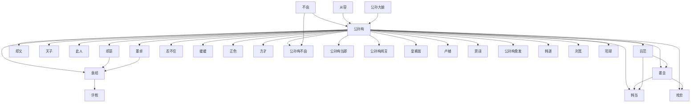

# 人物与关系图：《覆汉》

## 人物表

### 1. 公孙珣

- 出现次数：90
- 覆盖章节数：70
- 首次出现：第 4 章
- 最后出现：第 504 章
- 身份/行为线索：人物行为/发言(90)

### 2. 公孙珣幽幽

- 出现次数：13
- 覆盖章节数：13
- 首次出现：第 4 章
- 最后出现：第 530 章
- 身份/行为线索：人物行为/发言(13)

### 3. 公孙珣坦然

- 出现次数：11
- 覆盖章节数：11
- 首次出现：第 4 章
- 最后出现：第 427 章
- 身份/行为线索：人物行为/发言(11)

### 4. 公孙珣正色

- 出现次数：11
- 覆盖章节数：11
- 首次出现：第 32 章
- 最后出现：第 295 章
- 身份/行为线索：人物行为/发言(11)

### 5. 从容

- 出现次数：10
- 覆盖章节数：10
- 首次出现：第 12 章
- 最后出现：第 520 章
- 身份/行为线索：人物行为/发言(10)

### 6. 吕范

- 出现次数：11
- 覆盖章节数：9
- 首次出现：第 35 章
- 最后出现：第 262 章
- 身份/行为线索：人物行为/发言(11)

### 7. 公孙珣不由

- 出现次数：9
- 覆盖章节数：8
- 首次出现：第 100 章
- 最后出现：第 348 章
- 身份/行为线索：人物行为/发言(9)

### 8. 公孙珣复又

- 出现次数：8
- 覆盖章节数：7
- 首次出现：第 97 章
- 最后出现：第 484 章
- 身份/行为线索：人物行为/发言(8)

### 9. 正色

- 出现次数：7
- 覆盖章节数：7
- 首次出现：第 4 章
- 最后出现：第 241 章
- 身份/行为线索：人物行为/发言(7)

### 10. 公孙珣无奈

- 出现次数：7
- 覆盖章节数：7
- 首次出现：第 31 章
- 最后出现：第 481 章
- 身份/行为线索：人物行为/发言(7)

### 11. 公孙珣低头

- 出现次数：5
- 覆盖章节数：5
- 首次出现：第 11 章
- 最后出现：第 335 章
- 身份/行为线索：人物行为/发言(5)

### 12. 娄圭

- 出现次数：5
- 覆盖章节数：5
- 首次出现：第 58 章
- 最后出现：第 321 章
- 身份/行为线索：人物行为/发言(5)

### 13. 公孙珣愈发

- 出现次数：5
- 覆盖章节数：5
- 首次出现：第 129 章
- 最后出现：第 289 章
- 身份/行为线索：人物行为/发言(5)

### 14. 却又

- 出现次数：5
- 覆盖章节数：5
- 首次出现：第 129 章
- 最后出现：第 226 章
- 身份/行为线索：人物行为/发言(5)

### 15. 卢植

- 出现次数：9
- 覆盖章节数：4
- 首次出现：第 44 章
- 最后出现：第 229 章
- 身份/行为线索：人物行为/发言(9)

### 16. 许攸

- 出现次数：5
- 覆盖章节数：4
- 首次出现：第 30 章
- 最后出现：第 114 章
- 身份/行为线索：人物行为/发言(5)

### 17. 公孙珣认真

- 出现次数：5
- 覆盖章节数：4
- 首次出现：第 61 章
- 最后出现：第 177 章
- 身份/行为线索：人物行为/发言(5)

### 18. 天子

- 出现次数：5
- 覆盖章节数：4
- 首次出现：第 303 章
- 最后出现：第 480 章
- 身份/行为线索：人物行为/发言(5)

### 19. 公孙珣好奇

- 出现次数：4
- 覆盖章节数：4
- 首次出现：第 19 章
- 最后出现：第 222 章
- 身份/行为线索：人物行为/发言(4)

### 20. 勉力

- 出现次数：4
- 覆盖章节数：4
- 首次出现：第 34 章
- 最后出现：第 126 章
- 身份/行为线索：人物行为/发言(4)

### 21. 坦然

- 出现次数：4
- 覆盖章节数：4
- 首次出现：第 38 章
- 最后出现：第 318 章
- 身份/行为线索：人物行为/发言(4)

### 22. 公孙珣昂首

- 出现次数：4
- 覆盖章节数：4
- 首次出现：第 40 章
- 最后出现：第 284 章
- 身份/行为线索：人物行为/发言(4)

### 23. 方才

- 出现次数：4
- 覆盖章节数：4
- 首次出现：第 100 章
- 最后出现：第 473 章
- 身份/行为线索：人物行为/发言(4)

### 24. 公孙珣当即

- 出现次数：4
- 覆盖章节数：4
- 首次出现：第 100 章
- 最后出现：第 467 章
- 身份/行为线索：人物行为/发言(4)

### 25. 公孙珣轻

- 出现次数：4
- 覆盖章节数：4
- 首次出现：第 202 章
- 最后出现：第 346 章
- 身份/行为线索：人物行为/发言(4)

### 26. 公孙珣随意

- 出现次数：4
- 覆盖章节数：4
- 首次出现：第 215 章
- 最后出现：第 486 章
- 身份/行为线索：人物行为/发言(4)

### 27. 公孙珣干脆

- 出现次数：4
- 覆盖章节数：4
- 首次出现：第 285 章
- 最后出现：第 434 章
- 身份/行为线索：人物行为/发言(4)

### 28. 贾诩

- 出现次数：5
- 覆盖章节数：3
- 首次出现：第 381 章
- 最后出现：第 530 章
- 身份/行为线索：人物行为/发言(5)

### 29. 刘宽

- 出现次数：4
- 覆盖章节数：3
- 首次出现：第 72 章
- 最后出现：第 281 章
- 身份/行为线索：人物行为/发言(4)

### 30. 公孙珣蹙眉

- 出现次数：3
- 覆盖章节数：3
- 首次出现：第 21 章
- 最后出现：第 254 章
- 身份/行为线索：人物行为/发言(3)

### 31. 公孙珣昂然

- 出现次数：3
- 覆盖章节数：3
- 首次出现：第 22 章
- 最后出现：第 202 章
- 身份/行为线索：人物行为/发言(3)

### 32. 韩当

- 出现次数：3
- 覆盖章节数：3
- 首次出现：第 31 章
- 最后出现：第 81 章
- 身份/行为线索：人物行为/发言(3)

### 33. 公孙珣再度

- 出现次数：3
- 覆盖章节数：3
- 首次出现：第 40 章
- 最后出现：第 147 章
- 身份/行为线索：人物行为/发言(3)

### 34. 却是

- 出现次数：3
- 覆盖章节数：3
- 首次出现：第 42 章
- 最后出现：第 126 章
- 身份/行为线索：人物行为/发言(3)

### 35. 公孙珣忍不住

- 出现次数：3
- 覆盖章节数：3
- 首次出现：第 51 章
- 最后出现：第 86 章
- 身份/行为线索：人物行为/发言(3)

### 36. 公孙珣不禁

- 出现次数：3
- 覆盖章节数：3
- 首次出现：第 53 章
- 最后出现：第 160 章
- 身份/行为线索：人物行为/发言(3)

### 37. 娄圭坦然

- 出现次数：3
- 覆盖章节数：3
- 首次出现：第 53 章
- 最后出现：第 140 章
- 身份/行为线索：人物行为/发言(3)

### 38. 公孙珣正色询

- 出现次数：3
- 覆盖章节数：3
- 首次出现：第 107 章
- 最后出现：第 297 章
- 身份/行为线索：人物行为/发言(3)

### 39. 公孙珣如此

- 出现次数：3
- 覆盖章节数：3
- 首次出现：第 115 章
- 最后出现：第 481 章
- 身份/行为线索：人物行为/发言(3)

### 40. 公孙珣凛然

- 出现次数：3
- 覆盖章节数：3
- 首次出现：第 165 章
- 最后出现：第 422 章
- 身份/行为线索：人物行为/发言(3)

### 41. 公孙珣仰头

- 出现次数：3
- 覆盖章节数：3
- 首次出现：第 165 章
- 最后出现：第 251 章
- 身份/行为线索：人物行为/发言(3)

### 42. 公孙珣缓缓

- 出现次数：3
- 覆盖章节数：3
- 首次出现：第 179 章
- 最后出现：第 426 章
- 身份/行为线索：人物行为/发言(3)

### 43. 良久方才

- 出现次数：3
- 覆盖章节数：3
- 首次出现：第 188 章
- 最后出现：第 216 章
- 身份/行为线索：人物行为/发言(3)

### 44. 凛然

- 出现次数：3
- 覆盖章节数：3
- 首次出现：第 234 章
- 最后出现：第 361 章
- 身份/行为线索：人物行为/发言(3)

### 45. 戏忠

- 出现次数：3
- 覆盖章节数：3
- 首次出现：第 258 章
- 最后出现：第 377 章
- 身份/行为线索：人物行为/发言(3)

### 46. 缓缓

- 出现次数：3
- 覆盖章节数：3
- 首次出现：第 286 章
- 最后出现：第 498 章
- 身份/行为线索：人物行为/发言(3)

### 47. 郭嘉

- 出现次数：3
- 覆盖章节数：3
- 首次出现：第 456 章
- 最后出现：第 498 章
- 身份/行为线索：人物行为/发言(3)

### 48. 荀攸

- 出现次数：5
- 覆盖章节数：2
- 首次出现：第 386 章
- 最后出现：第 401 章
- 身份/行为线索：人物行为/发言(5)

### 49. 韩遂

- 出现次数：3
- 覆盖章节数：2
- 首次出现：第 50 章
- 最后出现：第 276 章
- 身份/行为线索：人物行为/发言(3)

### 50. 张颌

- 出现次数：3
- 覆盖章节数：2
- 首次出现：第 215 章
- 最后出现：第 437 章
- 身份/行为线索：人物行为/发言(3)

### 51. 有策

- 出现次数：3
- 覆盖章节数：2
- 首次出现：第 414 章
- 最后出现：第 541 章
- 身份/行为线索：人物行为/发言(3)

### 52. 淮阴故策

- 出现次数：3
- 覆盖章节数：2
- 首次出现：第 414 章
- 最后出现：第 541 章
- 身份/行为线索：人物行为/发言(3)

### 53. 项王旧计

- 出现次数：3
- 覆盖章节数：2
- 首次出现：第 414 章
- 最后出现：第 541 章
- 身份/行为线索：人物行为/发言(3)

### 54. 当即昂然

- 出现次数：2
- 覆盖章节数：2
- 首次出现：第 8 章
- 最后出现：第 69 章
- 身份/行为线索：人物行为/发言(2)

### 55. 韩当无奈

- 出现次数：2
- 覆盖章节数：2
- 首次出现：第 16 章
- 最后出现：第 334 章
- 身份/行为线索：人物行为/发言(2)

### 56. 公孙珣立即

- 出现次数：2
- 覆盖章节数：2
- 首次出现：第 35 章
- 最后出现：第 118 章
- 身份/行为线索：人物行为/发言(2)

### 57. 此人

- 出现次数：2
- 覆盖章节数：2
- 首次出现：第 35 章
- 最后出现：第 108 章
- 身份/行为线索：人物行为/发言(2)

### 58. 公孙珣平静

- 出现次数：2
- 覆盖章节数：2
- 首次出现：第 36 章
- 最后出现：第 530 章
- 身份/行为线索：人物行为/发言(2)

### 59. 公孙珣负手

- 出现次数：2
- 覆盖章节数：2
- 首次出现：第 37 章
- 最后出现：第 122 章
- 身份/行为线索：人物行为/发言(2)

### 60. 公孙珣坦诚

- 出现次数：2
- 覆盖章节数：2
- 首次出现：第 40 章
- 最后出现：第 259 章
- 身份/行为线索：人物行为/发言(2)

### 61. 忍不住

- 出现次数：2
- 覆盖章节数：2
- 首次出现：第 53 章
- 最后出现：第 61 章
- 身份/行为线索：人物行为/发言(2)

### 62. 公孙大娘

- 出现次数：2
- 覆盖章节数：2
- 首次出现：第 57 章
- 最后出现：第 296 章
- 身份/行为线索：人物行为/发言(2)

### 63. 峭王

- 出现次数：2
- 覆盖章节数：2
- 首次出现：第 67 章
- 最后出现：第 319 章
- 身份/行为线索：人物行为/发言(2)

### 64. 汗鲁王

- 出现次数：2
- 覆盖章节数：2
- 首次出现：第 67 章
- 最后出现：第 319 章
- 身份/行为线索：人物行为/发言(2)

### 65. 公孙珣回头

- 出现次数：2
- 覆盖章节数：2
- 首次出现：第 79 章
- 最后出现：第 329 章
- 身份/行为线索：人物行为/发言(2)

### 66. 郭缊

- 出现次数：2
- 覆盖章节数：2
- 首次出现：第 89 章
- 最后出现：第 100 章
- 身份/行为线索：人物行为/发言(2)

### 67. 檀石槐轻

- 出现次数：2
- 覆盖章节数：2
- 首次出现：第 95 章
- 最后出现：第 96 章
- 身份/行为线索：人物行为/发言(2)

### 68. 公孙珣闻言

- 出现次数：2
- 覆盖章节数：2
- 首次出现：第 98 章
- 最后出现：第 111 章
- 身份/行为线索：人物行为/发言(2)

### 69. 公孙大娘幽幽

- 出现次数：2
- 覆盖章节数：2
- 首次出现：第 101 章
- 最后出现：第 296 章
- 身份/行为线索：人物行为/发言(2)

### 70. 公孙珣轻松

- 出现次数：2
- 覆盖章节数：2
- 首次出现：第 107 章
- 最后出现：第 335 章
- 身份/行为线索：人物行为/发言(2)

### 71. 赵芸

- 出现次数：2
- 覆盖章节数：2
- 首次出现：第 113 章
- 最后出现：第 137 章
- 身份/行为线索：人物行为/发言(2)

### 72. 袁逢

- 出现次数：2
- 覆盖章节数：2
- 首次出现：第 114 章
- 最后出现：第 118 章
- 身份/行为线索：人物行为/发言(2)

### 73. 袁绍不由

- 出现次数：2
- 覆盖章节数：2
- 首次出现：第 119 章
- 最后出现：第 389 章
- 身份/行为线索：人物行为/发言(2)

### 74. 杨赐不由

- 出现次数：2
- 覆盖章节数：2
- 首次出现：第 120 章
- 最后出现：第 124 章
- 身份/行为线索：人物行为/发言(2)

### 75. 公孙珣冷笑反

- 出现次数：2
- 覆盖章节数：2
- 首次出现：第 122 章
- 最后出现：第 145 章
- 身份/行为线索：人物行为/发言(2)

### 76. 曹操得意

- 出现次数：2
- 覆盖章节数：2
- 首次出现：第 146 章
- 最后出现：第 148 章
- 身份/行为线索：人物行为/发言(2)

### 77. 插嘴

- 出现次数：2
- 覆盖章节数：2
- 首次出现：第 150 章
- 最后出现：第 245 章
- 身份/行为线索：人物行为/发言(2)

### 78. 公孙珣不解

- 出现次数：2
- 覆盖章节数：2
- 首次出现：第 153 章
- 最后出现：第 179 章
- 身份/行为线索：人物行为/发言(2)

### 79. 公孙珣黑着脸质

- 出现次数：2
- 覆盖章节数：2
- 首次出现：第 159 章
- 最后出现：第 240 章
- 身份/行为线索：人物行为/发言(2)

### 80. 公孙珣蹙额

- 出现次数：2
- 覆盖章节数：2
- 首次出现：第 159 章
- 最后出现：第 319 章
- 身份/行为线索：人物行为/发言(2)

### 81. 娄子伯

- 出现次数：2
- 覆盖章节数：2
- 首次出现：第 169 章
- 最后出现：第 332 章
- 身份/行为线索：人物行为/发言(2)

### 82. 简雍

- 出现次数：2
- 覆盖章节数：2
- 首次出现：第 180 章
- 最后出现：第 214 章
- 身份/行为线索：人物行为/发言(2)

### 83. 罗敷

- 出现次数：2
- 覆盖章节数：2
- 首次出现：第 181 章
- 最后出现：第 197 章
- 身份/行为线索：人物行为/发言(2)

### 84. 公孙珣凛然反

- 出现次数：2
- 覆盖章节数：2
- 首次出现：第 192 章
- 最后出现：第 328 章
- 身份/行为线索：人物行为/发言(2)

### 85. 袁绍

- 出现次数：2
- 覆盖章节数：2
- 首次出现：第 226 章
- 最后出现：第 435 章
- 身份/行为线索：人物行为/发言(2)

### 86. 公孙珣嗤

- 出现次数：2
- 覆盖章节数：2
- 首次出现：第 236 章
- 最后出现：第 339 章
- 身份/行为线索：人物行为/发言(2)

### 87. 孙坚

- 出现次数：2
- 覆盖章节数：2
- 首次出现：第 246 章
- 最后出现：第 447 章
- 身份/行为线索：人物行为/发言(2)

### 88. 公孙珣也跟着

- 出现次数：2
- 覆盖章节数：2
- 首次出现：第 247 章
- 最后出现：第 393 章
- 身份/行为线索：人物行为/发言(2)

### 89. 公孙珣尴尬

- 出现次数：2
- 覆盖章节数：2
- 首次出现：第 249 章
- 最后出现：第 277 章
- 身份/行为线索：人物行为/发言(2)

### 90. 皇甫嵩

- 出现次数：2
- 覆盖章节数：2
- 首次出现：第 252 章
- 最后出现：第 482 章
- 身份/行为线索：人物行为/发言(2)

### 91. 阎忠

- 出现次数：2
- 覆盖章节数：2
- 首次出现：第 252 章
- 最后出现：第 254 章
- 身份/行为线索：人物行为/发言(2)

### 92. 张让

- 出现次数：2
- 覆盖章节数：2
- 首次出现：第 255 章
- 最后出现：第 279 章
- 身份/行为线索：人物行为/发言(2)

### 93. 从容在马上

- 出现次数：2
- 覆盖章节数：2
- 首次出现：第 260 章
- 最后出现：第 487 章
- 身份/行为线索：人物行为/发言(2)

### 94. 不由

- 出现次数：2
- 覆盖章节数：2
- 首次出现：第 267 章
- 最后出现：第 436 章
- 身份/行为线索：人物行为/发言(2)

### 95. 司马直

- 出现次数：2
- 覆盖章节数：2
- 首次出现：第 273 章
- 最后出现：第 274 章
- 身份/行为线索：人物行为/发言(2)

### 96. 公孙珣失笑

- 出现次数：2
- 覆盖章节数：2
- 首次出现：第 299 章
- 最后出现：第 354 章
- 身份/行为线索：人物行为/发言(2)

### 97. 鲜于辅

- 出现次数：2
- 覆盖章节数：2
- 首次出现：第 322 章
- 最后出现：第 335 章
- 身份/行为线索：人物行为/发言(2)

### 98. 娄圭复又

- 出现次数：2
- 覆盖章节数：2
- 首次出现：第 329 章
- 最后出现：第 363 章
- 身份/行为线索：人物行为/发言(2)

### 99. 讨董

- 出现次数：2
- 覆盖章节数：2
- 首次出现：第 350 章
- 最后出现：第 393 章
- 身份/行为线索：人物行为/发言(2)

### 100. 刘备从容

- 出现次数：2
- 覆盖章节数：2
- 首次出现：第 449 章
- 最后出现：第 532 章
- 身份/行为线索：人物行为/发言(2)

## 关系边

- 公孙珣 <-> 却是：共现 732 次，覆盖第 4-541 章，关系线索：同章共现(664)、母亲(14)、妻子(11)、儿子(10)、兄弟(8)、老师(7)、命令(3)、下属(3)
- 公孙珣 <-> 却又：共现 426 次，覆盖第 4-541 章，关系线索：同章共现(385)、母亲(18)、父亲(4)、兄弟(4)、儿子(4)、命令(3)、弟子(2)、老师(2)
- 不由 <-> 公孙珣：共现 407 次，覆盖第 3-540 章，关系线索：同章共现(370)、母亲(13)、老师(5)、女儿(4)、妻子(4)、儿子(4)、丈夫(2)、父亲(2)
- 公孙珣 <-> 天子：共现 369 次，覆盖第 29-541 章，关系线索：同章共现(350)、老师(6)、母亲(4)、父亲(2)、妻子(2)、儿子(2)、保护(1)、学生(1)
- 公孙珣 <-> 韩当：共现 360 次，覆盖第 2-537 章，关系线索：同章共现(336)、母亲(10)、兄弟(6)、命令(4)、老师(2)、下属(2)、妻子(1)、儿子(1)
- 公孙珣 <-> 此人：共现 349 次，覆盖第 2-530 章，关系线索：同章共现(322)、母亲(7)、老师(3)、兄弟(3)、儿子(3)、命令(2)、妻子(2)、下属(2)
- 公孙珣 <-> 娄圭：共现 321 次，覆盖第 35-541 章，关系线索：同章共现(299)、母亲(4)、兄弟(4)、命令(3)、妻子(3)、儿子(2)、老师(2)、女儿(1)
- 公孙珣 <-> 吕范：共现 312 次，覆盖第 35-541 章，关系线索：同章共现(291)、儿子(4)、命令(2)、母亲(2)、下属(2)、老师(2)、对手(1)、女儿(1)
- 公孙珣 <-> 董卓：共现 292 次，覆盖第 80-534 章，关系线索：同章共现(268)、合作(4)、兄弟(4)、老师(3)、母亲(3)、下属(3)、女儿(2)、弟子(2)
- 公孙珣 <-> 袁绍：共现 263 次，覆盖第 25-534 章，关系线索：同章共现(235)、兄弟(8)、母亲(5)、儿子(5)、父亲(3)、弟子(2)、下属(2)、盟友(2)
- 公孙珣 <-> 忍不住：共现 208 次，覆盖第 2-540 章，关系线索：同章共现(182)、母亲(8)、老师(7)、兄弟(4)、儿子(2)、对手(2)、学生(1)、上司(1)
- 公孙珣 <-> 缓缓：共现 187 次，覆盖第 5-540 章，关系线索：同章共现(176)、学生(3)、儿子(2)、老师(2)、母亲(2)、下属(2)、兄弟(1)、敌人(1)
- 娄圭 <-> 韩当：共现 184 次，覆盖第 53-541 章，关系线索：同章共现(175)、兄弟(3)、母亲(1)、命令(1)、老师(1)、下属(1)、学生(1)、丈夫(1)
- 公孙珣 <-> 正色：共现 181 次，覆盖第 28-530 章，关系线索：同章共现(163)、母亲(6)、学生(4)、老师(4)、下属(2)、丈夫(1)、兄弟(1)、保护(1)
- 公孙珣 <-> 方才：共现 176 次，覆盖第 5-541 章，关系线索：同章共现(164)、母亲(4)、妻子(3)、学生(2)、丈夫(1)、老师(1)、女儿(1)、儿子(1)
- 公孙珣 <-> 公孙珣不由：共现 168 次，覆盖第 3-540 章，关系线索：同章共现(158)、母亲(6)、老师(2)、妻子(1)、合作(1)、下属(1)
- 不由 <-> 公孙珣不由：共现 168 次，覆盖第 3-540 章，关系线索：同章共现(158)、母亲(6)、老师(2)、妻子(1)、合作(1)、下属(1)
- 公孙珣 <-> 公孙珣当即：共现 153 次，覆盖第 6-467 章，关系线索：同章共现(141)、母亲(4)、老师(3)、女儿(1)、妻子(1)、兄弟(1)、保护(1)、儿子(1)
- 公孙珣 <-> 公孙珣闻言：共现 146 次，覆盖第 4-533 章，关系线索：同章共现(131)、母亲(5)、兄弟(4)、老师(3)、弟子(1)、儿子(1)、敌人(1)、学生(1)
- 公孙珣 <-> 皇甫嵩：共现 131 次，覆盖第 215-482 章，关系线索：同章共现(122)、儿子(3)、下属(2)、合作(2)、女儿(1)、母亲(1)、学生(1)
- 吕范 <-> 娄圭：共现 129 次，覆盖第 35-541 章，关系线索：同章共现(123)、儿子(2)、母亲(1)、老师(1)、父亲(1)、学生(1)、朋友(1)
- 从容 <-> 公孙珣：共现 126 次，覆盖第 12-540 章，关系线索：同章共现(119)、母亲(2)、兄弟(2)、丈夫(1)、老师(1)、下属(1)
- 公孙珣 <-> 卢植：共现 124 次，覆盖第 15-438 章，关系线索：同章共现(90)、老师(17)、学生(10)、母亲(6)、兄弟(4)、儿子(3)、弟子(3)、命令(1)
- 公孙珣 <-> 戏忠：共现 123 次，覆盖第 249-529 章，关系线索：同章共现(119)、妻子(1)、老师(1)、对手(1)、儿子(1)
- 公孙大娘 <-> 公孙珣：共现 119 次，覆盖第 2-541 章，关系线索：同章共现(88)、母亲(15)、儿子(12)、妻子(3)、女儿(2)、上司(1)、对手(1)、合作(1)
- 却是 <-> 袁绍：共现 113 次，覆盖第 51-441 章，关系线索：同章共现(106)、儿子(3)、兄弟(2)、父亲(1)、对手(1)
- 吕范 <-> 韩当：共现 109 次，覆盖第 37-541 章，关系线索：同章共现(106)、兄弟(1)、老师(1)、学生(1)
- 公孙珣 <-> 贾诩：共现 99 次，覆盖第 254-534 章，关系线索：同章共现(94)、下属(1)、母亲(1)、背叛(1)、命令(1)、儿子(1)
- 公孙珣 <-> 公孙珣愈发：共现 98 次，覆盖第 28-540 章，关系线索：同章共现(94)、老师(1)、背叛(1)、对手(1)、父亲(1)
- 袁绍 <-> 许攸：共现 96 次，覆盖第 49-541 章，关系线索：同章共现(90)、兄弟(2)、敌人(1)、母亲(1)、妻子(1)、命令(1)
- 公孙珣 <-> 韩遂：共现 95 次，覆盖第 25-467 章，关系线索：同章共现(81)、兄弟(4)、母亲(3)、对手(3)、儿子(2)、老师(1)、妻子(1)、合作(1)
- 娄圭 <-> 戏忠：共现 89 次，覆盖第 251-541 章，关系线索：同章共现(86)、妻子(1)、下属(1)、学生(1)
- 董卓 <-> 袁绍：共现 86 次，覆盖第 88-541 章，关系线索：同章共现(79)、儿子(3)、老师(1)、弟子(1)、兄弟(1)、下属(1)、丈夫(1)
- 公孙珣 <-> 刘宽：共现 82 次，覆盖第 29-387 章，关系线索：同章共现(61)、学生(8)、兄弟(7)、老师(6)、弟子(3)、母亲(3)、命令(1)、妻子(1)
- 公孙珣 <-> 阳球：共现 81 次，覆盖第 19-305 章，关系线索：同章共现(73)、母亲(3)、父亲(2)、学生(1)、老师(1)、上司(1)、妻子(1)
- 公孙珣 <-> 公孙珣复又：共现 80 次，覆盖第 43-530 章，关系线索：同章共现(76)、母亲(4)
- 公孙珣 <-> 许攸：共现 79 次，覆盖第 30-439 章，关系线索：同章共现(71)、兄弟(3)、母亲(2)、弟子(1)、学生(1)、对手(1)
- 皇甫嵩 <-> 董卓：共现 79 次，覆盖第 252-541 章，关系线索：同章共现(76)、下属(2)、母亲(1)
- 公孙珣 <-> 公孙珣缓缓：共现 78 次，覆盖第 50-540 章，关系线索：同章共现(73)、母亲(2)、兄弟(1)、老师(1)、学生(1)
- 公孙珣缓缓 <-> 缓缓：共现 78 次，覆盖第 50-540 章，关系线索：同章共现(73)、母亲(2)、兄弟(1)、老师(1)、学生(1)
- 不由 <-> 却是：共现 77 次，覆盖第 80-529 章，关系线索：同章共现(72)、母亲(2)、女儿(1)、妻子(1)、命令(1)
- 却是 <-> 天子：共现 75 次，覆盖第 23-541 章，关系线索：同章共现(72)、父亲(1)、学生(1)、命令(1)
- 刘宽 <-> 卢植：共现 74 次，覆盖第 29-541 章，关系线索：同章共现(51)、兄弟(10)、老师(7)、弟子(5)、学生(4)、命令(1)、上司(1)
- 天子 <-> 董卓：共现 74 次，覆盖第 80-537 章，关系线索：同章共现(71)、盟友(1)、命令(1)、女儿(1)
- 却又 <-> 忍不住：共现 73 次，覆盖第 13-540 章，关系线索：同章共现(62)、母亲(3)、父亲(2)、儿子(2)、学生(1)、妻子(1)、命令(1)、兄弟(1)
- 公孙珣 <-> 公孙珣再度：共现 72 次，覆盖第 3-540 章，关系线索：同章共现(66)、母亲(3)、弟子(2)、妻子(1)
- 公孙珣 <-> 坦然：共现 69 次，覆盖第 4-513 章，关系线索：同章共现(62)、母亲(3)、学生(1)、命令(1)、兄弟(1)、敌人(1)、女儿(1)
- 公孙珣 <-> 凛然：共现 67 次，覆盖第 62-519 章，关系线索：同章共现(65)、老师(1)、兄弟(1)
- 却是 <-> 董卓：共现 65 次，覆盖第 80-541 章，关系线索：同章共现(61)、下属(2)、儿子(1)、父亲(1)
- 公孙珣 <-> 讨董：共现 65 次，覆盖第 325-534 章，关系线索：同章共现(61)、盟友(1)、兄弟(1)、母亲(1)、下属(1)
- 公孙珣 <-> 娄子伯：共现 63 次，覆盖第 53-519 章，关系线索：同章共现(62)、母亲(1)
- 却又 <-> 袁绍：共现 60 次，覆盖第 73-520 章，关系线索：同章共现(57)、父亲(2)、儿子(1)
- 天子 <-> 张让：共现 60 次，覆盖第 87-339 章，关系线索：同章共现(54)、下属(2)、盟友(1)、保护(1)、儿子(1)、兄弟(1)
- 却是 <-> 此人：共现 59 次，覆盖第 34-538 章，关系线索：同章共现(54)、儿子(2)、老师(1)、母亲(1)、下属(1)、妻子(1)
- 却是 <-> 娄圭：共现 59 次，覆盖第 53-541 章，关系线索：同章共现(53)、丈夫(2)、兄弟(1)、妻子(1)、母亲(1)、父亲(1)、儿子(1)
- 公孙珣 <-> 勉力：共现 59 次，覆盖第 56-519 章，关系线索：同章共现(54)、老师(2)、妻子(1)、母亲(1)、下属(1)
- 却是 <-> 韩当：共现 56 次，覆盖第 3-536 章，关系线索：同章共现(53)、母亲(1)、兄弟(1)、命令(1)
- 却又 <-> 此人：共现 56 次，覆盖第 55-508 章，关系线索：同章共现(54)、下属(1)、对手(1)
- 公孙珣 <-> 荀攸：共现 56 次，覆盖第 249-516 章，关系线索：同章共现(54)、兄弟(1)、儿子(1)
- 却是 <-> 方才：共现 55 次，覆盖第 63-540 章，关系线索：同章共现(52)、母亲(1)、儿子(1)、妻子(1)
- 却又 <-> 缓缓：共现 53 次，覆盖第 122-537 章，关系线索：同章共现(47)、儿子(4)、老师(1)、敌人(1)
- 公孙珣 <-> 公孙珣正色：共现 52 次，覆盖第 32-519 章，关系线索：同章共现(46)、母亲(2)、学生(1)、弟子(1)、老师(1)、儿子(1)、对手(1)
- 公孙珣正色 <-> 正色：共现 52 次，覆盖第 32-519 章，关系线索：同章共现(46)、母亲(2)、学生(1)、弟子(1)、老师(1)、儿子(1)、对手(1)
- 公孙珣 <-> 公孙珣无奈：共现 50 次，覆盖第 25-481 章，关系线索：同章共现(43)、老师(3)、兄弟(2)、母亲(2)、命令(1)、学生(1)
- 董卓 <-> 讨董：共现 50 次，覆盖第 339-541 章，关系线索：同章共现(47)、下属(1)、母亲(1)、儿子(1)
- 却是 <-> 忍不住：共现 49 次，覆盖第 16-529 章，关系线索：同章共现(41)、老师(3)、对手(2)、兄弟(1)、父亲(1)、妻子(1)
- 公孙珣 <-> 郭缊：共现 47 次，覆盖第 86-360 章，关系线索：同章共现(45)、老师(1)、弟子(1)、妻子(1)
- 不由 <-> 却又：共现 46 次，覆盖第 117-539 章，关系线索：同章共现(40)、儿子(2)、丈夫(1)、老师(1)、学生(1)、母亲(1)、下属(1)、上司(1)
- 却又 <-> 天子：共现 46 次，覆盖第 126-541 章，关系线索：同章共现(45)、儿子(1)
- 娄圭 <-> 忍不住：共现 45 次，覆盖第 53-419 章，关系线索：同章共现(42)、敌人(1)、兄弟(1)、妻子(1)
- 公孙珣 <-> 孙坚：共现 44 次，覆盖第 4-504 章，关系线索：同章共现(40)、老师(1)、弟子(1)、母亲(1)、下属(1)、敌人(1)
- 天子 <-> 袁绍：共现 43 次，覆盖第 119-529 章，关系线索：同章共现(41)、父亲(1)、母亲(1)
- 从容 <-> 却是：共现 41 次，覆盖第 66-537 章，关系线索：同章共现(40)、下属(1)
- 却是 <-> 缓缓：共现 41 次，覆盖第 79-525 章，关系线索：同章共现(41)
- 天子 <-> 阳球：共现 41 次，覆盖第 112-454 章，关系线索：同章共现(38)、下属(1)、父亲(1)、妻子(1)
- 忍不住 <-> 韩当：共现 40 次，覆盖第 6-536 章，关系线索：同章共现(38)、老师(1)、兄弟(1)
- 却又 <-> 却是：共现 40 次，覆盖第 57-530 章，关系线索：同章共现(39)、母亲(1)
- 不由 <-> 娄圭：共现 39 次，覆盖第 98-380 章，关系线索：同章共现(37)、上司(1)、母亲(1)
- 忍不住 <-> 插嘴：共现 38 次，覆盖第 104-499 章，关系线索：同章共现(34)、父亲(1)、儿子(1)、兄弟(1)、师尊(1)、弟子(1)
- 不由 <-> 天子：共现 37 次，覆盖第 118-538 章，关系线索：同章共现(34)、学生(1)、下属(1)、儿子(1)、女儿(1)
- 戏忠 <-> 韩当：共现 37 次，覆盖第 255-541 章，关系线索：同章共现(35)、下属(1)、学生(1)
- 却是 <-> 吕范：共现 36 次，覆盖第 38-541 章，关系线索：同章共现(31)、儿子(2)、母亲(1)、下属(1)、父亲(1)、命令(1)
- 却又 <-> 董卓：共现 36 次，覆盖第 80-520 章，关系线索：同章共现(34)、儿子(1)、弟子(1)
- 却是 <-> 孙坚：共现 35 次，覆盖第 88-539 章，关系线索：同章共现(33)、命令(1)、儿子(1)、妻子(1)
- 方才 <-> 缓缓：共现 35 次，覆盖第 135-523 章，关系线索：同章共现(34)、兄弟(1)
- 公孙珣 <-> 公孙珣立即：共现 34 次，覆盖第 20-504 章，关系线索：同章共现(30)、妻子(2)、学生(1)、母亲(1)
- 却是 <-> 许攸：共现 34 次，覆盖第 30-439 章，关系线索：同章共现(32)、兄弟(1)、父亲(1)
- 娄圭 <-> 娄子伯：共现 34 次，覆盖第 53-514 章，关系线索：同章共现(33)、兄弟(1)
- 公孙珣 <-> 赵芸：共现 34 次，覆盖第 93-521 章，关系线索：同章共现(19)、妻子(9)、母亲(5)、老师(2)、女儿(1)
- 不由 <-> 此人：共现 34 次，覆盖第 99-522 章，关系线索：同章共现(33)、对手(1)
- 公孙珣 <-> 司马直：共现 33 次，覆盖第 273-318 章，关系线索：同章共现(30)、学生(2)、丈夫(1)
- 袁绍 <-> 讨董：共现 33 次，覆盖第 339-541 章，关系线索：同章共现(31)、盟友(1)、下属(1)
- 董卓 <-> 贾诩：共现 32 次，覆盖第 309-541 章，关系线索：同章共现(30)、敌人(1)、背叛(1)
- 荀攸 <-> 贾诩：共现 32 次，覆盖第 338-528 章，关系线索：同章共现(31)、下属(1)
- 公孙珣 <-> 公孙珣低头：共现 31 次，覆盖第 11-519 章，关系线索：同章共现(25)、母亲(5)、老师(1)
- 公孙珣 <-> 公孙珣干脆：共现 31 次，覆盖第 38-529 章，关系线索：同章共现(26)、兄弟(3)、父亲(1)、下属(1)、母亲(1)
- 不由 <-> 袁绍：共现 31 次，覆盖第 115-520 章，关系线索：同章共现(30)、父亲(1)、母亲(1)
- 吕范 <-> 戏忠：共现 31 次，覆盖第 255-541 章，关系线索：同章共现(29)、命令(1)、学生(1)
- 此人 <-> 韩当：共现 30 次，覆盖第 2-537 章，关系线索：同章共现(30)
- 此人 <-> 董卓：共现 30 次，覆盖第 80-497 章，关系线索：同章共现(26)、上司(1)、敌人(1)、女儿(1)、母亲(1)
- 公孙珣 <-> 公孙珣轻：共现 30 次，覆盖第 107-449 章，关系线索：同章共现(27)、老师(1)、兄弟(1)、母亲(1)、背叛(1)
- 却又 <-> 方才：共现 30 次，覆盖第 146-530 章，关系线索：同章共现(27)、丈夫(1)、父亲(1)、兄弟(1)
- 公孙珣 <-> 公孙珣忍不住：共现 29 次，覆盖第 3-504 章，关系线索：同章共现(27)、兄弟(1)、母亲(1)
- 公孙珣忍不住 <-> 忍不住：共现 29 次，覆盖第 3-504 章，关系线索：同章共现(27)、兄弟(1)、母亲(1)
- 公孙珣 <-> 公孙珣坦然：共现 29 次，覆盖第 4-452 章，关系线索：同章共现(28)、母亲(1)
- 公孙珣坦然 <-> 坦然：共现 29 次，覆盖第 4-452 章，关系线索：同章共现(28)、母亲(1)
- 不由 <-> 董卓：共现 29 次，覆盖第 80-520 章，关系线索：同章共现(27)、女儿(1)、儿子(1)
- 却是 <-> 贾诩：共现 29 次，覆盖第 308-541 章，关系线索：同章共现(28)、命令(1)
- 却又 <-> 吕范：共现 28 次，覆盖第 37-534 章，关系线索：同章共现(27)、下属(1)
- 公孙珣 <-> 公孙珣失笑：共现 28 次，覆盖第 38-514 章，关系线索：同章共现(27)、母亲(1)
- 孙坚 <-> 董卓：共现 28 次，覆盖第 88-541 章，关系线索：同章共现(26)、老师(1)、弟子(1)、母亲(1)
- 忍不住 <-> 此人：共现 27 次，覆盖第 20-485 章，关系线索：同章共现(25)、老师(1)、母亲(1)
- 却又 <-> 许攸：共现 27 次，覆盖第 33-435 章，关系线索：同章共现(25)、弟子(1)、学生(1)
- 不由 <-> 公孙珣闻言：共现 27 次，覆盖第 76-481 章，关系线索：同章共现(25)、儿子(1)、母亲(1)
- 公孙珣 <-> 张让：共现 27 次，覆盖第 118-385 章，关系线索：同章共现(26)、下属(1)
- 吕范 <-> 此人：共现 26 次，覆盖第 35-452 章，关系线索：同章共现(23)、老师(2)、弟子(1)、对手(1)
- 从容 <-> 此人：共现 26 次，覆盖第 41-530 章，关系线索：同章共现(26)
- 却又 <-> 韩当：共现 26 次，覆盖第 53-534 章，关系线索：同章共现(26)
- 却又 <-> 娄圭：共现 26 次，覆盖第 54-433 章，关系线索：同章共现(25)、命令(1)
- 天子 <-> 正色：共现 26 次，覆盖第 106-517 章，关系线索：同章共现(25)、命令(1)
- 天子 <-> 方才：共现 26 次，覆盖第 114-541 章，关系线索：同章共现(25)、命令(1)
- 此人 <-> 袁绍：共现 26 次，覆盖第 115-482 章，关系线索：同章共现(24)、下属(1)、兄弟(1)
- 天子 <-> 缓缓：共现 26 次，覆盖第 176-541 章，关系线索：同章共现(24)、学生(1)、儿子(1)
- 天子 <-> 皇甫嵩：共现 26 次，覆盖第 215-482 章，关系线索：同章共现(25)、女儿(1)
- 公孙大娘 <-> 却是：共现 25 次，覆盖第 10-540 章，关系线索：同章共现(18)、儿子(5)、下属(1)、母亲(1)
- 公孙珣 <-> 公孙珣负手：共现 25 次，覆盖第 37-467 章，关系线索：同章共现(25)
- 天子 <-> 许攸：共现 25 次，覆盖第 114-541 章，关系线索：同章共现(21)、丈夫(2)、儿子(1)、上司(1)
- 却是 <-> 郭嘉：共现 25 次，覆盖第 249-523 章，关系线索：同章共现(22)、对手(1)、下属(1)、母亲(1)
- 公孙珣 <-> 张颌：共现 25 次，覆盖第 261-492 章，关系线索：同章共现(23)、母亲(1)、命令(1)
- 吕范 <-> 忍不住：共现 24 次，覆盖第 35-519 章，关系线索：同章共现(23)、兄弟(1)
- 不由 <-> 吕范：共现 24 次，覆盖第 36-438 章，关系线索：同章共现(23)、父亲(1)
- 公孙珣 <-> 公孙珣不禁：共现 24 次，覆盖第 53-469 章，关系线索：同章共现(22)、学生(1)、老师(1)
- 公孙珣 <-> 公孙珣凛然：共现 24 次，覆盖第 62-476 章，关系线索：同章共现(23)、兄弟(1)
- 公孙珣凛然 <-> 凛然：共现 24 次，覆盖第 62-476 章，关系线索：同章共现(23)、兄弟(1)
- 公孙珣 <-> 公孙珣仰头：共现 24 次，覆盖第 82-391 章，关系线索：同章共现(24)
- 方才 <-> 正色：共现 24 次，覆盖第 101-535 章，关系线索：同章共现(22)、命令(1)、父亲(1)
- 从容 <-> 方才：共现 24 次，覆盖第 111-541 章，关系线索：同章共现(24)
- 勉力 <-> 方才：共现 24 次，覆盖第 127-530 章，关系线索：同章共现(22)、丈夫(1)、儿子(1)
- 却是 <-> 戏忠：共现 24 次，覆盖第 249-541 章，关系线索：同章共现(24)
- 戏忠 <-> 贾诩：共现 24 次，覆盖第 307-541 章，关系线索：同章共现(23)、下属(1)
- 公孙珣 <-> 公孙珣回头：共现 23 次，覆盖第 23-485 章，关系线索：同章共现(19)、父亲(1)、女儿(1)、老师(1)、命令(1)、妻子(1)
- 缓缓 <-> 袁绍：共现 23 次，覆盖第 50-435 章，关系线索：同章共现(21)、兄弟(2)、弟子(1)
- 娄圭 <-> 此人：共现 23 次，覆盖第 54-323 章，关系线索：同章共现(21)、兄弟(1)、老师(1)、学生(1)、弟子(1)
- 天子 <-> 此人：共现 23 次，覆盖第 87-518 章，关系线索：同章共现(22)、父亲(1)
- 孙坚 <-> 袁绍：共现 23 次，覆盖第 88-541 章，关系线索：同章共现(20)、老师(1)、弟子(1)、妻子(1)、敌人(1)
- 公孙珣 <-> 公孙珣如此：共现 23 次，覆盖第 93-521 章，关系线索：同章共现(22)、女儿(1)
- 从容 <-> 天子：共现 23 次，覆盖第 111-541 章，关系线索：同章共现(20)、老师(1)、兄弟(1)、下属(1)
- 天子 <-> 戏忠：共现 23 次，覆盖第 258-481 章，关系线索：同章共现(23)
- 不由 <-> 韩当：共现 22 次，覆盖第 3-333 章，关系线索：同章共现(21)、母亲(1)
- 公孙大娘 <-> 韩当：共现 22 次，覆盖第 4-393 章，关系线索：同章共现(18)、儿子(2)、母亲(2)
- 公孙珣 <-> 公孙珣蹙眉：共现 22 次，覆盖第 21-492 章，关系线索：同章共现(20)、母亲(2)
- 刘宽 <-> 天子：共现 22 次，覆盖第 107-309 章，关系线索：同章共现(17)、学生(3)、老师(2)
- 却是 <-> 皇甫嵩：共现 22 次，覆盖第 229-388 章，关系线索：同章共现(20)、儿子(1)、下属(1)
- 却是 <-> 正色：共现 21 次，覆盖第 13-530 章，关系线索：同章共现(20)、母亲(1)
- 公孙珣 <-> 郭嘉：共现 21 次，覆盖第 36-529 章，关系线索：同章共现(18)、学生(2)、对手(1)
- 公孙珣 <-> 公孙珣认真：共现 21 次，覆盖第 40-519 章，关系线索：同章共现(19)、母亲(1)、敌人(1)
- 娄圭 <-> 缓缓：共现 21 次，覆盖第 59-541 章，关系线索：同章共现(21)
- 却又 <-> 孙坚：共现 21 次，覆盖第 123-539 章，关系线索：同章共现(20)、对手(1)
- 方才 <-> 袁绍：共现 21 次，覆盖第 343-426 章，关系线索：同章共现(20)、兄弟(1)
- 公孙珣 <-> 公孙珣昂然：共现 20 次，覆盖第 22-439 章，关系线索：同章共现(20)

## Mermaid 关系草图

