# 人物与关系图：《覆汉.txt》

## 关系图解读

- 主角候选：公孙珣
- 识别方式：优先采用子 Agent 标注；缺失时按全书出场覆盖、关系网络中心度和关系词线索推断。
- 使用边界：没有子 Agent JSON 的书，敌对/同盟等语义来自正文关键词和共现段落推断，应作为精读索引，不应直接当最终定论。

## 人物功能分层

### 主角候选

- 公孙珣：全书出现和覆盖最高，覆盖第 2-534 章。 置信度：中。出场范围：第 2-534 章。

### 主要对手/反派候选

- 袁术：公孙珣：威胁，覆盖第 132-518 章，证据：同章共现(27)、父亲(2)、兄弟(2)、威胁(2)、镇压(1)、下属(1)、利用(1) 置信度：中。出场范围：第 119-516 章。
- 韩遂：公孙珣：仇，覆盖第 25-467 章，证据：同章共现(77)、兄弟(4)、仇(4)、母亲(3)、对手(3)、兄长(2)、儿子(2)、老师(1) 置信度：中。出场范围：第 25-467 章。

### 核心同伴/盟友候选

- 袁本初：公孙珣：兄弟，覆盖第 25-541 章，证据：同章共现(101)、兄弟(7)、儿子(3)、母亲(2)、威胁(2)、对手(2)、兄长(1)、老师(1) 置信度：中。出场范围：第 50-541 章。
- 曹操：公孙珣：救，覆盖第 30-534 章，证据：同章共现(235)、救(6)、兄弟(5)、儿子(5)、母亲(4)、支援(4)、妻子(3)、利用(3) 置信度：中。出场范围：第 50-519 章。
- 董卓：公孙珣：合作，覆盖第 80-534 章，证据：同章共现(256)、合作(4)、兄弟(4)、老师(3)、母亲(3)、下属(3)、威胁(3)、女儿(2) 置信度：中。出场范围：第 82-521 章。
- 公孙越：公孙珣：兄弟，覆盖第 3-540 章，证据：同章共现(133)、兄弟(21)、母亲(5)、兄长(5)、老师(5)、学生(3)、妻子(3)、命令(3) 置信度：中。出场范围：第 3-540 章。
- 许攸：公孙珣：兄弟，覆盖第 30-439 章，证据：同章共现(67)、兄弟(3)、试探(2)、母亲(2)、弟子(1)、学生(1)、对手(1)、喜欢(1) 置信度：中。出场范围：第 30-439 章。
- 公孙瓒：公孙珣：兄弟，覆盖第 2-477 章，证据：同章共现(104)、兄弟(21)、母亲(7)、老师(4)、弟子(4)、儿子(3)、学生(2)、兄长(2) 置信度：中。出场范围：第 25-401 章。
- 许子远：许攸：兄弟，覆盖第 30-541 章，证据：同章共现(22)、兄弟(5)、朋友(1) 置信度：中。出场范围：第 43-487 章。
- 孙文台：孙坚：保护，覆盖第 4-539 章，证据：同章共现(43)、保护(1)、矛盾(1)、合作(1)、支援(1)、救(1)、父亲(1) 置信度：中。出场范围：第 245-449 章。
- 乌桓人：公孙珣：救，覆盖第 17-443 章，证据：同章共现(35)、队长(1)、救(1)、母亲(1)、帮助(1)、支援(1)、妻子(1) 置信度：中。出场范围：第 104-335 章。
- 黄巾贼：公孙珣：救，覆盖第 222-312 章，证据：同章共现(33)、救(2)、兄弟(1)、支援(1) 置信度：中。出场范围：第 225-303 章。
- 方伯：公孙珣：救，覆盖第 70-528 章，证据：同章共现(99)、救(4)、学生(2)、命令(1)、保护(1)、老师(1)、兄弟(1)、交换(1) 置信度：中。出场范围：第 80-541 章。
- 刘表：公孙珣：救，覆盖第 25-534 章，证据：同章共现(47)、救(2)、矛盾(2)、支援(2)、父亲(1)、威胁(1)、利用(1)、交换(1) 置信度：中。出场范围：第 305-534 章。

### 导师/上位者/下属候选

- 尚书台：公孙珣：上司，覆盖第 73-471 章，证据：同章共现(76)、上司(3)、学生(3)、母亲(2)、救(2)、妻子(1)、老师(1)、父亲(1) 置信度：中。出场范围：第 88-477 章。
- 关云长：公孙珣：下属，覆盖第 207-541 章，证据：同章共现(27)、下属(2)、救(2)、命令(1) 置信度：中。出场范围：第 212-533 章。
- 孙坚：公孙珣：老师，覆盖第 4-504 章，证据：同章共现(36)、老师(1)、弟子(1)、镇压(1)、下属(1)、敌人(1)、利用(1) 置信度：中。出场范围：第 230-541 章。
- 关羽：公孙珣：命令，覆盖第 207-541 章，证据：同章共现(82)、命令(5)、兄弟(1)、下属(1)、救(1)、仇(1)、学生(1)、母亲(1) 置信度：中。出场范围：第 207-534 章。
- 公孙珣似：公孙珣：老师，覆盖第 24-533 章，证据：同章共现(35)、老师(2)、救(1)、学生(1) 置信度：中。出场范围：第 47-519 章。
- 孙珣似：公孙珣：老师，覆盖第 24-533 章，证据：同章共现(35)、老师(2)、救(1)、学生(1) 置信度：中。出场范围：第 47-519 章。
- 何要：公孙珣：老师，覆盖第 28-529 章，证据：同章共现(36)、老师(1)、敌人(1)、命令(1)、交换(1)、母亲(1)、弟子(1) 置信度：中。出场范围：第 4-498 章。
- 公孙珣正色：公孙珣：学生，覆盖第 32-519 章，证据：同章共现(46)、母亲(2)、学生(1)、弟子(1)、老师(1)、儿子(1)、对手(1) 置信度：中。出场范围：第 32-297 章。

### 亲属/情感关系候选

- 孙珣：公孙珣：母亲，覆盖第 2-541 章，证据：同章共现(10660)、母亲(292)、兄弟(137)、老师(129)、救(106)、儿子(105)、妻子(65)、仇(61) 置信度：中。出场范围：第 13-515 章。
- 公孙大娘：公孙珣：母亲，覆盖第 2-541 章，证据：同章共现(83)、母亲(15)、儿子(12)、妻子(3)、矛盾(2)、女儿(2)、试探(1)、上司(1) 置信度：中。出场范围：第 2-541 章。
- 曹孟德：公孙珣：母亲，覆盖第 35-540 章，证据：同章共现(107)、母亲(6)、救(4)、兄弟(3)、儿子(2)、对手(2)、父亲(1)、女儿(1) 置信度：中。出场范围：第 25-540 章。
- 安利号：公孙珣：母亲，覆盖第 5-541 章，证据：同章共现(66)、母亲(16)、儿子(4)、妻子(3)、试探(2)、老师(2)、帮助(2)、上司(1) 置信度：中。出场范围：第 6-541 章。
- 袁绍：公孙珣：母亲，覆盖第 25-534 章，证据：同章共现(225)、兄弟(8)、母亲(5)、儿子(5)、父亲(3)、威胁(3)、弟子(2)、下属(2) 置信度：中。出场范围：第 25-449 章。
- 吕范：公孙珣：儿子，覆盖第 35-541 章，证据：同章共现(283)、儿子(4)、矛盾(3)、仇(2)、喜欢(2)、命令(2)、母亲(2)、下属(2) 置信度：中。出场范围：第 35-482 章。
- 公孙文琪：文琪：丈夫，覆盖第 53-533 章，证据：同章共现(178)、丈夫(4)、救(2)、老师(2)、兄长(2)、下属(2)、儿子(2)、上司(1) 置信度：中。出场范围：第 58-513 章。
- 刘备：公孙珣：母亲，覆盖第 15-534 章，证据：同章共现(133)、母亲(8)、儿子(4)、兄弟(4)、下属(3)、学生(3)、兄长(2)、救(2) 置信度：中。出场范围：第 2-534 章。
- 高句丽：公孙珣：儿子，覆盖第 7-460 章，证据：同章共现(107)、救(3)、儿子(3)、围攻(2)、母亲(1)、争夺(1)、保护(1)、兄长(1) 置信度：中。出场范围：第 90-541 章。
- 莫户袧：公孙珣：母亲，覆盖第 7-437 章，证据：同章共现(72)、母亲(5)、保护(2)、利用(1)、雇佣(1)、命令(1)、背叛(1)、儿子(1) 置信度：中。出场范围：第 7-437 章。
- 车骑将：公孙珣：女儿，覆盖第 271-476 章，证据：同章共现(29)、女儿(3)、儿子(2)、威胁(1) 置信度：中。出场范围：第 271-541 章。
- 文琪：公孙珣：丈夫，覆盖第 52-503 章，证据：同章共现(88)、丈夫(2)、儿子(2)、仇(2)、学生(1)、母亲(1)、救(1)、老师(1) 置信度：中。出场范围：第 80-420 章。

### 交易/利用关系候选

- 暂无明确候选。

### 重要配角候选

- 暂无明确候选。

## 主角关系网

- 公孙珣 <-> 孙珣：母亲（亲属/情感，置信度：中）。覆盖第 2-541 章；共现 12038 次；证据：同章共现(10660)、母亲(292)、兄弟(137)、老师(129)、救(106)、儿子(105)、妻子(65)、仇(61)
- 公孙珣 <-> 吕范：儿子（亲属/情感，置信度：中）。覆盖第 35-541 章；共现 312 次；证据：同章共现(283)、儿子(4)、矛盾(3)、仇(2)、喜欢(2)、命令(2)、母亲(2)、下属(2)
- 公孙珣 <-> 董卓：合作（同盟/合作，置信度：中）。覆盖第 80-534 章；共现 292 次；证据：同章共现(256)、合作(4)、兄弟(4)、老师(3)、母亲(3)、下属(3)、威胁(3)、女儿(2)
- 公孙珣 <-> 曹操：救（同盟/合作，置信度：中）。覆盖第 30-534 章；共现 277 次；证据：同章共现(235)、救(6)、兄弟(5)、儿子(5)、母亲(4)、支援(4)、妻子(3)、利用(3)
- 公孙珣 <-> 袁绍：母亲（亲属/情感，置信度：中）。覆盖第 25-534 章；共现 263 次；证据：同章共现(225)、兄弟(8)、母亲(5)、儿子(5)、父亲(3)、威胁(3)、弟子(2)、下属(2)
- 公孙珣 <-> 公孙越：兄弟（同盟/合作，置信度：中）。覆盖第 3-540 章；共现 177 次；证据：同章共现(133)、兄弟(21)、母亲(5)、兄长(5)、老师(5)、学生(3)、妻子(3)、命令(3)
- 公孙珣 <-> 刘备：母亲（亲属/情感，置信度：中）。覆盖第 15-534 章；共现 162 次；证据：同章共现(133)、母亲(8)、儿子(4)、兄弟(4)、下属(3)、学生(3)、兄长(2)、救(2)
- 公孙珣 <-> 公孙瓒：兄弟（同盟/合作，置信度：中）。覆盖第 2-477 章；共现 143 次；证据：同章共现(104)、兄弟(21)、母亲(7)、老师(4)、弟子(4)、儿子(3)、学生(2)、兄长(2)
- 公孙珣 <-> 皇甫嵩：儿子（亲属/情感，置信度：中）。覆盖第 215-482 章；共现 132 次；证据：同章共现(119)、儿子(3)、试探(3)、下属(2)、合作(2)、利用(1)、喜欢(1)、女儿(1)
- 公孙珣 <-> 冷笑：仇（敌对/矛盾，置信度：中）。覆盖第 47-529 章；共现 130 次；证据：同章共现(121)、仇(3)、兄弟(2)、母亲(1)、丈夫(1)、喜欢(1)、镇压(1)、对手(1)
- 公孙珣 <-> 王修：母亲（亲属/情感，置信度：中）。覆盖第 143-533 章；共现 129 次；证据：同章共现(115)、母亲(3)、矛盾(3)、同行(2)、试探(1)、学生(1)、儿子(1)、兄弟(1)
- 公孙珣 <-> 公孙珣自：母亲（亲属/情感，置信度：中）。覆盖第 2-541 章；共现 127 次；证据：同章共现(113)、仇(2)、母亲(2)、兄弟(2)、利用(1)、上司(1)、下属(1)、父亲(1)
- 公孙珣 <-> 高句丽：儿子（亲属/情感，置信度：中）。覆盖第 7-460 章；共现 126 次；证据：同章共现(107)、救(3)、儿子(3)、围攻(2)、母亲(1)、争夺(1)、保护(1)、兄长(1)
- 公孙珣 <-> 曹孟德：母亲（亲属/情感，置信度：中）。覆盖第 35-540 章；共现 125 次；证据：同章共现(107)、母亲(6)、救(4)、兄弟(3)、儿子(2)、对手(2)、父亲(1)、女儿(1)
- 公孙珣 <-> 卢植：老师（师徒/上下级，置信度：中）。覆盖第 15-438 章；共现 124 次；证据：同章共现(89)、老师(17)、学生(10)、母亲(6)、兄弟(4)、儿子(3)、弟子(3)、救(1)
- 从容 <-> 公孙珣：兄弟（同盟/合作，置信度：中）。覆盖第 12-540 章；共现 123 次；证据：同章共现(108)、母亲(2)、兄弟(2)、支援(2)、围攻(1)、丈夫(1)、仇(1)、老师(1)
- 公孙珣 <-> 刘焉：儿子（亲属/情感，置信度：中）。覆盖第 28-527 章；共现 123 次；证据：同章共现(102)、儿子(7)、兄弟(5)、老师(3)、学生(2)、父亲(1)、下属(1)、试探(1)
- 公孙大娘 <-> 公孙珣：母亲（亲属/情感，置信度：中）。覆盖第 2-541 章；共现 119 次；证据：同章共现(83)、母亲(15)、儿子(12)、妻子(3)、矛盾(2)、女儿(2)、试探(1)、上司(1)
- 公孙珣 <-> 孙大娘：母亲（亲属/情感，置信度：中）。覆盖第 2-541 章；共现 119 次；证据：同章共现(83)、母亲(15)、儿子(12)、妻子(3)、矛盾(2)、女儿(2)、试探(1)、上司(1)
- 公孙珣 <-> 程普：母亲（亲属/情感，置信度：中）。覆盖第 8-519 章；共现 119 次；证据：同章共现(107)、支援(4)、母亲(3)、兄长(1)、女儿(1)、儿子(1)、试探(1)、下属(1)
- 公孙珣 <-> 袁本初：兄弟（同盟/合作，置信度：中）。覆盖第 25-541 章；共现 118 次；证据：同章共现(101)、兄弟(7)、儿子(3)、母亲(2)、威胁(2)、对手(2)、兄长(1)、老师(1)
- 公孙珣 <-> 方伯：救（同盟/合作，置信度：中）。覆盖第 70-528 章；共现 110 次；证据：同章共现(99)、救(4)、学生(2)、命令(1)、保护(1)、老师(1)、兄弟(1)、交换(1)
- 公孙珣 <-> 公孙珣此：母亲（亲属/情感，置信度：中）。覆盖第 4-515 章；共现 108 次；证据：同章共现(99)、母亲(4)、妻子(2)、老师(1)、利用(1)、救(1)、支援(1)
- 公孙珣 <-> 魏越：母亲（亲属/情感，置信度：中）。覆盖第 78-541 章；共现 104 次；证据：同章共现(99)、母亲(2)、妻子(1)、命令(1)、朋友(1)
- 公孙珣 <-> 文琪：丈夫（亲属/情感，置信度：中）。覆盖第 52-503 章；共现 102 次；证据：同章共现(88)、丈夫(2)、儿子(2)、仇(2)、学生(1)、母亲(1)、救(1)、老师(1)
- 公孙珣 <-> 安利号：母亲（亲属/情感，置信度：中）。覆盖第 5-541 章；共现 98 次；证据：同章共现(66)、母亲(16)、儿子(4)、妻子(3)、试探(2)、老师(2)、帮助(2)、上司(1)
- 公孙珣 <-> 吕布：母亲（亲属/情感，置信度：中）。覆盖第 81-540 章；共现 97 次；证据：同章共现(78)、母亲(3)、弟子(3)、仇(2)、老师(2)、儿子(2)、支援(2)、父亲(1)
- 公孙珣 <-> 关羽：命令（师徒/上下级，置信度：中）。覆盖第 207-541 章；共现 95 次；证据：同章共现(82)、命令(5)、兄弟(1)、下属(1)、救(1)、仇(1)、学生(1)、母亲(1)
- 公孙珣 <-> 韩遂：仇（敌对/矛盾，置信度：中）。覆盖第 25-467 章；共现 94 次；证据：同章共现(77)、兄弟(4)、仇(4)、母亲(3)、对手(3)、兄长(2)、儿子(2)、老师(1)
- 公孙珣 <-> 刘虞：母亲（亲属/情感，置信度：中）。覆盖第 28-476 章；共现 90 次；证据：同章共现(79)、母亲(4)、支援(2)、父亲(1)、敌人(1)、同行(1)、儿子(1)、女儿(1)
- 公孙珣 <-> 尚书台：上司（师徒/上下级，置信度：中）。覆盖第 73-471 章；共现 88 次；证据：同章共现(76)、上司(3)、学生(3)、母亲(2)、救(2)、妻子(1)、老师(1)、父亲(1)
- 公孙珣 <-> 白马义：儿子（亲属/情感，置信度：中）。覆盖第 111-541 章；共现 86 次；证据：同章共现(76)、儿子(3)、兄长(2)、下属(1)、救(1)、保护(1)、学生(1)、弟子(1)
- 公孙珣 <-> 莫户袧：母亲（亲属/情感，置信度：中）。覆盖第 7-437 章；共现 83 次；证据：同章共现(72)、母亲(5)、保护(2)、利用(1)、雇佣(1)、命令(1)、背叛(1)、儿子(1)
- 公孙珣 <-> 刘宽：学生（师徒/上下级，置信度：中）。覆盖第 29-387 章；共现 82 次；证据：同章共现(59)、学生(8)、兄弟(7)、老师(6)、弟子(3)、母亲(3)、救(2)、命令(1)
- 公孙珣 <-> 许攸：兄弟（同盟/合作，置信度：中）。覆盖第 30-439 章；共现 79 次；证据：同章共现(67)、兄弟(3)、试探(2)、母亲(2)、弟子(1)、学生(1)、对手(1)、喜欢(1)
- 公孙珣 <-> 田丰：母亲（亲属/情感，置信度：中）。覆盖第 111-531 章；共现 79 次；证据：同章共现(70)、母亲(2)、儿子(2)、救(1)、丈夫(1)、兄弟(1)、命令(1)、帮助(1)
- 公孙珣 <-> 边郡：兄长（亲属/情感，置信度：中）。覆盖第 9-532 章；共现 75 次；证据：同章共现(59)、老师(3)、仇(2)、兄长(2)、母亲(2)、矛盾(1)、兄弟(1)、支援(1)
- 公孙珣 <-> 公孙珣本：母亲（亲属/情感，置信度：中）。覆盖第 15-541 章；共现 73 次；证据：同章共现(61)、母亲(3)、兄弟(2)、老师(1)、兄长(1)、妻子(1)、合作(1)、仇(1)
- 公孙氏 <-> 公孙珣：母亲（亲属/情感，置信度：中）。覆盖第 2-465 章；共现 69 次；证据：同章共现(49)、母亲(8)、救(3)、妻子(2)、父亲(2)、老师(1)、支援(1)、上司(1)
- 公孙珣 <-> 卢龙塞：母亲（亲属/情感，置信度：中）。覆盖第 3-481 章；共现 64 次；证据：同章共现(50)、母亲(7)、同行(3)、支援(1)、儿子(1)、围攻(1)、救(1)

## 主要矛盾和敌对关系

- 公孙珣 <-> 冷笑：仇（敌对/矛盾，置信度：中）。覆盖第 47-529 章；共现 130 次；证据：同章共现(121)、仇(3)、兄弟(2)、母亲(1)、丈夫(1)、喜欢(1)、镇压(1)、对手(1)
- 冷笑 <-> 孙珣：仇（敌对/矛盾，置信度：中）。覆盖第 47-529 章；共现 130 次；证据：同章共现(121)、仇(3)、兄弟(2)、母亲(1)、丈夫(1)、喜欢(1)、镇压(1)、对手(1)
- 公孙珣 <-> 韩遂：仇（敌对/矛盾，置信度：中）。覆盖第 25-467 章；共现 94 次；证据：同章共现(77)、兄弟(4)、仇(4)、母亲(3)、对手(3)、兄长(2)、儿子(2)、老师(1)
- 孙珣 <-> 韩遂：仇（敌对/矛盾，置信度：中）。覆盖第 25-467 章；共现 94 次；证据：同章共现(77)、兄弟(4)、仇(4)、母亲(3)、对手(3)、兄长(2)、儿子(2)、老师(1)
- 董卓 <-> 袁绍：矛盾（敌对/矛盾，置信度：中）。覆盖第 88-541 章；共现 86 次；证据：同章共现(72)、儿子(3)、矛盾(2)、威胁(2)、老师(1)、弟子(1)、仇(1)、兄弟(1)
- 皇甫嵩 <-> 董卓：镇压（敌对/矛盾，置信度：中）。覆盖第 252-541 章；共现 79 次；证据：同章共现(73)、下属(2)、镇压(1)、矛盾(1)、仇(1)、试探(1)、母亲(1)
- 孙坚 <-> 袁术：镇压（敌对/矛盾，置信度：中）。覆盖第 350-534 章；共现 51 次；证据：同章共现(41)、妻子(2)、支援(2)、镇压(1)、矛盾(1)、围攻(1)、救(1)、下属(1)
- 刘表 <-> 袁术：威胁（敌对/矛盾，置信度：中）。覆盖第 351-541 章；共现 42 次；证据：同章共现(36)、威胁(2)、围攻(1)、救(1)、合作(1)、支援(1)、利用(1)
- 刘表 <-> 孙坚：围攻（敌对/矛盾，置信度：中）。覆盖第 351-534 章；共现 40 次；证据：同章共现(34)、救(2)、围攻(1)、合作(1)、利用(1)、仇(1)、敌人(1)
- 公孙珣 <-> 袁术：威胁（敌对/矛盾，置信度：中）。覆盖第 132-518 章；共现 36 次；证据：同章共现(27)、父亲(2)、兄弟(2)、威胁(2)、镇压(1)、下属(1)、利用(1)
- 孙珣 <-> 袁术：威胁（敌对/矛盾，置信度：中）。覆盖第 132-518 章；共现 36 次；证据：同章共现(27)、父亲(2)、兄弟(2)、威胁(2)、镇压(1)、下属(1)、利用(1)

## 合作、同盟和支援关系

- 公孙珣 <-> 董卓：合作（同盟/合作，置信度：中）。覆盖第 80-534 章；共现 292 次；证据：同章共现(256)、合作(4)、兄弟(4)、老师(3)、母亲(3)、下属(3)、威胁(3)、女儿(2)
- 孙珣 <-> 董卓：合作（同盟/合作，置信度：中）。覆盖第 80-534 章；共现 292 次；证据：同章共现(256)、合作(4)、兄弟(4)、老师(3)、母亲(3)、下属(3)、威胁(3)、女儿(2)
- 公孙珣 <-> 曹操：救（同盟/合作，置信度：中）。覆盖第 30-534 章；共现 277 次；证据：同章共现(235)、救(6)、兄弟(5)、儿子(5)、母亲(4)、支援(4)、妻子(3)、利用(3)
- 孙珣 <-> 曹操：救（同盟/合作，置信度：中）。覆盖第 30-534 章；共现 277 次；证据：同章共现(235)、救(6)、兄弟(5)、儿子(5)、母亲(4)、支援(4)、妻子(3)、利用(3)
- 公孙珣 <-> 公孙越：兄弟（同盟/合作，置信度：中）。覆盖第 3-540 章；共现 177 次；证据：同章共现(133)、兄弟(21)、母亲(5)、兄长(5)、老师(5)、学生(3)、妻子(3)、命令(3)
- 公孙越 <-> 孙珣：兄弟（同盟/合作，置信度：中）。覆盖第 3-540 章；共现 177 次；证据：同章共现(133)、兄弟(21)、母亲(5)、兄长(5)、老师(5)、学生(3)、妻子(3)、命令(3)
- 公孙珣 <-> 公孙瓒：兄弟（同盟/合作，置信度：中）。覆盖第 2-477 章；共现 143 次；证据：同章共现(104)、兄弟(21)、母亲(7)、老师(4)、弟子(4)、儿子(3)、学生(2)、兄长(2)
- 公孙瓒 <-> 孙珣：兄弟（同盟/合作，置信度：中）。覆盖第 2-477 章；共现 143 次；证据：同章共现(104)、兄弟(21)、母亲(7)、老师(4)、弟子(4)、儿子(3)、学生(2)、兄长(2)
- 从容 <-> 公孙珣：兄弟（同盟/合作，置信度：中）。覆盖第 12-540 章；共现 123 次；证据：同章共现(108)、母亲(2)、兄弟(2)、支援(2)、围攻(1)、丈夫(1)、仇(1)、老师(1)
- 从容 <-> 孙珣：兄弟（同盟/合作，置信度：中）。覆盖第 12-540 章；共现 123 次；证据：同章共现(108)、母亲(2)、兄弟(2)、支援(2)、围攻(1)、丈夫(1)、仇(1)、老师(1)
- 公孙珣 <-> 袁本初：兄弟（同盟/合作，置信度：中）。覆盖第 25-541 章；共现 118 次；证据：同章共现(101)、兄弟(7)、儿子(3)、母亲(2)、威胁(2)、对手(2)、兄长(1)、老师(1)
- 孙珣 <-> 袁本初：兄弟（同盟/合作，置信度：中）。覆盖第 25-541 章；共现 118 次；证据：同章共现(101)、兄弟(7)、儿子(3)、母亲(2)、威胁(2)、对手(2)、兄长(1)、老师(1)
- 公孙珣 <-> 方伯：救（同盟/合作，置信度：中）。覆盖第 70-528 章；共现 110 次；证据：同章共现(99)、救(4)、学生(2)、命令(1)、保护(1)、老师(1)、兄弟(1)、交换(1)
- 孙珣 <-> 方伯：救（同盟/合作，置信度：中）。覆盖第 70-528 章；共现 110 次；证据：同章共现(99)、救(4)、学生(2)、命令(1)、保护(1)、老师(1)、兄弟(1)、交换(1)
- 袁绍 <-> 许攸：兄弟（同盟/合作，置信度：中）。覆盖第 49-541 章；共现 96 次；证据：同章共现(85)、兄弟(2)、仇(2)、救(2)、试探(1)、敌人(1)、母亲(1)、妻子(1)
- 文琪 <-> 许攸：兄弟（同盟/合作，置信度：中）。覆盖第 114-439 章；共现 88 次；证据：同章共现(77)、试探(3)、兄弟(2)、上司(1)、合作(1)、救(1)、敌人(1)、喜欢(1)
- 公孙珣 <-> 许攸：兄弟（同盟/合作，置信度：中）。覆盖第 30-439 章；共现 79 次；证据：同章共现(67)、兄弟(3)、试探(2)、母亲(2)、弟子(1)、学生(1)、对手(1)、喜欢(1)
- 孙珣 <-> 许攸：兄弟（同盟/合作，置信度：中）。覆盖第 30-439 章；共现 79 次；证据：同章共现(67)、兄弟(3)、试探(2)、母亲(2)、弟子(1)、学生(1)、对手(1)、喜欢(1)
- 刘备 <-> 张飞：救（同盟/合作，置信度：中）。覆盖第 181-541 章；共现 75 次；证据：同章共现(68)、救(3)、兄弟(2)、兄长(1)、下属(1)、父亲(1)、同行(1)
- 公孙瓒 <-> 袁绍：兄弟（同盟/合作，置信度：中）。覆盖第 25-541 章；共现 67 次；证据：同章共现(52)、兄弟(3)、母亲(3)、儿子(2)、弟子(2)、救(2)、仇(1)、老师(1)
- 曹孟德 <-> 曹操：救（同盟/合作，置信度：中）。覆盖第 25-519 章；共现 66 次；证据：同章共现(56)、救(4)、兄弟(2)、丈夫(1)、盟友(1)、围攻(1)、对手(1)
- 袁术 <-> 袁绍：兄弟（同盟/合作，置信度：中）。覆盖第 25-541 章；共现 63 次；证据：同章共现(47)、兄弟(9)、利用(2)、仇(1)、儿子(1)、威胁(1)、妻子(1)、兄长(1)
- 公孙珣 <-> 刘表：救（同盟/合作，置信度：中）。覆盖第 25-534 章；共现 60 次；证据：同章共现(47)、救(2)、矛盾(2)、支援(2)、父亲(1)、威胁(1)、利用(1)、交换(1)
- 刘表 <-> 孙珣：救（同盟/合作，置信度：中）。覆盖第 25-534 章；共现 60 次；证据：同章共现(47)、救(2)、矛盾(2)、支援(2)、父亲(1)、威胁(1)、利用(1)、交换(1)
- 公孙珣 <-> 白马旗：救（同盟/合作，置信度：中）。覆盖第 164-508 章；共现 57 次；证据：同章共现(49)、救(2)、命令(2)、支援(1)、围攻(1)、儿子(1)、试探(1)
- 孙珣 <-> 白马旗：救（同盟/合作，置信度：中）。覆盖第 164-508 章；共现 57 次；证据：同章共现(49)、救(2)、命令(2)、支援(1)、围攻(1)、儿子(1)、试探(1)
- 刘备 <-> 刘表：救（同盟/合作，置信度：中）。覆盖第 306-541 章；共现 57 次；证据：同章共现(49)、救(2)、矛盾(1)、儿子(1)、威胁(1)、交换(1)、支援(1)、暧昧(1)
- 吕布 <-> 贾诩：盟友（同盟/合作，置信度：中）。覆盖第 307-541 章；共现 56 次；证据：同章共现(48)、盟友(2)、救(2)、对手(1)、支援(1)、背叛(1)、儿子(1)、妻子(1)
- 明临答 <-> 高句丽：兄弟（同盟/合作，置信度：中）。覆盖第 155-541 章；共现 51 次；证据：同章共现(44)、兄弟(2)、下属(2)、试探(1)、帮助(1)、敌人(1)、救(1)、仇(1)
- 孙坚 <-> 孙文台：保护（同盟/合作，置信度：中）。覆盖第 4-539 章；共现 49 次；证据：同章共现(43)、保护(1)、矛盾(1)、合作(1)、支援(1)、救(1)、父亲(1)
- 公孙瓒 <-> 公孙越：兄弟（同盟/合作，置信度：中）。覆盖第 3-541 章；共现 47 次；证据：同章共现(28)、兄弟(14)、弟子(3)、学生(2)、老师(2)、仇(1)、兄长(1)、冲突(1)
- 刘表 <-> 吕布：支援（同盟/合作，置信度：中）。覆盖第 307-522 章；共现 45 次；证据：同章共现(38)、支援(2)、上司(2)、背叛(1)、仇(1)、救(1)、朋友(1)、下属(1)
- 刘表 <-> 曹操：支援（同盟/合作，置信度：中）。覆盖第 25-541 章；共现 44 次；证据：同章共现(35)、支援(3)、暧昧(2)、矛盾(1)、交换(1)、救(1)、儿子(1)、父亲(1)
- 公孙珣 <-> 夏侯渊：救（同盟/合作，置信度：中）。覆盖第 144-486 章；共现 44 次；证据：同章共现(33)、救(3)、兄弟(2)、围攻(2)、丈夫(1)、支援(1)、仇(1)、妻子(1)
- 夏侯渊 <-> 孙珣：救（同盟/合作，置信度：中）。覆盖第 144-486 章；共现 44 次；证据：同章共现(33)、救(3)、兄弟(2)、围攻(2)、丈夫(1)、支援(1)、仇(1)、妻子(1)
- 关羽 <-> 张飞：救（同盟/合作，置信度：中）。覆盖第 42-541 章；共现 43 次；证据：同章共现(37)、救(4)、下属(1)、对手(1)、兄弟(1)
- 乌桓人 <-> 公孙珣：救（同盟/合作，置信度：中）。覆盖第 17-443 章；共现 40 次；证据：同章共现(35)、队长(1)、救(1)、母亲(1)、帮助(1)、支援(1)、妻子(1)
- 乌桓人 <-> 孙珣：救（同盟/合作，置信度：中）。覆盖第 17-443 章；共现 40 次；证据：同章共现(35)、队长(1)、救(1)、母亲(1)、帮助(1)、支援(1)、妻子(1)
- 夏侯渊 <-> 曹操：救（同盟/合作，置信度：中）。覆盖第 144-541 章；共现 39 次；证据：同章共现(24)、救(6)、兄弟(3)、丈夫(2)、妻子(2)、支援(2)、兄长(1)、姐妹(1)
- 公孙珣 <-> 黄巾贼：救（同盟/合作，置信度：中）。覆盖第 222-312 章；共现 37 次；证据：同章共现(33)、救(2)、兄弟(1)、支援(1)

## 师徒、上下级、亲属和交易关系

- 公孙珣 <-> 孙珣：母亲（亲属/情感，置信度：中）。覆盖第 2-541 章；共现 12038 次；证据：同章共现(10660)、母亲(292)、兄弟(137)、老师(129)、救(106)、儿子(105)、妻子(65)、仇(61)
- 公孙大娘 <-> 孙大娘：儿子（亲属/情感，置信度：中）。覆盖第 1-541 章；共现 512 次；证据：同章共现(366)、儿子(84)、母亲(20)、救(5)、矛盾(5)、兄弟(5)、下属(4)、妻子(4)
- 公孙珣 <-> 吕范：儿子（亲属/情感，置信度：中）。覆盖第 35-541 章；共现 312 次；证据：同章共现(283)、儿子(4)、矛盾(3)、仇(2)、喜欢(2)、命令(2)、母亲(2)、下属(2)
- 吕范 <-> 孙珣：儿子（亲属/情感，置信度：中）。覆盖第 35-541 章；共现 312 次；证据：同章共现(283)、儿子(4)、矛盾(3)、仇(2)、喜欢(2)、命令(2)、母亲(2)、下属(2)
- 公孙珣 <-> 袁绍：母亲（亲属/情感，置信度：中）。覆盖第 25-534 章；共现 263 次；证据：同章共现(225)、兄弟(8)、母亲(5)、儿子(5)、父亲(3)、威胁(3)、弟子(2)、下属(2)
- 孙珣 <-> 袁绍：母亲（亲属/情感，置信度：中）。覆盖第 25-534 章；共现 263 次；证据：同章共现(225)、兄弟(8)、母亲(5)、儿子(5)、父亲(3)、威胁(3)、弟子(2)、下属(2)
- 公孙文琪 <-> 文琪：丈夫（亲属/情感，置信度：中）。覆盖第 53-533 章；共现 203 次；证据：同章共现(178)、丈夫(4)、救(2)、老师(2)、兄长(2)、下属(2)、儿子(2)、上司(1)
- 刘备 <-> 曹操：妻子（亲属/情感，置信度：中）。覆盖第 178-541 章；共现 165 次；证据：同章共现(143)、妻子(4)、母亲(3)、儿子(3)、救(3)、兄弟(2)、支援(2)、下属(1)
- 公孙珣 <-> 刘备：母亲（亲属/情感，置信度：中）。覆盖第 15-534 章；共现 162 次；证据：同章共现(133)、母亲(8)、儿子(4)、兄弟(4)、下属(3)、学生(3)、兄长(2)、救(2)
- 刘备 <-> 孙珣：母亲（亲属/情感，置信度：中）。覆盖第 15-534 章；共现 162 次；证据：同章共现(133)、母亲(8)、儿子(4)、兄弟(4)、下属(3)、学生(3)、兄长(2)、救(2)
- 公孙珣 <-> 皇甫嵩：儿子（亲属/情感，置信度：中）。覆盖第 215-482 章；共现 132 次；证据：同章共现(119)、儿子(3)、试探(3)、下属(2)、合作(2)、利用(1)、喜欢(1)、女儿(1)
- 孙珣 <-> 皇甫嵩：儿子（亲属/情感，置信度：中）。覆盖第 215-482 章；共现 132 次；证据：同章共现(119)、儿子(3)、试探(3)、下属(2)、合作(2)、利用(1)、喜欢(1)、女儿(1)
- 公孙珣 <-> 王修：母亲（亲属/情感，置信度：中）。覆盖第 143-533 章；共现 129 次；证据：同章共现(115)、母亲(3)、矛盾(3)、同行(2)、试探(1)、学生(1)、儿子(1)、兄弟(1)
- 孙珣 <-> 王修：母亲（亲属/情感，置信度：中）。覆盖第 143-533 章；共现 129 次；证据：同章共现(115)、母亲(3)、矛盾(3)、同行(2)、试探(1)、学生(1)、儿子(1)、兄弟(1)
- 公孙珣 <-> 公孙珣自：母亲（亲属/情感，置信度：中）。覆盖第 2-541 章；共现 127 次；证据：同章共现(113)、仇(2)、母亲(2)、兄弟(2)、利用(1)、上司(1)、下属(1)、父亲(1)
- 公孙珣自 <-> 孙珣：母亲（亲属/情感，置信度：中）。覆盖第 2-541 章；共现 127 次；证据：同章共现(113)、仇(2)、母亲(2)、兄弟(2)、利用(1)、上司(1)、下属(1)、父亲(1)
- 公孙珣 <-> 高句丽：儿子（亲属/情感，置信度：中）。覆盖第 7-460 章；共现 126 次；证据：同章共现(107)、救(3)、儿子(3)、围攻(2)、母亲(1)、争夺(1)、保护(1)、兄长(1)
- 孙珣 <-> 高句丽：儿子（亲属/情感，置信度：中）。覆盖第 7-460 章；共现 126 次；证据：同章共现(107)、救(3)、儿子(3)、围攻(2)、母亲(1)、争夺(1)、保护(1)、兄长(1)
- 公孙珣 <-> 曹孟德：母亲（亲属/情感，置信度：中）。覆盖第 35-540 章；共现 125 次；证据：同章共现(107)、母亲(6)、救(4)、兄弟(3)、儿子(2)、对手(2)、父亲(1)、女儿(1)
- 孙珣 <-> 曹孟德：母亲（亲属/情感，置信度：中）。覆盖第 35-540 章；共现 125 次；证据：同章共现(107)、母亲(6)、救(4)、兄弟(3)、儿子(2)、对手(2)、父亲(1)、女儿(1)
- 公孙珣 <-> 卢植：老师（师徒/上下级，置信度：中）。覆盖第 15-438 章；共现 124 次；证据：同章共现(89)、老师(17)、学生(10)、母亲(6)、兄弟(4)、儿子(3)、弟子(3)、救(1)
- 卢植 <-> 孙珣：老师（师徒/上下级，置信度：中）。覆盖第 15-438 章；共现 124 次；证据：同章共现(89)、老师(17)、学生(10)、母亲(6)、兄弟(4)、儿子(3)、弟子(3)、救(1)
- 公孙珣 <-> 刘焉：儿子（亲属/情感，置信度：中）。覆盖第 28-527 章；共现 123 次；证据：同章共现(102)、儿子(7)、兄弟(5)、老师(3)、学生(2)、父亲(1)、下属(1)、试探(1)
- 刘焉 <-> 孙珣：儿子（亲属/情感，置信度：中）。覆盖第 28-527 章；共现 123 次；证据：同章共现(102)、儿子(7)、兄弟(5)、老师(3)、学生(2)、父亲(1)、下属(1)、试探(1)
- 公孙大娘 <-> 公孙珣：母亲（亲属/情感，置信度：中）。覆盖第 2-541 章；共现 119 次；证据：同章共现(83)、母亲(15)、儿子(12)、妻子(3)、矛盾(2)、女儿(2)、试探(1)、上司(1)
- 公孙珣 <-> 孙大娘：母亲（亲属/情感，置信度：中）。覆盖第 2-541 章；共现 119 次；证据：同章共现(83)、母亲(15)、儿子(12)、妻子(3)、矛盾(2)、女儿(2)、试探(1)、上司(1)
- 公孙大娘 <-> 孙珣：母亲（亲属/情感，置信度：中）。覆盖第 2-541 章；共现 119 次；证据：同章共现(83)、母亲(15)、儿子(12)、妻子(3)、矛盾(2)、女儿(2)、试探(1)、上司(1)
- 孙大娘 <-> 孙珣：母亲（亲属/情感，置信度：中）。覆盖第 2-541 章；共现 119 次；证据：同章共现(83)、母亲(15)、儿子(12)、妻子(3)、矛盾(2)、女儿(2)、试探(1)、上司(1)
- 公孙珣 <-> 程普：母亲（亲属/情感，置信度：中）。覆盖第 8-519 章；共现 119 次；证据：同章共现(107)、支援(4)、母亲(3)、兄长(1)、女儿(1)、儿子(1)、试探(1)、下属(1)
- 孙珣 <-> 程普：母亲（亲属/情感，置信度：中）。覆盖第 8-519 章；共现 119 次；证据：同章共现(107)、支援(4)、母亲(3)、兄长(1)、女儿(1)、儿子(1)、试探(1)、下属(1)
- 公孙珣 <-> 公孙珣此：母亲（亲属/情感，置信度：中）。覆盖第 4-515 章；共现 108 次；证据：同章共现(99)、母亲(4)、妻子(2)、老师(1)、利用(1)、救(1)、支援(1)
- 公孙珣此 <-> 孙珣：母亲（亲属/情感，置信度：中）。覆盖第 4-515 章；共现 108 次；证据：同章共现(99)、母亲(4)、妻子(2)、老师(1)、利用(1)、救(1)、支援(1)
- 公孙珣 <-> 魏越：母亲（亲属/情感，置信度：中）。覆盖第 78-541 章；共现 104 次；证据：同章共现(99)、母亲(2)、妻子(1)、命令(1)、朋友(1)
- 孙珣 <-> 魏越：母亲（亲属/情感，置信度：中）。覆盖第 78-541 章；共现 104 次；证据：同章共现(99)、母亲(2)、妻子(1)、命令(1)、朋友(1)
- 公孙珣 <-> 文琪：丈夫（亲属/情感，置信度：中）。覆盖第 52-503 章；共现 102 次；证据：同章共现(88)、丈夫(2)、儿子(2)、仇(2)、学生(1)、母亲(1)、救(1)、老师(1)
- 孙珣 <-> 文琪：丈夫（亲属/情感，置信度：中）。覆盖第 52-503 章；共现 102 次；证据：同章共现(88)、丈夫(2)、儿子(2)、仇(2)、学生(1)、母亲(1)、救(1)、老师(1)
- 公孙珣 <-> 安利号：母亲（亲属/情感，置信度：中）。覆盖第 5-541 章；共现 98 次；证据：同章共现(66)、母亲(16)、儿子(4)、妻子(3)、试探(2)、老师(2)、帮助(2)、上司(1)
- 孙珣 <-> 安利号：母亲（亲属/情感，置信度：中）。覆盖第 5-541 章；共现 98 次；证据：同章共现(66)、母亲(16)、儿子(4)、妻子(3)、试探(2)、老师(2)、帮助(2)、上司(1)
- 公孙珣 <-> 吕布：母亲（亲属/情感，置信度：中）。覆盖第 81-540 章；共现 97 次；证据：同章共现(78)、母亲(3)、弟子(3)、仇(2)、老师(2)、儿子(2)、支援(2)、父亲(1)
- 吕布 <-> 孙珣：母亲（亲属/情感，置信度：中）。覆盖第 81-540 章；共现 97 次；证据：同章共现(78)、母亲(3)、弟子(3)、仇(2)、老师(2)、儿子(2)、支援(2)、父亲(1)

## 待精读确认的高频共现

- 公孙珣 <-> 贾诩：支援（同盟/合作，置信度：低）。覆盖第 254-534 章；共现 98 次；证据：同章共现(89)、支援(1)、兄长(1)、下属(1)、同行(1)、母亲(1)、背叛(1)、利用(1)
- 孙珣 <-> 贾诩：支援（同盟/合作，置信度：低）。覆盖第 254-534 章；共现 98 次；证据：同章共现(89)、支援(1)、兄长(1)、下属(1)、同行(1)、母亲(1)、背叛(1)、利用(1)
- 公孙珣 <-> 董昭：喜欢（亲属/情感，置信度：低）。覆盖第 198-530 章；共现 72 次；证据：同章共现(69)、下属(1)、喜欢(1)、儿子(1)
- 孙珣 <-> 董昭：喜欢（亲属/情感，置信度：低）。覆盖第 198-530 章；共现 72 次；证据：同章共现(69)、下属(1)、喜欢(1)、儿子(1)
- 吕范 <-> 王修：矛盾（敌对/矛盾，置信度：低）。覆盖第 158-541 章；共现 65 次；证据：同章共现(61)、矛盾(2)、救(1)、学生(1)
- 公孙珣 <-> 公孙珣所：救（同盟/合作，置信度：低）。覆盖第 3-520 章；共现 62 次；证据：同章共现(58)、利用(1)、仇(1)、救(1)、兄弟(1)
- 公孙珣所 <-> 孙珣：救（同盟/合作，置信度：低）。覆盖第 3-520 章；共现 62 次；证据：同章共现(58)、利用(1)、仇(1)、救(1)、兄弟(1)
- 公孙珣 <-> 高顺：兄弟（同盟/合作，置信度：低）。覆盖第 93-533 章；共现 59 次；证据：同章共现(53)、下属(2)、兄弟(1)、保护(1)、喜欢(1)、儿子(1)
- 孙珣 <-> 高顺：兄弟（同盟/合作，置信度：低）。覆盖第 93-533 章；共现 59 次；证据：同章共现(53)、下属(2)、兄弟(1)、保护(1)、喜欢(1)、儿子(1)
- 吕布 <-> 曹操：暧昧（亲属/情感，置信度：低）。覆盖第 201-541 章；共现 55 次；证据：同章共现(51)、冲突(1)、支援(1)、暧昧(1)、妻子(1)
- 公孙珣 <-> 公孙珣有：父亲（亲属/情感，置信度：低）。覆盖第 3-484 章；共现 49 次；证据：同章共现(46)、父亲(1)、母亲(1)、老师(1)、保护(1)
- 公孙珣有 <-> 孙珣：父亲（亲属/情感，置信度：低）。覆盖第 3-484 章；共现 49 次；证据：同章共现(46)、父亲(1)、母亲(1)、老师(1)、保护(1)
- 文琪 <-> 袁绍：争夺（敌对/矛盾，置信度：低）。覆盖第 119-504 章；共现 48 次；证据：同章共现(45)、争夺(1)、敌人(1)、下属(1)
- 文琪 <-> 董卓：镇压（敌对/矛盾，置信度：低）。覆盖第 80-541 章；共现 46 次；证据：同章共现(42)、镇压(1)、下属(1)、救(1)、母亲(1)
- 公孙珣 <-> 公孙珣长：下属（师徒/上下级，置信度：低）。覆盖第 23-530 章；共现 44 次；证据：同章共现(39)、母亲(1)、兄长(1)、下属(1)、学生(1)、救(1)
- 公孙珣长 <-> 孙珣：下属（师徒/上下级，置信度：低）。覆盖第 23-530 章；共现 44 次；证据：同章共现(39)、母亲(1)、兄长(1)、下属(1)、学生(1)、救(1)
- 何事 <-> 公孙珣：普通共现（普通共现，置信度：低）。覆盖第 22-529 章；共现 43 次；证据：同章共现(43)
- 何事 <-> 孙珣：普通共现（普通共现，置信度：低）。覆盖第 22-529 章；共现 43 次；证据：同章共现(43)
- 公孙珣 <-> 孙珣长：下属（师徒/上下级，置信度：低）。覆盖第 23-530 章；共现 43 次；证据：同章共现(38)、母亲(1)、兄长(1)、下属(1)、学生(1)、救(1)
- 孙珣 <-> 孙珣长：下属（师徒/上下级，置信度：低）。覆盖第 23-530 章；共现 43 次；证据：同章共现(38)、母亲(1)、兄长(1)、下属(1)、学生(1)、救(1)
- 公孙珣长 <-> 孙珣长：下属（师徒/上下级，置信度：低）。覆盖第 23-530 章；共现 43 次；证据：同章共现(38)、母亲(1)、兄长(1)、下属(1)、学生(1)、救(1)
- 万万 <-> 公孙珣：利用（交易/利用，置信度：低）。覆盖第 22-451 章；共现 42 次；证据：同章共现(41)、利用(1)
- 万万 <-> 孙珣：利用（交易/利用，置信度：低）。覆盖第 22-451 章；共现 42 次；证据：同章共现(41)、利用(1)
- 公孙文琪 <-> 许攸：敌人（敌对/矛盾，置信度：低）。覆盖第 226-438 章；共现 41 次；证据：同章共现(38)、救(1)、敌人(1)、喜欢(1)
- 公孙文琪 <-> 袁绍：争夺（敌对/矛盾，置信度：低）。覆盖第 317-504 章；共现 41 次；证据：同章共现(38)、争夺(1)、敌人(1)、下属(1)
- 公孙珣 <-> 公孙珣笑：喜欢（亲属/情感，置信度：低）。覆盖第 4-530 章；共现 40 次；证据：同章共现(37)、喜欢(1)、母亲(1)、争夺(1)
- 公孙珣笑 <-> 孙珣：喜欢（亲属/情感，置信度：低）。覆盖第 4-530 章；共现 40 次；证据：同章共现(37)、喜欢(1)、母亲(1)、争夺(1)
- 吕子衡 <-> 吕范：儿子（亲属/情感，置信度：低）。覆盖第 36-541 章；共现 40 次；证据：同章共现(38)、学生(1)、儿子(1)、母亲(1)
- 公孙珣 <-> 孙珣笑：喜欢（亲属/情感，置信度：低）。覆盖第 4-468 章；共现 39 次；证据：同章共现(36)、喜欢(1)、母亲(1)、争夺(1)
- 孙珣 <-> 孙珣笑：喜欢（亲属/情感，置信度：低）。覆盖第 4-468 章；共现 39 次；证据：同章共现(36)、喜欢(1)、母亲(1)、争夺(1)
- 公孙珣笑 <-> 孙珣笑：喜欢（亲属/情感，置信度：低）。覆盖第 4-468 章；共现 39 次；证据：同章共现(36)、喜欢(1)、母亲(1)、争夺(1)
- 董仲颖 <-> 董卓：喜欢（亲属/情感，置信度：低）。覆盖第 80-384 章；共现 37 次；证据：同章共现(36)、喜欢(1)
- 吕布 <-> 孙坚：支援（同盟/合作，置信度：低）。覆盖第 201-541 章；共现 36 次；证据：同章共现(33)、支援(1)、仇(1)、救(1)
- 曹操 <-> 袁术：妻子（亲属/情感，置信度：低）。覆盖第 25-541 章；共现 35 次；证据：同章共现(30)、妻子(2)、仇(1)、兄弟(1)、下属(1)
- 夏侯惇 <-> 曹操：兄弟（同盟/合作，置信度：低）。覆盖第 230-541 章；共现 35 次；证据：同章共现(32)、兄弟(2)、丈夫(1)
- 何人 <-> 公孙珣：救（同盟/合作，置信度：低）。覆盖第 3-541 章；共现 34 次；证据：同章共现(31)、母亲(1)、儿子(1)、上司(1)、对手(1)、救(1)、帮助(1)
- 何人 <-> 孙珣：救（同盟/合作，置信度：低）。覆盖第 3-541 章；共现 34 次；证据：同章共现(31)、母亲(1)、儿子(1)、上司(1)、对手(1)、救(1)、帮助(1)
- 公孙珣 <-> 刘玄德：母亲（亲属/情感，置信度：低）。覆盖第 181-541 章；共现 34 次；证据：同章共现(30)、母亲(2)、保护(1)、下属(1)
- 刘玄德 <-> 孙珣：母亲（亲属/情感，置信度：低）。覆盖第 181-541 章；共现 34 次；证据：同章共现(30)、母亲(2)、保护(1)、下属(1)
- 刘备 <-> 刘玄德：儿子（亲属/情感，置信度：低）。覆盖第 181-533 章；共现 33 次；证据：同章共现(31)、儿子(1)、父亲(1)

## 人物表（证据索引）

### 1. 公孙珣

- 出现次数：485
- 覆盖章节数：276
- 首次出现：第 2 章
- 最后出现：第 534 章
- 身份/行为线索：姓名候选(384)、人物行为/发言(101)

### 2. 孙珣

- 出现次数：137
- 覆盖章节数：110
- 首次出现：第 13 章
- 最后出现：第 515 章
- 身份/行为线索：姓名候选(137)

### 3. 何意

- 出现次数：75
- 覆盖章节数：68
- 首次出现：第 4 章
- 最后出现：第 535 章
- 身份/行为线索：姓名候选(75)

### 4. 公孙大娘

- 出现次数：94
- 覆盖章节数：65
- 首次出现：第 2 章
- 最后出现：第 541 章
- 身份/行为线索：姓名候选(91)、人物行为/发言(3)

### 5. 方如此

- 出现次数：61
- 覆盖章节数：54
- 首次出现：第 5 章
- 最后出现：第 540 章
- 身份/行为线索：姓名候选(61)

### 6. 曹孟德

- 出现次数：71
- 覆盖章节数：50
- 首次出现：第 25 章
- 最后出现：第 540 章
- 身份/行为线索：姓名候选(71)

### 7. 安利号

- 出现次数：60
- 覆盖章节数：46
- 首次出现：第 6 章
- 最后出现：第 541 章
- 身份/行为线索：姓名候选(60)

### 8. 袁本初

- 出现次数：69
- 覆盖章节数：43
- 首次出现：第 50 章
- 最后出现：第 541 章
- 身份/行为线索：姓名候选(69)

### 9. 曹操

- 出现次数：62
- 覆盖章节数：43
- 首次出现：第 50 章
- 最后出现：第 519 章
- 身份/行为线索：姓名候选(61)、人物行为/发言(1)

### 10. 袁绍

- 出现次数：57
- 覆盖章节数：42
- 首次出现：第 25 章
- 最后出现：第 449 章
- 身份/行为线索：姓名候选(55)、人物行为/发言(2)

### 11. 万万

- 出现次数：40
- 覆盖章节数：39
- 首次出现：第 42 章
- 最后出现：第 491 章
- 身份/行为线索：姓名候选(40)

### 12. 何如此

- 出现次数：42
- 覆盖章节数：38
- 首次出现：第 18 章
- 最后出现：第 540 章
- 身份/行为线索：姓名候选(42)

### 13. 吕范

- 出现次数：54
- 覆盖章节数：37
- 首次出现：第 35 章
- 最后出现：第 482 章
- 身份/行为线索：姓名候选(42)、人物行为/发言(12)

### 14. 尚书台

- 出现次数：43
- 覆盖章节数：34
- 首次出现：第 88 章
- 最后出现：第 477 章
- 身份/行为线索：姓名候选(43)

### 15. 董卓

- 出现次数：42
- 覆盖章节数：32
- 首次出现：第 82 章
- 最后出现：第 521 章
- 身份/行为线索：姓名候选(40)、人物行为/发言(2)

### 16. 公孙文琪

- 出现次数：54
- 覆盖章节数：30
- 首次出现：第 58 章
- 最后出现：第 513 章
- 身份/行为线索：姓名候选(54)

### 17. 何还要

- 出现次数：30
- 覆盖章节数：29
- 首次出现：第 107 章
- 最后出现：第 539 章
- 身份/行为线索：姓名候选(30)

### 18. 刘备

- 出现次数：39
- 覆盖章节数：28
- 首次出现：第 2 章
- 最后出现：第 534 章
- 身份/行为线索：姓名候选(39)

### 19. 高句丽

- 出现次数：83
- 覆盖章节数：27
- 首次出现：第 90 章
- 最后出现：第 541 章
- 身份/行为线索：姓名候选(83)

### 20. 关云长

- 出现次数：37
- 覆盖章节数：27
- 首次出现：第 212 章
- 最后出现：第 533 章
- 身份/行为线索：姓名候选(37)

### 21. 公孙越

- 出现次数：33
- 覆盖章节数：27
- 首次出现：第 3 章
- 最后出现：第 540 章
- 身份/行为线索：姓名候选(32)、人物行为/发言(1)

### 22. 莫户袧

- 出现次数：42
- 覆盖章节数：24
- 首次出现：第 7 章
- 最后出现：第 437 章
- 身份/行为线索：姓名候选(42)

### 23. 何一定

- 出现次数：26
- 覆盖章节数：23
- 首次出现：第 173 章
- 最后出现：第 540 章
- 身份/行为线索：姓名候选(26)

### 24. 夏侯惇

- 出现次数：45
- 覆盖章节数：22
- 首次出现：第 218 章
- 最后出现：第 541 章
- 身份/行为线索：姓名候选(45)

### 25. 车骑将

- 出现次数：29
- 覆盖章节数：22
- 首次出现：第 271 章
- 最后出现：第 541 章
- 身份/行为线索：姓名候选(29)

### 26. 何意啊

- 出现次数：25
- 覆盖章节数：22
- 首次出现：第 40 章
- 最后出现：第 539 章
- 身份/行为线索：姓名候选(25)

### 27. 文琪

- 出现次数：23
- 覆盖章节数：21
- 首次出现：第 80 章
- 最后出现：第 420 章
- 身份/行为线索：姓名候选(23)

### 28. 方双手

- 出现次数：21
- 覆盖章节数：21
- 首次出现：第 73 章
- 最后出现：第 503 章
- 身份/行为线索：姓名候选(21)

### 29. 吕布

- 出现次数：26
- 覆盖章节数：20
- 首次出现：第 81 章
- 最后出现：第 541 章
- 身份/行为线索：姓名候选(26)

### 30. 何人

- 出现次数：22
- 覆盖章节数：20
- 首次出现：第 78 章
- 最后出现：第 535 章
- 身份/行为线索：姓名候选(22)

### 31. 方说完

- 出现次数：21
- 覆盖章节数：20
- 首次出现：第 43 章
- 最后出现：第 539 章
- 身份/行为线索：姓名候选(21)

### 32. 公孙珣有

- 出现次数：20
- 覆盖章节数：20
- 首次出现：第 58 章
- 最后出现：第 484 章
- 身份/行为线索：姓名候选(20)

### 33. 皇甫嵩

- 出现次数：28
- 覆盖章节数：19
- 首次出现：第 229 章
- 最后出现：第 482 章
- 身份/行为线索：姓名候选(25)、人物行为/发言(3)

### 34. 许攸

- 出现次数：27
- 覆盖章节数：19
- 首次出现：第 30 章
- 最后出现：第 439 章
- 身份/行为线索：姓名候选(22)、人物行为/发言(5)

### 35. 白马义

- 出现次数：26
- 覆盖章节数：19
- 首次出现：第 239 章
- 最后出现：第 541 章
- 身份/行为线索：姓名候选(26)

### 36. 刘玄德

- 出现次数：23
- 覆盖章节数：19
- 首次出现：第 220 章
- 最后出现：第 539 章
- 身份/行为线索：姓名候选(23)

### 37. 何等人

- 出现次数：20
- 覆盖章节数：19
- 首次出现：第 40 章
- 最后出现：第 503 章
- 身份/行为线索：姓名候选(20)

### 38. 袁车骑

- 出现次数：25
- 覆盖章节数：18
- 首次出现：第 350 章
- 最后出现：第 438 章
- 身份/行为线索：姓名候选(25)

### 39. 孙大娘

- 出现次数：24
- 覆盖章节数：18
- 首次出现：第 13 章
- 最后出现：第 521 章
- 身份/行为线索：姓名候选(24)

### 40. 公孙瓒

- 出现次数：23
- 覆盖章节数：18
- 首次出现：第 25 章
- 最后出现：第 401 章
- 身份/行为线索：姓名候选(21)、人物行为/发言(2)

### 41. 孙坚

- 出现次数：31
- 覆盖章节数：17
- 首次出现：第 230 章
- 最后出现：第 541 章
- 身份/行为线索：姓名候选(29)、人物行为/发言(2)

### 42. 方肩膀

- 出现次数：20
- 覆盖章节数：17
- 首次出现：第 59 章
- 最后出现：第 512 章
- 身份/行为线索：姓名候选(20)

### 43. 公孙珣所

- 出现次数：19
- 覆盖章节数：17
- 首次出现：第 3 章
- 最后出现：第 482 章
- 身份/行为线索：姓名候选(19)

### 44. 公孙珣长

- 出现次数：17
- 覆盖章节数：17
- 首次出现：第 23 章
- 最后出现：第 493 章
- 身份/行为线索：姓名候选(17)

### 45. 关羽

- 出现次数：17
- 覆盖章节数：17
- 首次出现：第 207 章
- 最后出现：第 534 章
- 身份/行为线索：姓名候选(17)

### 46. 蔡伯喈

- 出现次数：22
- 覆盖章节数：16
- 首次出现：第 30 章
- 最后出现：第 478 章
- 身份/行为线索：姓名候选(22)

### 47. 曲军侯

- 出现次数：18
- 覆盖章节数：16
- 首次出现：第 7 章
- 最后出现：第 541 章
- 身份/行为线索：姓名候选(18)

### 48. 公孙珣似

- 出现次数：17
- 覆盖章节数：16
- 首次出现：第 47 章
- 最后出现：第 519 章
- 身份/行为线索：姓名候选(17)

### 49. 孙珣似

- 出现次数：17
- 覆盖章节数：16
- 首次出现：第 47 章
- 最后出现：第 519 章
- 身份/行为线索：姓名候选(17)

### 50. 孙珣长

- 出现次数：16
- 覆盖章节数：16
- 首次出现：第 28 章
- 最后出现：第 493 章
- 身份/行为线索：姓名候选(16)

### 51. 许子远

- 出现次数：21
- 覆盖章节数：15
- 首次出现：第 43 章
- 最后出现：第 487 章
- 身份/行为线索：姓名候选(21)

### 52. 贾诩

- 出现次数：18
- 覆盖章节数：15
- 首次出现：第 310 章
- 最后出现：第 530 章
- 身份/行为线索：姓名候选(13)、人物行为/发言(5)

### 53. 方言

- 出现次数：16
- 覆盖章节数：15
- 首次出现：第 165 章
- 最后出现：第 531 章
- 身份/行为线索：姓名候选(16)

### 54. 连连摇

- 出现次数：15
- 覆盖章节数：15
- 首次出现：第 18 章
- 最后出现：第 504 章
- 身份/行为线索：姓名候选(15)

### 55. 孙文台

- 出现次数：24
- 覆盖章节数：14
- 首次出现：第 245 章
- 最后出现：第 449 章
- 身份/行为线索：姓名候选(24)

### 56. 燕公

- 出现次数：20
- 覆盖章节数：14
- 首次出现：第 476 章
- 最后出现：第 539 章
- 身份/行为线索：姓名候选(19)、人物行为/发言(1)

### 57. 公孙珣自

- 出现次数：16
- 覆盖章节数：14
- 首次出现：第 66 章
- 最后出现：第 308 章
- 身份/行为线索：姓名候选(16)

### 58. 何要

- 出现次数：15
- 覆盖章节数：14
- 首次出现：第 4 章
- 最后出现：第 498 章
- 身份/行为线索：姓名候选(15)

### 59. 田丰

- 出现次数：15
- 覆盖章节数：14
- 首次出现：第 111 章
- 最后出现：第 519 章
- 身份/行为线索：姓名候选(15)

### 60. 王修

- 出现次数：15
- 覆盖章节数：14
- 首次出现：第 168 章
- 最后出现：第 468 章
- 身份/行为线索：姓名候选(15)

### 61. 张飞

- 出现次数：15
- 覆盖章节数：14
- 首次出现：第 181 章
- 最后出现：第 473 章
- 身份/行为线索：姓名候选(15)

### 62. 公孙氏

- 出现次数：14
- 覆盖章节数：14
- 首次出现：第 3 章
- 最后出现：第 541 章
- 身份/行为线索：姓名候选(14)

### 63. 公孙珣正色

- 出现次数：14
- 覆盖章节数：14
- 首次出现：第 32 章
- 最后出现：第 297 章
- 身份/行为线索：人物行为/发言(14)

### 64. 程普

- 出现次数：17
- 覆盖章节数：13
- 首次出现：第 9 章
- 最后出现：第 541 章
- 身份/行为线索：姓名候选(16)、人物行为/发言(1)

### 65. 魏越

- 出现次数：16
- 覆盖章节数：13
- 首次出现：第 78 章
- 最后出现：第 426 章
- 身份/行为线索：姓名候选(16)

### 66. 袁术

- 出现次数：16
- 覆盖章节数：13
- 首次出现：第 119 章
- 最后出现：第 516 章
- 身份/行为线索：姓名候选(15)、人物行为/发言(1)

### 67. 文琪你

- 出现次数：15
- 覆盖章节数：13
- 首次出现：第 75 章
- 最后出现：第 271 章
- 身份/行为线索：姓名候选(15)

### 68. 方居然

- 出现次数：14
- 覆盖章节数：13
- 首次出现：第 105 章
- 最后出现：第 538 章
- 身份/行为线索：姓名候选(14)

### 69. 公孙珣幽幽

- 出现次数：13
- 覆盖章节数：13
- 首次出现：第 4 章
- 最后出现：第 530 章
- 身份/行为线索：人物行为/发言(13)

### 70. 乌有

- 出现次数：13
- 覆盖章节数：13
- 首次出现：第 65 章
- 最后出现：第 423 章
- 身份/行为线索：姓名候选(13)

### 71. 应声而

- 出现次数：13
- 覆盖章节数：13
- 首次出现：第 150 章
- 最后出现：第 394 章
- 身份/行为线索：姓名候选(13)

### 72. 韩遂

- 出现次数：22
- 覆盖章节数：12
- 首次出现：第 25 章
- 最后出现：第 467 章
- 身份/行为线索：姓名候选(19)、人物行为/发言(3)

### 73. 乌桓人

- 出现次数：22
- 覆盖章节数：12
- 首次出现：第 104 章
- 最后出现：第 335 章
- 身份/行为线索：姓名候选(22)

### 74. 黄巾贼

- 出现次数：17
- 覆盖章节数：12
- 首次出现：第 225 章
- 最后出现：第 303 章
- 身份/行为线索：姓名候选(17)

### 75. 莫户部

- 出现次数：16
- 覆盖章节数：12
- 首次出现：第 60 章
- 最后出现：第 541 章
- 身份/行为线索：姓名候选(16)

### 76. 方伯

- 出现次数：16
- 覆盖章节数：12
- 首次出现：第 80 章
- 最后出现：第 541 章
- 身份/行为线索：姓名候选(15)、人物行为/发言(1)

### 77. 厉声喝

- 出现次数：15
- 覆盖章节数：12
- 首次出现：第 8 章
- 最后出现：第 539 章
- 身份/行为线索：姓名候选(14)、人物行为/发言(1)

### 78. 刘表

- 出现次数：15
- 覆盖章节数：12
- 首次出现：第 305 章
- 最后出现：第 534 章
- 身份/行为线索：姓名候选(15)

### 79. 胡扯

- 出现次数：14
- 覆盖章节数：12
- 首次出现：第 28 章
- 最后出现：第 473 章
- 身份/行为线索：姓名候选(14)

### 80. 方骑兵

- 出现次数：14
- 覆盖章节数：12
- 首次出现：第 314 章
- 最后出现：第 512 章
- 身份/行为线索：姓名候选(14)

### 81. 吕子衡

- 出现次数：13
- 覆盖章节数：12
- 首次出现：第 88 章
- 最后出现：第 541 章
- 身份/行为线索：姓名候选(13)

### 82. 何事

- 出现次数：13
- 覆盖章节数：12
- 首次出现：第 120 章
- 最后出现：第 466 章
- 身份/行为线索：姓名候选(13)

### 83. 冷笑

- 出现次数：12
- 覆盖章节数：12
- 首次出现：第 170 章
- 最后出现：第 539 章
- 身份/行为线索：姓名候选(12)

### 84. 夏侯渊

- 出现次数：23
- 覆盖章节数：11
- 首次出现：第 145 章
- 最后出现：第 508 章
- 身份/行为线索：姓名候选(23)

### 85. 明临答

- 出现次数：19
- 覆盖章节数：11
- 首次出现：第 156 章
- 最后出现：第 177 章
- 身份/行为线索：姓名候选(19)

### 86. 刘焉

- 出现次数：17
- 覆盖章节数：11
- 首次出现：第 196 章
- 最后出现：第 526 章
- 身份/行为线索：姓名候选(16)、人物行为/发言(1)

### 87. 董公仁

- 出现次数：15
- 覆盖章节数：11
- 首次出现：第 197 章
- 最后出现：第 430 章
- 身份/行为线索：姓名候选(15)

### 88. 公孙伯圭

- 出现次数：13
- 覆盖章节数：11
- 首次出现：第 23 章
- 最后出现：第 469 章
- 身份/行为线索：姓名候选(12)、人物行为/发言(1)

### 89. 董昭

- 出现次数：13
- 覆盖章节数：11
- 首次出现：第 198 章
- 最后出现：第 530 章
- 身份/行为线索：姓名候选(12)、人物行为/发言(1)

### 90. 明证

- 出现次数：13
- 覆盖章节数：11
- 首次出现：第 207 章
- 最后出现：第 526 章
- 身份/行为线索：姓名候选(13)

### 91. 张辽

- 出现次数：13
- 覆盖章节数：11
- 首次出现：第 338 章
- 最后出现：第 510 章
- 身份/行为线索：姓名候选(12)、人物行为/发言(1)

### 92. 明公

- 出现次数：13
- 覆盖章节数：11
- 首次出现：第 340 章
- 最后出现：第 477 章
- 身份/行为线索：姓名候选(13)

### 93. 郭奉孝

- 出现次数：13
- 覆盖章节数：11
- 首次出现：第 403 章
- 最后出现：第 528 章
- 身份/行为线索：姓名候选(13)

### 94. 公孙珣本

- 出现次数：12
- 覆盖章节数：11
- 首次出现：第 99 章
- 最后出现：第 531 章
- 身份/行为线索：姓名候选(12)

### 95. 公孙珣坦然

- 出现次数：11
- 覆盖章节数：11
- 首次出现：第 4 章
- 最后出现：第 427 章
- 身份/行为线索：人物行为/发言(11)

### 96. 方开口

- 出现次数：11
- 覆盖章节数：11
- 首次出现：第 92 章
- 最后出现：第 523 章
- 身份/行为线索：姓名候选(11)

### 97. 董仲颖

- 出现次数：11
- 覆盖章节数：11
- 首次出现：第 127 章
- 最后出现：第 382 章
- 身份/行为线索：姓名候选(11)

### 98. 卢植

- 出现次数：23
- 覆盖章节数：10
- 首次出现：第 40 章
- 最后出现：第 337 章
- 身份/行为线索：人物行为/发言(12)、姓名候选(11)

### 99. 张益德

- 出现次数：20
- 覆盖章节数：10
- 首次出现：第 222 章
- 最后出现：第 535 章
- 身份/行为线索：姓名候选(20)

### 100. 卢子干

- 出现次数：15
- 覆盖章节数：10
- 首次出现：第 41 章
- 最后出现：第 286 章
- 身份/行为线索：姓名候选(15)

## Mermaid 关系草图

```mermaid
graph TD
  n13d2a16["公孙珣"] -->|母亲| nb83aa["孙珣"]
  n13d2a16["公孙珣"] -->|儿子| nab18e["吕范"]
  n13d2a16["公孙珣"] -->|合作| n105b50["董卓"]
  n13d2a16["公孙珣"] -->|救| ncdcf4["曹操"]
  n13d2a16["公孙珣"] -->|母亲| n11066c["袁绍"]
  n13d2a16["公孙珣"] -->|兄弟| n13d43bd["公孙越"]
  n13d2a16["公孙珣"] -->|母亲| na49ef["刘备"]
  n13d2a16["公孙珣"] -->|兄弟| n13d2b05["公孙瓒"]
  n13d2a16["公孙珣"] -->|儿子| n1cb7e65["皇甫嵩"]
  n13d2a16["公孙珣"] -->|仇| na603a["冷笑"]
  n13d2a16["公孙珣"] -->|母亲| ne4dc3["王修"]
  n13d2a16["公孙珣"] -->|母亲| n26689a94["公孙珣自"]
  n13d2a16["公孙珣"] -->|儿子| n24fbbd0["高句丽"]
  n13d2a16["公孙珣"] -->|母亲| n18dfcf1["曹孟德"]
  n13d2a16["公孙珣"] -->|老师| na81eb["卢植"]
  n9e6ab["从容"] -->|兄弟| n13d2a16["公孙珣"]
  n13d2a16["公孙珣"] -->|儿子| na61f1["刘焉"]
  n266535fe["公孙大娘"] -->|母亲| n13d2a16["公孙珣"]
  n13d2a16["公孙珣"] -->|母亲| n1620eea["孙大娘"]
  n13d2a16["公孙珣"] -->|母亲| nf2dc3["程普"]
  n13d2a16["公孙珣"] -->|兄弟| n20d3cb2["袁本初"]
  n13d2a16["公孙珣"] -->|救| nca096["方伯"]
  n13d2a16["公孙珣"] -->|母亲| n2668840e["公孙珣此"]
  n13d2a16["公孙珣"] -->|母亲| n135c1b["魏越"]
  n13d2a16["公孙珣"] -->|丈夫| ncbf83["文琪"]
  n13d2a16["公孙珣"] -->|母亲| n161e437["安利号"]
  n13d2a16["公孙珣"] -->|母亲| na8c8e["吕布"]
  n13d2a16["公孙珣"] -->|命令| na5caa["关羽"]
  n13d2a16["公孙珣"] -->|仇| n12f579["韩遂"]
  n13d2a16["公孙珣"] -->|母亲| na7746["刘虞"]
  n13d2a16["公孙珣"] -->|上司| n1638fe4["尚书台"]
  n13d2a16["公孙珣"] -->|儿子| n1cfcc9a["白马义"]
  n13d2a16["公孙珣"] -->|母亲| n1fab23b["莫户袧"]
  n13d2a16["公孙珣"] -->|学生| na4ca5["刘宽"]
  n13d2a16["公孙珣"] -->|兄弟| n115080["许攸"]
```

