# 人物与关系图：《诡秘之主》

## 人物表

### 1. 转而

- 出现次数：241
- 覆盖章节数：219
- 首次出现：第 17 章
- 最后出现：第 1396 章
- 身份/行为线索：人物行为/发言(241)

### 2. 开口

- 出现次数：90
- 覆盖章节数：84
- 首次出现：第 76 章
- 最后出现：第 1396 章
- 身份/行为线索：人物行为/发言(90)

### 3. 低沉

- 出现次数：77
- 覆盖章节数：74
- 首次出现：第 13 章
- 最后出现：第 1374 章
- 身份/行为线索：人物行为/发言(77)

### 4. 斟酌着

- 出现次数：70
- 覆盖章节数：67
- 首次出现：第 6 章
- 最后出现：第 1320 章
- 身份/行为线索：人物行为/发言(70)

### 5. 克莱恩

- 出现次数：72
- 覆盖章节数：66
- 首次出现：第 23 章
- 最后出现：第 1391 章
- 身份/行为线索：人物行为/发言(72)

### 6. 克莱恩笑

- 出现次数：32
- 覆盖章节数：31
- 首次出现：第 62 章
- 最后出现：第 1056 章
- 身份/行为线索：人物行为/发言(32)

### 7. 主动

- 出现次数：28
- 覆盖章节数：28
- 首次出现：第 28 章
- 最后出现：第 1396 章
- 身份/行为线索：人物行为/发言(28)

### 8. 脱口

- 出现次数：25
- 覆盖章节数：25
- 首次出现：第 12 章
- 最后出现：第 1296 章
- 身份/行为线索：人物行为/发言(25)

### 9. 自顾自

- 出现次数：24
- 覆盖章节数：24
- 首次出现：第 78 章
- 最后出现：第 1263 章
- 身份/行为线索：人物行为/发言(24)

### 10. 平静

- 出现次数：25
- 覆盖章节数：23
- 首次出现：第 159 章
- 最后出现：第 1218 章
- 身份/行为线索：人物行为/发言(25)

### 11. 好奇

- 出现次数：23
- 覆盖章节数：23
- 首次出现：第 13 章
- 最后出现：第 1190 章
- 身份/行为线索：人物行为/发言(23)

### 12. 试探着

- 出现次数：21
- 覆盖章节数：21
- 首次出现：第 13 章
- 最后出现：第 1324 章
- 身份/行为线索：人物行为/发言(21)

### 13. 叹息

- 出现次数：20
- 覆盖章节数：20
- 首次出现：第 42 章
- 最后出现：第 1268 章
- 身份/行为线索：人物行为/发言(20)

### 14. 思索着

- 出现次数：18
- 覆盖章节数：18
- 首次出现：第 317 章
- 最后出现：第 1279 章
- 身份/行为线索：人物行为/发言(18)

### 15. 疑惑

- 出现次数：17
- 覆盖章节数：17
- 首次出现：第 16 章
- 最后出现：第 1185 章
- 身份/行为线索：人物行为/发言(17)

### 16. 自嘲一

- 出现次数：15
- 覆盖章节数：15
- 首次出现：第 80 章
- 最后出现：第 1309 章
- 身份/行为线索：人物行为/发言(15)

### 17. 苦涩

- 出现次数：15
- 覆盖章节数：14
- 首次出现：第 208 章
- 最后出现：第 1299 章
- 身份/行为线索：人物行为/发言(15)

### 18. 坦然

- 出现次数：14
- 覆盖章节数：14
- 首次出现：第 121 章
- 最后出现：第 1319 章
- 身份/行为线索：人物行为/发言(14)

### 19. 平淡

- 出现次数：14
- 覆盖章节数：14
- 首次出现：第 338 章
- 最后出现：第 1217 章
- 身份/行为线索：人物行为/发言(14)

### 20. 诚恳

- 出现次数：13
- 覆盖章节数：13
- 首次出现：第 42 章
- 最后出现：第 1284 章
- 身份/行为线索：人物行为/发言(13)

### 21. 坦然回

- 出现次数：13
- 覆盖章节数：13
- 首次出现：第 113 章
- 最后出现：第 1344 章
- 身份/行为线索：人物行为/发言(13)

### 22. 缓慢

- 出现次数：13
- 覆盖章节数：12
- 首次出现：第 94 章
- 最后出现：第 1392 章
- 身份/行为线索：人物行为/发言(13)

### 23. 沉吟着

- 出现次数：12
- 覆盖章节数：12
- 首次出现：第 38 章
- 最后出现：第 863 章
- 身份/行为线索：人物行为/发言(12)

### 24. 啧啧

- 出现次数：12
- 覆盖章节数：12
- 首次出现：第 506 章
- 最后出现：第 1338 章
- 身份/行为线索：人物行为/发言(12)

### 25. 犹豫着

- 出现次数：12
- 覆盖章节数：11
- 首次出现：第 326 章
- 最后出现：第 1193 章
- 身份/行为线索：人物行为/发言(12)

### 26. 忙又

- 出现次数：11
- 覆盖章节数：11
- 首次出现：第 6 章
- 最后出现：第 1396 章
- 身份/行为线索：人物行为/发言(11)

### 27. 旋即

- 出现次数：11
- 覆盖章节数：11
- 首次出现：第 15 章
- 最后出现：第 1185 章
- 身份/行为线索：人物行为/发言(11)

### 28. 当即

- 出现次数：11
- 覆盖章节数：11
- 首次出现：第 21 章
- 最后出现：第 1351 章
- 身份/行为线索：人物行为/发言(11)

### 29. 连忙

- 出现次数：11
- 覆盖章节数：11
- 首次出现：第 101 章
- 最后出现：第 1316 章
- 身份/行为线索：人物行为/发言(11)

### 30. 佛尔思

- 出现次数：11
- 覆盖章节数：11
- 首次出现：第 107 章
- 最后出现：第 1103 章
- 身份/行为线索：人物行为/发言(11)

### 31. 伦纳德

- 出现次数：11
- 覆盖章节数：11
- 首次出现：第 119 章
- 最后出现：第 1279 章
- 身份/行为线索：人物行为/发言(11)

### 32. 克莱恩斟酌着

- 出现次数：11
- 覆盖章节数：11
- 首次出现：第 120 章
- 最后出现：第 1220 章
- 身份/行为线索：人物行为/发言(11)

### 33. 克莱恩坦然回

- 出现次数：11
- 覆盖章节数：11
- 首次出现：第 226 章
- 最后出现：第 1365 章
- 身份/行为线索：人物行为/发言(11)

### 34. 邓恩

- 出现次数：12
- 覆盖章节数：10
- 首次出现：第 15 章
- 最后出现：第 195 章
- 身份/行为线索：人物行为/发言(12)

### 35. 低哑

- 出现次数：10
- 覆盖章节数：10
- 首次出现：第 458 章
- 最后出现：第 1124 章
- 身份/行为线索：人物行为/发言(10)

### 36. 不答反

- 出现次数：9
- 覆盖章节数：9
- 首次出现：第 18 章
- 最后出现：第 1225 章
- 身份/行为线索：人物行为/发言(9)

### 37. 谨慎

- 出现次数：9
- 覆盖章节数：9
- 首次出现：第 53 章
- 最后出现：第 1233 章
- 身份/行为线索：人物行为/发言(9)

### 38. 浅笑

- 出现次数：9
- 覆盖章节数：9
- 首次出现：第 113 章
- 最后出现：第 1251 章
- 身份/行为线索：人物行为/发言(9)

### 39. 认真

- 出现次数：9
- 覆盖章节数：9
- 首次出现：第 294 章
- 最后出现：第 1256 章
- 身份/行为线索：人物行为/发言(9)

### 40. 奥黛丽

- 出现次数：9
- 覆盖章节数：8
- 首次出现：第 189 章
- 最后出现：第 1319 章
- 身份/行为线索：人物行为/发言(9)

### 41. 末了

- 出现次数：8
- 覆盖章节数：8
- 首次出现：第 60 章
- 最后出现：第 1272 章
- 身份/行为线索：人物行为/发言(8)

### 42. 严肃

- 出现次数：8
- 覆盖章节数：8
- 首次出现：第 70 章
- 最后出现：第 951 章
- 身份/行为线索：人物行为/发言(8)

### 43. 克莱恩主动

- 出现次数：8
- 覆盖章节数：8
- 首次出现：第 168 章
- 最后出现：第 1368 章
- 身份/行为线索：人物行为/发言(8)

### 44. 安德森

- 出现次数：9
- 覆盖章节数：7
- 首次出现：第 653 章
- 最后出现：第 1180 章
- 身份/行为线索：人物行为/发言(9)

### 45. 达尼兹

- 出现次数：8
- 覆盖章节数：7
- 首次出现：第 524 章
- 最后出现：第 1294 章
- 身份/行为线索：人物行为/发言(8)

### 46. 阿蒙

- 出现次数：8
- 覆盖章节数：7
- 首次出现：第 1153 章
- 最后出现：第 1225 章
- 身份/行为线索：人物行为/发言(8)

### 47. 克莱恩疑惑

- 出现次数：7
- 覆盖章节数：7
- 首次出现：第 29 章
- 最后出现：第 723 章
- 身份/行为线索：人物行为/发言(7)

### 48. 压低嗓音

- 出现次数：7
- 覆盖章节数：7
- 首次出现：第 80 章
- 最后出现：第 878 章
- 身份/行为线索：人物行为/发言(7)

### 49. 郑重

- 出现次数：7
- 覆盖章节数：7
- 首次出现：第 161 章
- 最后出现：第 964 章
- 身份/行为线索：人物行为/发言(7)

### 50. 阿尔杰

- 出现次数：7
- 覆盖章节数：7
- 首次出现：第 192 章
- 最后出现：第 1395 章
- 身份/行为线索：人物行为/发言(7)

### 51. 嘶哑

- 出现次数：7
- 覆盖章节数：7
- 首次出现：第 264 章
- 最后出现：第 1204 章
- 身份/行为线索：人物行为/发言(7)

### 52. 嘶哑着

- 出现次数：7
- 覆盖章节数：7
- 首次出现：第 268 章
- 最后出现：第 745 章
- 身份/行为线索：人物行为/发言(7)

### 53. 简洁

- 出现次数：7
- 覆盖章节数：7
- 首次出现：第 268 章
- 最后出现：第 962 章
- 身份/行为线索：人物行为/发言(7)

### 54. 故意

- 出现次数：7
- 覆盖章节数：7
- 首次出现：第 271 章
- 最后出现：第 1296 章
- 身份/行为线索：人物行为/发言(7)

### 55. 庄严

- 出现次数：7
- 覆盖章节数：7
- 首次出现：第 380 章
- 最后出现：第 1373 章
- 身份/行为线索：人物行为/发言(7)

### 56. 闲聊般

- 出现次数：7
- 覆盖章节数：7
- 首次出现：第 390 章
- 最后出现：第 1162 章
- 身份/行为线索：人物行为/发言(7)

### 57. 克莱恩平静

- 出现次数：7
- 覆盖章节数：7
- 首次出现：第 524 章
- 最后出现：第 1366 章
- 身份/行为线索：人物行为/发言(7)

### 58. 边开口

- 出现次数：7
- 覆盖章节数：7
- 首次出现：第 659 章
- 最后出现：第 1350 章
- 身份/行为线索：人物行为/发言(7)

### 59. 沉声回

- 出现次数：6
- 覆盖章节数：6
- 首次出现：第 6 章
- 最后出现：第 986 章
- 身份/行为线索：人物行为/发言(6)

### 60. 轻笑

- 出现次数：6
- 覆盖章节数：6
- 首次出现：第 35 章
- 最后出现：第 828 章
- 身份/行为线索：人物行为/发言(6)

### 61. 起身

- 出现次数：6
- 覆盖章节数：6
- 首次出现：第 41 章
- 最后出现：第 634 章
- 身份/行为线索：人物行为/发言(6)

### 62. 认真回

- 出现次数：6
- 覆盖章节数：6
- 首次出现：第 88 章
- 最后出现：第 1162 章
- 身份/行为线索：人物行为/发言(6)

### 63. 叹息着

- 出现次数：6
- 覆盖章节数：6
- 首次出现：第 92 章
- 最后出现：第 1208 章
- 身份/行为线索：人物行为/发言(6)

### 64. 克莱恩转而

- 出现次数：6
- 覆盖章节数：6
- 首次出现：第 131 章
- 最后出现：第 1215 章
- 身份/行为线索：人物行为/发言(6)

### 65. 迟疑着

- 出现次数：6
- 覆盖章节数：6
- 首次出现：第 223 章
- 最后出现：第 999 章
- 身份/行为线索：人物行为/发言(6)

### 66. 克莱恩追

- 出现次数：6
- 覆盖章节数：6
- 首次出现：第 301 章
- 最后出现：第 850 章
- 身份/行为线索：人物行为/发言(6)

### 67. 埃姆林

- 出现次数：6
- 覆盖章节数：6
- 首次出现：第 365 章
- 最后出现：第 1240 章
- 身份/行为线索：人物行为/发言(6)

### 68. 悠然

- 出现次数：6
- 覆盖章节数：6
- 首次出现：第 436 章
- 最后出现：第 1006 章
- 身份/行为线索：人物行为/发言(6)

### 69. 平静回

- 出现次数：6
- 覆盖章节数：6
- 首次出现：第 507 章
- 最后出现：第 1319 章
- 身份/行为线索：人物行为/发言(6)

### 70. 开口询

- 出现次数：6
- 覆盖章节数：6
- 首次出现：第 614 章
- 最后出现：第 1296 章
- 身份/行为线索：人物行为/发言(6)

### 71. 梅林

- 出现次数：9
- 覆盖章节数：5
- 首次出现：第 1298 章
- 最后出现：第 1321 章
- 身份/行为线索：人物行为/发言(9)

### 72. 霍尔伯爵

- 出现次数：7
- 覆盖章节数：5
- 首次出现：第 325 章
- 最后出现：第 1335 章
- 身份/行为线索：人物行为/发言(7)

### 73. 艾尔兰

- 出现次数：7
- 覆盖章节数：5
- 首次出现：第 495 章
- 最后出现：第 710 章
- 身份/行为线索：人物行为/发言(7)

### 74. 班森

- 出现次数：6
- 覆盖章节数：5
- 首次出现：第 29 章
- 最后出现：第 1144 章
- 身份/行为线索：人物行为/发言(6)

### 75. 嘉德丽雅

- 出现次数：6
- 覆盖章节数：5
- 首次出现：第 672 章
- 最后出现：第 1038 章
- 身份/行为线索：人物行为/发言(6)

### 76. 沉稳

- 出现次数：6
- 覆盖章节数：5
- 首次出现：第 800 章
- 最后出现：第 1344 章
- 身份/行为线索：人物行为/发言(6)

### 77. 边思索边

- 出现次数：5
- 覆盖章节数：5
- 首次出现：第 7 章
- 最后出现：第 1366 章
- 身份/行为线索：人物行为/发言(5)

### 78. 勉强

- 出现次数：5
- 覆盖章节数：5
- 首次出现：第 21 章
- 最后出现：第 1278 章
- 身份/行为线索：人物行为/发言(5)

### 79. 自言自语般

- 出现次数：5
- 覆盖章节数：5
- 首次出现：第 125 章
- 最后出现：第 1134 章
- 身份/行为线索：人物行为/发言(5)

### 80. 关切

- 出现次数：5
- 覆盖章节数：5
- 首次出现：第 127 章
- 最后出现：第 1144 章
- 身份/行为线索：人物行为/发言(5)

### 81. 主动询

- 出现次数：5
- 覆盖章节数：5
- 首次出现：第 399 章
- 最后出现：第 979 章
- 身份/行为线索：人物行为/发言(5)

### 82. 格尔曼

- 出现次数：5
- 覆盖章节数：5
- 首次出现：第 484 章
- 最后出现：第 1219 章
- 身份/行为线索：人物行为/发言(5)

### 83. 强行

- 出现次数：5
- 覆盖章节数：5
- 首次出现：第 538 章
- 最后出现：第 904 章
- 身份/行为线索：人物行为/发言(5)

### 84. 简单

- 出现次数：5
- 覆盖章节数：5
- 首次出现：第 545 章
- 最后出现：第 1220 章
- 身份/行为线索：人物行为/发言(5)

### 85. 艾辛格

- 出现次数：5
- 覆盖章节数：4
- 首次出现：第 415 章
- 最后出现：第 420 章
- 身份/行为线索：人物行为/发言(5)

### 86. 莫贝特

- 出现次数：5
- 覆盖章节数：4
- 首次出现：第 698 章
- 最后出现：第 1075 章
- 身份/行为线索：人物行为/发言(5)

### 87. 露出

- 出现次数：4
- 覆盖章节数：4
- 首次出现：第 5 章
- 最后出现：第 369 章
- 身份/行为线索：人物行为/发言(4)

### 88. 克莱恩轻

- 出现次数：4
- 覆盖章节数：4
- 首次出现：第 16 章
- 最后出现：第 735 章
- 身份/行为线索：人物行为/发言(4)

### 89. 好笑

- 出现次数：4
- 覆盖章节数：4
- 首次出现：第 27 章
- 最后出现：第 896 章
- 身份/行为线索：人物行为/发言(4)

### 90. 语气

- 出现次数：4
- 覆盖章节数：4
- 首次出现：第 28 章
- 最后出现：第 1334 章
- 身份/行为线索：人物行为/发言(4)

### 91. 阿尔杰笑

- 出现次数：4
- 覆盖章节数：4
- 首次出现：第 35 章
- 最后出现：第 237 章
- 身份/行为线索：人物行为/发言(4)

### 92. 克莱恩好奇

- 出现次数：4
- 覆盖章节数：4
- 首次出现：第 39 章
- 最后出现：第 271 章
- 身份/行为线索：人物行为/发言(4)

### 93. 克莱恩试探着

- 出现次数：4
- 覆盖章节数：4
- 首次出现：第 70 章
- 最后出现：第 736 章
- 身份/行为线索：人物行为/发言(4)

### 94. 边走边

- 出现次数：4
- 覆盖章节数：4
- 首次出现：第 112 章
- 最后出现：第 941 章
- 身份/行为线索：人物行为/发言(4)

### 95. 克莱恩愕然反

- 出现次数：4
- 覆盖章节数：4
- 首次出现：第 156 章
- 最后出现：第 245 章
- 身份/行为线索：人物行为/发言(4)

### 96. 愕然反

- 出现次数：4
- 覆盖章节数：4
- 首次出现：第 163 章
- 最后出现：第 1062 章
- 身份/行为线索：人物行为/发言(4)

### 97. 忍不住开口

- 出现次数：4
- 覆盖章节数：4
- 首次出现：第 172 章
- 最后出现：第 1275 章
- 身份/行为线索：人物行为/发言(4)

### 98. 随意

- 出现次数：4
- 覆盖章节数：4
- 首次出现：第 185 章
- 最后出现：第 1125 章
- 身份/行为线索：人物行为/发言(4)

### 99. 毫不犹豫地回

- 出现次数：4
- 覆盖章节数：4
- 首次出现：第 221 章
- 最后出现：第 1396 章
- 身份/行为线索：人物行为/发言(4)

### 100. 愕然

- 出现次数：4
- 覆盖章节数：4
- 首次出现：第 226 章
- 最后出现：第 1091 章
- 身份/行为线索：人物行为/发言(4)

## 关系边

- 克莱恩 <-> 阿蒙：共现 485 次，覆盖第 66-1389 章，关系线索：同章共现(454)、兄弟(13)、敌人(5)、父亲(5)、盟友(3)、老师(2)、交易(2)、合作(2)
- 克莱恩 <-> 开口：共现 385 次，覆盖第 10-1387 章，关系线索：同章共现(370)、队长(5)、朋友(3)、交易(2)、敌人(2)、老师(1)、保护(1)、同伴(1)
- 克莱恩 <-> 阿兹克：共现 377 次，覆盖第 24-1396 章，关系线索：同章共现(353)、队长(6)、导师(5)、合作(4)、女儿(2)、父亲(2)、老师(1)、学生(1)
- 伦纳德 <-> 克莱恩：共现 370 次，覆盖第 38-1392 章，关系线索：同章共现(348)、队长(12)、保护(3)、交易(2)、合作(2)、同伴(1)、妻子(1)、命令(1)
- 克莱恩 <-> 格尔曼：共现 256 次，覆盖第 484-1382 章，关系线索：同章共现(248)、朋友(3)、追杀(2)、合作(2)、交易(1)
- 克莱恩 <-> 疑惑：共现 244 次，覆盖第 12-1391 章，关系线索：同章共现(234)、队长(5)、交易(2)、导师(1)、合作(1)、母亲(1)
- 克莱恩 <-> 邓恩：共现 229 次，覆盖第 12-947 章，关系线索：同章共现(182)、队长(44)、朋友(1)、交易(1)、敌人(1)、同伴(1)
- 克莱恩 <-> 达尼兹：共现 223 次，覆盖第 500-1325 章，关系线索：同章共现(214)、同伴(3)、朋友(2)、交易(1)、敌人(1)、导师(1)、命令(1)
- 克莱恩 <-> 平静：共现 204 次，覆盖第 14-1387 章，关系线索：同章共现(194)、队长(3)、保护(2)、老师(1)、敌人(1)、妻子(1)、朋友(1)、父亲(1)
- 克莱恩 <-> 简单：共现 199 次，覆盖第 11-1392 章，关系线索：同章共现(183)、保护(4)、交易(3)、敌人(3)、老师(2)、父亲(1)、合作(1)、下属(1)
- 克莱恩 <-> 克莱恩轻：共现 190 次，覆盖第 15-1392 章，关系线索：同章共现(185)、朋友(2)、儿子(1)、交易(1)、兄弟(1)、合作(1)
- 克莱恩 <-> 当即：共现 187 次，覆盖第 21-1382 章，关系线索：同章共现(181)、队长(3)、合作(2)、敌人(1)
- 克莱恩 <-> 缓慢：共现 186 次，覆盖第 17-1392 章，关系线索：同章共现(184)、队长(2)
- 克莱恩 <-> 旋即：共现 184 次，覆盖第 16-1390 章，关系线索：同章共现(175)、队长(3)、导师(1)、同伴(1)、朋友(1)、老师(1)、敌人(1)、兄弟(1)
- 克莱恩 <-> 转而：共现 178 次，覆盖第 16-1391 章，关系线索：同章共现(171)、朋友(2)、导师(1)、队长(1)、合作(1)、敌人(1)、保护(1)
- 克莱恩 <-> 认真：共现 167 次，覆盖第 26-1382 章，关系线索：同章共现(161)、队长(3)、兄弟(1)、同伴(1)、背叛(1)
- 克莱恩 <-> 克莱恩笑：共现 163 次，覆盖第 11-1389 章，关系线索：同章共现(159)、朋友(2)、保护(1)、队长(1)
- 主动 <-> 克莱恩：共现 148 次，覆盖第 28-1385 章，关系线索：同章共现(141)、敌人(2)、交易(2)、老师(1)、合作(1)、同伴(1)
- 克莱恩 <-> 露出：共现 147 次，覆盖第 12-1392 章，关系线索：同章共现(142)、敌人(3)、保护(1)、对手(1)
- 格尔曼 <-> 达尼兹：共现 146 次，覆盖第 500-1362 章，关系线索：同章共现(136)、朋友(3)、合作(2)、敌人(1)、保护(1)、同伴(1)、交易(1)、命令(1)
- 克莱恩 <-> 老尼尔：共现 142 次，覆盖第 20-925 章，关系线索：同章共现(132)、队长(5)、老师(2)、交易(1)、朋友(1)、妻子(1)、同伴(1)
- 克莱恩 <-> 随意：共现 134 次，覆盖第 10-1382 章，关系线索：同章共现(130)、交易(2)、下属(1)、队长(1)
- 克莱恩 <-> 语气：共现 127 次，覆盖第 11-1392 章，关系线索：同章共现(120)、队长(4)、女儿(2)、敌人(1)、父亲(1)、母亲(1)、朋友(1)
- 克莱恩 <-> 谨慎：共现 126 次，覆盖第 34-1385 章，关系线索：同章共现(123)、队长(1)、儿子(1)、母亲(1)
- 克莱恩 <-> 起身：共现 125 次，覆盖第 11-1390 章，关系线索：同章共现(121)、队长(2)、敌人(1)、合作(1)
- 克莱恩 <-> 叹息：共现 122 次，覆盖第 37-1374 章，关系线索：同章共现(117)、对手(1)、下属(1)、保护(1)、命令(1)、兄弟(1)
- 克莱恩 <-> 安德森：共现 121 次，覆盖第 651-1275 章，关系线索：同章共现(118)、同伴(1)、朋友(1)、保护(1)、合作(1)
- 低沉 <-> 克莱恩：共现 118 次，覆盖第 34-1390 章，关系线索：同章共现(113)、合作(2)、敌人(1)、交易(1)、队长(1)
- 佛尔思 <-> 奥黛丽：共现 118 次，覆盖第 107-1392 章，关系线索：同章共现(106)、老师(3)、朋友(2)、父亲(2)、同伴(2)、交易(2)、合作(1)
- 克莱恩 <-> 埃姆林：共现 116 次，覆盖第 338-1392 章，关系线索：同章共现(103)、保护(3)、交易(3)、合作(3)、同伴(2)、朋友(2)、盟友(1)、敌人(1)
- 克莱恩 <-> 班森：共现 111 次，覆盖第 2-1275 章，关系线索：同章共现(107)、朋友(1)、队长(1)、交易(1)、父亲(1)
- 克莱恩 <-> 故意：共现 111 次，覆盖第 26-1379 章，关系线索：同章共现(108)、队长(1)、交易(1)、老师(1)
- 克莱恩 <-> 好奇：共现 109 次，覆盖第 13-1156 章，关系线索：同章共现(103)、队长(2)、交易(1)、老师(1)、朋友(1)、同伴(1)
- 安德森 <-> 达尼兹：共现 109 次，覆盖第 657-1268 章，关系线索：同章共现(107)、合作(1)、队长(1)
- 克莱恩 <-> 强行：共现 91 次，覆盖第 16-1385 章，关系线索：同章共现(82)、敌人(3)、保护(2)、队长(1)、女儿(1)、对手(1)、交易(1)
- 低沉 <-> 开口：共现 87 次，覆盖第 7-1377 章，关系线索：同章共现(85)、同伴(1)、交易(1)
- 奥黛丽 <-> 开口：共现 86 次，覆盖第 5-1368 章，关系线索：同章共现(83)、交易(2)、父亲(1)
- 克莱恩 <-> 勉强：共现 79 次，覆盖第 3-1382 章，关系线索：同章共现(75)、队长(2)、学生(1)、追杀(1)
- 克莱恩 <-> 奥黛丽：共现 78 次，覆盖第 35-1392 章，关系线索：同章共现(73)、父亲(1)、朋友(1)、同伴(1)、队长(1)、背叛(1)
- 格尔曼 <-> 阿尔杰：共现 78 次，覆盖第 705-1390 章，关系线索：同章共现(73)、合作(3)、对手(1)、同伴(1)
- 伦纳德 <-> 阿蒙：共现 77 次，覆盖第 610-1394 章，关系线索：同章共现(72)、敌人(2)、兄弟(2)、合作(1)
- 奥黛丽 <-> 好奇：共现 73 次，覆盖第 35-1323 章，关系线索：同章共现(71)、保护(1)、合作(1)
- 坦然 <-> 坦然回：共现 71 次，覆盖第 10-1344 章，关系线索：同章共现(65)、队长(2)、导师(1)、对手(1)、追杀(1)、老师(1)
- 克莱恩 <-> 斟酌着：共现 70 次，覆盖第 19-1273 章，关系线索：同章共现(68)、保护(1)、父亲(1)
- 克莱恩 <-> 好笑：共现 69 次，覆盖第 15-1275 章，关系线索：同章共现(66)、队长(3)
- 克莱恩 <-> 愕然：共现 68 次，覆盖第 47-1127 章，关系线索：同章共现(67)、合作(1)
- 严肃 <-> 克莱恩：共现 67 次，覆盖第 9-1372 章，关系线索：同章共现(63)、老师(1)、队长(1)、敌人(1)、盟友(1)
- 伦纳德 <-> 帕列斯：共现 67 次，覆盖第 771-1394 章，关系线索：同章共现(63)、兄弟(1)、敌人(1)、学生(1)、朋友(1)、命令(1)
- 克莱恩 <-> 坦然：共现 66 次，覆盖第 10-1371 章，关系线索：同章共现(60)、队长(2)、导师(1)、同伴(1)、对手(1)、老师(1)
- 开口 <-> 阿尔杰：共现 65 次，覆盖第 5-1395 章，关系线索：同章共现(63)、交易(2)
- 克莱恩 <-> 艾辛格：共现 65 次，覆盖第 306-1099 章，关系线索：同章共现(60)、交易(2)、合作(1)、对手(1)、朋友(1)
- 克莱恩 <-> 轻笑：共现 64 次，覆盖第 16-1279 章，关系线索：同章共现(62)、交易(1)、丈夫(1)
- 克莱恩 <-> 嘉德丽雅：共现 63 次，覆盖第 571-1391 章，关系线索：同章共现(62)、背叛(1)
- 奥黛丽 <-> 格尔曼：共现 63 次，覆盖第 823-1390 章，关系线索：同章共现(63)
- 佛尔思 <-> 开口：共现 60 次，覆盖第 231-1357 章，关系线索：同章共现(56)、老师(3)、交易(1)
- 安德森 <-> 格尔曼：共现 60 次，覆盖第 652-1108 章，关系线索：同章共现(58)、合作(1)、朋友(1)
- 奥黛丽 <-> 认真：共现 59 次，覆盖第 7-1368 章，关系线索：同章共现(55)、保护(2)、学生(1)、兄弟(1)、姐妹(1)
- 嘉德丽雅 <-> 格尔曼：共现 59 次，覆盖第 638-1326 章，关系线索：同章共现(53)、合作(4)、同伴(1)、老师(1)
- 佛尔思 <-> 格尔曼：共现 59 次，覆盖第 770-1356 章，关系线索：同章共现(55)、老师(3)、合作(1)
- 克莱恩 <-> 迈克：共现 57 次，覆盖第 271-799 章，关系线索：同章共现(52)、保护(3)、合作(1)、朋友(1)
- 帕列斯 <-> 阿蒙：共现 57 次，覆盖第 791-1394 章，关系线索：同章共现(54)、兄弟(2)、合作(1)
- 奥黛丽 <-> 浅笑：共现 56 次，覆盖第 58-1395 章，关系线索：同章共现(54)、父亲(2)
- 奥黛丽 <-> 阿尔杰：共现 55 次，覆盖第 5-1392 章，关系线索：同章共现(53)、老师(1)、交易(1)
- 主动 <-> 开口：共现 54 次，覆盖第 78-1396 章，关系线索：同章共现(53)、敌人(1)
- 克莱恩 <-> 克莱恩疑惑：共现 53 次，覆盖第 12-1271 章，关系线索：同章共现(50)、导师(1)、合作(1)、交易(1)
- 克莱恩疑惑 <-> 疑惑：共现 53 次，覆盖第 12-1271 章，关系线索：同章共现(50)、导师(1)、合作(1)、交易(1)
- 克莱恩 <-> 平淡：共现 52 次，覆盖第 43-1350 章，关系线索：同章共现(52)
- 克莱恩 <-> 阿尔杰：共现 51 次，覆盖第 34-1392 章，关系线索：同章共现(49)、交易(1)、同伴(1)
- 伦纳德 <-> 邓恩：共现 48 次，覆盖第 42-947 章，关系线索：同章共现(37)、队长(11)
- 奥黛丽 <-> 疑惑：共现 46 次，覆盖第 35-1392 章，关系线索：同章共现(46)
- 伦纳德 <-> 开口：共现 46 次，覆盖第 72-1394 章，关系线索：同章共现(44)、队长(2)
- 嘉德丽雅 <-> 阿尔杰：共现 46 次，覆盖第 295-1392 章，关系线索：同章共现(42)、交易(2)、同伴(1)、合作(1)
- 开口 <-> 格尔曼：共现 45 次，覆盖第 518-1373 章，关系线索：同章共现(44)、合作(1)
- 克莱恩 <-> 无奈：共现 44 次，覆盖第 53-1156 章，关系线索：同章共现(42)、队长(1)、保护(1)
- 伦纳德 <-> 奥黛丽：共现 44 次，覆盖第 1011-1396 章，关系线索：同章共现(42)、队长(1)、朋友(1)
- 克莱恩 <-> 凝重：共现 43 次，覆盖第 85-1369 章，关系线索：同章共现(42)、朋友(1)
- 克莱恩 <-> 简洁：共现 42 次，覆盖第 32-1323 章，关系线索：同章共现(40)、兄弟(1)、同伴(1)
- 克莱恩 <-> 艾尔兰：共现 42 次，覆盖第 495-711 章，关系线索：同章共现(40)、交易(1)、追杀(1)
- 克莱恩 <-> 自嘲一：共现 41 次，覆盖第 29-1301 章，关系线索：同章共现(39)、学生(1)、队长(1)
- 奥黛丽 <-> 简单：共现 40 次，覆盖第 7-1344 章，关系线索：同章共现(39)、朋友(1)
- 平静 <-> 平静回：共现 40 次，覆盖第 14-1372 章，关系线索：同章共现(40)
- 老尼尔 <-> 邓恩：共现 40 次，覆盖第 20-757 章，关系线索：同章共现(37)、队长(2)、交易(1)、同伴(1)
- 奥黛丽 <-> 旋即：共现 39 次，覆盖第 5-1343 章，关系线索：同章共现(38)、父亲(1)
- 克莱恩 <-> 脱口：共现 39 次，覆盖第 10-1330 章，关系线索：同章共现(37)、队长(2)
- 克莱恩 <-> 郑重：共现 39 次，覆盖第 15-1215 章，关系线索：同章共现(36)、父亲(1)、母亲(1)、女儿(1)、队长(1)、交易(1)
- 认真 <-> 认真回：共现 39 次，覆盖第 26-1395 章，关系线索：同章共现(37)、老师(1)、朋友(1)
- 克莱恩 <-> 戴里克：共现 39 次，覆盖第 139-1391 章，关系线索：同章共现(39)
- 开口 <-> 戴里克：共现 38 次，覆盖第 144-1268 章，关系线索：同章共现(37)、交易(1)
- 克莱恩 <-> 帕列斯：共现 38 次，覆盖第 771-1354 章，关系线索：同章共现(36)、合作(2)、追杀(1)
- 克莱恩 <-> 诚恳：共现 36 次，覆盖第 12-1361 章，关系线索：同章共现(34)、队长(1)、父亲(1)
- 嘉德丽雅 <-> 开口：共现 36 次，覆盖第 570-1391 章，关系线索：同章共现(35)、交易(1)
- 伦纳德 <-> 埃姆林：共现 36 次，覆盖第 609-1392 章，关系线索：同章共现(32)、交易(2)、合作(2)、保护(1)
- 克莱恩 <-> 艰难：共现 35 次，覆盖第 32-1270 章，关系线索：同章共现(33)、导师(1)、队长(1)
- 埃姆林 <-> 开口：共现 35 次，覆盖第 370-1228 章，关系线索：同章共现(33)、交易(1)、保护(1)
- 佛尔思 <-> 埃姆林：共现 35 次，覆盖第 483-1392 章，关系线索：同章共现(34)、交易(1)
- 嘉德丽雅 <-> 奥黛丽：共现 35 次，覆盖第 567-1392 章，关系线索：同章共现(33)、交易(1)、合作(1)
- 伦纳德 <-> 格尔曼：共现 35 次，覆盖第 609-1323 章，关系线索：同章共现(34)、合作(1)
- 奥黛丽 <-> 语气：共现 34 次，覆盖第 7-1323 章，关系线索：同章共现(34)
- 奥黛丽 <-> 霍尔伯爵：共现 34 次，覆盖第 8-1395 章，关系线索：父亲(18)、同章共现(13)、女儿(2)、保护(1)、朋友(1)、母亲(1)
- 克莱恩 <-> 克莱恩平静：共现 34 次，覆盖第 14-1372 章，关系线索：同章共现(33)、朋友(1)、父亲(1)
- 克莱恩平静 <-> 平静：共现 34 次，覆盖第 14-1372 章，关系线索：同章共现(33)、朋友(1)、父亲(1)
- 克莱恩 <-> 沉稳：共现 34 次，覆盖第 17-1286 章，关系线索：同章共现(31)、导师(1)、队长(1)、命令(1)
- 开口 <-> 开口询：共现 33 次，覆盖第 10-1396 章，关系线索：同章共现(32)、队长(1)
- 开口 <-> 斟酌着：共现 33 次，覆盖第 20-1299 章，关系线索：同章共现(32)、交易(1)
- 奥黛丽 <-> 起身：共现 31 次，覆盖第 7-1390 章，关系线索：同章共现(30)、女儿(1)
- 佛尔思 <-> 认真：共现 31 次，覆盖第 154-1296 章，关系线索：同章共现(29)、老师(2)
- 奥黛丽 <-> 露出：共现 30 次，覆盖第 6-1318 章，关系线索：同章共现(28)、保护(1)、父亲(1)
- 克莱恩 <-> 坦然回：共现 30 次，覆盖第 10-1310 章，关系线索：同章共现(26)、队长(2)、对手(1)、老师(1)
- 奥黛丽 <-> 转而：共现 30 次，覆盖第 146-1318 章，关系线索：同章共现(29)、女儿(1)
- 主动 <-> 奥黛丽：共现 29 次，覆盖第 180-1366 章，关系线索：同章共现(29)
- 开口 <-> 邓恩：共现 28 次，覆盖第 12-208 章，关系线索：同章共现(26)、队长(2)
- 克莱恩斟酌着 <-> 斟酌着：共现 28 次，覆盖第 33-1273 章，关系线索：同章共现(28)
- 克莱恩 <-> 克莱恩斟酌着：共现 28 次，覆盖第 33-1273 章，关系线索：同章共现(28)
- 嘶哑 <-> 嘶哑着：共现 28 次，覆盖第 231-1103 章，关系线索：同章共现(28)
- 戴里克 <-> 阿蒙：共现 28 次，覆盖第 360-1328 章，关系线索：同章共现(25)、队长(2)、同伴(1)
- 克莱恩 <-> 自顾自：共现 27 次，覆盖第 11-1375 章，关系线索：同章共现(26)、队长(1)
- 佛尔思 <-> 疑惑：共现 27 次，覆盖第 245-1391 章，关系线索：同章共现(26)、老师(1)
- 伦纳德 <-> 旋即：共现 26 次，覆盖第 122-1227 章，关系线索：同章共现(25)、队长(1)
- 戴里克 <-> 阿尔杰：共现 26 次，覆盖第 181-1395 章，关系线索：同章共现(22)、交易(3)、老师(1)
- 克莱恩 <-> 压低嗓音：共现 25 次，覆盖第 22-1232 章，关系线索：同章共现(24)、队长(1)
- 伦纳德 <-> 疑惑：共现 25 次，覆盖第 39-1391 章，关系线索：同章共现(25)
- 叹息 <-> 叹息着：共现 25 次，覆盖第 39-1299 章，关系线索：同章共现(25)
- 克莱恩 <-> 悠然：共现 25 次，覆盖第 98-1286 章，关系线索：同章共现(25)
- 克莱恩 <-> 平静回：共现 25 次，覆盖第 435-1372 章，关系线索：同章共现(25)
- 奥黛丽 <-> 当即：共现 24 次，覆盖第 7-1345 章，关系线索：同章共现(24)
- 简单 <-> 阿尔杰：共现 24 次，覆盖第 7-1327 章，关系线索：同章共现(22)、交易(1)、保护(1)
- 克莱恩 <-> 克莱恩坦然回：共现 24 次，覆盖第 10-1310 章，关系线索：同章共现(21)、队长(1)、对手(1)、老师(1)
- 克莱恩坦然回 <-> 坦然：共现 24 次，覆盖第 10-1310 章，关系线索：同章共现(21)、队长(1)、对手(1)、老师(1)
- 克莱恩坦然回 <-> 坦然回：共现 24 次，覆盖第 10-1310 章，关系线索：同章共现(21)、队长(1)、对手(1)、老师(1)
- 克莱恩轻 <-> 轻笑：共现 24 次，覆盖第 16-1279 章，关系线索：同章共现(23)、交易(1)
- 开口 <-> 疑惑：共现 24 次，覆盖第 33-1275 章，关系线索：同章共现(24)
- 克莱恩 <-> 阴沉：共现 24 次，覆盖第 142-1148 章，关系线索：同章共现(24)
- 奥黛丽 <-> 故意：共现 23 次，覆盖第 8-1268 章，关系线索：同章共现(22)、同伴(1)
- 克莱恩 <-> 试探着：共现 23 次，覆盖第 13-1293 章，关系线索：同章共现(23)
- 奥黛丽 <-> 平静：共现 23 次，覆盖第 59-1318 章，关系线索：同章共现(22)、女儿(1)
- 佛尔思 <-> 克莱恩：共现 23 次，覆盖第 108-1391 章，关系线索：同章共现(22)、朋友(1)
- 戴里克 <-> 认真：共现 23 次，覆盖第 145-1133 章，关系线索：同章共现(23)
- 佛尔思 <-> 好奇：共现 23 次，覆盖第 177-1323 章，关系线索：同章共现(22)、老师(1)
- 开口 <-> 达尼兹：共现 23 次，覆盖第 500-1363 章，关系线索：同章共现(23)
- 埃姆林 <-> 格尔曼：共现 23 次，覆盖第 794-1323 章，关系线索：同章共现(23)
- 克莱恩 <-> 连忙：共现 22 次，覆盖第 13-1153 章，关系线索：同章共现(22)
- 主动 <-> 阿尔杰：共现 22 次，覆盖第 36-1327 章，关系线索：同章共现(22)
- 旋即 <-> 露出：共现 22 次，覆盖第 82-1265 章，关系线索：同章共现(22)
- 伦纳德 <-> 认真：共现 22 次，覆盖第 121-1394 章，关系线索：同章共现(20)、队长(1)、妻子(1)
- 平淡 <-> 语气：共现 21 次，覆盖第 6-1349 章，关系线索：同章共现(21)
- 伦纳德 <-> 随意：共现 21 次，覆盖第 42-1323 章，关系线索：同章共现(20)、朋友(1)
- 愕然 <-> 脱口：共现 21 次，覆盖第 47-1396 章，关系线索：同章共现(21)
- 开口 <-> 缓慢：共现 21 次，覆盖第 94-1396 章，关系线索：同章共现(21)
- 克莱恩 <-> 克莱恩主动：共现 21 次，覆盖第 106-1368 章，关系线索：同章共现(20)、合作(1)
- 主动 <-> 克莱恩主动：共现 21 次，覆盖第 106-1368 章，关系线索：同章共现(20)、合作(1)
- 主动 <-> 伦纳德：共现 21 次，覆盖第 162-1394 章，关系线索：同章共现(20)、保护(1)
- 奥黛丽 <-> 戴里克：共现 21 次，覆盖第 220-1325 章，关系线索：同章共现(19)、老师(1)、交易(1)
- 克莱恩 <-> 嘶哑：共现 21 次，覆盖第 240-1204 章，关系线索：同章共现(19)、敌人(1)、交易(1)
- 埃姆林 <-> 戴里克：共现 21 次，覆盖第 487-1390 章，关系线索：同章共现(20)、交易(1)
- 格尔曼 <-> 简单：共现 21 次，覆盖第 502-1231 章，关系线索：同章共现(20)、敌人(1)
- 奥黛丽 <-> 缓慢：共现 20 次，覆盖第 8-1366 章，关系线索：同章共现(20)
- 伦纳德 <-> 简单：共现 20 次，覆盖第 73-1394 章，关系线索：同章共现(19)、命令(1)
- 佛尔思 <-> 当即：共现 20 次，覆盖第 283-1356 章，关系线索：同章共现(18)、老师(2)
- 佛尔思 <-> 阿尔杰：共现 20 次，覆盖第 443-1392 章，关系线索：同章共现(19)、老师(1)
- 埃姆林 <-> 阿尔杰：共现 20 次，覆盖第 485-1392 章，关系线索：同章共现(18)、交易(2)

## Mermaid 关系草图

```mermaid
graph TD
  n1417d63["克莱恩"] --> n12b63a["阿蒙"]
  n1417d63["克莱恩"] --> nbd4e3["开口"]
  n1417d63["克莱恩"] --> n23e3171["阿兹克"]
  n138d50a["伦纳德"] --> n1417d63["克莱恩"]
  n1417d63["克莱恩"] --> n192d6a4["格尔曼"]
  n1417d63["克莱恩"] --> ne9d60["疑惑"]
  n1417d63["克莱恩"] --> n11e236["邓恩"]
  n1417d63["克莱恩"] --> n22714fb["达尼兹"]
  n1417d63["克莱恩"] --> nc0746["平静"]
  n1417d63["克莱恩"] --> nf47d5["简单"]
  n1417d63["克莱恩"] --> n26eebe78["克莱恩轻"]
  n1417d63["克莱恩"] --> nbde80["当即"]
  n1417d63["克莱恩"] --> nfc4af["缓慢"]
  n1417d63["克莱恩"] --> nca708["旋即"]
  n1417d63["克莱恩"] --> n11de20["转而"]
  n1417d63["克莱恩"] --> n115ffb["认真"]
  n1417d63["克莱恩"] --> n26eeaa0e["克莱恩笑"]
  n9cbcd["主动"] --> n1417d63["克莱恩"]
  n1417d63["克莱恩"] --> n12a108["露出"]
  n192d6a4["格尔曼"] --> n22714fb["达尼兹"]
  n1417d63["克莱恩"] --> n1ec0b19["老尼尔"]
  n1417d63["克莱恩"] --> n129c60["随意"]
  n1417d63["克莱恩"] --> n115dc7["语气"]
  n1417d63["克莱恩"] --> n115a26["谨慎"]
  n1417d63["克莱恩"] --> n11b014["起身"]
  n1417d63["克莱恩"] --> na8b96["叹息"]
  n1417d63["克莱恩"] --> n1639d60["安德森"]
  na06fb["低沉"] --> n1417d63["克莱恩"]
  n1356b24["佛尔思"] --> n1631ee7["奥黛丽"]
  n1417d63["克莱恩"] --> n154b994["埃姆林"]
  n1417d63["克莱恩"] --> ne72a1["班森"]
  n1417d63["克莱恩"] --> nca46a["故意"]
  n1417d63["克莱恩"] --> nb2f6a["好奇"]
  n1639d60["安德森"] --> n22714fb["达尼兹"]
  n1417d63["克莱恩"] --> nc1052["强行"]
```

