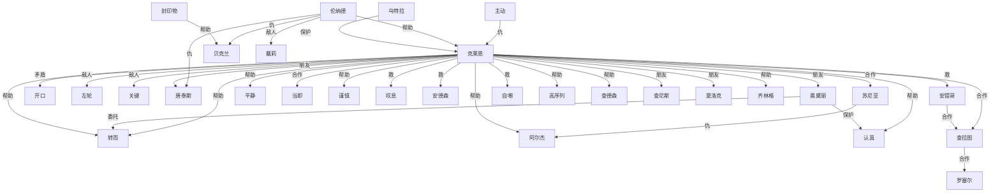

# 人物与关系图：《诡秘之主.txt》

## 关系图解读

- 主角候选：转而
- 识别方式：优先采用子 Agent 标注；缺失时按全书出场覆盖、关系网络中心度和关系词线索推断。
- 使用边界：没有子 Agent JSON 的书，敌对/同盟等语义来自正文关键词和共现段落推断，应作为精读索引，不应直接当最终定论。

## 人物功能分层

### 主角候选

- 转而：全书出现和覆盖最高，覆盖第 17-1396 章。 置信度：中。出场范围：第 17-1396 章。

### 主要对手/反派候选

- 开口：克莱恩：矛盾，覆盖第 10-1387 章，证据：同章共现(359)、队长(5)、朋友(3)、救(3)、矛盾(2)、交易(2)、敌人(2)、威胁(2) 置信度：中。出场范围：第 76-1396 章。
- 主动：克莱恩：仇，覆盖第 28-1385 章，证据：同章共现(136)、仇(2)、委托(2)、敌人(2)、交易(2)、老师(1)、妹妹(1)、合作(1) 置信度：中。出场范围：第 28-1396 章。
- 左轮：克莱恩：敌人，覆盖第 2-1185 章，证据：同章共现(138)、敌人(5)、队长(3)、交换(2)、冲突(1)、喜欢(1)、围攻(1) 置信度：中。出场范围：第 21-1388 章。
- 关键：克莱恩：敌人，覆盖第 21-1396 章，证据：同章共现(77)、帮助(3)、利用(2)、队长(1)、敌人(1)、围攻(1)、喜欢(1)、矛盾(1) 置信度：中。出场范围：第 31-1284 章。

### 核心同伴/盟友候选

- 克莱恩：转而：帮助，覆盖第 16-1391 章，证据：同章共现(162)、委托(2)、帮助(2)、朋友(2)、喜欢(2)、导师(1)、队长(1)、救(1) 置信度：中。出场范围：第 16-1391 章。
- 安德森：克莱恩：救，覆盖第 651-1275 章，证据：同章共现(111)、救(3)、利用(2)、帮助(2)、同伴(1)、朋友(1)、委托(1)、保护(1) 置信度：中。出场范围：第 651-1342 章。
- 安提哥：克莱恩：救，覆盖第 37-1383 章，证据：同章共现(101)、队长(5)、利用(4)、救(3)、母亲(3)、委托(2)、帮助(2)、合作(1) 置信度：中。出场范围：第 36-1382 章。
- 夏洛克：克莱恩：朋友，覆盖第 216-1375 章，证据：同章共现(43)、朋友(2)、学生(1)、合作(1)、保护(1)、围攻(1)、交易(1)、交换(1) 置信度：中。出场范围：第 223-1354 章。
- 查拉图：克莱恩：合作，覆盖第 65-1380 章，证据：同章共现(114)、利用(7)、合作(2)、保护(2)、帮助(2)、兄弟(1)、父亲(1)、威胁(1) 置信度：中。出场范围：第 93-1364 章。
- 高序列：克莱恩：帮助，覆盖第 22-1372 章，证据：同章共现(74)、帮助(6)、父亲(2)、救(2)、利用(2)、委托(1)、长老(1)、保护(1) 置信度：中。出场范围：第 93-1190 章。
- 唐泰斯：克莱恩：朋友，覆盖第 734-1375 章，证据：同章共现(109)、朋友(4)、仇(3)、试探(1)、喜欢(1)、老师(1)、丈夫(1)、帮助(1) 置信度：中。出场范围：第 742-1089 章。
- 平静：克莱恩：帮助，覆盖第 14-1387 章，证据：同章共现(186)、队长(3)、帮助(3)、保护(2)、交换(1)、喜欢(1)、仇(1)、冲突(1) 置信度：中。出场范围：第 159-1218 章。
- 乌特拉：克莱恩：保护，覆盖第 307-1103 章，证据：同章共现(41)、保护(2)、帮助(1)、敌人(1)、同伴(1)、救(1)、母亲(1)、合作(1) 置信度：中。出场范围：第 307-1363 章。
- 叹息：克莱恩：救，覆盖第 37-1374 章，证据：同章共现(114)、救(1)、对手(1)、下属(1)、同行(1)、兄长(1)、保护(1)、仇(1) 置信度：中。出场范围：第 42-1268 章。
- 自嘲：克莱恩：救，覆盖第 7-1361 章，证据：同章共现(93)、救(4)、委托(2)、学生(1)、喜欢(1)、队长(1)、帮助(1)、仇(1) 置信度：中。出场范围：第 76-1309 章。
- 齐林格：克莱恩：帮助，覆盖第 147-1039 章，证据：同章共现(26)、帮助(2)、合作(1)、救(1)、队长(1)、委托(1)、敌人(1)、保护(1) 置信度：中。出场范围：第 153-1039 章。

### 导师/上位者/下属候选

- 邓恩：克莱恩：队长，覆盖第 12-947 章，证据：同章共现(180)、队长(44)、帮助(3)、朋友(1)、交易(1)、妹妹(1)、敌人(1)、试探(1) 置信度：中。出场范围：第 12-777 章。
- 好奇：克莱恩：队长，覆盖第 13-1156 章，证据：同章共现(100)、队长(2)、喜欢(1)、利用(1)、交易(1)、老师(1)、朋友(1)、救(1) 置信度：中。出场范围：第 13-1190 章。
- 疑惑：克莱恩：队长，覆盖第 12-1391 章，证据：同章共现(230)、队长(5)、交易(2)、妹妹(1)、导师(1)、仇(1)、合作(1)、矛盾(1) 置信度：中。出场范围：第 16-1185 章。
- 梅高欧：克莱恩：队长，覆盖第 116-1257 章，证据：同章共现(23)、队长(3)、委托(1)、救(1)、帮助(1) 置信度：中。出场范围：第 116-1390 章。
- 坦然：坦然回：队长，覆盖第 10-1344 章，证据：同章共现(64)、队长(2)、救(1)、导师(1)、喜欢(1)、对手(1)、追杀(1)、老师(1) 置信度：中。出场范围：第 121-1319 章。
- 戴莉：克莱恩：队长，覆盖第 14-980 章，证据：同章共现(51)、队长(9)、导师(2)、矛盾(1)、仇(1) 置信度：中。出场范围：第 14-945 章。
- 旋即：克莱恩：队长，覆盖第 16-1390 章，证据：同章共现(168)、队长(3)、利用(2)、喜欢(2)、导师(1)、同伴(1)、朋友(1)、雇佣(1) 置信度：中。出场范围：第 15-1232 章。
- 坦然回：坦然：队长，覆盖第 10-1344 章，证据：同章共现(64)、队长(2)、救(1)、导师(1)、喜欢(1)、对手(1)、追杀(1)、老师(1) 置信度：中。出场范围：第 113-1344 章。

### 亲属/情感关系候选

- 罗塞尔：克莱恩：喜欢，覆盖第 15-1391 章，证据：同章共现(293)、帮助(5)、喜欢(5)、父亲(5)、利用(5)、兄弟(4)、救(3)、母亲(3) 置信度：中。出场范围：第 7-1374 章。
- 梅丽莎：班森：妹妹，覆盖第 3-1364 章，证据：同章共现(111)、妹妹(16)、队长(3)、雇佣(2)、威胁(2)、帮助(2)、父亲(2)、喜欢(2) 置信度：中。出场范围：第 3-1396 章。
- 克莱恩笑：克莱恩：妹妹，覆盖第 11-1389 章，证据：同章共现(150)、妹妹(3)、喜欢(3)、委托(2)、朋友(2)、保护(1)、队长(1)、试探(1) 置信度：中。出场范围：第 62-1056 章。
- 贝尔纳：克莱恩：喜欢，覆盖第 536-1390 章，证据：同章共现(58)、利用(2)、保护(1)、喜欢(1)、父亲(1)、帮助(1)、女儿(1)、敌人(1) 置信度：中。出场范围：第 265-1374 章。
- 罗德斯：克莱恩：喜欢，覆盖第 425-1396 章，证据：同章共现(110)、喜欢(3)、父亲(2)、交易(1)、矛盾(1)、兄弟(1)、委托(1)、试探(1) 置信度：中。出场范围：第 648-1349 章。
- 艾弥留：克莱恩：喜欢，覆盖第 622-998 章，证据：同章共现(61)、喜欢(2)、交易(1)、委托(1)、帮助(1)、亲人(1)、保护(1)、冲突(1) 置信度：中。出场范围：第 622-999 章。
- 班森：梅丽莎：妹妹，覆盖第 3-1364 章，证据：同章共现(111)、妹妹(16)、队长(3)、雇佣(2)、威胁(2)、帮助(2)、父亲(2)、喜欢(2) 置信度：中。出场范围：第 4-1144 章。
- 金毛大：奥黛丽：父亲，覆盖第 8-1362 章，证据：同章共现(42)、父亲(3)、喜欢(1)、老师(1)、母亲(1)、妹妹(1) 置信度：中。出场范围：第 41-1318 章。
- 管家瓦：克莱恩：妻子，覆盖第 750-1086 章，证据：同章共现(24)、老师(1)、妻子(1)、仇(1)、矛盾(1)、喜欢(1)、救(1)、妹妹(1) 置信度：中。出场范围：第 743-1076 章。
- 韦尔奇：克莱恩：儿子，覆盖第 9-1299 章，证据：同章共现(21)、儿子(2)、喜欢(1)、导师(1)、队长(1)、父亲(1) 置信度：中。出场范围：第 10-1299 章。
- 霍尔伯：奥黛丽：父亲，覆盖第 8-1395 章，证据：父亲(18)、同章共现(10)、女儿(2)、帮助(2)、喜欢(1)、保护(1)、雇佣(1)、朋友(1) 置信度：中。出场范围：第 107-1357 章。

### 交易/利用关系候选

- 贝克兰：克莱恩：利用，覆盖第 25-1390 章，证据：同章共现(276)、利用(9)、交易(5)、帮助(5)、喜欢(4)、敌人(4)、合作(4)、保护(3) 置信度：中。出场范围：第 50-1396 章。
- 斟酌着：克莱恩：利用，覆盖第 19-1273 章，证据：同章共现(62)、利用(2)、委托(1)、冲突(1)、保护(1)、仇(1)、帮助(1)、父亲(1) 置信度：中。出场范围：第 6-1320 章。
- 封印物：克莱恩：利用，覆盖第 19-1391 章，证据：同章共现(162)、利用(15)、帮助(6)、队长(5)、保护(3)、交换(3)、威胁(2)、同伴(1) 置信度：中。出场范围：第 19-1348 章。
- 鲁恩王：贝克兰：交易，覆盖第 3-1356 章，证据：同章共现(36)、父亲(2)、交易(2)、导师(1)、母亲(1)、交换(1)、帮助(1)、委托(1) 置信度：中。出场范围：第 2-1320 章。
- 艾辛格：克莱恩：交易，覆盖第 306-1099 章，证据：同章共现(56)、交易(2)、合作(1)、帮助(1)、利用(1)、委托(1)、对手(1)、喜欢(1) 置信度：中。出场范围：第 273-770 章。
- 试探着：克莱恩：试探，覆盖第 13-1293 章，证据：试探(23) 置信度：中。出场范围：第 13-1324 章。
- 利用：克莱恩：利用，覆盖第 39-1386 章，证据：利用(221)、帮助(6)、敌人(5)、保护(3)、对手(2)、交易(2)、冲突(2)、合作(2) 置信度：中。出场范围：第 475-1367 章。
- 索斯特：克莱恩：利用，覆盖第 66-1388 章，证据：同章共现(32)、利用(5) 置信度：中。出场范围：第 409-941 章。
- 克莱恩斟酌着：克莱恩：利用，覆盖第 33-1273 章，证据：同章共现(24)、利用(2)、委托(1)、仇(1) 置信度：中。出场范围：第 120-1230 章。

### 重要配角候选

- 暂无明确候选。

## 主角关系网

- 克莱恩 <-> 转而：帮助（同盟/合作，置信度：中）。覆盖第 16-1391 章；共现 178 次；证据：同章共现(162)、委托(2)、帮助(2)、朋友(2)、喜欢(2)、导师(1)、队长(1)、救(1)
- 奥黛丽 <-> 转而：委托（交易/利用，置信度：中）。覆盖第 146-1318 章；共现 30 次；证据：同章共现(27)、委托(2)、女儿(1)、雇佣(1)

## 主要矛盾和敌对关系

- 克莱恩 <-> 开口：矛盾（敌对/矛盾，置信度：中）。覆盖第 10-1387 章；共现 385 次；证据：同章共现(359)、队长(5)、朋友(3)、救(3)、矛盾(2)、交易(2)、敌人(2)、威胁(2)
- 克莱恩 <-> 左轮：敌人（敌对/矛盾，置信度：中）。覆盖第 2-1185 章；共现 150 次；证据：同章共现(138)、敌人(5)、队长(3)、交换(2)、冲突(1)、喜欢(1)、围攻(1)
- 主动 <-> 克莱恩：仇（敌对/矛盾，置信度：中）。覆盖第 28-1385 章；共现 148 次；证据：同章共现(136)、仇(2)、委托(2)、敌人(2)、交易(2)、老师(1)、妹妹(1)、合作(1)
- 克莱恩 <-> 关键：敌人（敌对/矛盾，置信度：中）。覆盖第 21-1396 章；共现 89 次；证据：同章共现(77)、帮助(3)、利用(2)、队长(1)、敌人(1)、围攻(1)、喜欢(1)、矛盾(1)
- 伦纳德 <-> 贝克兰：仇（敌对/矛盾，置信度：中）。覆盖第 386-1260 章；共现 57 次；证据：同章共现(50)、队长(2)、仇(1)、威胁(1)、敌人(1)、利用(1)、合作(1)
- 伦纳德 <-> 戴莉：敌人（敌对/矛盾，置信度：中）。覆盖第 409-980 章；共现 46 次；证据：同章共现(39)、队长(3)、敌人(2)、保护(1)、仇(1)
- 伦纳德 <-> 唐泰斯：仇（敌对/矛盾，置信度：中）。覆盖第 765-987 章；共现 31 次；证据：同章共现(27)、仇(2)、矛盾(1)、合作(1)
- 苏尼亚 <-> 阿尔杰：仇（敌对/矛盾，置信度：中）。覆盖第 181-1313 章；共现 14 次；证据：同章共现(11)、仇(3)

## 合作、同盟和支援关系

- 伦纳德 <-> 克莱恩：帮助（同盟/合作，置信度：中）。覆盖第 38-1392 章；共现 370 次；证据：同章共现(327)、队长(12)、利用(7)、帮助(6)、仇(5)、救(4)、保护(3)、交易(2)
- 克莱恩 <-> 平静：帮助（同盟/合作，置信度：中）。覆盖第 14-1387 章；共现 204 次；证据：同章共现(186)、队长(3)、帮助(3)、保护(2)、交换(1)、喜欢(1)、仇(1)、冲突(1)
- 克莱恩 <-> 当即：合作（同盟/合作，置信度：中）。覆盖第 21-1382 章；共现 187 次；证据：同章共现(177)、队长(3)、合作(2)、帮助(1)、委托(1)、试探(1)、救(1)、敌人(1)
- 克莱恩 <-> 转而：帮助（同盟/合作，置信度：中）。覆盖第 16-1391 章；共现 178 次；证据：同章共现(162)、委托(2)、帮助(2)、朋友(2)、喜欢(2)、导师(1)、队长(1)、救(1)
- 克莱恩 <-> 认真：帮助（同盟/合作，置信度：中）。覆盖第 26-1382 章；共现 167 次；证据：同章共现(153)、队长(3)、喜欢(2)、利用(2)、妹妹(1)、帮助(1)、兄弟(1)、同伴(1)
- 克莱恩 <-> 查拉图：合作（同盟/合作，置信度：中）。覆盖第 65-1380 章；共现 134 次；证据：同章共现(114)、利用(7)、合作(2)、保护(2)、帮助(2)、兄弟(1)、父亲(1)、威胁(1)
- 克莱恩 <-> 谨慎：帮助（同盟/合作，置信度：中）。覆盖第 34-1385 章；共现 126 次；证据：同章共现(116)、利用(2)、帮助(2)、同行(2)、队长(1)、儿子(1)、围攻(1)、母亲(1)
- 克莱恩 <-> 叹息：救（同盟/合作，置信度：中）。覆盖第 37-1374 章；共现 122 次；证据：同章共现(114)、救(1)、对手(1)、下属(1)、同行(1)、兄长(1)、保护(1)、仇(1)
- 克莱恩 <-> 唐泰斯：朋友（同盟/合作，置信度：中）。覆盖第 734-1375 章；共现 122 次；证据：同章共现(109)、朋友(4)、仇(3)、试探(1)、喜欢(1)、老师(1)、丈夫(1)、帮助(1)
- 克莱恩 <-> 安德森：救（同盟/合作，置信度：中）。覆盖第 651-1275 章；共现 121 次；证据：同章共现(111)、救(3)、利用(2)、帮助(2)、同伴(1)、朋友(1)、委托(1)、保护(1)
- 克莱恩 <-> 安提哥：救（同盟/合作，置信度：中）。覆盖第 37-1383 章；共现 120 次；证据：同章共现(101)、队长(5)、利用(4)、救(3)、母亲(3)、委托(2)、帮助(2)、合作(1)
- 克莱恩 <-> 自嘲：救（同盟/合作，置信度：中）。覆盖第 7-1361 章；共现 103 次；证据：同章共现(93)、救(4)、委托(2)、学生(1)、喜欢(1)、队长(1)、帮助(1)、仇(1)
- 克莱恩 <-> 高序列：帮助（同盟/合作，置信度：中）。覆盖第 22-1372 章；共现 91 次；证据：同章共现(74)、帮助(6)、父亲(2)、救(2)、利用(2)、委托(1)、长老(1)、保护(1)
- 克莱恩 <-> 奥黛丽：朋友（同盟/合作，置信度：中）。覆盖第 35-1392 章；共现 78 次；证据：同章共现(70)、父亲(1)、朋友(1)、同伴(1)、队长(1)、背叛(1)、利用(1)、帮助(1)
- 克莱恩 <-> 查德森：帮助（同盟/合作，置信度：中）。覆盖第 750-1032 章；共现 78 次；证据：同章共现(65)、喜欢(3)、帮助(3)、老师(2)、背叛(2)、命令(1)、朋友(1)、母亲(1)
- 克莱恩 <-> 查尼斯：朋友（同盟/合作，置信度：中）。覆盖第 17-1298 章；共现 63 次；证据：同章共现(48)、队长(5)、喜欢(3)、朋友(2)、帮助(2)、同伴(1)、利用(1)、亲人(1)
- 奥黛丽 <-> 认真：保护（同盟/合作，置信度：中）。覆盖第 7-1368 章；共现 59 次；证据：同章共现(54)、保护(2)、帮助(1)、喜欢(1)、学生(1)、兄弟(1)、姐妹(1)、妹妹(1)
- 克莱恩 <-> 夏洛克：朋友（同盟/合作，置信度：中）。覆盖第 216-1375 章；共现 52 次；证据：同章共现(43)、朋友(2)、学生(1)、合作(1)、保护(1)、围攻(1)、交易(1)、交换(1)
- 克莱恩 <-> 阿尔杰：帮助（同盟/合作，置信度：中）。覆盖第 34-1392 章；共现 51 次；证据：同章共现(45)、帮助(4)、交易(1)、同伴(1)
- 安提哥 <-> 查拉图：合作（同盟/合作，置信度：中）。覆盖第 66-1380 章；共现 47 次；证据：同章共现(38)、合作(3)、帮助(3)、朋友(1)、敌人(1)、利用(1)、下属(1)、救(1)
- 乌特拉 <-> 克莱恩：保护（同盟/合作，置信度：中）。覆盖第 307-1103 章；共现 47 次；证据：同章共现(41)、保护(2)、帮助(1)、敌人(1)、同伴(1)、救(1)、母亲(1)、合作(1)
- 查拉图 <-> 罗塞尔：合作（同盟/合作，置信度：中）。覆盖第 65-1355 章；共现 37 次；证据：同章共现(29)、利用(2)、合作(1)、帮助(1)、保护(1)、对手(1)、兄弟(1)、父亲(1)
- 封印物 <-> 贝克兰：帮助（同盟/合作，置信度：中）。覆盖第 19-1321 章；共现 36 次；证据：同章共现(24)、利用(3)、帮助(2)、仇(2)、保护(2)、同行(1)、威胁(1)、围攻(1)
- 克莱恩 <-> 苏尼亚：合作（同盟/合作，置信度：中）。覆盖第 386-1269 章；共现 36 次；证据：同章共现(29)、合作(2)、帮助(2)、冲突(1)、喜欢(1)、背叛(1)
- 克莱恩 <-> 齐林格：帮助（同盟/合作，置信度：中）。覆盖第 147-1039 章；共现 32 次；证据：同章共现(26)、帮助(2)、合作(1)、救(1)、队长(1)、委托(1)、敌人(1)、保护(1)
- 克莱恩 <-> 米切尔：帮助（同盟/合作，置信度：中）。覆盖第 41-1106 章；共现 30 次；证据：同章共现(25)、帮助(1)、委托(1)、救(1)、交易(1)、利用(1)、合作(1)
- 乔治三 <-> 克莱恩：合作（同盟/合作，置信度：中）。覆盖第 20-1163 章；共现 27 次；证据：同章共现(22)、合作(2)、帮助(1)、喜欢(1)、救(1)、敌人(1)
- 封印物 <-> 邓恩：救（同盟/合作，置信度：中）。覆盖第 19-212 章；共现 26 次；证据：同章共现(20)、队长(2)、救(2)、利用(1)、保护(1)、围攻(1)
- 封印物 <-> 查尼斯：救（同盟/合作，置信度：中）。覆盖第 19-1298 章；共现 26 次；证据：同章共现(21)、队长(2)、救(2)、围攻(1)、帮助(1)、同伴(1)
- 封印物 <-> 高序列：保护（同盟/合作，置信度：中）。覆盖第 141-1357 章；共现 23 次；证据：同章共现(17)、保护(2)、利用(2)、仇(1)、帮助(1)
- 王室 <-> 贝克兰：保护（同盟/合作，置信度：中）。覆盖第 453-1318 章；共现 23 次；证据：同章共现(13)、保护(3)、合作(2)、委托(2)、帮助(2)、父亲(1)、母亲(1)、矛盾(1)
- 罗塞尔 <-> 高序列：保护（同盟/合作，置信度：中）。覆盖第 35-900 章；共现 19 次；证据：同章共现(15)、保护(1)、救(1)、帮助(1)、利用(1)
- 贝克兰 <-> 高序列：帮助（同盟/合作，置信度：中）。覆盖第 160-1103 章；共现 18 次；证据：同章共现(11)、帮助(2)、追杀(1)、雇佣(1)、委托(1)、合作(1)、保护(1)、妹妹(1)
- 丰收教 <-> 乌特拉：同伴（同盟/合作，置信度：中）。覆盖第 303-1281 章；共现 17 次；证据：同章共现(12)、同伴(1)、救(1)、帮助(1)、喜欢(1)、冲突(1)、合作(1)、保护(1)
- 安提哥 <-> 封印物：帮助（同盟/合作，置信度：中）。覆盖第 53-677 章；共现 16 次；证据：同章共现(12)、帮助(2)、队长(2)、合作(1)
- 丰收教 <-> 克莱恩：同伴（同盟/合作，置信度：中）。覆盖第 303-1103 章；共现 15 次；证据：同章共现(13)、同伴(1)、救(1)、合作(1)、保护(1)
- 安德森 <-> 开口：同伴（同盟/合作，置信度：中）。覆盖第 652-1108 章；共现 14 次；证据：同章共现(13)、同伴(1)、朋友(1)、救(1)
- 克莱恩 <-> 辛德拉：朋友（同盟/合作，置信度：中）。覆盖第 799-875 章；共现 14 次；证据：同章共现(11)、朋友(1)、对手(1)、交易(1)、帮助(1)、威胁(1)、合作(1)

## 师徒、上下级、亲属和交易关系

- 克莱恩 <-> 罗塞尔：喜欢（亲属/情感，置信度：中）。覆盖第 15-1391 章；共现 334 次；证据：同章共现(293)、帮助(5)、喜欢(5)、父亲(5)、利用(5)、兄弟(4)、救(3)、母亲(3)
- 克莱恩 <-> 贝克兰：利用（交易/利用，置信度：中）。覆盖第 25-1390 章；共现 328 次；证据：同章共现(276)、利用(9)、交易(5)、帮助(5)、喜欢(4)、敌人(4)、合作(4)、保护(3)
- 克莱恩 <-> 疑惑：队长（师徒/上下级，置信度：中）。覆盖第 12-1391 章；共现 244 次；证据：同章共现(230)、队长(5)、交易(2)、妹妹(1)、导师(1)、仇(1)、合作(1)、矛盾(1)
- 克莱恩 <-> 邓恩：队长（师徒/上下级，置信度：中）。覆盖第 12-947 章；共现 229 次；证据：同章共现(180)、队长(44)、帮助(3)、朋友(1)、交易(1)、妹妹(1)、敌人(1)、试探(1)
- 克莱恩 <-> 利用：利用（交易/利用，置信度：中）。覆盖第 39-1386 章；共现 221 次；证据：利用(221)、帮助(6)、敌人(5)、保护(3)、对手(2)、交易(2)、冲突(2)、合作(2)
- 克莱恩 <-> 封印物：利用（交易/利用，置信度：中）。覆盖第 19-1391 章；共现 205 次；证据：同章共现(162)、利用(15)、帮助(6)、队长(5)、保护(3)、交换(3)、威胁(2)、同伴(1)
- 史密斯 <-> 邓恩：队长（师徒/上下级，置信度：中）。覆盖第 12-1361 章；共现 192 次；证据：同章共现(155)、队长(33)、帮助(3)、救(2)、合作(1)、试探(1)、同伴(1)
- 克莱恩 <-> 旋即：队长（师徒/上下级，置信度：中）。覆盖第 16-1390 章；共现 184 次；证据：同章共现(168)、队长(3)、利用(2)、喜欢(2)、导师(1)、同伴(1)、朋友(1)、雇佣(1)
- 伦纳德 <-> 米切尔：利用（交易/利用，置信度：中）。覆盖第 21-1372 章；共现 184 次；证据：同章共现(163)、队长(7)、帮助(5)、利用(4)、委托(3)、同伴(1)、救(1)、交易(1)
- 克莱恩 <-> 克莱恩笑：妹妹（亲属/情感，置信度：中）。覆盖第 11-1389 章；共现 163 次；证据：同章共现(150)、妹妹(3)、喜欢(3)、委托(2)、朋友(2)、保护(1)、队长(1)、试探(1)
- 梅丽莎 <-> 班森：妹妹（亲属/情感，置信度：中）。覆盖第 3-1364 章；共现 140 次；证据：同章共现(111)、妹妹(16)、队长(3)、雇佣(2)、威胁(2)、帮助(2)、父亲(2)、喜欢(2)
- 克莱恩 <-> 梅丽莎：妹妹（亲属/情感，置信度：中）。覆盖第 3-1275 章；共现 123 次；证据：同章共现(97)、妹妹(17)、雇佣(3)、威胁(2)、帮助(2)、父亲(2)、喜欢(2)、导师(1)
- 克莱恩 <-> 罗德斯：喜欢（亲属/情感，置信度：中）。覆盖第 425-1396 章；共现 121 次；证据：同章共现(110)、喜欢(3)、父亲(2)、交易(1)、矛盾(1)、兄弟(1)、委托(1)、试探(1)
- 佛尔思 <-> 奥黛丽：委托（交易/利用，置信度：中）。覆盖第 107-1392 章；共现 118 次；证据：同章共现(100)、委托(3)、老师(3)、朋友(2)、父亲(2)、同伴(2)、交易(2)、利用(2)
- 克莱恩 <-> 班森：妹妹（亲属/情感，置信度：中）。覆盖第 2-1275 章；共现 111 次；证据：同章共现(91)、妹妹(10)、雇佣(3)、兄长(2)、威胁(2)、帮助(2)、朋友(1)、队长(1)
- 克莱恩 <-> 好奇：队长（师徒/上下级，置信度：中）。覆盖第 13-1156 章；共现 109 次；证据：同章共现(100)、队长(2)、喜欢(1)、利用(1)、交易(1)、老师(1)、朋友(1)、救(1)
- 奥黛丽 <-> 开口：交易（交易/利用，置信度：中）。覆盖第 5-1368 章；共现 86 次；证据：同章共现(81)、交易(2)、委托(1)、试探(1)、父亲(1)
- 坦然 <-> 坦然回：队长（师徒/上下级，置信度：中）。覆盖第 10-1344 章；共现 71 次；证据：同章共现(64)、队长(2)、救(1)、导师(1)、喜欢(1)、对手(1)、追杀(1)、老师(1)
- 克莱恩 <-> 斟酌着：利用（交易/利用，置信度：中）。覆盖第 19-1273 章；共现 70 次；证据：同章共现(62)、利用(2)、委托(1)、冲突(1)、保护(1)、仇(1)、帮助(1)、父亲(1)
- 克莱恩 <-> 艾弥留：喜欢（亲属/情感，置信度：中）。覆盖第 622-998 章；共现 70 次；证据：同章共现(61)、喜欢(2)、交易(1)、委托(1)、帮助(1)、亲人(1)、保护(1)、冲突(1)
- 乌黯魔 <-> 克莱恩：利用（交易/利用，置信度：中）。覆盖第 1182-1354 章；共现 69 次；证据：同章共现(62)、利用(3)、兄弟(1)、交易(1)、矛盾(1)、救(1)、敌人(1)、保护(1)
- 克莱恩 <-> 史密斯：队长（师徒/上下级，置信度：中）。覆盖第 12-852 章；共现 67 次；证据：同章共现(46)、队长(20)、帮助(2)、试探(1)
- 克莱恩 <-> 坦然：队长（师徒/上下级，置信度：中）。覆盖第 10-1371 章；共现 66 次；证据：同章共现(58)、队长(2)、帮助(2)、导师(1)、同伴(1)、对手(1)、委托(1)、老师(1)
- 克莱恩 <-> 贝尔纳：喜欢（亲属/情感，置信度：中）。覆盖第 536-1390 章；共现 66 次；证据：同章共现(58)、利用(2)、保护(1)、喜欢(1)、父亲(1)、帮助(1)、女儿(1)、敌人(1)
- 奥黛丽 <-> 贝克兰：父亲（亲属/情感，置信度：中）。覆盖第 8-1396 章；共现 65 次；证据：同章共现(43)、父亲(6)、救(5)、女儿(4)、朋友(3)、保护(2)、妹妹(2)、委托(1)
- 克莱恩 <-> 艾辛格：交易（交易/利用，置信度：中）。覆盖第 306-1099 章；共现 65 次；证据：同章共现(56)、交易(2)、合作(1)、帮助(1)、利用(1)、委托(1)、对手(1)、喜欢(1)
- 左轮 <-> 左轮手：妹妹（亲属/情感，置信度：中）。覆盖第 1-944 章；共现 64 次；证据：同章共现(59)、妹妹(2)、兄长(1)、队长(1)、敌人(1)、对手(1)
- 克莱恩 <-> 戴莉：队长（师徒/上下级，置信度：中）。覆盖第 14-980 章；共现 63 次；证据：同章共现(51)、队长(9)、导师(2)、矛盾(1)、仇(1)
- 佛尔思 <-> 开口：老师（师徒/上下级，置信度：中）。覆盖第 231-1357 章；共现 60 次；证据：同章共现(52)、老师(3)、喜欢(2)、委托(1)、交易(1)、冲突(1)
- 克莱恩 <-> 红茶：喜欢（亲属/情感，置信度：中）。覆盖第 37-1365 章；共现 56 次；证据：同章共现(48)、喜欢(3)、妹妹(1)、朋友(1)、背叛(1)、保护(1)、仇(1)
- 奥黛丽 <-> 浅笑：喜欢（亲属/情感，置信度：中）。覆盖第 58-1395 章；共现 56 次；证据：同章共现(48)、喜欢(2)、父亲(2)、试探(1)、救(1)、委托(1)、矛盾(1)
- 奥黛丽 <-> 阿尔杰：试探（交易/利用，置信度：中）。覆盖第 5-1392 章；共现 55 次；证据：同章共现(49)、帮助(1)、试探(1)、交换(1)、救(1)、老师(1)、交易(1)
- 戴莉 <-> 戴莉女：队长（师徒/上下级，置信度：中）。覆盖第 22-964 章；共现 53 次；证据：同章共现(37)、队长(13)、帮助(1)、矛盾(1)、保护(1)、敌人(1)
- 唐泰斯 <-> 奥黛丽：父亲（亲属/情感，置信度：中）。覆盖第 864-1365 章；共现 49 次；证据：同章共现(43)、父亲(3)、试探(1)、朋友(1)、喜欢(1)
- 伦纳德 <-> 邓恩：队长（师徒/上下级，置信度：中）。覆盖第 42-947 章；共现 48 次；证据：同章共现(36)、队长(11)、妹妹(1)、帮助(1)
- 奥黛丽 <-> 金毛大：父亲（亲属/情感，置信度：中）。覆盖第 8-1362 章；共现 47 次；证据：同章共现(42)、父亲(3)、喜欢(1)、老师(1)、母亲(1)、妹妹(1)
- 贝克兰 <-> 鲁恩王：交易（交易/利用，置信度：中）。覆盖第 3-1356 章；共现 44 次；证据：同章共现(36)、父亲(2)、交易(2)、导师(1)、母亲(1)、交换(1)、帮助(1)、委托(1)
- 克莱恩 <-> 霍纳奇：导师（师徒/上下级，置信度：中）。覆盖第 55-1382 章；共现 43 次；证据：同章共现(34)、导师(4)、利用(3)、母亲(2)
- 克莱恩 <-> 鲁恩王：交易（交易/利用，置信度：中）。覆盖第 1-1391 章；共现 42 次；证据：同章共现(36)、学生(1)、儿子(1)、保护(1)、交易(1)、交换(1)、委托(1)、争夺(1)
- 克莱恩 <-> 艾伦医：利用（交易/利用，置信度：中）。覆盖第 371-980 章；共现 41 次；证据：同章共现(34)、利用(3)、妻子(2)、亲人(1)、委托(1)、帮助(1)

## 待精读确认的高频共现

- 克莱恩 <-> 缓慢：队长（师徒/上下级，置信度：低）。覆盖第 17-1392 章；共现 186 次；证据：同章共现(182)、队长(2)、救(1)、利用(1)
- 奥黛丽 <-> 好奇：保护（同盟/合作，置信度：低）。覆盖第 35-1323 章；共现 73 次；证据：同章共现(69)、交换(1)、试探(1)、保护(1)、合作(1)
- 严肃 <-> 克莱恩：仇（敌对/矛盾，置信度：低）。覆盖第 9-1372 章；共现 67 次；证据：同章共现(60)、妹妹(1)、老师(1)、队长(1)、仇(1)、帮助(1)、敌人(1)、盟友(1)
- 开口 <-> 阿尔杰：交易（交易/利用，置信度：低）。覆盖第 5-1395 章；共现 65 次；证据：同章共现(63)、交易(2)
- 克莱恩 <-> 顾一圈：同伴（同盟/合作，置信度：低）。覆盖第 71-1390 章；共现 56 次；证据：同章共现(54)、同伴(1)、交易(1)
- 主动 <-> 开口：利用（交易/利用，置信度：低）。覆盖第 78-1396 章；共现 54 次；证据：同章共现(52)、利用(2)、敌人(1)
- 克莱恩 <-> 克莱恩疑惑：仇（敌对/矛盾，置信度：低）。覆盖第 12-1271 章；共现 53 次；证据：同章共现(49)、导师(1)、仇(1)、合作(1)、交易(1)
- 克莱恩疑惑 <-> 疑惑：仇（敌对/矛盾，置信度：低）。覆盖第 12-1271 章；共现 53 次；证据：同章共现(49)、导师(1)、仇(1)、合作(1)、交易(1)
- 克莱恩 <-> 平淡：威胁（敌对/矛盾，置信度：低）。覆盖第 43-1350 章；共现 52 次；证据：同章共现(50)、威胁(1)、委托(1)
- 克莱恩 <-> 马赫特：保护（同盟/合作，置信度：低）。覆盖第 754-1088 章；共现 52 次；证据：同章共现(48)、保护(1)、合作(1)、妹妹(1)、喜欢(1)
- 奥黛丽 <-> 罗塞尔：矛盾（敌对/矛盾，置信度：低）。覆盖第 7-1175 章；共现 51 次；证据：同章共现(42)、交换(2)、老师(1)、父亲(1)、保护(1)、喜欢(1)、矛盾(1)、背叛(1)
- 克莱恩 <-> 黄水晶：朋友（同盟/合作，置信度：低）。覆盖第 38-1293 章；共现 48 次；证据：同章共现(42)、喜欢(1)、委托(1)、朋友(1)、交换(1)、威胁(1)、帮助(1)
- 奥黛丽 <-> 疑惑：救（同盟/合作，置信度：低）。覆盖第 35-1392 章；共现 46 次；证据：同章共现(45)、救(1)
- 伦纳德 <-> 开口：队长（师徒/上下级，置信度：低）。覆盖第 72-1394 章；共现 46 次；证据：同章共现(42)、队长(2)、仇(1)、试探(1)
- 伦纳德 <-> 奥黛丽：帮助（同盟/合作，置信度：低）。覆盖第 1011-1396 章；共现 44 次；证据：同章共现(41)、队长(1)、帮助(1)、朋友(1)
- 克莱恩 <-> 简洁：兄弟（同盟/合作，置信度：低）。覆盖第 32-1323 章；共现 42 次；证据：同章共现(40)、兄弟(1)、同伴(1)
- 克莱恩 <-> 艾尔兰：追杀（敌对/矛盾，置信度：低）。覆盖第 495-711 章；共现 42 次；证据：同章共现(39)、交易(1)、追杀(1)、救(1)、威胁(1)
- 克莱恩 <-> 古赫密：保护（同盟/合作，置信度：低）。覆盖第 134-1148 章；共现 41 次；证据：同章共现(38)、保护(1)、敌人(1)、帮助(1)
- 奥黛丽 <-> 旋即：父亲（亲属/情感，置信度：低）。覆盖第 5-1343 章；共现 39 次；证据：同章共现(38)、父亲(1)
- 克莱恩 <-> 脱口：队长（师徒/上下级，置信度：低）。覆盖第 10-1330 章；共现 39 次；证据：同章共现(37)、队长(2)
- 克莱恩 <-> 诚恳：帮助（同盟/合作，置信度：低）。覆盖第 12-1361 章；共现 36 次；证据：同章共现(32)、帮助(2)、队长(1)、父亲(1)
- 克莱恩 <-> 车夫：朋友（同盟/合作，置信度：低）。覆盖第 12-1086 章；共现 34 次；证据：同章共现(31)、朋友(1)、委托(1)、喜欢(1)
- 查拉图 <-> 贝克兰：冲突（敌对/矛盾，置信度：低）。覆盖第 714-1144 章；共现 34 次；证据：同章共现(32)、利用(1)、冲突(1)
- 开口 <-> 斟酌着：帮助（同盟/合作，置信度：低）。覆盖第 20-1299 章；共现 33 次；证据：同章共现(30)、交易(1)、帮助(1)、喜欢(1)
- 自顾自 <-> 顾自说：队长（师徒/上下级，置信度：低）。覆盖第 11-1225 章；共现 32 次；证据：同章共现(30)、队长(1)、委托(1)
- 安提哥 <-> 霍纳奇：学生（师徒/上下级，置信度：低）。覆盖第 55-1376 章；共现 32 次；证据：同章共现(30)、学生(1)、母亲(1)
- 佛尔思 <-> 认真：老师（师徒/上下级，置信度：低）。覆盖第 154-1296 章；共现 31 次；证据：同章共现(29)、老师(2)
- 贝克兰 <-> 齐林格：帮助（同盟/合作，置信度：低）。覆盖第 146-816 章；共现 30 次；证据：同章共现(26)、帮助(2)、委托(1)、追杀(1)
- 主动 <-> 奥黛丽：救（同盟/合作，置信度：低）。覆盖第 180-1366 章；共现 29 次；证据：同章共现(28)、救(1)
- 伦纳德 <-> 夏洛克：朋友（同盟/合作，置信度：低）。覆盖第 609-961 章；共现 29 次；证据：同章共现(27)、朋友(2)
- 开口 <-> 邓恩：队长（师徒/上下级，置信度：低）。覆盖第 12-208 章；共现 28 次；证据：同章共现(26)、队长(2)
- 克莱恩 <-> 自顾自：队长（师徒/上下级，置信度：低）。覆盖第 11-1375 章；共现 27 次；证据：同章共现(25)、队长(1)、委托(1)
- 佛尔思 <-> 疑惑：委托（交易/利用，置信度：低）。覆盖第 245-1391 章；共现 27 次；证据：同章共现(24)、委托(1)、老师(1)、利用(1)
- 乌托邦 <-> 文德尔：救（同盟/合作，置信度：低）。覆盖第 1332-1368 章；共现 27 次；证据：同章共现(26)、救(1)
- 伦纳德 <-> 旋即：队长（师徒/上下级，置信度：低）。覆盖第 122-1227 章；共现 26 次；证据：同章共现(25)、队长(1)
- 克莱恩 <-> 步一步：保护（同盟/合作，置信度：低）。覆盖第 28-1375 章；共现 25 次；证据：同章共现(23)、保护(1)、亲人(1)
- 伦纳德 <-> 疑惑：普通共现（普通共现，置信度：低）。覆盖第 39-1391 章；共现 25 次；证据：同章共现(25)
- 关键 <-> 奥黛丽：利用（交易/利用，置信度：低）。覆盖第 419-1366 章；共现 25 次；证据：同章共现(24)、利用(1)
- 克莱恩 <-> 周明瑞：保护（同盟/合作，置信度：低）。覆盖第 1-1376 章；共现 24 次；证据：同章共现(22)、妹妹(1)、保护(1)
- 奥黛丽 <-> 当即：喜欢（亲属/情感，置信度：低）。覆盖第 7-1345 章；共现 24 次；证据：同章共现(22)、喜欢(1)、利用(1)

## 人物表（证据索引）

### 1. 转而

- 出现次数：242
- 覆盖章节数：220
- 首次出现：第 17 章
- 最后出现：第 1396 章
- 身份/行为线索：人物行为/发言(242)

### 2. 贝克兰

- 出现次数：119
- 覆盖章节数：112
- 首次出现：第 50 章
- 最后出现：第 1396 章
- 身份/行为线索：姓名候选(119)

### 3. 罗塞尔

- 出现次数：150
- 覆盖章节数：104
- 首次出现：第 7 章
- 最后出现：第 1374 章
- 身份/行为线索：姓名候选(149)、人物行为/发言(1)

### 4. 开口

- 出现次数：96
- 覆盖章节数：90
- 首次出现：第 76 章
- 最后出现：第 1396 章
- 身份/行为线索：人物行为/发言(96)

### 5. 克莱恩

- 出现次数：90
- 覆盖章节数：80
- 首次出现：第 16 章
- 最后出现：第 1391 章
- 身份/行为线索：人物行为/发言(90)

### 6. 斟酌着

- 出现次数：74
- 覆盖章节数：70
- 首次出现：第 6 章
- 最后出现：第 1320 章
- 身份/行为线索：人物行为/发言(74)

### 7. 梅丽莎

- 出现次数：111
- 覆盖章节数：63
- 首次出现：第 3 章
- 最后出现：第 1396 章
- 身份/行为线索：姓名候选(110)、人物行为/发言(1)

### 8. 黄金梦

- 出现次数：102
- 覆盖章节数：58
- 首次出现：第 500 章
- 最后出现：第 1383 章
- 身份/行为线索：姓名候选(102)

### 9. 安德森

- 出现次数：101
- 覆盖章节数：48
- 首次出现：第 651 章
- 最后出现：第 1342 章
- 身份/行为线索：姓名候选(90)、人物行为/发言(11)

### 10. 安提哥

- 出现次数：60
- 覆盖章节数：45
- 首次出现：第 36 章
- 最后出现：第 1382 章
- 身份/行为线索：姓名候选(60)

### 11. 夏洛克

- 出现次数：54
- 覆盖章节数：44
- 首次出现：第 223 章
- 最后出现：第 1354 章
- 身份/行为线索：姓名候选(52)、人物行为/发言(2)

### 12. 封印物

- 出现次数：46
- 覆盖章节数：40
- 首次出现：第 19 章
- 最后出现：第 1348 章
- 身份/行为线索：姓名候选(45)、人物行为/发言(1)

### 13. 顾一圈

- 出现次数：39
- 覆盖章节数：39
- 首次出现：第 161 章
- 最后出现：第 1261 章
- 身份/行为线索：姓名候选(39)

### 14. 鲁恩王

- 出现次数：44
- 覆盖章节数：38
- 首次出现：第 2 章
- 最后出现：第 1320 章
- 身份/行为线索：姓名候选(44)

### 15. 邓恩

- 出现次数：49
- 覆盖章节数：35
- 首次出现：第 12 章
- 最后出现：第 777 章
- 身份/行为线索：姓名候选(37)、人物行为/发言(12)

### 16. 查拉图

- 出现次数：44
- 覆盖章节数：34
- 首次出现：第 93 章
- 最后出现：第 1364 章
- 身份/行为线索：姓名候选(44)

### 17. 高序列

- 出现次数：38
- 覆盖章节数：34
- 首次出现：第 93 章
- 最后出现：第 1190 章
- 身份/行为线索：姓名候选(38)

### 18. 主动

- 出现次数：33
- 覆盖章节数：33
- 首次出现：第 28 章
- 最后出现：第 1396 章
- 身份/行为线索：人物行为/发言(33)

### 19. 克莱恩笑

- 出现次数：32
- 覆盖章节数：31
- 首次出现：第 62 章
- 最后出现：第 1056 章
- 身份/行为线索：人物行为/发言(32)

### 20. 顾自说

- 出现次数：31
- 覆盖章节数：31
- 首次出现：第 11 章
- 最后出现：第 1195 章
- 身份/行为线索：姓名候选(31)

### 21. 黄水晶

- 出现次数：35
- 覆盖章节数：30
- 首次出现：第 72 章
- 最后出现：第 926 章
- 身份/行为线索：姓名候选(35)

### 22. 脱口

- 出现次数：28
- 覆盖章节数：28
- 首次出现：第 12 章
- 最后出现：第 1296 章
- 身份/行为线索：人物行为/发言(28)

### 23. 安全航

- 出现次数：38
- 覆盖章节数：27
- 首次出现：第 59 章
- 最后出现：第 1331 章
- 身份/行为线索：姓名候选(38)

### 24. 唐泰斯

- 出现次数：33
- 覆盖章节数：27
- 首次出现：第 742 章
- 最后出现：第 1089 章
- 身份/行为线索：姓名候选(33)

### 25. 自顾自

- 出现次数：25
- 覆盖章节数：25
- 首次出现：第 78 章
- 最后出现：第 1263 章
- 身份/行为线索：人物行为/发言(25)

### 26. 艾辛格

- 出现次数：51
- 覆盖章节数：23
- 首次出现：第 273 章
- 最后出现：第 770 章
- 身份/行为线索：姓名候选(46)、人物行为/发言(5)

### 27. 平静

- 出现次数：26
- 覆盖章节数：23
- 首次出现：第 159 章
- 最后出现：第 1218 章
- 身份/行为线索：人物行为/发言(26)

### 28. 左右张

- 出现次数：24
- 覆盖章节数：23
- 首次出现：第 558 章
- 最后出现：第 1356 章
- 身份/行为线索：姓名候选(24)

### 29. 好奇

- 出现次数：23
- 覆盖章节数：23
- 首次出现：第 13 章
- 最后出现：第 1190 章
- 身份/行为线索：人物行为/发言(23)

### 30. 张椅子

- 出现次数：23
- 覆盖章节数：22
- 首次出现：第 155 章
- 最后出现：第 1396 章
- 身份/行为线索：姓名候选(23)

### 31. 试探着

- 出现次数：22
- 覆盖章节数：22
- 首次出现：第 13 章
- 最后出现：第 1324 章
- 身份/行为线索：人物行为/发言(22)

### 32. 乌特拉

- 出现次数：24
- 覆盖章节数：21
- 首次出现：第 307 章
- 最后出现：第 1363 章
- 身份/行为线索：姓名候选(24)

### 33. 步一步

- 出现次数：21
- 覆盖章节数：21
- 首次出现：第 18 章
- 最后出现：第 1395 章
- 身份/行为线索：姓名候选(21)

### 34. 艾尔兰

- 出现次数：47
- 覆盖章节数：20
- 首次出现：第 495 章
- 最后出现：第 738 章
- 身份/行为线索：姓名候选(37)、人物行为/发言(10)

### 35. 应序列

- 出现次数：24
- 覆盖章节数：20
- 首次出现：第 65 章
- 最后出现：第 1392 章
- 身份/行为线索：姓名候选(24)

### 36. 疑惑

- 出现次数：20
- 覆盖章节数：20
- 首次出现：第 16 章
- 最后出现：第 1185 章
- 身份/行为线索：人物行为/发言(20)

### 37. 叹息

- 出现次数：20
- 覆盖章节数：20
- 首次出现：第 42 章
- 最后出现：第 1268 章
- 身份/行为线索：人物行为/发言(20)

### 38. 利用

- 出现次数：19
- 覆盖章节数：19
- 首次出现：第 475 章
- 最后出现：第 1367 章
- 身份/行为线索：姓名候选(19)

### 39. 自嘲

- 出现次数：18
- 覆盖章节数：18
- 首次出现：第 76 章
- 最后出现：第 1309 章
- 身份/行为线索：人物行为/发言(18)

### 40. 思索着

- 出现次数：18
- 覆盖章节数：18
- 首次出现：第 317 章
- 最后出现：第 1279 章
- 身份/行为线索：人物行为/发言(18)

### 41. 贝尔纳

- 出现次数：32
- 覆盖章节数：17
- 首次出现：第 265 章
- 最后出现：第 1374 章
- 身份/行为线索：姓名候选(32)

### 42. 梅高欧

- 出现次数：25
- 覆盖章节数：17
- 首次出现：第 116 章
- 最后出现：第 1390 章
- 身份/行为线索：姓名候选(25)

### 43. 齐林格

- 出现次数：21
- 覆盖章节数：17
- 首次出现：第 153 章
- 最后出现：第 1039 章
- 身份/行为线索：姓名候选(21)

### 44. 罗德斯

- 出现次数：18
- 覆盖章节数：17
- 首次出现：第 648 章
- 最后出现：第 1349 章
- 身份/行为线索：姓名候选(18)

### 45. 苏尼亚

- 出现次数：17
- 覆盖章节数：16
- 首次出现：第 64 章
- 最后出现：第 1313 章
- 身份/行为线索：姓名候选(17)

### 46. 艾弥留

- 出现次数：37
- 覆盖章节数：15
- 首次出现：第 622 章
- 最后出现：第 999 章
- 身份/行为线索：姓名候选(37)

### 47. 乔治三

- 出现次数：21
- 覆盖章节数：15
- 首次出现：第 20 章
- 最后出现：第 1185 章
- 身份/行为线索：姓名候选(21)

### 48. 班森

- 出现次数：18
- 覆盖章节数：15
- 首次出现：第 4 章
- 最后出现：第 1144 章
- 身份/行为线索：姓名候选(11)、人物行为/发言(7)

### 49. 严肃

- 出现次数：16
- 覆盖章节数：15
- 首次出现：第 70 章
- 最后出现：第 1232 章
- 身份/行为线索：人物行为/发言(9)、姓名候选(7)

### 50. 周明瑞

- 出现次数：27
- 覆盖章节数：14
- 首次出现：第 1 章
- 最后出现：第 1376 章
- 身份/行为线索：姓名候选(26)、人物行为/发言(1)

### 51. 马赫特

- 出现次数：20
- 覆盖章节数：14
- 首次出现：第 755 章
- 最后出现：第 1032 章
- 身份/行为线索：姓名候选(20)

### 52. 费内波

- 出现次数：15
- 覆盖章节数：14
- 首次出现：第 44 章
- 最后出现：第 1396 章
- 身份/行为线索：姓名候选(15)

### 53. 苦涩

- 出现次数：15
- 覆盖章节数：14
- 首次出现：第 208 章
- 最后出现：第 1299 章
- 身份/行为线索：人物行为/发言(15)

### 54. 当即

- 出现次数：14
- 覆盖章节数：14
- 首次出现：第 21 章
- 最后出现：第 1351 章
- 身份/行为线索：人物行为/发言(14)

### 55. 常地说

- 出现次数：14
- 覆盖章节数：14
- 首次出现：第 31 章
- 最后出现：第 1390 章
- 身份/行为线索：姓名候选(14)

### 56. 金毛大

- 出现次数：14
- 覆盖章节数：14
- 首次出现：第 41 章
- 最后出现：第 1318 章
- 身份/行为线索：姓名候选(14)

### 57. 伦纳德

- 出现次数：14
- 覆盖章节数：14
- 首次出现：第 43 章
- 最后出现：第 1279 章
- 身份/行为线索：人物行为/发言(14)

### 58. 坦然

- 出现次数：14
- 覆盖章节数：14
- 首次出现：第 121 章
- 最后出现：第 1319 章
- 身份/行为线索：人物行为/发言(14)

### 59. 平淡

- 出现次数：14
- 覆盖章节数：14
- 首次出现：第 338 章
- 最后出现：第 1217 章
- 身份/行为线索：人物行为/发言(14)

### 60. 管家瓦

- 出现次数：14
- 覆盖章节数：14
- 首次出现：第 743 章
- 最后出现：第 1076 章
- 身份/行为线索：姓名候选(14)

### 61. 韦尔奇

- 出现次数：19
- 覆盖章节数：13
- 首次出现：第 10 章
- 最后出现：第 1299 章
- 身份/行为线索：姓名候选(19)

### 62. 查德森

- 出现次数：19
- 覆盖章节数：13
- 首次出现：第 750 章
- 最后出现：第 1032 章
- 身份/行为线索：姓名候选(19)

### 63. 简单回

- 出现次数：16
- 覆盖章节数：13
- 首次出现：第 35 章
- 最后出现：第 1396 章
- 身份/行为线索：姓名候选(13)、人物行为/发言(3)

### 64. 索斯特

- 出现次数：16
- 覆盖章节数：13
- 首次出现：第 409 章
- 最后出现：第 941 章
- 身份/行为线索：姓名候选(15)、人物行为/发言(1)

### 65. 鲁恩人

- 出现次数：15
- 覆盖章节数：13
- 首次出现：第 6 章
- 最后出现：第 1250 章
- 身份/行为线索：姓名候选(15)

### 66. 戴莉

- 出现次数：15
- 覆盖章节数：13
- 首次出现：第 14 章
- 最后出现：第 945 章
- 身份/行为线索：姓名候选(13)、人物行为/发言(2)

### 67. 左轮

- 出现次数：15
- 覆盖章节数：13
- 首次出现：第 21 章
- 最后出现：第 1388 章
- 身份/行为线索：姓名候选(15)

### 68. 旋即

- 出现次数：14
- 覆盖章节数：13
- 首次出现：第 15 章
- 最后出现：第 1232 章
- 身份/行为线索：人物行为/发言(14)

### 69. 高声喊

- 出现次数：14
- 覆盖章节数：13
- 首次出现：第 64 章
- 最后出现：第 1345 章
- 身份/行为线索：姓名候选(14)

### 70. 连忙

- 出现次数：14
- 覆盖章节数：13
- 首次出现：第 101 章
- 最后出现：第 1394 章
- 身份/行为线索：人物行为/发言(12)、姓名候选(2)

### 71. 诚恳

- 出现次数：13
- 覆盖章节数：13
- 首次出现：第 42 章
- 最后出现：第 1284 章
- 身份/行为线索：人物行为/发言(13)

### 72. 坦然回

- 出现次数：13
- 覆盖章节数：13
- 首次出现：第 113 章
- 最后出现：第 1344 章
- 身份/行为线索：人物行为/发言(13)

### 73. 查尼斯

- 出现次数：15
- 覆盖章节数：12
- 首次出现：第 17 章
- 最后出现：第 1181 章
- 身份/行为线索：姓名候选(15)

### 74. 关键

- 出现次数：13
- 覆盖章节数：12
- 首次出现：第 31 章
- 最后出现：第 1284 章
- 身份/行为线索：姓名候选(13)

### 75. 缓慢

- 出现次数：13
- 覆盖章节数：12
- 首次出现：第 94 章
- 最后出现：第 1392 章
- 身份/行为线索：人物行为/发言(13)

### 76. 罗思德

- 出现次数：13
- 覆盖章节数：12
- 首次出现：第 501 章
- 最后出现：第 1327 章
- 身份/行为线索：姓名候选(13)

### 77. 左右各

- 出现次数：12
- 覆盖章节数：12
- 首次出现：第 22 章
- 最后出现：第 1343 章
- 身份/行为线索：姓名候选(12)

### 78. 沉吟着

- 出现次数：12
- 覆盖章节数：12
- 首次出现：第 38 章
- 最后出现：第 863 章
- 身份/行为线索：人物行为/发言(12)

### 79. 霍尔伯

- 出现次数：12
- 覆盖章节数：12
- 首次出现：第 107 章
- 最后出现：第 1357 章
- 身份/行为线索：姓名候选(12)

### 80. 克莱恩斟酌着

- 出现次数：12
- 覆盖章节数：12
- 首次出现：第 120 章
- 最后出现：第 1230 章
- 身份/行为线索：人物行为/发言(12)

### 81. 方开口

- 出现次数：12
- 覆盖章节数：12
- 首次出现：第 279 章
- 最后出现：第 1212 章
- 身份/行为线索：姓名候选(12)

### 82. 低哑

- 出现次数：12
- 覆盖章节数：12
- 首次出现：第 458 章
- 最后出现：第 1174 章
- 身份/行为线索：人物行为/发言(12)

### 83. 啧啧

- 出现次数：12
- 覆盖章节数：12
- 首次出现：第 506 章
- 最后出现：第 1338 章
- 身份/行为线索：人物行为/发言(12)

### 84. 文德尔

- 出现次数：24
- 覆盖章节数：11
- 首次出现：第 1332 章
- 最后出现：第 1356 章
- 身份/行为线索：姓名候选(24)

### 85. 乌黯魔

- 出现次数：20
- 覆盖章节数：11
- 首次出现：第 1184 章
- 最后出现：第 1248 章
- 身份/行为线索：姓名候选(20)

### 86. 边开口

- 出现次数：18
- 覆盖章节数：11
- 首次出现：第 13 章
- 最后出现：第 1350 章
- 身份/行为线索：姓名候选(11)、人物行为/发言(7)

### 87. 艾伦医

- 出现次数：17
- 覆盖章节数：11
- 首次出现：第 327 章
- 最后出现：第 1147 章
- 身份/行为线索：姓名候选(17)

### 88. 犹豫着

- 出现次数：12
- 覆盖章节数：11
- 首次出现：第 326 章
- 最后出现：第 1193 章
- 身份/行为线索：人物行为/发言(12)

### 89. 米切尔

- 出现次数：11
- 覆盖章节数：11
- 首次出现：第 38 章
- 最后出现：第 1007 章
- 身份/行为线索：姓名候选(11)

### 90. 简洁回

- 出现次数：11
- 覆盖章节数：11
- 首次出现：第 43 章
- 最后出现：第 1104 章
- 身份/行为线索：姓名候选(11)

### 91. 霍纳奇

- 出现次数：11
- 覆盖章节数：11
- 首次出现：第 79 章
- 最后出现：第 1374 章
- 身份/行为线索：姓名候选(11)

### 92. 简单说

- 出现次数：11
- 覆盖章节数：11
- 首次出现：第 88 章
- 最后出现：第 1373 章
- 身份/行为线索：姓名候选(11)

### 93. 佛尔思

- 出现次数：11
- 覆盖章节数：11
- 首次出现：第 107 章
- 最后出现：第 1103 章
- 身份/行为线索：人物行为/发言(11)

### 94. 克莱恩坦然回

- 出现次数：11
- 覆盖章节数：11
- 首次出现：第 226 章
- 最后出现：第 1365 章
- 身份/行为线索：人物行为/发言(11)

### 95. 乌托邦

- 出现次数：21
- 覆盖章节数：10
- 首次出现：第 1331 章
- 最后出现：第 1354 章
- 身份/行为线索：姓名候选(21)

### 96. 边走边

- 出现次数：14
- 覆盖章节数：10
- 首次出现：第 112 章
- 最后出现：第 1107 章
- 身份/行为线索：姓名候选(10)、人物行为/发言(4)

### 97. 辛德拉

- 出现次数：13
- 覆盖章节数：10
- 首次出现：第 799 章
- 最后出现：第 875 章
- 身份/行为线索：姓名候选(13)

### 98. 史密斯

- 出现次数：11
- 覆盖章节数：10
- 首次出现：第 13 章
- 最后出现：第 202 章
- 身份/行为线索：姓名候选(11)

### 99. 丰收教

- 出现次数：11
- 覆盖章节数：10
- 首次出现：第 367 章
- 最后出现：第 1281 章
- 身份/行为线索：姓名候选(11)

### 100. 左轮手

- 出现次数：10
- 覆盖章节数：10
- 首次出现：第 3 章
- 最后出现：第 944 章
- 身份/行为线索：姓名候选(10)

## Mermaid 关系草图

