# 人物与关系图：《诡秘之主.txt》

## 人物表

### 1. 贝克兰

- 出现次数：1713
- 覆盖章节数：714
- 首次出现：第 3 章
- 最后出现：第 1396 章
- 身份/行为线索：姓名候选(1713)

### 2. 危险

- 出现次数：617
- 覆盖章节数：412
- 首次出现：第 6 章
- 最后出现：第 1396 章
- 身份/行为线索：姓名候选(617)

### 3. 封印物

- 出现次数：911
- 覆盖章节数：411
- 首次出现：第 19 章
- 最后出现：第 1393 章
- 身份/行为线索：姓名候选(910)、人物行为/发言(1)

### 4. 罗塞尔

- 出现次数：1150
- 覆盖章节数：399
- 首次出现：第 4 章
- 最后出现：第 1396 章
- 身份/行为线索：姓名候选(1149)、人物行为/发言(1)

### 5. 段时间

- 出现次数：503
- 覆盖章节数：378
- 首次出现：第 2 章
- 最后出现：第 1396 章
- 身份/行为线索：姓名候选(503)

### 6. 成员

- 出现次数：442
- 覆盖章节数：298
- 首次出现：第 7 章
- 最后出现：第 1390 章
- 身份/行为线索：姓名候选(442)

### 7. 房间内

- 出现次数：394
- 覆盖章节数：282
- 首次出现：第 2 章
- 最后出现：第 1396 章
- 身份/行为线索：姓名候选(394)

### 8. 白银城

- 出现次数：905
- 覆盖章节数：273
- 首次出现：第 138 章
- 最后出现：第 1395 章
- 身份/行为线索：姓名候选(905)

### 9. 房门

- 出现次数：288
- 覆盖章节数：235
- 首次出现：第 8 章
- 最后出现：第 1396 章
- 身份/行为线索：姓名候选(288)

### 10. 边缘

- 出现次数：258
- 覆盖章节数：235
- 首次出现：第 1 章
- 最后出现：第 1393 章
- 身份/行为线索：姓名候选(258)

### 11. 怀疑

- 出现次数：259
- 覆盖章节数：224
- 首次出现：第 27 章
- 最后出现：第 1393 章
- 身份/行为线索：姓名候选(259)

### 12. 成功

- 出现次数：279
- 覆盖章节数：222
- 首次出现：第 28 章
- 最后出现：第 1391 章
- 身份/行为线索：姓名候选(279)

### 13. 转而

- 出现次数：242
- 覆盖章节数：220
- 首次出现：第 17 章
- 最后出现：第 1396 章
- 身份/行为线索：人物行为/发言(242)

### 14. 高序列

- 出现次数：349
- 覆盖章节数：218
- 首次出现：第 8 章
- 最后出现：第 1392 章
- 身份/行为线索：姓名候选(349)

### 15. 马车

- 出现次数：315
- 覆盖章节数：215
- 首次出现：第 3 章
- 最后出现：第 1396 章
- 身份/行为线索：姓名候选(315)

### 16. 相信

- 出现次数：219
- 覆盖章节数：195
- 首次出现：第 12 章
- 最后出现：第 1386 章
- 身份/行为线索：姓名候选(219)

### 17. 利用

- 出现次数：216
- 覆盖章节数：179
- 首次出现：第 6 章
- 最后出现：第 1390 章
- 身份/行为线索：姓名候选(216)

### 18. 任务

- 出现次数：264
- 覆盖章节数：177
- 首次出现：第 3 章
- 最后出现：第 1395 章
- 身份/行为线索：姓名候选(264)

### 19. 充道

- 出现次数：195
- 覆盖章节数：175
- 首次出现：第 10 章
- 最后出现：第 1396 章
- 身份/行为线索：姓名候选(195)

### 20. 唐泰斯

- 出现次数：693
- 覆盖章节数：173
- 首次出现：第 733 章
- 最后出现：第 1391 章
- 身份/行为线索：姓名候选(693)

### 21. 明显

- 出现次数：173
- 覆盖章节数：163
- 首次出现：第 10 章
- 最后出现：第 1396 章
- 身份/行为线索：姓名候选(173)

### 22. 时此刻

- 出现次数：174
- 覆盖章节数：160
- 首次出现：第 6 章
- 最后出现：第 1386 章
- 身份/行为线索：姓名候选(174)

### 23. 符号

- 出现次数：238
- 覆盖章节数：159
- 首次出现：第 20 章
- 最后出现：第 1396 章
- 身份/行为线索：姓名候选(238)

### 24. 方面

- 出现次数：199
- 覆盖章节数：158
- 首次出现：第 3 章
- 最后出现：第 1396 章
- 身份/行为线索：姓名候选(199)

### 25. 房屋

- 出现次数：198
- 覆盖章节数：152
- 首次出现：第 4 章
- 最后出现：第 1396 章
- 身份/行为线索：姓名候选(198)

### 26. 鲁恩王

- 出现次数：184
- 覆盖章节数：151
- 首次出现：第 2 章
- 最后出现：第 1391 章
- 身份/行为线索：姓名候选(184)

### 27. 时间内

- 出现次数：159
- 覆盖章节数：150
- 首次出现：第 7 章
- 最后出现：第 1382 章
- 身份/行为线索：姓名候选(159)

### 28. 方式

- 出现次数：180
- 覆盖章节数：149
- 首次出现：第 7 章
- 最后出现：第 1396 章
- 身份/行为线索：姓名候选(180)

### 29. 程度

- 出现次数：164
- 覆盖章节数：149
- 首次出现：第 19 章
- 最后出现：第 1396 章
- 身份/行为线索：姓名候选(164)

### 30. 符咒

- 出现次数：293
- 覆盖章节数：148
- 首次出现：第 113 章
- 最后出现：第 1248 章
- 身份/行为线索：姓名候选(293)

### 31. 容道

- 出现次数：165
- 覆盖章节数：143
- 首次出现：第 5 章
- 最后出现：第 1396 章
- 身份/行为线索：姓名候选(165)

### 32. 顾一圈

- 出现次数：153
- 覆盖章节数：143
- 首次出现：第 37 章
- 最后出现：第 1396 章
- 身份/行为线索：姓名候选(153)

### 33. 安提哥

- 出现次数：353
- 覆盖章节数：138
- 首次出现：第 9 章
- 最后出现：第 1387 章
- 身份/行为线索：姓名候选(353)

### 34. 周一求

- 出现次数：334
- 覆盖章节数：133
- 首次出现：第 3 章
- 最后出现：第 1389 章
- 身份/行为线索：姓名候选(334)

### 35. 夏洛克

- 出现次数：278
- 覆盖章节数：131
- 首次出现：第 216 章
- 最后出现：第 1375 章
- 身份/行为线索：姓名候选(276)、人物行为/发言(2)

### 36. 罗德斯

- 出现次数：319
- 覆盖章节数：128
- 首次出现：第 352 章
- 最后出现：第 1396 章
- 身份/行为线索：姓名候选(319)

### 37. 莫雷蒂

- 出现次数：228
- 覆盖章节数：128
- 首次出现：第 1 章
- 最后出现：第 1387 章
- 身份/行为线索：姓名候选(228)

### 38. 苏尼亚

- 出现次数：190
- 覆盖章节数：123
- 首次出现：第 5 章
- 最后出现：第 1396 章
- 身份/行为线索：姓名候选(190)

### 39. 白雾气

- 出现次数：176
- 覆盖章节数：123
- 首次出现：第 5 章
- 最后出现：第 1396 章
- 身份/行为线索：姓名候选(176)

### 40. 勾勒出

- 出现次数：137
- 覆盖章节数：121
- 首次出现：第 6 章
- 最后出现：第 1396 章
- 身份/行为线索：姓名候选(137)

### 41. 查拉图

- 出现次数：379
- 覆盖章节数：118
- 首次出现：第 59 章
- 最后出现：第 1380 章
- 身份/行为线索：姓名候选(379)

### 42. 解决

- 出现次数：133
- 覆盖章节数：116
- 首次出现：第 13 章
- 最后出现：第 1370 章
- 身份/行为线索：姓名候选(133)

### 43. 白地讲

- 出现次数：119
- 覆盖章节数：116
- 首次出现：第 22 章
- 最后出现：第 1396 章
- 身份/行为线索：姓名候选(119)

### 44. 古赫密

- 出现次数：155
- 覆盖章节数：115
- 首次出现：第 6 章
- 最后出现：第 1396 章
- 身份/行为线索：姓名候选(155)

### 45. 管怎么

- 出现次数：121
- 覆盖章节数：115
- 首次出现：第 2 章
- 最后出现：第 1307 章
- 身份/行为线索：姓名候选(121)

### 46. 金币

- 出现次数：170
- 覆盖章节数：113
- 首次出现：第 280 章
- 最后出现：第 1396 章
- 身份/行为线索：姓名候选(170)

### 47. 红之月

- 出现次数：126
- 覆盖章节数：113
- 首次出现：第 1 章
- 最后出现：第 1381 章
- 身份/行为线索：姓名候选(126)

### 48. 安静

- 出现次数：125
- 覆盖章节数：113
- 首次出现：第 15 章
- 最后出现：第 1387 章
- 身份/行为线索：姓名候选(125)

### 49. 邓恩

- 出现次数：294
- 覆盖章节数：112
- 首次出现：第 12 章
- 最后出现：第 1361 章
- 身份/行为线索：姓名候选(282)、人物行为/发言(12)

### 50. 米切尔

- 出现次数：192
- 覆盖章节数：112
- 首次出现：第 21 章
- 最后出现：第 1372 章
- 身份/行为线索：姓名候选(192)

### 51. 范围内

- 出现次数：116
- 覆盖章节数：109
- 首次出现：第 7 章
- 最后出现：第 1371 章
- 身份/行为线索：姓名候选(116)

### 52. 左轮

- 出现次数：149
- 覆盖章节数：108
- 首次出现：第 1 章
- 最后出现：第 1388 章
- 身份/行为线索：姓名候选(149)

### 53. 罗思德

- 出现次数：161
- 覆盖章节数：107
- 首次出现：第 64 章
- 最后出现：第 1395 章
- 身份/行为线索：姓名候选(161)

### 54. 权杖

- 出现次数：216
- 覆盖章节数：106
- 首次出现：第 278 章
- 最后出现：第 1392 章
- 身份/行为线索：姓名候选(216)

### 55. 梅丽莎

- 出现次数：510
- 覆盖章节数：104
- 首次出现：第 2 章
- 最后出现：第 1396 章
- 身份/行为线索：姓名候选(509)、人物行为/发言(1)

### 56. 房屋内

- 出现次数：116
- 覆盖章节数：104
- 首次出现：第 14 章
- 最后出现：第 1396 章
- 身份/行为线索：姓名候选(116)

### 57. 安全

- 出现次数：113
- 覆盖章节数：104
- 首次出现：第 4 章
- 最后出现：第 1391 章
- 身份/行为线索：姓名候选(113)

### 58. 周围

- 出现次数：109
- 覆盖章节数：104
- 首次出现：第 5 章
- 最后出现：第 1387 章
- 身份/行为线索：姓名候选(109)

### 59. 古太阳

- 出现次数：204
- 覆盖章节数：100
- 首次出现：第 360 章
- 最后出现：第 1391 章
- 身份/行为线索：姓名候选(204)

### 60. 安排

- 出现次数：115
- 覆盖章节数：99
- 首次出现：第 11 章
- 最后出现：第 1395 章
- 身份/行为线索：姓名候选(115)

### 61. 霍尔伯

- 出现次数：244
- 覆盖章节数：98
- 首次出现：第 8 章
- 最后出现：第 1395 章
- 身份/行为线索：姓名候选(244)

### 62. 红星辰

- 出现次数：131
- 覆盖章节数：98
- 首次出现：第 7 章
- 最后出现：第 1390 章
- 身份/行为线索：姓名候选(131)

### 63. 相比

- 出现次数：100
- 覆盖章节数：98
- 首次出现：第 6 章
- 最后出现：第 1395 章
- 身份/行为线索：姓名候选(100)

### 64. 古老宫

- 出现次数：116
- 覆盖章节数：97
- 首次出现：第 182 章
- 最后出现：第 1389 章
- 身份/行为线索：姓名候选(116)

### 65. 索罗亚

- 出现次数：287
- 覆盖章节数：96
- 首次出现：第 597 章
- 最后出现：第 1394 章
- 身份/行为线索：姓名候选(287)

### 66. 史密斯

- 出现次数：204
- 覆盖章节数：96
- 首次出现：第 12 章
- 最后出现：第 1361 章
- 身份/行为线索：姓名候选(204)

### 67. 苏勒

- 出现次数：177
- 覆盖章节数：96
- 首次出现：第 4 章
- 最后出现：第 1107 章
- 身份/行为线索：姓名候选(177)

### 68. 贝尔纳

- 出现次数：434
- 覆盖章节数：95
- 首次出现：第 265 章
- 最后出现：第 1393 章
- 身份/行为线索：姓名候选(434)

### 69. 查尼斯

- 出现次数：202
- 覆盖章节数：94
- 首次出现：第 17 章
- 最后出现：第 1298 章
- 身份/行为线索：姓名候选(202)

### 70. 罗会

- 出现次数：113
- 覆盖章节数：93
- 首次出现：第 36 章
- 最后出现：第 1390 章
- 身份/行为线索：姓名候选(113)

### 71. 应该有

- 出现次数：103
- 覆盖章节数：93
- 首次出现：第 22 章
- 最后出现：第 1388 章
- 身份/行为线索：姓名候选(103)

### 72. 宫殿内

- 出现次数：101
- 覆盖章节数：92
- 首次出现：第 55 章
- 最后出现：第 1383 章
- 身份/行为线索：姓名候选(101)

### 73. 常危险

- 出现次数：99
- 覆盖章节数：92
- 首次出现：第 19 章
- 最后出现：第 1396 章
- 身份/行为线索：姓名候选(99)

### 74. 习惯性

- 出现次数：96
- 覆盖章节数：92
- 首次出现：第 3 章
- 最后出现：第 1373 章
- 身份/行为线索：姓名候选(96)

### 75. 安德森

- 出现次数：634
- 覆盖章节数：90
- 首次出现：第 650 章
- 最后出现：第 1346 章
- 身份/行为线索：姓名候选(625)、人物行为/发言(9)

### 76. 开口

- 出现次数：96
- 覆盖章节数：90
- 首次出现：第 76 章
- 最后出现：第 1396 章
- 身份/行为线索：人物行为/发言(96)

### 77. 王庭

- 出现次数：229
- 覆盖章节数：89
- 首次出现：第 139 章
- 最后出现：第 1391 章
- 身份/行为线索：姓名候选(229)

### 78. 明斯克

- 出现次数：109
- 覆盖章节数：89
- 首次出现：第 215 章
- 最后出现：第 1241 章
- 身份/行为线索：姓名候选(109)

### 79. 谢谢

- 出现次数：107
- 覆盖章节数：89
- 首次出现：第 7 章
- 最后出现：第 1390 章
- 身份/行为线索：姓名候选(107)

### 80. 解释道

- 出现次数：101
- 覆盖章节数：89
- 首次出现：第 10 章
- 最后出现：第 1331 章
- 身份/行为线索：姓名候选(101)

### 81. 张开嘴

- 出现次数：94
- 覆盖章节数：89
- 首次出现：第 16 章
- 最后出现：第 1395 章
- 身份/行为线索：姓名候选(94)

### 82. 红手套

- 出现次数：156
- 覆盖章节数：87
- 首次出现：第 212 章
- 最后出现：第 1363 章
- 身份/行为线索：姓名候选(156)

### 83. 罗聚会

- 出现次数：108
- 覆盖章节数：86
- 首次出现：第 31 章
- 最后出现：第 1395 章
- 身份/行为线索：姓名候选(108)

### 84. 史孔隙

- 出现次数：183
- 覆盖章节数：85
- 首次出现：第 1139 章
- 最后出现：第 1386 章
- 身份/行为线索：姓名候选(183)

### 85. 牧羊人

- 出现次数：174
- 覆盖章节数：84
- 首次出现：第 139 章
- 最后出现：第 1254 章
- 身份/行为线索：姓名候选(174)

### 86. 严重

- 出现次数：93
- 覆盖章节数：84
- 首次出现：第 7 章
- 最后出现：第 1377 章
- 身份/行为线索：姓名候选(93)

### 87. 游记

- 出现次数：161
- 覆盖章节数：83
- 首次出现：第 313 章
- 最后出现：第 1348 章
- 身份/行为线索：姓名候选(161)

### 88. 东区

- 出现次数：118
- 覆盖章节数：83
- 首次出现：第 29 章
- 最后出现：第 1179 章
- 身份/行为线索：姓名候选(118)

### 89. 后靠住

- 出现次数：86
- 覆盖章节数：83
- 首次出现：第 55 章
- 最后出现：第 1396 章
- 身份/行为线索：姓名候选(86)

### 90. 索小队

- 出现次数：197
- 覆盖章节数：82
- 首次出现：第 356 章
- 最后出现：第 1269 章
- 身份/行为线索：姓名候选(197)

### 91. 荆棘安

- 出现次数：107
- 覆盖章节数：82
- 首次出现：第 16 章
- 最后出现：第 1361 章
- 身份/行为线索：姓名候选(107)

### 92. 左手

- 出现次数：97
- 覆盖章节数：81
- 首次出现：第 25 章
- 最后出现：第 1385 章
- 身份/行为线索：姓名候选(97)

### 93. 乔伍德

- 出现次数：92
- 覆盖章节数：81
- 首次出现：第 158 章
- 最后出现：第 1209 章
- 身份/行为线索：姓名候选(92)

### 94. 范围

- 出现次数：86
- 覆盖章节数：81
- 首次出现：第 43 章
- 最后出现：第 1357 章
- 身份/行为线索：姓名候选(86)

### 95. 齐林格

- 出现次数：278
- 覆盖章节数：80
- 首次出现：第 146 章
- 最后出现：第 1039 章
- 身份/行为线索：姓名候选(278)

### 96. 钟后

- 出现次数：83
- 覆盖章节数：80
- 首次出现：第 58 章
- 最后出现：第 1396 章
- 身份/行为线索：姓名候选(83)

### 97. 索斯特

- 出现次数：248
- 覆盖章节数：79
- 首次出现：第 9 章
- 最后出现：第 1396 章
- 身份/行为线索：姓名候选(247)、人物行为/发言(1)

### 98. 霍纳奇

- 出现次数：160
- 覆盖章节数：79
- 首次出现：第 9 章
- 最后出现：第 1396 章
- 身份/行为线索：姓名候选(160)

### 99. 封印

- 出现次数：112
- 覆盖章节数：79
- 首次出现：第 171 章
- 最后出现：第 1391 章
- 身份/行为线索：姓名候选(112)

### 100. 关键时

- 出现次数：85
- 覆盖章节数：79
- 首次出现：第 62 章
- 最后出现：第 1396 章
- 身份/行为线索：姓名候选(85)

## 关系边

- 封印 <-> 封印物：共现 894 次，覆盖第 19-1393 章，关系线索：同章共现(816)、队长(16)、保护(15)、老师(11)、敌人(10)、同伴(6)、合作(6)、对手(2)
- 克莱恩 <-> 开口：共现 384 次，覆盖第 10-1387 章，关系线索：同章共现(369)、队长(5)、朋友(3)、交易(2)、敌人(2)、老师(1)、保护(1)、同伴(1)
- 克莱恩 <-> 危险：共现 358 次，覆盖第 10-1374 章，关系线索：同章共现(336)、敌人(5)、队长(4)、合作(4)、保护(3)、父亲(2)、同伴(2)、朋友(2)
- 克莱恩 <-> 罗塞尔：共现 330 次，覆盖第 15-1391 章，关系线索：同章共现(310)、父亲(5)、兄弟(4)、母亲(3)、合作(2)、交易(2)、妻子(1)、敌人(1)
- 克莱恩 <-> 贝克兰：共现 323 次，覆盖第 25-1390 章，关系线索：同章共现(301)、交易(5)、敌人(4)、合作(4)、保护(3)、朋友(2)、队长(1)、父亲(1)
- 克莱恩 <-> 封印：共现 292 次，覆盖第 19-1391 章，关系线索：同章共现(275)、队长(5)、保护(3)、敌人(2)、同伴(1)、追杀(1)、合作(1)、朋友(1)
- 成员 <-> 罗会：共现 279 次，覆盖第 7-1394 章，关系线索：同章共现(250)、交易(14)、朋友(5)、下属(3)、老师(3)、父亲(2)、合作(2)、保护(2)
- 克莱恩 <-> 马车：共现 272 次，覆盖第 12-1362 章，关系线索：同章共现(262)、保护(3)、老师(2)、背叛(2)、队长(1)、妻子(1)、学生(1)
- 克莱恩 <-> 方面：共现 263 次，覆盖第 3-1386 章，关系线索：同章共现(250)、队长(2)、保护(2)、父亲(2)、兄弟(2)、背叛(1)、老师(1)、敌人(1)
- 克莱恩 <-> 怀疑：共现 246 次，覆盖第 11-1391 章，关系线索：同章共现(231)、合作(2)、队长(2)、导师(2)、保护(2)、兄弟(2)、母亲(2)、对手(1)
- 克莱恩 <-> 周围：共现 242 次，覆盖第 9-1392 章，关系线索：同章共现(228)、敌人(4)、老师(3)、保护(3)、学生(2)、交易(1)、命令(1)、女儿(1)
- 克莱恩 <-> 邓恩：共现 229 次，覆盖第 12-947 章，关系线索：同章共现(182)、队长(44)、朋友(1)、交易(1)、敌人(1)、同伴(1)
- 克莱恩 <-> 成员：共现 226 次，覆盖第 36-1392 章，关系线索：同章共现(203)、保护(5)、同伴(3)、交易(3)、合作(3)、下属(2)、朋友(2)、兄弟(2)
- 克莱恩 <-> 利用：共现 215 次，覆盖第 39-1386 章，关系线索：同章共现(197)、敌人(5)、对手(2)、保护(2)、交易(2)、合作(2)、命令(1)、队长(1)
- 克莱恩 <-> 明显：共现 214 次，覆盖第 3-1388 章，关系线索：同章共现(204)、队长(3)、保护(2)、同伴(1)、父亲(1)、女儿(1)、妻子(1)、兄弟(1)
- 克莱恩 <-> 封印物：共现 200 次，覆盖第 19-1391 章，关系线索：同章共现(185)、队长(5)、保护(3)、同伴(1)、敌人(1)、追杀(1)、合作(1)、导师(1)
- 克莱恩 <-> 符咒：共现 194 次，覆盖第 127-1280 章，关系线索：同章共现(187)、敌人(3)、交易(2)、对手(1)、合作(1)、保护(1)
- 史密斯 <-> 邓恩：共现 192 次，覆盖第 12-1361 章，关系线索：同章共现(158)、队长(33)、合作(1)、同伴(1)
- 克莱恩 <-> 成功：共现 187 次，覆盖第 49-1391 章，关系线索：同章共现(172)、交易(3)、保护(2)、老师(2)、敌人(2)、导师(1)、朋友(1)、妻子(1)
- 克莱恩 <-> 转而：共现 178 次，覆盖第 16-1391 章，关系线索：同章共现(171)、朋友(2)、导师(1)、队长(1)、合作(1)、敌人(1)、保护(1)
- 克莱恩 <-> 相信：共现 176 次，覆盖第 3-1386 章，关系线索：同章共现(165)、交易(2)、合作(2)、队长(1)、母亲(1)、命令(1)、同伴(1)、朋友(1)
- 克莱恩 <-> 解决：共现 170 次，覆盖第 9-1386 章，关系线索：同章共现(158)、朋友(2)、敌人(2)、保护(2)、父亲(1)、母亲(1)、队长(1)、合作(1)
- 克莱恩 <-> 程度：共现 169 次，覆盖第 4-1391 章，关系线索：同章共现(160)、保护(2)、合作(2)、同伴(1)、敌人(1)、老师(1)、背叛(1)、兄弟(1)
- 克莱恩 <-> 方式：共现 168 次，覆盖第 23-1391 章，关系线索：同章共现(158)、导师(2)、队长(2)、对手(1)、老师(1)、追杀(1)、妻子(1)、命令(1)
- 宫殿 <-> 宫殿内：共现 163 次，覆盖第 55-1383 章，关系线索：同章共现(159)、交易(2)、背叛(1)、敌人(1)
- 克莱恩 <-> 安静：共现 159 次，覆盖第 15-1387 章，关系线索：同章共现(153)、交易(2)、保护(1)、儿子(1)、父亲(1)、朋友(1)
- 范围 <-> 范围内：共现 150 次，覆盖第 7-1371 章，关系线索：同章共现(136)、同伴(5)、敌人(4)、父亲(2)、队长(1)、导师(1)、追杀(1)、下属(1)
- 克莱恩 <-> 边缘：共现 150 次，覆盖第 16-1387 章，关系线索：同章共现(147)、母亲(1)、儿子(1)、下属(1)
- 克莱恩 <-> 左轮：共现 149 次，覆盖第 2-1185 章，关系线索：同章共现(141)、敌人(5)、队长(3)
- 克莱恩 <-> 白银城：共现 149 次，覆盖第 138-1374 章，关系线索：同章共现(140)、交易(2)、父亲(2)、母亲(2)、导师(1)、老师(1)、保护(1)
- 克莱恩 <-> 莫雷蒂：共现 147 次，覆盖第 1-1387 章，关系线索：同章共现(134)、学生(6)、合作(3)、队长(2)、朋友(1)、敌人(1)、保护(1)、背叛(1)
- 克莱恩 <-> 金币：共现 146 次，覆盖第 280-1390 章，关系线索：同章共现(144)、朋友(2)
- 克莱恩 <-> 房门：共现 142 次，覆盖第 13-1384 章，关系线索：同章共现(133)、队长(5)、朋友(1)、交易(1)、父亲(1)、母亲(1)
- 游记 <-> 罗塞尔：共现 139 次，覆盖第 578-1348 章，关系线索：同章共现(135)、交易(1)、命令(1)、女儿(1)、父亲(1)
- 克莱恩 <-> 查拉图：共现 133 次，覆盖第 65-1380 章，关系线索：同章共现(127)、合作(2)、保护(2)、兄弟(1)、父亲(1)、盟友(1)、敌人(1)
- 克莱恩 <-> 权杖：共现 131 次，覆盖第 261-1373 章，关系线索：同章共现(128)、保护(1)、命令(1)、合作(1)
- 克莱恩 <-> 宫殿：共现 129 次，覆盖第 55-1388 章，关系线索：同章共现(127)、敌人(1)、交易(1)
- 克莱恩 <-> 房屋：共现 127 次，覆盖第 4-1362 章，关系线索：同章共现(120)、队长(3)、敌人(2)、保护(2)、同伴(1)
- 克莱恩 <-> 罗会：共现 124 次，覆盖第 113-1396 章，关系线索：同章共现(107)、交易(7)、朋友(4)、下属(2)、保护(2)、背叛(1)、合作(1)
- 成员 <-> 罗会成：共现 124 次，覆盖第 115-1394 章，关系线索：同章共现(118)、交易(4)、老师(1)、朋友(1)、保护(1)
- 罗会 <-> 罗会成：共现 124 次，覆盖第 115-1394 章，关系线索：同章共现(118)、交易(4)、老师(1)、朋友(1)、保护(1)
- 克莱恩 <-> 梅丽莎：共现 123 次，覆盖第 3-1275 章，关系线索：同章共现(117)、父亲(2)、导师(1)、朋友(1)、队长(1)、交易(1)、母亲(1)、女儿(1)
- 克莱恩 <-> 符号：共现 122 次，覆盖第 40-1358 章，关系线索：同章共现(119)、敌人(2)、父亲(1)
- 克莱恩 <-> 罗德斯：共现 120 次，覆盖第 425-1396 章，关系线索：同章共现(115)、父亲(2)、交易(1)、兄弟(1)、同伴(1)、导师(1)
- 克莱恩 <-> 安德森：共现 120 次，覆盖第 651-1275 章，关系线索：同章共现(118)、同伴(1)、朋友(1)、合作(1)
- 克莱恩 <-> 安提哥：共现 119 次，覆盖第 37-1383 章，关系线索：同章共现(110)、队长(5)、母亲(3)、合作(1)
- 克莱恩 <-> 唐泰斯：共现 119 次，覆盖第 734-1375 章，关系线索：同章共现(113)、朋友(4)、老师(1)、丈夫(1)、父亲(1)
- 低沉 <-> 克莱恩：共现 118 次，覆盖第 34-1390 章，关系线索：同章共现(113)、合作(2)、敌人(1)、交易(1)、队长(1)
- 克莱恩 <-> 左手：共现 117 次，覆盖第 23-1375 章，关系线索：同章共现(115)、敌人(1)、交易(1)
- 房屋 <-> 房屋内：共现 111 次，覆盖第 14-1396 章，关系线索：同章共现(103)、队长(2)、丈夫(1)、保护(1)、敌人(1)、合作(1)、导师(1)、同伴(1)
- 克莱恩 <-> 史孔隙：共现 107 次，覆盖第 1140-1386 章，关系线索：同章共现(106)、朋友(1)
- 克莱恩 <-> 颜色：共现 104 次，覆盖第 14-1389 章，关系线索：同章共现(102)、朋友(1)、队长(1)
- 周围 <-> 周围区：共现 102 次，覆盖第 98-1379 章，关系线索：同章共现(94)、敌人(3)、队长(1)、交易(1)、保护(1)、女儿(1)、对手(1)
- 危险 <-> 常危险：共现 99 次，覆盖第 19-1396 章，关系线索：同章共现(89)、队长(2)、保护(2)、敌人(2)、同伴(1)、朋友(1)、交易(1)、合作(1)
- 古老宫 <-> 宫殿：共现 98 次，覆盖第 182-1383 章，关系线索：同章共现(97)、敌人(1)
- 乐部 <-> 克莱恩：共现 95 次，覆盖第 24-997 章，关系线索：同章共现(86)、队长(4)、保护(3)、交易(1)、丈夫(1)、合作(1)
- 克莱恩 <-> 房间内：共现 93 次，覆盖第 23-1384 章，关系线索：同章共现(91)、父亲(1)、同伴(1)
- 克莱恩 <-> 高序列：共现 89 次，覆盖第 22-1372 章，关系线索：同章共现(86)、父亲(2)、保护(1)
- 低沉 <-> 开口：共现 87 次，覆盖第 7-1377 章，关系线索：同章共现(85)、同伴(1)、交易(1)
- 克莱恩 <-> 范围：共现 87 次，覆盖第 32-1375 章，关系线索：同章共现(84)、队长(1)、保护(1)、敌人(1)
- 克莱恩 <-> 段时间：共现 86 次，覆盖第 47-1357 章，关系线索：同章共现(78)、父亲(2)、合作(2)、母亲(1)、队长(1)、敌人(1)、朋友(1)、老师(1)
- 白银城 <-> 索小队：共现 82 次，覆盖第 359-1269 章，关系线索：同章共现(76)、队长(2)、敌人(2)、保护(1)、父亲(1)
- 克莱恩 <-> 后靠住：共现 80 次，覆盖第 55-1392 章，关系线索：同章共现(74)、队长(1)、妻子(1)、交易(1)、兄弟(1)、老师(1)、敌人(1)
- 克莱恩 <-> 游记：共现 80 次，覆盖第 577-1348 章，关系线索：同章共现(78)、交易(1)、命令(1)
- 任务 <-> 克莱恩：共现 79 次，覆盖第 16-1175 章，关系线索：同章共现(74)、队长(2)、同伴(2)、保护(1)
- 危险 <-> 程度：共现 79 次，覆盖第 19-1393 章，关系线索：同章共现(74)、同伴(1)、命令(1)、保护(1)、合作(1)、敌人(1)、对手(1)
- 克莱恩 <-> 苏勒：共现 76 次，覆盖第 4-1361 章，关系线索：同章共现(71)、交易(2)、队长(1)、女儿(1)、学生(1)
- 克莱恩 <-> 安全：共现 74 次，覆盖第 23-1368 章，关系线索：同章共现(70)、合作(2)、队长(1)、老师(1)、学生(1)
- 严重 <-> 克莱恩：共现 71 次，覆盖第 18-1386 章，关系线索：同章共现(66)、队长(2)、父亲(1)、保护(1)、合作(1)、兄弟(1)
- 克莱恩 <-> 石板：共现 70 次，覆盖第 18-1368 章，关系线索：同章共现(67)、队长(1)、敌人(1)、兄弟(1)
- 克莱恩 <-> 红星辰：共现 70 次，覆盖第 58-1390 章，关系线索：同章共现(70)
- 克莱恩 <-> 古太阳：共现 70 次，覆盖第 364-1389 章，关系线索：同章共现(64)、父亲(3)、兄弟(1)、妻子(1)、背叛(1)、盟友(1)
- 克莱恩 <-> 王庭：共现 69 次，覆盖第 139-1390 章，关系线索：同章共现(66)、父亲(1)、背叛(1)、兄弟(1)
- 克莱恩 <-> 史密斯：共现 67 次，覆盖第 12-852 章，关系线索：同章共现(47)、队长(20)
- 东区 <-> 贝克兰：共现 67 次，覆盖第 112-1368 章，关系线索：同章共现(64)、交易(1)、父亲(1)、同伴(1)
- 东区 <-> 克莱恩：共现 66 次，覆盖第 82-1140 章，关系线索：同章共现(63)、交易(1)、合作(1)、朋友(1)
- 危险 <-> 封印：共现 65 次，覆盖第 19-1391 章，关系线索：同章共现(60)、敌人(2)、队长(1)、合作(1)、保护(1)
- 克莱恩 <-> 贝尔纳：共现 65 次，覆盖第 536-1390 章，关系线索：同章共现(62)、保护(1)、父亲(1)、敌人(1)
- 克莱恩 <-> 查尼斯：共现 63 次，覆盖第 17-1298 章，关系线索：同章共现(54)、队长(5)、朋友(2)、同伴(1)、保护(1)
- 克莱恩 <-> 方案：共现 63 次，覆盖第 25-1386 章，关系线索：同章共现(60)、队长(1)、命令(1)、导师(1)
- 时间内 <-> 段时间：共现 62 次，覆盖第 214-1396 章，关系线索：同章共现(59)、妻子(1)、合作(1)、保护(1)
- 古老宫 <-> 宫殿内：共现 60 次，覆盖第 315-1382 章，关系线索：同章共现(59)、敌人(1)
- 成员 <-> 金会：共现 57 次，覆盖第 60-1320 章，关系线索：同章共现(48)、保护(2)、老师(2)、合作(2)、交易(1)、队长(1)、上司(1)
- 危险 <-> 封印物：共现 56 次，覆盖第 19-1377 章，关系线索：同章共现(51)、敌人(2)、队长(1)、合作(1)、保护(1)
- 克莱恩 <-> 顾一圈：共现 56 次，覆盖第 71-1390 章，关系线索：同章共现(54)、同伴(1)、交易(1)
- 克莱恩 <-> 明斯克：共现 56 次，覆盖第 223-723 章，关系线索：同章共现(54)、敌人(1)、保护(1)
- 成员 <-> 贝克兰：共现 55 次，覆盖第 230-1335 章，关系线索：同章共现(49)、合作(2)、队长(1)、妻子(1)、保护(1)、学生(1)
- 克莱恩 <-> 荆棘安：共现 54 次，覆盖第 17-1013 章，关系线索：同章共现(48)、队长(4)、交易(2)、妻子(1)
- 克莱恩 <-> 高丝绸：共现 53 次，覆盖第 50-1367 章，关系线索：同章共现(51)、队长(1)、合作(1)
- 克莱恩 <-> 夏洛克：共现 52 次，覆盖第 216-1375 章，关系线索：同章共现(46)、朋友(2)、学生(1)、合作(1)、保护(1)、交易(1)
- 利用 <-> 封印：共现 51 次，覆盖第 53-1380 章，关系线索：同章共现(47)、保护(2)、追杀(1)、学生(1)、合作(1)
- 克莱恩 <-> 安排：共现 50 次，覆盖第 33-1382 章，关系线索：同章共现(46)、兄弟(1)、保护(1)、敌人(1)、合作(1)
- 克莱恩 <-> 白雾气：共现 50 次，覆盖第 60-1383 章，关系线索：同章共现(50)
- 克莱恩 <-> 红之月：共现 49 次，覆盖第 16-1249 章，关系线索：同章共现(47)、队长(1)、背叛(1)
- 封印 <-> 查尼斯：共现 49 次，覆盖第 19-1298 章，关系线索：同章共现(46)、队长(2)、同伴(1)
- 周围 <-> 白银城：共现 48 次，覆盖第 147-1324 章，关系线索：同章共现(46)、队长(1)、交易(1)
- 安提哥 <-> 查拉图：共现 47 次，覆盖第 66-1380 章，关系线索：同章共现(42)、合作(3)、朋友(1)、敌人(1)、下属(1)
- 克莱恩 <-> 金会：共现 46 次，覆盖第 60-1322 章，关系线索：同章共现(37)、合作(4)、交易(2)、队长(1)、背叛(1)、女儿(1)
- 克莱恩 <-> 时间内：共现 45 次，覆盖第 203-1384 章，关系线索：同章共现(42)、队长(1)、合作(1)、盟友(1)
- 贝克兰 <-> 鲁恩王：共现 44 次，覆盖第 3-1356 章，关系线索：同章共现(38)、父亲(2)、交易(2)、导师(1)、母亲(1)、合作(1)、朋友(1)
- 克莱恩 <-> 宫殿内：共现 44 次，覆盖第 55-1381 章，关系线索：同章共现(43)、敌人(1)
- 危险 <-> 贝克兰：共现 43 次，覆盖第 19-1206 章，关系线索：同章共现(41)、保护(2)
- 克莱恩 <-> 霍纳奇：共现 43 次，覆盖第 55-1382 章，关系线索：同章共现(37)、导师(4)、母亲(2)
- 克莱恩 <-> 索罗亚：共现 43 次，覆盖第 597-1354 章，关系线索：同章共现(39)、合作(2)、敌人(1)、交易(1)、追杀(1)
- 克莱恩 <-> 鲁恩王：共现 42 次，覆盖第 1-1391 章，关系线索：同章共现(38)、学生(1)、儿子(1)、保护(1)、交易(1)
- 王庭 <-> 白银城：共现 42 次，覆盖第 139-1301 章，关系线索：同章共现(40)、背叛(1)、合作(1)
- 克莱恩 <-> 时此刻：共现 41 次，覆盖第 83-1382 章，关系线索：同章共现(38)、敌人(1)、保护(1)、追杀(1)
- 克莱恩 <-> 古赫密：共现 41 次，覆盖第 134-1148 章，关系线索：同章共现(39)、保护(1)、敌人(1)
- 克莱恩 <-> 古老宫：共现 41 次，覆盖第 321-1381 章，关系线索：同章共现(40)、敌人(1)
- 克莱恩 <-> 容道：共现 39 次，覆盖第 44-1289 章，关系线索：同章共现(38)、队长(1)
- 段时间 <-> 贝克兰：共现 39 次，覆盖第 158-1396 章，关系线索：同章共现(32)、朋友(2)、妻子(2)、交易(1)、老师(1)、保护(1)
- 克莱恩 <-> 相比：共现 38 次，覆盖第 30-1361 章，关系线索：同章共现(36)、背叛(1)、保护(1)
- 封印 <-> 贝克兰：共现 37 次，覆盖第 53-1321 章，关系线索：同章共现(34)、保护(2)、老师(1)
- 查拉图 <-> 罗塞尔：共现 37 次，覆盖第 65-1355 章，关系线索：同章共现(32)、合作(1)、保护(1)、对手(1)、兄弟(1)、父亲(1)、下属(1)
- 克莱恩 <-> 索斯特：共现 37 次，覆盖第 66-1388 章，关系线索：同章共现(37)
- 封印 <-> 程度：共现 37 次，覆盖第 93-1371 章，关系线索：同章共现(34)、老师(1)、保护(1)、背叛(1)
- 成员 <-> 索小队：共现 37 次，覆盖第 386-1269 章，关系线索：同章共现(36)、敌人(1)
- 封印物 <-> 贝克兰：共现 36 次，覆盖第 19-1321 章，关系线索：同章共现(33)、保护(2)、老师(1)
- 克莱恩 <-> 范围内：共现 36 次，覆盖第 32-1325 章，关系线索：同章共现(34)、队长(1)、敌人(1)
- 房屋 <-> 贝克兰：共现 36 次，覆盖第 158-1396 章，关系线索：同章共现(36)
- 古太阳 <-> 白银城：共现 36 次，覆盖第 364-1348 章，关系线索：同章共现(29)、父亲(5)、兄弟(1)、背叛(1)
- 克莱恩 <-> 苏尼亚：共现 36 次，覆盖第 386-1269 章，关系线索：同章共现(33)、合作(2)、背叛(1)
- 房屋 <-> 马车：共现 35 次，覆盖第 14-1274 章，关系线索：同章共现(35)
- 克莱恩 <-> 谢谢：共现 35 次，覆盖第 14-1390 章，关系线索：同章共现(31)、队长(2)、导师(1)、妻子(1)
- 任务 <-> 贝克兰：共现 34 次，覆盖第 160-1338 章，关系线索：同章共现(33)、合作(1)
- 查拉图 <-> 贝克兰：共现 34 次，覆盖第 714-1144 章，关系线索：同章共现(34)
- 周围 <-> 安静：共现 33 次，覆盖第 5-1387 章，关系线索：同章共现(32)、命令(1)
- 充道 <-> 克莱恩：共现 33 次，覆盖第 13-1392 章，关系线索：同章共现(32)、队长(1)
- 克莱恩 <-> 管怎么：共现 33 次，覆盖第 170-1172 章，关系线索：同章共现(31)、合作(2)、保护(1)
- 方面 <-> 解决：共现 32 次，覆盖第 10-1386 章，关系线索：同章共现(30)、父亲(1)、丈夫(1)
- 利用 <-> 封印物：共现 32 次，覆盖第 19-1374 章，关系线索：同章共现(29)、保护(2)、追杀(1)、合作(1)
- 贝克兰 <-> 马车：共现 32 次，覆盖第 43-1141 章，关系线索：同章共现(30)、妻子(1)、学生(1)
- 安提哥 <-> 霍纳奇：共现 32 次，覆盖第 55-1376 章，关系线索：同章共现(30)、学生(1)、母亲(1)
- 克莱恩 <-> 齐林格：共现 32 次，覆盖第 147-1039 章，关系线索：同章共现(29)、合作(1)、队长(1)、敌人(1)、保护(1)
- 后区 <-> 霍尔伯：共现 32 次，覆盖第 239-1251 章，关系线索：同章共现(30)、父亲(1)、母亲(1)、女儿(1)
- 封印 <-> 白银城：共现 32 次，覆盖第 363-1352 章，关系线索：同章共现(29)、队长(1)、敌人(1)、保护(1)
- 危险 <-> 成员：共现 31 次，覆盖第 19-1392 章，关系线索：同章共现(28)、队长(1)、同伴(1)、朋友(1)、下属(1)
- 罗塞尔 <-> 贝尔纳：共现 31 次，覆盖第 536-1309 章，关系线索：同章共现(27)、父亲(2)、保护(1)、女儿(1)
- 利用 <-> 危险：共现 30 次，覆盖第 19-1369 章，关系线索：同章共现(28)、队长(1)、敌人(1)
- 成员 <-> 罗塞尔：共现 30 次，覆盖第 41-1379 章，关系线索：同章共现(27)、老师(1)、兄弟(1)、交易(1)
- 克莱恩 <-> 米切尔：共现 30 次，覆盖第 41-1106 章，关系线索：同章共现(28)、交易(1)、合作(1)
- 怀疑 <-> 成员：共现 30 次，覆盖第 112-1211 章，关系线索：同章共现(27)、保护(1)、兄弟(1)、上司(1)
- 封印 <-> 高序列：共现 30 次，覆盖第 141-1371 章，关系线索：同章共现(28)、保护(2)
- 贝克兰 <-> 齐林格：共现 30 次，覆盖第 146-816 章，关系线索：同章共现(29)、追杀(1)
- 封印 <-> 方面：共现 30 次，覆盖第 161-1371 章，关系线索：同章共现(28)、朋友(1)、敌人(1)
- 克莱恩 <-> 解释道：共现 29 次，覆盖第 15-1288 章，关系线索：同章共现(27)、保护(1)、朋友(1)
- 任务 <-> 危险：共现 29 次，覆盖第 89-1393 章，关系线索：同章共现(26)、父亲(1)、交易(1)、同伴(1)
- 方面 <-> 相信：共现 29 次，覆盖第 104-1396 章，关系线索：同章共现(27)、学生(1)、合作(1)
- 克莱恩 <-> 罗会成：共现 29 次，覆盖第 115-1384 章，关系线索：同章共现(28)、保护(1)
- 方面 <-> 罗塞尔：共现 29 次，覆盖第 220-1372 章，关系线索：同章共现(24)、交易(1)、保护(1)、老师(1)、兄弟(1)、女儿(1)
- 伊利亚 <-> 白银城：共现 29 次，覆盖第 362-1266 章，关系线索：同章共现(28)、敌人(1)
- 封印物 <-> 白银城：共现 29 次，覆盖第 824-1352 章，关系线索：同章共现(27)、敌人(1)、保护(1)
- 后区 <-> 贝克兰：共现 28 次，覆盖第 5-1395 章，关系线索：同章共现(28)
- 危险 <-> 怀疑：共现 28 次，覆盖第 6-1393 章，关系线索：同章共现(28)
- 开口 <-> 邓恩：共现 28 次，覆盖第 12-208 章，关系线索：同章共现(26)、队长(2)
- 危险 <-> 方面：共现 28 次，覆盖第 22-1366 章，关系线索：同章共现(23)、父亲(1)、敌人(1)、对手(1)、合作(1)、下属(1)、盟友(1)
- 封印 <-> 范围：共现 28 次，覆盖第 74-1371 章，关系线索：同章共现(28)
- 方面 <-> 贝克兰：共现 28 次，覆盖第 83-1339 章，关系线索：同章共现(27)、队长(1)
- 开口 <-> 成员：共现 28 次，覆盖第 117-1323 章，关系线索：同章共现(25)、同伴(1)、朋友(1)、交易(1)、队长(1)
- 方面 <-> 明显：共现 28 次，覆盖第 173-1376 章，关系线索：同章共现(27)、朋友(1)

## Mermaid 关系草图

```mermaid
graph TD
  nb778f["封印"] --> n163ecba["封印物"]
  n1417d63["克莱恩"] --> nbd4e3["开口"]
  n1417d63["克莱恩"] --> nab118["危险"]
  n1417d63["克莱恩"] --> n1e9150d["罗塞尔"]
  n1417d63["克莱恩"] --> n21be362["贝克兰"]
  n1417d63["克莱恩"] --> nb778f["封印"]
  nc3448["成员"] --> nfbaa3["罗会"]
  n1417d63["克莱恩"] --> n13427a["马车"]
  n1417d63["克莱恩"] --> nce8c9["方面"]
  n1417d63["克莱恩"] --> nc1591["怀疑"]
  n1417d63["克莱恩"] --> na8f8c["周围"]
  n1417d63["克莱恩"] --> n11e236["邓恩"]
  n1417d63["克莱恩"] --> nc3448["成员"]
  n1417d63["克莱恩"] --> na681f["利用"]
  n1417d63["克莱恩"] --> ncc1f0["明显"]
  n1417d63["克莱恩"] --> n163ecba["封印物"]
  n1417d63["克莱恩"] --> nf3e2c["符咒"]
  n146a21b["史密斯"] --> n11e236["邓恩"]
  n1417d63["克莱恩"] --> nc328f["成功"]
  n1417d63["克莱恩"] --> n11de20["转而"]
  n1417d63["克莱恩"] --> neb7e9["相信"]
  n1417d63["克莱恩"] --> n110430["解决"]
  n1417d63["克莱恩"] --> nf25fb["程度"]
  n1417d63["克莱恩"] --> ncb076["方式"]
  nb8574["宫殿"] --> n1657a91["宫殿内"]
  n1417d63["克莱恩"] --> nbacf0["安静"]
  n103451["范围"] --> n1f6a754["范围内"]
  n1417d63["克莱恩"] --> n11e67f["边缘"]
  n1417d63["克莱恩"] --> nbee48["左轮"]
  n1417d63["克莱恩"] --> n1cf2cd5["白银城"]
  n1417d63["克莱恩"] --> n2011156["莫雷蒂"]
  n1417d63["克莱恩"] --> n120650["金币"]
  n1417d63["克莱恩"] --> nc7b89["房门"]
  nde478["游记"] --> n1e9150d["罗塞尔"]
  n1417d63["克莱恩"] --> n1924ffa["查拉图"]
```

