# 人物与关系图：《高武纪元.txt》

## 子 Agent 精读校正

> 本节由当前 Codex 子 Agent 直接查阅原文关键段落与现有拆书产物后生成；用于校正下方自动抽取结果。

### 主角确认

- **李源：全书主角。** 判断原因：第1章标题和正文即围绕高三武道生李源展开，后续主线持续跟随他从高中、武大、星界战场、文明战争到神域/内域成长；深拆中间数据的 protagonist 也标为李源。阶段证据：第1章起，高中测试、心灵神宫、星火武殿签约、昆仑武大、古神宫、祖界、神域等全阶段均以李源为行动核心。

### 核心同伴/盟友

- **林岚月 -> 李源：同代竞争者转战友/好友，兼有潜在情感线。** 判断原因：她起初因表弟古强悍和李源约战，是同校最强天才之一；月魔星界阶段又与吴东东赶来救援并关心李源伤势，关系从竞争转向互相认可。阶段证据：第17-22章校园约战；第78-80章月魔星界实战救援。
- **田大壮 -> 李源：同代竞争者、互相成就的朋友。** 判断原因：二人都出身普通家庭，武道天赋强；田大壮在对战李源后突破，又主动向李源提供澹台锋情报，希望李源取胜。阶段证据：江北武大邀约与牢笼混战阶段；第131章前后十校新生战前。
- **澹台锋 -> 李源：阶段性强敌，后转同代竞争盟友。** 判断原因：澹台锋是星火大学顶级新生，是十校新生战中李源的重要对手；后期与李源、田大壮等并入七星山同代天才圈。阶段证据：第132-143章十校新生战；后续七星山阶段。
- **金护国 -> 李源：昆仑学长、同校战友。** 判断原因：金护国是昆仑武大前期标杆天才，对李源这个师弟态度宽和；蓝星大赛阶段与李源共同代表昆仑。阶段证据：昆仑武大入学阶段；第226-228章蓝星大赛。
- **柳京 -> 李源：实战上位者、生死战友。** 判断原因：柳京作为明墟星界三号基地主管，既提醒李源星界风险，又在飞蛇谷夺宝中牵制强敌、保护李源；李源之后也冒险回救柳京。阶段证据：第170-190章明墟星界三号基地与飞蛇谷。
- **于京河 -> 李源：前代天才标杆、文明战友。** 判断原因：早期作为夏国顶级武道天才被提及，中后期在仙墟/明墟等战场与李源并肩或接应，是七星文明阵营的重要前辈。阶段证据：罗布海/三号基地相关阶段；仙墟、明墟战场阶段。
- **艾利西亚 -> 李源：外域同代竞争者，后期偏盟友/并行强者。** 判断原因：界中界和烈焰家族相关阶段先有争宝竞争，后续与林岚月等并列为七星山新星，更多是同代天才圈关系。阶段证据：第235章前后界中界；后续七星山阶段。

### 主要对手/反派

- **星界异族/鱼灵族/月魔狼等 -> 李源：早期战场敌人。** 判断原因：它们承担李源从校园走向真实战场的压力来源，不是单一人物反派。阶段证据：月魔星界实战；鱼灵之潮；罗布海相关阶段。
- **天良文明 -> 李源/七星文明：明墟星界直接敌对文明。** 判断原因：李源在明墟星界与天良族战士、血戍等发生正面冲突；后文说明天良文明背后与万魔文明存在附属或关联。阶段证据：第170-190章明墟星界；第320章后万魔文明线索。
- **仙墟文明/顾月神国 -> 李源：界中界阶段强大外域敌对势力。** 判断原因：界中界争夺中，仙墟文明和顾月神国天才与李源争夺传承、资源，并构成七星文明外部威胁。阶段证据：第233-258章界中界、古神宫传承阶段。
- **万魔文明 -> 李源/七星文明：中后期文明级主敌。** 判断原因：方海明确其是七星文明真正大威胁之一；万魔文明神明布局追杀李源，并泄露李源身份。阶段证据：明墟万魔文明天才线；第350-351章半神追杀与幕后神明布局；第479-497章万魔覆灭、七星会议阶段。
- **敖明、敖风、天御半神、月刀等 -> 李源：祖界机缘争夺对手。** 判断原因：这些角色围绕祖界令、神帝岛机缘与李源和柳冰爆发正面冲突，是阶段性强敌，不是全书主反。阶段证据：第461-470章祖界大战。
- **心界神王/深渊神庭/深渊神帝 -> 李源：后期神王、神帝级矛盾核心。** 判断原因：后期主线升级到内域、古宇界、深渊神庭等高层对抗，敌对层级从文明战争转向神王/神帝级冲突。阶段证据：第627章后永恒遗迹；第638章、第652章、第666-667章后期线。

### 师徒/上下级

- **许博 -> 李源：早期班主任、武道老师、贵人。** 判断原因：许博长期观察李源，帮助申请助学金和独立武道室，单独指点枪法，并引荐星火武殿资源。阶段证据：第1-3章课堂测试；第13-14章单独指点；第28-31章武殿签约。
- **万青河/万殿主 -> 李源：星火武殿签约上位者、资源提供者。** 判断原因：他因许博推荐考察李源，给出更高等级合约，把李源纳入星火武殿培养体系。阶段证据：第28-32章关山高中考察与签约。
- **黎阳 -> 李源：昆仑武大老师/记名师父、培养负责人。** 判断原因：黎阳带李源看精神之柱，讲解精神力、资源和极限修炼法，安排源武者陪练，并明确把李源视作重点培养对象。阶段证据：第110-119章昆仑武大特训。
- **海院长 -> 李源：昆仑高层护道人、资源支持者。** 判断原因：海院长安排高端资源和修炼支持，由黎阳执行监督，是李源大学阶段更高层的培养者。阶段证据：第126-129章及昆仑特训后续。
- **方海 -> 李源：昆仑校长、文明高层、核心引路人。** 判断原因：方海向李源解释星脉、法则、星术和文明格局，安排关键资源；他不是李源直接师尊，但对李源超凡路线影响很大。阶段证据：第165章后校长线；第202-225章白山星主、星脉与星术讲解。
- **东方极 -> 李源：七星文明最高护道人、精神榜样和资源渠道。** 判断原因：东方极是人类第一强者和联盟盟主，多次给予李源承诺、保护与资源支持，并在李源追求更高星脉时提供最大帮助。阶段证据：第290-291章见东方极；第338-351章资源支持、半神追杀后的保护。
- **东方极 -> 方海：亲传师徒。** 判断原因：原文明确方海年少时被东方极收为亲传，方海称东方极为老师。阶段证据：第338-339章东方极与方海对话。
- **古炬 -> 李源：神明师尊/传承源头。** 判断原因：古神宫传承线中，李源通过考验成为古炬神明亲传弟子，古炬留下星术、神体路线和传承资源。阶段证据：第250-258章古神宫传承。
- **古悠 -> 李源：师姐/传承守护者/姐姐式引导者。** 判断原因：古悠是古炬之女和传承殿管理者，负责考验、资源、规劝与传承说明；后续常以姐姐式口吻对待李源。阶段证据：第250-258章古神宫；第45964附近传承殿脱困与认主阶段。
- **冬芒神王 -> 李源：后期神王级师尊/上位护道者。** 判断原因：冬芒神王在神域阶段赠予关键资源和神王兵器，并对李源有师尊期许。阶段证据：第509章神王赠予；第546-547章见师尊与神王兵器。

### 亲属/情感或特殊羁绊

- **李长洲 -> 李源：叔叔、养父式亲人。** 判断原因：李源父母早亡后由叔叔婶婶抚养，李长洲长期承担家庭与修炼费用压力，并在人生选择上支持李源。阶段证据：第7-8章家庭背景；第28章视频劝告；第155-156章鱼灵之潮家庭段落。
- **陈惠 -> 李源：婶婶、养母式亲人。** 判断原因：陈惠与李长洲共同抚养李源，对李源上战场和冒险表现出父母式担忧。阶段证据：第7-8章家庭；第155-156章鱼灵之潮后续。
- **李慕华/李茜茜 -> 李源：堂弟、堂妹。** 判断原因：二人称李源为哥，是李源保护和牵挂的家庭成员；鱼灵之潮中李源保护他们回家。阶段证据：第7-8章家庭介绍；第155-156章鱼灵之潮；第343章后续家人近况。
- **柳冰 -> 李源：灵魂契约伙伴、生死同伴、兄妹式特殊羁绊。** 判断原因：柳冰称李源为大哥，与李源存在灵魂感应和天蛇殿羁绊；她在追杀和祖界大战中作为核心战力与李源并肩。阶段证据：第327章柳冰诞生；第340-343章灵魂感应与七星脉；第350-351章半神追杀；第466-470章祖界合战。
- **丘冰尊 -> 柳冰/李源：柳冰传承导师，对李源逐步认可的前辈。** 判断原因：丘冰尊主要指导柳冰，也多次判断李源潜力和资源困境，并在柳冰牵引下对李源形成间接支持。阶段证据：第340-343章天蛇殿与柳冰成长线。
- **小墓 -> 李源：遗迹灵/后期信息与资源辅助者。** 判断原因：小墓是永恒不灭墓之灵，帮助李源理解永恒遗迹和内域相关信息，不是普通人物关系。阶段证据：第627章墓之灵；第629章后遗迹收获；第641章后内域线。
- **许源节点 -> 李源：需拆分校正。** 判断原因：觉星大陆阶段“许源”常是李源身份/名号，自动图若把许源当独立盟友会混淆。阶段证据：第420章、第430章圣子许源与觉星大陆阶段。

### 关键矛盾链

- **个人成长链：李源低灵性起点 -> 心灵神宫破局 -> 高中、武大、星界战场连级成长。** 阶段证据：第1章高三测试；第28-32章武殿签约；第110章后昆仑特训。
- **家庭责任链：父母早亡 -> 叔婶抚养 -> 李源保护家人并回报七星文明。** 阶段证据：第7-8章家庭背景；第155-156章鱼灵之潮；后续李源持续关注家人近况。
- **同代竞争链：林岚月、田大壮、澹台锋、金护国、艾利西亚等从对手或标杆变成同代同行者。** 阶段证据：校园约战、江北武大邀约、十校新生战、蓝星大赛、七星山阶段。
- **文明战争链：星界异族 -> 天良文明 -> 仙墟文明/顾月神国 -> 万魔文明 -> 深渊神庭/神帝级对抗。** 判断原因：敌对层级随李源成长逐步升级，从局部星界战斗扩展到文明、神域和内域战争。
- **传承责任链：心灵神宫秘密 -> 古炬/古悠古神宫 -> 柳冰/丘冰尊天蛇殿 -> 东方极/七星文明资源 -> 后期神王传承。** 判断原因：李源战力提升不是单一师门，而是多条传承和文明责任叠加。

### 当前自动图明显误判

- **假人名应删除：** 李源能、李源点、李源自、李源明、李源击、李源追、李源实、李源刚、李源直、李源回、李源问、李源最、李源完、李源彻、李源造等，都是“李源 + 动作/副词/句片”的错误切分。
- **泛词、组织、地名不应作为人物节点：** 文明、武者、蓝星、夏国、江北武、江城市、明墟星、万神殿、鱼灵族、星火武殿、万魔文明等应进入势力/地点/设定图，而不是人物关系图。
- **普通词或叙述片段应删除：** 旋即、安全、满意、广阔、庞大、全力以、连传音、王感慨、王郑重、王缓缓、时能够、常态、方实力、方身份等不是角色。
- **柳冰关系误判：** 柳冰不是反派或威胁，而是李源最核心的灵魂伙伴、生死战友和兄妹式羁绊。
- **古悠关系误判：** 古悠不是李源父亲；她是古炬神明之女、传承殿守护者、李源师姐/姐姐式羁绊。
- **陈惠关系误判：** 陈惠不是李源丈夫关系；她是李源婶婶、养母式亲人。李长洲则是叔叔、养父式父辈。
- **林岚月关系误判：** 林岚月不是李源学生或老师；她是同代竞争者、战友，并有潜在情感线。
- **冬芒神王关系方向误判：** 冬芒神王不是李源弟子；应标为李源后期神王级师尊/上位护道者。
- **东方极关系过轻：** 东方极不只是普通帮助者，而是七星文明盟主、人类第一强者、李源最高层护道人之一。
- **方海关系过轻：** 方海不是普通老师；他是昆仑校长、东方极亲传弟子、李源超凡路线的重要引路人。
- **许源节点需人工拆分：** “许源”常是李源在觉星大陆阶段的身份/名号，不能简单当成独立盟友。
- **文明节点需拆分：** “文明 -> 李源：威胁”过于粗糙，应拆成七星文明己方、天良文明/仙墟文明/万魔文明/深渊神庭等具体势力链。

## 关系图解读

- 主角候选：李源
- 识别方式：优先采用子 Agent 标注；缺失时按全书出场覆盖、关系网络中心度和关系词线索推断。
- 使用边界：没有子 Agent JSON 的书，敌对/同盟等语义来自正文关键词和共现段落推断，应作为精读索引，不应直接当最终定论。

## 人物功能分层

### 主角候选

- 李源：综合主角得分最高，覆盖第 1-687 章。 置信度：中。出场范围：第 1-687 章。

### 主要对手/反派候选

- 柳冰：李源：威胁，覆盖第 327-686 章，证据：同章共现(427)、威胁(5)、救(4)、仇(4)、追杀(2)、老师(2)、亲人(2)、围攻(2) 置信度：中。出场范围：第 327-686 章。
- 万魔文：李源：追杀，覆盖第 261-511 章，证据：同章共现(144)、老师(6)、追杀(3)、仇(3)、敌人(2)、命令(2)、围攻(1)、弟子(1) 置信度：中。出场范围：第 261-496 章。
- 李源能：李源：威胁，覆盖第 1-686 章，证据：同章共现(169)、学生(2)、老师(2)、威胁(2)、保护(1)、敌人(1)、围攻(1)、救(1) 置信度：中。出场范围：第 81-673 章。
- 李源击：李源：威胁，覆盖第 78-650 章，证据：同章共现(25)、威胁(3)、对手(1)、老师(1)、利用(1) 置信度：中。出场范围：第 78-650 章。
- 李源明：李源：对手，覆盖第 6-649 章，证据：同章共现(80)、对手(2)、威胁(1)、帮助(1) 置信度：中。出场范围：第 6-619 章。
- 李源追：李源：追杀，覆盖第 68-610 章，证据：同章共现(12)、追杀(6) 置信度：中。出场范围：第 68-557 章。
- 东魔：李源：镇压，覆盖第 349-498 章，证据：同章共现(42)、镇压(2)、命令(1)、对手(1) 置信度：中。出场范围：第 314-395 章。
- 文明：李源：威胁，覆盖第 8-674 章，证据：同章共现(745)、老师(19)、威胁(17)、仇(8)、帮助(7)、追杀(7)、命令(6)、敌人(6) 置信度：中。出场范围：第 115-495 章。

### 核心同伴/盟友候选

- 东方极：李源：帮助，覆盖第 16-686 章，证据：同章共现(315)、帮助(7)、命令(5)、救(5)、师尊(4)、保护(2)、老师(2)、弟子(2) 置信度：中。出场范围：第 70-676 章。
- 李源自：李源：救，覆盖第 8-686 章，证据：同章共现(188)、救(4)、保护(2)、帮助(2)、围攻(2)、妹妹(1)、老师(1)、学生(1) 置信度：中。出场范围：第 11-662 章。
- 姜渊真：李源：保护，覆盖第 409-468 章，证据：同章共现(83)、保护(4)、帮助(2)、弟子(1)、救(1)、仇(1) 置信度：中。出场范围：第 409-468 章。
- 许源：李源：保护，覆盖第 148-523 章，证据：同章共现(65)、保护(2)、帮助(1)、争夺(1)、弟子(1) 置信度：中。出场范围：第 401-504 章。
- 柳京：李源：保护，覆盖第 170-497 章，证据：同章共现(127)、保护(2)、老师(2)、救(2)、敌人(1)、威胁(1) 置信度：中。出场范围：第 170-263 章。
- 东方盟主：李源：救，覆盖第 375-583 章，证据：同章共现(68)、救(3)、弟子(2)、命令(1)、帮助(1)、追杀(1)、师尊(1) 置信度：中。出场范围：第 375-558 章。
- 明墟星：李源：帮助，覆盖第 152-521 章，证据：同章共现(114)、帮助(3)、老师(3)、救(2)、冲突(1)、支援(1)、师尊(1)、利用(1) 置信度：中。出场范围：第 169-485 章。
- 万神殿：李源：兄弟，覆盖第 526-550 章，证据：同章共现(48)、兄弟(2)、追杀(1)、合作(1) 置信度：中。出场范围：第 526-546 章。
- 丘冰尊：李源：帮助，覆盖第 316-673 章，证据：同章共现(126)、帮助(3)、弟子(2)、对手(1)、利用(1)、救(1)、合作(1)、师尊(1) 置信度：中。出场范围：第 319-381 章。
- 李慕华：李源：帮助，覆盖第 8-575 章，证据：同章共现(24)、帮助(3)、老师(1)、学生(1)、儿子(1) 置信度：中。出场范围：第 7-575 章。

### 导师/上位者/下属候选

- 林岚月：李源：学生，覆盖第 17-650 章，证据：同章共现(244)、学生(8)、老师(8)、救(3)、师尊(3)、弟子(3)、喜欢(2)、对手(2) 置信度：中。出场范围：第 17-649 章。
- 方海：李源：老师，覆盖第 164-650 章，证据：同章共现(381)、老师(27)、师尊(8)、命令(7)、帮助(5)、对手(3)、威胁(3)、保护(2) 置信度：中。出场范围：第 203-584 章。
- 黎阳：李源：老师，覆盖第 103-574 章，证据：同章共现(194)、老师(31)、弟子(4)、学生(4)、命令(3)、围攻(2)、保护(1)、帮助(1) 置信度：中。出场范围：第 103-485 章。
- 李源点：李源：老师，覆盖第 3-687 章，证据：同章共现(242)、老师(14)、弟子(5)、师尊(4)、帮助(2)、威胁(2)、妹妹(1)、同行(1) 置信度：中。出场范围：第 23-573 章。
- 冬芒神王：李源：弟子，覆盖第 473-687 章，证据：同章共现(175)、弟子(6)、保护(3)、追杀(3)、围攻(3)、老师(2)、师尊(2)、救(2) 置信度：中。出场范围：第 509-686 章。
- 江北武：李源：学生，覆盖第 49-211 章，证据：同章共现(40)、学生(3)、老师(1)、对手(1) 置信度：中。出场范围：第 6-207 章。
- 澹台锋：李源：学生，覆盖第 132-650 章，证据：同章共现(169)、学生(3)、喜欢(3)、对手(2)、老师(1)、父亲(1)、保护(1)、队长(1) 置信度：中。出场范围：第 125-370 章。
- 古强悍：李源：学生，覆盖第 17-574 章，证据：同章共现(86)、学生(7)、老师(4)、兄弟(3)、朋友(1)、儿子(1)、姐妹(1) 置信度：中。出场范围：第 17-574 章。
- 许博：李源：老师，覆盖第 1-603 章，证据：同章共现(139)、老师(68)、学生(11)、救(4)、儿子(2)、利用(1)、喜欢(1)、帮助(1) 置信度：中。出场范围：第 1-163 章。
- 万青河：李源：老师，覆盖第 30-574 章，证据：同章共现(105)、老师(4)、帮助(2)、命令(1)、救(1) 置信度：中。出场范围：第 30-335 章。
- 武者：李源：老师，覆盖第 1-537 章，证据：同章共现(639)、老师(19)、学生(9)、帮助(8)、救(6)、敌人(4)、保护(4)、命令(4) 置信度：中。出场范围：第 14-424 章。
- 王感慨：冬芒神王：老师，覆盖第 509-686 章，证据：同章共现(23)、老师(2)、师尊(1) 置信度：中。出场范围：第 509-686 章。

### 亲属/情感关系候选

- 古悠：李源：父亲，覆盖第 251-673 章，证据：同章共现(203)、父亲(18)、帮助(7)、仇(6)、弟子(5)、师尊(5)、威胁(4)、老师(3) 置信度：中。出场范围：第 251-673 章。
- 陈惠：李源：丈夫，覆盖第 9-425 章，证据：同章共现(28)、丈夫(3)、老师(2)、儿子(1)、女儿(1)、兄弟(1)、父亲(1)、妻子(1) 置信度：中。出场范围：第 8-482 章。

### 交易/利用关系候选

- 暂无明确候选。

### 重要配角候选

- 暂无明确候选。

## 主角关系网

- 文明 <-> 李源：威胁（敌对/矛盾，置信度：中）。覆盖第 8-674 章；共现 837 次；证据：同章共现(745)、老师(19)、威胁(17)、仇(8)、帮助(7)、追杀(7)、命令(6)、敌人(6)
- 李源 <-> 武者：老师（师徒/上下级，置信度：中）。覆盖第 1-537 章；共现 709 次；证据：同章共现(639)、老师(19)、学生(9)、帮助(8)、救(6)、敌人(4)、保护(4)、命令(4)
- 李源 <-> 柳冰：威胁（敌对/矛盾，置信度：中）。覆盖第 327-686 章；共现 468 次；证据：同章共现(427)、威胁(5)、救(4)、仇(4)、追杀(2)、老师(2)、亲人(2)、围攻(2)
- 方海 <-> 李源：老师（师徒/上下级，置信度：中）。覆盖第 164-650 章；共现 440 次；证据：同章共现(381)、老师(27)、师尊(8)、命令(7)、帮助(5)、对手(3)、威胁(3)、保护(2)
- 李源 <-> 蓝星：老师（师徒/上下级，置信度：中）。覆盖第 5-673 章；共现 345 次；证据：同章共现(321)、老师(5)、学生(5)、喜欢(3)、帮助(2)、救(2)、命令(2)、妹妹(1)
- 东方极 <-> 李源：帮助（同盟/合作，置信度：中）。覆盖第 16-686 章；共现 344 次；证据：同章共现(315)、帮助(7)、命令(5)、救(5)、师尊(4)、保护(2)、老师(2)、弟子(2)
- 李源 <-> 林岚月：学生（师徒/上下级，置信度：中）。覆盖第 17-650 章；共现 274 次；证据：同章共现(244)、学生(8)、老师(8)、救(3)、师尊(3)、弟子(3)、喜欢(2)、对手(2)
- 李源 <-> 李源点：老师（师徒/上下级，置信度：中）。覆盖第 3-687 章；共现 272 次；证据：同章共现(242)、老师(14)、弟子(5)、师尊(4)、帮助(2)、威胁(2)、妹妹(1)、同行(1)
- 古悠 <-> 李源：父亲（亲属/情感，置信度：中）。覆盖第 251-673 章；共现 246 次；证据：同章共现(203)、父亲(18)、帮助(7)、仇(6)、弟子(5)、师尊(5)、威胁(4)、老师(3)
- 李源 <-> 黎阳：老师（师徒/上下级，置信度：中）。覆盖第 103-574 章；共现 238 次；证据：同章共现(194)、老师(31)、弟子(4)、学生(4)、命令(3)、围攻(2)、保护(1)、帮助(1)
- 李源 <-> 许博：老师（师徒/上下级，置信度：中）。覆盖第 1-603 章；共现 222 次；证据：同章共现(139)、老师(68)、学生(11)、救(4)、儿子(2)、利用(1)、喜欢(1)、帮助(1)
- 李源 <-> 李源自：救（同盟/合作，置信度：中）。覆盖第 8-686 章；共现 206 次；证据：同章共现(188)、救(4)、保护(2)、帮助(2)、围攻(2)、妹妹(1)、老师(1)、学生(1)
- 冬芒神王 <-> 李源：弟子（师徒/上下级，置信度：中）。覆盖第 473-687 章；共现 198 次；证据：同章共现(175)、弟子(6)、保护(3)、追杀(3)、围攻(3)、老师(2)、师尊(2)、救(2)
- 旋即 <-> 李源：老师（师徒/上下级，置信度：中）。覆盖第 3-687 章；共现 189 次；证据：同章共现(180)、老师(4)、围攻(2)、对手(1)、救(1)、交易(1)
- 李源 <-> 李源能：威胁（敌对/矛盾，置信度：中）。覆盖第 1-686 章；共现 180 次；证据：同章共现(169)、学生(2)、老师(2)、威胁(2)、保护(1)、敌人(1)、围攻(1)、救(1)
- 李源 <-> 海院长：命令（师徒/上下级，置信度：中）。覆盖第 98-372 章；共现 180 次；证据：同章共现(162)、命令(4)、老师(4)、学生(4)、喜欢(3)、试探(1)、追杀(1)、上司(1)
- 李源 <-> 澹台锋：学生（师徒/上下级，置信度：中）。覆盖第 132-650 章；共现 180 次；证据：同章共现(169)、学生(3)、喜欢(3)、对手(2)、老师(1)、父亲(1)、保护(1)、队长(1)
- 李源 <-> 李源直：命令（师徒/上下级，置信度：中）。覆盖第 19-685 章；共现 166 次；证据：同章共现(156)、命令(2)、弟子(2)、威胁(2)、老师(1)、母亲(1)、帮助(1)、保护(1)
- 万魔文 <-> 李源：追杀（敌对/矛盾，置信度：中）。覆盖第 261-511 章；共现 162 次；证据：同章共现(144)、老师(6)、追杀(3)、仇(3)、敌人(2)、命令(2)、围攻(1)、弟子(1)
- 李源 <-> 艾利西：队长（师徒/上下级，置信度：中）。覆盖第 226-603 章；共现 150 次；证据：同章共现(136)、队长(4)、命令(3)、喜欢(3)、围攻(1)、救(1)、支援(1)、追杀(1)
- 夏国 <-> 李源：学生（师徒/上下级，置信度：中）。覆盖第 24-574 章；共现 143 次；证据：同章共现(113)、学生(18)、老师(2)、救(2)、帮助(2)、对手(1)、敌人(1)、喜欢(1)
- 丘冰尊 <-> 李源：帮助（同盟/合作，置信度：中）。覆盖第 316-673 章；共现 136 次；证据：同章共现(126)、帮助(3)、弟子(2)、对手(1)、利用(1)、救(1)、合作(1)、师尊(1)
- 李源 <-> 柳京：保护（同盟/合作，置信度：中）。覆盖第 170-497 章；共现 135 次；证据：同章共现(127)、保护(2)、老师(2)、救(2)、敌人(1)、威胁(1)
- 小墓 <-> 李源：老师（师徒/上下级，置信度：中）。覆盖第 627-685 章；共现 129 次；证据：同章共现(117)、帮助(4)、老师(2)、弟子(2)、师尊(2)、命令(1)、利用(1)、敌人(1)
- 明墟星 <-> 李源：帮助（同盟/合作，置信度：中）。覆盖第 152-521 章；共现 126 次；证据：同章共现(114)、帮助(3)、老师(3)、救(2)、冲突(1)、支援(1)、师尊(1)、利用(1)
- 师尊 <-> 李源：师尊（师徒/上下级，置信度：中）。覆盖第 250-687 章；共现 117 次；证据：师尊(117)、弟子(20)、仇(4)、救(2)、帮助(2)、保护(1)、命令(1)、威胁(1)
- 万青河 <-> 李源：老师（师徒/上下级，置信度：中）。覆盖第 30-574 章；共现 113 次；证据：同章共现(105)、老师(4)、帮助(2)、命令(1)、救(1)
- 李源 <-> 李源实：老师（师徒/上下级，置信度：中）。覆盖第 45-682 章；共现 108 次；证据：同章共现(101)、老师(2)、围攻(2)、保护(1)、利用(1)、弟子(1)
- 古强悍 <-> 李源：学生（师徒/上下级，置信度：中）。覆盖第 17-574 章；共现 101 次；证据：同章共现(86)、学生(7)、老师(4)、兄弟(3)、朋友(1)、儿子(1)、姐妹(1)
- 李源 <-> 鱼灵族：学生（师徒/上下级，置信度：中）。覆盖第 43-166 章；共现 100 次；证据：同章共现(93)、学生(2)、救(2)、老师(2)、同伴(1)、对手(1)
- 成天 <-> 李源：弟子（师徒/上下级，置信度：中）。覆盖第 343-679 章；共现 98 次；证据：同章共现(85)、弟子(3)、仇(3)、老师(2)、帮助(2)、师尊(2)、威胁(1)、保护(1)
- 姜渊真 <-> 李源：保护（同盟/合作，置信度：中）。覆盖第 409-468 章；共现 92 次；证据：同章共现(83)、保护(4)、帮助(2)、弟子(1)、救(1)、仇(1)
- 李源 <-> 白山半：老师（师徒/上下级，置信度：中）。覆盖第 236-495 章；共现 89 次；证据：同章共现(79)、老师(2)、帮助(2)、保护(2)、师尊(1)、冲突(1)、学生(1)、命令(1)
- 李源 <-> 李源明：对手（敌对/矛盾，置信度：中）。覆盖第 6-649 章；共现 83 次；证据：同章共现(80)、对手(2)、威胁(1)、帮助(1)
- 李源 <-> 李源回：老师（师徒/上下级，置信度：中）。覆盖第 3-686 章；共现 81 次；证据：同章共现(75)、老师(2)、妹妹(1)、救(1)、队长(1)、师尊(1)、仇(1)
- 于京河 <-> 李源：救（同盟/合作，置信度：中）。覆盖第 60-574 章；共现 79 次；证据：同章共现(74)、救(1)、同行(1)、同伴(1)、对手(1)、冲突(1)
- 东方盟主 <-> 李源：救（同盟/合作，置信度：中）。覆盖第 375-583 章；共现 77 次；证据：同章共现(68)、救(3)、弟子(2)、命令(1)、帮助(1)、追杀(1)、师尊(1)
- 东方盟 <-> 李源：救（同盟/合作，置信度：中）。覆盖第 375-583 章；共现 77 次；证据：同章共现(68)、救(3)、弟子(2)、命令(1)、帮助(1)、追杀(1)、师尊(1)
- 万殿主 <-> 李源：老师（师徒/上下级，置信度：中）。覆盖第 29-162 章；共现 73 次；证据：同章共现(63)、老师(6)、学生(2)、救(2)
- 李源 <-> 许源：保护（同盟/合作，置信度：中）。覆盖第 148-523 章；共现 70 次；证据：同章共现(65)、保护(2)、帮助(1)、争夺(1)、弟子(1)

## 主要矛盾和敌对关系

- 文明 <-> 李源：威胁（敌对/矛盾，置信度：中）。覆盖第 8-674 章；共现 837 次；证据：同章共现(745)、老师(19)、威胁(17)、仇(8)、帮助(7)、追杀(7)、命令(6)、敌人(6)
- 万魔文 <-> 文明：威胁（敌对/矛盾，置信度：中）。覆盖第 243-638 章；共现 727 次；证据：同章共现(648)、老师(16)、威胁(9)、命令(9)、仇(8)、敌人(8)、追杀(4)、试探(4)
- 李源 <-> 柳冰：威胁（敌对/矛盾，置信度：中）。覆盖第 327-686 章；共现 468 次；证据：同章共现(427)、威胁(5)、救(4)、仇(4)、追杀(2)、老师(2)、亲人(2)、围攻(2)
- 文明 <-> 武者：对手（敌对/矛盾，置信度：中）。覆盖第 6-574 章；共现 296 次；证据：同章共现(265)、老师(5)、保护(5)、对手(3)、追杀(3)、命令(3)、敌人(3)、交易(2)
- 李源 <-> 李源能：威胁（敌对/矛盾，置信度：中）。覆盖第 1-686 章；共现 180 次；证据：同章共现(169)、学生(2)、老师(2)、威胁(2)、保护(1)、敌人(1)、围攻(1)、救(1)
- 万魔文 <-> 李源：追杀（敌对/矛盾，置信度：中）。覆盖第 261-511 章；共现 162 次；证据：同章共现(144)、老师(6)、追杀(3)、仇(3)、敌人(2)、命令(2)、围攻(1)、弟子(1)
- 云兽文 <-> 文明：威胁（敌对/矛盾，置信度：中）。覆盖第 200-497 章；共现 111 次；证据：同章共现(103)、威胁(2)、支援(2)、同行(1)、追杀(1)、合作(1)、师尊(1)、仇(1)
- 李源 <-> 李源明：对手（敌对/矛盾，置信度：中）。覆盖第 6-649 章；共现 83 次；证据：同章共现(80)、对手(2)、威胁(1)、帮助(1)
- 东方极 <-> 柳冰：镇压（敌对/矛盾，置信度：中）。覆盖第 367-681 章；共现 82 次；证据：同章共现(76)、帮助(2)、镇压(1)、追杀(1)、敌人(1)、老师(1)、亲人(1)
- 文明 <-> 明墟星：争夺（敌对/矛盾，置信度：中）。覆盖第 152-479 章；共现 80 次；证据：同章共现(68)、争夺(5)、支援(2)、老师(2)、冲突(1)、利用(1)、救(1)、帮助(1)
- 万魔文 <-> 东方极：争夺（敌对/矛盾，置信度：中）。覆盖第 243-511 章；共现 58 次；证据：同章共现(51)、师尊(1)、争夺(1)、对手(1)、保护(1)、交易(1)、试探(1)、镇压(1)
- 全力以 <-> 李源：对手（敌对/矛盾，置信度：中）。覆盖第 68-662 章；共现 51 次；证据：同章共现(45)、对手(2)、利用(1)、老师(1)、帮助(1)、威胁(1)
- 李源 <-> 骆蝉：追杀（敌对/矛盾，置信度：中）。覆盖第 274-323 章；共现 49 次；证据：同章共现(45)、追杀(3)、命令(3)
- 文明 <-> 柳冰：敌人（敌对/矛盾，置信度：中）。覆盖第 344-650 章；共现 48 次；证据：同章共现(41)、敌人(2)、威胁(2)、支援(1)、对手(1)、救(1)、镇压(1)
- 于京河 <-> 文明：争夺（敌对/矛盾，置信度：中）。覆盖第 168-575 章；共现 46 次；证据：同章共现(43)、争夺(1)、冲突(1)、威胁(1)
- 东魔 <-> 李源：镇压（敌对/矛盾，置信度：中）。覆盖第 349-498 章；共现 46 次；证据：同章共现(42)、镇压(2)、命令(1)、对手(1)
- 吴洛 <-> 李源：对手（敌对/矛盾，置信度：中）。覆盖第 66-144 章；共现 44 次；证据：同章共现(35)、学生(4)、对手(4)、追杀(1)
- 李源 <-> 祖界令：争夺（敌对/矛盾，置信度：中）。覆盖第 397-476 章；共现 42 次；证据：同章共现(39)、争夺(3)
- 冬芒神王 <-> 心界神王：追杀（敌对/矛盾，置信度：中）。覆盖第 520-684 章；共现 38 次；证据：同章共现(33)、追杀(3)、弟子(1)、帮助(1)
- 李源 <-> 李源击：威胁（敌对/矛盾，置信度：中）。覆盖第 78-650 章；共现 31 次；证据：同章共现(25)、威胁(3)、对手(1)、老师(1)、利用(1)
- 东方极 <-> 东魔：追杀（敌对/矛盾，置信度：中）。覆盖第 314-486 章；共现 29 次；证据：同章共现(24)、追杀(1)、救(1)、试探(1)、对手(1)、镇压(1)、交易(1)
- 古悠 <-> 文明：敌人（敌对/矛盾，置信度：中）。覆盖第 296-571 章；共现 27 次；证据：同章共现(20)、父亲(2)、敌人(2)、威胁(2)、仇(2)、围攻(1)
- 文明 <-> 金神明：威胁（敌对/矛盾，置信度：中）。覆盖第 347-391 章；共现 25 次；证据：同章共现(20)、威胁(2)、对手(1)、支援(1)、弟子(1)
- 吴东东 <-> 林岚月：对手（敌对/矛盾，置信度：中）。覆盖第 63-216 章；共现 21 次；证据：同章共现(18)、对手(1)、围攻(1)、追杀(1)
- 李源 <-> 李源追：追杀（敌对/矛盾，置信度：中）。覆盖第 68-610 章；共现 18 次；证据：同章共现(12)、追杀(6)
- 古悠 <-> 武者：敌人（敌对/矛盾，置信度：中）。覆盖第 255-424 章；共现 15 次；证据：同章共现(13)、敌人(2)、威胁(1)

## 合作、同盟和支援关系

- 东方极 <-> 李源：帮助（同盟/合作，置信度：中）。覆盖第 16-686 章；共现 344 次；证据：同章共现(315)、帮助(7)、命令(5)、救(5)、师尊(4)、保护(2)、老师(2)、弟子(2)
- 李源 <-> 李源自：救（同盟/合作，置信度：中）。覆盖第 8-686 章；共现 206 次；证据：同章共现(188)、救(4)、保护(2)、帮助(2)、围攻(2)、妹妹(1)、老师(1)、学生(1)
- 丘冰尊 <-> 李源：帮助（同盟/合作，置信度：中）。覆盖第 316-673 章；共现 136 次；证据：同章共现(126)、帮助(3)、弟子(2)、对手(1)、利用(1)、救(1)、合作(1)、师尊(1)
- 李源 <-> 柳京：保护（同盟/合作，置信度：中）。覆盖第 170-497 章；共现 135 次；证据：同章共现(127)、保护(2)、老师(2)、救(2)、敌人(1)、威胁(1)
- 明墟星 <-> 李源：帮助（同盟/合作，置信度：中）。覆盖第 152-521 章；共现 126 次；证据：同章共现(114)、帮助(3)、老师(3)、救(2)、冲突(1)、支援(1)、师尊(1)、利用(1)
- 姜渊真 <-> 李源：保护（同盟/合作，置信度：中）。覆盖第 409-468 章；共现 92 次；证据：同章共现(83)、保护(4)、帮助(2)、弟子(1)、救(1)、仇(1)
- 于京河 <-> 李源：救（同盟/合作，置信度：中）。覆盖第 60-574 章；共现 79 次；证据：同章共现(74)、救(1)、同行(1)、同伴(1)、对手(1)、冲突(1)
- 东方盟主 <-> 李源：救（同盟/合作，置信度：中）。覆盖第 375-583 章；共现 77 次；证据：同章共现(68)、救(3)、弟子(2)、命令(1)、帮助(1)、追杀(1)、师尊(1)
- 东方盟 <-> 李源：救（同盟/合作，置信度：中）。覆盖第 375-583 章；共现 77 次；证据：同章共现(68)、救(3)、弟子(2)、命令(1)、帮助(1)、追杀(1)、师尊(1)
- 李源 <-> 许源：保护（同盟/合作，置信度：中）。覆盖第 148-523 章；共现 70 次；证据：同章共现(65)、保护(2)、帮助(1)、争夺(1)、弟子(1)
- 姜山 <-> 许源：兄弟（同盟/合作，置信度：中）。覆盖第 413-441 章；共现 62 次；证据：同章共现(48)、兄弟(9)、母亲(1)、兄长(1)、父亲(1)、帮助(1)、朋友(1)
- 万神殿 <-> 李源：兄弟（同盟/合作，置信度：中）。覆盖第 526-550 章；共现 52 次；证据：同章共现(48)、兄弟(2)、追杀(1)、合作(1)
- 姜渊真 <-> 许源：兄弟（同盟/合作，置信度：中）。覆盖第 409-453 章；共现 51 次；证据：同章共现(48)、兄弟(1)、帮助(1)、救(1)
- 李慕华 <-> 李源：帮助（同盟/合作，置信度：中）。覆盖第 8-575 章；共现 29 次；证据：同章共现(24)、帮助(3)、老师(1)、学生(1)、儿子(1)

## 师徒、上下级、亲属和交易关系

- 李源 <-> 武者：老师（师徒/上下级，置信度：中）。覆盖第 1-537 章；共现 709 次；证据：同章共现(639)、老师(19)、学生(9)、帮助(8)、救(6)、敌人(4)、保护(4)、命令(4)
- 方海 <-> 李源：老师（师徒/上下级，置信度：中）。覆盖第 164-650 章；共现 440 次；证据：同章共现(381)、老师(27)、师尊(8)、命令(7)、帮助(5)、对手(3)、威胁(3)、保护(2)
- 李源 <-> 蓝星：老师（师徒/上下级，置信度：中）。覆盖第 5-673 章；共现 345 次；证据：同章共现(321)、老师(5)、学生(5)、喜欢(3)、帮助(2)、救(2)、命令(2)、妹妹(1)
- 李源 <-> 林岚月：学生（师徒/上下级，置信度：中）。覆盖第 17-650 章；共现 274 次；证据：同章共现(244)、学生(8)、老师(8)、救(3)、师尊(3)、弟子(3)、喜欢(2)、对手(2)
- 李源 <-> 李源点：老师（师徒/上下级，置信度：中）。覆盖第 3-687 章；共现 272 次；证据：同章共现(242)、老师(14)、弟子(5)、师尊(4)、帮助(2)、威胁(2)、妹妹(1)、同行(1)
- 古悠 <-> 李源：父亲（亲属/情感，置信度：中）。覆盖第 251-673 章；共现 246 次；证据：同章共现(203)、父亲(18)、帮助(7)、仇(6)、弟子(5)、师尊(5)、威胁(4)、老师(3)
- 东方极 <-> 文明：师尊（师徒/上下级，置信度：中）。覆盖第 11-650 章；共现 242 次；证据：同章共现(223)、试探(3)、师尊(2)、老师(2)、弟子(2)、争夺(1)、交换(1)、帮助(1)
- 李源 <-> 黎阳：老师（师徒/上下级，置信度：中）。覆盖第 103-574 章；共现 238 次；证据：同章共现(194)、老师(31)、弟子(4)、学生(4)、命令(3)、围攻(2)、保护(1)、帮助(1)
- 文明 <-> 方海：老师（师徒/上下级，置信度：中）。覆盖第 221-650 章；共现 235 次；证据：同章共现(184)、老师(35)、帮助(3)、威胁(3)、仇(2)、命令(2)、弟子(2)、师尊(1)
- 李源 <-> 许博：老师（师徒/上下级，置信度：中）。覆盖第 1-603 章；共现 222 次；证据：同章共现(139)、老师(68)、学生(11)、救(4)、儿子(2)、利用(1)、喜欢(1)、帮助(1)
- 冬芒神王 <-> 李源：弟子（师徒/上下级，置信度：中）。覆盖第 473-687 章；共现 198 次；证据：同章共现(175)、弟子(6)、保护(3)、追杀(3)、围攻(3)、老师(2)、师尊(2)、救(2)
- 旋即 <-> 李源：老师（师徒/上下级，置信度：中）。覆盖第 3-687 章；共现 189 次；证据：同章共现(180)、老师(4)、围攻(2)、对手(1)、救(1)、交易(1)
- 李源 <-> 海院长：命令（师徒/上下级，置信度：中）。覆盖第 98-372 章；共现 180 次；证据：同章共现(162)、命令(4)、老师(4)、学生(4)、喜欢(3)、试探(1)、追杀(1)、上司(1)
- 李源 <-> 澹台锋：学生（师徒/上下级，置信度：中）。覆盖第 132-650 章；共现 180 次；证据：同章共现(169)、学生(3)、喜欢(3)、对手(2)、老师(1)、父亲(1)、保护(1)、队长(1)
- 李源 <-> 李源直：命令（师徒/上下级，置信度：中）。覆盖第 19-685 章；共现 166 次；证据：同章共现(156)、命令(2)、弟子(2)、威胁(2)、老师(1)、母亲(1)、帮助(1)、保护(1)
- 李源 <-> 艾利西：队长（师徒/上下级，置信度：中）。覆盖第 226-603 章；共现 150 次；证据：同章共现(136)、队长(4)、命令(3)、喜欢(3)、围攻(1)、救(1)、支援(1)、追杀(1)
- 夏国 <-> 李源：学生（师徒/上下级，置信度：中）。覆盖第 24-574 章；共现 143 次；证据：同章共现(113)、学生(18)、老师(2)、救(2)、帮助(2)、对手(1)、敌人(1)、喜欢(1)
- 东方极 <-> 方海：弟子（师徒/上下级，置信度：中）。覆盖第 150-656 章；共现 136 次；证据：同章共现(116)、弟子(6)、老师(4)、帮助(4)、师尊(2)、保护(2)、命令(2)、试探(1)
- 小墓 <-> 李源：老师（师徒/上下级，置信度：中）。覆盖第 627-685 章；共现 129 次；证据：同章共现(117)、帮助(4)、老师(2)、弟子(2)、师尊(2)、命令(1)、利用(1)、敌人(1)
- 东方盟 <-> 东方盟主：弟子（师徒/上下级，置信度：中）。覆盖第 337-583 章；共现 128 次；证据：同章共现(116)、弟子(4)、救(3)、命令(1)、父亲(1)、帮助(1)、追杀(1)、师尊(1)
- 师尊 <-> 李源：师尊（师徒/上下级，置信度：中）。覆盖第 250-687 章；共现 117 次；证据：师尊(117)、弟子(20)、仇(4)、救(2)、帮助(2)、保护(1)、命令(1)、威胁(1)
- 万青河 <-> 李源：老师（师徒/上下级，置信度：中）。覆盖第 30-574 章；共现 113 次；证据：同章共现(105)、老师(4)、帮助(2)、命令(1)、救(1)
- 李源 <-> 李源实：老师（师徒/上下级，置信度：中）。覆盖第 45-682 章；共现 108 次；证据：同章共现(101)、老师(2)、围攻(2)、保护(1)、利用(1)、弟子(1)
- 东魔 <-> 文明：试探（交易/利用，置信度：中）。覆盖第 309-498 章；共现 104 次；证据：同章共现(91)、试探(4)、命令(3)、威胁(2)、交易(2)、保护(1)、师尊(1)、对手(1)
- 古强悍 <-> 李源：学生（师徒/上下级，置信度：中）。覆盖第 17-574 章；共现 101 次；证据：同章共现(86)、学生(7)、老师(4)、兄弟(3)、朋友(1)、儿子(1)、姐妹(1)
- 李源 <-> 鱼灵族：学生（师徒/上下级，置信度：中）。覆盖第 43-166 章；共现 100 次；证据：同章共现(93)、学生(2)、救(2)、老师(2)、同伴(1)、对手(1)
- 成天 <-> 李源：弟子（师徒/上下级，置信度：中）。覆盖第 343-679 章；共现 98 次；证据：同章共现(85)、弟子(3)、仇(3)、老师(2)、帮助(2)、师尊(2)、威胁(1)、保护(1)
- 李源 <-> 白山半：老师（师徒/上下级，置信度：中）。覆盖第 236-495 章；共现 89 次；证据：同章共现(79)、老师(2)、帮助(2)、保护(2)、师尊(1)、冲突(1)、学生(1)、命令(1)
- 李源 <-> 李源回：老师（师徒/上下级，置信度：中）。覆盖第 3-686 章；共现 81 次；证据：同章共现(75)、老师(2)、妹妹(1)、救(1)、队长(1)、师尊(1)、仇(1)
- 万殿主 <-> 李源：老师（师徒/上下级，置信度：中）。覆盖第 29-162 章；共现 73 次；证据：同章共现(63)、老师(6)、学生(2)、救(2)
- 夏国 <-> 蓝星：学生（师徒/上下级，置信度：中）。覆盖第 1-575 章；共现 68 次；证据：同章共现(65)、学生(2)、弟子(1)
- 武者 <-> 黎阳：老师（师徒/上下级，置信度：中）。覆盖第 111-574 章；共现 68 次；证据：同章共现(59)、老师(4)、学生(3)、帮助(1)、弟子(1)、围攻(1)、命令(1)
- 万魔文 <-> 方海：老师（师徒/上下级，置信度：中）。覆盖第 261-490 章；共现 67 次；证据：同章共现(52)、老师(11)、威胁(2)、仇(2)、帮助(1)
- 李源 <-> 黎院长：老师（师徒/上下级，置信度：中）。覆盖第 69-168 章；共现 64 次；证据：同章共现(54)、老师(7)、学生(2)、追杀(1)
- 安全 <-> 李源：命令（师徒/上下级，置信度：中）。覆盖第 9-671 章；共现 62 次；证据：同章共现(55)、命令(2)、老师(2)、追杀(2)、母亲(1)、保护(1)、威胁(1)
- 叶半 <-> 李源：命令（师徒/上下级，置信度：中）。覆盖第 272-495 章；共现 61 次；证据：同章共现(53)、命令(2)、弟子(2)、保护(2)、老师(2)、威胁(1)、儿子(1)
- 李源 <-> 黎天佑：老师（师徒/上下级，置信度：中）。覆盖第 6-574 章；共现 59 次；证据：同章共现(53)、老师(4)、朋友(1)、帮助(1)
- 李源 <-> 金护国：学生（师徒/上下级，置信度：中）。覆盖第 107-497 章；共现 58 次；证据：同章共现(53)、学生(4)、对手(1)
- 刀魔天 <-> 李源：弟子（师徒/上下级，置信度：中）。覆盖第 503-650 章；共现 56 次；证据：同章共现(48)、弟子(3)、师尊(2)、保护(2)、命令(1)
- 古炬 <-> 李源：师尊（师徒/上下级，置信度：中）。覆盖第 254-673 章；共现 53 次；证据：同章共现(28)、师尊(15)、仇(7)、弟子(3)、老师(2)、命令(1)、保护(1)

## 待精读确认的高频共现

- 庞大 <-> 李源：老师（师徒/上下级，置信度：低）。覆盖第 76-687 章；共现 173 次；证据：同章共现(168)、老师(2)、保护(1)、儿子(1)、妹妹(1)
- 李源 <-> 李长洲：朋友（同盟/合作，置信度：低）。覆盖第 8-575 章；共现 106 次；证据：同章共现(101)、老师(2)、妻子(1)、朋友(1)、兄弟(1)、父亲(1)
- 李源 <-> 李源刚：冲突（敌对/矛盾，置信度：低）。覆盖第 11-679 章；共现 91 次；证据：同章共现(88)、学生(1)、救(1)、冲突(1)、敌人(1)
- 李源 <-> 田大壮：对手（敌对/矛盾，置信度：低）。覆盖第 63-650 章；共现 89 次；证据：同章共现(86)、对手(2)、帮助(1)
- 心界神王 <-> 李源：追杀（敌对/矛盾，置信度：低）。覆盖第 520-683 章；共现 76 次；证据：同章共现(71)、弟子(2)、追杀(2)、喜欢(1)
- 姜璇 <-> 李源：围攻（敌对/矛盾，置信度：低）。覆盖第 400-436 章；共现 69 次；证据：同章共现(63)、弟子(1)、帮助(1)、围攻(1)、妹妹(1)、救(1)、仇(1)
- 李源 <-> 桓神君：师尊（师徒/上下级，置信度：低）。覆盖第 613-660 章；共现 69 次；证据：同章共现(65)、师尊(2)、试探(1)、追杀(1)
- 李源 <-> 李源最：围攻（敌对/矛盾，置信度：低）。覆盖第 10-684 章；共现 68 次；证据：同章共现(63)、妹妹(1)、老师(1)、救(1)、围攻(1)、威胁(1)
- 武者 <-> 海院长：学生（师徒/上下级，置信度：低）。覆盖第 109-372 章；共现 68 次；证据：同章共现(64)、学生(2)、支援(1)、敌人(1)
- 云光界 <-> 李源：威胁（敌对/矛盾，置信度：低）。覆盖第 552-597 章；共现 67 次；证据：同章共现(65)、保护(1)、威胁(1)
- 广阔 <-> 李源：争夺（敌对/矛盾，置信度：低）。覆盖第 74-679 章；共现 66 次；证据：同章共现(63)、争夺(1)、敌人(1)、老师(1)
- 姜山 <-> 李源：妹妹（亲属/情感，置信度：低）。覆盖第 402-470 章；共现 66 次；证据：同章共现(62)、妹妹(1)、父亲(1)、保护(1)、矛盾(1)
- 武者 <-> 蓝星：帮助（同盟/合作，置信度：低）。覆盖第 1-398 章；共现 61 次；证据：同章共现(56)、帮助(2)、威胁(1)、利用(1)、母亲(1)
- 李源 <-> 李源修：普通共现（普通共现，置信度：低）。覆盖第 1-670 章；共现 60 次；证据：同章共现(60)
- 文明 <-> 蓝星：威胁（敌对/矛盾，置信度：低）。覆盖第 3-649 章；共现 59 次；证据：同章共现(56)、威胁(1)、命令(1)、试探(1)
- 李源 <-> 满意：追杀（敌对/矛盾，置信度：低）。覆盖第 9-685 章；共现 59 次；证据：同章共现(55)、老师(2)、追杀(1)、敌人(1)、帮助(1)
- 李源 <-> 李源问：矛盾（敌对/矛盾，置信度：低）。覆盖第 7-675 章；共现 56 次；证据：同章共现(53)、支援(1)、弟子(1)、矛盾(1)
- 严景 <-> 李源：对手（敌对/矛盾，置信度：低）。覆盖第 263-293 章；共现 52 次；证据：同章共现(47)、学生(1)、对手(1)、追杀(1)、命令(1)、救(1)
- 李源 <-> 李源完：敌人（敌对/矛盾，置信度：低）。覆盖第 19-673 章；共现 47 次；证据：同章共现(44)、敌人(1)、保护(1)、争夺(1)
- 李源 <-> 武神殿：帮助（同盟/合作，置信度：低）。覆盖第 262-355 章；共现 45 次；证据：同章共现(42)、老师(1)、喜欢(1)、帮助(1)
- 李源 <-> 李源第：师尊（师徒/上下级，置信度：低）。覆盖第 44-671 章；共现 44 次；证据：同章共现(43)、师尊(1)
- 明墟星 <-> 武者：普通共现（普通共现，置信度：低）。覆盖第 167-521 章；共现 44 次；证据：同章共现(44)
- 李源 <-> 李源彻：追杀（敌对/矛盾，置信度：低）。覆盖第 28-640 章；共现 43 次；证据：同章共现(40)、老师(1)、追杀(1)、仇(1)
- 方海 <-> 白山半：保护（同盟/合作，置信度：低）。覆盖第 230-377 章；共现 43 次；证据：同章共现(39)、老师(2)、保护(1)、帮助(1)
- 澹台锋 <-> 田大壮：对手（敌对/矛盾，置信度：低）。覆盖第 132-650 章；共现 42 次；证据：同章共现(41)、对手(1)、争夺(1)
- 柳京 <-> 武者：学生（师徒/上下级，置信度：低）。覆盖第 170-263 章；共现 42 次；证据：同章共现(41)、学生(1)
- 丘冰尊 <-> 古悠：弟子（师徒/上下级，置信度：低）。覆盖第 334-673 章；共现 42 次；证据：同章共现(39)、合作(1)、弟子(1)、父亲(1)、师尊(1)
- 夏国 <-> 武者：救（同盟/合作，置信度：低）。覆盖第 16-495 章；共现 41 次；证据：同章共现(39)、老师(1)、救(1)、妻子(1)
- 方海 <-> 武者：对手（敌对/矛盾，置信度：低）。覆盖第 39-371 章；共现 41 次；证据：同章共现(38)、对手(2)、老师(1)
- 于京河 <-> 武者：争夺（敌对/矛盾，置信度：低）。覆盖第 150-336 章；共现 37 次；证据：同章共现(35)、同行(1)、争夺(1)
- 吴东东 <-> 李源：对手（敌对/矛盾，置信度：低）。覆盖第 64-213 章；共现 36 次；证据：同章共现(32)、对手(2)、兄弟(1)、救(1)
- 李源 <-> 端木宏：命令（师徒/上下级，置信度：低）。覆盖第 265-405 章；共现 36 次；证据：同章共现(35)、命令(1)
- 李源 <-> 端木山主：老师（师徒/上下级，置信度：低）。覆盖第 270-356 章；共现 36 次；证据：同章共现(34)、老师(2)
- 于京河 <-> 巫马农：利用（交易/利用，置信度：低）。覆盖第 237-303 章；共现 35 次；证据：同章共现(34)、利用(1)
- 景奎 <-> 李源：对手（敌对/矛盾，置信度：低）。覆盖第 413-476 章；共现 35 次；证据：同章共现(31)、对手(1)、帮助(1)、同行(1)、威胁(1)
- 李源 <-> 白衣女子：威胁（敌对/矛盾，置信度：低）。覆盖第 113-476 章；共现 34 次；证据：同章共现(30)、威胁(1)、学生(1)、镇压(1)、弟子(1)
- 庞大 <-> 文明：帮助（同盟/合作，置信度：低）。覆盖第 152-509 章；共现 34 次；证据：同章共现(32)、老师(1)、帮助(1)
- 严景 <-> 骆蝉：追杀（敌对/矛盾，置信度：低）。覆盖第 283-332 章；共现 34 次；证据：同章共现(32)、追杀(1)、命令(1)
- 夏国 <-> 文明：学生（师徒/上下级，置信度：低）。覆盖第 16-495 章；共现 33 次；证据：同章共现(29)、学生(1)、命令(1)、帮助(1)、亲人(1)
- 方海 <-> 柳冰：帮助（同盟/合作，置信度：低）。覆盖第 380-656 章；共现 33 次；证据：同章共现(31)、命令(1)、帮助(1)

## 人物表（证据索引）

### 1. 李源

- 出现次数：3552
- 覆盖章节数：634
- 首次出现：第 1 章
- 最后出现：第 687 章
- 身份/行为线索：姓名候选(2773)、人物行为/发言(779)

### 2. 东方极

- 出现次数：574
- 覆盖章节数：94
- 首次出现：第 70 章
- 最后出现：第 676 章
- 身份/行为线索：姓名候选(517)、人物行为/发言(57)

### 3. 柳冰

- 出现次数：173
- 覆盖章节数：75
- 首次出现：第 327 章
- 最后出现：第 686 章
- 身份/行为线索：姓名候选(132)、人物行为/发言(41)

### 4. 林岚月

- 出现次数：240
- 覆盖章节数：64
- 首次出现：第 17 章
- 最后出现：第 649 章
- 身份/行为线索：姓名候选(199)、人物行为/发言(41)

### 5. 方海

- 出现次数：225
- 覆盖章节数：61
- 首次出现：第 203 章
- 最后出现：第 584 章
- 身份/行为线索：姓名候选(139)、人物行为/发言(86)

### 6. 万魔文

- 出现次数：97
- 覆盖章节数：47
- 首次出现：第 261 章
- 最后出现：第 496 章
- 身份/行为线索：姓名候选(97)

### 7. 全有希

- 出现次数：56
- 覆盖章节数：47
- 首次出现：第 12 章
- 最后出现：第 669 章
- 身份/行为线索：姓名候选(56)

### 8. 李源问

- 出现次数：51
- 覆盖章节数：45
- 首次出现：第 7 章
- 最后出现：第 675 章
- 身份/行为线索：姓名候选(51)

### 9. 李源自

- 出现次数：43
- 覆盖章节数：42
- 首次出现：第 11 章
- 最后出现：第 662 章
- 身份/行为线索：姓名候选(43)

### 10. 黎阳

- 出现次数：199
- 覆盖章节数：37
- 首次出现：第 103 章
- 最后出现：第 485 章
- 身份/行为线索：姓名候选(105)、人物行为/发言(94)

### 11. 古悠

- 出现次数：85
- 覆盖章节数：37
- 首次出现：第 251 章
- 最后出现：第 673 章
- 身份/行为线索：姓名候选(59)、人物行为/发言(26)

### 12. 李源点

- 出现次数：39
- 覆盖章节数：37
- 首次出现：第 23 章
- 最后出现：第 573 章
- 身份/行为线索：姓名候选(39)

### 13. 李长洲

- 出现次数：168
- 覆盖章节数：36
- 首次出现：第 8 章
- 最后出现：第 671 章
- 身份/行为线索：姓名候选(129)、人物行为/发言(39)

### 14. 李源能

- 出现次数：35
- 覆盖章节数：33
- 首次出现：第 81 章
- 最后出现：第 673 章
- 身份/行为线索：姓名候选(35)

### 15. 王低

- 出现次数：47
- 覆盖章节数：32
- 首次出现：第 303 章
- 最后出现：第 685 章
- 身份/行为线索：姓名候选(47)

### 16. 冬芒神王

- 出现次数：94
- 覆盖章节数：31
- 首次出现：第 509 章
- 最后出现：第 686 章
- 身份/行为线索：人物行为/发言(94)

### 17. 江北武

- 出现次数：64
- 覆盖章节数：30
- 首次出现：第 6 章
- 最后出现：第 207 章
- 身份/行为线索：姓名候选(64)

### 18. 澹台锋

- 出现次数：74
- 覆盖章节数：28
- 首次出现：第 125 章
- 最后出现：第 370 章
- 身份/行为线索：姓名候选(53)、人物行为/发言(21)

### 19. 古强悍

- 出现次数：67
- 覆盖章节数：28
- 首次出现：第 17 章
- 最后出现：第 574 章
- 身份/行为线索：姓名候选(56)、人物行为/发言(11)

### 20. 许博

- 出现次数：88
- 覆盖章节数：26
- 首次出现：第 1 章
- 最后出现：第 163 章
- 身份/行为线索：姓名候选(53)、人物行为/发言(35)

### 21. 万青河

- 出现次数：175
- 覆盖章节数：24
- 首次出现：第 30 章
- 最后出现：第 335 章
- 身份/行为线索：姓名候选(124)、人物行为/发言(51)

### 22. 姜渊真

- 出现次数：54
- 覆盖章节数：24
- 首次出现：第 409 章
- 最后出现：第 468 章
- 身份/行为线索：姓名候选(31)、人物行为/发言(23)

### 23. 李源击

- 出现次数：25
- 覆盖章节数：24
- 首次出现：第 78 章
- 最后出现：第 650 章
- 身份/行为线索：姓名候选(25)

### 24. 许源

- 出现次数：35
- 覆盖章节数：23
- 首次出现：第 401 章
- 最后出现：第 504 章
- 身份/行为线索：姓名候选(34)、人物行为/发言(1)

### 25. 武者

- 出现次数：29
- 覆盖章节数：23
- 首次出现：第 14 章
- 最后出现：第 424 章
- 身份/行为线索：姓名候选(29)

### 26. 柳京

- 出现次数：85
- 覆盖章节数：21
- 首次出现：第 170 章
- 最后出现：第 263 章
- 身份/行为线索：姓名候选(55)、人物行为/发言(30)

### 27. 王感慨

- 出现次数：34
- 覆盖章节数：21
- 首次出现：第 509 章
- 最后出现：第 686 章
- 身份/行为线索：姓名候选(34)

### 28. 王郑重

- 出现次数：32
- 覆盖章节数：21
- 首次出现：第 306 章
- 最后出现：第 685 章
- 身份/行为线索：姓名候选(32)

### 29. 王缓缓

- 出现次数：29
- 覆盖章节数：21
- 首次出现：第 305 章
- 最后出现：第 683 章
- 身份/行为线索：姓名候选(29)

### 30. 广阔

- 出现次数：21
- 覆盖章节数：21
- 首次出现：第 169 章
- 最后出现：第 673 章
- 身份/行为线索：姓名候选(21)

### 31. 黎院长

- 出现次数：86
- 覆盖章节数：20
- 首次出现：第 69 章
- 最后出现：第 167 章
- 身份/行为线索：姓名候选(62)、人物行为/发言(24)

### 32. 海院长

- 出现次数：68
- 覆盖章节数：20
- 首次出现：第 126 章
- 最后出现：第 370 章
- 身份/行为线索：人物行为/发言(68)

### 33. 东方盟主

- 出现次数：25
- 覆盖章节数：20
- 首次出现：第 375 章
- 最后出现：第 558 章
- 身份/行为线索：姓名候选(25)

### 34. 白山半

- 出现次数：40
- 覆盖章节数：19
- 首次出现：第 240 章
- 最后出现：第 379 章
- 身份/行为线索：人物行为/发言(24)、姓名候选(16)

### 35. 连传音

- 出现次数：22
- 覆盖章节数：19
- 首次出现：第 318 章
- 最后出现：第 630 章
- 身份/行为线索：姓名候选(21)、人物行为/发言(1)

### 36. 江城市

- 出现次数：21
- 覆盖章节数：19
- 首次出现：第 42 章
- 最后出现：第 335 章
- 身份/行为线索：姓名候选(21)

### 37. 金护国

- 出现次数：64
- 覆盖章节数：18
- 首次出现：第 109 章
- 最后出现：第 359 章
- 身份/行为线索：姓名候选(47)、人物行为/发言(17)

### 38. 庞大

- 出现次数：20
- 覆盖章节数：18
- 首次出现：第 234 章
- 最后出现：第 680 章
- 身份/行为线索：姓名候选(20)

### 39. 李源明

- 出现次数：19
- 覆盖章节数：18
- 首次出现：第 6 章
- 最后出现：第 619 章
- 身份/行为线索：姓名候选(19)

### 40. 明墟星

- 出现次数：23
- 覆盖章节数：17
- 首次出现：第 169 章
- 最后出现：第 485 章
- 身份/行为线索：姓名候选(23)

### 41. 师尊

- 出现次数：22
- 覆盖章节数：17
- 首次出现：第 229 章
- 最后出现：第 685 章
- 身份/行为线索：姓名候选(22)

### 42. 万神殿

- 出现次数：43
- 覆盖章节数：16
- 首次出现：第 526 章
- 最后出现：第 546 章
- 身份/行为线索：姓名候选(43)

### 43. 田大壮

- 出现次数：42
- 覆盖章节数：16
- 首次出现：第 63 章
- 最后出现：第 280 章
- 身份/行为线索：姓名候选(35)、人物行为/发言(7)

### 44. 丘冰尊

- 出现次数：34
- 覆盖章节数：16
- 首次出现：第 319 章
- 最后出现：第 381 章
- 身份/行为线索：人物行为/发言(34)

### 45. 古炬

- 出现次数：19
- 覆盖章节数：16
- 首次出现：第 258 章
- 最后出现：第 587 章
- 身份/行为线索：姓名候选(19)

### 46. 李源刚

- 出现次数：16
- 覆盖章节数：16
- 首次出现：第 7 章
- 最后出现：第 591 章
- 身份/行为线索：姓名候选(16)

### 47. 常态

- 出现次数：16
- 覆盖章节数：16
- 首次出现：第 29 章
- 最后出现：第 685 章
- 身份/行为线索：姓名候选(16)

### 48. 徐院长

- 出现次数：35
- 覆盖章节数：15
- 首次出现：第 116 章
- 最后出现：第 263 章
- 身份/行为线索：姓名候选(30)、人物行为/发言(5)

### 49. 艾利西

- 出现次数：35
- 覆盖章节数：15
- 首次出现：第 235 章
- 最后出现：第 491 章
- 身份/行为线索：姓名候选(34)、人物行为/发言(1)

### 50. 李源第

- 出现次数：15
- 覆盖章节数：15
- 首次出现：第 44 章
- 最后出现：第 666 章
- 身份/行为线索：姓名候选(15)

### 51. 万殿主

- 出现次数：82
- 覆盖章节数：14
- 首次出现：第 29 章
- 最后出现：第 146 章
- 身份/行为线索：姓名候选(54)、人物行为/发言(28)

### 52. 姜山

- 出现次数：52
- 覆盖章节数：14
- 首次出现：第 402 章
- 最后出现：第 436 章
- 身份/行为线索：姓名候选(33)、人物行为/发言(19)

### 53. 叶半

- 出现次数：30
- 覆盖章节数：14
- 首次出现：第 272 章
- 最后出现：第 490 章
- 身份/行为线索：姓名候选(30)

### 54. 李源追

- 出现次数：22
- 覆盖章节数：14
- 首次出现：第 68 章
- 最后出现：第 557 章
- 身份/行为线索：姓名候选(15)、人物行为/发言(7)

### 55. 东魔

- 出现次数：16
- 覆盖章节数：14
- 首次出现：第 314 章
- 最后出现：第 395 章
- 身份/行为线索：姓名候选(16)

### 56. 方实力

- 出现次数：14
- 覆盖章节数：14
- 首次出现：第 6 章
- 最后出现：第 672 章
- 身份/行为线索：姓名候选(14)

### 57. 李源实

- 出现次数：14
- 覆盖章节数：14
- 首次出现：第 45 章
- 最后出现：第 673 章
- 身份/行为线索：姓名候选(14)

### 58. 安全

- 出现次数：14
- 覆盖章节数：14
- 首次出现：第 152 章
- 最后出现：第 652 章
- 身份/行为线索：姓名候选(14)

### 59. 鱼灵族

- 出现次数：26
- 覆盖章节数：13
- 首次出现：第 43 章
- 最后出现：第 161 章
- 身份/行为线索：姓名候选(26)

### 60. 全方位

- 出现次数：14
- 覆盖章节数：13
- 首次出现：第 9 章
- 最后出现：第 656 章
- 身份/行为线索：姓名候选(14)

### 61. 江北省

- 出现次数：13
- 覆盖章节数：13
- 首次出现：第 7 章
- 最后出现：第 168 章
- 身份/行为线索：姓名候选(13)

### 62. 李源彻

- 出现次数：13
- 覆盖章节数：13
- 首次出现：第 28 章
- 最后出现：第 626 章
- 身份/行为线索：姓名候选(13)

### 63. 黎天佑

- 出现次数：39
- 覆盖章节数：12
- 首次出现：第 7 章
- 最后出现：第 497 章
- 身份/行为线索：姓名候选(31)、人物行为/发言(8)

### 64. 夏国人

- 出现次数：15
- 覆盖章节数：12
- 首次出现：第 102 章
- 最后出现：第 495 章
- 身份/行为线索：姓名候选(15)

### 65. 李源造

- 出现次数：12
- 覆盖章节数：12
- 首次出现：第 4 章
- 最后出现：第 654 章
- 身份/行为线索：姓名候选(12)

### 66. 时能够

- 出现次数：12
- 覆盖章节数：12
- 首次出现：第 42 章
- 最后出现：第 577 章
- 身份/行为线索：姓名候选(12)

### 67. 端木山主

- 出现次数：33
- 覆盖章节数：11
- 首次出现：第 270 章
- 最后出现：第 343 章
- 身份/行为线索：姓名候选(29)、人物行为/发言(4)

### 68. 巫马农

- 出现次数：23
- 覆盖章节数：11
- 首次出现：第 235 章
- 最后出现：第 310 章
- 身份/行为线索：姓名候选(20)、人物行为/发言(3)

### 69. 小墓

- 出现次数：19
- 覆盖章节数：11
- 首次出现：第 629 章
- 最后出现：第 687 章
- 身份/行为线索：人物行为/发言(19)

### 70. 李慕华

- 出现次数：18
- 覆盖章节数：11
- 首次出现：第 7 章
- 最后出现：第 575 章
- 身份/行为线索：姓名候选(15)、人物行为/发言(3)

### 71. 陈惠

- 出现次数：18
- 覆盖章节数：11
- 首次出现：第 8 章
- 最后出现：第 482 章
- 身份/行为线索：姓名候选(11)、人物行为/发言(7)

### 72. 景奎

- 出现次数：16
- 覆盖章节数：11
- 首次出现：第 413 章
- 最后出现：第 476 章
- 身份/行为线索：姓名候选(13)、人物行为/发言(3)

### 73. 蓝星

- 出现次数：14
- 覆盖章节数：11
- 首次出现：第 23 章
- 最后出现：第 574 章
- 身份/行为线索：姓名候选(14)

### 74. 王传音

- 出现次数：14
- 覆盖章节数：11
- 首次出现：第 304 章
- 最后出现：第 647 章
- 身份/行为线索：姓名候选(14)

### 75. 文明

- 出现次数：13
- 覆盖章节数：11
- 首次出现：第 115 章
- 最后出现：第 495 章
- 身份/行为线索：姓名候选(13)

### 76. 旋即

- 出现次数：12
- 覆盖章节数：11
- 首次出现：第 41 章
- 最后出现：第 670 章
- 身份/行为线索：人物行为/发言(12)

### 77. 方身份

- 出现次数：12
- 覆盖章节数：11
- 首次出现：第 69 章
- 最后出现：第 613 章
- 身份/行为线索：姓名候选(12)

### 78. 夏国

- 出现次数：12
- 覆盖章节数：11
- 首次出现：第 163 章
- 最后出现：第 484 章
- 身份/行为线索：姓名候选(12)

### 79. 时有可

- 出现次数：12
- 覆盖章节数：11
- 首次出现：第 169 章
- 最后出现：第 636 章
- 身份/行为线索：姓名候选(12)

### 80. 李源最

- 出现次数：11
- 覆盖章节数：11
- 首次出现：第 16 章
- 最后出现：第 630 章
- 身份/行为线索：姓名候选(11)

### 81. 相似

- 出现次数：11
- 覆盖章节数：11
- 首次出现：第 18 章
- 最后出现：第 674 章
- 身份/行为线索：姓名候选(11)

### 82. 何等恐

- 出现次数：11
- 覆盖章节数：11
- 首次出现：第 167 章
- 最后出现：第 506 章
- 身份/行为线索：姓名候选(11)

### 83. 姜璇

- 出现次数：33
- 覆盖章节数：10
- 首次出现：第 402 章
- 最后出现：第 436 章
- 身份/行为线索：姓名候选(21)、人物行为/发言(12)

### 84. 骆蝉

- 出现次数：20
- 覆盖章节数：10
- 首次出现：第 283 章
- 最后出现：第 312 章
- 身份/行为线索：姓名候选(16)、人物行为/发言(4)

### 85. 姜渊天

- 出现次数：15
- 覆盖章节数：10
- 首次出现：第 456 章
- 最后出现：第 590 章
- 身份/行为线索：姓名候选(8)、人物行为/发言(7)

### 86. 云兽文

- 出现次数：14
- 覆盖章节数：10
- 首次出现：第 277 章
- 最后出现：第 313 章
- 身份/行为线索：姓名候选(14)

### 87. 连续击

- 出现次数：11
- 覆盖章节数：10
- 首次出现：第 80 章
- 最后出现：第 543 章
- 身份/行为线索：姓名候选(11)

### 88. 云光界

- 出现次数：11
- 覆盖章节数：10
- 首次出现：第 552 章
- 最后出现：第 600 章
- 身份/行为线索：姓名候选(11)

### 89. 全力以

- 出现次数：10
- 覆盖章节数：10
- 首次出现：第 4 章
- 最后出现：第 631 章
- 身份/行为线索：姓名候选(10)

### 90. 连续两

- 出现次数：10
- 覆盖章节数：10
- 首次出现：第 55 章
- 最后出现：第 286 章
- 身份/行为线索：姓名候选(10)

### 91. 李源回

- 出现次数：10
- 覆盖章节数：10
- 首次出现：第 83 章
- 最后出现：第 523 章
- 身份/行为线索：姓名候选(10)

### 92. 李源咧嘴

- 出现次数：10
- 覆盖章节数：10
- 首次出现：第 214 章
- 最后出现：第 647 章
- 身份/行为线索：人物行为/发言(10)

### 93. 后来者

- 出现次数：10
- 覆盖章节数：10
- 首次出现：第 218 章
- 最后出现：第 677 章
- 身份/行为线索：姓名候选(10)

### 94. 金神明

- 出现次数：38
- 覆盖章节数：9
- 首次出现：第 348 章
- 最后出现：第 390 章
- 身份/行为线索：姓名候选(38)

### 95. 谭校长

- 出现次数：35
- 覆盖章节数：9
- 首次出现：第 13 章
- 最后出现：第 51 章
- 身份/行为线索：姓名候选(24)、人物行为/发言(11)

### 96. 明低

- 出现次数：14
- 覆盖章节数：9
- 首次出现：第 347 章
- 最后出现：第 391 章
- 身份/行为线索：姓名候选(14)

### 97. 武神殿

- 出现次数：13
- 覆盖章节数：9
- 首次出现：第 264 章
- 最后出现：第 293 章
- 身份/行为线索：姓名候选(13)

### 98. 周启

- 出现次数：12
- 覆盖章节数：9
- 首次出现：第 1 章
- 最后出现：第 101 章
- 身份/行为线索：姓名候选(7)、人物行为/发言(5)

### 99. 关山区

- 出现次数：12
- 覆盖章节数：9
- 首次出现：第 1 章
- 最后出现：第 104 章
- 身份/行为线索：姓名候选(12)

### 100. 祖界令

- 出现次数：12
- 覆盖章节数：9
- 首次出现：第 406 章
- 最后出现：第 468 章
- 身份/行为线索：姓名候选(12)

## Mermaid 关系草图

```mermaid
graph TD
  ncb167["文明"] -->|威胁| ncf102["李源"]
  ncf102["李源"] -->|老师| nd815f["武者"]
  ncf102["李源"] -->|威胁| nce81d["柳冰"]
  ncbede["方海"] -->|老师| ncf102["李源"]
  ncf102["李源"] -->|老师| n107ce2["蓝星"]
  n131f004["东方极"] -->|帮助| ncf102["李源"]
  ncf102["李源"] -->|学生| n1907b85["林岚月"]
  ncf102["李源"] -->|老师| n1919ff7["李源点"]
  na893c["古悠"] -->|父亲| ncf102["李源"]
  ncf102["李源"] -->|老师| n13d125["黎阳"]
  ncf102["李源"] -->|老师| n113ea2["许博"]
  ncf102["李源"] -->|救| n191b128["李源自"]
  n27198ad3["冬芒神王"] -->|弟子| ncf102["李源"]
  nca708["旋即"] -->|老师| ncf102["李源"]
  ncf102["李源"] -->|威胁| n191b03b["李源能"]
  ncf102["李源"] -->|命令| n1adb714["海院长"]
  ncf102["李源"] -->|学生| n1ae2494["澹台锋"]
  ncf102["李源"] -->|命令| n191a632["李源直"]
  n1381cfa["万魔文"] -->|追杀| ncf102["李源"]
  ncf102["李源"] -->|队长| n1f45774["艾利西"]
  nb1fce["夏国"] -->|学生| ncf102["李源"]
  n12f6872["丘冰尊"] -->|帮助| ncf102["李源"]
  ncf102["李源"] -->|保护| nce519["柳京"]
  nb7e64["小墓"] -->|老师| ncf102["李源"]
  n18a3bee["明墟星"] -->|帮助| ncf102["李源"]
  nbbf02["师尊"] -->|师尊| ncf102["李源"]
  n137a7e8["万青河"] -->|老师| ncf102["李源"]
  ncf102["李源"] -->|老师| n1918adc["李源实"]
  n146d377["古强悍"] -->|学生| ncf102["李源"]
  ncf102["李源"] -->|学生| n2597176["鱼灵族"]
  nc3919["成天"] -->|弟子| ncf102["李源"]
  n15f1d31["姜渊真"] -->|保护| ncf102["李源"]
  ncf102["李源"] -->|老师| n1c85036["白山半"]
  ncf102["李源"] -->|对手| n191954c["李源明"]
  ncf102["李源"] -->|老师| n191861c["李源回"]
```

