# 人物与关系图：《高武纪元》

## 人物表

### 1. 李源

- 出现次数：740
- 覆盖章节数：319
- 首次出现：第 1 章
- 最后出现：第 687 章
- 身份/行为线索：人物行为/发言(740)

### 2. 方海

- 出现次数：79
- 覆盖章节数：36
- 首次出现：第 203 章
- 最后出现：第 491 章
- 身份/行为线索：人物行为/发言(79)

### 3. 李源忍不住

- 出现次数：36
- 覆盖章节数：33
- 首次出现：第 32 章
- 最后出现：第 622 章
- 身份/行为线索：人物行为/发言(36)

### 4. 冬芒神王

- 出现次数：89
- 覆盖章节数：30
- 首次出现：第 509 章
- 最后出现：第 686 章
- 身份/行为线索：人物行为/发言(89)

### 5. 黎阳

- 出现次数：92
- 覆盖章节数：29
- 首次出现：第 111 章
- 最后出现：第 485 章
- 身份/行为线索：人物行为/发言(92)

### 6. 柳冰

- 出现次数：39
- 覆盖章节数：26
- 首次出现：第 327 章
- 最后出现：第 676 章
- 身份/行为线索：人物行为/发言(39)

### 7. 李源询

- 出现次数：26
- 覆盖章节数：25
- 首次出现：第 48 章
- 最后出现：第 669 章
- 身份/行为线索：人物行为/发言(26)

### 8. 东方极

- 出现次数：52
- 覆盖章节数：24
- 首次出现：第 314 章
- 最后出现：第 650 章
- 身份/行为线索：人物行为/发言(52)

### 9. 林岚月

- 出现次数：39
- 覆盖章节数：23
- 首次出现：第 18 章
- 最后出现：第 497 章
- 身份/行为线索：人物行为/发言(39)

### 10. 李长洲

- 出现次数：35
- 覆盖章节数：19
- 首次出现：第 8 章
- 最后出现：第 575 章
- 身份/行为线索：人物行为/发言(35)

### 11. 海院长

- 出现次数：63
- 覆盖章节数：18
- 首次出现：第 126 章
- 最后出现：第 370 章
- 身份/行为线索：人物行为/发言(63)

### 12. 丘冰尊

- 出现次数：33
- 覆盖章节数：16
- 首次出现：第 319 章
- 最后出现：第 381 章
- 身份/行为线索：人物行为/发言(33)

### 13. 万青河

- 出现次数：50
- 覆盖章节数：15
- 首次出现：第 82 章
- 最后出现：第 335 章
- 身份/行为线索：人物行为/发言(50)

### 14. 许博

- 出现次数：32
- 覆盖章节数：15
- 首次出现：第 6 章
- 最后出现：第 154 章
- 身份/行为线索：人物行为/发言(32)

### 15. 柳京

- 出现次数：28
- 覆盖章节数：13
- 首次出现：第 170 章
- 最后出现：第 263 章
- 身份/行为线索：人物行为/发言(28)

### 16. 古悠

- 出现次数：24
- 覆盖章节数：13
- 首次出现：第 295 章
- 最后出现：第 673 章
- 身份/行为线索：人物行为/发言(24)

### 17. 澹台锋

- 出现次数：21
- 覆盖章节数：11
- 首次出现：第 142 章
- 最后出现：第 370 章
- 身份/行为线索：人物行为/发言(21)

### 18. 小墓

- 出现次数：19
- 覆盖章节数：11
- 首次出现：第 629 章
- 最后出现：第 687 章
- 身份/行为线索：人物行为/发言(19)

### 19. 白山半神

- 出现次数：20
- 覆盖章节数：10
- 首次出现：第 289 章
- 最后出现：第 379 章
- 身份/行为线索：人物行为/发言(20)

### 20. 忍不住

- 出现次数：10
- 覆盖章节数：10
- 首次出现：第 51 章
- 最后出现：第 280 章
- 身份/行为线索：人物行为/发言(10)

### 21. 李源咧嘴

- 出现次数：10
- 覆盖章节数：10
- 首次出现：第 214 章
- 最后出现：第 647 章
- 身份/行为线索：人物行为/发言(10)

### 22. 姜渊真神

- 出现次数：23
- 覆盖章节数：9
- 首次出现：第 409 章
- 最后出现：第 453 章
- 身份/行为线索：人物行为/发言(23)

### 23. 旋即

- 出现次数：10
- 覆盖章节数：9
- 首次出现：第 41 章
- 最后出现：第 647 章
- 身份/行为线索：人物行为/发言(10)

### 24. 万殿主

- 出现次数：28
- 覆盖章节数：8
- 首次出现：第 29 章
- 最后出现：第 86 章
- 身份/行为线索：人物行为/发言(28)

### 25. 白衣女子

- 出现次数：25
- 覆盖章节数：8
- 首次出现：第 166 章
- 最后出现：第 475 章
- 身份/行为线索：人物行为/发言(25)

### 26. 刀魔天神

- 出现次数：25
- 覆盖章节数：8
- 首次出现：第 503 章
- 最后出现：第 586 章
- 身份/行为线索：人物行为/发言(25)

### 27. 黎院长

- 出现次数：24
- 覆盖章节数：8
- 首次出现：第 69 章
- 最后出现：第 128 章
- 身份/行为线索：人物行为/发言(24)

### 28. 金护国

- 出现次数：17
- 覆盖章节数：8
- 首次出现：第 113 章
- 最后出现：第 351 章
- 身份/行为线索：人物行为/发言(17)

### 29. 古强悍

- 出现次数：10
- 覆盖章节数：8
- 首次出现：第 61 章
- 最后出现：第 574 章
- 身份/行为线索：人物行为/发言(10)

### 30. 银发老者

- 出现次数：29
- 覆盖章节数：7
- 首次出现：第 447 章
- 最后出现：第 621 章
- 身份/行为线索：人物行为/发言(29)

### 31. 于京河

- 出现次数：20
- 覆盖章节数：7
- 首次出现：第 236 章
- 最后出现：第 481 章
- 身份/行为线索：人物行为/发言(20)

### 32. 姜山

- 出现次数：19
- 覆盖章节数：7
- 首次出现：第 402 章
- 最后出现：第 436 章
- 身份/行为线索：人物行为/发言(19)

### 33. 艾利西亚

- 出现次数：11
- 覆盖章节数：7
- 首次出现：第 235 章
- 最后出现：第 351 章
- 身份/行为线索：人物行为/发言(11)

### 34. 谭校长

- 出现次数：9
- 覆盖章节数：7
- 首次出现：第 13 章
- 最后出现：第 51 章
- 身份/行为线索：人物行为/发言(9)

### 35. 心界神王

- 出现次数：8
- 覆盖章节数：7
- 首次出现：第 520 章
- 最后出现：第 682 章
- 身份/行为线索：人物行为/发言(8)

### 36. 李源追

- 出现次数：7
- 覆盖章节数：7
- 首次出现：第 69 章
- 最后出现：第 557 章
- 身份/行为线索：人物行为/发言(7)

### 37. 白山星主

- 出现次数：20
- 覆盖章节数：6
- 首次出现：第 202 章
- 最后出现：第 224 章
- 身份/行为线索：人物行为/发言(20)

### 38. 觉星神帝

- 出现次数：18
- 覆盖章节数：6
- 首次出现：第 546 章
- 最后出现：第 681 章
- 身份/行为线索：人物行为/发言(18)

### 39. 烈擎真神

- 出现次数：17
- 覆盖章节数：6
- 首次出现：第 488 章
- 最后出现：第 499 章
- 身份/行为线索：人物行为/发言(17)

### 40. 少女

- 出现次数：16
- 覆盖章节数：6
- 首次出现：第 56 章
- 最后出现：第 357 章
- 身份/行为线索：人物行为/发言(16)

### 41. 紫色巨兽

- 出现次数：12
- 覆盖章节数：6
- 首次出现：第 565 章
- 最后出现：第 602 章
- 身份/行为线索：人物行为/发言(12)

### 42. 安农

- 出现次数：8
- 覆盖章节数：6
- 首次出现：第 105 章
- 最后出现：第 208 章
- 身份/行为线索：人物行为/发言(8)

### 43. 陈惠

- 出现次数：6
- 覆盖章节数：6
- 首次出现：第 8 章
- 最后出现：第 482 章
- 身份/行为线索：人物行为/发言(6)

### 44. 咧嘴

- 出现次数：6
- 覆盖章节数：6
- 首次出现：第 28 章
- 最后出现：第 629 章
- 身份/行为线索：人物行为/发言(6)

### 45. 兰特半神

- 出现次数：6
- 覆盖章节数：6
- 首次出现：第 344 章
- 最后出现：第 484 章
- 身份/行为线索：人物行为/发言(6)

### 46. 费乾

- 出现次数：12
- 覆盖章节数：5
- 首次出现：第 85 章
- 最后出现：第 147 章
- 身份/行为线索：人物行为/发言(12)

### 47. 姜璇

- 出现次数：11
- 覆盖章节数：5
- 首次出现：第 402 章
- 最后出现：第 436 章
- 身份/行为线索：人物行为/发言(11)

### 48. 严景

- 出现次数：9
- 覆盖章节数：5
- 首次出现：第 267 章
- 最后出现：第 293 章
- 身份/行为线索：人物行为/发言(9)

### 49. 田大壮

- 出现次数：7
- 覆盖章节数：5
- 首次出现：第 85 章
- 最后出现：第 280 章
- 身份/行为线索：人物行为/发言(7)

### 50. 姜渊天神

- 出现次数：7
- 覆盖章节数：5
- 首次出现：第 456 章
- 最后出现：第 576 章
- 身份/行为线索：人物行为/发言(7)

### 51. 辰魔神王

- 出现次数：7
- 覆盖章节数：5
- 首次出现：第 592 章
- 最后出现：第 656 章
- 身份/行为线索：人物行为/发言(7)

### 52. 太游天神

- 出现次数：6
- 覆盖章节数：5
- 首次出现：第 456 章
- 最后出现：第 476 章
- 身份/行为线索：人物行为/发言(6)

### 53. 徐院长

- 出现次数：5
- 覆盖章节数：5
- 首次出现：第 119 章
- 最后出现：第 263 章
- 身份/行为线索：人物行为/发言(5)

### 54. 李源连询

- 出现次数：5
- 覆盖章节数：5
- 首次出现：第 243 章
- 最后出现：第 676 章
- 身份/行为线索：人物行为/发言(5)

### 55. 穹金神明

- 出现次数：5
- 覆盖章节数：5
- 首次出现：第 348 章
- 最后出现：第 388 章
- 身份/行为线索：人物行为/发言(5)

### 56. 紫火神王

- 出现次数：13
- 覆盖章节数：4
- 首次出现：第 672 章
- 最后出现：第 675 章
- 身份/行为线索：人物行为/发言(13)

### 57. 烈风半神

- 出现次数：10
- 覆盖章节数：4
- 首次出现：第 275 章
- 最后出现：第 498 章
- 身份/行为线索：人物行为/发言(10)

### 58. 黑袍老者

- 出现次数：9
- 覆盖章节数：4
- 首次出现：第 406 章
- 最后出现：第 409 章
- 身份/行为线索：人物行为/发言(9)

### 59. 三眼金蟾

- 出现次数：9
- 覆盖章节数：4
- 首次出现：第 584 章
- 最后出现：第 600 章
- 身份/行为线索：人物行为/发言(9)

### 60. 黎天佑

- 出现次数：8
- 覆盖章节数：4
- 首次出现：第 53 章
- 最后出现：第 497 章
- 身份/行为线索：人物行为/发言(8)

### 61. 三叶半神

- 出现次数：7
- 覆盖章节数：4
- 首次出现：第 272 章
- 最后出现：第 368 章
- 身份/行为线索：人物行为/发言(7)

### 62. 青虹天神

- 出现次数：6
- 覆盖章节数：4
- 首次出现：第 455 章
- 最后出现：第 461 章
- 身份/行为线索：人物行为/发言(6)

### 63. 鄢林虚神

- 出现次数：5
- 覆盖章节数：4
- 首次出现：第 389 章
- 最后出现：第 497 章
- 身份/行为线索：人物行为/发言(5)

### 64. 岁桓神君咧嘴

- 出现次数：5
- 覆盖章节数：4
- 首次出现：第 598 章
- 最后出现：第 632 章
- 身份/行为线索：人物行为/发言(5)

### 65. 周启

- 出现次数：4
- 覆盖章节数：4
- 首次出现：第 1 章
- 最后出现：第 93 章
- 身份/行为线索：人物行为/发言(4)

### 66. 吴东东

- 出现次数：4
- 覆盖章节数：4
- 首次出现：第 66 章
- 最后出现：第 215 章
- 身份/行为线索：人物行为/发言(4)

### 67. 李源淡淡

- 出现次数：4
- 覆盖章节数：4
- 首次出现：第 78 章
- 最后出现：第 484 章
- 身份/行为线索：人物行为/发言(4)

### 68. 李源立刻

- 出现次数：4
- 覆盖章节数：4
- 首次出现：第 86 章
- 最后出现：第 243 章
- 身份/行为线索：人物行为/发言(4)

### 69. 李源坦然

- 出现次数：4
- 覆盖章节数：4
- 首次出现：第 132 章
- 最后出现：第 506 章
- 身份/行为线索：人物行为/发言(4)

### 70. 施霄

- 出现次数：4
- 覆盖章节数：4
- 首次出现：第 150 章
- 最后出现：第 202 章
- 身份/行为线索：人物行为/发言(4)

### 71. 东魔神明

- 出现次数：4
- 覆盖章节数：4
- 首次出现：第 348 章
- 最后出现：第 390 章
- 身份/行为线索：人物行为/发言(4)

### 72. 沙西虚神

- 出现次数：4
- 覆盖章节数：4
- 首次出现：第 411 章
- 最后出现：第 431 章
- 身份/行为线索：人物行为/发言(4)

### 73. 李源传音

- 出现次数：4
- 覆盖章节数：4
- 首次出现：第 478 章
- 最后出现：第 506 章
- 身份/行为线索：人物行为/发言(4)

### 74. 鱼辰神王

- 出现次数：4
- 覆盖章节数：4
- 首次出现：第 599 章
- 最后出现：第 637 章
- 身份/行为线索：人物行为/发言(4)

### 75. 黑石神王

- 出现次数：4
- 覆盖章节数：4
- 首次出现：第 648 章
- 最后出现：第 674 章
- 身份/行为线索：人物行为/发言(4)

### 76. 高阳

- 出现次数：13
- 覆盖章节数：3
- 首次出现：第 504 章
- 最后出现：第 507 章
- 身份/行为线索：人物行为/发言(13)

### 77. 紫鹏半神

- 出现次数：12
- 覆盖章节数：3
- 首次出现：第 505 章
- 最后出现：第 507 章
- 身份/行为线索：人物行为/发言(12)

### 78. 邢教官

- 出现次数：9
- 覆盖章节数：3
- 首次出现：第 34 章
- 最后出现：第 104 章
- 身份/行为线索：人物行为/发言(9)

### 79. 云老

- 出现次数：6
- 覆盖章节数：3
- 首次出现：第 366 章
- 最后出现：第 369 章
- 身份/行为线索：人物行为/发言(6)

### 80. 司五殿主

- 出现次数：6
- 覆盖章节数：3
- 首次出现：第 534 章
- 最后出现：第 545 章
- 身份/行为线索：人物行为/发言(6)

### 81. 血炎神王

- 出现次数：6
- 覆盖章节数：3
- 首次出现：第 640 章
- 最后出现：第 671 章
- 身份/行为线索：人物行为/发言(6)

### 82. 黑衣女子

- 出现次数：5
- 覆盖章节数：3
- 首次出现：第 11 章
- 最后出现：第 108 章
- 身份/行为线索：人物行为/发言(5)

### 83. 白袍老者

- 出现次数：5
- 覆盖章节数：3
- 首次出现：第 354 章
- 最后出现：第 455 章
- 身份/行为线索：人物行为/发言(5)

### 84. 宋漪

- 出现次数：4
- 覆盖章节数：3
- 首次出现：第 26 章
- 最后出现：第 96 章
- 身份/行为线索：人物行为/发言(4)

### 85. 林岚月忍不住

- 出现次数：4
- 覆盖章节数：3
- 首次出现：第 61 章
- 最后出现：第 299 章
- 身份/行为线索：人物行为/发言(4)

### 86. 邱镜

- 出现次数：4
- 覆盖章节数：3
- 首次出现：第 115 章
- 最后出现：第 150 章
- 身份/行为线索：人物行为/发言(4)

### 87. 端木山主

- 出现次数：4
- 覆盖章节数：3
- 首次出现：第 274 章
- 最后出现：第 290 章
- 身份/行为线索：人物行为/发言(4)

### 88. 金良半神

- 出现次数：4
- 覆盖章节数：3
- 首次出现：第 309 章
- 最后出现：第 327 章
- 身份/行为线索：人物行为/发言(4)

### 89. 李源嗤

- 出现次数：4
- 覆盖章节数：3
- 首次出现：第 495 章
- 最后出现：第 647 章
- 身份/行为线索：人物行为/发言(4)

### 90. 灵威天神

- 出现次数：4
- 覆盖章节数：3
- 首次出现：第 518 章
- 最后出现：第 548 章
- 身份/行为线索：人物行为/发言(4)

### 91. 金河神王

- 出现次数：4
- 覆盖章节数：3
- 首次出现：第 615 章
- 最后出现：第 639 章
- 身份/行为线索：人物行为/发言(4)

### 92. 李源主动

- 出现次数：3
- 覆盖章节数：3
- 首次出现：第 6 章
- 最后出现：第 169 章
- 身份/行为线索：人物行为/发言(3)

### 93. 古强悍咧嘴

- 出现次数：3
- 覆盖章节数：3
- 首次出现：第 105 章
- 最后出现：第 574 章
- 身份/行为线索：人物行为/发言(3)

### 94. 李慕华

- 出现次数：3
- 覆盖章节数：3
- 首次出现：第 154 章
- 最后出现：第 373 章
- 身份/行为线索：人物行为/发言(3)

### 95. 稚嫩声音

- 出现次数：3
- 覆盖章节数：3
- 首次出现：第 246 章
- 最后出现：第 280 章
- 身份/行为线索：人物行为/发言(3)

### 96. 方才

- 出现次数：3
- 覆盖章节数：3
- 首次出现：第 262 章
- 最后出现：第 656 章
- 身份/行为线索：人物行为/发言(3)

### 97. 一旁的丘冰尊

- 出现次数：3
- 覆盖章节数：3
- 首次出现：第 322 章
- 最后出现：第 358 章
- 身份/行为线索：人物行为/发言(3)

### 98. 方海询

- 出现次数：3
- 覆盖章节数：3
- 首次出现：第 332 章
- 最后出现：第 481 章
- 身份/行为线索：人物行为/发言(3)

### 99. 连询

- 出现次数：3
- 覆盖章节数：3
- 首次出现：第 345 章
- 最后出现：第 676 章
- 身份/行为线索：人物行为/发言(3)

### 100. 东方极询

- 出现次数：3
- 覆盖章节数：3
- 首次出现：第 353 章
- 最后出现：第 575 章
- 身份/行为线索：人物行为/发言(3)

## 关系边

- 李源 <-> 柳冰：共现 468 次，覆盖第 327-686 章，关系线索：同章共现(452)、追杀(2)、老师(2)、交易(2)、保护(1)、命令(1)、父亲(1)、朋友(1)
- 方海 <-> 李源：共现 440 次，覆盖第 164-650 章，关系线索：同章共现(390)、老师(27)、师尊(8)、命令(7)、对手(3)、保护(2)、弟子(2)、追杀(2)
- 忍不住 <-> 李源：共现 403 次，覆盖第 1-685 章，关系线索：同章共现(352)、老师(25)、师尊(10)、学生(8)、弟子(4)、女儿(1)、追杀(1)、命令(1)
- 东方极 <-> 李源：共现 344 次，覆盖第 16-686 章，关系线索：同章共现(330)、命令(5)、师尊(4)、保护(2)、老师(2)、弟子(2)、兄弟(1)、敌人(1)
- 李源 <-> 林岚月：共现 274 次，覆盖第 17-650 章，关系线索：同章共现(250)、学生(8)、老师(8)、师尊(3)、弟子(3)、对手(2)、朋友(2)、命令(1)
- 古悠 <-> 李源：共现 246 次，覆盖第 251-673 章，关系线索：同章共现(213)、父亲(18)、弟子(5)、师尊(5)、老师(3)、合作(2)、背叛(1)、对手(1)
- 李源 <-> 黎阳：共现 238 次，覆盖第 103-574 章，关系线索：同章共现(196)、老师(31)、弟子(4)、学生(4)、命令(3)、保护(1)、儿子(1)
- 李源 <-> 许博：共现 222 次，覆盖第 1-603 章，关系线索：同章共现(144)、老师(68)、学生(11)、儿子(2)、敌人(1)、丈夫(1)
- 李源 <-> 李源忍不住：共现 206 次，覆盖第 5-685 章，关系线索：同章共现(179)、老师(15)、师尊(7)、学生(2)、弟子(2)、同伴(1)
- 忍不住 <-> 李源忍不住：共现 206 次，覆盖第 5-685 章，关系线索：同章共现(179)、老师(15)、师尊(7)、学生(2)、弟子(2)、同伴(1)
- 冬芒神王 <-> 李源：共现 198 次，覆盖第 473-687 章，关系线索：同章共现(183)、弟子(6)、保护(3)、追杀(3)、老师(2)、师尊(2)
- 传音 <-> 李源：共现 193 次，覆盖第 196-685 章，关系线索：同章共现(179)、老师(3)、追杀(2)、兄弟(2)、同伴(2)、命令(1)、保护(1)、师尊(1)
- 旋即 <-> 李源：共现 189 次，覆盖第 3-687 章，关系线索：同章共现(183)、老师(4)、对手(1)、交易(1)
- 李源 <-> 海院长：共现 180 次，覆盖第 98-372 章，关系线索：同章共现(166)、命令(4)、老师(4)、学生(4)、追杀(1)、上司(1)
- 李源 <-> 澹台锋：共现 180 次，覆盖第 132-650 章，关系线索：同章共现(172)、学生(3)、对手(2)、老师(1)、父亲(1)、保护(1)、队长(1)
- 李源 <-> 艾利西亚：共现 149 次，覆盖第 226-603 章，关系线索：同章共现(141)、命令(3)、队长(3)、追杀(1)、对手(1)
- 方才 <-> 李源：共现 144 次，覆盖第 4-684 章，关系线索：同章共现(135)、老师(3)、保护(2)、命令(1)、追杀(1)、师尊(1)、弟子(1)、兄弟(1)
- 东方极 <-> 方海：共现 136 次，覆盖第 150-656 章，关系线索：同章共现(122)、弟子(6)、老师(4)、师尊(2)、保护(2)、命令(2)、兄弟(1)
- 丘冰尊 <-> 李源：共现 136 次，覆盖第 316-673 章，关系线索：同章共现(131)、弟子(2)、对手(1)、合作(1)、师尊(1)
- 李源 <-> 柳京：共现 135 次，覆盖第 170-497 章，关系线索：同章共现(130)、保护(2)、老师(2)、敌人(1)
- 小墓 <-> 李源：共现 129 次，覆盖第 627-685 章，关系线索：同章共现(122)、老师(2)、弟子(2)、师尊(2)、命令(1)、敌人(1)
- 少女 <-> 李源：共现 116 次，覆盖第 7-677 章，关系线索：同章共现(101)、父亲(10)、老师(2)、弟子(2)、女儿(1)、命令(1)、同伴(1)、妻子(1)
- 万青河 <-> 李源：共现 113 次，覆盖第 30-574 章，关系线索：同章共现(108)、老师(4)、命令(1)
- 李源 <-> 李长洲：共现 106 次，覆盖第 8-575 章，关系线索：同章共现(101)、老师(2)、妻子(1)、朋友(1)、兄弟(1)、父亲(1)
- 古强悍 <-> 李源：共现 101 次，覆盖第 17-574 章，关系线索：同章共现(86)、学生(7)、老师(4)、兄弟(3)、朋友(1)、儿子(1)、姐妹(1)
- 李源 <-> 烈擎真神：共现 95 次，覆盖第 486-603 章，关系线索：同章共现(94)、父亲(1)
- 姜渊真神 <-> 李源：共现 92 次，覆盖第 409-468 章，关系线索：同章共现(87)、保护(4)、弟子(1)
- 李源 <-> 烈风半神：共现 90 次，覆盖第 275-590 章，关系线索：同章共现(80)、弟子(6)、老师(5)、师尊(1)、追杀(1)
- 李源 <-> 田大壮：共现 89 次，覆盖第 63-650 章，关系线索：同章共现(87)、对手(2)
- 李源 <-> 白山半神：共现 89 次，覆盖第 236-495 章，关系线索：同章共现(82)、老师(2)、保护(2)、师尊(1)、学生(1)、命令(1)
- 李源 <-> 李源立刻：共现 82 次，覆盖第 4-677 章，关系线索：同章共现(76)、老师(3)、弟子(2)、对手(1)、师尊(1)
- 东方极 <-> 柳冰：共现 82 次，覆盖第 367-681 章，关系线索：同章共现(79)、追杀(1)、敌人(1)、老师(1)
- 于京河 <-> 李源：共现 79 次，覆盖第 60-574 章，关系线索：同章共现(77)、同伴(1)、对手(1)
- 心界神王 <-> 李源：共现 76 次，覆盖第 520-683 章，关系线索：同章共现(72)、弟子(2)、追杀(2)
- 万殿主 <-> 李源：共现 73 次，覆盖第 29-162 章，关系线索：同章共现(65)、老师(6)、学生(2)
- 姜璇 <-> 李源：共现 69 次，覆盖第 400-436 章，关系线索：同章共现(68)、弟子(1)
- 岁桓神君 <-> 李源：共现 69 次，覆盖第 613-660 章，关系线索：同章共现(66)、师尊(2)、追杀(1)
- 兰特半神 <-> 李源：共现 67 次，覆盖第 335-499 章，关系线索：同章共现(61)、保护(2)、命令(2)、追杀(1)、弟子(1)
- 李源 <-> 觉星神帝：共现 67 次，覆盖第 471-687 章，关系线索：同章共现(45)、弟子(12)、师尊(11)、老师(1)、保护(1)
- 姜山 <-> 李源：共现 66 次，覆盖第 402-470 章，关系线索：同章共现(64)、父亲(1)、保护(1)
- 李源 <-> 黎院长：共现 64 次，覆盖第 69-168 章，关系线索：同章共现(54)、老师(7)、学生(2)、追杀(1)
- 施霄 <-> 李源：共现 61 次，覆盖第 111-263 章，关系线索：同章共现(59)、老师(2)
- 三叶半神 <-> 李源：共现 61 次，覆盖第 272-495 章，关系线索：同章共现(54)、命令(2)、弟子(2)、保护(2)、老师(2)、儿子(1)
- 李源 <-> 黎天佑：共现 59 次，覆盖第 6-574 章，关系线索：同章共现(54)、老师(4)、朋友(1)
- 李源 <-> 金护国：共现 58 次，覆盖第 107-497 章，关系线索：同章共现(53)、学生(4)、对手(1)
- 李源 <-> 李源传音：共现 58 次，覆盖第 196-644 章，关系线索：同章共现(53)、老师(2)、保护(1)、兄弟(1)、师尊(1)
- 传音 <-> 李源传音：共现 58 次，覆盖第 196-644 章，关系线索：同章共现(53)、老师(2)、保护(1)、兄弟(1)、师尊(1)
- 刀魔天神 <-> 李源：共现 56 次，覆盖第 503-650 章，关系线索：同章共现(48)、弟子(3)、师尊(2)、保护(2)、命令(1)
- 李源 <-> 辰魔神王：共现 54 次，覆盖第 559-665 章，关系线索：同章共现(48)、弟子(3)、师尊(2)、追杀(1)、对手(1)
- 严景 <-> 李源：共现 52 次，覆盖第 263-293 章，关系线索：同章共现(48)、学生(1)、对手(1)、追杀(1)、命令(1)
- 海院长 <-> 黎阳：共现 51 次，覆盖第 120-252 章，关系线索：同章共现(44)、命令(5)、保护(2)、老师(1)
- 司五殿主 <-> 李源：共现 51 次，覆盖第 528-545 章，关系线索：同章共现(44)、兄弟(6)、上司(1)
- 兰特半神 <-> 方海：共现 49 次，覆盖第 335-491 章，关系线索：同章共现(43)、老师(3)、命令(2)、追杀(1)
- 云老 <-> 李源：共现 48 次，覆盖第 340-491 章，关系线索：同章共现(46)、老师(1)、敌人(1)、对手(1)
- 传音 <-> 柳冰：共现 48 次，覆盖第 342-580 章，关系线索：同章共现(44)、师尊(3)、对手(1)
- 李源 <-> 火凰：共现 48 次，覆盖第 564-673 章，关系线索：同章共现(46)、保护(2)
- 李源 <-> 紫色巨兽：共现 48 次，覆盖第 565-658 章，关系线索：同章共现(48)
- 万霄 <-> 李源：共现 44 次，覆盖第 1-36 章，关系线索：同章共现(35)、学生(5)、老师(3)、保护(1)
- 方海 <-> 白山半神：共现 43 次，覆盖第 230-377 章，关系线索：同章共现(40)、老师(2)、保护(1)
- 澹台锋 <-> 田大壮：共现 42 次，覆盖第 132-650 章，关系线索：同章共现(41)、对手(1)
- 丘冰尊 <-> 古悠：共现 42 次，覆盖第 334-673 章，关系线索：同章共现(39)、合作(1)、弟子(1)、父亲(1)、师尊(1)
- 冬芒神王 <-> 心界神王：共现 38 次，覆盖第 520-684 章，关系线索：同章共现(34)、追杀(3)、弟子(1)
- 李源 <-> 邢教官：共现 37 次，覆盖第 30-162 章，关系线索：同章共现(34)、老师(1)、学生(1)、命令(1)
- 李源 <-> 陈惠：共现 36 次，覆盖第 9-425 章，关系线索：同章共现(28)、丈夫(3)、老师(2)、儿子(1)、女儿(1)、兄弟(1)、父亲(1)、妻子(1)
- 李源 <-> 李源询：共现 36 次，覆盖第 23-685 章，关系线索：同章共现(35)、弟子(1)
- 吴东东 <-> 李源：共现 36 次，覆盖第 64-213 章，关系线索：同章共现(33)、对手(2)、兄弟(1)
- 李源 <-> 端木山主：共现 36 次，覆盖第 270-356 章，关系线索：同章共现(34)、老师(2)
- 李源 <-> 炽燕真神：共现 36 次，覆盖第 351-518 章，关系线索：同章共现(36)
- 景奎 <-> 李源：共现 35 次，覆盖第 413-476 章，关系线索：同章共现(34)、对手(1)
- 咧嘴 <-> 李源：共现 34 次，覆盖第 19-676 章，关系线索：同章共现(33)、交易(1)
- 李源 <-> 白衣女子：共现 34 次，覆盖第 113-476 章，关系线索：同章共现(32)、学生(1)、弟子(1)
- 传音 <-> 古悠：共现 33 次，覆盖第 300-586 章，关系线索：同章共现(28)、父亲(3)、弟子(1)、老师(1)
- 方海 <-> 柳冰：共现 33 次，覆盖第 380-656 章，关系线索：同章共现(32)、命令(1)
- 李源 <-> 紫鹏半神：共现 33 次，覆盖第 505-517 章，关系线索：同章共现(31)、兄弟(2)
- 李源 <-> 李源淡淡：共现 32 次，覆盖第 1-571 章，关系线索：同章共现(32)
- 李长洲 <-> 陈惠：共现 32 次，覆盖第 8-671 章，关系线索：同章共现(30)、妻子(1)、兄弟(1)、父亲(1)
- 三叶半神 <-> 方海：共现 32 次，覆盖第 270-490 章，关系线索：同章共现(26)、老师(3)、弟子(1)、学生(1)、丈夫(1)
- 宋漪 <-> 李源：共现 31 次，覆盖第 26-153 章，关系线索：同章共现(30)、合作(1)
- 李源 <-> 费乾：共现 31 次，覆盖第 84-574 章，关系线索：同章共现(28)、老师(3)
- 澹台锋 <-> 艾利西亚：共现 31 次，覆盖第 226-650 章，关系线索：同章共现(31)
- 徐院长 <-> 黎阳：共现 30 次，覆盖第 117-263 章，关系线索：同章共现(27)、老师(2)、学生(1)
- 澹台锋 <-> 金护国：共现 30 次，覆盖第 214-574 章，关系线索：同章共现(29)、对手(1)
- 辰魔神王 <-> 鱼辰神王：共现 30 次，覆盖第 596-637 章，关系线索：同章共现(29)、命令(1)
- 李慕华 <-> 李源：共现 29 次，覆盖第 8-575 章，关系线索：同章共现(27)、老师(1)、学生(1)、儿子(1)
- 李源 <-> 高阳：共现 29 次，覆盖第 504-507 章，关系线索：同章共现(29)
- 冬芒神王 <-> 黑石神王：共现 29 次，覆盖第 597-684 章，关系线索：同章共现(27)、弟子(1)、对手(1)
- 李源 <-> 樊晋：共现 28 次，覆盖第 66-335 章，关系线索：老师(13)、同章共现(12)、学生(3)
- 夏风天神 <-> 李源：共现 28 次，覆盖第 503-600 章，关系线索：同章共现(23)、弟子(2)、父亲(1)、保护(1)、命令(1)
- 李源 <-> 紫火神王：共现 27 次，覆盖第 672-680 章，关系线索：同章共现(22)、师尊(5)、弟子(1)
- 周启 <-> 李源：共现 26 次，覆盖第 2-216 章，关系线索：同章共现(24)、老师(1)、朋友(1)
- 李源 <-> 陈老师：共现 26 次，覆盖第 48-335 章，关系线索：老师(26)
- 李源 <-> 黑袍老者：共现 26 次，覆盖第 68-525 章，关系线索：同章共现(23)、弟子(2)、对手(1)
- 炽燕真神 <-> 烈擎真神：共现 26 次，覆盖第 489-518 章，关系线索：同章共现(26)
- 李源 <-> 李源咧嘴：共现 25 次，覆盖第 19-647 章，关系线索：同章共现(25)
- 咧嘴 <-> 李源咧嘴：共现 25 次，覆盖第 19-647 章，关系线索：同章共现(25)
- 方龙虎 <-> 李源：共现 25 次，覆盖第 40-162 章，关系线索：同章共现(21)、命令(2)、队长(2)
- 忍不住 <-> 柳冰：共现 25 次，覆盖第 340-650 章，关系线索：同章共现(25)
- 东魔神明 <-> 李源：共现 25 次，覆盖第 349-394 章，关系线索：同章共现(24)、命令(1)
- 东方极 <-> 东魔神明：共现 25 次，覆盖第 366-395 章，关系线索：同章共现(22)、追杀(1)、对手(1)、交易(1)
- 徐院长 <-> 李源：共现 24 次，覆盖第 114-263 章，关系线索：同章共现(21)、老师(3)
- 李源 <-> 聂湖真神：共现 24 次，覆盖第 489-555 章，关系线索：同章共现(23)、弟子(1)
- 李源 <-> 灵威天神：共现 24 次，覆盖第 509-551 章，关系线索：同章共现(24)
- 许博 <-> 谭校长：共现 23 次，覆盖第 13-162 章，关系线索：同章共现(18)、老师(3)、学生(1)、弟子(1)
- 万殿主 <-> 许博：共现 23 次，覆盖第 29-154 章，关系线索：同章共现(19)、老师(3)、学生(1)
- 李源 <-> 邱镜：共现 23 次，覆盖第 115-150 章，关系线索：同章共现(23)
- 忍不住 <-> 方海：共现 23 次，覆盖第 203-583 章，关系线索：同章共现(13)、老师(10)
- 丘冰尊 <-> 柳冰：共现 23 次，覆盖第 328-673 章，关系线索：同章共现(22)、师尊(1)
- 姜山 <-> 姜璇：共现 23 次，覆盖第 402-431 章，关系线索：同章共现(22)、保护(1)
- 传音 <-> 冬芒神王：共现 23 次，覆盖第 592-666 章，关系线索：同章共现(21)、追杀(1)、弟子(1)
- 安农 <-> 李源：共现 22 次，覆盖第 104-212 章，关系线索：同章共现(20)、学生(2)、命令(1)
- 东方极 <-> 兰特半神：共现 22 次，覆盖第 334-485 章，关系线索：同章共现(20)、命令(1)、背叛(1)
- 李源 <-> 鱼辰神王：共现 22 次，覆盖第 592-677 章，关系线索：同章共现(19)、命令(2)、弟子(1)
- 吴东东 <-> 林岚月：共现 21 次，覆盖第 63-216 章，关系线索：同章共现(19)、对手(1)、追杀(1)
- 古强悍 <-> 安农：共现 21 次，覆盖第 106-264 章，关系线索：同章共现(19)、兄弟(1)、姐妹(1)、学生(1)
- 李源 <-> 鄢林虚神：共现 21 次，覆盖第 351-497 章，关系线索：同章共现(21)
- 李源 <-> 深渊神帝：共现 21 次，覆盖第 630-685 章，关系线索：同章共现(20)、师尊(1)
- 忍不住 <-> 林岚月：共现 20 次，覆盖第 17-397 章，关系线索：同章共现(15)、父亲(3)、老师(2)、师尊(1)
- 云老 <-> 方海：共现 20 次，覆盖第 336-393 章，关系线索：同章共现(19)、老师(1)
- 小墓 <-> 深渊神帝：共现 20 次，覆盖第 628-675 章，关系线索：同章共现(14)、弟子(3)、保护(1)、对手(1)、师尊(1)
- 古悠 <-> 柳冰：共现 19 次，覆盖第 341-673 章，关系线索：同章共现(17)、父亲(1)、师尊(1)
- 李源 <-> 沙西虚神：共现 19 次，覆盖第 411-429 章，关系线索：同章共现(18)、保护(1)
- 辰魔神王 <-> 金河神王：共现 19 次，覆盖第 599-656 章，关系线索：同章共现(19)
- 古强悍 <-> 林岚月：共现 18 次，覆盖第 17-280 章，关系线索：同章共现(14)、学生(2)、老师(1)、朋友(1)
- 李源 <-> 李源追：共现 18 次，覆盖第 68-610 章，关系线索：同章共现(12)、追杀(6)
- 李源 <-> 白山星主：共现 18 次，覆盖第 202-231 章，关系线索：同章共现(17)、老师(1)
- 东方极 <-> 鄢林虚神：共现 18 次，覆盖第 380-495 章，关系线索：同章共现(17)、对手(1)
- 万青河 <-> 费乾：共现 17 次，覆盖第 84-574 章，关系线索：同章共现(15)、老师(2)
- 东魔神明 <-> 穹金神明：共现 17 次，覆盖第 347-391 章，关系线索：同章共现(16)、命令(1)
- 千幻虚神 <-> 李源：共现 17 次，覆盖第 422-428 章，关系线索：同章共现(17)
- 传音 <-> 岁桓神君：共现 17 次，覆盖第 612-633 章，关系线索：同章共现(16)、弟子(1)
- 万殿主 <-> 谭校长：共现 16 次，覆盖第 29-33 章，关系线索：同章共现(11)、学生(4)、老师(1)
- 田大壮 <-> 金护国：共现 16 次，覆盖第 217-574 章，关系线索：同章共现(15)、对手(1)
- 东魔神明 <-> 方海：共现 16 次，覆盖第 359-394 章，关系线索：同章共现(14)、对手(1)、老师(1)
- 李源 <-> 赤阳真神：共现 16 次，覆盖第 429-450 章，关系线索：同章共现(16)
- 万青河 <-> 宋漪：共现 15 次，覆盖第 94-153 章，关系线索：同章共现(14)、朋友(1)
- 艾利西亚 <-> 金护国：共现 15 次，覆盖第 226-366 章，关系线索：同章共现(15)
- 三叶半神 <-> 林岚月：共现 15 次，覆盖第 294-480 章，关系线索：同章共现(14)、弟子(1)
- 姜渊天神 <-> 李源：共现 15 次，覆盖第 458-617 章，关系线索：同章共现(15)
- 李源 <-> 李源主动：共现 14 次，覆盖第 6-680 章，关系线索：同章共现(11)、老师(2)、师尊(1)
- 樊晋 <-> 黎院长：共现 14 次，覆盖第 67-102 章，关系线索：老师(7)、同章共现(5)、学生(2)
- 方海 <-> 白山星主：共现 14 次，覆盖第 203-225 章，关系线索：同章共现(12)、老师(2)
- 稚嫩声音 <-> 艾利西亚：共现 14 次，覆盖第 235-482 章，关系线索：同章共现(13)、对手(1)
- 方海 <-> 烈风半神：共现 14 次，覆盖第 290-490 章，关系线索：同章共现(10)、老师(3)、追杀(1)
- 方海 <-> 烈擎真神：共现 14 次，覆盖第 487-499 章，关系线索：同章共现(13)、老师(1)
- 三眼金蟾 <-> 李源：共现 14 次，覆盖第 550-669 章，关系线索：同章共现(14)
- 林岚月 <-> 许博：共现 13 次，覆盖第 19-234 章，关系线索：同章共现(10)、老师(2)、学生(2)
- 李源 <-> 李源无奈：共现 13 次，覆盖第 25-682 章，关系线索：同章共现(13)
- 李源 <-> 李源坦然：共现 13 次，覆盖第 48-681 章，关系线索：同章共现(11)、弟子(2)
- 忍不住 <-> 黎阳：共现 13 次，覆盖第 112-226 章，关系线索：同章共现(12)、学生(1)
- 澹台锋 <-> 黎阳：共现 13 次，覆盖第 138-209 章，关系线索：同章共现(10)、学生(1)、老师(1)、对手(1)
- 柳京 <-> 黎阳：共现 13 次，覆盖第 170-263 章，关系线索：同章共现(11)、老师(2)
- 于京河 <-> 方海：共现 13 次，覆盖第 193-352 章，关系线索：同章共现(13)
- 东方极 <-> 穹金神明：共现 13 次，覆盖第 379-391 章，关系线索：同章共现(11)、弟子(2)
- 方海 <-> 林岚月：共现 13 次，覆盖第 397-650 章，关系线索：同章共现(13)
- 姜璇 <-> 忍不住：共现 13 次，覆盖第 402-436 章，关系线索：同章共现(13)
- 金河神王 <-> 鱼辰神王：共现 13 次，覆盖第 599-635 章，关系线索：同章共现(13)
- 传音 <-> 小墓：共现 13 次，覆盖第 630-685 章，关系线索：同章共现(12)、保护(1)
- 海院长 <-> 黎院长：共现 12 次，覆盖第 98-164 章，关系线索：同章共现(10)、追杀(2)
- 忍不住 <-> 海院长：共现 12 次，覆盖第 109-282 章，关系线索：同章共现(12)
- 徐院长 <-> 海院长：共现 12 次，覆盖第 125-215 章，关系线索：同章共现(12)

## Mermaid 关系草图

```mermaid
graph TD
  ncf102["李源"] --> nce81d["柳冰"]
  ncbede["方海"] --> ncf102["李源"]
  n171636f["忍不住"] --> ncf102["李源"]
  n131f004["东方极"] --> ncf102["李源"]
  ncf102["李源"] --> n1907b85["林岚月"]
  na893c["古悠"] --> ncf102["李源"]
  ncf102["李源"] --> n13d125["黎阳"]
  ncf102["李源"] --> n113ea2["许博"]
  ncf102["李源"] --> ne373bb2d["李源忍不住"]
  n171636f["忍不住"] --> ne373bb2d["李源忍不住"]
  n27198ad3["冬芒神王"] --> ncf102["李源"]
  na2cd3["传音"] --> ncf102["李源"]
  nca708["旋即"] --> ncf102["李源"]
  ncf102["李源"] --> n1adb714["海院长"]
  ncf102["李源"] --> n1ae2494["澹台锋"]
  ncf102["李源"] --> n3c96e5a6["艾利西亚"]
  ncb3b4["方才"] --> ncf102["李源"]
  n131f004["东方极"] --> ncbede["方海"]
  n12f6872["丘冰尊"] --> ncf102["李源"]
  ncf102["李源"] --> nce519["柳京"]
  nb7e64["小墓"] --> ncf102["李源"]
  nb7f82["少女"] --> ncf102["李源"]
  n137a7e8["万青河"] --> ncf102["李源"]
  ncf102["李源"] --> n1965361["李长洲"]
  n146d377["古强悍"] --> ncf102["李源"]
  ncf102["李源"] --> n34cdc9a5["烈擎真神"]
  n2a85024d["姜渊真神"] --> ncf102["李源"]
  ncf102["李源"] --> n358ca6da["烈风半神"]
  ncf102["李源"] --> n1c30dd7["田大壮"]
  ncf102["李源"] --> n37422fe8["白山半神"]
  ncf102["李源"] --> n30a3e952["李源立刻"]
  n131f004["东方极"] --> nce81d["柳冰"]
  n130d695["于京河"] --> ncf102["李源"]
  n2d4f5d96["心界神王"] --> ncf102["李源"]
  n13242a3["万殿主"] --> ncf102["李源"]
```

