# 人物与关系图：《高武纪元.txt》

## 关系图解读

- 主角候选：李源
- 识别方式：优先采用子 Agent 标注；缺失时按全书出场覆盖、关系网络中心度和关系词线索推断。
- 使用边界：没有子 Agent JSON 的书，敌对/同盟等语义来自正文关键词和共现段落推断，应作为精读索引，不应直接当最终定论。

## 人物功能分层

### 主角候选

- 李源：全书出现和覆盖最高，覆盖第 1-687 章。 置信度：中。出场范围：第 1-687 章。

### 主要对手/反派候选

- 柳冰：李源：威胁，覆盖第 327-686 章，证据：同章共现(427)、威胁(5)、救(4)、仇(4)、追杀(2)、老师(2)、亲人(2)、围攻(2) 置信度：中。出场范围：第 327-682 章。
- 万魔文：李源：追杀，覆盖第 261-511 章，证据：同章共现(144)、老师(6)、追杀(3)、仇(3)、敌人(2)、命令(2)、围攻(1)、弟子(1) 置信度：中。出场范围：第 261-496 章。
- 李源能：李源：威胁，覆盖第 1-686 章，证据：同章共现(169)、学生(2)、老师(2)、威胁(2)、保护(1)、敌人(1)、围攻(1)、救(1) 置信度：中。出场范围：第 81-673 章。
- 李源有：李源：追杀，覆盖第 9-670 章，证据：同章共现(141)、学生(2)、老师(1)、追杀(1)、朋友(1)、对手(1)、威胁(1)、帮助(1) 置信度：中。出场范围：第 9-657 章。
- 李源击：李源：威胁，覆盖第 78-650 章，证据：同章共现(25)、威胁(3)、对手(1)、老师(1)、利用(1) 置信度：中。出场范围：第 78-650 章。
- 李源明：李源：对手，覆盖第 6-649 章，证据：同章共现(80)、对手(2)、威胁(1)、帮助(1) 置信度：中。出场范围：第 6-619 章。
- 李源追：李源：追杀，覆盖第 68-610 章，证据：同章共现(12)、追杀(6) 置信度：中。出场范围：第 68-557 章。
- 东魔：李源：镇压，覆盖第 349-498 章，证据：同章共现(42)、镇压(2)、命令(1)、对手(1) 置信度：中。出场范围：第 314-395 章。

### 核心同伴/盟友候选

- 东方极：李源：帮助，覆盖第 16-686 章，证据：同章共现(315)、帮助(7)、命令(5)、救(5)、师尊(4)、保护(2)、老师(2)、弟子(2) 置信度：中。出场范围：第 70-676 章。
- 李源自：李源：救，覆盖第 8-686 章，证据：同章共现(188)、救(4)、保护(2)、帮助(2)、围攻(2)、妹妹(1)、老师(1)、学生(1) 置信度：中。出场范围：第 11-662 章。
- 姜渊真：李源：保护，覆盖第 409-468 章，证据：同章共现(83)、保护(4)、帮助(2)、弟子(1)、救(1)、仇(1) 置信度：中。出场范围：第 409-468 章。
- 许源：李源：保护，覆盖第 148-523 章，证据：同章共现(65)、保护(2)、帮助(1)、争夺(1)、弟子(1) 置信度：中。出场范围：第 401-504 章。
- 柳京：李源：保护，覆盖第 170-497 章，证据：同章共现(127)、保护(2)、老师(2)、救(2)、敌人(1)、威胁(1) 置信度：中。出场范围：第 170-263 章。
- 东方盟主：李源：救，覆盖第 375-583 章，证据：同章共现(68)、救(3)、弟子(2)、命令(1)、帮助(1)、追杀(1)、师尊(1) 置信度：中。出场范围：第 375-558 章。
- 明墟星：李源：帮助，覆盖第 152-521 章，证据：同章共现(114)、帮助(3)、老师(3)、救(2)、冲突(1)、支援(1)、师尊(1)、利用(1) 置信度：中。出场范围：第 169-485 章。
- 万神殿：李源：兄弟，覆盖第 526-550 章，证据：同章共现(48)、兄弟(2)、追杀(1)、合作(1) 置信度：中。出场范围：第 526-546 章。
- 丘冰尊：李源：帮助，覆盖第 316-673 章，证据：同章共现(126)、帮助(3)、弟子(2)、对手(1)、利用(1)、救(1)、合作(1)、师尊(1) 置信度：中。出场范围：第 319-381 章。

### 导师/上位者/下属候选

- 李源笑：李源：老师，覆盖第 1-687 章，证据：同章共现(496)、老师(24)、帮助(7)、妹妹(6)、学生(5)、救(4)、兄弟(4)、弟子(3) 置信度：中。出场范围：第 1-687 章。
- 林岚月：李源：学生，覆盖第 17-650 章，证据：同章共现(244)、学生(8)、老师(8)、救(3)、师尊(3)、弟子(3)、喜欢(2)、对手(2) 置信度：中。出场范围：第 17-649 章。
- 方海：李源：老师，覆盖第 164-650 章，证据：同章共现(381)、老师(27)、师尊(8)、命令(7)、帮助(5)、对手(3)、威胁(3)、保护(2) 置信度：中。出场范围：第 203-584 章。
- 李源连：李源：老师，覆盖第 11-681 章，证据：同章共现(88)、老师(6)、救(2)、弟子(2)、师尊(2)、帮助(1) 置信度：中。出场范围：第 14-676 章。
- 黎阳：李源：老师，覆盖第 103-574 章，证据：同章共现(194)、老师(31)、弟子(4)、学生(4)、命令(3)、围攻(2)、保护(1)、帮助(1) 置信度：中。出场范围：第 103-485 章。
- 李源点：李源：老师，覆盖第 3-687 章，证据：同章共现(242)、老师(14)、弟子(5)、师尊(4)、帮助(2)、威胁(2)、妹妹(1)、同行(1) 置信度：中。出场范围：第 23-573 章。
- 冬芒神王：李源：弟子，覆盖第 473-687 章，证据：同章共现(175)、弟子(6)、保护(3)、追杀(3)、围攻(3)、老师(2)、师尊(2)、救(2) 置信度：中。出场范围：第 509-686 章。
- 江北武：李源：学生，覆盖第 49-211 章，证据：同章共现(40)、学生(3)、老师(1)、对手(1) 置信度：中。出场范围：第 6-207 章。
- 黎阳笑：黎阳：学生，覆盖第 111-485 章，证据：同章共现(77)、学生(5)、老师(4)、保护(1)、妹妹(1)、弟子(1) 置信度：中。出场范围：第 111-485 章。
- 古强悍：李源：学生，覆盖第 17-574 章，证据：同章共现(86)、学生(7)、老师(4)、兄弟(3)、朋友(1)、儿子(1)、姐妹(1) 置信度：中。出场范围：第 17-574 章。
- 澹台锋：李源：学生，覆盖第 132-650 章，证据：同章共现(169)、学生(3)、喜欢(3)、对手(2)、老师(1)、父亲(1)、保护(1)、队长(1) 置信度：中。出场范围：第 125-370 章。
- 许博：李源：老师，覆盖第 1-603 章，证据：同章共现(139)、老师(68)、学生(11)、救(4)、儿子(2)、利用(1)、喜欢(1)、帮助(1) 置信度：中。出场范围：第 1-163 章。

### 亲属/情感关系候选

- 古悠：李源：父亲，覆盖第 251-673 章，证据：同章共现(203)、父亲(18)、帮助(7)、仇(6)、弟子(5)、师尊(5)、威胁(4)、老师(3) 置信度：中。出场范围：第 251-673 章。

### 交易/利用关系候选

- 暂无明确候选。

### 重要配角候选

- 暂无明确候选。

## 主角关系网

- 李源 <-> 武者：老师（师徒/上下级，置信度：中）。覆盖第 1-537 章；共现 709 次；证据：同章共现(639)、老师(19)、学生(9)、帮助(8)、救(6)、敌人(4)、保护(4)、命令(4)
- 李源 <-> 李源笑：老师（师徒/上下级，置信度：中）。覆盖第 1-687 章；共现 559 次；证据：同章共现(496)、老师(24)、帮助(7)、妹妹(6)、学生(5)、救(4)、兄弟(4)、弟子(3)
- 李源 <-> 柳冰：威胁（敌对/矛盾，置信度：中）。覆盖第 327-686 章；共现 468 次；证据：同章共现(427)、威胁(5)、救(4)、仇(4)、追杀(2)、老师(2)、亲人(2)、围攻(2)
- 方海 <-> 李源：老师（师徒/上下级，置信度：中）。覆盖第 164-650 章；共现 440 次；证据：同章共现(381)、老师(27)、师尊(8)、命令(7)、帮助(5)、对手(3)、威胁(3)、保护(2)
- 李源 <-> 蓝星：老师（师徒/上下级，置信度：中）。覆盖第 5-673 章；共现 344 次；证据：同章共现(320)、老师(5)、学生(5)、喜欢(3)、帮助(2)、救(2)、命令(2)、妹妹(1)
- 东方极 <-> 李源：帮助（同盟/合作，置信度：中）。覆盖第 16-686 章；共现 344 次；证据：同章共现(315)、帮助(7)、命令(5)、救(5)、师尊(4)、保护(2)、老师(2)、弟子(2)
- 李源 <-> 林岚月：学生（师徒/上下级，置信度：中）。覆盖第 17-650 章；共现 274 次；证据：同章共现(244)、学生(8)、老师(8)、救(3)、师尊(3)、弟子(3)、喜欢(2)、对手(2)
- 李源 <-> 李源点：老师（师徒/上下级，置信度：中）。覆盖第 3-687 章；共现 272 次；证据：同章共现(242)、老师(14)、弟子(5)、师尊(4)、帮助(2)、威胁(2)、妹妹(1)、同行(1)
- 古悠 <-> 李源：父亲（亲属/情感，置信度：中）。覆盖第 251-673 章；共现 246 次；证据：同章共现(203)、父亲(18)、帮助(7)、仇(6)、弟子(5)、师尊(5)、威胁(4)、老师(3)
- 李源 <-> 黎阳：老师（师徒/上下级，置信度：中）。覆盖第 103-574 章；共现 238 次；证据：同章共现(194)、老师(31)、弟子(4)、学生(4)、命令(3)、围攻(2)、保护(1)、帮助(1)
- 李源 <-> 许博：老师（师徒/上下级，置信度：中）。覆盖第 1-603 章；共现 222 次；证据：同章共现(139)、老师(68)、学生(11)、救(4)、儿子(2)、利用(1)、喜欢(1)、帮助(1)
- 李源 <-> 李源自：救（同盟/合作，置信度：中）。覆盖第 8-686 章；共现 206 次；证据：同章共现(188)、救(4)、保护(2)、帮助(2)、围攻(2)、妹妹(1)、老师(1)、学生(1)
- 冬芒神王 <-> 李源：弟子（师徒/上下级，置信度：中）。覆盖第 473-687 章；共现 198 次；证据：同章共现(175)、弟子(6)、保护(3)、追杀(3)、围攻(3)、老师(2)、师尊(2)、救(2)
- 旋即 <-> 李源：老师（师徒/上下级，置信度：中）。覆盖第 3-687 章；共现 189 次；证据：同章共现(180)、老师(4)、围攻(2)、对手(1)、救(1)、交易(1)
- 李源 <-> 李源能：威胁（敌对/矛盾，置信度：中）。覆盖第 1-686 章；共现 180 次；证据：同章共现(169)、学生(2)、老师(2)、威胁(2)、保护(1)、敌人(1)、围攻(1)、救(1)
- 李源 <-> 海院长：命令（师徒/上下级，置信度：中）。覆盖第 98-372 章；共现 180 次；证据：同章共现(162)、命令(4)、老师(4)、学生(4)、喜欢(3)、试探(1)、追杀(1)、上司(1)
- 李源 <-> 澹台锋：学生（师徒/上下级，置信度：中）。覆盖第 132-650 章；共现 180 次；证据：同章共现(169)、学生(3)、喜欢(3)、对手(2)、老师(1)、父亲(1)、保护(1)、队长(1)
- 李源 <-> 李源直：命令（师徒/上下级，置信度：中）。覆盖第 19-685 章；共现 166 次；证据：同章共现(156)、命令(2)、弟子(2)、威胁(2)、老师(1)、母亲(1)、帮助(1)、保护(1)
- 万魔文 <-> 李源：追杀（敌对/矛盾，置信度：中）。覆盖第 261-511 章；共现 162 次；证据：同章共现(144)、老师(6)、追杀(3)、仇(3)、敌人(2)、命令(2)、围攻(1)、弟子(1)
- 李源 <-> 李源有：追杀（敌对/矛盾，置信度：中）。覆盖第 9-670 章；共现 152 次；证据：同章共现(141)、学生(2)、老师(1)、追杀(1)、朋友(1)、对手(1)、威胁(1)、帮助(1)
- 李源 <-> 艾利西：队长（师徒/上下级，置信度：中）。覆盖第 226-603 章；共现 150 次；证据：同章共现(136)、队长(4)、命令(3)、喜欢(3)、围攻(1)、救(1)、支援(1)、追杀(1)
- 夏国 <-> 李源：学生（师徒/上下级，置信度：中）。覆盖第 24-574 章；共现 143 次；证据：同章共现(113)、学生(18)、老师(2)、救(2)、帮助(2)、对手(1)、敌人(1)、喜欢(1)
- 丘冰尊 <-> 李源：帮助（同盟/合作，置信度：中）。覆盖第 316-673 章；共现 136 次；证据：同章共现(126)、帮助(3)、弟子(2)、对手(1)、利用(1)、救(1)、合作(1)、师尊(1)
- 李源 <-> 柳京：保护（同盟/合作，置信度：中）。覆盖第 170-497 章；共现 135 次；证据：同章共现(127)、保护(2)、老师(2)、救(2)、敌人(1)、威胁(1)
- 李源 <-> 李源想：老师（师徒/上下级，置信度：中）。覆盖第 8-684 章；共现 132 次；证据：同章共现(116)、老师(4)、帮助(3)、学生(1)、对手(1)、追杀(1)、冲突(1)、父亲(1)
- 小墓 <-> 李源：老师（师徒/上下级，置信度：中）。覆盖第 627-685 章；共现 129 次；证据：同章共现(117)、帮助(4)、老师(2)、弟子(2)、师尊(2)、命令(1)、利用(1)、敌人(1)
- 明墟星 <-> 李源：帮助（同盟/合作，置信度：中）。覆盖第 152-521 章；共现 126 次；证据：同章共现(114)、帮助(3)、老师(3)、救(2)、冲突(1)、支援(1)、师尊(1)、利用(1)
- 师尊 <-> 李源：师尊（师徒/上下级，置信度：中）。覆盖第 250-687 章；共现 117 次；证据：师尊(117)、弟子(20)、仇(4)、救(2)、帮助(2)、保护(1)、命令(1)、威胁(1)
- 万青河 <-> 李源：老师（师徒/上下级，置信度：中）。覆盖第 30-574 章；共现 113 次；证据：同章共现(105)、老师(4)、帮助(2)、命令(1)、救(1)
- 李源 <-> 李源实：老师（师徒/上下级，置信度：中）。覆盖第 45-682 章；共现 108 次；证据：同章共现(101)、老师(2)、围攻(2)、保护(1)、利用(1)、弟子(1)
- 古强悍 <-> 李源：学生（师徒/上下级，置信度：中）。覆盖第 17-574 章；共现 101 次；证据：同章共现(86)、学生(7)、老师(4)、兄弟(3)、朋友(1)、儿子(1)、姐妹(1)
- 李源 <-> 李源连：老师（师徒/上下级，置信度：中）。覆盖第 11-681 章；共现 100 次；证据：同章共现(88)、老师(6)、救(2)、弟子(2)、师尊(2)、帮助(1)
- 李源 <-> 鱼灵族：学生（师徒/上下级，置信度：中）。覆盖第 43-166 章；共现 100 次；证据：同章共现(93)、学生(2)、救(2)、老师(2)、同伴(1)、对手(1)
- 成天 <-> 李源：弟子（师徒/上下级，置信度：中）。覆盖第 343-679 章；共现 98 次；证据：同章共现(85)、弟子(3)、仇(3)、老师(2)、帮助(2)、师尊(2)、威胁(1)、保护(1)
- 姜渊真 <-> 李源：保护（同盟/合作，置信度：中）。覆盖第 409-468 章；共现 92 次；证据：同章共现(83)、保护(4)、帮助(2)、弟子(1)、救(1)、仇(1)
- 李源 <-> 白山半：老师（师徒/上下级，置信度：中）。覆盖第 236-495 章；共现 89 次；证据：同章共现(79)、老师(2)、帮助(2)、保护(2)、师尊(1)、冲突(1)、学生(1)、命令(1)
- 李源 <-> 李源明：对手（敌对/矛盾，置信度：中）。覆盖第 6-649 章；共现 83 次；证据：同章共现(80)、对手(2)、威胁(1)、帮助(1)
- 李源 <-> 李源回：老师（师徒/上下级，置信度：中）。覆盖第 3-686 章；共现 81 次；证据：同章共现(75)、老师(2)、妹妹(1)、救(1)、队长(1)、师尊(1)、仇(1)
- 东方盟主 <-> 李源：救（同盟/合作，置信度：中）。覆盖第 375-583 章；共现 77 次；证据：同章共现(68)、救(3)、弟子(2)、命令(1)、帮助(1)、追杀(1)、师尊(1)
- 东方盟 <-> 李源：救（同盟/合作，置信度：中）。覆盖第 375-583 章；共现 77 次；证据：同章共现(68)、救(3)、弟子(2)、命令(1)、帮助(1)、追杀(1)、师尊(1)

## 主要矛盾和敌对关系

- 李源 <-> 柳冰：威胁（敌对/矛盾，置信度：中）。覆盖第 327-686 章；共现 468 次；证据：同章共现(427)、威胁(5)、救(4)、仇(4)、追杀(2)、老师(2)、亲人(2)、围攻(2)
- 李源 <-> 李源能：威胁（敌对/矛盾，置信度：中）。覆盖第 1-686 章；共现 180 次；证据：同章共现(169)、学生(2)、老师(2)、威胁(2)、保护(1)、敌人(1)、围攻(1)、救(1)
- 万魔文 <-> 李源：追杀（敌对/矛盾，置信度：中）。覆盖第 261-511 章；共现 162 次；证据：同章共现(144)、老师(6)、追杀(3)、仇(3)、敌人(2)、命令(2)、围攻(1)、弟子(1)
- 李源 <-> 李源有：追杀（敌对/矛盾，置信度：中）。覆盖第 9-670 章；共现 152 次；证据：同章共现(141)、学生(2)、老师(1)、追杀(1)、朋友(1)、对手(1)、威胁(1)、帮助(1)
- 李源 <-> 李源明：对手（敌对/矛盾，置信度：中）。覆盖第 6-649 章；共现 83 次；证据：同章共现(80)、对手(2)、威胁(1)、帮助(1)
- 东方极 <-> 柳冰：镇压（敌对/矛盾，置信度：中）。覆盖第 367-681 章；共现 82 次；证据：同章共现(76)、帮助(2)、镇压(1)、追杀(1)、敌人(1)、老师(1)、亲人(1)
- 万魔文 <-> 东方极：争夺（敌对/矛盾，置信度：中）。覆盖第 243-511 章；共现 58 次；证据：同章共现(51)、师尊(1)、争夺(1)、对手(1)、保护(1)、交易(1)、试探(1)、镇压(1)
- 全力以 <-> 李源：对手（敌对/矛盾，置信度：中）。覆盖第 68-662 章；共现 51 次；证据：同章共现(45)、对手(2)、利用(1)、老师(1)、帮助(1)、威胁(1)
- 东魔 <-> 李源：镇压（敌对/矛盾，置信度：中）。覆盖第 349-498 章；共现 46 次；证据：同章共现(42)、镇压(2)、命令(1)、对手(1)
- 李源 <-> 祖界令：争夺（敌对/矛盾，置信度：中）。覆盖第 397-476 章；共现 42 次；证据：同章共现(39)、争夺(3)
- 冬芒神王 <-> 心界神王：追杀（敌对/矛盾，置信度：中）。覆盖第 520-684 章；共现 38 次；证据：同章共现(33)、追杀(3)、弟子(1)、帮助(1)
- 李源 <-> 李源击：威胁（敌对/矛盾，置信度：中）。覆盖第 78-650 章；共现 31 次；证据：同章共现(25)、威胁(3)、对手(1)、老师(1)、利用(1)
- 东方极 <-> 东魔：追杀（敌对/矛盾，置信度：中）。覆盖第 314-486 章；共现 29 次；证据：同章共现(24)、追杀(1)、救(1)、试探(1)、对手(1)、镇压(1)、交易(1)
- 李源 <-> 李源追：追杀（敌对/矛盾，置信度：中）。覆盖第 68-610 章；共现 18 次；证据：同章共现(12)、追杀(6)
- 古悠 <-> 武者：敌人（敌对/矛盾，置信度：中）。覆盖第 255-424 章；共现 15 次；证据：同章共现(13)、敌人(2)、威胁(1)

## 合作、同盟和支援关系

- 东方极 <-> 李源：帮助（同盟/合作，置信度：中）。覆盖第 16-686 章；共现 344 次；证据：同章共现(315)、帮助(7)、命令(5)、救(5)、师尊(4)、保护(2)、老师(2)、弟子(2)
- 李源 <-> 李源自：救（同盟/合作，置信度：中）。覆盖第 8-686 章；共现 206 次；证据：同章共现(188)、救(4)、保护(2)、帮助(2)、围攻(2)、妹妹(1)、老师(1)、学生(1)
- 丘冰尊 <-> 李源：帮助（同盟/合作，置信度：中）。覆盖第 316-673 章；共现 136 次；证据：同章共现(126)、帮助(3)、弟子(2)、对手(1)、利用(1)、救(1)、合作(1)、师尊(1)
- 李源 <-> 柳京：保护（同盟/合作，置信度：中）。覆盖第 170-497 章；共现 135 次；证据：同章共现(127)、保护(2)、老师(2)、救(2)、敌人(1)、威胁(1)
- 明墟星 <-> 李源：帮助（同盟/合作，置信度：中）。覆盖第 152-521 章；共现 126 次；证据：同章共现(114)、帮助(3)、老师(3)、救(2)、冲突(1)、支援(1)、师尊(1)、利用(1)
- 姜渊真 <-> 李源：保护（同盟/合作，置信度：中）。覆盖第 409-468 章；共现 92 次；证据：同章共现(83)、保护(4)、帮助(2)、弟子(1)、救(1)、仇(1)
- 东方盟主 <-> 李源：救（同盟/合作，置信度：中）。覆盖第 375-583 章；共现 77 次；证据：同章共现(68)、救(3)、弟子(2)、命令(1)、帮助(1)、追杀(1)、师尊(1)
- 东方盟 <-> 李源：救（同盟/合作，置信度：中）。覆盖第 375-583 章；共现 77 次；证据：同章共现(68)、救(3)、弟子(2)、命令(1)、帮助(1)、追杀(1)、师尊(1)
- 李源 <-> 许源：保护（同盟/合作，置信度：中）。覆盖第 148-523 章；共现 70 次；证据：同章共现(65)、保护(2)、帮助(1)、争夺(1)、弟子(1)
- 姜山 <-> 许源：兄弟（同盟/合作，置信度：中）。覆盖第 413-441 章；共现 62 次；证据：同章共现(48)、兄弟(9)、母亲(1)、兄长(1)、父亲(1)、帮助(1)、朋友(1)
- 万神殿 <-> 李源：兄弟（同盟/合作，置信度：中）。覆盖第 526-550 章；共现 52 次；证据：同章共现(48)、兄弟(2)、追杀(1)、合作(1)
- 姜渊真 <-> 许源：兄弟（同盟/合作，置信度：中）。覆盖第 409-453 章；共现 51 次；证据：同章共现(48)、兄弟(1)、帮助(1)、救(1)
- 李慕华 <-> 李源：帮助（同盟/合作，置信度：中）。覆盖第 8-575 章；共现 29 次；证据：同章共现(24)、帮助(3)、老师(1)、学生(1)、儿子(1)

## 师徒、上下级、亲属和交易关系

- 李源 <-> 武者：老师（师徒/上下级，置信度：中）。覆盖第 1-537 章；共现 709 次；证据：同章共现(639)、老师(19)、学生(9)、帮助(8)、救(6)、敌人(4)、保护(4)、命令(4)
- 李源 <-> 李源笑：老师（师徒/上下级，置信度：中）。覆盖第 1-687 章；共现 559 次；证据：同章共现(496)、老师(24)、帮助(7)、妹妹(6)、学生(5)、救(4)、兄弟(4)、弟子(3)
- 方海 <-> 李源：老师（师徒/上下级，置信度：中）。覆盖第 164-650 章；共现 440 次；证据：同章共现(381)、老师(27)、师尊(8)、命令(7)、帮助(5)、对手(3)、威胁(3)、保护(2)
- 李源 <-> 蓝星：老师（师徒/上下级，置信度：中）。覆盖第 5-673 章；共现 344 次；证据：同章共现(320)、老师(5)、学生(5)、喜欢(3)、帮助(2)、救(2)、命令(2)、妹妹(1)
- 李源 <-> 林岚月：学生（师徒/上下级，置信度：中）。覆盖第 17-650 章；共现 274 次；证据：同章共现(244)、学生(8)、老师(8)、救(3)、师尊(3)、弟子(3)、喜欢(2)、对手(2)
- 李源 <-> 李源点：老师（师徒/上下级，置信度：中）。覆盖第 3-687 章；共现 272 次；证据：同章共现(242)、老师(14)、弟子(5)、师尊(4)、帮助(2)、威胁(2)、妹妹(1)、同行(1)
- 古悠 <-> 李源：父亲（亲属/情感，置信度：中）。覆盖第 251-673 章；共现 246 次；证据：同章共现(203)、父亲(18)、帮助(7)、仇(6)、弟子(5)、师尊(5)、威胁(4)、老师(3)
- 李源 <-> 黎阳：老师（师徒/上下级，置信度：中）。覆盖第 103-574 章；共现 238 次；证据：同章共现(194)、老师(31)、弟子(4)、学生(4)、命令(3)、围攻(2)、保护(1)、帮助(1)
- 李源 <-> 许博：老师（师徒/上下级，置信度：中）。覆盖第 1-603 章；共现 222 次；证据：同章共现(139)、老师(68)、学生(11)、救(4)、儿子(2)、利用(1)、喜欢(1)、帮助(1)
- 冬芒神王 <-> 李源：弟子（师徒/上下级，置信度：中）。覆盖第 473-687 章；共现 198 次；证据：同章共现(175)、弟子(6)、保护(3)、追杀(3)、围攻(3)、老师(2)、师尊(2)、救(2)
- 旋即 <-> 李源：老师（师徒/上下级，置信度：中）。覆盖第 3-687 章；共现 189 次；证据：同章共现(180)、老师(4)、围攻(2)、对手(1)、救(1)、交易(1)
- 李源 <-> 海院长：命令（师徒/上下级，置信度：中）。覆盖第 98-372 章；共现 180 次；证据：同章共现(162)、命令(4)、老师(4)、学生(4)、喜欢(3)、试探(1)、追杀(1)、上司(1)
- 李源 <-> 澹台锋：学生（师徒/上下级，置信度：中）。覆盖第 132-650 章；共现 180 次；证据：同章共现(169)、学生(3)、喜欢(3)、对手(2)、老师(1)、父亲(1)、保护(1)、队长(1)
- 李源 <-> 李源直：命令（师徒/上下级，置信度：中）。覆盖第 19-685 章；共现 166 次；证据：同章共现(156)、命令(2)、弟子(2)、威胁(2)、老师(1)、母亲(1)、帮助(1)、保护(1)
- 李源 <-> 艾利西：队长（师徒/上下级，置信度：中）。覆盖第 226-603 章；共现 150 次；证据：同章共现(136)、队长(4)、命令(3)、喜欢(3)、围攻(1)、救(1)、支援(1)、追杀(1)
- 夏国 <-> 李源：学生（师徒/上下级，置信度：中）。覆盖第 24-574 章；共现 143 次；证据：同章共现(113)、学生(18)、老师(2)、救(2)、帮助(2)、对手(1)、敌人(1)、喜欢(1)
- 东方极 <-> 方海：弟子（师徒/上下级，置信度：中）。覆盖第 150-656 章；共现 136 次；证据：同章共现(116)、弟子(6)、老师(4)、帮助(4)、师尊(2)、保护(2)、命令(2)、试探(1)
- 李源 <-> 李源想：老师（师徒/上下级，置信度：中）。覆盖第 8-684 章；共现 132 次；证据：同章共现(116)、老师(4)、帮助(3)、学生(1)、对手(1)、追杀(1)、冲突(1)、父亲(1)
- 小墓 <-> 李源：老师（师徒/上下级，置信度：中）。覆盖第 627-685 章；共现 129 次；证据：同章共现(117)、帮助(4)、老师(2)、弟子(2)、师尊(2)、命令(1)、利用(1)、敌人(1)
- 东方盟 <-> 东方盟主：弟子（师徒/上下级，置信度：中）。覆盖第 337-583 章；共现 128 次；证据：同章共现(116)、弟子(4)、救(3)、命令(1)、父亲(1)、帮助(1)、追杀(1)、师尊(1)
- 师尊 <-> 李源：师尊（师徒/上下级，置信度：中）。覆盖第 250-687 章；共现 117 次；证据：师尊(117)、弟子(20)、仇(4)、救(2)、帮助(2)、保护(1)、命令(1)、威胁(1)
- 万青河 <-> 李源：老师（师徒/上下级，置信度：中）。覆盖第 30-574 章；共现 113 次；证据：同章共现(105)、老师(4)、帮助(2)、命令(1)、救(1)
- 李源 <-> 李源实：老师（师徒/上下级，置信度：中）。覆盖第 45-682 章；共现 108 次；证据：同章共现(101)、老师(2)、围攻(2)、保护(1)、利用(1)、弟子(1)
- 古强悍 <-> 李源：学生（师徒/上下级，置信度：中）。覆盖第 17-574 章；共现 101 次；证据：同章共现(86)、学生(7)、老师(4)、兄弟(3)、朋友(1)、儿子(1)、姐妹(1)
- 李源 <-> 李源连：老师（师徒/上下级，置信度：中）。覆盖第 11-681 章；共现 100 次；证据：同章共现(88)、老师(6)、救(2)、弟子(2)、师尊(2)、帮助(1)
- 李源 <-> 鱼灵族：学生（师徒/上下级，置信度：中）。覆盖第 43-166 章；共现 100 次；证据：同章共现(93)、学生(2)、救(2)、老师(2)、同伴(1)、对手(1)
- 成天 <-> 李源：弟子（师徒/上下级，置信度：中）。覆盖第 343-679 章；共现 98 次；证据：同章共现(85)、弟子(3)、仇(3)、老师(2)、帮助(2)、师尊(2)、威胁(1)、保护(1)
- 黎阳 <-> 黎阳笑：学生（师徒/上下级，置信度：中）。覆盖第 111-485 章；共现 89 次；证据：同章共现(77)、学生(5)、老师(4)、保护(1)、妹妹(1)、弟子(1)
- 李源 <-> 白山半：老师（师徒/上下级，置信度：中）。覆盖第 236-495 章；共现 89 次；证据：同章共现(79)、老师(2)、帮助(2)、保护(2)、师尊(1)、冲突(1)、学生(1)、命令(1)
- 李源 <-> 李源回：老师（师徒/上下级，置信度：中）。覆盖第 3-686 章；共现 81 次；证据：同章共现(75)、老师(2)、妹妹(1)、救(1)、队长(1)、师尊(1)、仇(1)
- 万殿主 <-> 李源：老师（师徒/上下级，置信度：中）。覆盖第 29-162 章；共现 73 次；证据：同章共现(63)、老师(6)、学生(2)、救(2)
- 武者 <-> 黎阳：老师（师徒/上下级，置信度：中）。覆盖第 111-574 章；共现 68 次；证据：同章共现(59)、老师(4)、学生(3)、帮助(1)、弟子(1)、围攻(1)、命令(1)
- 夏国 <-> 蓝星：学生（师徒/上下级，置信度：中）。覆盖第 1-575 章；共现 67 次；证据：同章共现(64)、学生(2)、弟子(1)
- 万魔文 <-> 方海：老师（师徒/上下级，置信度：中）。覆盖第 261-490 章；共现 67 次；证据：同章共现(52)、老师(11)、威胁(2)、仇(2)、帮助(1)
- 李源 <-> 黎院长：老师（师徒/上下级，置信度：中）。覆盖第 69-168 章；共现 64 次；证据：同章共现(54)、老师(7)、学生(2)、追杀(1)
- 安全 <-> 李源：命令（师徒/上下级，置信度：中）。覆盖第 9-671 章；共现 62 次；证据：同章共现(55)、命令(2)、老师(2)、追杀(2)、母亲(1)、保护(1)、威胁(1)
- 叶半 <-> 李源：命令（师徒/上下级，置信度：中）。覆盖第 272-495 章；共现 61 次；证据：同章共现(53)、命令(2)、弟子(2)、保护(2)、老师(2)、威胁(1)、儿子(1)
- 李源 <-> 黎天佑：老师（师徒/上下级，置信度：中）。覆盖第 6-574 章；共现 59 次；证据：同章共现(53)、老师(4)、朋友(1)、帮助(1)
- 李源 <-> 金护国：学生（师徒/上下级，置信度：中）。覆盖第 107-497 章；共现 58 次；证据：同章共现(53)、学生(4)、对手(1)
- 古炬 <-> 李源：师尊（师徒/上下级，置信度：中）。覆盖第 254-673 章；共现 53 次；证据：同章共现(28)、师尊(15)、仇(7)、弟子(3)、老师(2)、命令(1)、保护(1)

## 待精读确认的高频共现

- 李源 <-> 李源所：威胁（敌对/矛盾，置信度：低）。覆盖第 1-683 章；共现 251 次；证据：同章共现(244)、老师(1)、学生(1)、威胁(1)、镇压(1)、朋友(1)、试探(1)、盟友(1)
- 庞大 <-> 李源：老师（师徒/上下级，置信度：低）。覆盖第 76-687 章；共现 173 次；证据：同章共现(168)、老师(2)、保护(1)、儿子(1)、妹妹(1)
- 李源 <-> 李长洲：朋友（同盟/合作，置信度：低）。覆盖第 8-575 章；共现 106 次；证据：同章共现(101)、老师(2)、妻子(1)、朋友(1)、兄弟(1)、父亲(1)
- 李源 <-> 李源刚：冲突（敌对/矛盾，置信度：低）。覆盖第 11-679 章；共现 91 次；证据：同章共现(88)、学生(1)、救(1)、冲突(1)、敌人(1)
- 李源 <-> 田大壮：对手（敌对/矛盾，置信度：低）。覆盖第 63-650 章；共现 89 次；证据：同章共现(86)、对手(2)、帮助(1)
- 心界神王 <-> 李源：追杀（敌对/矛盾，置信度：低）。覆盖第 520-683 章；共现 76 次；证据：同章共现(71)、弟子(2)、追杀(2)、喜欢(1)
- 姜璇 <-> 李源：围攻（敌对/矛盾，置信度：低）。覆盖第 400-436 章；共现 69 次；证据：同章共现(63)、弟子(1)、帮助(1)、围攻(1)、妹妹(1)、救(1)、仇(1)
- 李源 <-> 李源最：围攻（敌对/矛盾，置信度：低）。覆盖第 10-684 章；共现 68 次；证据：同章共现(63)、妹妹(1)、老师(1)、救(1)、围攻(1)、威胁(1)
- 武者 <-> 海院长：学生（师徒/上下级，置信度：低）。覆盖第 109-372 章；共现 68 次；证据：同章共现(64)、学生(2)、支援(1)、敌人(1)
- 云光界 <-> 李源：威胁（敌对/矛盾，置信度：低）。覆盖第 552-597 章；共现 67 次；证据：同章共现(65)、保护(1)、威胁(1)
- 广阔 <-> 李源：争夺（敌对/矛盾，置信度：低）。覆盖第 74-679 章；共现 66 次；证据：同章共现(63)、争夺(1)、敌人(1)、老师(1)
- 姜山 <-> 李源：妹妹（亲属/情感，置信度：低）。覆盖第 402-470 章；共现 66 次；证据：同章共现(62)、妹妹(1)、父亲(1)、保护(1)、矛盾(1)
- 武者 <-> 蓝星：帮助（同盟/合作，置信度：低）。覆盖第 1-398 章；共现 61 次；证据：同章共现(56)、帮助(2)、威胁(1)、利用(1)、母亲(1)
- 李源 <-> 满意：追杀（敌对/矛盾，置信度：低）。覆盖第 9-685 章；共现 59 次；证据：同章共现(55)、老师(2)、追杀(1)、敌人(1)、帮助(1)
- 李源 <-> 李源问：矛盾（敌对/矛盾，置信度：低）。覆盖第 7-675 章；共现 56 次；证据：同章共现(53)、支援(1)、弟子(1)、矛盾(1)
- 李源 <-> 武神殿：帮助（同盟/合作，置信度：低）。覆盖第 262-355 章；共现 45 次；证据：同章共现(42)、老师(1)、喜欢(1)、帮助(1)
- 李源 <-> 李源第：师尊（师徒/上下级，置信度：低）。覆盖第 44-671 章；共现 44 次；证据：同章共现(43)、师尊(1)
- 明墟星 <-> 武者：普通共现（普通共现，置信度：低）。覆盖第 167-521 章；共现 44 次；证据：同章共现(44)
- 李源 <-> 李源彻：追杀（敌对/矛盾，置信度：低）。覆盖第 28-640 章；共现 43 次；证据：同章共现(40)、老师(1)、追杀(1)、仇(1)
- 方海 <-> 白山半：保护（同盟/合作，置信度：低）。覆盖第 230-377 章；共现 43 次；证据：同章共现(39)、老师(2)、保护(1)、帮助(1)
- 澹台锋 <-> 田大壮：对手（敌对/矛盾，置信度：低）。覆盖第 132-650 章；共现 42 次；证据：同章共现(41)、对手(1)、争夺(1)
- 柳京 <-> 武者：学生（师徒/上下级，置信度：低）。覆盖第 170-263 章；共现 42 次；证据：同章共现(41)、学生(1)
- 丘冰尊 <-> 古悠：弟子（师徒/上下级，置信度：低）。覆盖第 334-673 章；共现 42 次；证据：同章共现(39)、合作(1)、弟子(1)、父亲(1)、师尊(1)
- 夏国 <-> 武者：救（同盟/合作，置信度：低）。覆盖第 16-495 章；共现 41 次；证据：同章共现(39)、老师(1)、救(1)、妻子(1)
- 方海 <-> 武者：对手（敌对/矛盾，置信度：低）。覆盖第 39-371 章；共现 41 次；证据：同章共现(38)、对手(2)、老师(1)
- 李源 <-> 端木山主：老师（师徒/上下级，置信度：低）。覆盖第 270-356 章；共现 36 次；证据：同章共现(34)、老师(2)
- 景奎 <-> 李源：对手（敌对/矛盾，置信度：低）。覆盖第 413-476 章；共现 35 次；证据：同章共现(31)、对手(1)、帮助(1)、同行(1)、威胁(1)
- 方海 <-> 柳冰：帮助（同盟/合作，置信度：低）。覆盖第 380-656 章；共现 33 次；证据：同章共现(31)、命令(1)、帮助(1)
- 李长洲 <-> 陈惠：妻子（亲属/情感，置信度：低）。覆盖第 8-671 章；共现 32 次；证据：同章共现(30)、妻子(1)、兄弟(1)、父亲(1)
- 澹台锋 <-> 艾利西：普通共现（普通共现，置信度：低）。覆盖第 226-650 章；共现 31 次；证据：同章共现(31)
- 万魔文 <-> 东魔：师尊（师徒/上下级，置信度：低）。覆盖第 309-498 章；共现 31 次；证据：同章共现(29)、师尊(1)、命令(1)
- 澹台锋 <-> 金护国：对手（敌对/矛盾，置信度：低）。覆盖第 214-574 章；共现 30 次；证据：同章共现(29)、对手(1)、争夺(1)
- 东方极 <-> 东方极笑：帮助（同盟/合作，置信度：低）。覆盖第 314-600 章；共现 29 次；证据：同章共现(25)、师尊(2)、帮助(2)、交换(1)
- 万万 <-> 李源：帮助（同盟/合作，置信度：低）。覆盖第 59-684 章；共现 27 次；证据：同章共现(23)、丈夫(1)、帮助(1)、保护(1)、敌人(1)
- 景奎 <-> 许源：兄弟（同盟/合作，置信度：低）。覆盖第 413-476 章；共现 27 次；证据：同章共现(23)、兄弟(2)、威胁(1)、师尊(1)
- 万青河 <-> 武者：救（同盟/合作，置信度：低）。覆盖第 84-484 章；共现 26 次；证据：同章共现(23)、救(1)、利用(1)、帮助(1)
- 万魔文 <-> 武者：敌人（敌对/矛盾，置信度：低）。覆盖第 261-385 章；共现 26 次；证据：同章共现(24)、敌人(1)、试探(1)
- 李源 <-> 李源咧嘴：普通共现（普通共现，置信度：低）。覆盖第 19-647 章；共现 25 次；证据：同章共现(25)
- 李源 <-> 李源知：救（同盟/合作，置信度：低）。覆盖第 31-641 章；共现 24 次；证据：同章共现(22)、老师(1)、救(1)
- 李源 <-> 李源而：学生（师徒/上下级，置信度：低）。覆盖第 46-687 章；共现 24 次；证据：同章共现(22)、学生(1)、亲人(1)、老师(1)

## 人物表（证据索引）

### 1. 李源

- 出现次数：2858
- 覆盖章节数：622
- 首次出现：第 1 章
- 最后出现：第 687 章
- 身份/行为线索：姓名候选(2085)、人物行为/发言(773)

### 2. 李源笑

- 出现次数：503
- 覆盖章节数：249
- 首次出现：第 1 章
- 最后出现：第 687 章
- 身份/行为线索：姓名候选(502)、人物行为/发言(1)

### 3. 东方极

- 出现次数：544
- 覆盖章节数：94
- 首次出现：第 70 章
- 最后出现：第 676 章
- 身份/行为线索：姓名候选(487)、人物行为/发言(57)

### 4. 柳冰

- 出现次数：121
- 覆盖章节数：65
- 首次出现：第 327 章
- 最后出现：第 682 章
- 身份/行为线索：姓名候选(81)、人物行为/发言(40)

### 5. 林岚月

- 出现次数：240
- 覆盖章节数：64
- 首次出现：第 17 章
- 最后出现：第 649 章
- 身份/行为线索：姓名候选(199)、人物行为/发言(41)

### 6. 方海

- 出现次数：180
- 覆盖章节数：59
- 首次出现：第 203 章
- 最后出现：第 584 章
- 身份/行为线索：姓名候选(94)、人物行为/发言(86)

### 7. 李源连

- 出现次数：58
- 覆盖章节数：52
- 首次出现：第 14 章
- 最后出现：第 676 章
- 身份/行为线索：姓名候选(52)、人物行为/发言(6)

### 8. 万魔文

- 出现次数：97
- 覆盖章节数：47
- 首次出现：第 261 章
- 最后出现：第 496 章
- 身份/行为线索：姓名候选(97)

### 9. 全有希

- 出现次数：56
- 覆盖章节数：47
- 首次出现：第 12 章
- 最后出现：第 669 章
- 身份/行为线索：姓名候选(56)

### 10. 李源问

- 出现次数：51
- 覆盖章节数：45
- 首次出现：第 7 章
- 最后出现：第 675 章
- 身份/行为线索：姓名候选(51)

### 11. 李源自

- 出现次数：43
- 覆盖章节数：42
- 首次出现：第 11 章
- 最后出现：第 662 章
- 身份/行为线索：姓名候选(43)

### 12. 黎阳

- 出现次数：115
- 覆盖章节数：37
- 首次出现：第 103 章
- 最后出现：第 485 章
- 身份/行为线索：人物行为/发言(94)、姓名候选(21)

### 13. 李源所

- 出现次数：40
- 覆盖章节数：37
- 首次出现：第 1 章
- 最后出现：第 683 章
- 身份/行为线索：姓名候选(40)

### 14. 李源点

- 出现次数：39
- 覆盖章节数：37
- 首次出现：第 23 章
- 最后出现：第 573 章
- 身份/行为线索：姓名候选(39)

### 15. 李长洲

- 出现次数：168
- 覆盖章节数：36
- 首次出现：第 8 章
- 最后出现：第 671 章
- 身份/行为线索：姓名候选(129)、人物行为/发言(39)

### 16. 万万

- 出现次数：37
- 覆盖章节数：36
- 首次出现：第 44 章
- 最后出现：第 684 章
- 身份/行为线索：姓名候选(37)

### 17. 古悠

- 出现次数：67
- 覆盖章节数：35
- 首次出现：第 251 章
- 最后出现：第 673 章
- 身份/行为线索：姓名候选(41)、人物行为/发言(26)

### 18. 李源能

- 出现次数：35
- 覆盖章节数：33
- 首次出现：第 81 章
- 最后出现：第 673 章
- 身份/行为线索：姓名候选(35)

### 19. 王低

- 出现次数：47
- 覆盖章节数：32
- 首次出现：第 303 章
- 最后出现：第 685 章
- 身份/行为线索：姓名候选(47)

### 20. 李源有

- 出现次数：32
- 覆盖章节数：32
- 首次出现：第 9 章
- 最后出现：第 657 章
- 身份/行为线索：姓名候选(32)

### 21. 冬芒神王

- 出现次数：94
- 覆盖章节数：31
- 首次出现：第 509 章
- 最后出现：第 686 章
- 身份/行为线索：人物行为/发言(94)

### 22. 江北武

- 出现次数：64
- 覆盖章节数：30
- 首次出现：第 6 章
- 最后出现：第 207 章
- 身份/行为线索：姓名候选(64)

### 23. 黎阳笑

- 出现次数：81
- 覆盖章节数：28
- 首次出现：第 111 章
- 最后出现：第 485 章
- 身份/行为线索：姓名候选(81)

### 24. 古强悍

- 出现次数：67
- 覆盖章节数：28
- 首次出现：第 17 章
- 最后出现：第 574 章
- 身份/行为线索：姓名候选(56)、人物行为/发言(11)

### 25. 澹台锋

- 出现次数：53
- 覆盖章节数：27
- 首次出现：第 125 章
- 最后出现：第 370 章
- 身份/行为线索：姓名候选(32)、人物行为/发言(21)

### 26. 许博

- 出现次数：57
- 覆盖章节数：25
- 首次出现：第 1 章
- 最后出现：第 163 章
- 身份/行为线索：人物行为/发言(35)、姓名候选(22)

### 27. 方海笑

- 出现次数：42
- 覆盖章节数：25
- 首次出现：第 259 章
- 最后出现：第 491 章
- 身份/行为线索：姓名候选(42)

### 28. 万青河

- 出现次数：175
- 覆盖章节数：24
- 首次出现：第 30 章
- 最后出现：第 335 章
- 身份/行为线索：姓名候选(124)、人物行为/发言(51)

### 29. 姜渊真

- 出现次数：54
- 覆盖章节数：24
- 首次出现：第 409 章
- 最后出现：第 468 章
- 身份/行为线索：姓名候选(31)、人物行为/发言(23)

### 30. 李源击

- 出现次数：25
- 覆盖章节数：24
- 首次出现：第 78 章
- 最后出现：第 650 章
- 身份/行为线索：姓名候选(25)

### 31. 许源

- 出现次数：34
- 覆盖章节数：23
- 首次出现：第 401 章
- 最后出现：第 504 章
- 身份/行为线索：姓名候选(33)、人物行为/发言(1)

### 32. 柳冰连

- 出现次数：29
- 覆盖章节数：23
- 首次出现：第 328 章
- 最后出现：第 686 章
- 身份/行为线索：姓名候选(28)、人物行为/发言(1)

### 33. 李源想

- 出现次数：22
- 覆盖章节数：22
- 首次出现：第 45 章
- 最后出现：第 658 章
- 身份/行为线索：姓名候选(22)

### 34. 王感慨

- 出现次数：34
- 覆盖章节数：21
- 首次出现：第 509 章
- 最后出现：第 686 章
- 身份/行为线索：姓名候选(34)

### 35. 王郑重

- 出现次数：32
- 覆盖章节数：21
- 首次出现：第 306 章
- 最后出现：第 685 章
- 身份/行为线索：姓名候选(32)

### 36. 王缓缓

- 出现次数：29
- 覆盖章节数：21
- 首次出现：第 305 章
- 最后出现：第 683 章
- 身份/行为线索：姓名候选(29)

### 37. 武者

- 出现次数：25
- 覆盖章节数：21
- 首次出现：第 14 章
- 最后出现：第 424 章
- 身份/行为线索：姓名候选(25)

### 38. 广阔

- 出现次数：21
- 覆盖章节数：21
- 首次出现：第 169 章
- 最后出现：第 673 章
- 身份/行为线索：姓名候选(21)

### 39. 黎院长

- 出现次数：86
- 覆盖章节数：20
- 首次出现：第 69 章
- 最后出现：第 167 章
- 身份/行为线索：姓名候选(62)、人物行为/发言(24)

### 40. 柳京

- 出现次数：66
- 覆盖章节数：20
- 首次出现：第 170 章
- 最后出现：第 263 章
- 身份/行为线索：姓名候选(36)、人物行为/发言(30)

### 41. 东方盟主

- 出现次数：25
- 覆盖章节数：20
- 首次出现：第 375 章
- 最后出现：第 558 章
- 身份/行为线索：姓名候选(25)

### 42. 李源知

- 出现次数：20
- 覆盖章节数：20
- 首次出现：第 31 章
- 最后出现：第 625 章
- 身份/行为线索：姓名候选(20)

### 43. 海院长

- 出现次数：67
- 覆盖章节数：19
- 首次出现：第 126 章
- 最后出现：第 370 章
- 身份/行为线索：人物行为/发言(67)

### 44. 白山半

- 出现次数：40
- 覆盖章节数：19
- 首次出现：第 240 章
- 最后出现：第 379 章
- 身份/行为线索：人物行为/发言(24)、姓名候选(16)

### 45. 连传音

- 出现次数：22
- 覆盖章节数：19
- 首次出现：第 318 章
- 最后出现：第 630 章
- 身份/行为线索：姓名候选(21)、人物行为/发言(1)

### 46. 江城市

- 出现次数：21
- 覆盖章节数：19
- 首次出现：第 42 章
- 最后出现：第 335 章
- 身份/行为线索：姓名候选(21)

### 47. 李源而

- 出现次数：20
- 覆盖章节数：19
- 首次出现：第 46 章
- 最后出现：第 656 章
- 身份/行为线索：姓名候选(20)

### 48. 金护国

- 出现次数：64
- 覆盖章节数：18
- 首次出现：第 109 章
- 最后出现：第 359 章
- 身份/行为线索：姓名候选(47)、人物行为/发言(17)

### 49. 庞大

- 出现次数：20
- 覆盖章节数：18
- 首次出现：第 234 章
- 最后出现：第 680 章
- 身份/行为线索：姓名候选(20)

### 50. 李源明

- 出现次数：19
- 覆盖章节数：18
- 首次出现：第 6 章
- 最后出现：第 619 章
- 身份/行为线索：姓名候选(19)

### 51. 明墟星

- 出现次数：23
- 覆盖章节数：17
- 首次出现：第 169 章
- 最后出现：第 485 章
- 身份/行为线索：姓名候选(23)

### 52. 师尊

- 出现次数：20
- 覆盖章节数：17
- 首次出现：第 229 章
- 最后出现：第 685 章
- 身份/行为线索：姓名候选(20)

### 53. 万神殿

- 出现次数：43
- 覆盖章节数：16
- 首次出现：第 526 章
- 最后出现：第 546 章
- 身份/行为线索：姓名候选(43)

### 54. 田大壮

- 出现次数：42
- 覆盖章节数：16
- 首次出现：第 63 章
- 最后出现：第 280 章
- 身份/行为线索：姓名候选(35)、人物行为/发言(7)

### 55. 丘冰尊

- 出现次数：34
- 覆盖章节数：16
- 首次出现：第 319 章
- 最后出现：第 381 章
- 身份/行为线索：人物行为/发言(34)

### 56. 东方极笑

- 出现次数：28
- 覆盖章节数：16
- 首次出现：第 314 章
- 最后出现：第 600 章
- 身份/行为线索：姓名候选(28)

### 57. 古炬

- 出现次数：19
- 覆盖章节数：16
- 首次出现：第 258 章
- 最后出现：第 587 章
- 身份/行为线索：姓名候选(19)

### 58. 李源刚

- 出现次数：16
- 覆盖章节数：16
- 首次出现：第 7 章
- 最后出现：第 591 章
- 身份/行为线索：姓名候选(16)

### 59. 常态

- 出现次数：16
- 覆盖章节数：16
- 首次出现：第 29 章
- 最后出现：第 685 章
- 身份/行为线索：姓名候选(16)

### 60. 徐院长

- 出现次数：35
- 覆盖章节数：15
- 首次出现：第 116 章
- 最后出现：第 263 章
- 身份/行为线索：姓名候选(30)、人物行为/发言(5)

### 61. 艾利西

- 出现次数：35
- 覆盖章节数：15
- 首次出现：第 235 章
- 最后出现：第 491 章
- 身份/行为线索：姓名候选(34)、人物行为/发言(1)

### 62. 李源第

- 出现次数：15
- 覆盖章节数：15
- 首次出现：第 44 章
- 最后出现：第 666 章
- 身份/行为线索：姓名候选(15)

### 63. 万殿主

- 出现次数：82
- 覆盖章节数：14
- 首次出现：第 29 章
- 最后出现：第 146 章
- 身份/行为线索：姓名候选(54)、人物行为/发言(28)

### 64. 姜山

- 出现次数：37
- 覆盖章节数：14
- 首次出现：第 402 章
- 最后出现：第 436 章
- 身份/行为线索：人物行为/发言(19)、姓名候选(18)

### 65. 叶半

- 出现次数：30
- 覆盖章节数：14
- 首次出现：第 272 章
- 最后出现：第 490 章
- 身份/行为线索：姓名候选(30)

### 66. 李源追

- 出现次数：22
- 覆盖章节数：14
- 首次出现：第 68 章
- 最后出现：第 557 章
- 身份/行为线索：姓名候选(15)、人物行为/发言(7)

### 67. 东魔

- 出现次数：16
- 覆盖章节数：14
- 首次出现：第 314 章
- 最后出现：第 395 章
- 身份/行为线索：姓名候选(16)

### 68. 方实力

- 出现次数：14
- 覆盖章节数：14
- 首次出现：第 6 章
- 最后出现：第 672 章
- 身份/行为线索：姓名候选(14)

### 69. 李源实

- 出现次数：14
- 覆盖章节数：14
- 首次出现：第 45 章
- 最后出现：第 673 章
- 身份/行为线索：姓名候选(14)

### 70. 安全

- 出现次数：14
- 覆盖章节数：14
- 首次出现：第 152 章
- 最后出现：第 652 章
- 身份/行为线索：姓名候选(14)

### 71. 鱼灵族

- 出现次数：26
- 覆盖章节数：13
- 首次出现：第 43 章
- 最后出现：第 161 章
- 身份/行为线索：姓名候选(26)

### 72. 全方位

- 出现次数：14
- 覆盖章节数：13
- 首次出现：第 9 章
- 最后出现：第 656 章
- 身份/行为线索：姓名候选(14)

### 73. 江北省

- 出现次数：13
- 覆盖章节数：13
- 首次出现：第 7 章
- 最后出现：第 168 章
- 身份/行为线索：姓名候选(13)

### 74. 李源彻

- 出现次数：13
- 覆盖章节数：13
- 首次出现：第 28 章
- 最后出现：第 626 章
- 身份/行为线索：姓名候选(13)

### 75. 黎天佑

- 出现次数：39
- 覆盖章节数：12
- 首次出现：第 7 章
- 最后出现：第 497 章
- 身份/行为线索：姓名候选(31)、人物行为/发言(8)

### 76. 许博笑

- 出现次数：29
- 覆盖章节数：12
- 首次出现：第 6 章
- 最后出现：第 154 章
- 身份/行为线索：姓名候选(29)

### 77. 柳冰笑

- 出现次数：20
- 覆盖章节数：12
- 首次出现：第 343 章
- 最后出现：第 575 章
- 身份/行为线索：姓名候选(20)

### 78. 夏国人

- 出现次数：15
- 覆盖章节数：12
- 首次出现：第 102 章
- 最后出现：第 495 章
- 身份/行为线索：姓名候选(15)

### 79. 李源造

- 出现次数：12
- 覆盖章节数：12
- 首次出现：第 4 章
- 最后出现：第 654 章
- 身份/行为线索：姓名候选(12)

### 80. 时能够

- 出现次数：12
- 覆盖章节数：12
- 首次出现：第 42 章
- 最后出现：第 577 章
- 身份/行为线索：姓名候选(12)

### 81. 端木山主

- 出现次数：33
- 覆盖章节数：11
- 首次出现：第 270 章
- 最后出现：第 343 章
- 身份/行为线索：姓名候选(29)、人物行为/发言(4)

### 82. 巫马农

- 出现次数：23
- 覆盖章节数：11
- 首次出现：第 235 章
- 最后出现：第 310 章
- 身份/行为线索：姓名候选(20)、人物行为/发言(3)

### 83. 小墓

- 出现次数：19
- 覆盖章节数：11
- 首次出现：第 629 章
- 最后出现：第 687 章
- 身份/行为线索：人物行为/发言(19)

### 84. 李慕华

- 出现次数：18
- 覆盖章节数：11
- 首次出现：第 7 章
- 最后出现：第 575 章
- 身份/行为线索：姓名候选(15)、人物行为/发言(3)

### 85. 景奎

- 出现次数：15
- 覆盖章节数：11
- 首次出现：第 413 章
- 最后出现：第 476 章
- 身份/行为线索：姓名候选(12)、人物行为/发言(3)

### 86. 王传音

- 出现次数：14
- 覆盖章节数：11
- 首次出现：第 304 章
- 最后出现：第 647 章
- 身份/行为线索：姓名候选(14)

### 87. 旋即

- 出现次数：12
- 覆盖章节数：11
- 首次出现：第 41 章
- 最后出现：第 670 章
- 身份/行为线索：人物行为/发言(12)

### 88. 方身份

- 出现次数：12
- 覆盖章节数：11
- 首次出现：第 69 章
- 最后出现：第 613 章
- 身份/行为线索：姓名候选(12)

### 89. 时有可

- 出现次数：12
- 覆盖章节数：11
- 首次出现：第 169 章
- 最后出现：第 636 章
- 身份/行为线索：姓名候选(12)

### 90. 李源最

- 出现次数：11
- 覆盖章节数：11
- 首次出现：第 16 章
- 最后出现：第 630 章
- 身份/行为线索：姓名候选(11)

### 91. 相似

- 出现次数：11
- 覆盖章节数：11
- 首次出现：第 18 章
- 最后出现：第 674 章
- 身份/行为线索：姓名候选(11)

### 92. 何等恐

- 出现次数：11
- 覆盖章节数：11
- 首次出现：第 167 章
- 最后出现：第 506 章
- 身份/行为线索：姓名候选(11)

### 93. 柳京笑

- 出现次数：17
- 覆盖章节数：10
- 首次出现：第 170 章
- 最后出现：第 263 章
- 身份/行为线索：姓名候选(17)

### 94. 古悠笑

- 出现次数：16
- 覆盖章节数：10
- 首次出现：第 295 章
- 最后出现：第 673 章
- 身份/行为线索：姓名候选(16)

### 95. 姜渊天

- 出现次数：15
- 覆盖章节数：10
- 首次出现：第 456 章
- 最后出现：第 590 章
- 身份/行为线索：姓名候选(8)、人物行为/发言(7)

### 96. 云兽文

- 出现次数：14
- 覆盖章节数：10
- 首次出现：第 277 章
- 最后出现：第 313 章
- 身份/行为线索：姓名候选(14)

### 97. 连续击

- 出现次数：11
- 覆盖章节数：10
- 首次出现：第 80 章
- 最后出现：第 543 章
- 身份/行为线索：姓名候选(11)

### 98. 夏国

- 出现次数：11
- 覆盖章节数：10
- 首次出现：第 163 章
- 最后出现：第 484 章
- 身份/行为线索：姓名候选(11)

### 99. 云光界

- 出现次数：11
- 覆盖章节数：10
- 首次出现：第 552 章
- 最后出现：第 600 章
- 身份/行为线索：姓名候选(11)

### 100. 全力以

- 出现次数：10
- 覆盖章节数：10
- 首次出现：第 4 章
- 最后出现：第 631 章
- 身份/行为线索：姓名候选(10)

## Mermaid 关系草图

```mermaid
graph TD
  ncf102["李源"] -->|老师| nd815f["武者"]
  ncf102["李源"] -->|老师| n191aa4f["李源笑"]
  ncf102["李源"] -->|威胁| nce81d["柳冰"]
  ncbede["方海"] -->|老师| ncf102["李源"]
  ncf102["李源"] -->|老师| n107ce2["蓝星"]
  n131f004["东方极"] -->|帮助| ncf102["李源"]
  ncf102["李源"] -->|学生| n1907b85["林岚月"]
  ncf102["李源"] -->|老师| n1919ff7["李源点"]
  na893c["古悠"] -->|父亲| ncf102["李源"]
  ncf102["李源"] -->|老师| n13d125["黎阳"]
  ncf102["李源"] -->|老师| n113ea2["许博"]
  ncf102["李源"] -->|救| n191b128["李源自"]
  n27198ad3["冬芒神王"] -->|弟子| ncf102["李源"]
  nca708["旋即"] -->|老师| ncf102["李源"]
  ncf102["李源"] -->|威胁| n191b03b["李源能"]
  ncf102["李源"] -->|命令| n1adb714["海院长"]
  ncf102["李源"] -->|学生| n1ae2494["澹台锋"]
  ncf102["李源"] -->|命令| n191a632["李源直"]
  n1381cfa["万魔文"] -->|追杀| ncf102["李源"]
  ncf102["李源"] -->|追杀| n1919647["李源有"]
  ncf102["李源"] -->|队长| n1f45774["艾利西"]
  nb1fce["夏国"] -->|学生| ncf102["李源"]
  n12f6872["丘冰尊"] -->|帮助| ncf102["李源"]
  ncf102["李源"] -->|保护| nce519["柳京"]
  ncf102["李源"] -->|老师| n1919031["李源想"]
  nb7e64["小墓"] -->|老师| ncf102["李源"]
  n18a3bee["明墟星"] -->|帮助| ncf102["李源"]
  nbbf02["师尊"] -->|师尊| ncf102["李源"]
  n137a7e8["万青河"] -->|老师| ncf102["李源"]
  ncf102["李源"] -->|老师| n1918adc["李源实"]
  n146d377["古强悍"] -->|学生| ncf102["李源"]
  ncf102["李源"] -->|老师| n191bf1c["李源连"]
  ncf102["李源"] -->|学生| n2597176["鱼灵族"]
  nc3919["成天"] -->|弟子| ncf102["李源"]
  n15f1d31["姜渊真"] -->|保护| ncf102["李源"]
```

