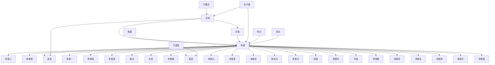

# 人物与关系图：《高武纪元.txt》

## 人物表

### 1. 李源

- 出现次数：6907
- 覆盖章节数：683
- 首次出现：第 1 章
- 最后出现：第 687 章
- 身份/行为线索：姓名候选(6135)、人物行为/发言(772)

### 2. 李源心

- 出现次数：1785
- 覆盖章节数：563
- 首次出现：第 1 章
- 最后出现：第 687 章
- 身份/行为线索：姓名候选(1785)

### 3. 李源暗

- 出现次数：1509
- 覆盖章节数：478
- 首次出现：第 2 章
- 最后出现：第 687 章
- 身份/行为线索：姓名候选(1509)

### 4. 李源一

- 出现次数：733
- 覆盖章节数：421
- 首次出现：第 1 章
- 最后出现：第 687 章
- 身份/行为线索：姓名候选(733)

### 5. 毕竟

- 出现次数：559
- 覆盖章节数：343
- 首次出现：第 5 章
- 最后出现：第 686 章
- 身份/行为线索：姓名候选(559)

### 6. 武者

- 出现次数：1563
- 覆盖章节数：329
- 首次出现：第 1 章
- 最后出现：第 575 章
- 身份/行为线索：姓名候选(1563)

### 7. 李源眼

- 出现次数：418
- 覆盖章节数：295
- 首次出现：第 1 章
- 最后出现：第 679 章
- 身份/行为线索：姓名候选(418)

### 8. 李源点

- 出现次数：497
- 覆盖章节数：289
- 首次出现：第 3 章
- 最后出现：第 687 章
- 身份/行为线索：姓名候选(497)

### 9. 时间流

- 出现次数：405
- 覆盖章节数：284
- 首次出现：第 9 章
- 最后出现：第 675 章
- 身份/行为线索：姓名候选(405)

### 10. 李源笑

- 出现次数：624
- 覆盖章节数：283
- 首次出现：第 1 章
- 最后出现：第 687 章
- 身份/行为线索：姓名候选(623)、人物行为/发言(1)

### 11. 李源已

- 出现次数：362
- 覆盖章节数：257
- 首次出现：第 4 章
- 最后出现：第 684 章
- 身份/行为线索：姓名候选(362)

### 12. 李源道

- 出现次数：536
- 覆盖章节数：248
- 首次出现：第 5 章
- 最后出现：第 687 章
- 身份/行为线索：姓名候选(536)

### 13. 文明

- 出现次数：857
- 覆盖章节数：225
- 首次出现：第 8 章
- 最后出现：第 673 章
- 身份/行为线索：姓名候选(857)

### 14. 李源在

- 出现次数：281
- 覆盖章节数：215
- 首次出现：第 2 章
- 最后出现：第 687 章
- 身份/行为线索：姓名候选(281)

### 15. 李源身

- 出现次数：296
- 覆盖章节数：211
- 首次出现：第 1 章
- 最后出现：第 666 章
- 身份/行为线索：姓名候选(296)

### 16. 危险

- 出现次数：366
- 覆盖章节数：203
- 首次出现：第 8 章
- 最后出现：第 686 章
- 身份/行为线索：姓名候选(366)

### 17. 东方极

- 出现次数：1605
- 覆盖章节数：199
- 首次出现：第 11 章
- 最后出现：第 686 章
- 身份/行为线索：姓名候选(1548)、人物行为/发言(57)

### 18. 水准

- 出现次数：308
- 覆盖章节数：194
- 首次出现：第 2 章
- 最后出现：第 685 章
- 身份/行为线索：姓名候选(308)

### 19. 李源看

- 出现次数：248
- 覆盖章节数：193
- 首次出现：第 7 章
- 最后出现：第 686 章
- 身份/行为线索：姓名候选(248)

### 20. 李源所

- 出现次数：239
- 覆盖章节数：193
- 首次出现：第 1 章
- 最后出现：第 683 章
- 身份/行为线索：姓名候选(239)

### 21. 李源自

- 出现次数：228
- 覆盖章节数：186
- 首次出现：第 8 章
- 最后出现：第 686 章
- 身份/行为线索：姓名候选(228)

### 22. 李源摇

- 出现次数：217
- 覆盖章节数：169
- 首次出现：第 5 章
- 最后出现：第 681 章
- 身份/行为线索：姓名候选(217)

### 23. 方面

- 出现次数：220
- 覆盖章节数：162
- 首次出现：第 18 章
- 最后出现：第 686 章
- 身份/行为线索：姓名候选(220)

### 24. 李源能

- 出现次数：185
- 覆盖章节数：151
- 首次出现：第 1 章
- 最后出现：第 686 章
- 身份/行为线索：姓名候选(185)

### 25. 李源没

- 出现次数：178
- 覆盖章节数：149
- 首次出现：第 5 章
- 最后出现：第 670 章
- 身份/行为线索：姓名候选(178)

### 26. 李源忍

- 出现次数：208
- 覆盖章节数：146
- 首次出现：第 5 章
- 最后出现：第 685 章
- 身份/行为线索：姓名候选(208)

### 27. 时间内

- 出现次数：195
- 覆盖章节数：146
- 首次出现：第 10 章
- 最后出现：第 684 章
- 身份/行为线索：姓名候选(195)

### 28. 李源脑

- 出现次数：180
- 覆盖章节数：143
- 首次出现：第 6 章
- 最后出现：第 681 章
- 身份/行为线索：姓名候选(180)

### 29. 李源手

- 出现次数：181
- 覆盖章节数：138
- 首次出现：第 4 章
- 最后出现：第 684 章
- 身份/行为线索：姓名候选(181)

### 30. 李源如

- 出现次数：180
- 覆盖章节数：137
- 首次出现：第 13 章
- 最后出现：第 677 章
- 身份/行为线索：姓名候选(180)

### 31. 李源露

- 出现次数：173
- 覆盖章节数：134
- 首次出现：第 25 章
- 最后出现：第 687 章
- 身份/行为线索：姓名候选(173)

### 32. 李源有

- 出现次数：152
- 覆盖章节数：134
- 首次出现：第 9 章
- 最后出现：第 670 章
- 身份/行为线索：姓名候选(152)

### 33. 李源直

- 出现次数：176
- 覆盖章节数：133
- 首次出现：第 19 章
- 最后出现：第 685 章
- 身份/行为线索：姓名候选(176)

### 34. 任何一

- 出现次数：166
- 覆盖章节数：133
- 首次出现：第 5 章
- 最后出现：第 687 章
- 身份/行为线索：姓名候选(166)

### 35. 李源只

- 出现次数：172
- 覆盖章节数：132
- 首次出现：第 1 章
- 最后出现：第 679 章
- 身份/行为线索：姓名候选(172)

### 36. 郑重道

- 出现次数：175
- 覆盖章节数：131
- 首次出现：第 25 章
- 最后出现：第 678 章
- 身份/行为线索：姓名候选(175)

### 37. 许多

- 出现次数：146
- 覆盖章节数：130
- 首次出现：第 1 章
- 最后出现：第 677 章
- 身份/行为线索：姓名候选(146)

### 38. 宫面板

- 出现次数：195
- 覆盖章节数：129
- 首次出现：第 3 章
- 最后出现：第 601 章
- 身份/行为线索：姓名候选(195)

### 39. 段时间

- 出现次数：166
- 覆盖章节数：128
- 首次出现：第 6 章
- 最后出现：第 681 章
- 身份/行为线索：姓名候选(166)

### 40. 成天神

- 出现次数：318
- 覆盖章节数：124
- 首次出现：第 325 章
- 最后出现：第 683 章
- 身份/行为线索：姓名候选(318)

### 41. 方海

- 出现次数：452
- 覆盖章节数：123
- 首次出现：第 85 章
- 最后出现：第 650 章
- 身份/行为线索：姓名候选(368)、人物行为/发言(84)

### 42. 程度

- 出现次数：161
- 覆盖章节数：123
- 首次出现：第 1 章
- 最后出现：第 685 章
- 身份/行为线索：姓名候选(161)

### 43. 李源想

- 出现次数：137
- 覆盖章节数：123
- 首次出现：第 8 章
- 最后出现：第 684 章
- 身份/行为线索：姓名候选(137)

### 44. 李源并

- 出现次数：136
- 覆盖章节数：122
- 首次出现：第 4 章
- 最后出现：第 684 章
- 身份/行为线索：姓名候选(136)

### 45. 许久

- 出现次数：144
- 覆盖章节数：121
- 首次出现：第 9 章
- 最后出现：第 686 章
- 身份/行为线索：姓名候选(144)

### 46. 柳冰

- 出现次数：366
- 覆盖章节数：115
- 首次出现：第 327 章
- 最后出现：第 686 章
- 身份/行为线索：姓名候选(327)、人物行为/发言(39)

### 47. 容易

- 出现次数：133
- 覆盖章节数：115
- 首次出现：第 5 章
- 最后出现：第 686 章
- 身份/行为线索：姓名候选(133)

### 48. 施展

- 出现次数：170
- 覆盖章节数：114
- 首次出现：第 13 章
- 最后出现：第 684 章
- 身份/行为线索：姓名候选(170)

### 49. 成半神

- 出现次数：206
- 覆盖章节数：113
- 首次出现：第 223 章
- 最后出现：第 603 章
- 身份/行为线索：姓名候选(206)

### 50. 范围

- 出现次数：161
- 覆盖章节数：113
- 首次出现：第 2 章
- 最后出现：第 684 章
- 身份/行为线索：姓名候选(161)

### 51. 成员

- 出现次数：319
- 覆盖章节数：112
- 首次出现：第 25 章
- 最后出现：第 679 章
- 身份/行为线索：姓名候选(319)

### 52. 武道室

- 出现次数：264
- 覆盖章节数：112
- 首次出现：第 5 章
- 最后出现：第 574 章
- 身份/行为线索：姓名候选(264)

### 53. 武道大

- 出现次数：279
- 覆盖章节数：111
- 首次出现：第 1 章
- 最后出现：第 574 章
- 身份/行为线索：姓名候选(279)

### 54. 段圆满

- 出现次数：185
- 覆盖章节数：111
- 首次出现：第 39 章
- 最后出现：第 601 章
- 身份/行为线索：姓名候选(185)

### 55. 李源听

- 出现次数：162
- 覆盖章节数：111
- 首次出现：第 3 章
- 最后出现：第 676 章
- 身份/行为线索：姓名候选(162)

### 56. 李源目

- 出现次数：132
- 覆盖章节数：111
- 首次出现：第 4 章
- 最后出现：第 684 章
- 身份/行为线索：姓名候选(132)

### 57. 成功

- 出现次数：148
- 覆盖章节数：108
- 首次出现：第 1 章
- 最后出现：第 681 章
- 身份/行为线索：姓名候选(148)

### 58. 施展出

- 出现次数：144
- 覆盖章节数：106
- 首次出现：第 44 章
- 最后出现：第 684 章
- 身份/行为线索：姓名候选(144)

### 59. 明墟星

- 出现次数：370
- 覆盖章节数：104
- 首次出现：第 130 章
- 最后出现：第 521 章
- 身份/行为线索：姓名候选(370)

### 60. 李源明

- 出现次数：118
- 覆盖章节数：102
- 首次出现：第 4 章
- 最后出现：第 649 章
- 身份/行为线索：姓名候选(118)

### 61. 万魔文

- 出现次数：731
- 覆盖章节数：100
- 首次出现：第 243 章
- 最后出现：第 575 章
- 身份/行为线索：姓名候选(731)

### 62. 权限

- 出现次数：188
- 覆盖章节数：100
- 首次出现：第 3 章
- 最后出现：第 685 章
- 身份/行为线索：姓名候选(188)

### 63. 时后

- 出现次数：121
- 覆盖章节数：100
- 首次出现：第 6 章
- 最后出现：第 645 章
- 身份/行为线索：姓名候选(121)

### 64. 林岚月

- 出现次数：845
- 覆盖章节数：99
- 首次出现：第 3 章
- 最后出现：第 650 章
- 身份/行为线索：姓名候选(805)、人物行为/发言(40)

### 65. 李源眸

- 出现次数：120
- 覆盖章节数：99
- 首次出现：第 22 章
- 最后出现：第 683 章
- 身份/行为线索：姓名候选(120)

### 66. 李源面

- 出现次数：116
- 覆盖章节数：99
- 首次出现：第 6 章
- 最后出现：第 687 章
- 身份/行为线索：姓名候选(116)

### 67. 成神王

- 出现次数：230
- 覆盖章节数：98
- 首次出现：第 471 章
- 最后出现：第 686 章
- 身份/行为线索：姓名候选(230)

### 68. 成飞天

- 出现次数：180
- 覆盖章节数：98
- 首次出现：第 57 章
- 最后出现：第 574 章
- 身份/行为线索：姓名候选(180)

### 69. 师兄

- 出现次数：259
- 覆盖章节数：97
- 首次出现：第 56 章
- 最后出现：第 687 章
- 身份/行为线索：姓名候选(258)、人物行为/发言(1)

### 70. 武道天

- 出现次数：153
- 覆盖章节数：97
- 首次出现：第 1 章
- 最后出现：第 574 章
- 身份/行为线索：姓名候选(153)

### 71. 相比

- 出现次数：118
- 覆盖章节数：97
- 首次出现：第 1 章
- 最后出现：第 680 章
- 身份/行为线索：姓名候选(118)

### 72. 段高阶

- 出现次数：166
- 覆盖章节数：96
- 首次出现：第 54 章
- 最后出现：第 588 章
- 身份/行为线索：姓名候选(166)

### 73. 李源呢

- 出现次数：110
- 覆盖章节数：96
- 首次出现：第 40 章
- 最后出现：第 684 章
- 身份/行为线索：姓名候选(110)

### 74. 李源连

- 出现次数：118
- 覆盖章节数：95
- 首次出现：第 11 章
- 最后出现：第 681 章
- 身份/行为线索：姓名候选(112)、人物行为/发言(6)

### 75. 任务

- 出现次数：213
- 覆盖章节数：94
- 首次出现：第 34 章
- 最后出现：第 633 章
- 身份/行为线索：姓名候选(213)

### 76. 步速度

- 出现次数：124
- 覆盖章节数：94
- 首次出现：第 1 章
- 最后出现：第 678 章
- 身份/行为线索：姓名候选(124)

### 77. 李源实

- 出现次数：105
- 覆盖章节数：94
- 首次出现：第 45 章
- 最后出现：第 682 章
- 身份/行为线索：姓名候选(105)

### 78. 李源神

- 出现次数：205
- 覆盖章节数：93
- 首次出现：第 106 章
- 最后出现：第 685 章
- 身份/行为线索：姓名候选(205)

### 79. 常情况

- 出现次数：107
- 覆盖章节数：93
- 首次出现：第 26 章
- 最后出现：第 657 章
- 身份/行为线索：姓名候选(107)

### 80. 应该能

- 出现次数：95
- 覆盖章节数：93
- 首次出现：第 3 章
- 最后出现：第 685 章
- 身份/行为线索：姓名候选(95)

### 81. 庞大

- 出现次数：108
- 覆盖章节数：92
- 首次出现：第 61 章
- 最后出现：第 682 章
- 身份/行为线索：姓名候选(108)

### 82. 李源来

- 出现次数：113
- 覆盖章节数：91
- 首次出现：第 9 章
- 最后出现：第 677 章
- 身份/行为线索：姓名候选(113)

### 83. 越往后

- 出现次数：108
- 覆盖章节数：91
- 首次出现：第 9 章
- 最后出现：第 631 章
- 身份/行为线索：姓名候选(108)

### 84. 李源瞬

- 出现次数：97
- 覆盖章节数：91
- 首次出现：第 8 章
- 最后出现：第 677 章
- 身份/行为线索：姓名候选(97)

### 85. 成真神

- 出现次数：173
- 覆盖章节数：90
- 首次出现：第 325 章
- 最后出现：第 660 章
- 身份/行为线索：姓名候选(173)

### 86. 李源立

- 出现次数：111
- 覆盖章节数：90
- 首次出现：第 4 章
- 最后出现：第 677 章
- 身份/行为线索：姓名候选(111)

### 87. 李源思

- 出现次数：106
- 覆盖章节数：89
- 首次出现：第 1 章
- 最后出现：第 684 章
- 身份/行为线索：姓名候选(106)

### 88. 许多人

- 出现次数：124
- 覆盖章节数：88
- 首次出现：第 2 章
- 最后出现：第 662 章
- 身份/行为线索：姓名候选(124)

### 89. 李源疑

- 出现次数：108
- 覆盖章节数：88
- 首次出现：第 5 章
- 最后出现：第 685 章
- 身份/行为线索：姓名候选(108)

### 90. 李源愣

- 出现次数：100
- 覆盖章节数：88
- 首次出现：第 17 章
- 最后出现：第 647 章
- 身份/行为线索：姓名候选(100)

### 91. 万蓝星

- 出现次数：288
- 覆盖章节数：87
- 首次出现：第 5 章
- 最后出现：第 273 章
- 身份/行为线索：姓名候选(288)

### 92. 段技艺

- 出现次数：166
- 覆盖章节数：86
- 首次出现：第 37 章
- 最后出现：第 459 章
- 身份/行为线索：姓名候选(166)

### 93. 幸好

- 出现次数：96
- 覆盖章节数：86
- 首次出现：第 1 章
- 最后出现：第 669 章
- 身份/行为线索：姓名候选(96)

### 94. 李源刚

- 出现次数：93
- 覆盖章节数：86
- 首次出现：第 6 章
- 最后出现：第 679 章
- 身份/行为线索：姓名候选(93)

### 95. 李源却

- 出现次数：92
- 覆盖章节数：86
- 首次出现：第 4 章
- 最后出现：第 676 章
- 身份/行为线索：姓名候选(91)、人物行为/发言(1)

### 96. 关键

- 出现次数：90
- 覆盖章节数：86
- 首次出现：第 13 章
- 最后出现：第 670 章
- 身份/行为线索：姓名候选(90)

### 97. 李源默

- 出现次数：100
- 覆盖章节数：85
- 首次出现：第 8 章
- 最后出现：第 679 章
- 身份/行为线索：姓名候选(100)

### 98. 王兵器

- 出现次数：243
- 覆盖章节数：84
- 首次出现：第 530 章
- 最后出现：第 687 章
- 身份/行为线索：姓名候选(243)

### 99. 李源聆

- 出现次数：106
- 覆盖章节数：84
- 首次出现：第 25 章
- 最后出现：第 681 章
- 身份/行为线索：姓名候选(106)

### 100. 李源若

- 出现次数：95
- 覆盖章节数：84
- 首次出现：第 10 章
- 最后出现：第 685 章
- 身份/行为线索：姓名候选(95)

## 关系边

- 李源 <-> 李源心：共现 1594 次，覆盖第 1-687 章，关系线索：同章共现(1540)、老师(28)、师尊(9)、对手(5)、追杀(5)、弟子(3)、敌人(2)、学生(2)
- 李源 <-> 李源暗：共现 1460 次，覆盖第 2-687 章，关系线索：同章共现(1380)、老师(21)、弟子(14)、学生(12)、师尊(10)、敌人(7)、对手(6)、保护(5)
- 文明 <-> 李源：共现 837 次，覆盖第 8-674 章，关系线索：同章共现(784)、老师(19)、追杀(7)、命令(6)、敌人(6)、保护(5)、师尊(5)、弟子(3)
- 万魔文 <-> 文明：共现 727 次，覆盖第 243-638 章，关系线索：同章共现(676)、老师(16)、命令(9)、敌人(8)、追杀(4)、交易(3)、对手(3)、师尊(2)
- 李源 <-> 武者：共现 709 次，覆盖第 1-537 章，关系线索：同章共现(660)、老师(19)、学生(9)、敌人(4)、保护(4)、命令(4)、追杀(3)、队长(2)
- 李源 <-> 李源一：共现 646 次，覆盖第 1-687 章，关系线索：同章共现(616)、老师(8)、学生(7)、保护(5)、弟子(4)、追杀(3)、对手(2)、命令(2)
- 施展 <-> 李源：共现 560 次，覆盖第 12-684 章，关系线索：同章共现(542)、敌人(5)、老师(4)、追杀(3)、对手(2)、学生(1)、弟子(1)、合作(1)
- 李源 <-> 李源笑：共现 559 次，覆盖第 1-687 章，关系线索：同章共现(516)、老师(24)、学生(5)、兄弟(4)、弟子(3)、保护(2)、对手(2)、交易(1)
- 李源 <-> 李源道：共现 483 次，覆盖第 5-687 章，关系线索：同章共现(439)、老师(17)、命令(7)、敌人(6)、弟子(5)、保护(4)、追杀(4)、师尊(3)
- 李源 <-> 柳冰：共现 468 次，覆盖第 327-686 章，关系线索：同章共现(452)、追杀(2)、老师(2)、交易(2)、保护(1)、命令(1)、父亲(1)、朋友(1)
- 方海 <-> 李源：共现 440 次，覆盖第 164-650 章，关系线索：同章共现(390)、老师(27)、师尊(8)、命令(7)、对手(3)、保护(2)、弟子(2)、追杀(2)
- 李源 <-> 许多：共现 419 次，覆盖第 2-680 章，关系线索：同章共现(383)、学生(19)、老师(6)、敌人(3)、弟子(3)、对手(2)、队长(1)、师尊(1)
- 李源 <-> 李源眼：共现 396 次，覆盖第 1-679 章，关系线索：同章共现(378)、老师(5)、师尊(3)、敌人(2)、对手(2)、父亲(1)、追杀(1)、学生(1)
- 李源 <-> 蓝星：共现 345 次，覆盖第 5-673 章，关系线索：同章共现(330)、老师(5)、学生(5)、命令(2)、母亲(1)、对手(1)、保护(1)
- 东方极 <-> 李源：共现 344 次，覆盖第 16-686 章，关系线索：同章共现(330)、命令(5)、师尊(4)、保护(2)、老师(2)、弟子(2)、兄弟(1)、敌人(1)
- 李源 <-> 李源已：共现 340 次，覆盖第 4-684 章，关系线索：同章共现(330)、老师(4)、学生(2)、朋友(1)、对手(1)、队长(1)、弟子(1)、敌人(1)
- 师兄 <-> 李源：共现 328 次，覆盖第 82-687 章，关系线索：同章共现(306)、学生(8)、弟子(6)、兄弟(3)、师尊(3)、父亲(2)、姐妹(1)、命令(1)
- 李源 <-> 李源身：共现 305 次，覆盖第 1-666 章，关系线索：同章共现(291)、学生(5)、追杀(2)、对手(2)、老师(1)、弟子(1)、兄弟(1)、妻子(1)
- 文明 <-> 武者：共现 296 次，覆盖第 6-574 章，关系线索：同章共现(272)、老师(5)、保护(5)、对手(3)、追杀(3)、命令(3)、敌人(3)、交易(2)
- 李源 <-> 李源在：共现 290 次，覆盖第 2-687 章，关系线索：同章共现(281)、学生(3)、弟子(2)、老师(1)、师尊(1)、保护(1)、命令(1)
- 李源 <-> 林岚月：共现 274 次，覆盖第 17-650 章，关系线索：同章共现(250)、学生(8)、老师(8)、师尊(3)、弟子(3)、对手(2)、朋友(2)、命令(1)
- 李源 <-> 李源点：共现 272 次，覆盖第 3-687 章，关系线索：同章共现(247)、老师(14)、弟子(5)、师尊(4)、命令(1)、学生(1)、朋友(1)
- 李源 <-> 武殿：共现 272 次，覆盖第 6-490 章，关系线索：同章共现(255)、老师(10)、学生(4)、合作(1)、师尊(1)、对手(1)
- 万蓝星 <-> 蓝星：共现 270 次，覆盖第 5-273 章，关系线索：同章共现(256)、学生(8)、老师(5)、交易(1)
- 李源 <-> 李源所：共现 251 次，覆盖第 1-683 章，关系线索：同章共现(247)、老师(1)、学生(1)、朋友(1)、盟友(1)
- 东方极 <-> 文明：共现 242 次，覆盖第 11-650 章，关系线索：同章共现(231)、师尊(2)、老师(2)、弟子(2)、命令(1)、背叛(1)、对手(1)、保护(1)
- 李源 <-> 毕竟：共现 236 次，覆盖第 8-683 章，关系线索：同章共现(223)、弟子(4)、追杀(3)、敌人(3)、老师(2)、师尊(1)
- 文明 <-> 方海：共现 235 次，覆盖第 221-650 章，关系线索：同章共现(193)、老师(35)、命令(2)、弟子(2)、师尊(1)、对手(1)、追杀(1)
- 李源 <-> 李源看：共现 233 次，覆盖第 7-686 章，关系线索：同章共现(217)、老师(11)、学生(2)、追杀(2)、朋友(1)、弟子(1)、同伴(1)、命令(1)
- 李源 <-> 李源忍：共现 206 次，覆盖第 5-685 章，关系线索：同章共现(179)、老师(15)、师尊(7)、学生(2)、弟子(2)、同伴(1)
- 李源 <-> 李源自：共现 206 次，覆盖第 8-686 章，关系线索：同章共现(199)、保护(2)、老师(1)、学生(1)、对手(1)、弟子(1)、交易(1)
- 李源 <-> 李源神：共现 193 次，覆盖第 106-685 章，关系线索：同章共现(183)、老师(4)、交易(3)、命令(2)、兄弟(1)
- 李源 <-> 李源手：共现 189 次，覆盖第 4-684 章，关系线索：同章共现(183)、老师(2)、队长(1)、敌人(1)、朋友(1)、追杀(1)
- 成长 <-> 李源：共现 186 次，覆盖第 10-686 章，关系线索：同章共现(177)、老师(4)、保护(2)、学生(1)、师尊(1)、弟子(1)
- 李源 <-> 李源摇：共现 183 次，覆盖第 5-681 章，关系线索：同章共现(169)、老师(9)、对手(1)、队长(1)、弟子(1)、学生(1)、追杀(1)、师尊(1)
- 李源 <-> 李源能：共现 180 次，覆盖第 1-686 章，关系线索：同章共现(173)、学生(2)、老师(2)、保护(1)、敌人(1)、师尊(1)
- 李源 <-> 李源脑：共现 180 次，覆盖第 6-681 章，关系线索：同章共现(169)、老师(5)、弟子(4)、父亲(2)
- 李源 <-> 李源如：共现 179 次，覆盖第 13-677 章，关系线索：同章共现(174)、弟子(2)、学生(1)、敌人(1)、师尊(1)
- 庞大 <-> 李源：共现 173 次，覆盖第 76-687 章，关系线索：同章共现(169)、老师(2)、保护(1)、儿子(1)
- 方面 <-> 李源：共现 172 次，覆盖第 23-686 章，关系线索：同章共现(168)、保护(3)、学生(1)
- 李源 <-> 李源只：共现 171 次，覆盖第 1-679 章，关系线索：同章共现(162)、老师(4)、学生(3)、命令(1)、兄弟(1)、师尊(1)、弟子(1)
- 施展 <-> 施展出：共现 171 次，覆盖第 44-684 章，关系线索：同章共现(167)、老师(1)、弟子(1)、命令(1)、追杀(1)
- 李源 <-> 李源直：共现 166 次，覆盖第 19-685 章，关系线索：同章共现(159)、命令(2)、弟子(2)、老师(1)、母亲(1)、保护(1)、师尊(1)
- 李源 <-> 武大：共现 166 次，覆盖第 61-603 章，关系线索：同章共现(121)、学生(36)、老师(4)、对手(2)、妻子(2)、保护(1)、命令(1)
- 李源 <-> 李源露：共现 164 次，覆盖第 25-687 章，关系线索：同章共现(157)、对手(2)、敌人(2)、弟子(1)、学生(1)、师尊(1)
- 李源 <-> 高层：共现 164 次，覆盖第 27-671 章，关系线索：同章共现(155)、命令(3)、敌人(2)、追杀(2)、师尊(1)、老师(1)
- 文明 <-> 高层：共现 164 次，覆盖第 114-601 章，关系线索：同章共现(154)、命令(6)、合作(1)、追杀(1)、敌人(1)、老师(1)
- 宫殿 <-> 李源：共现 162 次，覆盖第 178-684 章，关系线索：同章共现(158)、命令(1)、老师(1)、弟子(1)、师尊(1)
- 万魔文 <-> 李源：共现 162 次，覆盖第 261-511 章，关系线索：同章共现(148)、老师(6)、追杀(3)、敌人(2)、命令(2)、弟子(1)、同伴(1)
- 李源 <-> 水准：共现 161 次，覆盖第 3-676 章，关系线索：同章共现(150)、老师(5)、学生(2)、对手(2)、追杀(1)、敌人(1)
- 危险 <-> 李源：共现 156 次，覆盖第 8-687 章，关系线索：同章共现(150)、保护(2)、妻子(1)、学生(1)、老师(1)、追杀(1)
- 李源 <-> 李源有：共现 152 次，覆盖第 9-670 章，关系线索：同章共现(145)、学生(2)、老师(1)、追杀(1)、朋友(1)、对手(1)、保护(1)
- 文明 <-> 文明内：共现 151 次，覆盖第 145-650 章，关系线索：同章共现(142)、老师(2)、敌人(2)、命令(2)、弟子(2)、交易(1)
- 李源 <-> 程度：共现 150 次，覆盖第 1-685 章，关系线索：同章共现(145)、老师(2)、对手(2)、学生(1)、追杀(1)
- 宫面板 <-> 李源：共现 146 次，覆盖第 3-601 章，关系线索：同章共现(144)、学生(1)、追杀(1)
- 李源 <-> 李源没：共现 146 次，覆盖第 11-670 章，关系线索：同章共现(140)、追杀(2)、老师(1)、学生(1)、敌人(1)、命令(1)
- 权限 <-> 李源：共现 141 次，覆盖第 6-676 章，关系线索：同章共现(134)、弟子(3)、师尊(2)、学生(1)、父亲(1)、追杀(1)
- 万道神 <-> 李源：共现 141 次，覆盖第 393-678 章，关系线索：同章共现(129)、追杀(4)、命令(3)、父亲(2)、师尊(2)、敌人(1)
- 成员 <-> 李源：共现 140 次，覆盖第 34-679 章，关系线索：同章共现(135)、弟子(2)、师尊(1)、学生(1)、兄弟(1)
- 李源 <-> 范围：共现 138 次，覆盖第 1-684 章，关系线索：同章共现(130)、学生(2)、追杀(1)、保护(1)、父亲(1)、命令(1)、对手(1)、师尊(1)
- 东方极 <-> 方海：共现 136 次，覆盖第 150-656 章，关系线索：同章共现(122)、弟子(6)、老师(4)、师尊(2)、保护(2)、命令(2)、兄弟(1)
- 文明 <-> 许多：共现 134 次，覆盖第 115-658 章，关系线索：同章共现(128)、保护(2)、老师(2)、师尊(1)、敌人(1)、妻子(1)
- 李源 <-> 李源想：共现 132 次，覆盖第 8-684 章，关系线索：同章共现(122)、老师(4)、学生(1)、对手(1)、追杀(1)、父亲(1)、朋友(1)、师尊(1)
- 李源 <-> 李源目：共现 130 次，覆盖第 4-684 章，关系线索：同章共现(127)、学生(2)、老师(1)
- 李源 <-> 相比：共现 129 次，覆盖第 1-682 章，关系线索：同章共现(124)、学生(1)、队长(1)、老师(1)、对手(1)、师尊(1)
- 李源 <-> 李源并：共现 129 次，覆盖第 4-684 章，关系线索：同章共现(123)、老师(2)、追杀(2)、学生(1)、上司(1)、命令(1)
- 明墟星 <-> 李源：共现 126 次，覆盖第 152-521 章，关系线索：同章共现(122)、老师(3)、师尊(1)、学生(1)
- 李源 <-> 李源意：共现 121 次，覆盖第 10-675 章，关系线索：同章共现(120)、对手(1)
- 许多 <-> 许多人：共现 119 次，覆盖第 2-662 章，关系线索：同章共现(110)、学生(3)、妻子(2)、老师(1)、对手(1)、保护(1)、命令(1)
- 李源 <-> 相信：共现 119 次，覆盖第 6-683 章，关系线索：同章共现(112)、老师(3)、保护(2)、父亲(1)、兄弟(1)
- 李源 <-> 李源眸：共现 119 次，覆盖第 22-683 章，关系线索：同章共现(114)、老师(2)、命令(1)、对手(1)、学生(1)
- 武者 <-> 许多：共现 117 次，覆盖第 35-575 章，关系线索：同章共现(112)、妻子(2)、队长(1)、同伴(1)、对手(1)、保护(1)
- 施展出 <-> 李源：共现 117 次，覆盖第 44-684 章，关系线索：同章共现(114)、老师(1)、弟子(1)、追杀(1)
- 任务 <-> 李源：共现 116 次，覆盖第 12-646 章，关系线索：同章共现(108)、命令(3)、老师(2)、敌人(2)、保护(2)、合作(1)
- 李源 <-> 李源面：共现 110 次，覆盖第 6-687 章，关系线索：同章共现(107)、队长(1)、对手(1)、保护(1)
- 李源 <-> 李源实：共现 108 次，覆盖第 45-682 章，关系线索：同章共现(104)、老师(2)、保护(1)、弟子(1)
- 李源 <-> 李源来：共现 107 次，覆盖第 9-677 章，关系线索：同章共现(103)、老师(2)、学生(1)、兄弟(1)
- 成功 <-> 李源：共现 106 次，覆盖第 7-658 章，关系线索：同章共现(104)、学生(1)、师尊(1)
- 成飞天 <-> 武者：共现 106 次，覆盖第 57-574 章，关系线索：同章共现(100)、父亲(2)、老师(2)、母亲(1)、妻子(1)、保护(1)、女儿(1)
- 李源 <-> 武道室：共现 105 次，覆盖第 5-574 章，关系线索：同章共现(99)、老师(5)、命令(1)
- 李源 <-> 李源连：共现 100 次，覆盖第 11-681 章，关系线索：同章共现(91)、老师(6)、弟子(2)、师尊(2)
- 万蓝星 <-> 李源：共现 97 次，覆盖第 5-207 章，关系线索：同章共现(92)、老师(3)、学生(2)
- 容易 <-> 李源：共现 97 次，覆盖第 6-677 章，关系线索：同章共现(91)、对手(3)、老师(2)、敌人(2)、弟子(1)
- 成天神 <-> 李源：共现 97 次，覆盖第 343-679 章，关系线索：同章共现(87)、弟子(3)、老师(2)、师尊(2)、保护(1)、追杀(1)、父亲(1)
- 李源 <-> 李源思：共现 95 次，覆盖第 1-684 章，关系线索：同章共现(90)、老师(2)、学生(2)、追杀(1)
- 李源 <-> 李源瞬：共现 92 次，覆盖第 8-677 章，关系线索：同章共现(89)、老师(1)、对手(1)、保护(1)
- 李源 <-> 李源刚：共现 91 次，覆盖第 11-679 章，关系线索：同章共现(89)、学生(1)、敌人(1)
- 武殿 <-> 武者：共现 91 次，覆盖第 12-373 章，关系线索：同章共现(84)、学生(3)、队长(2)、老师(1)、父亲(1)
- 李源 <-> 李源低：共现 88 次，覆盖第 7-681 章，关系线索：同章共现(80)、老师(3)、师尊(3)、弟子(2)、敌人(1)
- 时间流 <-> 李源：共现 87 次，覆盖第 58-660 章，关系线索：同章共现(87)
- 李源 <-> 李源立：共现 86 次，覆盖第 4-677 章，关系线索：同章共现(80)、老师(3)、弟子(2)、对手(1)、师尊(1)
- 李源 <-> 段时间：共现 84 次，覆盖第 6-681 章，关系线索：同章共现(80)、老师(2)、学生(1)、命令(1)、保护(1)
- 李源 <-> 李源呢：共现 84 次，覆盖第 40-656 章，关系线索：同章共现(79)、追杀(2)、老师(2)、对手(1)
- 李源 <-> 李源明：共现 83 次，覆盖第 6-649 章，关系线索：同章共现(81)、对手(2)
- 李源 <-> 武道大：共现 82 次，覆盖第 1-335 章，关系线索：同章共现(62)、学生(15)、老师(4)、命令(1)
- 李源 <-> 李源疑：共现 82 次，覆盖第 25-685 章，关系线索：同章共现(72)、老师(5)、弟子(2)、师尊(2)、敌人(1)
- 东方极 <-> 柳冰：共现 82 次，覆盖第 367-681 章，关系线索：同章共现(79)、追杀(1)、敌人(1)、老师(1)
- 李源 <-> 李源回：共现 81 次，覆盖第 3-686 章，关系线索：同章共现(77)、老师(2)、队长(1)、师尊(1)
- 李源 <-> 李源忽：共现 81 次，覆盖第 7-676 章，关系线索：同章共现(77)、老师(2)、学生(1)、弟子(1)、师尊(1)
- 李源 <-> 李源终：共现 81 次，覆盖第 31-678 章，关系线索：同章共现(77)、老师(1)、弟子(1)、追杀(1)、命令(1)
- 文明 <-> 明墟星：共现 80 次，覆盖第 152-479 章，关系线索：同章共现(78)、老师(2)
- 关键 <-> 李源：共现 79 次，覆盖第 3-680 章，关系线索：同章共现(75)、敌人(2)、保护(1)、老师(1)
- 李源 <-> 李源默：共现 79 次，覆盖第 9-679 章，关系线索：同章共现(79)
- 李源 <-> 李源听：共现 78 次，覆盖第 3-640 章，关系线索：同章共现(73)、老师(2)、学生(1)、弟子(1)、师尊(1)
- 李源 <-> 李源若：共现 77 次，覆盖第 10-680 章，关系线索：同章共现(72)、老师(3)、弟子(1)、师尊(1)
- 文明 <-> 毕竟：共现 75 次，覆盖第 69-574 章，关系线索：同章共现(68)、背叛(1)、命令(1)、老师(1)、弟子(1)、敌人(1)、交易(1)、追杀(1)
- 李源 <-> 李源却：共现 74 次，覆盖第 4-676 章，关系线索：同章共现(70)、老师(2)、弟子(2)
- 李源 <-> 李源愣：共现 72 次，覆盖第 17-647 章，关系线索：同章共现(67)、老师(2)、队长(1)、追杀(1)、命令(1)
- 李源暗 <-> 武者：共现 70 次，覆盖第 20-485 章，关系线索：同章共现(67)、老师(3)
- 李源 <-> 王兵器：共现 70 次，覆盖第 530-687 章，关系线索：同章共现(69)、弟子(1)
- 成飞天 <-> 李源：共现 68 次，覆盖第 110-485 章，关系线索：同章共现(66)、老师(2)、学生(1)
- 万魔文 <-> 方海：共现 67 次，覆盖第 261-490 章，关系线索：同章共现(56)、老师(11)
- 成半神 <-> 李源：共现 67 次，覆盖第 280-575 章，关系线索：同章共现(63)、老师(2)、敌人(1)、师尊(1)
- 李源 <-> 郑重道：共现 65 次，覆盖第 33-637 章，关系线索：同章共现(50)、老师(4)、学生(3)、弟子(2)、保护(2)、敌人(2)、父亲(1)、命令(1)
- 时间内 <-> 李源：共现 65 次，覆盖第 63-660 章，关系线索：同章共现(64)、对手(1)
- 李源 <-> 许久：共现 64 次，覆盖第 78-662 章，关系线索：同章共现(61)、对手(1)、追杀(1)、老师(1)
- 李源 <-> 段圆满：共现 63 次，覆盖第 42-588 章，关系线索：同章共现(62)、学生(1)
- 安全 <-> 李源：共现 62 次，覆盖第 9-671 章，关系线索：同章共现(56)、命令(2)、老师(2)、追杀(2)、母亲(1)、保护(1)
- 武者 <-> 蓝星：共现 61 次，覆盖第 1-398 章，关系线索：同章共现(60)、母亲(1)
- 武殿 <-> 蓝星：共现 61 次，覆盖第 12-373 章，关系线索：同章共现(60)、对手(1)
- 文明 <-> 蓝星：共现 59 次，覆盖第 3-649 章，关系线索：同章共现(58)、命令(1)
- 师弟 <-> 李源：共现 59 次，覆盖第 110-687 章，关系线索：同章共现(53)、老师(2)、朋友(1)、学生(1)、对手(1)、师尊(1)
- 成神王 <-> 李源：共现 59 次，覆盖第 505-686 章，关系线索：同章共现(58)、弟子(1)
- 万魔文 <-> 东方极：共现 58 次，覆盖第 243-511 章，关系线索：同章共现(54)、师尊(1)、对手(1)、保护(1)、交易(1)
- 李源 <-> 步速度：共现 56 次，覆盖第 1-583 章，关系线索：同章共现(52)、老师(2)、学生(2)
- 武者 <-> 毕竟：共现 56 次，覆盖第 5-574 章，关系线索：同章共现(53)、老师(2)、追杀(1)
- 李源 <-> 李源屏：共现 56 次，覆盖第 31-680 章，关系线索：同章共现(56)
- 李源 <-> 段高阶：共现 52 次，覆盖第 66-576 章，关系线索：同章共现(52)
- 施展 <-> 李源心：共现 49 次，覆盖第 39-684 章，关系线索：同章共现(48)、追杀(1)
- 文明 <-> 柳冰：共现 48 次，覆盖第 344-650 章，关系线索：同章共现(45)、敌人(2)、对手(1)
- 应该能 <-> 李源：共现 47 次，覆盖第 3-685 章，关系线索：同章共现(43)、师尊(2)、学生(1)、老师(1)
- 文明 <-> 李源心：共现 47 次，覆盖第 45-674 章，关系线索：同章共现(46)、老师(1)
- 李源 <-> 段技艺：共现 45 次，覆盖第 49-459 章，关系线索：同章共现(40)、学生(3)、老师(2)
- 文明内 <-> 李源：共现 45 次，覆盖第 201-650 章，关系线索：同章共现(43)、敌人(1)、老师(1)
- 文明 <-> 李源道：共现 45 次，覆盖第 289-575 章，关系线索：同章共现(39)、追杀(2)、老师(2)、敌人(1)、保护(1)
- 明墟星 <-> 武者：共现 44 次，覆盖第 167-521 章，关系线索：同章共现(44)
- 李源心 <-> 武者：共现 41 次，覆盖第 1-521 章，关系线索：同章共现(38)、老师(3)
- 方海 <-> 武者：共现 41 次，覆盖第 39-371 章，关系线索：同章共现(38)、对手(2)、老师(1)
- 武者 <-> 高层：共现 41 次，覆盖第 89-481 章，关系线索：同章共现(36)、命令(2)、父亲(1)、老师(1)、学生(1)
- 成真神 <-> 李源：共现 41 次，覆盖第 350-650 章，关系线索：同章共现(39)、下属(1)、保护(1)
- 文明 <-> 郑重道：共现 40 次，覆盖第 168-574 章，关系线索：同章共现(34)、老师(2)、学生(1)、弟子(1)、对手(1)、合作(1)、保护(1)
- 武大 <-> 武者：共现 39 次，覆盖第 47-424 章，关系线索：同章共现(26)、学生(8)、老师(3)、弟子(1)、保护(1)、命令(1)
- 成员 <-> 武殿：共现 38 次，覆盖第 12-370 章，关系线索：同章共现(34)、命令(2)、师尊(1)、学生(1)
- 李源暗 <-> 许多：共现 37 次，覆盖第 10-680 章，关系线索：同章共现(35)、学生(1)、敌人(1)
- 文明 <-> 李源暗：共现 36 次，覆盖第 18-394 章，关系线索：同章共现(36)
- 李源暗 <-> 程度：共现 36 次，覆盖第 45-685 章，关系线索：同章共现(34)、对手(1)、老师(1)
- 方海 <-> 许多：共现 36 次，覆盖第 222-402 章，关系线索：同章共现(25)、老师(6)、对手(2)、交易(1)、师尊(1)、弟子(1)
- 任何一 <-> 李源：共现 35 次，覆盖第 92-687 章，关系线索：同章共现(32)、学生(1)、老师(1)、弟子(1)
- 宫殿 <-> 庞大：共现 35 次，覆盖第 236-680 章，关系线索：同章共现(33)、命令(1)、对手(1)
- 李源 <-> 武道天：共现 34 次，覆盖第 8-497 章，关系线索：同章共现(33)、学生(1)
- 危险 <-> 文明：共现 34 次，覆盖第 8-538 章，关系线索：同章共现(31)、保护(1)、追杀(1)、老师(1)
- 李源暗 <-> 蓝星：共现 34 次，覆盖第 15-585 章，关系线索：同章共现(33)、保护(1)
- 庞大 <-> 文明：共现 34 次，覆盖第 152-509 章，关系线索：同章共现(33)、老师(1)
- 成长 <-> 文明：共现 33 次，覆盖第 18-650 章，关系线索：同章共现(29)、保护(2)、老师(2)
- 武殿 <-> 高层：共现 33 次，覆盖第 27-369 章，关系线索：同章共现(29)、父亲(2)、女儿(1)、丈夫(1)、命令(1)
- 任务 <-> 成员：共现 33 次，覆盖第 273-536 章，关系线索：同章共现(33)
- 方海 <-> 柳冰：共现 33 次，覆盖第 380-656 章，关系线索：同章共现(32)、命令(1)
- 方海 <-> 蓝星：共现 32 次，覆盖第 85-482 章，关系线索：同章共现(28)、命令(2)、交易(1)、弟子(1)
- 李源 <-> 许多人：共现 31 次，覆盖第 10-603 章，关系线索：同章共现(27)、学生(1)、保护(1)、命令(1)、妻子(1)
- 容易 <-> 武者：共现 31 次，覆盖第 28-497 章，关系线索：同章共现(28)、学生(2)、敌人(1)

## Mermaid 关系草图

