# 人物与关系图：《鸣龙》

## 人物表

### 1. 谢尽欢

- 出现次数：14354
- 覆盖章节数：644
- 首次出现：第 1 章
- 最后出现：第 649 章
- 身份/行为线索：姓名候选(14321)、人物行为/发言(33)

### 2. 东西

- 出现次数：553
- 覆盖章节数：320
- 首次出现：第 2 章
- 最后出现：第 647 章
- 身份/行为线索：姓名候选(553)

### 3. 令狐青墨

- 出现次数：1949
- 覆盖章节数：258
- 首次出现：第 2 章
- 最后出现：第 649 章
- 身份/行为线索：姓名候选(1946)、人物行为/发言(3)

### 4. 时间

- 出现次数：302
- 覆盖章节数：225
- 首次出现：第 1 章
- 最后出现：第 649 章
- 身份/行为线索：姓名候选(302)

### 5. 谢公子

- 出现次数：561
- 覆盖章节数：221
- 首次出现：第 5 章
- 最后出现：第 649 章
- 身份/行为线索：姓名候选(561)

### 6. 郭太后

- 出现次数：1117
- 覆盖章节数：209
- 首次出现：第 112 章
- 最后出现：第 649 章
- 身份/行为线索：姓名候选(1115)、人物行为/发言(2)

### 7. 林婉仪

- 出现次数：1429
- 覆盖章节数：186
- 首次出现：第 5 章
- 最后出现：第 649 章
- 身份/行为线索：姓名候选(1427)、人物行为/发言(2)

### 8. 武夫

- 出现次数：243
- 覆盖章节数：169
- 首次出现：第 4 章
- 最后出现：第 643 章
- 身份/行为线索：姓名候选(243)

### 9. 南宫烨

- 出现次数：280
- 覆盖章节数：164
- 首次出现：第 5 章
- 最后出现：第 646 章
- 身份/行为线索：姓名候选(276)、人物行为/发言(4)

### 10. 宫烨

- 出现次数：267
- 覆盖章节数：161
- 首次出现：第 5 章
- 最后出现：第 646 章
- 身份/行为线索：姓名候选(267)

### 11. 应道

- 出现次数：210
- 覆盖章节数：158
- 首次出现：第 12 章
- 最后出现：第 647 章
- 身份/行为线索：姓名候选(210)

### 12. 陆无真

- 出现次数：531
- 覆盖章节数：154
- 首次出现：第 11 章
- 最后出现：第 648 章
- 身份/行为线索：姓名候选(530)、人物行为/发言(1)

### 13. 关系

- 出现次数：193
- 覆盖章节数：151
- 首次出现：第 4 章
- 最后出现：第 647 章
- 身份/行为线索：姓名候选(193)

### 14. 林紫苏

- 出现次数：798
- 覆盖章节数：150
- 首次出现：第 5 章
- 最后出现：第 647 章
- 身份/行为线索：姓名候选(797)、人物行为/发言(1)

### 15. 查看

- 出现次数：175
- 覆盖章节数：141
- 首次出现：第 2 章
- 最后出现：第 644 章
- 身份/行为线索：姓名候选(175)

### 16. 叶云迟

- 出现次数：1033
- 覆盖章节数：139
- 首次出现：第 355 章
- 最后出现：第 649 章
- 身份/行为线索：姓名候选(1032)、人物行为/发言(1)

### 17. 解释

- 出现次数：175
- 覆盖章节数：133
- 首次出现：第 3 章
- 最后出现：第 643 章
- 身份/行为线索：姓名候选(175)

### 18. 莫名其

- 出现次数：145
- 覆盖章节数：132
- 首次出现：第 1 章
- 最后出现：第 645 章
- 身份/行为线索：姓名候选(145)

### 19. 红殇

- 出现次数：189
- 覆盖章节数：125
- 首次出现：第 6 章
- 最后出现：第 649 章
- 身份/行为线索：姓名候选(189)

### 20. 郭姐姐

- 出现次数：393
- 覆盖章节数：124
- 首次出现：第 170 章
- 最后出现：第 649 章
- 身份/行为线索：姓名候选(393)

### 21. 厉害

- 出现次数：137
- 覆盖章节数：119
- 首次出现：第 8 章
- 最后出现：第 649 章
- 身份/行为线索：姓名候选(137)

### 22. 白毛仙

- 出现次数：269
- 覆盖章节数：112
- 首次出现：第 203 章
- 最后出现：第 645 章
- 身份/行为线索：姓名候选(269)

### 23. 明白

- 出现次数：122
- 覆盖章节数：110
- 首次出现：第 25 章
- 最后出现：第 648 章
- 身份/行为线索：姓名候选(122)

### 24. 巫教之

- 出现次数：160
- 覆盖章节数：108
- 首次出现：第 4 章
- 最后出现：第 623 章
- 身份/行为线索：姓名候选(160)

### 25. 龙骨滩

- 出现次数：211
- 覆盖章节数：104
- 首次出现：第 34 章
- 最后出现：第 647 章
- 身份/行为线索：姓名候选(211)

### 26. 魏无异

- 出现次数：396
- 覆盖章节数：100
- 首次出现：第 39 章
- 最后出现：第 632 章
- 身份/行为线索：姓名候选(395)、人物行为/发言(1)

### 27. 后娘娘

- 出现次数：247
- 覆盖章节数：99
- 首次出现：第 73 章
- 最后出现：第 649 章
- 身份/行为线索：姓名候选(247)

### 28. 师父

- 出现次数：168
- 覆盖章节数：98
- 首次出现：第 36 章
- 最后出现：第 648 章
- 身份/行为线索：姓名候选(168)

### 29. 房间

- 出现次数：109
- 覆盖章节数：94
- 首次出现：第 11 章
- 最后出现：第 649 章
- 身份/行为线索：姓名候选(109)

### 30. 左右打

- 出现次数：105
- 覆盖章节数：93
- 首次出现：第 2 章
- 最后出现：第 649 章
- 身份/行为线索：姓名候选(105)

### 31. 房东太

- 出现次数：192
- 覆盖章节数：92
- 首次出现：第 7 章
- 最后出现：第 649 章
- 身份/行为线索：姓名候选(192)

### 32. 越来越

- 出现次数：117
- 覆盖章节数：90
- 首次出现：第 49 章
- 最后出现：第 649 章
- 身份/行为线索：姓名候选(117)

### 33. 杨化仙

- 出现次数：355
- 覆盖章节数：87
- 首次出现：第 278 章
- 最后出现：第 622 章
- 身份/行为线索：姓名候选(354)、人物行为/发言(1)

### 34. 步姐姐

- 出现次数：193
- 覆盖章节数：82
- 首次出现：第 231 章
- 最后出现：第 649 章
- 身份/行为线索：姓名候选(193)

### 35. 杨大彪

- 出现次数：279
- 覆盖章节数：81
- 首次出现：第 2 章
- 最后出现：第 648 章
- 身份/行为线索：姓名候选(278)、人物行为/发言(1)

### 36. 房间内

- 出现次数：95
- 覆盖章节数：79
- 首次出现：第 7 章
- 最后出现：第 647 章
- 身份/行为线索：姓名候选(95)

### 37. 简单

- 出现次数：84
- 覆盖章节数：73
- 首次出现：第 13 章
- 最后出现：第 649 章
- 身份/行为线索：姓名候选(84)

### 38. 巫教妖

- 出现次数：85
- 覆盖章节数：70
- 首次出现：第 5 章
- 最后出现：第 639 章
- 身份/行为线索：姓名候选(85)

### 39. 后面

- 出现次数：80
- 覆盖章节数：70
- 首次出现：第 7 章
- 最后出现：第 648 章
- 身份/行为线索：姓名候选(80)

### 40. 古怪

- 出现次数：72
- 覆盖章节数：70
- 首次出现：第 22 章
- 最后出现：第 647 章
- 身份/行为线索：姓名候选(72)

### 41. 南宫掌门

- 出现次数：116
- 覆盖章节数：69
- 首次出现：第 9 章
- 最后出现：第 643 章
- 身份/行为线索：姓名候选(116)

### 42. 姜仙

- 出现次数：113
- 覆盖章节数：69
- 首次出现：第 238 章
- 最后出现：第 638 章
- 身份/行为线索：姓名候选(112)、人物行为/发言(1)

### 43. 赵翎

- 出现次数：106
- 覆盖章节数：67
- 首次出现：第 247 章
- 最后出现：第 640 章
- 身份/行为线索：姓名候选(104)、人物行为/发言(2)

### 44. 宫掌门

- 出现次数：105
- 覆盖章节数：67
- 首次出现：第 9 章
- 最后出现：第 643 章
- 身份/行为线索：姓名候选(105)

### 45. 武神

- 出现次数：104
- 覆盖章节数：67
- 首次出现：第 226 章
- 最后出现：第 647 章
- 身份/行为线索：姓名候选(104)

### 46. 苏大仙

- 出现次数：85
- 覆盖章节数：65
- 首次出现：第 126 章
- 最后出现：第 649 章
- 身份/行为线索：姓名候选(85)

### 47. 毕竟他

- 出现次数：78
- 覆盖章节数：64
- 首次出现：第 29 章
- 最后出现：第 648 章
- 身份/行为线索：姓名候选(78)

### 48. 宁郡主

- 出现次数：319
- 覆盖章节数：63
- 首次出现：第 7 章
- 最后出现：第 310 章
- 身份/行为线索：姓名候选(319)

### 49. 段时间

- 出现次数：77
- 覆盖章节数：63
- 首次出现：第 4 章
- 最后出现：第 648 章
- 身份/行为线索：姓名候选(77)

### 50. 司空天渊

- 出现次数：280
- 覆盖章节数：61
- 首次出现：第 77 章
- 最后出现：第 648 章
- 身份/行为线索：姓名候选(280)

### 51. 南宫烨见

- 出现次数：79
- 覆盖章节数：61
- 首次出现：第 107 章
- 最后出现：第 646 章
- 身份/行为线索：姓名候选(79)

### 52. 宫烨见

- 出现次数：79
- 覆盖章节数：61
- 首次出现：第 107 章
- 最后出现：第 646 章
- 身份/行为线索：姓名候选(79)

### 53. 吕炎

- 出现次数：115
- 覆盖章节数：60
- 首次出现：第 221 章
- 最后出现：第 647 章
- 身份/行为线索：姓名候选(114)、人物行为/发言(1)

### 54. 左右

- 出现次数：65
- 覆盖章节数：60
- 首次出现：第 7 章
- 最后出现：第 639 章
- 身份/行为线索：姓名候选(65)

### 55. 连忙抬

- 出现次数：62
- 覆盖章节数：60
- 首次出现：第 13 章
- 最后出现：第 646 章
- 身份/行为线索：姓名候选(62)

### 56. 应该

- 出现次数：62
- 覆盖章节数：60
- 首次出现：第 21 章
- 最后出现：第 642 章
- 身份/行为线索：姓名候选(62)

### 57. 司空老祖

- 出现次数：111
- 覆盖章节数：59
- 首次出现：第 38 章
- 最后出现：第 522 章
- 身份/行为线索：姓名候选(111)

### 58. 令狐姑娘

- 出现次数：83
- 覆盖章节数：59
- 首次出现：第 9 章
- 最后出现：第 612 章
- 身份/行为线索：姓名候选(83)

### 59. 胡思乱

- 出现次数：63
- 覆盖章节数：59
- 首次出现：第 26 章
- 最后出现：第 643 章
- 身份/行为线索：姓名候选(63)

### 60. 凤美眸

- 出现次数：64
- 覆盖章节数：58
- 首次出现：第 121 章
- 最后出现：第 646 章
- 身份/行为线索：姓名候选(64)

### 61. 林大夫

- 出现次数：98
- 覆盖章节数：57
- 首次出现：第 11 章
- 最后出现：第 606 章
- 身份/行为线索：姓名候选(98)

### 62. 毕竟她

- 出现次数：62
- 覆盖章节数：56
- 首次出现：第 10 章
- 最后出现：第 649 章
- 身份/行为线索：姓名候选(62)

### 63. 容易

- 出现次数：61
- 覆盖章节数：56
- 首次出现：第 20 章
- 最后出现：第 626 章
- 身份/行为线索：姓名候选(61)

### 64. 时辰

- 出现次数：62
- 覆盖章节数：53
- 首次出现：第 24 章
- 最后出现：第 644 章
- 身份/行为线索：姓名候选(62)

### 65. 连璧

- 出现次数：78
- 覆盖章节数：52
- 首次出现：第 38 章
- 最后出现：第 633 章
- 身份/行为线索：姓名候选(78)

### 66. 房门

- 出现次数：63
- 覆盖章节数：52
- 首次出现：第 11 章
- 最后出现：第 649 章
- 身份/行为线索：姓名候选(63)

### 67. 满意足

- 出现次数：52
- 覆盖章节数：52
- 首次出现：第 86 章
- 最后出现：第 641 章
- 身份/行为线索：姓名候选(52)

### 68. 李公浦

- 出现次数：319
- 覆盖章节数：51
- 首次出现：第 17 章
- 最后出现：第 622 章
- 身份/行为线索：姓名候选(317)、人物行为/发言(2)

### 69. 山掌门

- 出现次数：59
- 覆盖章节数：50
- 首次出现：第 8 章
- 最后出现：第 644 章
- 身份/行为线索：姓名候选(59)

### 70. 黄麟真

- 出现次数：151
- 覆盖章节数：49
- 首次出现：第 191 章
- 最后出现：第 632 章
- 身份/行为线索：姓名候选(151)

### 71. 左右看

- 出现次数：53
- 覆盖章节数：49
- 首次出现：第 4 章
- 最后出现：第 644 章
- 身份/行为线索：姓名候选(53)

### 72. 许多

- 出现次数：53
- 覆盖章节数：49
- 首次出现：第 43 章
- 最后出现：第 647 章
- 身份/行为线索：姓名候选(53)

### 73. 南宫烨眼

- 出现次数：52
- 覆盖章节数：49
- 首次出现：第 107 章
- 最后出现：第 646 章
- 身份/行为线索：姓名候选(52)

### 74. 叶姐姐

- 出现次数：120
- 覆盖章节数：48
- 首次出现：第 367 章
- 最后出现：第 647 章
- 身份/行为线索：姓名候选(120)

### 75. 南宫仙子

- 出现次数：88
- 覆盖章节数：48
- 首次出现：第 5 章
- 最后出现：第 637 章
- 身份/行为线索：姓名候选(88)

### 76. 宫仙子

- 出现次数：82
- 覆盖章节数：48
- 首次出现：第 5 章
- 最后出现：第 637 章
- 身份/行为线索：姓名候选(82)

### 77. 明说

- 出现次数：53
- 覆盖章节数：48
- 首次出现：第 32 章
- 最后出现：第 649 章
- 身份/行为线索：姓名候选(53)

### 78. 宫烨眼

- 出现次数：51
- 覆盖章节数：48
- 首次出现：第 107 章
- 最后出现：第 646 章
- 身份/行为线索：姓名候选(51)

### 79. 何参

- 出现次数：81
- 覆盖章节数：47
- 首次出现：第 29 章
- 最后出现：第 638 章
- 身份/行为线索：姓名候选(78)、人物行为/发言(3)

### 80. 安排

- 出现次数：58
- 覆盖章节数：47
- 首次出现：第 70 章
- 最后出现：第 642 章
- 身份/行为线索：姓名候选(58)

### 81. 红耳赤

- 出现次数：55
- 覆盖章节数：47
- 首次出现：第 15 章
- 最后出现：第 640 章
- 身份/行为线索：姓名候选(55)

### 82. 高人

- 出现次数：52
- 覆盖章节数：47
- 首次出现：第 4 章
- 最后出现：第 562 章
- 身份/行为线索：姓名候选(52)

### 83. 水晶球

- 出现次数：80
- 覆盖章节数：46
- 首次出现：第 94 章
- 最后出现：第 641 章
- 身份/行为线索：姓名候选(80)

### 84. 高手

- 出现次数：62
- 覆盖章节数：46
- 首次出现：第 3 章
- 最后出现：第 649 章
- 身份/行为线索：姓名候选(62)

### 85. 马车

- 出现次数：61
- 覆盖章节数：46
- 首次出现：第 5 章
- 最后出现：第 647 章
- 身份/行为线索：姓名候选(61)

### 86. 陆掌教

- 出现次数：71
- 覆盖章节数：45
- 首次出现：第 138 章
- 最后出现：第 645 章
- 身份/行为线索：姓名候选(71)

### 87. 叶圣

- 出现次数：67
- 覆盖章节数：45
- 首次出现：第 195 章
- 最后出现：第 648 章
- 身份/行为线索：姓名候选(67)

### 88. 谢郎

- 出现次数：62
- 覆盖章节数：45
- 首次出现：第 158 章
- 最后出现：第 637 章
- 身份/行为线索：姓名候选(62)

### 89. 师尊

- 出现次数：56
- 覆盖章节数：45
- 首次出现：第 109 章
- 最后出现：第 647 章
- 身份/行为线索：姓名候选(56)

### 90. 方式

- 出现次数：50
- 覆盖章节数：45
- 首次出现：第 3 章
- 最后出现：第 649 章
- 身份/行为线索：姓名候选(50)

### 91. 沙沙沙

- 出现次数：50
- 覆盖章节数：45
- 首次出现：第 7 章
- 最后出现：第 627 章
- 身份/行为线索：姓名候选(50)

### 92. 祖师爷

- 出现次数：73
- 覆盖章节数：44
- 首次出现：第 38 章
- 最后出现：第 644 章
- 身份/行为线索：姓名候选(73)

### 93. 安慰

- 出现次数：48
- 覆盖章节数：44
- 首次出现：第 15 章
- 最后出现：第 628 章
- 身份/行为线索：姓名候选(48)

### 94. 边缘

- 出现次数：48
- 覆盖章节数：44
- 首次出现：第 18 章
- 最后出现：第 630 章
- 身份/行为线索：姓名候选(48)

### 95. 谢大哥

- 出现次数：93
- 覆盖章节数：43
- 首次出现：第 67 章
- 最后出现：第 618 章
- 身份/行为线索：姓名候选(93)

### 96. 刘庆之

- 出现次数：88
- 覆盖章节数：43
- 首次出现：第 2 章
- 最后出现：第 648 章
- 身份/行为线索：姓名候选(88)

### 97. 南宫烨觉

- 出现次数：49
- 覆盖章节数：43
- 首次出现：第 107 章
- 最后出现：第 618 章
- 身份/行为线索：姓名候选(49)

### 98. 宫烨觉

- 出现次数：49
- 覆盖章节数：43
- 首次出现：第 107 章
- 最后出现：第 618 章
- 身份/行为线索：姓名候选(49)

### 99. 连忙道

- 出现次数：44
- 覆盖章节数：43
- 首次出现：第 5 章
- 最后出现：第 647 章
- 身份/行为线索：姓名候选(44)

### 100. 金丝眼

- 出现次数：55
- 覆盖章节数：42
- 首次出现：第 5 章
- 最后出现：第 644 章
- 身份/行为线索：姓名候选(55)

## 关系边

- 南宫烨 <-> 宫烨：共现 2427 次，覆盖第 5-649 章，关系线索：同章共现(2282)、师尊(93)、师父(20)、姐妹(10)、对手(8)、弟子(6)、朋友(4)、追杀(2)
- 令狐青墨 <-> 谢尽欢：共现 426 次，覆盖第 9-649 章，关系线索：同章共现(391)、师父(16)、朋友(10)、师尊(8)、学生(1)、弟子(1)
- 南宫烨 <-> 谢尽欢：共现 424 次，覆盖第 5-647 章，关系线索：同章共现(402)、师尊(16)、师父(3)、对手(1)、弟子(1)、保护(1)、姐妹(1)
- 宫烨 <-> 谢尽欢：共现 424 次，覆盖第 5-647 章，关系线索：同章共现(402)、师尊(16)、师父(3)、对手(1)、弟子(1)、保护(1)、姐妹(1)
- 林婉仪 <-> 谢尽欢：共现 363 次，覆盖第 11-647 章，关系线索：同章共现(355)、师父(5)、保护(1)、弟子(1)、师尊(1)
- 应该 <-> 谢尽欢：共现 231 次，覆盖第 4-646 章，关系线索：同章共现(223)、师父(2)、朋友(2)、交易(1)、对手(1)、姐妹(1)、同伴(1)
- 谢尽欢 <-> 郭太后：共现 227 次，覆盖第 127-649 章，关系线索：同章共现(222)、朋友(1)、弟子(1)、父亲(1)、对手(1)、保护(1)、上司(1)
- 时间 <-> 谢尽欢：共现 218 次，覆盖第 2-648 章，关系线索：同章共现(207)、师父(4)、姐妹(2)、对手(2)、师尊(2)、女儿(1)
- 叶云迟 <-> 谢尽欢：共现 215 次，覆盖第 359-640 章，关系线索：同章共现(209)、学生(2)、妻子(1)、对手(1)、朋友(1)、保护(1)、老师(1)
- 谢尽欢 <-> 郭姐姐：共现 207 次，覆盖第 272-643 章，关系线索：同章共现(206)、姐妹(1)
- 吕炎 <-> 谢尽欢：共现 205 次，覆盖第 224-647 章，关系线索：同章共现(199)、追杀(2)、师父(1)、交易(1)、保护(1)、对手(1)
- 明白 <-> 谢尽欢：共现 195 次，覆盖第 10-647 章，关系线索：同章共现(189)、对手(2)、女儿(2)、姐妹(1)、师尊(1)
- 红殇 <-> 谢尽欢：共现 189 次，覆盖第 6-649 章，关系线索：同章共现(184)、对手(1)、上司(1)、师尊(1)、保护(1)、弟子(1)
- 左右 <-> 谢尽欢：共现 182 次，覆盖第 1-649 章，关系线索：同章共现(180)、追杀(1)、朋友(1)
- 白毛仙 <-> 谢尽欢：共现 167 次，覆盖第 203-645 章，关系线索：同章共现(165)、姐妹(1)、弟子(1)
- 东西 <-> 谢尽欢：共现 156 次，覆盖第 2-642 章，关系线索：同章共现(153)、对手(1)、朋友(1)、师尊(1)
- 谢尽欢 <-> 赵翎：共现 142 次，覆盖第 250-640 章，关系线索：同章共现(140)、保护(1)、师父(1)
- 姜仙 <-> 谢尽欢：共现 140 次，覆盖第 246-631 章，关系线索：同章共现(135)、保护(1)、兄弟(1)、朋友(1)、上司(1)、命令(1)
- 解释 <-> 谢尽欢：共现 137 次，覆盖第 3-640 章，关系线索：同章共现(133)、师父(2)、姐妹(1)、师尊(1)
- 房东太 <-> 谢尽欢：共现 130 次，覆盖第 7-536 章，关系线索：同章共现(128)、保护(1)、上司(1)
- 房间 <-> 谢尽欢：共现 128 次，覆盖第 11-649 章，关系线索：同章共现(122)、师父(3)、追杀(1)、对手(1)、弟子(1)
- 武夫 <-> 谢尽欢：共现 123 次，覆盖第 3-623 章，关系线索：同章共现(115)、对手(4)、保护(1)、弟子(1)、交易(1)、师父(1)、老师(1)
- 步姐姐 <-> 谢尽欢：共现 122 次，覆盖第 231-649 章，关系线索：同章共现(121)、师尊(1)
- 查看 <-> 谢尽欢：共现 119 次，覆盖第 1-644 章，关系线索：同章共现(118)、师父(1)
- 林紫苏 <-> 谢尽欢：共现 119 次，覆盖第 5-626 章，关系线索：同章共现(117)、朋友(1)、对手(1)
- 左右 <-> 左右打：共现 115 次，覆盖第 2-649 章，关系线索：同章共现(111)、弟子(2)、师父(1)、师尊(1)
- 南宫掌门 <-> 宫掌门：共现 111 次，覆盖第 9-643 章，关系线索：同章共现(109)、对手(1)、师父(1)
- 南宫烨 <-> 师尊：共现 92 次，覆盖第 182-645 章，关系线索：师尊(92)、命令(1)、保护(1)、弟子(1)
- 宫烨 <-> 师尊：共现 92 次，覆盖第 182-645 章，关系线索：师尊(92)、命令(1)、保护(1)、弟子(1)
- 师父 <-> 谢尽欢：共现 89 次，覆盖第 36-647 章，关系线索：师父(89)、朋友(2)、交易(1)、老师(1)
- 令狐青墨 <-> 师父：共现 88 次，覆盖第 9-647 章，关系线索：师父(88)、师尊(7)、朋友(6)
- 房间 <-> 房间内：共现 87 次，覆盖第 7-647 章，关系线索：同章共现(85)、女儿(1)、师父(1)
- 南宫仙子 <-> 宫仙子：共现 83 次，覆盖第 5-637 章，关系线索：同章共现(75)、师父(6)、弟子(1)、朋友(1)、儿子(1)
- 江湖 <-> 谢尽欢：共现 81 次，覆盖第 9-642 章，关系线索：同章共现(76)、对手(1)、弟子(1)、师尊(1)、朋友(1)、交易(1)
- 南宫烨 <-> 南宫烨见：共现 79 次，覆盖第 107-646 章，关系线索：同章共现(70)、师尊(6)、师父(3)
- 南宫烨 <-> 宫烨见：共现 79 次，覆盖第 107-646 章，关系线索：同章共现(70)、师尊(6)、师父(3)
- 南宫烨见 <-> 宫烨：共现 79 次，覆盖第 107-646 章，关系线索：同章共现(70)、师尊(6)、师父(3)
- 宫烨 <-> 宫烨见：共现 79 次，覆盖第 107-646 章，关系线索：同章共现(70)、师尊(6)、师父(3)
- 南宫烨见 <-> 宫烨见：共现 79 次，覆盖第 107-646 章，关系线索：同章共现(70)、师尊(6)、师父(3)
- 武神 <-> 谢尽欢：共现 79 次，覆盖第 250-648 章，关系线索：同章共现(75)、师尊(1)、保护(1)、对手(1)、师父(1)
- 时间 <-> 段时间：共现 78 次，覆盖第 4-648 章，关系线索：同章共现(71)、师尊(2)、对手(2)、师父(2)、兄弟(1)、盟友(1)
- 令狐青墨 <-> 师尊：共现 76 次，覆盖第 127-647 章，关系线索：师尊(76)、师父(7)
- 宁郡主 <-> 谢尽欢：共现 72 次，覆盖第 7-220 章，关系线索：同章共现(72)
- 安慰 <-> 谢尽欢：共现 71 次，覆盖第 15-649 章，关系线索：同章共现(68)、对手(1)、交易(1)、师尊(1)
- 谢尽欢 <-> 魏无异：共现 70 次，覆盖第 91-562 章，关系线索：同章共现(65)、弟子(1)、对手(1)、朋友(1)、父亲(1)、交易(1)
- 关系 <-> 谢尽欢：共现 69 次，覆盖第 4-647 章，关系线索：同章共现(63)、女儿(2)、师尊(2)、合作(1)、师父(1)、弟子(1)
- 令狐青墨 <-> 林婉仪：共现 67 次，覆盖第 17-571 章，关系线索：同章共现(65)、师尊(1)、女儿(1)
- 后面 <-> 谢尽欢：共现 66 次，覆盖第 12-648 章，关系线索：同章共现(64)、儿子(1)、弟子(1)
- 房门 <-> 谢尽欢：共现 64 次，覆盖第 11-649 章，关系线索：同章共现(64)
- 应道 <-> 谢尽欢：共现 64 次，覆盖第 17-619 章，关系线索：同章共现(63)、对手(1)
- 谢尽欢 <-> 陆无真：共现 64 次，覆盖第 24-644 章，关系线索：同章共现(63)、交易(1)
- 叶圣 <-> 谢尽欢：共现 62 次，覆盖第 197-648 章，关系线索：同章共现(62)
- 容易 <-> 谢尽欢：共现 61 次，覆盖第 4-620 章，关系线索：同章共现(59)、盟友(1)、师父(1)
- 李公浦 <-> 谢尽欢：共现 60 次，覆盖第 75-520 章，关系线索：同章共现(59)、对手(1)
- 左右 <-> 左右看：共现 55 次，覆盖第 4-644 章，关系线索：同章共现(54)、朋友(1)
- 王府 <-> 谢尽欢：共现 55 次，覆盖第 5-322 章，关系线索：同章共现(53)、师父(1)、朋友(1)
- 厉害 <-> 谢尽欢：共现 54 次，覆盖第 11-641 章，关系线索：同章共现(50)、师父(2)、对手(1)、保护(1)
- 林紫苏 <-> 谢郎：共现 54 次，覆盖第 218-637 章，关系线索：同章共现(54)
- 谢尽欢 <-> 马车：共现 53 次，覆盖第 16-634 章，关系线索：同章共现(52)、上司(1)
- 陆无真 <-> 魏无异：共现 53 次，覆盖第 39-621 章，关系线索：同章共现(50)、儿子(1)、对手(1)、交易(1)
- 凤美眸 <-> 南宫烨：共现 53 次，覆盖第 124-646 章，关系线索：同章共现(52)、师尊(1)
- 凤美眸 <-> 宫烨：共现 53 次，覆盖第 124-646 章，关系线索：同章共现(52)、师尊(1)
- 左右打 <-> 谢尽欢：共现 50 次，覆盖第 7-635 章，关系线索：同章共现(50)
- 师父 <-> 林婉仪：共现 50 次，覆盖第 71-593 章，关系线索：师父(50)、师尊(1)
- 南宫烨 <-> 南宫烨眼：共现 50 次，覆盖第 107-646 章，关系线索：同章共现(50)
- 南宫烨眼 <-> 宫烨：共现 50 次，覆盖第 107-646 章，关系线索：同章共现(50)
- 南宫烨 <-> 宫烨眼：共现 49 次，覆盖第 107-646 章，关系线索：同章共现(49)
- 宫烨 <-> 宫烨眼：共现 49 次，覆盖第 107-646 章，关系线索：同章共现(49)
- 南宫烨眼 <-> 宫烨眼：共现 49 次，覆盖第 107-646 章，关系线索：同章共现(49)
- 南宫烨 <-> 南宫烨知：共现 49 次，覆盖第 107-649 章，关系线索：同章共现(43)、师尊(4)、师父(2)、姐妹(1)、对手(1)、命令(1)
- 南宫烨 <-> 宫烨知：共现 49 次，覆盖第 107-649 章，关系线索：同章共现(43)、师尊(4)、师父(2)、姐妹(1)、对手(1)、命令(1)
- 南宫烨知 <-> 宫烨：共现 49 次，覆盖第 107-649 章，关系线索：同章共现(43)、师尊(4)、师父(2)、姐妹(1)、对手(1)、命令(1)
- 宫烨 <-> 宫烨知：共现 49 次，覆盖第 107-649 章，关系线索：同章共现(43)、师尊(4)、师父(2)、姐妹(1)、对手(1)、命令(1)
- 南宫烨知 <-> 宫烨知：共现 49 次，覆盖第 107-649 章，关系线索：同章共现(43)、师尊(4)、师父(2)、姐妹(1)、对手(1)、命令(1)
- 南宫烨 <-> 南宫烨本：共现 49 次，覆盖第 132-646 章，关系线索：同章共现(46)、师尊(3)
- 南宫烨本 <-> 宫烨：共现 49 次，覆盖第 132-646 章，关系线索：同章共现(46)、师尊(3)
- 南宫烨 <-> 南宫烨觉：共现 48 次，覆盖第 107-618 章，关系线索：同章共现(39)、师尊(6)、对手(1)、师父(1)、姐妹(1)
- 南宫烨 <-> 宫烨觉：共现 48 次，覆盖第 107-618 章，关系线索：同章共现(39)、师尊(6)、对手(1)、师父(1)、姐妹(1)
- 南宫烨觉 <-> 宫烨：共现 48 次，覆盖第 107-618 章，关系线索：同章共现(39)、师尊(6)、对手(1)、师父(1)、姐妹(1)
- 宫烨 <-> 宫烨觉：共现 48 次，覆盖第 107-618 章，关系线索：同章共现(39)、师尊(6)、对手(1)、师父(1)、姐妹(1)
- 南宫烨觉 <-> 宫烨觉：共现 48 次，覆盖第 107-618 章，关系线索：同章共现(39)、师尊(6)、对手(1)、师父(1)、姐妹(1)
- 司空天渊 <-> 谢尽欢：共现 47 次，覆盖第 237-582 章，关系线索：同章共现(45)、师父(2)
- 杨化仙 <-> 谢尽欢：共现 47 次，覆盖第 289-620 章，关系线索：同章共现(44)、追杀(1)、对手(1)、保护(1)
- 师尊 <-> 谢尽欢：共现 46 次，覆盖第 157-647 章，关系线索：师尊(46)、弟子(1)、保护(1)
- 杨大彪 <-> 谢尽欢：共现 45 次，覆盖第 2-347 章，关系线索：同章共现(43)、朋友(1)、兄弟(1)
- 令狐青墨 <-> 赵翎：共现 45 次，覆盖第 276-615 章，关系线索：同章共现(43)、朋友(1)、师父(1)
- 南宫烨 <-> 南宫烨身：共现 44 次，覆盖第 100-645 章，关系线索：同章共现(43)、弟子(1)
- 南宫烨 <-> 宫烨身：共现 44 次，覆盖第 100-645 章，关系线索：同章共现(43)、弟子(1)
- 南宫烨身 <-> 宫烨：共现 44 次，覆盖第 100-645 章，关系线索：同章共现(43)、弟子(1)
- 宫烨 <-> 宫烨身：共现 44 次，覆盖第 100-645 章，关系线索：同章共现(43)、弟子(1)
- 南宫烨身 <-> 宫烨身：共现 44 次，覆盖第 100-645 章，关系线索：同章共现(43)、弟子(1)
- 莫名其 <-> 谢尽欢：共现 41 次，覆盖第 6-626 章，关系线索：同章共现(41)
- 毕竟谢 <-> 谢尽欢：共现 41 次，覆盖第 16-647 章，关系线索：同章共现(39)、保护(1)、师父(1)
- 谢尽欢 <-> 边缘：共现 41 次，覆盖第 27-631 章，关系线索：同章共现(41)
- 武神 <-> 郭太后：共现 41 次，覆盖第 250-643 章，关系线索：同章共现(41)
- 苏大仙 <-> 谢尽欢：共现 40 次，覆盖第 126-615 章，关系线索：同章共现(39)、朋友(1)
- 南宫烨 <-> 时间：共现 39 次，覆盖第 125-635 章，关系线索：同章共现(38)、师父(1)
- 宫烨 <-> 时间：共现 39 次，覆盖第 125-635 章，关系线索：同章共现(38)、师父(1)
- 谢尽欢 <-> 龙骨滩：共现 39 次，覆盖第 166-647 章，关系线索：同章共现(38)、追杀(1)
- 安排 <-> 谢尽欢：共现 38 次，覆盖第 74-644 章，关系线索：同章共现(33)、师父(2)、师尊(1)、弟子(1)、儿子(1)
- 谢尽欢 <-> 连忙抬：共现 37 次，覆盖第 13-641 章，关系线索：同章共现(37)
- 江湖 <-> 魏无异：共现 37 次，覆盖第 83-444 章，关系线索：同章共现(34)、朋友(1)、对手(1)、交易(1)
- 南宫烨 <-> 房间：共现 37 次，覆盖第 120-618 章，关系线索：同章共现(34)、师尊(2)、师父(1)
- 宫烨 <-> 房间：共现 37 次，覆盖第 120-618 章，关系线索：同章共现(34)、师尊(2)、师父(1)
- 应该 <-> 时间：共现 36 次，覆盖第 17-649 章，关系线索：同章共现(34)、兄弟(1)、师父(1)
- 东西 <-> 应该：共现 35 次，覆盖第 17-613 章，关系线索：同章共现(33)、对手(1)、师父(1)
- 连璧 <-> 龙骨滩：共现 34 次，覆盖第 46-623 章，关系线索：同章共现(33)、弟子(1)
- 左右 <-> 查看：共现 33 次，覆盖第 2-633 章，关系线索：同章共现(31)、弟子(1)、师尊(1)
- 林婉仪 <-> 金丝眼：共现 33 次，覆盖第 14-642 章，关系线索：同章共现(32)、师父(1)
- 谢尽欢 <-> 高人：共现 33 次，覆盖第 29-620 章，关系线索：同章共现(32)、师父(1)
- 谢尽欢 <-> 高手：共现 33 次，覆盖第 29-547 章，关系线索：同章共现(33)
- 姜仙 <-> 谢公子：共现 33 次，覆盖第 246-618 章，关系线索：同章共现(32)、命令(1)
- 杨化仙 <-> 武神：共现 32 次，覆盖第 278-556 章，关系线索：同章共现(29)、学生(1)、儿子(1)、保护(1)
- 叶姐姐 <-> 谢尽欢：共现 31 次，覆盖第 481-647 章，关系线索：同章共现(30)、学生(1)
- 何参 <-> 谢尽欢：共现 30 次，覆盖第 54-541 章，关系线索：同章共现(29)、对手(1)
- 水晶球 <-> 谢尽欢：共现 30 次，覆盖第 94-634 章，关系线索：同章共现(30)
- 谢尽欢 <-> 连璧：共现 30 次，覆盖第 249-609 章，关系线索：同章共现(30)
- 南宫烨 <-> 叶云迟：共现 30 次，覆盖第 384-642 章，关系线索：同章共现(29)、老师(1)
- 叶云迟 <-> 宫烨：共现 30 次，覆盖第 384-642 章，关系线索：同章共现(29)、老师(1)
- 古怪 <-> 谢尽欢：共现 29 次，覆盖第 22-603 章，关系线索：同章共现(28)、师父(1)、朋友(1)
- 谢尽欢 <-> 越来越：共现 29 次，覆盖第 49-618 章，关系线索：同章共现(29)
- 后娘娘 <-> 谢尽欢：共现 29 次，覆盖第 106-647 章，关系线索：同章共现(28)、上司(1)
- 令狐青墨 <-> 杨大彪：共现 28 次，覆盖第 3-267 章，关系线索：同章共现(27)、朋友(1)
- 红唇 <-> 谢尽欢：共现 28 次，覆盖第 144-649 章，关系线索：同章共现(27)、师尊(1)
- 令狐青墨 <-> 南宫烨：共现 28 次，覆盖第 204-646 章，关系线索：同章共现(17)、师尊(6)、师父(4)、老师(1)
- 令狐青墨 <-> 宫烨：共现 28 次，覆盖第 204-646 章，关系线索：同章共现(17)、师尊(6)、师父(4)、老师(1)
- 明说 <-> 谢尽欢：共现 27 次，覆盖第 37-649 章，关系线索：同章共现(27)
- 简单 <-> 谢尽欢：共现 27 次，覆盖第 70-649 章，关系线索：同章共现(25)、弟子(1)、老师(1)
- 满意足 <-> 谢尽欢：共现 27 次，覆盖第 122-641 章，关系线索：同章共现(27)
- 武神 <-> 黄麟真：共现 27 次，覆盖第 191-624 章，关系线索：同章共现(27)
- 左右 <-> 林婉仪：共现 26 次，覆盖第 21-631 章，关系线索：同章共现(25)、师父(1)
- 南宫烨 <-> 明白：共现 26 次，覆盖第 100-630 章，关系线索：同章共现(26)
- 宫烨 <-> 明白：共现 26 次，覆盖第 100-630 章，关系线索：同章共现(26)
- 南宫烨 <-> 查看：共现 26 次，覆盖第 107-638 章，关系线索：同章共现(25)、师尊(1)
- 宫烨 <-> 查看：共现 26 次，覆盖第 107-638 章，关系线索：同章共现(25)、师尊(1)
- 谢尽欢 <-> 高兴：共现 26 次，覆盖第 115-616 章，关系线索：同章共现(25)、师父(1)
- 后娘娘 <-> 姜仙：共现 26 次，覆盖第 232-643 章，关系线索：同章共现(24)、上司(1)、命令(1)
- 刘庆之 <-> 杨大彪：共现 25 次，覆盖第 18-648 章，关系线索：同章共现(23)、兄弟(1)、姐妹(1)
- 白毛仙 <-> 郭姐姐：共现 25 次，覆盖第 342-639 章，关系线索：同章共现(24)、姐妹(1)
- 叶云迟 <-> 赵翎：共现 25 次，覆盖第 411-640 章，关系线索：同章共现(25)
- 左右看 <-> 谢尽欢：共现 24 次，覆盖第 13-644 章，关系线索：同章共现(24)
- 水晶球 <-> 红殇：共现 23 次，覆盖第 125-641 章，关系线索：同章共现(23)
- 姜仙 <-> 郭太后：共现 23 次，覆盖第 238-615 章，关系线索：同章共现(23)
- 姜仙 <-> 左右：共现 23 次，覆盖第 246-636 章，关系线索：同章共现(23)
- 方式 <-> 谢尽欢：共现 22 次，覆盖第 3-649 章，关系线索：同章共现(22)
- 令狐青墨 <-> 左右：共现 22 次，覆盖第 9-645 章，关系线索：同章共现(19)、朋友(2)、弟子(1)
- 令狐青墨 <-> 莫名其：共现 22 次，覆盖第 9-645 章，关系线索：同章共现(22)
- 后娘娘 <-> 谢公子：共现 22 次，覆盖第 248-643 章，关系线索：同章共现(21)、命令(1)
- 令狐青墨 <-> 查看：共现 21 次，覆盖第 2-630 章，关系线索：同章共现(19)、朋友(1)、弟子(1)
- 明白 <-> 林婉仪：共现 21 次，覆盖第 5-636 章，关系线索：同章共现(21)
- 谢尽欢 <-> 连忙道：共现 21 次，覆盖第 31-647 章，关系线索：同章共现(19)、师尊(1)、学生(1)
- 任务 <-> 谢尽欢：共现 21 次，覆盖第 69-635 章，关系线索：同章共现(20)、师尊(1)
- 师父 <-> 应该：共现 21 次，覆盖第 71-519 章，关系线索：师父(21)
- 谢郎 <-> 郭太后：共现 21 次，覆盖第 158-546 章，关系线索：同章共现(21)
- 吕炎 <-> 应该：共现 21 次，覆盖第 223-468 章，关系线索：同章共现(20)、保护(1)
- 吕炎 <-> 黄麟真：共现 21 次，覆盖第 244-626 章，关系线索：同章共现(20)、师父(1)
- 东西 <-> 令狐青墨：共现 20 次，覆盖第 19-647 章，关系线索：同章共现(17)、师父(1)、朋友(1)、师尊(1)
- 毕竟他 <-> 谢尽欢：共现 20 次，覆盖第 51-614 章，关系线索：同章共现(18)、对手(2)
- 明白 <-> 郭太后：共现 20 次，覆盖第 128-647 章，关系线索：同章共现(20)
- 南宫烨 <-> 师父：共现 20 次，覆盖第 203-648 章，关系线索：师父(20)、姐妹(1)、对手(1)

## Mermaid 关系草图

```mermaid
graph TD
  n1446434["南宫烨"] --> nb8a9d["宫烨"]
  n259e4102["令狐青墨"] --> n219a227["谢尽欢"]
  n1446434["南宫烨"] --> n219a227["谢尽欢"]
  nb8a9d["宫烨"] --> n219a227["谢尽欢"]
  n1901b98["林婉仪"] --> n219a227["谢尽欢"]
  nbffd1["应该"] --> n219a227["谢尽欢"]
  n219a227["谢尽欢"] --> n22b29d1["郭太后"]
  nceebe["时间"] --> n219a227["谢尽欢"]
  n14541e4["叶云迟"] --> n219a227["谢尽欢"]
  n219a227["谢尽欢"] --> n22b43ad["郭姐姐"]
  na9f19["吕炎"] --> n219a227["谢尽欢"]
  ncd22f["明白"] --> n219a227["谢尽欢"]
  nfc125["红殇"] --> n219a227["谢尽欢"]
  nbb2cd["左右"] --> n219a227["谢尽欢"]
  n1ca299b["白毛仙"] --> n219a227["谢尽欢"]
  n9fee3["东西"] --> n219a227["谢尽欢"]
  n219a227["谢尽欢"] --> n11a0f9["赵翎"]
  nb307d["姜仙"] --> n219a227["谢尽欢"]
  n114447["解释"] --> n219a227["谢尽欢"]
  n17a9d0d["房东太"] --> n219a227["谢尽欢"]
  nc7b95["房间"] --> n219a227["谢尽欢"]
  nd5a85["武夫"] --> n219a227["谢尽欢"]
  n19e6025["步姐姐"] --> n219a227["谢尽欢"]
  nd0bc6["查看"] --> n219a227["谢尽欢"]
  n19488db["林紫苏"] --> n219a227["谢尽欢"]
  nbb2cd["左右"] --> n16b0926["左右打"]
  n27471a10["南宫掌门"] --> n164c0c7["宫掌门"]
  n1446434["南宫烨"] --> nbbf02["师尊"]
  nb8a9d["宫烨"] --> nbbf02["师尊"]
  nbd52e["师父"] --> n219a227["谢尽欢"]
  n259e4102["令狐青墨"] --> nbd52e["师父"]
  nc7b95["房间"] --> n1834890["房间内"]
  n27445dcb["南宫仙子"] --> n1620482["宫仙子"]
  nd8dd7["江湖"] --> n219a227["谢尽欢"]
  n1446434["南宫烨"] --> n2748ac0d["南宫烨见"]
```

