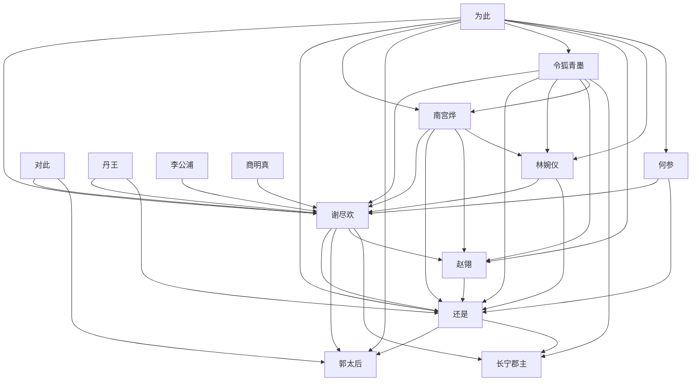

# 人物与关系图：《鸣龙》

## 人物表

### 1. 谢尽欢

- 出现次数：33
- 覆盖章节数：30
- 首次出现：第 12 章
- 最后出现：第 648 章
- 身份/行为线索：人物行为/发言(33)

### 2. 还是

- 出现次数：5
- 覆盖章节数：5
- 首次出现：第 190 章
- 最后出现：第 584 章
- 身份/行为线索：人物行为/发言(5)

### 3. 南宫烨

- 出现次数：4
- 覆盖章节数：4
- 首次出现：第 228 章
- 最后出现：第 644 章
- 身份/行为线索：人物行为/发言(4)

### 4. 令狐青墨

- 出现次数：3
- 覆盖章节数：3
- 首次出现：第 2 章
- 最后出现：第 17 章
- 身份/行为线索：人物行为/发言(3)

### 5. 何参

- 出现次数：3
- 覆盖章节数：2
- 首次出现：第 368 章
- 最后出现：第 417 章
- 身份/行为线索：人物行为/发言(3)

### 6. 林婉仪

- 出现次数：2
- 覆盖章节数：2
- 首次出现：第 5 章
- 最后出现：第 514 章
- 身份/行为线索：人物行为/发言(2)

### 7. 为此

- 出现次数：2
- 覆盖章节数：2
- 首次出现：第 68 章
- 最后出现：第 578 章
- 身份/行为线索：人物行为/发言(2)

### 8. 李公浦

- 出现次数：2
- 覆盖章节数：2
- 首次出现：第 93 章
- 最后出现：第 140 章
- 身份/行为线索：人物行为/发言(2)

### 9. 丹王

- 出现次数：2
- 覆盖章节数：2
- 首次出现：第 100 章
- 最后出现：第 183 章
- 身份/行为线索：人物行为/发言(2)

### 10. 长宁郡主

- 出现次数：2
- 覆盖章节数：2
- 首次出现：第 108 章
- 最后出现：第 127 章
- 身份/行为线索：人物行为/发言(2)

### 11. 魏昆

- 出现次数：2
- 覆盖章节数：2
- 首次出现：第 128 章
- 最后出现：第 288 章
- 身份/行为线索：人物行为/发言(2)

### 12. 郭太后

- 出现次数：2
- 覆盖章节数：2
- 首次出现：第 272 章
- 最后出现：第 456 章
- 身份/行为线索：人物行为/发言(2)

### 13. 赵翎

- 出现次数：2
- 覆盖章节数：2
- 首次出现：第 345 章
- 最后出现：第 532 章
- 身份/行为线索：人物行为/发言(2)

### 14. 吴诤

- 出现次数：2
- 覆盖章节数：1
- 首次出现：第 38 章
- 最后出现：第 38 章
- 身份/行为线索：人物行为/发言(2)

### 15. 步寒英

- 出现次数：2
- 覆盖章节数：1
- 首次出现：第 99 章
- 最后出现：第 99 章
- 身份/行为线索：人物行为/发言(2)

### 16. 对此

- 出现次数：2
- 覆盖章节数：1
- 首次出现：第 307 章
- 最后出现：第 307 章
- 身份/行为线索：人物行为/发言(2)

### 17. 商明真

- 出现次数：2
- 覆盖章节数：1
- 首次出现：第 384 章
- 最后出现：第 384 章
- 身份/行为线索：人物行为/发言(2)

## 关系边

- 谢尽欢 <-> 还是：共现 606 次，覆盖第 1-649 章，关系线索：同章共现(575)、师父(7)、朋友(4)、对手(3)、交易(3)、女儿(3)、师尊(3)、弟子(2)
- 为此 <-> 谢尽欢：共现 458 次，覆盖第 5-649 章，关系线索：同章共现(439)、师父(6)、保护(2)、命令(2)、朋友(2)、弟子(2)、交易(1)、女儿(1)
- 令狐青墨 <-> 谢尽欢：共现 426 次，覆盖第 9-649 章，关系线索：同章共现(391)、师父(16)、朋友(10)、师尊(8)、学生(1)、弟子(1)
- 南宫烨 <-> 谢尽欢：共现 424 次，覆盖第 5-647 章，关系线索：同章共现(402)、师尊(16)、师父(3)、对手(1)、弟子(1)、保护(1)、姐妹(1)
- 林婉仪 <-> 谢尽欢：共现 363 次，覆盖第 11-647 章，关系线索：同章共现(355)、师父(5)、保护(1)、弟子(1)、师尊(1)
- 谢尽欢 <-> 郭太后：共现 227 次，覆盖第 127-649 章，关系线索：同章共现(222)、朋友(1)、弟子(1)、父亲(1)、对手(1)、保护(1)、上司(1)
- 为此 <-> 还是：共现 194 次，覆盖第 5-647 章，关系线索：同章共现(178)、师父(5)、命令(3)、对手(2)、交易(1)、儿子(1)、女儿(1)、姐妹(1)
- 南宫烨 <-> 还是：共现 148 次，覆盖第 97-647 章，关系线索：同章共现(143)、师尊(2)、师父(1)、姐妹(1)、老师(1)
- 谢尽欢 <-> 赵翎：共现 142 次，覆盖第 250-640 章，关系线索：同章共现(140)、保护(1)、师父(1)
- 令狐青墨 <-> 还是：共现 107 次，覆盖第 3-649 章，关系线索：同章共现(77)、师父(15)、师尊(11)、朋友(7)
- 对此 <-> 谢尽欢：共现 91 次，覆盖第 6-625 章，关系线索：同章共现(87)、学生(1)、交易(1)、朋友(1)、弟子(1)
- 为此 <-> 南宫烨：共现 91 次，覆盖第 116-646 章，关系线索：同章共现(84)、师尊(4)、对手(1)、师父(1)、老师(1)、弟子(1)
- 还是 <-> 郭太后：共现 75 次，覆盖第 225-649 章，关系线索：同章共现(74)、对手(1)
- 谢尽欢 <-> 长宁郡主：共现 72 次，覆盖第 7-220 章，关系线索：同章共现(72)
- 丹王 <-> 谢尽欢：共现 71 次，覆盖第 7-338 章，关系线索：同章共现(70)、交易(1)
- 林婉仪 <-> 还是：共现 70 次，覆盖第 12-641 章，关系线索：同章共现(67)、师父(3)
- 令狐青墨 <-> 林婉仪：共现 67 次，覆盖第 17-571 章，关系线索：同章共现(65)、师尊(1)、女儿(1)
- 李公浦 <-> 谢尽欢：共现 60 次，覆盖第 75-520 章，关系线索：同章共现(59)、对手(1)
- 为此 <-> 郭太后：共现 55 次，覆盖第 235-647 章，关系线索：同章共现(54)、合作(1)
- 商明真 <-> 谢尽欢：共现 55 次，覆盖第 357-561 章，关系线索：同章共现(54)、对手(1)
- 为此 <-> 令狐青墨：共现 45 次，覆盖第 20-647 章，关系线索：同章共现(33)、师父(6)、朋友(4)、师尊(3)
- 令狐青墨 <-> 赵翎：共现 45 次，覆盖第 276-615 章，关系线索：同章共现(43)、朋友(1)、师父(1)
- 赵翎 <-> 还是：共现 37 次，覆盖第 257-649 章，关系线索：同章共现(37)
- 为此 <-> 赵翎：共现 31 次，覆盖第 247-647 章，关系线索：同章共现(30)、保护(1)
- 何参 <-> 谢尽欢：共现 30 次，覆盖第 54-541 章，关系线索：同章共现(29)、对手(1)
- 令狐青墨 <-> 南宫烨：共现 28 次，覆盖第 204-646 章，关系线索：同章共现(17)、师尊(6)、师父(4)、老师(1)
- 为此 <-> 林婉仪：共现 24 次，覆盖第 104-641 章，关系线索：同章共现(22)、师父(2)
- 丹王 <-> 还是：共现 17 次，覆盖第 23-328 章，关系线索：同章共现(17)
- 南宫烨 <-> 赵翎：共现 17 次，覆盖第 276-623 章，关系线索：同章共现(16)、师父(1)
- 令狐青墨 <-> 长宁郡主：共现 16 次，覆盖第 2-310 章，关系线索：同章共现(14)、姐妹(2)
- 何参 <-> 还是：共现 15 次，覆盖第 41-638 章，关系线索：同章共现(14)、对手(1)
- 还是 <-> 长宁郡主：共现 13 次，覆盖第 23-310 章，关系线索：同章共现(13)
- 南宫烨 <-> 林婉仪：共现 13 次，覆盖第 99-605 章，关系线索：同章共现(13)
- 对此 <-> 郭太后：共现 12 次，覆盖第 261-632 章，关系线索：同章共现(12)
- 为此 <-> 何参：共现 11 次，覆盖第 118-638 章，关系线索：同章共现(10)、对手(1)
- 李公浦 <-> 还是：共现 10 次，覆盖第 75-183 章，关系线索：同章共现(10)
- 谢尽欢 <-> 魏昆：共现 10 次，覆盖第 116-372 章，关系线索：同章共现(10)
- 南宫烨 <-> 郭太后：共现 10 次，覆盖第 416-632 章，关系线索：同章共现(10)
- 丹王 <-> 长宁郡主：共现 9 次，覆盖第 7-220 章，关系线索：同章共现(8)、女儿(1)
- 南宫烨 <-> 对此：共现 9 次，覆盖第 100-622 章，关系线索：同章共现(8)、师父(1)
- 赵翎 <-> 郭太后：共现 9 次，覆盖第 247-649 章，关系线索：同章共现(9)
- 为此 <-> 商明真：共现 9 次，覆盖第 363-488 章，关系线索：同章共现(9)
- 对此 <-> 还是：共现 8 次，覆盖第 70-625 章，关系线索：同章共现(6)、交易(1)、朋友(1)
- 步寒英 <-> 谢尽欢：共现 8 次，覆盖第 104-483 章，关系线索：同章共现(7)、交易(1)
- 丹王 <-> 令狐青墨：共现 7 次，覆盖第 27-315 章，关系线索：同章共现(7)
- 丹王 <-> 为此：共现 7 次，覆盖第 67-338 章，关系线索：同章共现(7)
- 商明真 <-> 还是：共现 7 次，覆盖第 384-459 章，关系线索：同章共现(7)
- 丹王 <-> 李公浦：共现 6 次，覆盖第 17-111 章，关系线索：同章共现(6)
- 对此 <-> 林婉仪：共现 6 次，覆盖第 26-594 章，关系线索：同章共现(6)
- 林婉仪 <-> 步寒英：共现 6 次，覆盖第 99-636 章，关系线索：同章共现(6)
- 丹王 <-> 南宫烨：共现 6 次，覆盖第 100-233 章，关系线索：同章共现(6)
- 李公浦 <-> 长宁郡主：共现 6 次，覆盖第 102-141 章，关系线索：同章共现(6)
- 为此 <-> 对此：共现 6 次，覆盖第 305-624 章，关系线索：同章共现(4)、弟子(1)、师尊(1)
- 吴诤 <-> 谢尽欢：共现 5 次，覆盖第 38-388 章，关系线索：同章共现(5)
- 为此 <-> 李公浦：共现 5 次，覆盖第 96-318 章，关系线索：同章共现(5)
- 步寒英 <-> 还是：共现 5 次，覆盖第 99-284 章，关系线索：同章共现(5)
- 丹王 <-> 对此：共现 4 次，覆盖第 23-315 章，关系线索：同章共现(4)
- 令狐青墨 <-> 郭太后：共现 4 次，覆盖第 421-626 章，关系线索：同章共现(4)
- 令狐青墨 <-> 对此：共现 3 次，覆盖第 56-578 章，关系线索：学生(1)、同章共现(1)、师尊(1)
- 李公浦 <-> 步寒英：共现 3 次，覆盖第 103-284 章，关系线索：同章共现(3)
- 对此 <-> 赵翎：共现 3 次，覆盖第 418-532 章，关系线索：同章共现(3)
- 林婉仪 <-> 郭太后：共现 3 次，覆盖第 475-637 章，关系线索：同章共现(3)
- 令狐青墨 <-> 吴诤：共现 2 次，覆盖第 38-38 章，关系线索：同章共现(2)
- 南宫烨 <-> 步寒英：共现 2 次，覆盖第 99-99 章，关系线索：同章共现(2)
- 郭太后 <-> 长宁郡主：共现 2 次，覆盖第 220-273 章，关系线索：同章共现(2)
- 何参 <-> 对此：共现 2 次，覆盖第 376-525 章，关系线索：同章共现(2)

## Mermaid 关系草图

