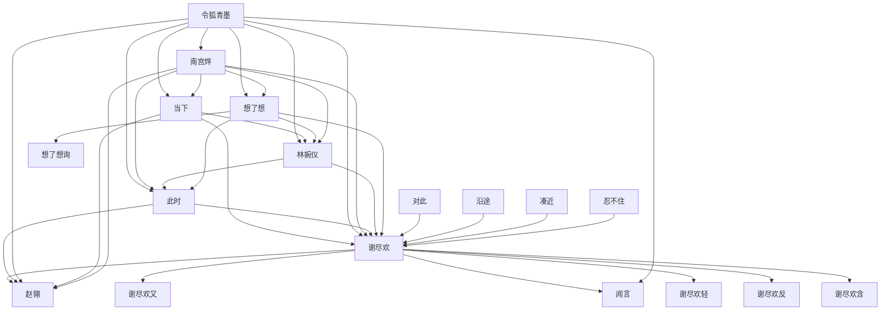

# 人物与关系图：《鸣龙》

## 人物表

### 1. 谢尽欢

- 出现次数：12
- 覆盖章节数：12
- 首次出现：第 12 章
- 最后出现：第 612 章
- 身份/行为线索：人物行为/发言(12)

### 2. 谢尽欢含

- 出现次数：9
- 覆盖章节数：9
- 首次出现：第 124 章
- 最后出现：第 648 章
- 身份/行为线索：人物行为/发言(9)

### 3. 凑近

- 出现次数：8
- 覆盖章节数：8
- 首次出现：第 4 章
- 最后出现：第 355 章
- 身份/行为线索：人物行为/发言(8)

### 4. 谢尽欢询

- 出现次数：5
- 覆盖章节数：5
- 首次出现：第 22 章
- 最后出现：第 180 章
- 身份/行为线索：人物行为/发言(5)

### 5. 此时

- 出现次数：5
- 覆盖章节数：5
- 首次出现：第 114 章
- 最后出现：第 621 章
- 身份/行为线索：人物行为/发言(5)

### 6. 当下

- 出现次数：4
- 覆盖章节数：4
- 首次出现：第 52 章
- 最后出现：第 564 章
- 身份/行为线索：人物行为/发言(4)

### 7. 还询

- 出现次数：4
- 覆盖章节数：4
- 首次出现：第 183 章
- 最后出现：第 626 章
- 身份/行为线索：人物行为/发言(4)

### 8. 还是询

- 出现次数：3
- 覆盖章节数：3
- 首次出现：第 190 章
- 最后出现：第 559 章
- 身份/行为线索：人物行为/发言(3)

### 9. 沿途

- 出现次数：3
- 覆盖章节数：3
- 首次出现：第 221 章
- 最后出现：第 629 章
- 身份/行为线索：人物行为/发言(3)

### 10. 便询

- 出现次数：3
- 覆盖章节数：3
- 首次出现：第 294 章
- 最后出现：第 596 章
- 身份/行为线索：人物行为/发言(3)

### 11. 想了想询

- 出现次数：3
- 覆盖章节数：3
- 首次出现：第 315 章
- 最后出现：第 519 章
- 身份/行为线索：人物行为/发言(3)

### 12. 令狐青墨

- 出现次数：2
- 覆盖章节数：2
- 首次出现：第 2 章
- 最后出现：第 17 章
- 身份/行为线索：人物行为/发言(2)

### 13. 林婉仪

- 出现次数：2
- 覆盖章节数：2
- 首次出现：第 5 章
- 最后出现：第 514 章
- 身份/行为线索：人物行为/发言(2)

### 14. 想想询

- 出现次数：2
- 覆盖章节数：2
- 首次出现：第 37 章
- 最后出现：第 340 章
- 身份/行为线索：人物行为/发言(2)

### 15. 交头接耳

- 出现次数：2
- 覆盖章节数：2
- 首次出现：第 106 章
- 最后出现：第 626 章
- 身份/行为线索：人物行为/发言(2)

### 16. 忍不住

- 出现次数：2
- 覆盖章节数：2
- 首次出现：第 124 章
- 最后出现：第 282 章
- 身份/行为线索：人物行为/发言(2)

### 17. 魏昆

- 出现次数：2
- 覆盖章节数：2
- 首次出现：第 128 章
- 最后出现：第 288 章
- 身份/行为线索：人物行为/发言(2)

### 18. 想了想

- 出现次数：2
- 覆盖章节数：2
- 首次出现：第 135 章
- 最后出现：第 219 章
- 身份/行为线索：人物行为/发言(2)

### 19. 此时询

- 出现次数：2
- 覆盖章节数：2
- 首次出现：第 181 章
- 最后出现：第 623 章
- 身份/行为线索：人物行为/发言(2)

### 20. 此时轻

- 出现次数：2
- 覆盖章节数：2
- 首次出现：第 220 章
- 最后出现：第 284 章
- 身份/行为线索：人物行为/发言(2)

### 21. 谢尽欢反

- 出现次数：2
- 覆盖章节数：2
- 首次出现：第 252 章
- 最后出现：第 491 章
- 身份/行为线索：人物行为/发言(2)

### 22. 南宫烨

- 出现次数：2
- 覆盖章节数：2
- 首次出现：第 337 章
- 最后出现：第 644 章
- 身份/行为线索：人物行为/发言(2)

### 23. 赵翎

- 出现次数：2
- 覆盖章节数：2
- 首次出现：第 345 章
- 最后出现：第 532 章
- 身份/行为线索：人物行为/发言(2)

### 24. 谢尽欢轻

- 出现次数：2
- 覆盖章节数：2
- 首次出现：第 349 章
- 最后出现：第 612 章
- 身份/行为线索：人物行为/发言(2)

### 25. 闻言

- 出现次数：2
- 覆盖章节数：2
- 首次出现：第 355 章
- 最后出现：第 533 章
- 身份/行为线索：人物行为/发言(2)

### 26. 此时含

- 出现次数：2
- 覆盖章节数：2
- 首次出现：第 362 章
- 最后出现：第 410 章
- 身份/行为线索：人物行为/发言(2)

### 27. 当下询

- 出现次数：2
- 覆盖章节数：2
- 首次出现：第 382 章
- 最后出现：第 454 章
- 身份/行为线索：人物行为/发言(2)

### 28. 凑到耳边

- 出现次数：2
- 覆盖章节数：2
- 首次出现：第 485 章
- 最后出现：第 615 章
- 身份/行为线索：人物行为/发言(2)

### 29. 谢尽欢又

- 出现次数：2
- 覆盖章节数：2
- 首次出现：第 496 章
- 最后出现：第 542 章
- 身份/行为线索：人物行为/发言(2)

### 30. 吴诤

- 出现次数：2
- 覆盖章节数：1
- 首次出现：第 38 章
- 最后出现：第 38 章
- 身份/行为线索：人物行为/发言(2)

### 31. 对此

- 出现次数：2
- 覆盖章节数：1
- 首次出现：第 307 章
- 最后出现：第 307 章
- 身份/行为线索：人物行为/发言(2)

## 关系边

- 当下 <-> 谢尽欢：共现 477 次，覆盖第 4-649 章，关系线索：同章共现(472)、师父(2)、朋友(1)、对手(1)、追杀(1)
- 令狐青墨 <-> 谢尽欢：共现 426 次，覆盖第 9-649 章，关系线索：同章共现(391)、师父(16)、朋友(10)、师尊(8)、学生(1)、弟子(1)
- 南宫烨 <-> 谢尽欢：共现 424 次，覆盖第 5-647 章，关系线索：同章共现(402)、师尊(16)、师父(3)、对手(1)、弟子(1)、保护(1)、姐妹(1)
- 此时 <-> 谢尽欢：共现 421 次，覆盖第 1-649 章，关系线索：同章共现(411)、师尊(3)、对手(2)、儿子(1)、命令(1)、师父(1)、朋友(1)、保护(1)
- 林婉仪 <-> 谢尽欢：共现 363 次，覆盖第 11-647 章，关系线索：同章共现(355)、师父(5)、保护(1)、弟子(1)、师尊(1)
- 想了想 <-> 谢尽欢：共现 149 次，覆盖第 3-645 章，关系线索：同章共现(147)、师父(1)、儿子(1)
- 谢尽欢 <-> 赵翎：共现 142 次，覆盖第 250-640 章，关系线索：同章共现(140)、保护(1)、师父(1)
- 对此 <-> 谢尽欢：共现 91 次，覆盖第 6-625 章，关系线索：同章共现(87)、学生(1)、交易(1)、朋友(1)、弟子(1)
- 谢尽欢 <-> 谢尽欢又：共现 90 次，覆盖第 1-649 章，关系线索：同章共现(88)、师父(1)、女儿(1)
- 令狐青墨 <-> 此时：共现 87 次，覆盖第 9-645 章，关系线索：同章共现(69)、师父(8)、师尊(6)、朋友(3)、姐妹(2)、弟子(1)、命令(1)
- 沿途 <-> 谢尽欢：共现 80 次，覆盖第 3-649 章，关系线索：同章共现(77)、师尊(2)、朋友(1)
- 南宫烨 <-> 此时：共现 79 次，覆盖第 116-648 章，关系线索：同章共现(75)、师尊(3)、师父(1)、保护(1)
- 令狐青墨 <-> 林婉仪：共现 67 次，覆盖第 17-571 章，关系线索：同章共现(65)、师尊(1)、女儿(1)
- 此时 <-> 赵翎：共现 48 次，覆盖第 247-647 章，关系线索：同章共现(46)、女儿(1)、盟友(1)
- 令狐青墨 <-> 赵翎：共现 45 次，覆盖第 276-615 章，关系线索：同章共现(43)、朋友(1)、师父(1)
- 当下 <-> 林婉仪：共现 44 次，覆盖第 12-641 章，关系线索：同章共现(41)、师父(2)、女儿(1)
- 令狐青墨 <-> 当下：共现 44 次，覆盖第 18-646 章，关系线索：同章共现(34)、师父(6)、姐妹(2)、朋友(1)、女儿(1)、师尊(1)
- 南宫烨 <-> 当下：共现 43 次，覆盖第 153-646 章，关系线索：同章共现(39)、师尊(4)
- 林婉仪 <-> 此时：共现 39 次，覆盖第 16-642 章，关系线索：同章共现(35)、师父(4)
- 谢尽欢 <-> 闻言：共现 36 次，覆盖第 25-618 章，关系线索：同章共现(36)
- 令狐青墨 <-> 想了想：共现 35 次，覆盖第 16-626 章，关系线索：同章共现(30)、师尊(3)、师父(2)、朋友(1)
- 谢尽欢 <-> 谢尽欢轻：共现 33 次，覆盖第 4-623 章，关系线索：同章共现(32)、对手(1)
- 令狐青墨 <-> 南宫烨：共现 28 次，覆盖第 204-646 章，关系线索：同章共现(17)、师尊(6)、师父(4)、老师(1)
- 当下 <-> 赵翎：共现 25 次，覆盖第 259-640 章，关系线索：同章共现(25)
- 凑近 <-> 谢尽欢：共现 24 次，覆盖第 13-644 章，关系线索：同章共现(24)
- 想了想 <-> 想了想询：共现 24 次，覆盖第 43-631 章，关系线索：同章共现(23)、师尊(1)
- 忍不住 <-> 谢尽欢：共现 23 次，覆盖第 14-649 章，关系线索：同章共现(23)
- 谢尽欢 <-> 谢尽欢反：共现 23 次，覆盖第 80-623 章，关系线索：同章共现(21)、对手(1)、师父(1)、老师(1)
- 想了想 <-> 林婉仪：共现 18 次，覆盖第 21-614 章，关系线索：同章共现(16)、师父(2)
- 南宫烨 <-> 想了想：共现 17 次，覆盖第 107-581 章，关系线索：同章共现(16)、师尊(1)
- 南宫烨 <-> 赵翎：共现 17 次，覆盖第 276-623 章，关系线索：同章共现(16)、师父(1)
- 谢尽欢 <-> 谢尽欢含：共现 16 次，覆盖第 42-648 章，关系线索：同章共现(16)
- 想了想 <-> 此时：共现 15 次，覆盖第 92-595 章，关系线索：同章共现(14)、师父(1)
- 令狐青墨 <-> 闻言：共现 13 次，覆盖第 34-591 章，关系线索：同章共现(12)、师父(1)
- 南宫烨 <-> 林婉仪：共现 13 次，覆盖第 99-605 章，关系线索：同章共现(13)
- 想了想询 <-> 谢尽欢：共现 12 次，覆盖第 43-631 章，关系线索：同章共现(12)
- 南宫烨 <-> 沿途：共现 12 次，覆盖第 116-632 章，关系线索：同章共现(8)、师父(2)、师尊(1)、姐妹(1)
- 忍不住 <-> 林婉仪：共现 11 次，覆盖第 14-594 章，关系线索：同章共现(10)、师父(1)
- 此时 <-> 此时轻：共现 11 次，覆盖第 73-649 章，关系线索：同章共现(11)
- 令狐青墨 <-> 忍不住：共现 11 次，覆盖第 105-649 章，关系线索：同章共现(10)、师尊(1)
- 谢尽欢 <-> 魏昆：共现 10 次，覆盖第 116-372 章，关系线索：同章共现(10)
- 南宫烨 <-> 忍不住：共现 10 次，覆盖第 179-646 章，关系线索：同章共现(9)、师尊(1)
- 当下 <-> 当下询：共现 9 次，覆盖第 90-503 章，关系线索：同章共现(8)、师尊(1)
- 南宫烨 <-> 对此：共现 9 次，覆盖第 100-622 章，关系线索：同章共现(8)、师父(1)
- 凑到耳边 <-> 谢尽欢：共现 8 次，覆盖第 169-628 章，关系线索：同章共现(8)
- 当下 <-> 想了想：共现 8 次，覆盖第 235-587 章，关系线索：同章共现(8)
- 南宫烨 <-> 闻言：共现 7 次，覆盖第 127-526 章，关系线索：同章共现(6)、师父(1)
- 凑近 <-> 林婉仪：共现 6 次，覆盖第 13-493 章，关系线索：同章共现(6)
- 林婉仪 <-> 谢尽欢又：共现 6 次，覆盖第 14-647 章，关系线索：同章共现(6)
- 谢尽欢 <-> 谢尽欢询：共现 6 次，覆盖第 22-232 章，关系线索：同章共现(6)
- 对此 <-> 林婉仪：共现 6 次，覆盖第 26-594 章，关系线索：同章共现(6)
- 忍不住 <-> 此时：共现 6 次，覆盖第 31-646 章，关系线索：同章共现(6)
- 赵翎 <-> 闻言：共现 6 次，覆盖第 344-574 章，关系线索：同章共现(6)
- 吴诤 <-> 谢尽欢：共现 5 次，覆盖第 38-388 章，关系线索：同章共现(5)
- 此时 <-> 此时询：共现 5 次，覆盖第 72-644 章，关系线索：同章共现(3)、师父(1)、师尊(1)
- 令狐青墨 <-> 沿途：共现 5 次，覆盖第 78-424 章，关系线索：同章共现(4)、师父(1)
- 谢尽欢 <-> 还询：共现 5 次，覆盖第 183-632 章，关系线索：同章共现(5)
- 当下 <-> 沿途：共现 5 次，覆盖第 243-616 章，关系线索：同章共现(5)
- 此时 <-> 此时含：共现 5 次，覆盖第 342-543 章，关系线索：同章共现(4)、师父(1)
- 林婉仪 <-> 闻言：共现 4 次，覆盖第 12-528 章，关系线索：同章共现(4)
- 想想询 <-> 谢尽欢：共现 4 次，覆盖第 37-160 章，关系线索：同章共现(4)
- 此时 <-> 沿途：共现 4 次，覆盖第 40-649 章，关系线索：同章共现(4)
- 令狐青墨 <-> 想想询：共现 4 次，覆盖第 73-419 章，关系线索：同章共现(2)、师父(2)、师尊(1)
- 当下询 <-> 谢尽欢：共现 4 次，覆盖第 90-382 章，关系线索：同章共现(4)
- 令狐青墨 <-> 凑近：共现 4 次，覆盖第 94-645 章，关系线索：同章共现(4)
- 当下 <-> 此时：共现 4 次，覆盖第 109-379 章，关系线索：同章共现(4)
- 凑近 <-> 此时：共现 4 次，覆盖第 120-646 章，关系线索：同章共现(4)
- 南宫烨 <-> 谢尽欢又：共现 4 次，覆盖第 145-406 章，关系线索：同章共现(4)
- 谢尽欢 <-> 还是询：共现 4 次，覆盖第 190-625 章，关系线索：同章共现(4)
- 沿途 <-> 赵翎：共现 4 次，覆盖第 250-547 章，关系线索：同章共现(3)、师父(1)
- 便询 <-> 谢尽欢：共现 4 次，覆盖第 294-596 章，关系线索：同章共现(4)
- 此时含 <-> 谢尽欢：共现 4 次，覆盖第 342-543 章，关系线索：同章共现(4)
- 对此 <-> 想了想：共现 4 次，覆盖第 525-581 章，关系线索：同章共现(3)、师尊(1)
- 令狐青墨 <-> 对此：共现 3 次，覆盖第 56-578 章，关系线索：学生(1)、同章共现(1)、师尊(1)
- 令狐青墨 <-> 此时轻：共现 3 次，覆盖第 73-615 章，关系线索：同章共现(3)
- 交头接耳 <-> 谢尽欢：共现 3 次，覆盖第 114-288 章，关系线索：同章共现(3)
- 此时轻 <-> 谢尽欢：共现 3 次，覆盖第 125-588 章，关系线索：同章共现(3)
- 南宫烨 <-> 想了想询：共现 3 次，覆盖第 127-441 章，关系线索：同章共现(2)、师尊(1)
- 想了想 <-> 赵翎：共现 3 次，覆盖第 262-640 章，关系线索：同章共现(3)
- 对此 <-> 当下：共现 3 次，覆盖第 269-418 章，关系线索：同章共现(3)
- 对此 <-> 赵翎：共现 3 次，覆盖第 418-532 章，关系线索：同章共现(3)
- 此时 <-> 谢尽欢又：共现 2 次，覆盖第 6-108 章，关系线索：同章共现(2)
- 令狐青墨 <-> 吴诤：共现 2 次，覆盖第 38-38 章，关系线索：同章共现(2)
- 令狐青墨 <-> 此时询：共现 2 次，覆盖第 72-644 章，关系线索：同章共现(1)、师尊(1)
- 令狐青墨 <-> 谢尽欢又：共现 2 次，覆盖第 89-122 章，关系线索：同章共现(2)
- 当下 <-> 谢尽欢又：共现 2 次，覆盖第 101-197 章，关系线索：同章共现(2)
- 林婉仪 <-> 还是询：共现 2 次，覆盖第 125-128 章，关系线索：同章共现(2)
- 当下 <-> 还询：共现 2 次，覆盖第 183-632 章，关系线索：同章共现(2)
- 令狐青墨 <-> 想了想询：共现 2 次，覆盖第 256-315 章，关系线索：同章共现(2)
- 此时 <-> 闻言：共现 2 次，覆盖第 273-581 章，关系线索：同章共现(2)
- 林婉仪 <-> 沿途：共现 2 次，覆盖第 284-334 章，关系线索：同章共现(2)
- 当下询 <-> 赵翎：共现 2 次，覆盖第 289-418 章，关系线索：同章共现(2)
- 便询 <-> 南宫烨：共现 2 次，覆盖第 294-533 章，关系线索：同章共现(2)
- 南宫烨 <-> 当下询：共现 2 次，覆盖第 337-454 章，关系线索：同章共现(1)、师尊(1)
- 想想询 <-> 此时：共现 2 次，覆盖第 340-608 章，关系线索：师父(1)、师尊(1)、同章共现(1)
- 此时 <-> 还是询：共现 2 次，覆盖第 342-433 章，关系线索：同章共现(2)
- 当下 <-> 忍不住：共现 2 次，覆盖第 548-617 章，关系线索：同章共现(2)
- 忍不住 <-> 赵翎：共现 2 次，覆盖第 610-616 章，关系线索：同章共现(2)
- 凑近 <-> 赵翎：共现 2 次，覆盖第 612-613 章，关系线索：同章共现(2)

## Mermaid 关系草图

