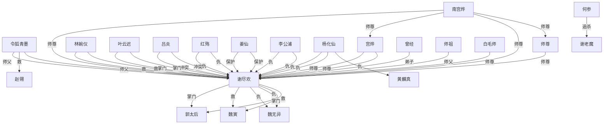

# 人物与关系图：《鸣龙.txt》

## 关系图解读

- 主角候选：谢尽欢
- 识别方式：优先采用子 Agent 标注；缺失时按全书出场覆盖、关系网络中心度和关系词线索推断。
- 使用边界：没有子 Agent JSON 的书，敌对/同盟等语义来自正文关键词和共现段落推断，应作为精读索引，不应直接当最终定论。

## 人物功能分层

### 主角候选

- 谢尽欢：综合主角得分最高，覆盖第 1-649 章。 置信度：中。出场范围：第 1-649 章。

### 主要对手/反派候选

- 魏无异：谢尽欢：仇，覆盖第 91-562 章，证据：同章共现(60)、掌门(3)、仇(2)、弟子(1)、对手(1)、朋友(1)、父亲(1)、矛盾(1) 置信度：中。出场范围：第 73-632 章。
- 杨化仙：谢尽欢：仇，覆盖第 289-620 章，证据：同章共现(41)、救(2)、仇(2)、追杀(1)、对手(1)、保护(1) 置信度：中。出场范围：第 279-620 章。
- 李公浦：谢尽欢：仇，覆盖第 75-520 章，证据：同章共现(57)、仇(2)、对手(1) 置信度：中。出场范围：第 23-622 章。
- 吕炎：谢尽欢：冲突，覆盖第 224-647 章，证据：同章共现(186)、掌门(5)、冲突(3)、追杀(2)、利用(2)、仇(2)、围攻(1)、师父(1) 置信度：中。出场范围：第 221-467 章。
- 红殇：谢尽欢：仇，覆盖第 6-649 章，证据：同章共现(178)、仇(2)、妹妹(2)、冲突(1)、对手(1)、上司(1)、试探(1)、师尊(1) 置信度：中。出场范围：第 36-641 章。
- 谢老魔：何参：追杀，覆盖第 244-638 章，证据：同章共现(9)、追杀(2)、威胁(1) 置信度：中。出场范围：第 239-647 章。

### 核心同伴/盟友候选

- 林婉仪：谢尽欢：救，覆盖第 11-647 章，证据：同章共现(340)、救(10)、师父(5)、妹妹(2)、仇(1)、喜欢(1)、保护(1)、支援(1) 置信度：中。出场范围：第 5-642 章。
- 姜仙：谢尽欢：保护，覆盖第 246-631 章，证据：同章共现(134)、保护(1)、兄弟(1)、朋友(1)、上司(1)、掌门(1)、命令(1) 置信度：中。出场范围：第 238-647 章。

### 导师/上位者/下属候选

- 令狐青墨：谢尽欢：师父，覆盖第 9-649 章，证据：同章共现(384)、师父(16)、朋友(10)、师尊(8)、喜欢(3)、仇(2)、学生(1)、交换(1) 置信度：中。出场范围：第 2-646 章。
- 郭太后：谢尽欢：掌门，覆盖第 127-649 章，证据：同章共现(217)、掌门(3)、冲突(1)、朋友(1)、弟子(1)、父亲(1)、救(1)、对手(1) 置信度：中。出场范围：第 130-643 章。
- 南宫烨：谢尽欢：师尊，覆盖第 5-647 章，证据：同章共现(389)、师尊(16)、掌门(7)、救(3)、师父(3)、威胁(2)、同行(1)、对手(1) 置信度：中。出场范围：第 99-649 章。
- 宫烨：谢尽欢：师尊，覆盖第 5-647 章，证据：同章共现(389)、师尊(16)、掌门(7)、救(3)、师父(3)、威胁(2)、同行(1)、对手(1) 置信度：中。出场范围：第 107-649 章。
- 叶云迟：谢尽欢：掌门，覆盖第 359-640 章，证据：同章共现(199)、掌门(7)、救(2)、学生(2)、妻子(1)、对手(1)、仇(1)、朋友(1) 置信度：中。出场范围：第 359-647 章。
- 师尊大：师尊：师尊，覆盖第 181-646 章，证据：师尊(38)、师父(1)、妹妹(1)、喜欢(1) 置信度：中。出场范围：第 181-646 章。
- 白毛师：谢尽欢：师尊，覆盖第 336-632 章，证据：同章共现(5)、师尊(3) 置信度：中。出场范围：第 332-632 章。
- 师祖：谢尽欢：师父，覆盖第 83-632 章，证据：同章共现(10)、师父(3) 置信度：中。出场范围：第 206-593 章。
- 相公：南宫烨：师尊，覆盖第 387-645 章，证据：同章共现(4)、师尊(2)、儿子(1)、掌门(1) 置信度：中。出场范围：第 286-649 章。

### 亲属/情感关系候选

- 暂无明确候选。

### 交易/利用关系候选

- 暂无明确候选。

### 重要配角候选

- 暂无明确候选。

## 主角关系网

- 令狐青墨 <-> 谢尽欢：师父（师徒/上下级，置信度：中）。覆盖第 9-649 章；共现 426 次；证据：同章共现(384)、师父(16)、朋友(10)、师尊(8)、喜欢(3)、仇(2)、学生(1)、交换(1)
- 南宫烨 <-> 谢尽欢：师尊（师徒/上下级，置信度：中）。覆盖第 5-647 章；共现 424 次；证据：同章共现(389)、师尊(16)、掌门(7)、救(3)、师父(3)、威胁(2)、同行(1)、对手(1)
- 宫烨 <-> 谢尽欢：师尊（师徒/上下级，置信度：中）。覆盖第 5-647 章；共现 424 次；证据：同章共现(389)、师尊(16)、掌门(7)、救(3)、师父(3)、威胁(2)、同行(1)、对手(1)
- 林婉仪 <-> 谢尽欢：救（同盟/合作，置信度：中）。覆盖第 11-647 章；共现 363 次；证据：同章共现(340)、救(10)、师父(5)、妹妹(2)、仇(1)、喜欢(1)、保护(1)、支援(1)
- 谢尽欢 <-> 郭太后：掌门（师徒/上下级，置信度：中）。覆盖第 127-649 章；共现 227 次；证据：同章共现(217)、掌门(3)、冲突(1)、朋友(1)、弟子(1)、父亲(1)、救(1)、对手(1)
- 叶云迟 <-> 谢尽欢：掌门（师徒/上下级，置信度：中）。覆盖第 359-640 章；共现 215 次；证据：同章共现(199)、掌门(7)、救(2)、学生(2)、妻子(1)、对手(1)、仇(1)、朋友(1)
- 吕炎 <-> 谢尽欢：冲突（敌对/矛盾，置信度：中）。覆盖第 224-647 章；共现 205 次；证据：同章共现(186)、掌门(5)、冲突(3)、追杀(2)、利用(2)、仇(2)、围攻(1)、师父(1)
- 红殇 <-> 谢尽欢：仇（敌对/矛盾，置信度：中）。覆盖第 6-649 章；共现 189 次；证据：同章共现(178)、仇(2)、妹妹(2)、冲突(1)、对手(1)、上司(1)、试探(1)、师尊(1)
- 姜仙 <-> 谢尽欢：保护（同盟/合作，置信度：中）。覆盖第 246-631 章；共现 140 次；证据：同章共现(134)、保护(1)、兄弟(1)、朋友(1)、上司(1)、掌门(1)、命令(1)
- 谢尽欢 <-> 魏寅：救（同盟/合作，置信度：中）。覆盖第 199-316 章；共现 73 次；证据：同章共现(67)、救(3)、弟子(1)、掌门(1)、对手(1)、师父(1)
- 谢尽欢 <-> 魏无异：仇（敌对/矛盾，置信度：中）。覆盖第 91-562 章；共现 70 次；证据：同章共现(60)、掌门(3)、仇(2)、弟子(1)、对手(1)、朋友(1)、父亲(1)、矛盾(1)
- 李公浦 <-> 谢尽欢：仇（敌对/矛盾，置信度：中）。覆盖第 75-520 章；共现 60 次；证据：同章共现(57)、仇(2)、对手(1)
- 杨化仙 <-> 谢尽欢：仇（敌对/矛盾，置信度：中）。覆盖第 289-620 章；共现 47 次；证据：同章共现(41)、救(2)、仇(2)、追杀(1)、对手(1)、保护(1)
- 师尊 <-> 谢尽欢：师尊（师徒/上下级，置信度：中）。覆盖第 157-647 章；共现 45 次；证据：师尊(45)、弟子(1)、保护(1)
- 曾经 <-> 谢尽欢：弟子（师徒/上下级，置信度：中）。覆盖第 8-625 章；共现 19 次；证据：同章共现(17)、弟子(2)、掌门(1)、父亲(1)、救(1)
- 师祖 <-> 谢尽欢：师父（师徒/上下级，置信度：中）。覆盖第 83-632 章；共现 13 次；证据：同章共现(10)、师父(3)
- 白毛师 <-> 谢尽欢：师尊（师徒/上下级，置信度：中）。覆盖第 336-632 章；共现 8 次；证据：同章共现(5)、师尊(3)

## 主要矛盾和敌对关系

- 吕炎 <-> 谢尽欢：冲突（敌对/矛盾，置信度：中）。覆盖第 224-647 章；共现 205 次；证据：同章共现(186)、掌门(5)、冲突(3)、追杀(2)、利用(2)、仇(2)、围攻(1)、师父(1)
- 红殇 <-> 谢尽欢：仇（敌对/矛盾，置信度：中）。覆盖第 6-649 章；共现 189 次；证据：同章共现(178)、仇(2)、妹妹(2)、冲突(1)、对手(1)、上司(1)、试探(1)、师尊(1)
- 谢尽欢 <-> 魏无异：仇（敌对/矛盾，置信度：中）。覆盖第 91-562 章；共现 70 次；证据：同章共现(60)、掌门(3)、仇(2)、弟子(1)、对手(1)、朋友(1)、父亲(1)、矛盾(1)
- 李公浦 <-> 谢尽欢：仇（敌对/矛盾，置信度：中）。覆盖第 75-520 章；共现 60 次；证据：同章共现(57)、仇(2)、对手(1)
- 杨化仙 <-> 谢尽欢：仇（敌对/矛盾，置信度：中）。覆盖第 289-620 章；共现 47 次；证据：同章共现(41)、救(2)、仇(2)、追杀(1)、对手(1)、保护(1)
- 杨化仙 <-> 黄麟真：仇（敌对/矛盾，置信度：中）。覆盖第 279-557 章；共现 20 次；证据：同章共现(16)、仇(1)、对手(1)、盟友(1)、围攻(1)、救(1)
- 何参 <-> 谢老魔：追杀（敌对/矛盾，置信度：中）。覆盖第 244-638 章；共现 12 次；证据：同章共现(9)、追杀(2)、威胁(1)

## 合作、同盟和支援关系

- 林婉仪 <-> 谢尽欢：救（同盟/合作，置信度：中）。覆盖第 11-647 章；共现 363 次；证据：同章共现(340)、救(10)、师父(5)、妹妹(2)、仇(1)、喜欢(1)、保护(1)、支援(1)
- 姜仙 <-> 谢尽欢：保护（同盟/合作，置信度：中）。覆盖第 246-631 章；共现 140 次；证据：同章共现(134)、保护(1)、兄弟(1)、朋友(1)、上司(1)、掌门(1)、命令(1)
- 谢尽欢 <-> 魏寅：救（同盟/合作，置信度：中）。覆盖第 199-316 章；共现 73 次；证据：同章共现(67)、救(3)、弟子(1)、掌门(1)、对手(1)、师父(1)
- 令狐青墨 <-> 赵翎：救（同盟/合作，置信度：中）。覆盖第 276-615 章；共现 45 次；证据：同章共现(42)、救(2)、朋友(1)、师父(1)

## 师徒、上下级、亲属和交易关系

- 南宫烨 <-> 宫烨：师尊（师徒/上下级，置信度：中）。覆盖第 5-649 章；共现 2427 次；证据：同章共现(2204)、师尊(93)、掌门(56)、师父(20)、救(11)、姐妹(10)、对手(8)、弟子(6)
- 令狐青墨 <-> 谢尽欢：师父（师徒/上下级，置信度：中）。覆盖第 9-649 章；共现 426 次；证据：同章共现(384)、师父(16)、朋友(10)、师尊(8)、喜欢(3)、仇(2)、学生(1)、交换(1)
- 南宫烨 <-> 谢尽欢：师尊（师徒/上下级，置信度：中）。覆盖第 5-647 章；共现 424 次；证据：同章共现(389)、师尊(16)、掌门(7)、救(3)、师父(3)、威胁(2)、同行(1)、对手(1)
- 宫烨 <-> 谢尽欢：师尊（师徒/上下级，置信度：中）。覆盖第 5-647 章；共现 424 次；证据：同章共现(389)、师尊(16)、掌门(7)、救(3)、师父(3)、威胁(2)、同行(1)、对手(1)
- 谢尽欢 <-> 郭太后：掌门（师徒/上下级，置信度：中）。覆盖第 127-649 章；共现 227 次；证据：同章共现(217)、掌门(3)、冲突(1)、朋友(1)、弟子(1)、父亲(1)、救(1)、对手(1)
- 叶云迟 <-> 谢尽欢：掌门（师徒/上下级，置信度：中）。覆盖第 359-640 章；共现 215 次；证据：同章共现(199)、掌门(7)、救(2)、学生(2)、妻子(1)、对手(1)、仇(1)、朋友(1)
- 南宫烨 <-> 师尊：师尊（师徒/上下级，置信度：中）。覆盖第 182-645 章；共现 91 次；证据：师尊(91)、掌门(3)、命令(1)、保护(1)、弟子(1)
- 宫烨 <-> 师尊：师尊（师徒/上下级，置信度：中）。覆盖第 182-645 章；共现 91 次；证据：师尊(91)、掌门(3)、命令(1)、保护(1)、弟子(1)
- 令狐青墨 <-> 师尊：师尊（师徒/上下级，置信度：中）。覆盖第 127-647 章；共现 76 次；证据：师尊(76)、师父(7)、交换(1)
- 南宫烨 <-> 南宫烨本：师尊（师徒/上下级，置信度：中）。覆盖第 132-646 章；共现 49 次；证据：同章共现(46)、师尊(3)
- 南宫烨 <-> 宫烨本：师尊（师徒/上下级，置信度：中）。覆盖第 132-646 章；共现 49 次；证据：同章共现(46)、师尊(3)
- 南宫烨本 <-> 宫烨：师尊（师徒/上下级，置信度：中）。覆盖第 132-646 章；共现 49 次；证据：同章共现(46)、师尊(3)
- 宫烨 <-> 宫烨本：师尊（师徒/上下级，置信度：中）。覆盖第 132-646 章；共现 49 次；证据：同章共现(46)、师尊(3)
- 南宫烨本 <-> 宫烨本：师尊（师徒/上下级，置信度：中）。覆盖第 132-646 章；共现 49 次；证据：同章共现(46)、师尊(3)
- 师尊 <-> 谢尽欢：师尊（师徒/上下级，置信度：中）。覆盖第 157-647 章；共现 45 次；证据：师尊(45)、弟子(1)、保护(1)
- 师尊 <-> 师尊大：师尊（师徒/上下级，置信度：中）。覆盖第 181-646 章；共现 38 次；证据：师尊(38)、师父(1)、妹妹(1)、喜欢(1)
- 魏寅 <-> 魏无异：弟子（师徒/上下级，置信度：中）。覆盖第 199-339 章；共现 32 次；证据：同章共现(23)、救(3)、弟子(2)、掌门(2)、对手(1)、儿子(1)、兄弟(1)、师父(1)
- 南宫烨 <-> 叶云迟：掌门（师徒/上下级，置信度：中）。覆盖第 384-642 章；共现 30 次；证据：同章共现(25)、掌门(3)、老师(1)、喜欢(1)
- 叶云迟 <-> 宫烨：掌门（师徒/上下级，置信度：中）。覆盖第 384-642 章；共现 30 次；证据：同章共现(25)、掌门(3)、老师(1)、喜欢(1)
- 令狐青墨 <-> 南宫烨：师尊（师徒/上下级，置信度：中）。覆盖第 204-646 章；共现 28 次；证据：同章共现(17)、师尊(6)、师父(4)、老师(1)
- 令狐青墨 <-> 宫烨：师尊（师徒/上下级，置信度：中）。覆盖第 204-646 章；共现 28 次；证据：同章共现(17)、师尊(6)、师父(4)、老师(1)
- 严肃 <-> 令狐青墨：师父（师徒/上下级，置信度：中）。覆盖第 16-646 章；共现 22 次；证据：同章共现(17)、师父(3)、弟子(1)、朋友(1)、掌门(1)、师尊(1)
- 曾经 <-> 谢尽欢：弟子（师徒/上下级，置信度：中）。覆盖第 8-625 章；共现 19 次；证据：同章共现(17)、弟子(2)、掌门(1)、父亲(1)、救(1)
- 师尊 <-> 白毛师：师尊（师徒/上下级，置信度：中）。覆盖第 438-645 章；共现 19 次；证据：师尊(19)、弟子(1)、掌门(1)
- 南宫烨 <-> 白毛师：师尊（师徒/上下级，置信度：中）。覆盖第 439-645 章；共现 15 次；证据：师尊(15)、弟子(1)、掌门(1)
- 宫烨 <-> 白毛师：师尊（师徒/上下级，置信度：中）。覆盖第 439-645 章；共现 15 次；证据：师尊(15)、弟子(1)、掌门(1)
- 师祖 <-> 谢尽欢：师父（师徒/上下级，置信度：中）。覆盖第 83-632 章；共现 13 次；证据：同章共现(10)、师父(3)
- 叶圣 <-> 范黎：弟子（师徒/上下级，置信度：中）。覆盖第 200-587 章；共现 11 次；证据：同章共现(8)、弟子(2)、学生(1)
- 令狐青墨 <-> 师尊大：师尊（师徒/上下级，置信度：中）。覆盖第 407-646 章；共现 9 次；证据：师尊(9)、师父(1)
- 穆云令 <-> 范黎：学生（师徒/上下级，置信度：中）。覆盖第 83-327 章；共现 8 次；证据：同章共现(4)、学生(2)、师父(1)、兄弟(1)
- 白毛师 <-> 谢尽欢：师尊（师徒/上下级，置信度：中）。覆盖第 336-632 章；共现 8 次；证据：同章共现(5)、师尊(3)
- 叶祠 <-> 范黎：师父（师徒/上下级，置信度：中）。覆盖第 83-110 章；共现 7 次；证据：同章共现(3)、师父(1)、老师(1)、兄弟(1)、弟子(1)
- 南宫烨 <-> 师徒：师尊（师徒/上下级，置信度：中）。覆盖第 304-635 章；共现 7 次；证据：同章共现(5)、师尊(1)、命令(1)、师父(1)
- 宫烨 <-> 师徒：师尊（师徒/上下级，置信度：中）。覆盖第 304-635 章；共现 7 次；证据：同章共现(5)、师尊(1)、命令(1)、师父(1)
- 南宫烨 <-> 相公：师尊（师徒/上下级，置信度：中）。覆盖第 387-645 章；共现 7 次；证据：同章共现(4)、师尊(2)、儿子(1)、掌门(1)
- 宫烨 <-> 相公：师尊（师徒/上下级，置信度：中）。覆盖第 387-645 章；共现 7 次；证据：同章共现(4)、师尊(2)、儿子(1)、掌门(1)
- 张怀瑜 <-> 范黎：师父（师徒/上下级，置信度：中）。覆盖第 75-310 章；共现 6 次；证据：同章共现(3)、师父(1)、老师(1)、弟子(1)

## 待精读确认的高频共现

- 谢尽欢 <-> 赵翎：仇（敌对/矛盾，置信度：低）。覆盖第 250-640 章；共现 142 次；证据：同章共现(139)、保护(1)、师父(1)、仇(1)
- 林紫苏 <-> 谢尽欢：对手（敌对/矛盾，置信度：低）。覆盖第 5-626 章；共现 119 次；证据：同章共现(117)、朋友(1)、对手(1)
- 令狐青墨 <-> 林婉仪：救（同盟/合作，置信度：低）。覆盖第 17-571 章；共现 67 次；证据：同章共现(62)、掌门(1)、救(1)、支援(1)、师尊(1)、女儿(1)
- 叶圣 <-> 谢尽欢：矛盾（敌对/矛盾，置信度：低）。覆盖第 197-648 章；共现 62 次；证据：同章共现(61)、矛盾(1)
- 吕炎 <-> 吕炎老：普通共现（普通共现，置信度：低）。覆盖第 226-635 章；共现 56 次；证据：同章共现(56)
- 明真 <-> 谢尽欢：对手（敌对/矛盾，置信度：低）。覆盖第 357-561 章；共现 55 次；证据：同章共现(53)、掌门(1)、对手(1)
- 林紫苏 <-> 谢郎：普通共现（普通共现，置信度：低）。覆盖第 218-637 章；共现 54 次；证据：同章共现(54)
- 司空天渊 <-> 谢尽欢：师父（师徒/上下级，置信度：低）。覆盖第 237-582 章；共现 47 次；证据：同章共现(45)、师父(2)
- 杨大彪 <-> 谢尽欢：朋友（同盟/合作，置信度：低）。覆盖第 2-347 章；共现 45 次；证据：同章共现(42)、朋友(1)、仇(1)、兄弟(1)
- 郭太后 <-> 郭氏：冲突（敌对/矛盾，置信度：低）。覆盖第 251-279 章；共现 39 次；证据：同章共现(35)、冲突(1)、兄长(1)、利用(1)、救(1)
- 叶世荣 <-> 谢尽欢：普通共现（普通共现，置信度：低）。覆盖第 116-312 章；共现 35 次；证据：同章共现(35)
- 谢尽欢 <-> 高人：师父（师徒/上下级，置信度：低）。覆盖第 29-620 章；共现 33 次；证据：同章共现(32)、师父(1)
- 吕炎 <-> 吕炎等：掌门（师徒/上下级，置信度：低）。覆盖第 367-626 章；共现 33 次；证据：同章共现(31)、掌门(2)
- 侯管家 <-> 谢尽欢：追杀（敌对/矛盾，置信度：低）。覆盖第 7-529 章；共现 31 次；证据：同章共现(29)、追杀(1)、掌门(1)
- 何参 <-> 谢尽欢：对手（敌对/矛盾，置信度：低）。覆盖第 54-541 章；共现 30 次；证据：同章共现(27)、对手(1)、救(1)、仇(1)
- 水晶球 <-> 谢尽欢：普通共现（普通共现，置信度：低）。覆盖第 94-634 章；共现 30 次；证据：同章共现(30)
- 谢尽欢 <-> 连璧：试探（交易/利用，置信度：低）。覆盖第 249-609 章；共现 30 次；证据：同章共现(29)、试探(1)
- 沈金玉 <-> 谢尽欢：对手（敌对/矛盾，置信度：低）。覆盖第 190-367 章；共现 29 次；证据：同章共现(25)、对手(2)、试探(1)、掌门(1)
- 师祖 <-> 林紫苏：普通共现（普通共现，置信度：低）。覆盖第 305-617 章；共现 29 次；证据：同章共现(29)
- 令狐青墨 <-> 杨大彪：朋友（同盟/合作，置信度：低）。覆盖第 3-267 章；共现 28 次；证据：同章共现(27)、朋友(1)
- 吕炎老 <-> 谢尽欢：普通共现（普通共现，置信度：低）。覆盖第 226-635 章；共现 28 次；证据：同章共现(28)
- 谢尽欢 <-> 韩靖川：仇（敌对/矛盾，置信度：低）。覆盖第 75-96 章；共现 25 次；证据：同章共现(22)、仇(2)、朋友(1)、救(1)
- 李怀川 <-> 谢尽欢：仇（敌对/矛盾，置信度：低）。覆盖第 240-253 章；共现 25 次；证据：同章共现(23)、仇(1)、冲突(1)、掌门(1)
- 叶云迟 <-> 赵翎：普通共现（普通共现，置信度：低）。覆盖第 411-640 章；共现 25 次；证据：同章共现(25)
- 关切 <-> 谢尽欢：学生（师徒/上下级，置信度：低）。覆盖第 12-631 章；共现 24 次；证据：同章共现(23)、学生(1)
- 谢尽欢 <-> 魏继礼：追杀（敌对/矛盾，置信度：低）。覆盖第 237-326 章；共现 24 次；证据：同章共现(19)、追杀(1)、朋友(1)、救(1)、父亲(1)、对手(1)
- 南宫阿姨 <-> 赵翎：普通共现（普通共现，置信度：低）。覆盖第 302-640 章；共现 24 次；证据：同章共现(24)
- 谢尽欢 <-> 黄麟印：普通共现（普通共现，置信度：低）。覆盖第 80-444 章；共现 23 次；证据：同章共现(23)
- 水晶球 <-> 红殇：妹妹（亲属/情感，置信度：低）。覆盖第 125-641 章；共现 23 次；证据：同章共现(22)、妹妹(1)
- 姜仙 <-> 郭太后：普通共现（普通共现，置信度：低）。覆盖第 238-615 章；共现 23 次；证据：同章共现(23)
- 叶云迟 <-> 韩夫人：镇压（敌对/矛盾，置信度：低）。覆盖第 365-647 章；共现 23 次；证据：同章共现(22)、镇压(1)
- 令狐青墨 <-> 师祖：师父（师徒/上下级，置信度：低）。覆盖第 38-645 章；共现 21 次；证据：同章共现(18)、师父(1)、朋友(1)、命令(1)
- 谢郎 <-> 郭太后：救（同盟/合作，置信度：低）。覆盖第 158-546 章；共现 21 次；证据：同章共现(20)、救(1)、暧昧(1)
- 步仙子 <-> 谢尽欢：追杀（敌对/矛盾，置信度：低）。覆盖第 185-273 章；共现 21 次；证据：同章共现(20)、追杀(1)
- 吕炎 <-> 李怀川：仇（敌对/矛盾，置信度：低）。覆盖第 240-254 章；共现 21 次；证据：同章共现(18)、掌门(2)、朋友(1)、仇(1)、冲突(1)
- 吕炎 <-> 黄麟真：师父（师徒/上下级，置信度：低）。覆盖第 244-626 章；共现 21 次；证据：同章共现(19)、师父(1)、掌门(1)、矛盾(1)
- 步青崖 <-> 谢尽欢：命令（师徒/上下级，置信度：低）。覆盖第 264-648 章；共现 21 次；证据：同章共现(20)、命令(1)
- 谢尽欢 <-> 韩夫人：普通共现（普通共现，置信度：低）。覆盖第 366-452 章；共现 20 次；证据：同章共现(20)
- 师长 <-> 谢尽欢：师父（师徒/上下级，置信度：低）。覆盖第 101-646 章；共现 19 次；证据：同章共现(18)、师父(1)
- 叶圣 <-> 魏无异：弟子（师徒/上下级，置信度：低）。覆盖第 212-632 章；共现 19 次；证据：同章共现(16)、弟子(1)、喜欢(1)、师父(1)

## 人物表（证据索引）

### 1. 谢尽欢

- 出现次数：1916
- 覆盖章节数：579
- 首次出现：第 1 章
- 最后出现：第 649 章
- 身份/行为线索：姓名候选(1883)、人物行为/发言(33)

### 2. 令狐青墨

- 出现次数：162
- 覆盖章节数：106
- 首次出现：第 2 章
- 最后出现：第 646 章
- 身份/行为线索：姓名候选(159)、人物行为/发言(3)

### 3. 郭太后

- 出现次数：142
- 覆盖章节数：94
- 首次出现：第 130 章
- 最后出现：第 643 章
- 身份/行为线索：姓名候选(140)、人物行为/发言(2)

### 4. 南宫烨

- 出现次数：101
- 覆盖章节数：72
- 首次出现：第 99 章
- 最后出现：第 649 章
- 身份/行为线索：姓名候选(97)、人物行为/发言(4)

### 5. 林婉仪

- 出现次数：107
- 覆盖章节数：71
- 首次出现：第 5 章
- 最后出现：第 642 章
- 身份/行为线索：姓名候选(105)、人物行为/发言(2)

### 6. 林紫苏

- 出现次数：60
- 覆盖章节数：50
- 首次出现：第 21 章
- 最后出现：第 637 章
- 身份/行为线索：姓名候选(59)、人物行为/发言(1)

### 7. 宫烨

- 出现次数：63
- 覆盖章节数：48
- 首次出现：第 107 章
- 最后出现：第 649 章
- 身份/行为线索：姓名候选(63)

### 8. 叶云迟

- 出现次数：66
- 覆盖章节数：45
- 首次出现：第 359 章
- 最后出现：第 647 章
- 身份/行为线索：姓名候选(65)、人物行为/发言(1)

### 9. 魏无异

- 出现次数：82
- 覆盖章节数：41
- 首次出现：第 73 章
- 最后出现：第 632 章
- 身份/行为线索：姓名候选(81)、人物行为/发言(1)

### 10. 胡说八

- 出现次数：36
- 覆盖章节数：33
- 首次出现：第 29 章
- 最后出现：第 639 章
- 身份/行为线索：姓名候选(36)

### 11. 时已晚

- 出现次数：33
- 覆盖章节数：31
- 首次出现：第 3 章
- 最后出现：第 638 章
- 身份/行为线索：姓名候选(33)

### 12. 司空天渊

- 出现次数：50
- 覆盖章节数：29
- 首次出现：第 163 章
- 最后出现：第 639 章
- 身份/行为线索：姓名候选(50)

### 13. 杨化仙

- 出现次数：39
- 覆盖章节数：27
- 首次出现：第 279 章
- 最后出现：第 620 章
- 身份/行为线索：姓名候选(38)、人物行为/发言(1)

### 14. 令狐姑娘

- 出现次数：27
- 覆盖章节数：25
- 首次出现：第 9 章
- 最后出现：第 547 章
- 身份/行为线索：姓名候选(27)

### 15. 李公浦

- 出现次数：39
- 覆盖章节数：22
- 首次出现：第 23 章
- 最后出现：第 622 章
- 身份/行为线索：姓名候选(37)、人物行为/发言(2)

### 16. 杨大彪

- 出现次数：30
- 覆盖章节数：22
- 首次出现：第 2 章
- 最后出现：第 485 章
- 身份/行为线索：姓名候选(29)、人物行为/发言(1)

### 17. 吕炎

- 出现次数：36
- 覆盖章节数：21
- 首次出现：第 221 章
- 最后出现：第 467 章
- 身份/行为线索：姓名候选(35)、人物行为/发言(1)

### 18. 左右查

- 出现次数：22
- 覆盖章节数：21
- 首次出现：第 2 章
- 最后出现：第 633 章
- 身份/行为线索：姓名候选(22)

### 19. 叶圣

- 出现次数：22
- 覆盖章节数：20
- 首次出现：第 83 章
- 最后出现：第 648 章
- 身份/行为线索：姓名候选(22)

### 20. 司空老祖

- 出现次数：24
- 覆盖章节数：19
- 首次出现：第 97 章
- 最后出现：第 508 章
- 身份/行为线索：姓名候选(24)

### 21. 郭小美

- 出现次数：21
- 覆盖章节数：19
- 首次出现：第 476 章
- 最后出现：第 638 章
- 身份/行为线索：姓名候选(21)

### 22. 姜仙

- 出现次数：21
- 覆盖章节数：18
- 首次出现：第 238 章
- 最后出现：第 647 章
- 身份/行为线索：姓名候选(20)、人物行为/发言(1)

### 23. 司空世棠

- 出现次数：20
- 覆盖章节数：17
- 首次出现：第 38 章
- 最后出现：第 554 章
- 身份/行为线索：姓名候选(20)

### 24. 黄麟真

- 出现次数：20
- 覆盖章节数：17
- 首次出现：第 226 章
- 最后出现：第 534 章
- 身份/行为线索：姓名候选(20)

### 25. 时辰

- 出现次数：19
- 覆盖章节数：17
- 首次出现：第 56 章
- 最后出现：第 641 章
- 身份/行为线索：姓名候选(19)

### 26. 南宫仙子

- 出现次数：21
- 覆盖章节数：16
- 首次出现：第 5 章
- 最后出现：第 618 章
- 身份/行为线索：姓名候选(21)

### 27. 吕炎老

- 出现次数：19
- 覆盖章节数：16
- 首次出现：第 325 章
- 最后出现：第 560 章
- 身份/行为线索：姓名候选(19)

### 28. 侯管家

- 出现次数：15
- 覆盖章节数：15
- 首次出现：第 24 章
- 最后出现：第 534 章
- 身份/行为线索：姓名候选(15)

### 29. 红殇

- 出现次数：15
- 覆盖章节数：15
- 首次出现：第 36 章
- 最后出现：第 641 章
- 身份/行为线索：姓名候选(15)

### 30. 林大夫

- 出现次数：18
- 覆盖章节数：14
- 首次出现：第 32 章
- 最后出现：第 337 章
- 身份/行为线索：姓名候选(18)

### 31. 步青崖

- 出现次数：16
- 覆盖章节数：14
- 首次出现：第 237 章
- 最后出现：第 639 章
- 身份/行为线索：姓名候选(16)

### 32. 谢老魔

- 出现次数：16
- 覆盖章节数：14
- 首次出现：第 239 章
- 最后出现：第 647 章
- 身份/行为线索：姓名候选(16)

### 33. 师尊大

- 出现次数：14
- 覆盖章节数：14
- 首次出现：第 181 章
- 最后出现：第 646 章
- 身份/行为线索：姓名候选(14)

### 34. 韩夫人

- 出现次数：20
- 覆盖章节数：13
- 首次出现：第 365 章
- 最后出现：第 647 章
- 身份/行为线索：姓名候选(20)

### 35. 赵翎

- 出现次数：14
- 覆盖章节数：13
- 首次出现：第 252 章
- 最后出现：第 582 章
- 身份/行为线索：姓名候选(12)、人物行为/发言(2)

### 36. 关切

- 出现次数：13
- 覆盖章节数：13
- 首次出现：第 12 章
- 最后出现：第 631 章
- 身份/行为线索：姓名候选(13)

### 37. 南宫烨本

- 出现次数：13
- 覆盖章节数：13
- 首次出现：第 192 章
- 最后出现：第 635 章
- 身份/行为线索：姓名候选(13)

### 38. 何参

- 出现次数：19
- 覆盖章节数：12
- 首次出现：第 129 章
- 最后出现：第 638 章
- 身份/行为线索：姓名候选(16)、人物行为/发言(3)

### 39. 何方

- 出现次数：14
- 覆盖章节数：12
- 首次出现：第 162 章
- 最后出现：第 485 章
- 身份/行为线索：姓名候选(14)

### 40. 魏继礼

- 出现次数：14
- 覆盖章节数：12
- 首次出现：第 237 章
- 最后出现：第 346 章
- 身份/行为线索：姓名候选(13)、人物行为/发言(1)

### 41. 白昼

- 出现次数：13
- 覆盖章节数：12
- 首次出现：第 114 章
- 最后出现：第 551 章
- 身份/行为线索：姓名候选(13)

### 42. 步前辈

- 出现次数：13
- 覆盖章节数：12
- 首次出现：第 240 章
- 最后出现：第 484 章
- 身份/行为线索：姓名候选(13)

### 43. 宫烨本

- 出现次数：12
- 覆盖章节数：12
- 首次出现：第 192 章
- 最后出现：第 635 章
- 身份/行为线索：姓名候选(12)

### 44. 何天齐

- 出现次数：16
- 覆盖章节数：11
- 首次出现：第 202 章
- 最后出现：第 402 章
- 身份/行为线索：姓名候选(16)

### 45. 南宫前辈

- 出现次数：15
- 覆盖章节数：11
- 首次出现：第 303 章
- 最后出现：第 485 章
- 身份/行为线索：姓名候选(15)

### 46. 祖师爷

- 出现次数：13
- 覆盖章节数：11
- 首次出现：第 38 章
- 最后出现：第 453 章
- 身份/行为线索：姓名候选(13)

### 47. 陆掌教

- 出现次数：12
- 覆盖章节数：11
- 首次出现：第 305 章
- 最后出现：第 629 章
- 身份/行为线索：姓名候选(12)

### 48. 何身份

- 出现次数：11
- 覆盖章节数：11
- 首次出现：第 25 章
- 最后出现：第 376 章
- 身份/行为线索：姓名候选(11)

### 49. 白毛师

- 出现次数：11
- 覆盖章节数：11
- 首次出现：第 332 章
- 最后出现：第 632 章
- 身份/行为线索：姓名候选(11)

### 50. 南宫阿姨

- 出现次数：11
- 覆盖章节数：11
- 首次出现：第 410 章
- 最后出现：第 640 章
- 身份/行为线索：姓名候选(11)

### 51. 步寒英

- 出现次数：16
- 覆盖章节数：10
- 首次出现：第 77 章
- 最后出现：第 639 章
- 身份/行为线索：姓名候选(14)、人物行为/发言(2)

### 52. 花师姐

- 出现次数：13
- 覆盖章节数：10
- 首次出现：第 197 章
- 最后出现：第 359 章
- 身份/行为线索：姓名候选(13)

### 53. 连吃带

- 出现次数：12
- 覆盖章节数：10
- 首次出现：第 102 章
- 最后出现：第 549 章
- 身份/行为线索：姓名候选(12)

### 54. 叶师姐

- 出现次数：12
- 覆盖章节数：10
- 首次出现：第 359 章
- 最后出现：第 465 章
- 身份/行为线索：姓名候选(12)

### 55. 叶前辈

- 出现次数：12
- 覆盖章节数：10
- 首次出现：第 359 章
- 最后出现：第 487 章
- 身份/行为线索：姓名候选(12)

### 56. 山巅老

- 出现次数：10
- 覆盖章节数：10
- 首次出现：第 163 章
- 最后出现：第 647 章
- 身份/行为线索：姓名候选(10)

### 57. 沈金玉

- 出现次数：16
- 覆盖章节数：9
- 首次出现：第 291 章
- 最后出现：第 317 章
- 身份/行为线索：姓名候选(16)

### 58. 李敕墨

- 出现次数：11
- 覆盖章节数：9
- 首次出现：第 140 章
- 最后出现：第 647 章
- 身份/行为线索：姓名候选(11)

### 59. 穆云令

- 出现次数：10
- 覆盖章节数：9
- 首次出现：第 41 章
- 最后出现：第 388 章
- 身份/行为线索：姓名候选(10)

### 60. 师祖

- 出现次数：10
- 覆盖章节数：9
- 首次出现：第 206 章
- 最后出现：第 593 章
- 身份/行为线索：姓名候选(10)

### 61. 相公

- 出现次数：10
- 覆盖章节数：9
- 首次出现：第 286 章
- 最后出现：第 649 章
- 身份/行为线索：姓名候选(10)

### 62. 文成街

- 出现次数：9
- 覆盖章节数：9
- 首次出现：第 5 章
- 最后出现：第 69 章
- 身份/行为线索：姓名候选(9)

### 63. 白相间

- 出现次数：9
- 覆盖章节数：9
- 首次出现：第 100 章
- 最后出现：第 337 章
- 身份/行为线索：姓名候选(9)

### 64. 何方老

- 出现次数：9
- 覆盖章节数：9
- 首次出现：第 183 章
- 最后出现：第 584 章
- 身份/行为线索：姓名候选(9)

### 65. 曹佛儿

- 出现次数：12
- 覆盖章节数：8
- 首次出现：第 93 章
- 最后出现：第 322 章
- 身份/行为线索：姓名候选(12)

### 66. 鲍啸林

- 出现次数：10
- 覆盖章节数：8
- 首次出现：第 34 章
- 最后出现：第 622 章
- 身份/行为线索：姓名候选(10)

### 67. 张怀瑜

- 出现次数：10
- 覆盖章节数：8
- 首次出现：第 84 章
- 最后出现：第 94 章
- 身份/行为线索：姓名候选(10)

### 68. 师长

- 出现次数：9
- 覆盖章节数：8
- 首次出现：第 101 章
- 最后出现：第 647 章
- 身份/行为线索：姓名候选(9)

### 69. 华林李

- 出现次数：9
- 覆盖章节数：8
- 首次出现：第 102 章
- 最后出现：第 597 章
- 身份/行为线索：姓名候选(9)

### 70. 勾结妖

- 出现次数：9
- 覆盖章节数：8
- 首次出现：第 266 章
- 最后出现：第 506 章
- 身份/行为线索：姓名候选(9)

### 71. 时插话

- 出现次数：8
- 覆盖章节数：8
- 首次出现：第 17 章
- 最后出现：第 642 章
- 身份/行为线索：姓名候选(8)

### 72. 祝文鸳

- 出现次数：8
- 覆盖章节数：8
- 首次出现：第 27 章
- 最后出现：第 234 章
- 身份/行为线索：姓名候选(8)

### 73. 东道主

- 出现次数：8
- 覆盖章节数：8
- 首次出现：第 32 章
- 最后出现：第 632 章
- 身份/行为线索：姓名候选(8)

### 74. 冷冰冰

- 出现次数：8
- 覆盖章节数：8
- 首次出现：第 179 章
- 最后出现：第 644 章
- 身份/行为线索：姓名候选(8)

### 75. 连璧

- 出现次数：8
- 覆盖章节数：8
- 首次出现：第 276 章
- 最后出现：第 633 章
- 身份/行为线索：姓名候选(8)

### 76. 谢小儿

- 出现次数：8
- 覆盖章节数：8
- 首次出现：第 306 章
- 最后出现：第 558 章
- 身份/行为线索：姓名候选(8)

### 77. 叶世荣

- 出现次数：14
- 覆盖章节数：7
- 首次出现：第 117 章
- 最后出现：第 129 章
- 身份/行为线索：姓名候选(13)、人物行为/发言(1)

### 78. 龙泊渊

- 出现次数：12
- 覆盖章节数：7
- 首次出现：第 229 章
- 最后出现：第 375 章
- 身份/行为线索：姓名候选(12)

### 79. 水晶球

- 出现次数：10
- 覆盖章节数：7
- 首次出现：第 138 章
- 最后出现：第 581 章
- 身份/行为线索：姓名候选(10)

### 80. 谢大人

- 出现次数：9
- 覆盖章节数：7
- 首次出现：第 25 章
- 最后出现：第 649 章
- 身份/行为线索：姓名候选(9)

### 81. 匡扶正

- 出现次数：9
- 覆盖章节数：7
- 首次出现：第 133 章
- 最后出现：第 623 章
- 身份/行为线索：姓名候选(9)

### 82. 叶祠

- 出现次数：9
- 覆盖章节数：7
- 首次出现：第 199 章
- 最后出现：第 625 章
- 身份/行为线索：姓名候选(9)

### 83. 沙屠老

- 出现次数：9
- 覆盖章节数：7
- 首次出现：第 370 章
- 最后出现：第 541 章
- 身份/行为线索：姓名候选(9)

### 84. 何国丈

- 出现次数：8
- 覆盖章节数：7
- 首次出现：第 112 章
- 最后出现：第 234 章
- 身份/行为线索：姓名候选(8)

### 85. 白毛小

- 出现次数：8
- 覆盖章节数：7
- 首次出现：第 199 章
- 最后出现：第 643 章
- 身份/行为线索：姓名候选(8)

### 86. 步仙子

- 出现次数：8
- 覆盖章节数：7
- 首次出现：第 230 章
- 最后出现：第 243 章
- 身份/行为线索：姓名候选(8)

### 87. 林姑娘

- 出现次数：7
- 覆盖章节数：7
- 首次出现：第 12 章
- 最后出现：第 410 章
- 身份/行为线索：姓名候选(7)

### 88. 满脑袋

- 出现次数：7
- 覆盖章节数：7
- 首次出现：第 16 章
- 最后出现：第 492 章
- 身份/行为线索：姓名候选(7)

### 89. 江湖人

- 出现次数：7
- 覆盖章节数：7
- 首次出现：第 32 章
- 最后出现：第 605 章
- 身份/行为线索：姓名候选(7)

### 90. 武道七

- 出现次数：7
- 覆盖章节数：7
- 首次出现：第 192 章
- 最后出现：第 622 章
- 身份/行为线索：姓名候选(7)

### 91. 严肃

- 出现次数：7
- 覆盖章节数：7
- 首次出现：第 193 章
- 最后出现：第 575 章
- 身份/行为线索：姓名候选(7)

### 92. 师尊

- 出现次数：7
- 覆盖章节数：7
- 首次出现：第 203 章
- 最后出现：第 645 章
- 身份/行为线索：姓名候选(7)

### 93. 魏寅

- 出现次数：12
- 覆盖章节数：6
- 首次出现：第 204 章
- 最后出现：第 314 章
- 身份/行为线索：姓名候选(12)

### 94. 李延儒

- 出现次数：10
- 覆盖章节数：6
- 首次出现：第 200 章
- 最后出现：第 606 章
- 身份/行为线索：姓名候选(10)

### 95. 古玄尊

- 出现次数：9
- 覆盖章节数：6
- 首次出现：第 360 章
- 最后出现：第 380 章
- 身份/行为线索：姓名候选(9)

### 96. 郭子淮

- 出现次数：8
- 覆盖章节数：6
- 首次出现：第 270 章
- 最后出现：第 278 章
- 身份/行为线索：姓名候选(8)

### 97. 凤羽草

- 出现次数：7
- 覆盖章节数：6
- 首次出现：第 99 章
- 最后出现：第 219 章
- 身份/行为线索：姓名候选(7)

### 98. 谢大侠

- 出现次数：7
- 覆盖章节数：6
- 首次出现：第 174 章
- 最后出现：第 647 章
- 身份/行为线索：姓名候选(7)

### 99. 江州徐

- 出现次数：7
- 覆盖章节数：6
- 首次出现：第 200 章
- 最后出现：第 360 章
- 身份/行为线索：姓名候选(7)

### 100. 郭氏

- 出现次数：7
- 覆盖章节数：6
- 首次出现：第 267 章
- 最后出现：第 279 章
- 身份/行为线索：姓名候选(7)

## Mermaid 关系草图

