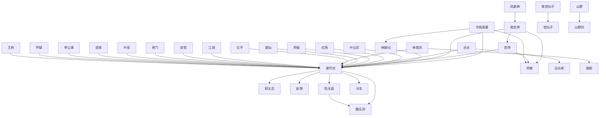

# 人物与关系图：《鸣龙》

## 人物表

### 1. 谢尽欢

- 出现次数：14354
- 覆盖章节数：644
- 首次出现：第 1 章
- 最后出现：第 649 章
- 身份/行为线索：姓名候选(14321)、人物行为/发言(33)

### 2. 令狐青墨

- 出现次数：1949
- 覆盖章节数：258
- 首次出现：第 2 章
- 最后出现：第 649 章
- 身份/行为线索：姓名候选(1946)、人物行为/发言(3)

### 3. 郭太后

- 出现次数：1117
- 覆盖章节数：209
- 首次出现：第 112 章
- 最后出现：第 649 章
- 身份/行为线索：姓名候选(1115)、人物行为/发言(2)

### 4. 林婉仪

- 出现次数：1429
- 覆盖章节数：186
- 首次出现：第 5 章
- 最后出现：第 649 章
- 身份/行为线索：姓名候选(1427)、人物行为/发言(2)

### 5. 南宫烨

- 出现次数：280
- 覆盖章节数：164
- 首次出现：第 5 章
- 最后出现：第 646 章
- 身份/行为线索：姓名候选(276)、人物行为/发言(4)

### 6. 宫烨

- 出现次数：267
- 覆盖章节数：161
- 首次出现：第 5 章
- 最后出现：第 646 章
- 身份/行为线索：姓名候选(267)

### 7. 陆无真

- 出现次数：531
- 覆盖章节数：154
- 首次出现：第 11 章
- 最后出现：第 648 章
- 身份/行为线索：姓名候选(530)、人物行为/发言(1)

### 8. 林紫苏

- 出现次数：798
- 覆盖章节数：150
- 首次出现：第 5 章
- 最后出现：第 647 章
- 身份/行为线索：姓名候选(797)、人物行为/发言(1)

### 9. 叶云迟

- 出现次数：1033
- 覆盖章节数：139
- 首次出现：第 355 章
- 最后出现：第 649 章
- 身份/行为线索：姓名候选(1032)、人物行为/发言(1)

### 10. 红殇

- 出现次数：189
- 覆盖章节数：125
- 首次出现：第 6 章
- 最后出现：第 649 章
- 身份/行为线索：姓名候选(189)

### 11. 魏无异

- 出现次数：396
- 覆盖章节数：100
- 首次出现：第 39 章
- 最后出现：第 632 章
- 身份/行为线索：姓名候选(395)、人物行为/发言(1)

### 12. 左右打

- 出现次数：105
- 覆盖章节数：93
- 首次出现：第 2 章
- 最后出现：第 649 章
- 身份/行为线索：姓名候选(105)

### 13. 杨化仙

- 出现次数：355
- 覆盖章节数：87
- 首次出现：第 278 章
- 最后出现：第 622 章
- 身份/行为线索：姓名候选(354)、人物行为/发言(1)

### 14. 杨大彪

- 出现次数：279
- 覆盖章节数：81
- 首次出现：第 2 章
- 最后出现：第 648 章
- 身份/行为线索：姓名候选(278)、人物行为/发言(1)

### 15. 房间内

- 出现次数：95
- 覆盖章节数：79
- 首次出现：第 7 章
- 最后出现：第 647 章
- 身份/行为线索：姓名候选(95)

### 16. 古怪

- 出现次数：72
- 覆盖章节数：70
- 首次出现：第 22 章
- 最后出现：第 647 章
- 身份/行为线索：姓名候选(72)

### 17. 南宫掌门

- 出现次数：116
- 覆盖章节数：69
- 首次出现：第 9 章
- 最后出现：第 643 章
- 身份/行为线索：姓名候选(116)

### 18. 姜仙

- 出现次数：113
- 覆盖章节数：69
- 首次出现：第 238 章
- 最后出现：第 638 章
- 身份/行为线索：姓名候选(112)、人物行为/发言(1)

### 19. 赵翎

- 出现次数：106
- 覆盖章节数：67
- 首次出现：第 247 章
- 最后出现：第 640 章
- 身份/行为线索：姓名候选(104)、人物行为/发言(2)

### 20. 段时间

- 出现次数：77
- 覆盖章节数：63
- 首次出现：第 4 章
- 最后出现：第 648 章
- 身份/行为线索：姓名候选(77)

### 21. 司空天渊

- 出现次数：280
- 覆盖章节数：61
- 首次出现：第 77 章
- 最后出现：第 648 章
- 身份/行为线索：姓名候选(280)

### 22. 吕炎

- 出现次数：115
- 覆盖章节数：60
- 首次出现：第 221 章
- 最后出现：第 647 章
- 身份/行为线索：姓名候选(114)、人物行为/发言(1)

### 23. 司空老祖

- 出现次数：111
- 覆盖章节数：59
- 首次出现：第 38 章
- 最后出现：第 522 章
- 身份/行为线索：姓名候选(111)

### 24. 令狐姑娘

- 出现次数：83
- 覆盖章节数：59
- 首次出现：第 9 章
- 最后出现：第 612 章
- 身份/行为线索：姓名候选(83)

### 25. 凤美眸

- 出现次数：64
- 覆盖章节数：58
- 首次出现：第 121 章
- 最后出现：第 646 章
- 身份/行为线索：姓名候选(64)

### 26. 林大夫

- 出现次数：98
- 覆盖章节数：57
- 首次出现：第 11 章
- 最后出现：第 606 章
- 身份/行为线索：姓名候选(98)

### 27. 毕竟她

- 出现次数：62
- 覆盖章节数：56
- 首次出现：第 10 章
- 最后出现：第 649 章
- 身份/行为线索：姓名候选(62)

### 28. 容易

- 出现次数：61
- 覆盖章节数：56
- 首次出现：第 20 章
- 最后出现：第 626 章
- 身份/行为线索：姓名候选(61)

### 29. 时辰

- 出现次数：62
- 覆盖章节数：53
- 首次出现：第 24 章
- 最后出现：第 644 章
- 身份/行为线索：姓名候选(62)

### 30. 连璧

- 出现次数：78
- 覆盖章节数：52
- 首次出现：第 38 章
- 最后出现：第 633 章
- 身份/行为线索：姓名候选(78)

### 31. 房门

- 出现次数：63
- 覆盖章节数：52
- 首次出现：第 11 章
- 最后出现：第 649 章
- 身份/行为线索：姓名候选(63)

### 32. 满意足

- 出现次数：52
- 覆盖章节数：52
- 首次出现：第 86 章
- 最后出现：第 641 章
- 身份/行为线索：姓名候选(52)

### 33. 李公浦

- 出现次数：319
- 覆盖章节数：51
- 首次出现：第 17 章
- 最后出现：第 622 章
- 身份/行为线索：姓名候选(317)、人物行为/发言(2)

### 34. 山掌门

- 出现次数：59
- 覆盖章节数：50
- 首次出现：第 8 章
- 最后出现：第 644 章
- 身份/行为线索：姓名候选(59)

### 35. 黄麟真

- 出现次数：151
- 覆盖章节数：49
- 首次出现：第 191 章
- 最后出现：第 632 章
- 身份/行为线索：姓名候选(151)

### 36. 左右看

- 出现次数：53
- 覆盖章节数：49
- 首次出现：第 4 章
- 最后出现：第 644 章
- 身份/行为线索：姓名候选(53)

### 37. 许多

- 出现次数：53
- 覆盖章节数：49
- 首次出现：第 43 章
- 最后出现：第 647 章
- 身份/行为线索：姓名候选(53)

### 38. 南宫烨眼

- 出现次数：52
- 覆盖章节数：49
- 首次出现：第 107 章
- 最后出现：第 646 章
- 身份/行为线索：姓名候选(52)

### 39. 南宫仙子

- 出现次数：88
- 覆盖章节数：48
- 首次出现：第 5 章
- 最后出现：第 637 章
- 身份/行为线索：姓名候选(88)

### 40. 宫仙子

- 出现次数：82
- 覆盖章节数：48
- 首次出现：第 5 章
- 最后出现：第 637 章
- 身份/行为线索：姓名候选(82)

### 41. 明说

- 出现次数：53
- 覆盖章节数：48
- 首次出现：第 32 章
- 最后出现：第 649 章
- 身份/行为线索：姓名候选(53)

### 42. 宫烨眼

- 出现次数：51
- 覆盖章节数：48
- 首次出现：第 107 章
- 最后出现：第 646 章
- 身份/行为线索：姓名候选(51)

### 43. 何参

- 出现次数：81
- 覆盖章节数：47
- 首次出现：第 29 章
- 最后出现：第 638 章
- 身份/行为线索：姓名候选(78)、人物行为/发言(3)

### 44. 安排

- 出现次数：58
- 覆盖章节数：47
- 首次出现：第 70 章
- 最后出现：第 642 章
- 身份/行为线索：姓名候选(58)

### 45. 红耳赤

- 出现次数：55
- 覆盖章节数：47
- 首次出现：第 15 章
- 最后出现：第 640 章
- 身份/行为线索：姓名候选(55)

### 46. 高人

- 出现次数：52
- 覆盖章节数：47
- 首次出现：第 4 章
- 最后出现：第 562 章
- 身份/行为线索：姓名候选(52)

### 47. 水晶球

- 出现次数：80
- 覆盖章节数：46
- 首次出现：第 94 章
- 最后出现：第 641 章
- 身份/行为线索：姓名候选(80)

### 48. 高手

- 出现次数：62
- 覆盖章节数：46
- 首次出现：第 3 章
- 最后出现：第 649 章
- 身份/行为线索：姓名候选(62)

### 49. 马车

- 出现次数：61
- 覆盖章节数：46
- 首次出现：第 5 章
- 最后出现：第 647 章
- 身份/行为线索：姓名候选(61)

### 50. 陆掌教

- 出现次数：71
- 覆盖章节数：45
- 首次出现：第 138 章
- 最后出现：第 645 章
- 身份/行为线索：姓名候选(71)

### 51. 叶圣

- 出现次数：67
- 覆盖章节数：45
- 首次出现：第 195 章
- 最后出现：第 648 章
- 身份/行为线索：姓名候选(67)

### 52. 谢郎

- 出现次数：62
- 覆盖章节数：45
- 首次出现：第 158 章
- 最后出现：第 637 章
- 身份/行为线索：姓名候选(62)

### 53. 师尊

- 出现次数：56
- 覆盖章节数：45
- 首次出现：第 109 章
- 最后出现：第 647 章
- 身份/行为线索：姓名候选(56)

### 54. 方式

- 出现次数：50
- 覆盖章节数：45
- 首次出现：第 3 章
- 最后出现：第 649 章
- 身份/行为线索：姓名候选(50)

### 55. 沙沙沙

- 出现次数：50
- 覆盖章节数：45
- 首次出现：第 7 章
- 最后出现：第 627 章
- 身份/行为线索：姓名候选(50)

### 56. 祖师爷

- 出现次数：73
- 覆盖章节数：44
- 首次出现：第 38 章
- 最后出现：第 644 章
- 身份/行为线索：姓名候选(73)

### 57. 安慰

- 出现次数：48
- 覆盖章节数：44
- 首次出现：第 15 章
- 最后出现：第 628 章
- 身份/行为线索：姓名候选(48)

### 58. 边缘

- 出现次数：48
- 覆盖章节数：44
- 首次出现：第 18 章
- 最后出现：第 630 章
- 身份/行为线索：姓名候选(48)

### 59. 刘庆之

- 出现次数：88
- 覆盖章节数：43
- 首次出现：第 2 章
- 最后出现：第 648 章
- 身份/行为线索：姓名候选(88)

### 60. 南宫烨觉

- 出现次数：49
- 覆盖章节数：43
- 首次出现：第 107 章
- 最后出现：第 618 章
- 身份/行为线索：姓名候选(49)

### 61. 宫烨觉

- 出现次数：49
- 覆盖章节数：43
- 首次出现：第 107 章
- 最后出现：第 618 章
- 身份/行为线索：姓名候选(49)

### 62. 连忙道

- 出现次数：44
- 覆盖章节数：43
- 首次出现：第 5 章
- 最后出现：第 647 章
- 身份/行为线索：姓名候选(44)

### 63. 金丝眼

- 出现次数：55
- 覆盖章节数：42
- 首次出现：第 5 章
- 最后出现：第 644 章
- 身份/行为线索：姓名候选(55)

### 64. 王府

- 出现次数：54
- 覆盖章节数：42
- 首次出现：第 10 章
- 最后出现：第 511 章
- 身份/行为线索：姓名候选(54)

### 65. 江湖

- 出现次数：51
- 覆盖章节数：42
- 首次出现：第 3 章
- 最后出现：第 638 章
- 身份/行为线索：姓名候选(51)

### 66. 高兴

- 出现次数：51
- 覆盖章节数：42
- 首次出现：第 16 章
- 最后出现：第 646 章
- 身份/行为线索：姓名候选(51)

### 67. 侯府

- 出现次数：47
- 覆盖章节数：42
- 首次出现：第 187 章
- 最后出现：第 639 章
- 身份/行为线索：姓名候选(47)

### 68. 红唇

- 出现次数：45
- 覆盖章节数：42
- 首次出现：第 126 章
- 最后出现：第 639 章
- 身份/行为线索：姓名候选(45)

### 69. 任何人

- 出现次数：43
- 覆盖章节数：42
- 首次出现：第 4 章
- 最后出现：第 649 章
- 身份/行为线索：姓名候选(43)

### 70. 房内

- 出现次数：46
- 覆盖章节数：41
- 首次出现：第 64 章
- 最后出现：第 640 章
- 身份/行为线索：姓名候选(46)

### 71. 红颜知

- 出现次数：47
- 覆盖章节数：40
- 首次出现：第 50 章
- 最后出现：第 647 章
- 身份/行为线索：姓名候选(47)

### 72. 毕竟谢

- 出现次数：44
- 覆盖章节数：40
- 首次出现：第 16 章
- 最后出现：第 647 章
- 身份/行为线索：姓名候选(44)

### 73. 山巅老

- 出现次数：43
- 覆盖章节数：40
- 首次出现：第 9 章
- 最后出现：第 647 章
- 身份/行为线索：姓名候选(43)

### 74. 南宫烨知

- 出现次数：49
- 覆盖章节数：39
- 首次出现：第 107 章
- 最后出现：第 649 章
- 身份/行为线索：姓名候选(49)

### 75. 宫烨知

- 出现次数：49
- 覆盖章节数：39
- 首次出现：第 107 章
- 最后出现：第 649 章
- 身份/行为线索：姓名候选(49)

### 76. 南宫烨本

- 出现次数：49
- 覆盖章节数：39
- 首次出现：第 132 章
- 最后出现：第 646 章
- 身份/行为线索：姓名候选(49)

### 77. 舒服

- 出现次数：46
- 覆盖章节数：39
- 首次出现：第 7 章
- 最后出现：第 618 章
- 身份/行为线索：姓名候选(46)

### 78. 马迹

- 出现次数：44
- 覆盖章节数：39
- 首次出现：第 17 章
- 最后出现：第 604 章
- 身份/行为线索：姓名候选(44)

### 79. 南宫烨身

- 出现次数：44
- 覆盖章节数：39
- 首次出现：第 100 章
- 最后出现：第 645 章
- 身份/行为线索：姓名候选(44)

### 80. 宫烨身

- 出现次数：44
- 覆盖章节数：39
- 首次出现：第 100 章
- 最后出现：第 645 章
- 身份/行为线索：姓名候选(44)

### 81. 白道袍

- 出现次数：43
- 覆盖章节数：39
- 首次出现：第 136 章
- 最后出现：第 646 章
- 身份/行为线索：姓名候选(43)

### 82. 任务

- 出现次数：42
- 覆盖章节数：39
- 首次出现：第 103 章
- 最后出现：第 638 章
- 身份/行为线索：姓名候选(42)

### 83. 郭小美

- 出现次数：74
- 覆盖章节数：38
- 首次出现：第 449 章
- 最后出现：第 643 章
- 身份/行为线索：姓名候选(74)

### 84. 方通明

- 出现次数：60
- 覆盖章节数：38
- 首次出现：第 15 章
- 最后出现：第 647 章
- 身份/行为线索：姓名候选(60)

### 85. 宫烨本

- 出现次数：48
- 覆盖章节数：38
- 首次出现：第 132 章
- 最后出现：第 646 章
- 身份/行为线索：姓名候选(48)

### 86. 左手

- 出现次数：43
- 覆盖章节数：38
- 首次出现：第 9 章
- 最后出现：第 623 章
- 身份/行为线索：姓名候选(43)

### 87. 全身

- 出现次数：41
- 覆盖章节数：38
- 首次出现：第 60 章
- 最后出现：第 623 章
- 身份/行为线索：姓名候选(41)

### 88. 侯管家

- 出现次数：106
- 覆盖章节数：37
- 首次出现：第 7 章
- 最后出现：第 572 章
- 身份/行为线索：姓名候选(106)

### 89. 祝祭派

- 出现次数：67
- 覆盖章节数：37
- 首次出现：第 77 章
- 最后出现：第 647 章
- 身份/行为线索：姓名候选(67)

### 90. 李敕墨

- 出现次数：64
- 覆盖章节数：37
- 首次出现：第 126 章
- 最后出现：第 648 章
- 身份/行为线索：姓名候选(64)

### 91. 吕炎老

- 出现次数：53
- 覆盖章节数：37
- 首次出现：第 226 章
- 最后出现：第 635 章
- 身份/行为线索：姓名候选(53)

### 92. 叶祠

- 出现次数：52
- 覆盖章节数：37
- 首次出现：第 38 章
- 最后出现：第 634 章
- 身份/行为线索：姓名候选(52)

### 93. 南宫烨听

- 出现次数：41
- 覆盖章节数：37
- 首次出现：第 100 章
- 最后出现：第 646 章
- 身份/行为线索：姓名候选(41)

### 94. 宫烨听

- 出现次数：41
- 覆盖章节数：37
- 首次出现：第 100 章
- 最后出现：第 646 章
- 身份/行为线索：姓名候选(41)

### 95. 后脑勺

- 出现次数：40
- 覆盖章节数：37
- 首次出现：第 53 章
- 最后出现：第 647 章
- 身份/行为线索：姓名候选(40)

### 96. 房间外

- 出现次数：40
- 覆盖章节数：37
- 首次出现：第 76 章
- 最后出现：第 618 章
- 身份/行为线索：姓名候选(40)

### 97. 明显有

- 出现次数：39
- 覆盖章节数：37
- 首次出现：第 53 章
- 最后出现：第 646 章
- 身份/行为线索：姓名候选(39)

### 98. 步青崖

- 出现次数：141
- 覆盖章节数：36
- 首次出现：第 237 章
- 最后出现：第 648 章
- 身份/行为线索：姓名候选(141)

### 99. 师姐

- 出现次数：47
- 覆盖章节数：36
- 首次出现：第 43 章
- 最后出现：第 647 章
- 身份/行为线索：姓名候选(47)

### 100. 师祖

- 出现次数：44
- 覆盖章节数：36
- 首次出现：第 38 章
- 最后出现：第 622 章
- 身份/行为线索：姓名候选(44)

## 关系边

- 南宫烨 <-> 宫烨：共现 2427 次，覆盖第 5-649 章，关系线索：同章共现(2282)、师尊(93)、师父(20)、姐妹(10)、对手(8)、弟子(6)、朋友(4)、追杀(2)
- 令狐青墨 <-> 谢尽欢：共现 426 次，覆盖第 9-649 章，关系线索：同章共现(391)、师父(16)、朋友(10)、师尊(8)、学生(1)、弟子(1)
- 南宫烨 <-> 谢尽欢：共现 424 次，覆盖第 5-647 章，关系线索：同章共现(402)、师尊(16)、师父(3)、对手(1)、弟子(1)、保护(1)、姐妹(1)
- 宫烨 <-> 谢尽欢：共现 424 次，覆盖第 5-647 章，关系线索：同章共现(402)、师尊(16)、师父(3)、对手(1)、弟子(1)、保护(1)、姐妹(1)
- 林婉仪 <-> 谢尽欢：共现 363 次，覆盖第 11-647 章，关系线索：同章共现(355)、师父(5)、保护(1)、弟子(1)、师尊(1)
- 谢尽欢 <-> 郭太后：共现 227 次，覆盖第 127-649 章，关系线索：同章共现(222)、朋友(1)、弟子(1)、父亲(1)、对手(1)、保护(1)、上司(1)
- 叶云迟 <-> 谢尽欢：共现 215 次，覆盖第 359-640 章，关系线索：同章共现(209)、学生(2)、妻子(1)、对手(1)、朋友(1)、保护(1)、老师(1)
- 吕炎 <-> 谢尽欢：共现 205 次，覆盖第 224-647 章，关系线索：同章共现(199)、追杀(2)、师父(1)、交易(1)、保护(1)、对手(1)
- 红殇 <-> 谢尽欢：共现 189 次，覆盖第 6-649 章，关系线索：同章共现(184)、对手(1)、上司(1)、师尊(1)、保护(1)、弟子(1)
- 师姐 <-> 谢尽欢：共现 147 次，覆盖第 110-646 章，关系线索：同章共现(144)、姐妹(3)
- 谢尽欢 <-> 赵翎：共现 142 次，覆盖第 250-640 章，关系线索：同章共现(140)、保护(1)、师父(1)
- 姜仙 <-> 谢尽欢：共现 140 次，覆盖第 246-631 章，关系线索：同章共现(135)、保护(1)、兄弟(1)、朋友(1)、上司(1)、命令(1)
- 左手 <-> 谢尽欢：共现 120 次，覆盖第 3-623 章，关系线索：同章共现(117)、敌人(1)、师尊(1)、对手(1)
- 林紫苏 <-> 谢尽欢：共现 119 次，覆盖第 5-626 章，关系线索：同章共现(117)、朋友(1)、对手(1)
- 南宫烨 <-> 师尊：共现 93 次，覆盖第 182-645 章，关系线索：师尊(93)、命令(1)、保护(1)、弟子(1)
- 宫烨 <-> 师尊：共现 93 次，覆盖第 182-645 章，关系线索：师尊(93)、命令(1)、保护(1)、弟子(1)
- 南宫仙子 <-> 宫仙子：共现 84 次，覆盖第 5-637 章，关系线索：同章共现(76)、师父(6)、弟子(1)、朋友(1)、儿子(1)
- 江湖 <-> 谢尽欢：共现 81 次，覆盖第 9-642 章，关系线索：同章共现(76)、对手(1)、弟子(1)、师尊(1)、朋友(1)、交易(1)
- 令狐青墨 <-> 师尊：共现 76 次，覆盖第 127-647 章，关系线索：师尊(76)、师父(7)
- 安慰 <-> 谢尽欢：共现 72 次，覆盖第 15-649 章，关系线索：同章共现(69)、对手(1)、交易(1)、师尊(1)
- 谢尽欢 <-> 魏无异：共现 70 次，覆盖第 91-562 章，关系线索：同章共现(65)、弟子(1)、对手(1)、朋友(1)、父亲(1)、交易(1)
- 令狐青墨 <-> 林婉仪：共现 67 次，覆盖第 17-571 章，关系线索：同章共现(65)、师尊(1)、女儿(1)
- 房门 <-> 谢尽欢：共现 64 次，覆盖第 11-649 章，关系线索：同章共现(64)
- 谢尽欢 <-> 陆无真：共现 64 次，覆盖第 24-644 章，关系线索：同章共现(63)、交易(1)
- 叶圣 <-> 谢尽欢：共现 62 次，覆盖第 197-648 章，关系线索：同章共现(62)
- 容易 <-> 谢尽欢：共现 61 次，覆盖第 4-620 章，关系线索：同章共现(59)、盟友(1)、师父(1)
- 李公浦 <-> 谢尽欢：共现 60 次，覆盖第 75-520 章，关系线索：同章共现(59)、对手(1)
- 怀疑 <-> 谢尽欢：共现 59 次，覆盖第 2-624 章，关系线索：同章共现(55)、儿子(1)、追杀(1)、对手(1)、弟子(1)
- 吕炎 <-> 吕炎老：共现 56 次，覆盖第 226-635 章，关系线索：同章共现(56)
- 王府 <-> 谢尽欢：共现 55 次，覆盖第 5-322 章，关系线索：同章共现(53)、师父(1)、朋友(1)
- 林紫苏 <-> 谢郎：共现 54 次，覆盖第 218-637 章，关系线索：同章共现(54)
- 山野 <-> 山野间：共现 53 次，覆盖第 1-619 章，关系线索：同章共现(53)
- 谢尽欢 <-> 马车：共现 53 次，覆盖第 16-634 章，关系线索：同章共现(52)、上司(1)
- 陆无真 <-> 魏无异：共现 53 次，覆盖第 39-621 章，关系线索：同章共现(50)、儿子(1)、对手(1)、交易(1)
- 凤美眸 <-> 南宫烨：共现 53 次，覆盖第 124-646 章，关系线索：同章共现(52)、师尊(1)
- 凤美眸 <-> 宫烨：共现 53 次，覆盖第 124-646 章，关系线索：同章共现(52)、师尊(1)
- 左右打 <-> 谢尽欢：共现 50 次，覆盖第 7-635 章，关系线索：同章共现(50)
- 解开 <-> 谢尽欢：共现 50 次，覆盖第 12-634 章，关系线索：同章共现(48)、交易(1)、朋友(1)
- 南宫烨 <-> 南宫烨眼：共现 50 次，覆盖第 107-646 章，关系线索：同章共现(50)
- 南宫烨 <-> 宫烨眼：共现 50 次，覆盖第 107-646 章，关系线索：同章共现(50)
- 南宫烨眼 <-> 宫烨：共现 50 次，覆盖第 107-646 章，关系线索：同章共现(50)
- 宫烨 <-> 宫烨眼：共现 50 次，覆盖第 107-646 章，关系线索：同章共现(50)
- 南宫烨眼 <-> 宫烨眼：共现 50 次，覆盖第 107-646 章，关系线索：同章共现(50)
- 南宫烨 <-> 南宫烨知：共现 49 次，覆盖第 107-649 章，关系线索：同章共现(43)、师尊(4)、师父(2)、姐妹(1)、对手(1)、命令(1)
- 南宫烨 <-> 宫烨知：共现 49 次，覆盖第 107-649 章，关系线索：同章共现(43)、师尊(4)、师父(2)、姐妹(1)、对手(1)、命令(1)
- 南宫烨知 <-> 宫烨：共现 49 次，覆盖第 107-649 章，关系线索：同章共现(43)、师尊(4)、师父(2)、姐妹(1)、对手(1)、命令(1)
- 宫烨 <-> 宫烨知：共现 49 次，覆盖第 107-649 章，关系线索：同章共现(43)、师尊(4)、师父(2)、姐妹(1)、对手(1)、命令(1)
- 南宫烨知 <-> 宫烨知：共现 49 次，覆盖第 107-649 章，关系线索：同章共现(43)、师尊(4)、师父(2)、姐妹(1)、对手(1)、命令(1)
- 南宫烨 <-> 南宫烨本：共现 49 次，覆盖第 132-646 章，关系线索：同章共现(46)、师尊(3)
- 南宫烨 <-> 宫烨本：共现 49 次，覆盖第 132-646 章，关系线索：同章共现(46)、师尊(3)
- 南宫烨本 <-> 宫烨：共现 49 次，覆盖第 132-646 章，关系线索：同章共现(46)、师尊(3)
- 宫烨 <-> 宫烨本：共现 49 次，覆盖第 132-646 章，关系线索：同章共现(46)、师尊(3)
- 南宫烨本 <-> 宫烨本：共现 49 次，覆盖第 132-646 章，关系线索：同章共现(46)、师尊(3)
- 南宫烨 <-> 南宫烨觉：共现 48 次，覆盖第 107-618 章，关系线索：同章共现(39)、师尊(6)、对手(1)、师父(1)、姐妹(1)
- 南宫烨 <-> 宫烨觉：共现 48 次，覆盖第 107-618 章，关系线索：同章共现(39)、师尊(6)、对手(1)、师父(1)、姐妹(1)
- 南宫烨觉 <-> 宫烨：共现 48 次，覆盖第 107-618 章，关系线索：同章共现(39)、师尊(6)、对手(1)、师父(1)、姐妹(1)
- 宫烨 <-> 宫烨觉：共现 48 次，覆盖第 107-618 章，关系线索：同章共现(39)、师尊(6)、对手(1)、师父(1)、姐妹(1)
- 南宫烨觉 <-> 宫烨觉：共现 48 次，覆盖第 107-618 章，关系线索：同章共现(39)、师尊(6)、对手(1)、师父(1)、姐妹(1)
- 司空天渊 <-> 谢尽欢：共现 47 次，覆盖第 237-582 章，关系线索：同章共现(45)、师父(2)
- 杨化仙 <-> 谢尽欢：共现 47 次，覆盖第 289-620 章，关系线索：同章共现(44)、追杀(1)、对手(1)、保护(1)
- 师尊 <-> 谢尽欢：共现 46 次，覆盖第 157-647 章，关系线索：师尊(46)、弟子(1)、保护(1)
- 杨大彪 <-> 谢尽欢：共现 45 次，覆盖第 2-347 章，关系线索：同章共现(43)、朋友(1)、兄弟(1)
- 令狐青墨 <-> 赵翎：共现 45 次，覆盖第 276-615 章，关系线索：同章共现(43)、朋友(1)、师父(1)
- 南宫烨 <-> 南宫烨身：共现 44 次，覆盖第 100-645 章，关系线索：同章共现(43)、弟子(1)
- 南宫烨 <-> 宫烨身：共现 44 次，覆盖第 100-645 章，关系线索：同章共现(43)、弟子(1)
- 南宫烨身 <-> 宫烨：共现 44 次，覆盖第 100-645 章，关系线索：同章共现(43)、弟子(1)
- 宫烨 <-> 宫烨身：共现 44 次，覆盖第 100-645 章，关系线索：同章共现(43)、弟子(1)
- 南宫烨身 <-> 宫烨身：共现 44 次，覆盖第 100-645 章，关系线索：同章共现(43)、弟子(1)
- 毕竟谢 <-> 谢尽欢：共现 41 次，覆盖第 16-647 章，关系线索：同章共现(39)、保护(1)、师父(1)
- 谢尽欢 <-> 边缘：共现 41 次，覆盖第 27-631 章，关系线索：同章共现(41)
- 南宫烨 <-> 南宫烨听：共现 41 次，覆盖第 100-646 章，关系线索：同章共现(39)、师尊(2)
- 南宫烨 <-> 宫烨听：共现 41 次，覆盖第 100-646 章，关系线索：同章共现(39)、师尊(2)
- 南宫烨听 <-> 宫烨：共现 41 次，覆盖第 100-646 章，关系线索：同章共现(39)、师尊(2)
- 宫烨 <-> 宫烨听：共现 41 次，覆盖第 100-646 章，关系线索：同章共现(39)、师尊(2)
- 南宫烨听 <-> 宫烨听：共现 41 次，覆盖第 100-646 章，关系线索：同章共现(39)、师尊(2)
- 安排 <-> 谢尽欢：共现 39 次，覆盖第 74-644 章，关系线索：同章共现(34)、师父(2)、师尊(1)、弟子(1)、儿子(1)
- 山野 <-> 谢尽欢：共现 38 次，覆盖第 28-574 章，关系线索：同章共现(38)
- 江湖 <-> 魏无异：共现 37 次，覆盖第 83-444 章，关系线索：同章共现(34)、朋友(1)、对手(1)、交易(1)
- 南宫烨 <-> 南宫烨一：共现 36 次，覆盖第 121-646 章，关系线索：同章共现(34)、师尊(2)、保护(1)
- 南宫烨一 <-> 宫烨：共现 36 次，覆盖第 121-646 章，关系线索：同章共现(34)、师尊(2)、保护(1)
- 林婉仪 <-> 金丝眼：共现 33 次，覆盖第 14-642 章，关系线索：同章共现(32)、师父(1)
- 谢尽欢 <-> 高人：共现 33 次，覆盖第 29-620 章，关系线索：同章共现(32)、师父(1)
- 谢尽欢 <-> 高手：共现 33 次，覆盖第 29-547 章，关系线索：同章共现(33)
- 全身 <-> 谢尽欢：共现 32 次，覆盖第 60-640 章，关系线索：同章共现(31)、保护(1)
- 侯管家 <-> 谢尽欢：共现 31 次，覆盖第 7-529 章，关系线索：同章共现(30)、追杀(1)
- 何参 <-> 谢尽欢：共现 30 次，覆盖第 54-541 章，关系线索：同章共现(29)、对手(1)
- 水晶球 <-> 谢尽欢：共现 30 次，覆盖第 94-634 章，关系线索：同章共现(30)
- 谢尽欢 <-> 连璧：共现 30 次，覆盖第 249-609 章，关系线索：同章共现(30)
- 南宫烨 <-> 叶云迟：共现 30 次，覆盖第 384-642 章，关系线索：同章共现(29)、老师(1)
- 叶云迟 <-> 宫烨：共现 30 次，覆盖第 384-642 章，关系线索：同章共现(29)、老师(1)
- 古怪 <-> 谢尽欢：共现 29 次，覆盖第 22-603 章，关系线索：同章共现(28)、师父(1)、朋友(1)
- 师祖 <-> 林紫苏：共现 29 次，覆盖第 305-617 章，关系线索：同章共现(29)
- 令狐青墨 <-> 杨大彪：共现 28 次，覆盖第 3-267 章，关系线索：同章共现(27)、朋友(1)
- 红唇 <-> 谢尽欢：共现 28 次，覆盖第 144-649 章，关系线索：同章共现(27)、师尊(1)
- 令狐青墨 <-> 南宫烨：共现 28 次，覆盖第 204-646 章，关系线索：同章共现(17)、师尊(6)、师父(4)、老师(1)
- 令狐青墨 <-> 宫烨：共现 28 次，覆盖第 204-646 章，关系线索：同章共现(17)、师尊(6)、师父(4)、老师(1)
- 吕炎老 <-> 谢尽欢：共现 28 次，覆盖第 226-635 章，关系线索：同章共现(28)
- 明说 <-> 谢尽欢：共现 27 次，覆盖第 37-649 章，关系线索：同章共现(27)
- 满意足 <-> 谢尽欢：共现 27 次，覆盖第 122-641 章，关系线索：同章共现(27)
- 谢尽欢 <-> 高兴：共现 26 次，覆盖第 115-616 章，关系线索：同章共现(25)、师父(1)
- 刘庆之 <-> 杨大彪：共现 25 次，覆盖第 18-648 章，关系线索：同章共现(23)、兄弟(1)、姐妹(1)
- 谢尽欢 <-> 龙撞柱：共现 25 次，覆盖第 58-624 章，关系线索：同章共现(24)、对手(1)
- 郭太后 <-> 高老魔：共现 25 次，覆盖第 249-570 章，关系线索：同章共现(24)、追杀(1)
- 叶云迟 <-> 赵翎：共现 25 次，覆盖第 411-640 章，关系线索：同章共现(25)
- 左右看 <-> 谢尽欢：共现 24 次，覆盖第 13-644 章，关系线索：同章共现(24)
- 后脑勺 <-> 谢尽欢：共现 24 次，覆盖第 96-649 章，关系线索：同章共现(24)
- 水晶球 <-> 红殇：共现 23 次，覆盖第 125-641 章，关系线索：同章共现(23)
- 姜仙 <-> 郭太后：共现 23 次，覆盖第 238-615 章，关系线索：同章共现(23)
- 方式 <-> 谢尽欢：共现 22 次，覆盖第 3-649 章，关系线索：同章共现(22)
- 严重 <-> 谢尽欢：共现 22 次，覆盖第 4-613 章，关系线索：同章共现(22)
- 谢尽欢 <-> 连忙道：共现 21 次，覆盖第 31-647 章，关系线索：同章共现(19)、师尊(1)、学生(1)
- 令狐青墨 <-> 师祖：共现 21 次，覆盖第 38-645 章，关系线索：同章共现(18)、师父(1)、朋友(1)、命令(1)
- 任务 <-> 谢尽欢：共现 21 次，覆盖第 69-635 章，关系线索：同章共现(20)、师尊(1)
- 谢郎 <-> 郭太后：共现 21 次，覆盖第 158-546 章，关系线索：同章共现(21)
- 吕炎 <-> 黄麟真：共现 21 次，覆盖第 244-626 章，关系线索：同章共现(20)、师父(1)
- 步青崖 <-> 谢尽欢：共现 21 次，覆盖第 264-648 章，关系线索：同章共现(20)、命令(1)
- 解释道 <-> 谢尽欢：共现 20 次，覆盖第 46-634 章，关系线索：同章共现(19)、师父(1)
- 段时间 <-> 谢尽欢：共现 20 次，覆盖第 71-648 章，关系线索：同章共现(17)、师父(1)、对手(1)、师尊(1)
- 杨化仙 <-> 黄麟真：共现 20 次，覆盖第 279-557 章，关系线索：同章共现(18)、对手(1)、盟友(1)
- 刘庆之 <-> 谢尽欢：共现 19 次，覆盖第 17-629 章，关系线索：同章共现(18)、兄弟(1)
- 相合 <-> 谢尽欢：共现 19 次，覆盖第 94-646 章，关系线索：同章共现(18)、弟子(1)
- 南宫烨 <-> 陆无真：共现 19 次，覆盖第 99-626 章，关系线索：同章共现(19)
- 宫烨 <-> 陆无真：共现 19 次，覆盖第 99-626 章，关系线索：同章共现(19)
- 叶圣 <-> 魏无异：共现 19 次，覆盖第 212-632 章，关系线索：同章共现(17)、弟子(1)、师父(1)
- 姜仙 <-> 林紫苏：共现 19 次，覆盖第 502-637 章，关系线索：同章共现(18)、对手(1)
- 令狐青墨 <-> 王府：共现 18 次，覆盖第 2-315 章，关系线索：同章共现(16)、姐妹(1)、朋友(1)
- 叶祠 <-> 谢尽欢：共现 18 次，覆盖第 83-648 章，关系线索：同章共现(15)、师父(1)、对手(1)、女儿(1)
- 林大夫 <-> 谢尽欢：共现 17 次，覆盖第 16-606 章，关系线索：同章共现(17)
- 许多 <-> 谢尽欢：共现 17 次，覆盖第 43-614 章，关系线索：同章共现(17)
- 南宫烨 <-> 山掌门：共现 17 次，覆盖第 97-642 章，关系线索：同章共现(14)、师父(1)、弟子(1)、姐妹(1)
- 宫烨 <-> 山掌门：共现 17 次，覆盖第 97-642 章，关系线索：同章共现(14)、师父(1)、弟子(1)、姐妹(1)
- 南宫烨知 <-> 谢尽欢：共现 17 次，覆盖第 125-646 章，关系线索：同章共现(16)、师尊(1)
- 宫烨知 <-> 谢尽欢：共现 17 次，覆盖第 125-646 章，关系线索：同章共现(16)、师尊(1)
- 令狐青墨 <-> 红耳赤：共现 17 次，覆盖第 139-632 章，关系线索：同章共现(16)、师尊(1)
- 杨化仙 <-> 连璧：共现 17 次，覆盖第 258-598 章，关系线索：同章共现(17)
- 南宫烨 <-> 赵翎：共现 17 次，覆盖第 276-623 章，关系线索：同章共现(16)、师父(1)
- 宫烨 <-> 赵翎：共现 17 次，覆盖第 276-623 章，关系线索：同章共现(16)、师父(1)
- 时辰 <-> 谢尽欢：共现 16 次，覆盖第 7-646 章，关系线索：同章共现(16)
- 南宫掌门 <-> 谢尽欢：共现 16 次，覆盖第 9-611 章，关系线索：同章共现(15)、对手(1)
- 南宫烨 <-> 白道袍：共现 16 次，覆盖第 174-644 章，关系线索：同章共现(16)
- 宫烨 <-> 白道袍：共现 16 次，覆盖第 174-644 章，关系线索：同章共现(16)
- 叶圣 <-> 陆无真：共现 16 次，覆盖第 202-648 章，关系线索：同章共现(14)、师父(1)、学生(1)
- 侯府 <-> 谢尽欢：共现 16 次，覆盖第 217-647 章，关系线索：同章共现(15)、师父(1)
- 令狐青墨 <-> 林大夫：共现 15 次，覆盖第 47-496 章，关系线索：同章共现(15)
- 司空老祖 <-> 谢尽欢：共现 15 次，覆盖第 117-508 章，关系线索：同章共现(14)、师父(1)
- 房间内 <-> 谢尽欢：共现 15 次，覆盖第 118-609 章，关系线索：同章共现(15)
- 林婉仪 <-> 林紫苏：共现 14 次，覆盖第 5-602 章，关系线索：同章共现(12)、学生(2)
- 谢尽欢 <-> 路数：共现 14 次，覆盖第 130-588 章，关系线索：同章共现(14)
- 房内 <-> 谢尽欢：共现 14 次，覆盖第 158-641 章，关系线索：同章共现(14)
- 司空天渊 <-> 杨化仙：共现 14 次，覆盖第 402-515 章，关系线索：同章共现(14)
- 陆无真 <-> 黄麟真：共现 14 次，覆盖第 454-632 章，关系线索：同章共现(14)
- 谢尽欢 <-> 马迹：共现 13 次，覆盖第 43-489 章，关系线索：同章共现(12)、弟子(1)
- 师祖 <-> 谢尽欢：共现 13 次，覆盖第 83-632 章，关系线索：同章共现(10)、师父(3)
- 司空天渊 <-> 陆无真：共现 13 次，覆盖第 83-519 章，关系线索：同章共现(13)
- 南宫烨 <-> 林婉仪：共现 13 次，覆盖第 99-605 章，关系线索：同章共现(13)
- 宫烨 <-> 林婉仪：共现 13 次，覆盖第 99-605 章，关系线索：同章共现(13)
- 南宫烨 <-> 解开：共现 13 次，覆盖第 100-616 章，关系线索：同章共现(13)
- 宫烨 <-> 解开：共现 13 次，覆盖第 100-616 章，关系线索：同章共现(13)
- 古怪 <-> 林婉仪：共现 13 次，覆盖第 104-641 章，关系线索：同章共现(12)、师父(1)
- 谢尽欢 <-> 黄麟真：共现 13 次，覆盖第 246-624 章，关系线索：同章共现(13)

## Mermaid 关系草图

